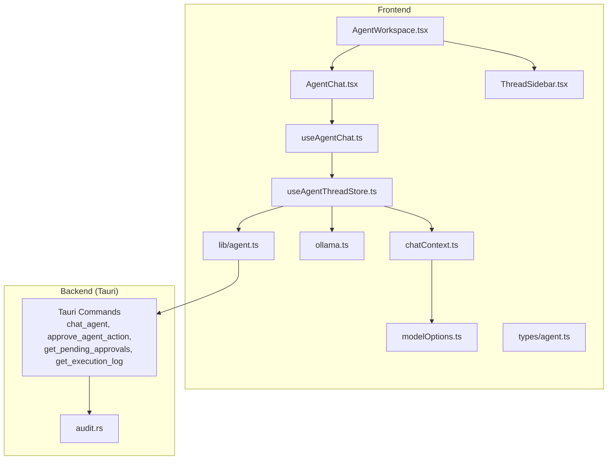
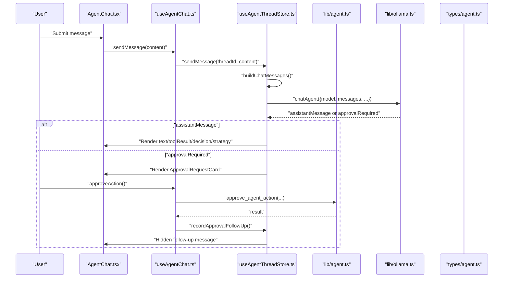
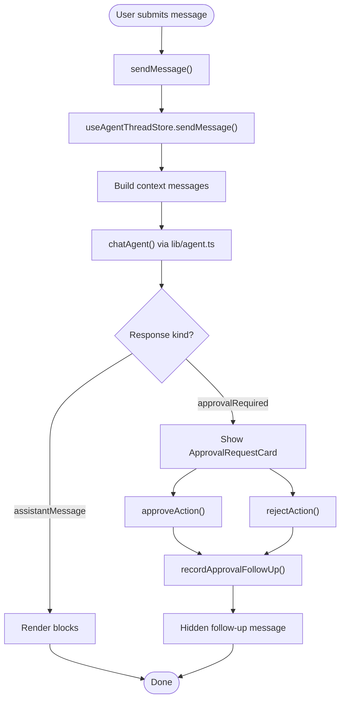
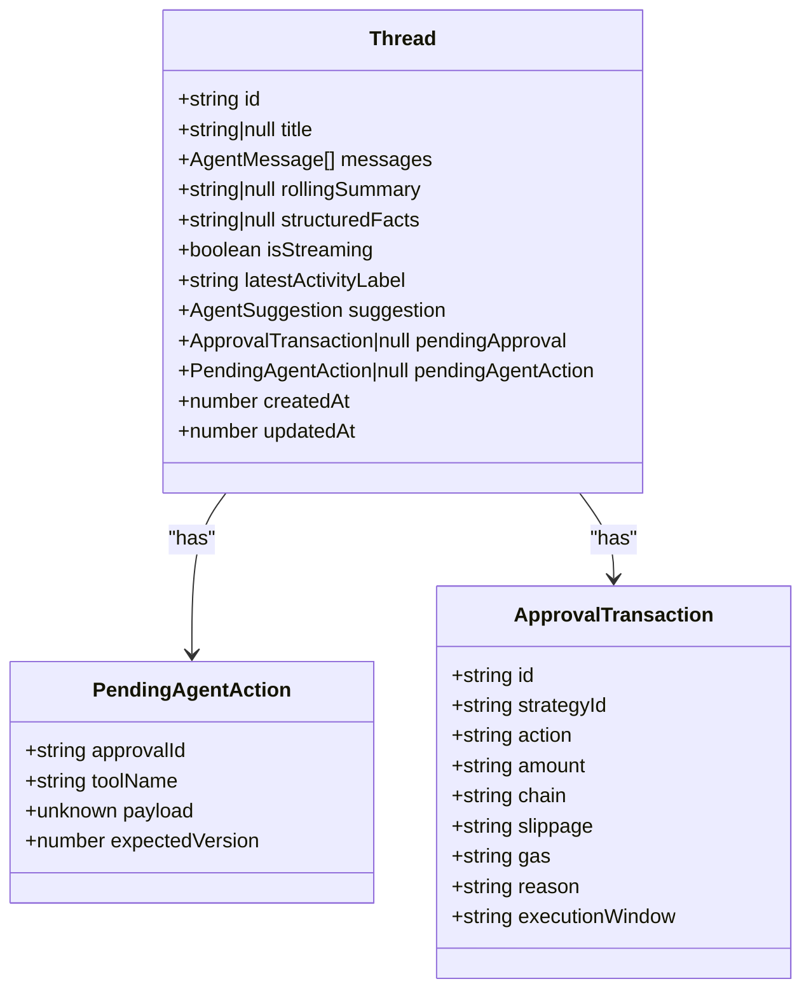
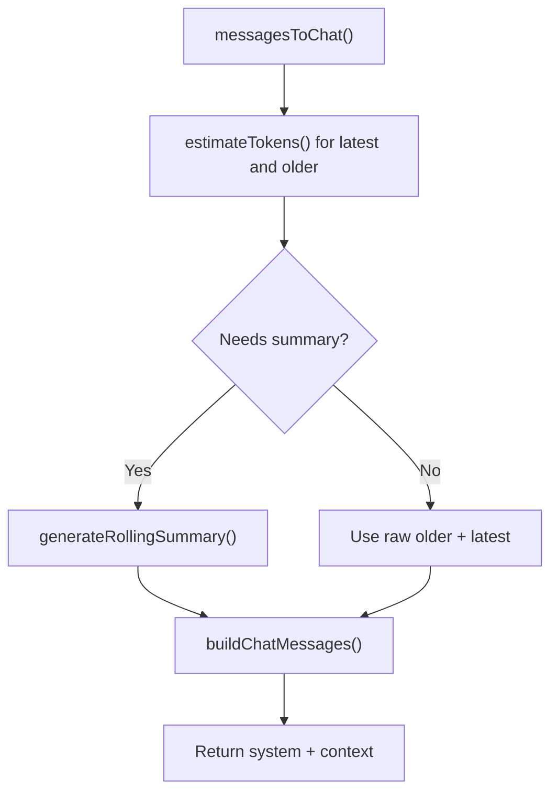
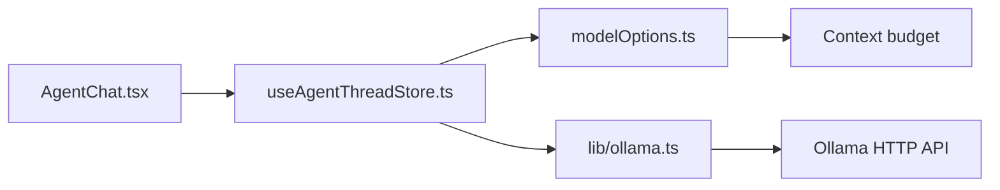
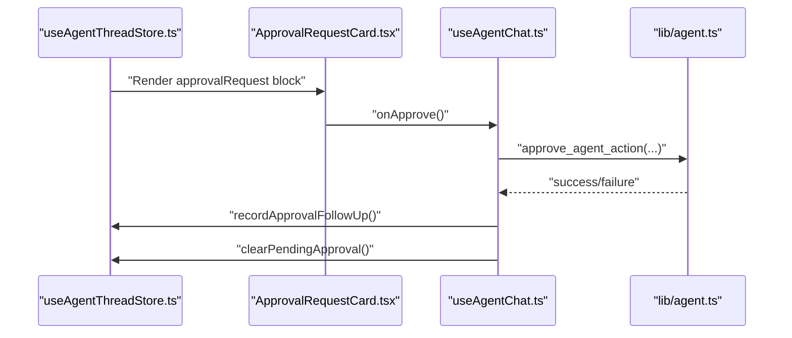
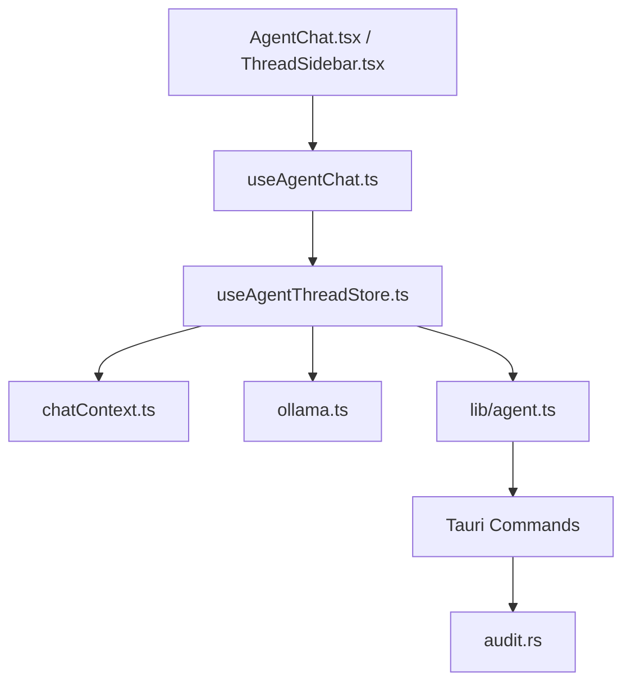

# AI Agent System

<cite>
**Referenced Files in This Document**
- [AgentWorkspace.tsx](file://src/components/agent/AgentWorkspace.tsx)
- [AgentChat.tsx](file://src/components/agent/AgentChat.tsx)
- [ThreadSidebar.tsx](file://src/components/agent/ThreadSidebar.tsx)
- [ApprovalRequestCard.tsx](file://src/components/agent/ApprovalRequestCard.tsx)
- [DecisionCard.tsx](file://src/components/agent/DecisionCard.tsx)
- [StrategyProposalCard.tsx](file://src/components/agent/StrategyProposalCard.tsx)
- [useAgentChat.ts](file://src/hooks/useAgentChat.ts)
- [useAgentThreadStore.ts](file://src/store/useAgentThreadStore.ts)
- [agent.ts](file://src/lib/agent.ts)
- [chatContext.ts](file://src/lib/chatContext.ts)
- [ollama.ts](file://src/lib/ollama.ts)
- [modelOptions.ts](file://src/lib/modelOptions.ts)
- [agent.ts (types)](file://src/types/agent.ts)
- [logger.ts](file://src/lib/logger.ts)
- [audit.rs](file://src-tauri/src/services/audit.rs)
</cite>

## Table of Contents
1. [Introduction](#introduction)
2. [Project Structure](#project-structure)
3. [Core Components](#core-components)
4. [Architecture Overview](#architecture-overview)
5. [Detailed Component Analysis](#detailed-component-analysis)
6. [Dependency Analysis](#dependency-analysis)
7. [Performance Considerations](#performance-considerations)
8. [Troubleshooting Guide](#troubleshooting-guide)
9. [Conclusion](#conclusion)
10. [Appendices](#appendices)

## Introduction
This document explains SHADOW Protocol’s AI agent system with a focus on thread-based conversation, privacy-first local inference, and approvals. It covers the AgentWorkspace architecture, chat interface components, approval workflow integration, conversation flow from user input to execution approval and logging, Ollama integration and model selection, privacy guarantees, memory management, execution logging, security measures, and common use cases such as trade suggestions, portfolio analysis, and market research.

## Project Structure
The agent system spans React components, a Zustand store, typed APIs, and Rust backend services. The frontend orchestrates conversations, manages context and memory, and surfaces approvals. The backend exposes Tauri commands for agent chat, approvals, execution logs, and audit logging.

**Diagram sources**
- [AgentWorkspace.tsx:10-64](file://src/components/agent/AgentWorkspace.tsx#L10-L64)
- [AgentChat.tsx:10-123](file://src/components/agent/AgentChat.tsx#L10-L123)
- [ThreadSidebar.tsx:117-175](file://src/components/agent/ThreadSidebar.tsx#L117-L175)
- [useAgentChat.ts:13-96](file://src/hooks/useAgentChat.ts#L13-L96)
- [useAgentThreadStore.ts:121-621](file://src/store/useAgentThreadStore.ts#L121-L621)
- [chatContext.ts:59-90](file://src/lib/chatContext.ts#L59-L90)
- [ollama.ts:78-109](file://src/lib/ollama.ts#L78-L109)
- [modelOptions.ts:47-60](file://src/lib/modelOptions.ts#L47-L60)
- [agent.ts:14-86](file://src/lib/agent.ts#L14-L86)
- [audit.rs:5-24](file://src-tauri/src/services/audit.rs#L5-L24)

**Section sources**
- [AgentWorkspace.tsx:10-64](file://src/components/agent/AgentWorkspace.tsx#L10-L64)
- [AgentChat.tsx:10-123](file://src/components/agent/AgentChat.tsx#L10-L123)
- [ThreadSidebar.tsx:117-175](file://src/components/agent/ThreadSidebar.tsx#L117-L175)
- [useAgentChat.ts:13-96](file://src/hooks/useAgentChat.ts#L13-L96)
- [useAgentThreadStore.ts:121-621](file://src/store/useAgentThreadStore.ts#L121-L621)
- [chatContext.ts:59-90](file://src/lib/chatContext.ts#L59-L90)
- [ollama.ts:78-109](file://src/lib/ollama.ts#L78-L109)
- [modelOptions.ts:47-60](file://src/lib/modelOptions.ts#L47-L60)
- [agent.ts:14-86](file://src/lib/agent.ts#L14-L86)
- [audit.rs:5-24](file://src-tauri/src/services/audit.rs#L5-L24)

## Core Components
- AgentWorkspace: Hosts the sidebar and chat area, manages mobile drawer and active thread title.
- AgentChat: Renders messages, handles scrolling, and wires input submission and approval actions.
- ThreadSidebar: Lists conversations, previews last message, supports creation and deletion.
- useAgentChat: Hook that manages sending messages, approvals, and pending state.
- useAgentThreadStore: Centralized store for threads, context building, memory, and approval flow.
- chatContext: Builds Ollama-ready messages, estimates tokens, generates rolling summaries, merges structured facts.
- ollama: Local inference client invoking Ollama HTTP API and Tauri commands for status and model management.
- modelOptions: Defines model metadata and context budgets.
- agent API: Typed wrappers around Tauri commands for chat, approvals, logs, and memory.
- Types: Strongly typed inputs/outputs for agent responses, approvals, and execution logs.
- Audit logging: Backend service to persist audit entries.

**Section sources**
- [AgentWorkspace.tsx:10-64](file://src/components/agent/AgentWorkspace.tsx#L10-L64)
- [AgentChat.tsx:10-123](file://src/components/agent/AgentChat.tsx#L10-L123)
- [ThreadSidebar.tsx:117-175](file://src/components/agent/ThreadSidebar.tsx#L117-L175)
- [useAgentChat.ts:13-96](file://src/hooks/useAgentChat.ts#L13-L96)
- [useAgentThreadStore.ts:121-621](file://src/store/useAgentThreadStore.ts#L121-L621)
- [chatContext.ts:59-90](file://src/lib/chatContext.ts#L59-L90)
- [ollama.ts:78-109](file://src/lib/ollama.ts#L78-L109)
- [modelOptions.ts:47-60](file://src/lib/modelOptions.ts#L47-L60)
- [agent.ts:14-86](file://src/lib/agent.ts#L14-L86)
- [agent.ts (types):73-92](file://src/types/agent.ts#L73-L92)

## Architecture Overview
The system is a privacy-first, local-first architecture:
- Conversations are stored locally in the browser via a persisted Zustand store.
- Messages are sent to a local Ollama instance for inference.
- Agent decisions may require explicit user approval before execution.
- Backend records approvals and execution logs for auditability.

**Diagram sources**
- [AgentChat.tsx:10-123](file://src/components/agent/AgentChat.tsx#L10-L123)
- [useAgentChat.ts:31-78](file://src/hooks/useAgentChat.ts#L31-L78)
- [useAgentThreadStore.ts:198-533](file://src/store/useAgentThreadStore.ts#L198-L533)
- [agent.ts:14-57](file://src/lib/agent.ts#L14-L57)
- [ollama.ts:78-109](file://src/lib/ollama.ts#L78-L109)
- [agent.ts (types):73-92](file://src/types/agent.ts#L73-L92)

## Detailed Component Analysis

### AgentWorkspace
- Manages responsive layout with a collapsible thread sidebar and active thread title.
- Integrates with the active thread via the agent chat hook.

**Section sources**
- [AgentWorkspace.tsx:10-64](file://src/components/agent/AgentWorkspace.tsx#L10-L64)

### AgentChat
- Renders user and agent messages with animation.
- Scrolls to the latest message.
- Passes approval handlers to agent messages when pending.

**Section sources**
- [AgentChat.tsx:10-123](file://src/components/agent/AgentChat.tsx#L10-L123)

### ThreadSidebar
- Displays conversation previews and relative timestamps.
- Supports creating and deleting threads.

**Section sources**
- [ThreadSidebar.tsx:117-175](file://src/components/agent/ThreadSidebar.tsx#L117-L175)

### useAgentChat Hook
- Provides active thread, messages, and suggestion.
- Sends messages to the store.
- Handles approval/rejection lifecycle, toast feedback, and hidden follow-up turns.

**Diagram sources**
- [useAgentChat.ts:31-78](file://src/hooks/useAgentChat.ts#L31-L78)
- [useAgentThreadStore.ts:198-533](file://src/store/useAgentThreadStore.ts#L198-L533)
- [agent.ts:14-57](file://src/lib/agent.ts#L14-L57)

**Section sources**
- [useAgentChat.ts:13-96](file://src/hooks/useAgentChat.ts#L13-L96)

### useAgentThreadStore
- Thread model includes messages, rolling summary, structured facts, streaming state, activity label, suggestion, and pending approval/action.
- Builds context messages, resolves context budget, and decides whether to generate a rolling summary.
- Merges structured facts from tool results to maintain contextual awareness.
- Handles approval-required responses by constructing an approval transaction and a pending agent action.
- Records approval follow-ups as hidden messages.

**Diagram sources**
- [useAgentThreadStore.ts:30-46](file://src/store/useAgentThreadStore.ts#L30-L46)
- [useAgentThreadStore.ts:23-28](file://src/store/useAgentThreadStore.ts#L23-L28)
- [useAgentThreadStore.ts:48-58](file://src/store/useAgentThreadStore.ts#L48-L58)

**Section sources**
- [useAgentThreadStore.ts:121-621](file://src/store/useAgentThreadStore.ts#L121-L621)

### chatContext
- Converts agent messages to Ollama chat messages.
- Builds a context array respecting system prompt, rolling summary, and latest N messages.
- Estimates tokens and determines if a rolling summary is needed.
- Generates rolling summaries using the selected model.
- Extracts and merges structured facts from tool results.

**Diagram sources**
- [chatContext.ts:30-90](file://src/lib/chatContext.ts#L30-L90)
- [chatContext.ts:177-202](file://src/lib/chatContext.ts#L177-L202)

**Section sources**
- [chatContext.ts:59-90](file://src/lib/chatContext.ts#L59-L90)
- [chatContext.ts:177-202](file://src/lib/chatContext.ts#L177-L202)

### Ollama Integration and Model Selection
- Local inference via HTTP to Ollama host.
- Default model selection and recommended models based on system memory.
- Context budget resolution per model.

**Diagram sources**
- [ollama.ts:78-109](file://src/lib/ollama.ts#L78-L109)
- [modelOptions.ts:47-60](file://src/lib/modelOptions.ts#L47-L60)

**Section sources**
- [ollama.ts:78-109](file://src/lib/ollama.ts#L78-L109)
- [modelOptions.ts:47-60](file://src/lib/modelOptions.ts#L47-L60)

### Approval Workflow Integration
- ApprovalRequestCard renders swap or strategy proposals with key details.
- DecisionCard displays portfolio insights and suggested actions.
- StrategyProposalCard presents automation proposals with guardrails and deploy action.
- useAgentChat coordinates approve/reject actions and records follow-ups.

**Diagram sources**
- [useAgentThreadStore.ts:398-466](file://src/store/useAgentThreadStore.ts#L398-L466)
- [ApprovalRequestCard.tsx:31-108](file://src/components/agent/ApprovalRequestCard.tsx#L31-L108)
- [useAgentChat.ts:39-78](file://src/hooks/useAgentChat.ts#L39-L78)
- [agent.ts:29-51](file://src/lib/agent.ts#L29-L51)

**Section sources**
- [ApprovalRequestCard.tsx:31-108](file://src/components/agent/ApprovalRequestCard.tsx#L31-L108)
- [DecisionCard.tsx:16-96](file://src/components/agent/DecisionCard.tsx#L16-L96)
- [StrategyProposalCard.tsx:16-87](file://src/components/agent/StrategyProposalCard.tsx#L16-L87)
- [useAgentChat.ts:39-78](file://src/hooks/useAgentChat.ts#L39-L78)
- [agent.ts:29-51](file://src/lib/agent.ts#L29-L51)

### Privacy Guarantees and Security Measures
- Local inference: All chat requests go to the local Ollama endpoint.
- No external cloud provider invocation in the shown flows.
- Structured facts are kept minimal and capped to reduce retention.
- Rolling summaries compress older context to fit within model budgets.
- Approval gating prevents automatic execution of sensitive actions.

**Section sources**
- [ollama.ts:78-109](file://src/lib/ollama.ts#L78-L109)
- [chatContext.ts:117-168](file://src/lib/chatContext.ts#L117-L168)
- [useAgentThreadStore.ts:398-466](file://src/store/useAgentThreadStore.ts#L398-L466)

### Memory Management and Contextual Awareness
- Structured facts extracted from tool results are merged and truncated to a maximum length.
- Rolling summaries are generated when context exceeds budget.
- Context assembly prioritizes latest messages and optionally older context or a summary.

**Section sources**
- [chatContext.ts:117-168](file://src/lib/chatContext.ts#L117-L168)
- [chatContext.ts:177-202](file://src/lib/chatContext.ts#L177-L202)
- [useAgentThreadStore.ts:280-299](file://src/store/useAgentThreadStore.ts#L280-L299)

### Execution Logging and Audit Trails
- Execution logs are retrieved via typed API calls.
- Backend audit service persists events with serialized details.

**Section sources**
- [agent.ts:59-63](file://src/lib/agent.ts#L59-L63)
- [audit.rs:5-24](file://src-tauri/src/services/audit.rs#L5-L24)

### Relationship Between Agent Conversations and Autonomous Strategy Execution
- Strategy proposals can be presented to the user for approval and deployment.
- Approved strategies integrate with the broader automation center and guardrails.

**Section sources**
- [StrategyProposalCard.tsx:16-87](file://src/components/agent/StrategyProposalCard.tsx#L16-L87)
- [useAgentThreadStore.ts:415-428](file://src/store/useAgentThreadStore.ts#L415-L428)

### Common Use Cases
- Trade suggestions: Swaps preview rendered in approval card with network, slippage, and gas.
- Portfolio analysis: Decision card shows total value, risk level, allocations, and suggested actions.
- Market research: Strategy proposal card outlines triggers, actions, and guardrails.

**Section sources**
- [ApprovalRequestCard.tsx:48-66](file://src/components/agent/ApprovalRequestCard.tsx#L48-L66)
- [DecisionCard.tsx:16-96](file://src/components/agent/DecisionCard.tsx#L16-L96)
- [StrategyProposalCard.tsx:16-87](file://src/components/agent/StrategyProposalCard.tsx#L16-L87)

## Dependency Analysis
- Frontend components depend on the store for state and on typed APIs for backend commands.
- The store depends on chatContext for context assembly and on ollama for inference.
- The agent API wraps Tauri commands invoked by the store and hook.
- Backend services record audit logs for approvals and executions.

**Diagram sources**
- [useAgentChat.ts:13-96](file://src/hooks/useAgentChat.ts#L13-L96)
- [useAgentThreadStore.ts:121-621](file://src/store/useAgentThreadStore.ts#L121-L621)
- [chatContext.ts:59-90](file://src/lib/chatContext.ts#L59-L90)
- [ollama.ts:78-109](file://src/lib/ollama.ts#L78-L109)
- [agent.ts:14-86](file://src/lib/agent.ts#L14-L86)
- [audit.rs:5-24](file://src-tauri/src/services/audit.rs#L5-L24)

**Section sources**
- [useAgentChat.ts:13-96](file://src/hooks/useAgentChat.ts#L13-L96)
- [useAgentThreadStore.ts:121-621](file://src/store/useAgentThreadStore.ts#L121-L621)
- [agent.ts:14-86](file://src/lib/agent.ts#L14-L86)

## Performance Considerations
- Prefer smaller models for constrained systems; recommended models are chosen based on available RAM.
- Keep structured facts concise to avoid excessive context inflation.
- Use rolling summaries when conversations grow long to stay within context limits.
- Disable streaming if not needed to reduce overhead.

[No sources needed since this section provides general guidance]

## Troubleshooting Guide
- Ollama connectivity errors: Check local service status and model availability; the client marks certain errors as “unavailable.”
- Model not found: Pull the required model via the UI or command.
- No model selected: The store prompts the setup modal when no model is configured.
- Approval failures: Review the execution log and reattempt after correcting conditions.

**Section sources**
- [ollama.ts:153-164](file://src/lib/ollama.ts#L153-L164)
- [useAgentThreadStore.ts:244-274](file://src/store/useAgentThreadStore.ts#L244-L274)
- [agent.ts:59-63](file://src/lib/agent.ts#L59-L63)

## Conclusion
SHADOW’s AI agent system combines a thread-based chat UI with privacy-first local inference, robust memory management, and explicit approval workflows. The architecture ensures user control over sensitive actions while enabling powerful DeFi insights and automated strategies.

[No sources needed since this section summarizes without analyzing specific files]

## Appendices

### Privacy and Data Handling Notes
- All inference occurs locally via Ollama.
- Structured facts are truncated and summaries are used to minimize retained context.
- Approval gating prevents unauthorized execution.

**Section sources**
- [ollama.ts:78-109](file://src/lib/ollama.ts#L78-L109)
- [chatContext.ts:117-168](file://src/lib/chatContext.ts#L117-L168)
- [useAgentThreadStore.ts:398-466](file://src/store/useAgentThreadStore.ts#L398-L466)