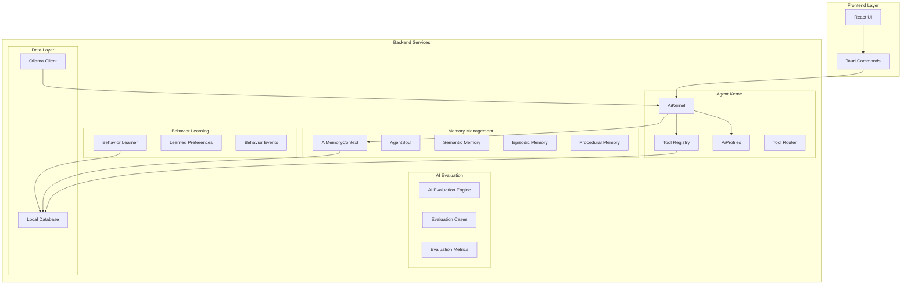
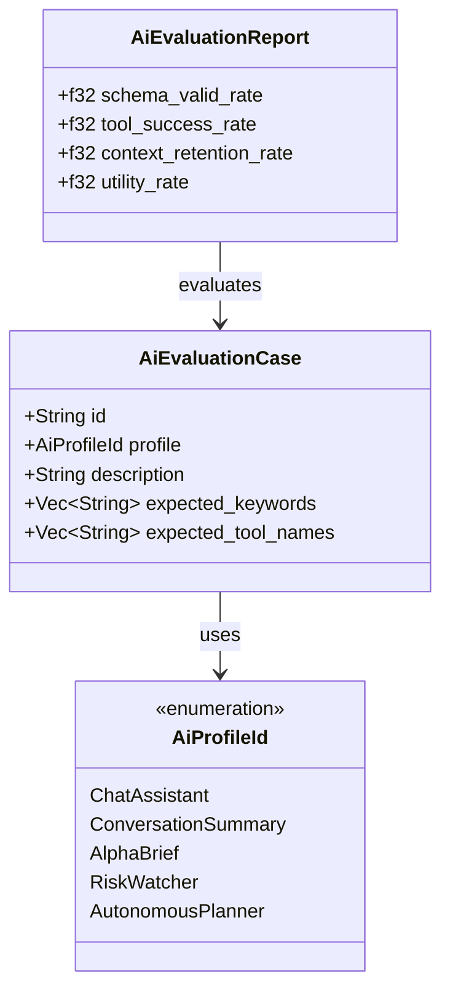
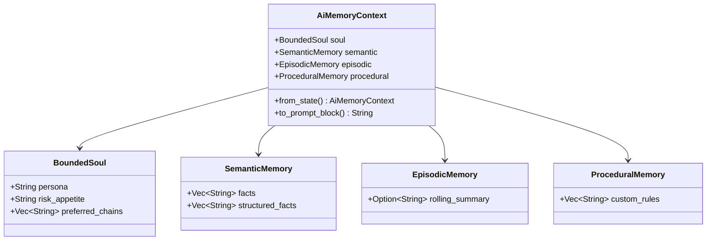
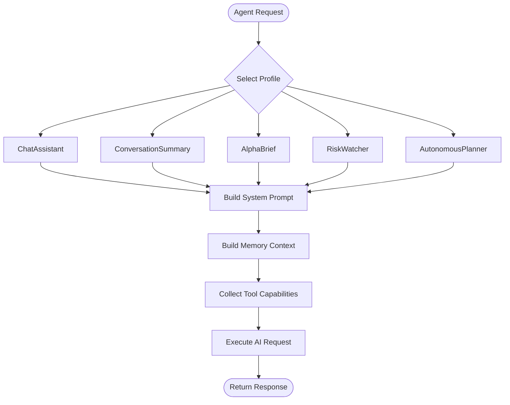
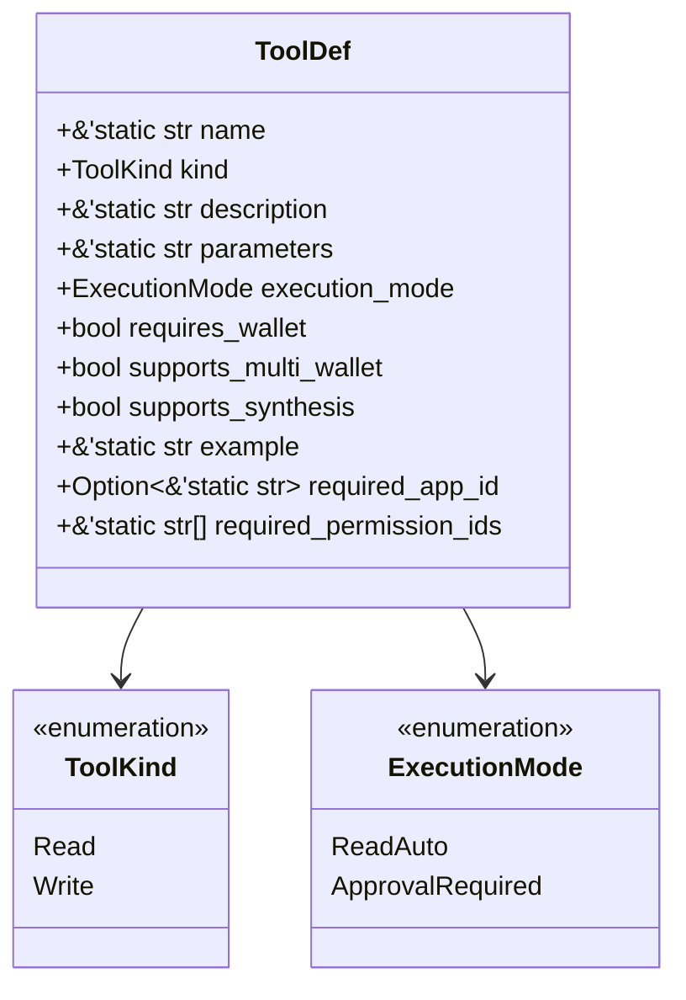
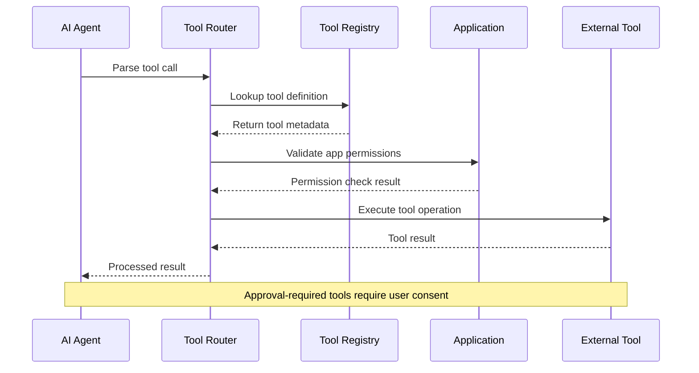
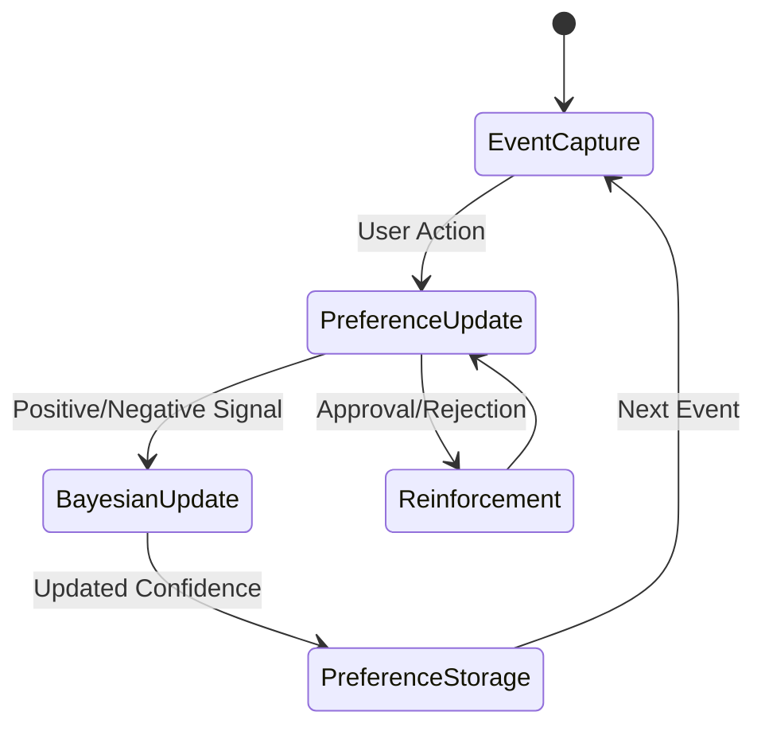
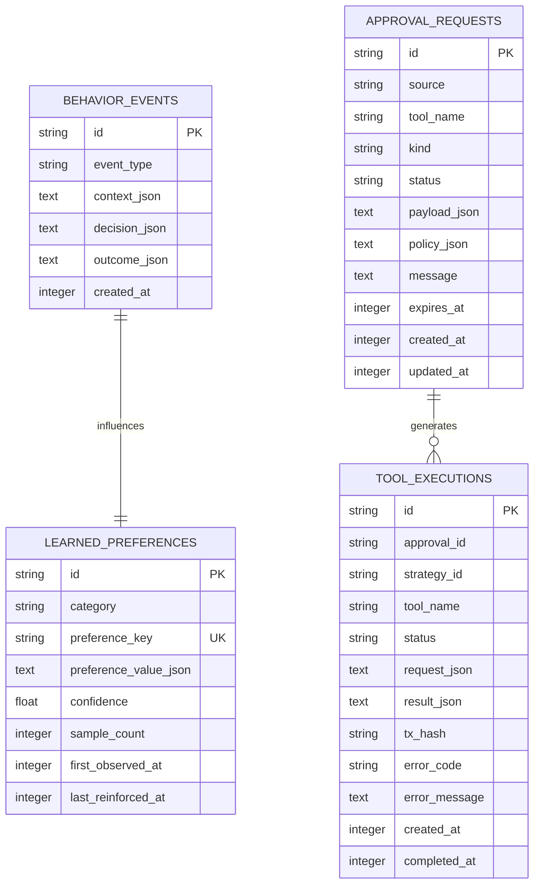
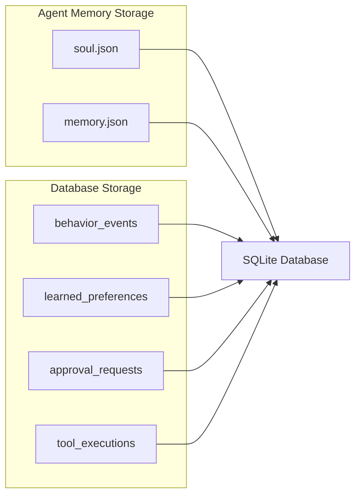

# AI Evaluation and Memory Management System

<cite>
**Referenced Files in This Document**
- [ai_evaluation.rs](file://src-tauri/src/services/ai_evaluation.rs)
- [ai_memory.rs](file://src-tauri/src/services/ai_memory.rs)
- [ai_kernel.rs](file://src-tauri/src/services/ai_kernel.rs)
- [ai_profiles.rs](file://src-tauri/src/services/ai_profiles.rs)
- [agent_state.rs](file://src-tauri/src/services/agent_state.rs)
- [behavior_learner.rs](file://src-tauri/src/services/behavior_learner.rs)
- [tool_registry.rs](file://src-tauri/src/services/tool_registry.rs)
- [tool_router.rs](file://src-tauri/src/services/tool_router.rs)
- [ollama_client.rs](file://src-tauri/src/services/ollama_client.rs)
- [local_db.rs](file://src-tauri/src/services/local_db.rs)
- [chat.rs](file://src-tauri/src/commands/chat.rs)
- [agent_state_commands.rs](file://src-tauri/src/commands/agent_state.rs)
- [lib.rs](file://src-tauri/src/lib.rs)
- [Cargo.toml](file://src-tauri/Cargo.toml)
</cite>

## Table of Contents
1. [Introduction](#introduction)
2. [System Architecture](#system-architecture)
3. [AI Evaluation Framework](#ai-evaluation-framework)
4. [Memory Management System](#memory-management-system)
5. [Agent Kernel and Profiles](#agent-kernel-and-profiles)
6. [Tool Integration and Routing](#tool-integration-and-routing)
7. [Behavior Learning System](#behavior-learning-system)
8. [Data Persistence Layer](#data-persistence-layer)
9. [Command Interface](#command-interface)
10. [Performance and Scalability](#performance-and-scalability)
11. [Security Considerations](#security-considerations)
12. [Conclusion](#conclusion)

## Introduction

The AI Evaluation and Memory Management System represents a sophisticated framework for managing artificial intelligence interactions within the Shadow Protocol ecosystem. This system combines advanced memory management, evaluation frameworks, and intelligent tool routing to create a comprehensive AI assistance platform for DeFi operations.

The system is designed around three core pillars: **evaluation and quality assurance**, **persistent memory and context management**, and **intelligent agent orchestration**. It operates as a local-first AI solution that maintains privacy and security while providing powerful automation capabilities for cryptocurrency portfolio management and DeFi interactions.

## System Architecture

The AI Evaluation and Memory Management System follows a modular architecture with clear separation of concerns:



**Diagram sources**
- [ai_evaluation.rs:1-92](file://src-tauri/src/services/ai_evaluation.rs#L1-L92)
- [ai_memory.rs:1-183](file://src-tauri/src/services/ai_memory.rs#L1-L183)
- [ai_kernel.rs:1-299](file://src-tauri/src/services/ai_kernel.rs#L1-L299)
- [behavior_learner.rs:1-460](file://src-tauri/src/services/behavior_learner.rs#L1-L460)

## AI Evaluation Framework

The AI Evaluation Framework provides comprehensive quality assurance mechanisms for evaluating AI agent performance across multiple dimensions.

### Evaluation Case Structure

The system defines standardized evaluation cases that test specific AI capabilities:



**Diagram sources**
- [ai_evaluation.rs:5-22](file://src-tauri/src/services/ai_evaluation.rs#L5-L22)
- [ai_profiles.rs:3-11](file://src-tauri/src/services/ai_profiles.rs#L3-L11)

### Production Evaluation Cases

The system includes predefined evaluation cases covering critical AI agent scenarios:

| Case ID | Profile | Description | Expected Keywords |
|---------|---------|-------------|-------------------|
| `chat-portfolio-follow-up` | ChatAssistant | Follow up on prior portfolio analysis | portfolio, follow-up |
| `summary-long-thread` | ConversationSummary | Compress long conversations | decision, strategy |
| `alpha-personalized-brief` | AlphaBrief | Generate personalized alpha brief | risk, chains |
| `watcher-critical-alert` | RiskWatcher | Raise risk alerts for relevant news | alert, severity |

**Section sources**
- [ai_evaluation.rs:24-55](file://src-tauri/src/services/ai_evaluation.rs#L24-L55)

## Memory Management System

The Memory Management System provides sophisticated context preservation and retrieval mechanisms for AI agents.

### Memory Architecture



**Diagram sources**
- [ai_memory.rs:9-38](file://src-tauri/src/services/ai_memory.rs#L9-L38)
- [agent_state.rs:6-35](file://src-tauri/src/services/agent_state.rs#L6-L35)

### Memory Limits and Constraints

The system implements strict memory limits to maintain performance and relevance:

| Memory Type | Limit | Purpose |
|-------------|-------|---------|
| Semantic Facts | 8 items | Core knowledge retention |
| Structured Facts | 6 items | Recent structured data |
| Custom Rules | 6 items | User-defined guidelines |
| Preferred Chains | 6 items | Chain preferences |

**Section sources**
- [ai_memory.rs:5-7](file://src-tauri/src/services/ai_memory.rs#L5-L7)

## Agent Kernel and Profiles

The Agent Kernel serves as the central orchestrator for AI agent operations, managing profiles, context building, and system prompts.

### Profile Configuration System



**Diagram sources**
- [ai_kernel.rs:83-113](file://src-tauri/src/services/ai_kernel.rs#L83-L113)
- [ai_profiles.rs:23-66](file://src-tauri/src/services/ai_profiles.rs#L23-L66)

### Context Building Process

The system constructs comprehensive context from multiple sources:

1. **Agent Soul**: Personality, risk tolerance, and custom rules
2. **Semantic Memory**: Core facts and knowledge
3. **Episodic Memory**: Recent conversation summaries
4. **Procedural Memory**: Custom rules and procedures
5. **Installed Applications**: Available tool capabilities

**Section sources**
- [ai_kernel.rs:73-81](file://src-tauri/src/services/ai_kernel.rs#L73-L81)

## Tool Integration and Routing

The Tool Integration and Routing system provides a comprehensive framework for connecting AI agents with external tools and services.

### Tool Registry Architecture



**Diagram sources**
- [tool_registry.rs:18-34](file://src-tauri/src/services/tool_registry.rs#L18-L34)

### Tool Execution Flow



**Diagram sources**
- [tool_router.rs:100-131](file://src-tauri/src/services/tool_router.rs#L100-L131)
- [tool_registry.rs:36-403](file://src-tauri/src/services/tool_registry.rs#L36-L403)

**Section sources**
- [tool_router.rs:100-131](file://src-tauri/src/services/tool_router.rs#L100-L131)

## Behavior Learning System

The Behavior Learning System implements sophisticated user preference modeling using Bayesian updates to adapt AI recommendations over time.

### Learning Architecture



**Diagram sources**
- [behavior_learner.rs:201-256](file://src-tauri/src/services/behavior_learner.rs#L201-L256)

### Behavior Event Categories

The system tracks various types of user interactions:

| Event Type | Description | Preference Impact |
|------------|-------------|-------------------|
| Approval | User approves suggested action | Positive reinforcement |
| Rejection | User rejects suggested action | Negative reinforcement |
| Strategy Activation | User activates automation strategy | Positive for strategy type |
| Trade Executed | User executes trades | Mixed signals based on outcomes |
| Opportunity Viewed | User views market opportunities | Positive for opportunity type |
| Settings Changed | User modifies system settings | Contextual preference |

**Section sources**
- [behavior_learner.rs:14-47](file://src-tauri/src/services/behavior_learner.rs#L14-L47)

## Data Persistence Layer

The Data Persistence Layer provides comprehensive local storage for all system data, ensuring privacy and offline functionality.

### Database Schema Overview



**Diagram sources**
- [local_db.rs:356-448](file://src-tauri/src/services/local_db.rs#L356-L448)

### Memory Storage Format

The system uses JSON-based storage for human-readable persistence:



**Diagram sources**
- [agent_state.rs:37-76](file://src-tauri/src/services/agent_state.rs#L37-L76)
- [local_db.rs:473-557](file://src-tauri/src/services/local_db.rs#L473-L557)

**Section sources**
- [agent_state.rs:37-76](file://src-tauri/src/services/agent_state.rs#L37-L76)

## Command Interface

The Command Interface provides the bridge between the frontend React application and the Rust backend services.

### Command Registration

```mermaid
flowchart TD
Frontend[React Frontend] --> Invoke[invoke()]
Invoke --> CommandRouter[Tauri Command Router]
CommandRouter --> ServiceLayer[Service Layer]
ServiceLayer --> Database[Local Database]
ServiceLayer --> AIEngine[AI Engine]
ServiceLayer --> Tools[Tool Registry]
AIEngine --> Ollama[Ollama Client]
Tools --> ExternalServices[External Services]
```

**Diagram sources**
- [lib.rs:92-212](file://src-tauri/src/lib.rs#L92-L212)

### Key Commands

The system exposes several critical commands for AI evaluation and memory management:

| Command Category | Functionality | Purpose |
|------------------|---------------|---------|
| AI Evaluation | `get_ai_evaluation_fixtures` | Retrieve evaluation test cases |
| Memory Management | `get_agent_soul`, `update_agent_soul` | Manage agent personality and preferences |
| Memory Management | `get_agent_memory`, `add_agent_memory`, `remove_agent_memory` | Control semantic memory |
| AI Operations | `chat_agent`, `summarize_agent_conversation` | Execute AI agent operations |
| Approval System | `get_pending_approvals`, `approve_agent_action`, `reject_agent_action` | Manage AI action approvals |

**Section sources**
- [lib.rs:92-212](file://src-tauri/src/lib.rs#L92-L212)

## Performance and Scalability

The system is designed with performance and scalability as key considerations.

### Memory Management Optimizations

- **Bounded Memory**: Strict limits prevent uncontrolled memory growth
- **Automatic Trimming**: Oldest memories are automatically removed when limits are reached
- **Efficient Serialization**: JSON-based storage for human readability and performance
- **Lazy Loading**: Memory and soul data loaded only when needed

### AI Processing Efficiency

- **Context Bounding**: Memory context limited to relevant information
- **Profile-Specific Optimization**: Different profiles optimized for their specific use cases
- **Tool Capability Filtering**: Only relevant tools included in system prompts
- **Batch Processing**: Multiple operations processed efficiently

### Database Performance

- **Indexed Queries**: Critical lookup operations use database indexes
- **Connection Pooling**: Efficient database connection management
- **Transaction Batching**: Related operations grouped for performance
- **Schema Evolution**: Migration system handles database schema changes

## Security Considerations

The system implements multiple layers of security to protect user data and maintain privacy.

### Local-First Design

- **Data Residency**: All sensitive data remains on the user's local machine
- **Minimal Network Exposure**: AI operations primarily use local Ollama instance
- **Encrypted Storage**: Sensitive data stored in encrypted format
- **Permission-Based Access**: Tools require explicit user permission grants

### Approval System

- **Explicit Consent**: All potentially risky operations require user approval
- **Audit Trail**: Complete logging of all AI agent actions
- **Timeout Protection**: Automatic expiration of pending approvals
- **Version Control**: Atomic approval updates prevent conflicts

### Memory Security

- **Selective Persistence**: Only relevant information stored in memory
- **Regular Cleanup**: Automatic removal of old or irrelevant data
- **Access Control**: Memory operations require proper authorization
- **Data Validation**: All input data validated before storage

## Conclusion

The AI Evaluation and Memory Management System represents a comprehensive solution for privacy-preserving AI assistance in DeFi environments. By combining robust evaluation frameworks, sophisticated memory management, intelligent tool routing, and behavioral learning, the system provides powerful automation capabilities while maintaining strict privacy and security guarantees.

Key strengths of the system include:

- **Privacy-First Architecture**: All sensitive operations remain local
- **Comprehensive Evaluation**: Multi-dimensional quality assurance for AI performance
- **Sophisticated Memory Management**: Hierarchical memory system with automatic optimization
- **Intelligent Tool Integration**: Seamless connection between AI agents and external services
- **Adaptive Learning**: Continuous improvement based on user behavior patterns
- **Security-First Design**: Multiple layers of protection for user data and operations

The system's modular architecture ensures maintainability and extensibility, while the local-first approach provides reliability and performance benefits. As the DeFi ecosystem continues to evolve, this foundation provides a solid platform for advanced AI-assisted automation and decision-making.