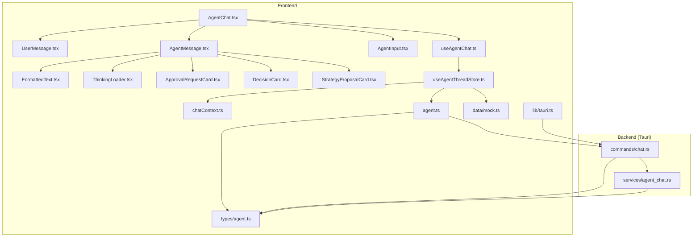
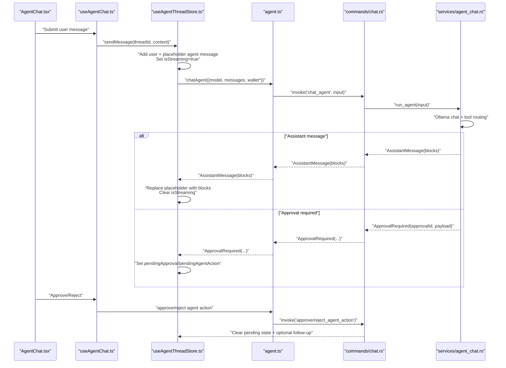
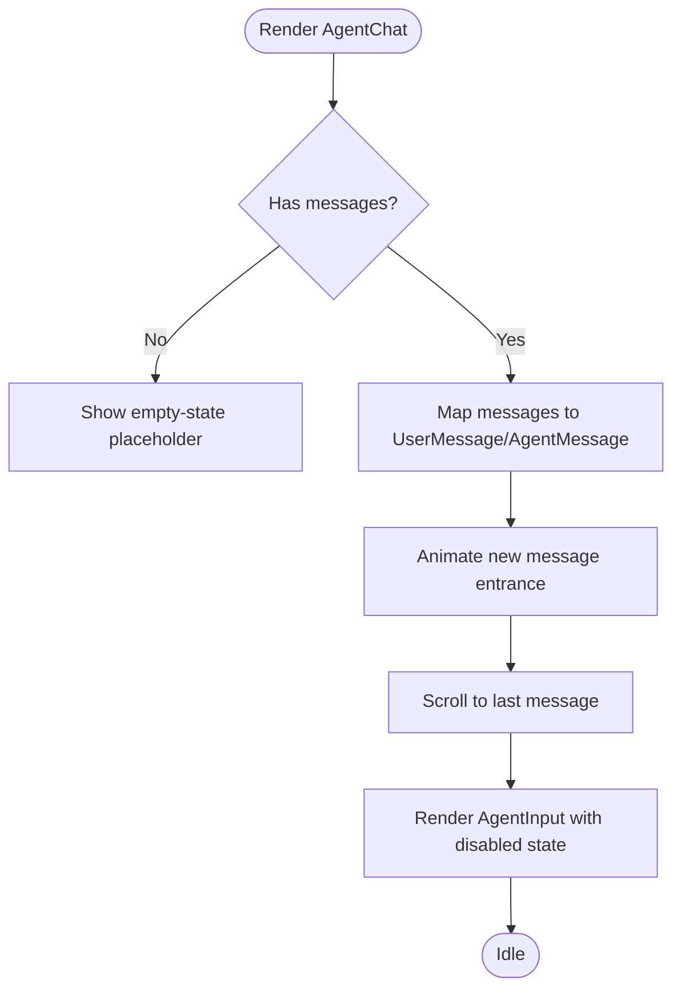
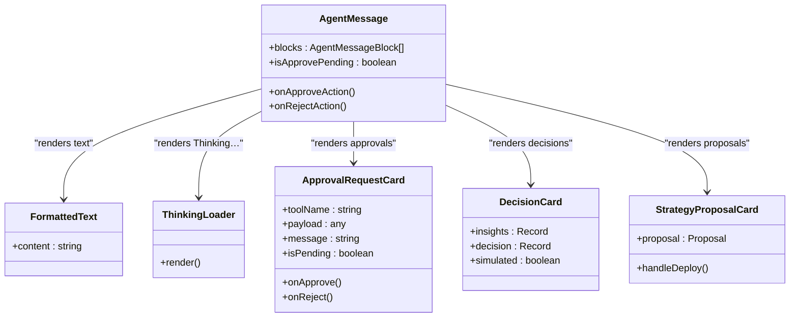
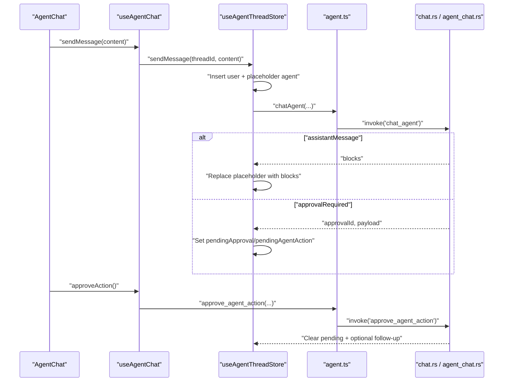
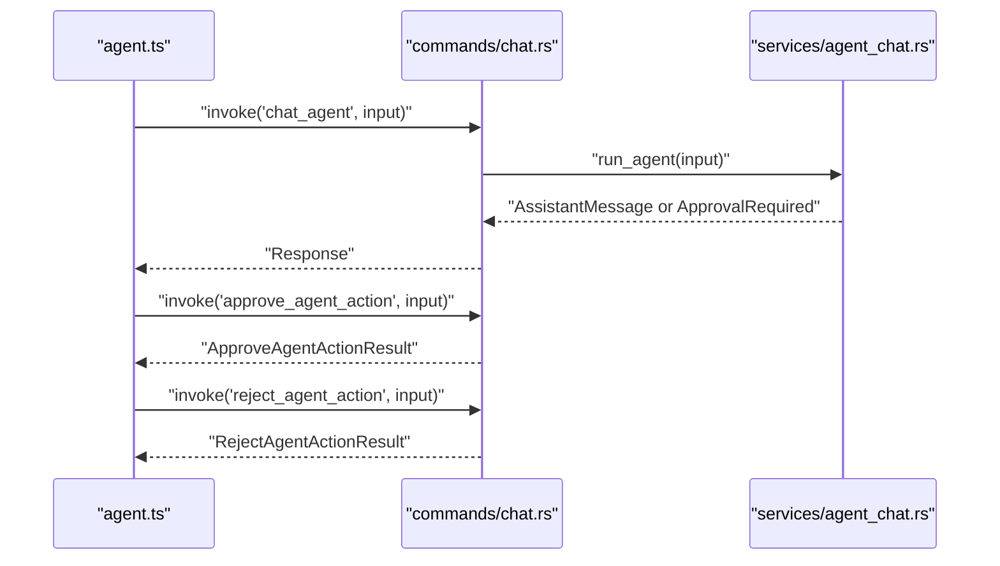
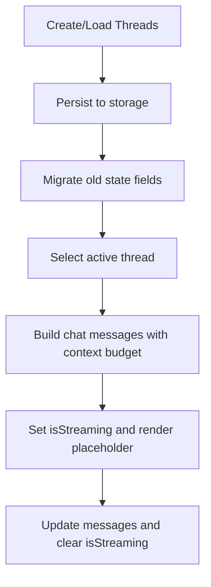
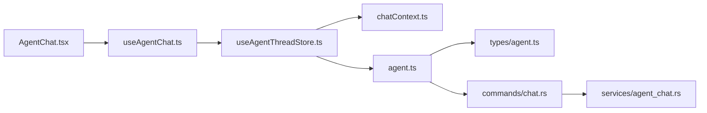

# Agent Chat & Conversation Flow

<cite>
**Referenced Files in This Document**
- [AgentChat.tsx](file://src/components/agent/AgentChat.tsx)
- [UserMessage.tsx](file://src/components/agent/UserMessage.tsx)
- [AgentMessage.tsx](file://src/components/agent/AgentMessage.tsx)
- [AgentInput.tsx](file://src/components/agent/AgentInput.tsx)
- [useAgentChat.ts](file://src/hooks/useAgentChat.ts)
- [useAgentThreadStore.ts](file://src/store/useAgentThreadStore.ts)
- [chatContext.ts](file://src/lib/chatContext.ts)
- [tauri.ts](file://src/lib/tauri.ts)
- [agent.ts](file://src/lib/agent.ts)
- [mock.ts](file://src/data/mock.ts)
- [agent.ts (types)](file://src/types/agent.ts)
- [FormattedText.tsx](file://src/components/agent/FormattedText.tsx)
- [ThinkingLoader.tsx](file://src/components/agent/ThinkingLoader.tsx)
- [ApprovalRequestCard.tsx](file://src/components/agent/ApprovalRequestCard.tsx)
- [DecisionCard.tsx](file://src/components/agent/DecisionCard.tsx)
- [StrategyProposalCard.tsx](file://src/components/agent/StrategyProposalCard.tsx)
- [chat.rs](file://src-tauri/src/commands/chat.rs)
- [agent_chat.rs](file://src-tauri/src/services/agent_chat.rs)
</cite>

## Table of Contents
1. [Introduction](#introduction)
2. [Project Structure](#project-structure)
3. [Core Components](#core-components)
4. [Architecture Overview](#architecture-overview)
5. [Detailed Component Analysis](#detailed-component-analysis)
6. [Dependency Analysis](#dependency-analysis)
7. [Performance Considerations](#performance-considerations)
8. [Troubleshooting Guide](#troubleshooting-guide)
9. [Conclusion](#conclusion)
10. [Appendices](#appendices)

## Introduction
This document explains the agent chat interface and conversation flow system. It covers the AgentChat component architecture, message rendering pipeline, user input handling, conversation lifecycle, Tauri backend integration, real-time-like streaming behavior, error handling, styling and interaction patterns, and state management. It also documents UserMessage and AgentMessage components, AgentInput composition and validation, conversation persistence, and performance optimizations for long histories.

## Project Structure
The chat system spans frontend React components, a Zustand store for state, a hook for orchestrating chat actions, and a Tauri backend that runs the agent and tools.

**Diagram sources**
- [AgentChat.tsx:10-124](file://src/components/agent/AgentChat.tsx#L10-L124)
- [useAgentChat.ts:13-97](file://src/hooks/useAgentChat.ts#L13-L97)
- [useAgentThreadStore.ts:121-621](file://src/store/useAgentThreadStore.ts#L121-L621)
- [chatContext.ts:59-90](file://src/lib/chatContext.ts#L59-L90)
- [agent.ts:14-27](file://src/lib/agent.ts#L14-L27)
- [chat.rs:303-310](file://src-tauri/src/commands/chat.rs#L303-L310)
- [agent_chat.rs:190-358](file://src-tauri/src/services/agent_chat.rs#L190-L358)
- [FormattedText.tsx:7-62](file://src/components/agent/FormattedText.tsx#L7-L62)
- [ThinkingLoader.tsx:6-42](file://src/components/agent/ThinkingLoader.tsx#L6-L42)
- [ApprovalRequestCard.tsx:31-108](file://src/components/agent/ApprovalRequestCard.tsx#L31-L108)
- [DecisionCard.tsx:16-96](file://src/components/agent/DecisionCard.tsx#L16-L96)
- [StrategyProposalCard.tsx:16-87](file://src/components/agent/StrategyProposalCard.tsx#L16-L87)
- [tauri.ts:1-4](file://src/lib/tauri.ts#L1-L4)
- [agent.ts (types):73-92](file://src/types/agent.ts#L73-L92)
- [mock.ts:30-78](file://src/data/mock.ts#L30-L78)

**Section sources**
- [AgentChat.tsx:10-124](file://src/components/agent/AgentChat.tsx#L10-L124)
- [useAgentThreadStore.ts:121-621](file://src/store/useAgentThreadStore.ts#L121-L621)

## Core Components
- AgentChat: Renders the conversation header, message list with animations, and the input area. It auto-scrolls to the latest message and disables input during streaming.
- UserMessage: Displays user text with avatar and metadata.
- AgentMessage: Renders agent blocks in order, including formatted text, cards for decisions, opportunities, tool results, strategy proposals, and approval requests.
- AgentInput: Controlled form input with validation and submission handling; disabled while streaming.
- useAgentChat: Hook that exposes active thread, messages, streaming flag, and approval state; wires submit, approve, and reject actions.
- useAgentThreadStore: Zustand store managing threads, rolling summaries, structured facts, and the end-to-end chat loop via the agent service.

**Section sources**
- [AgentChat.tsx:10-124](file://src/components/agent/AgentChat.tsx#L10-L124)
- [UserMessage.tsx:8-24](file://src/components/agent/UserMessage.tsx#L8-L24)
- [AgentMessage.tsx:18-107](file://src/components/agent/AgentMessage.tsx#L18-L107)
- [AgentInput.tsx:11-51](file://src/components/agent/AgentInput.tsx#L11-L51)
- [useAgentChat.ts:13-97](file://src/hooks/useAgentChat.ts#L13-L97)
- [useAgentThreadStore.ts:71-93](file://src/store/useAgentThreadStore.ts#L71-L93)

## Architecture Overview
The conversation flow integrates frontend UI with a Tauri backend that orchestrates an agent and tools. The frontend sends user messages to the backend, receives assistant responses (including optional approval requests), and updates the UI accordingly.

**Diagram sources**
- [AgentChat.tsx:10-124](file://src/components/agent/AgentChat.tsx#L10-L124)
- [useAgentChat.ts:31-78](file://src/hooks/useAgentChat.ts#L31-L78)
- [useAgentThreadStore.ts:198-533](file://src/store/useAgentThreadStore.ts#L198-L533)
- [agent.ts:14-51](file://src/lib/agent.ts#L14-L51)
- [chat.rs:303-310](file://src-tauri/src/commands/chat.rs#L303-L310)
- [agent_chat.rs:190-358](file://src-tauri/src/services/agent_chat.rs#L190-L358)

## Detailed Component Analysis

### AgentChat Component
- Responsibilities:
  - Render header with active thread title.
  - Render message list with animation and auto-scroll to the last message.
  - Show empty-state placeholder when no messages.
  - Provide AgentInput bound to sendMessage.
- Streaming UX:
  - Disables input while isStreaming is true.
  - Scrolls to the last message when messages change or streaming toggles.

**Diagram sources**
- [AgentChat.tsx:25-30](file://src/components/agent/AgentChat.tsx#L25-L30)
- [AgentChat.tsx:56-99](file://src/components/agent/AgentChat.tsx#L56-L99)
- [AgentChat.tsx:116-120](file://src/components/agent/AgentChat.tsx#L116-L120)

**Section sources**
- [AgentChat.tsx:10-124](file://src/components/agent/AgentChat.tsx#L10-L124)

### Message Rendering Pipeline
- UserMessage:
  - Displays user text with avatar and metadata.
  - Uses FormattedText for Markdown rendering.
- AgentMessage:
  - Sorts blocks by type to ensure deterministic rendering order.
  - Renders ThinkingLoader for "Thinking…" text.
  - Renders FormattedText for text blocks.
  - Renders cards for strategyProposal, opportunity, toolResult, decisionResult, and approvalRequest.
- FormattedText:
  - Memoized Markdown renderer with GitHub Flavored Markdown support and custom component mapping.
- ThinkingLoader:
  - Animated loader indicating agent reasoning.

**Diagram sources**
- [AgentMessage.tsx:18-107](file://src/components/agent/AgentMessage.tsx#L18-L107)
- [FormattedText.tsx:7-62](file://src/components/agent/FormattedText.tsx#L7-L62)
- [ThinkingLoader.tsx:6-42](file://src/components/agent/ThinkingLoader.tsx#L6-L42)
- [ApprovalRequestCard.tsx:31-108](file://src/components/agent/ApprovalRequestCard.tsx#L31-L108)
- [DecisionCard.tsx:16-96](file://src/components/agent/DecisionCard.tsx#L16-L96)
- [StrategyProposalCard.tsx:16-87](file://src/components/agent/StrategyProposalCard.tsx#L16-L87)

**Section sources**
- [UserMessage.tsx:8-24](file://src/components/agent/UserMessage.tsx#L8-L24)
- [AgentMessage.tsx:18-107](file://src/components/agent/AgentMessage.tsx#L18-L107)
- [FormattedText.tsx:7-62](file://src/components/agent/FormattedText.tsx#L7-L62)
- [ThinkingLoader.tsx:6-42](file://src/components/agent/ThinkingLoader.tsx#L6-L42)

### User Input Handling (AgentInput)
- Behavior:
  - Controlled input with trimming and disabled submission when empty or streaming.
  - Submit handler clears input after dispatching to onSubmit.
  - Disabled state synchronized from parent.
- Validation:
  - Prevents submission of whitespace-only content.
  - Disables button when input is empty.

**Section sources**
- [AgentInput.tsx:11-51](file://src/components/agent/AgentInput.tsx#L11-L51)

### Conversation Lifecycle
- Submission:
  - Frontend adds a user message and a placeholder agent message with "Thinking…".
  - Sets isStreaming to true.
- Agent Processing:
  - Backend runs the agent with context building and tool routing.
  - May return assistantMessage or approvalRequired.
- Response Display:
  - Placeholder replaced with agent blocks.
  - isStreaming cleared; UI re-enables input.
- Approval Flow:
  - If approval required, pending state is set; user can approve or reject.
  - Approve/Reject invokes backend commands and clears pending state.

**Diagram sources**
- [useAgentChat.ts:31-78](file://src/hooks/useAgentChat.ts#L31-L78)
- [useAgentThreadStore.ts:198-533](file://src/store/useAgentThreadStore.ts#L198-L533)
- [agent.ts:14-51](file://src/lib/agent.ts#L14-L51)
- [chat.rs:303-310](file://src-tauri/src/commands/chat.rs#L303-L310)
- [agent_chat.rs:190-358](file://src-tauri/src/services/agent_chat.rs#L190-L358)

**Section sources**
- [useAgentChat.ts:31-78](file://src/hooks/useAgentChat.ts#L31-L78)
- [useAgentThreadStore.ts:198-533](file://src/store/useAgentThreadStore.ts#L198-L533)

### Tauri Commands and Backend Integration
- Frontend invokes:
  - chat_agent: Runs the agent and returns assistantMessage or approvalRequired.
  - approve_agent_action / reject_agent_action: Handles approvals.
- Backend:
  - commands/chat.rs validates inputs and delegates to services/agent_chat.rs.
  - agent_chat.rs orchestrates Ollama chat, tool routing, and approval records.

**Diagram sources**
- [agent.ts:14-51](file://src/lib/agent.ts#L14-L51)
- [chat.rs:303-310](file://src-tauri/src/commands/chat.rs#L303-L310)
- [agent_chat.rs:190-358](file://src-tauri/src/services/agent_chat.rs#L190-L358)

**Section sources**
- [agent.ts:14-51](file://src/lib/agent.ts#L14-L51)
- [chat.rs:303-310](file://src-tauri/src/commands/chat.rs#L303-L310)
- [agent_chat.rs:190-358](file://src-tauri/src/services/agent_chat.rs#L190-L358)

### Conversation State Management and Persistence
- State shape:
  - Threads: array of Thread with messages, rollingSummary, structuredFacts, isStreaming, suggestions, and pending approvals.
  - Active thread: derived from activeThreadId.
- Persistence:
  - Zustand store persists threads and activeThreadId to storage.
  - Migration ensures compatibility for older persisted state.
- Context management:
  - Rolling summary reduces context cost for long histories.
  - Structured facts capture recent tool outputs for follow-ups.

**Diagram sources**
- [useAgentThreadStore.ts:121-126](file://src/store/useAgentThreadStore.ts#L121-L126)
- [useAgentThreadStore.ts:598-621](file://src/store/useAgentThreadStore.ts#L598-L621)
- [chatContext.ts:59-90](file://src/lib/chatContext.ts#L59-L90)

**Section sources**
- [useAgentThreadStore.ts:30-642](file://src/store/useAgentThreadStore.ts#L30-L642)
- [chatContext.ts:59-90](file://src/lib/chatContext.ts#L59-L90)

### Message Types and Blocks
- AgentMessageBlock union supports text, strategyProposal, opportunity, toolResult, decisionResult, and approvalRequest.
- AgentMessage carries blocks and optional metadata (e.g., hidden).

**Section sources**
- [mock.ts:30-78](file://src/data/mock.ts#L30-L78)
- [agent.ts (types):53-71](file://src/types/agent.ts#L53-L71)

### Styling Patterns and Interaction Behaviors
- Consistent typography and spacing using mono fonts and muted accents.
- Cards for approvals, decisions, and proposals include interactive buttons and disabled states during pending actions.
- Animated entrances for new messages and a subtle radial gradient background for depth.

**Section sources**
- [AgentChat.tsx:32-49](file://src/components/agent/AgentChat.tsx#L32-L49)
- [UserMessage.tsx:8-24](file://src/components/agent/UserMessage.tsx#L8-L24)
- [AgentMessage.tsx:18-107](file://src/components/agent/AgentMessage.tsx#L18-L107)
- [ApprovalRequestCard.tsx:31-108](file://src/components/agent/ApprovalRequestCard.tsx#L31-L108)
- [DecisionCard.tsx:16-96](file://src/components/agent/DecisionCard.tsx#L16-L96)
- [StrategyProposalCard.tsx:16-87](file://src/components/agent/StrategyProposalCard.tsx#L16-L87)

## Dependency Analysis
- Frontend dependencies:
  - AgentChat depends on useAgentChat and renders UserMessage/AgentMessage.
  - useAgentChat depends on useAgentThreadStore and UI stores for toast/pending approval.
  - useAgentThreadStore depends on chatContext for context building and agent.ts for backend invocation.
  - agent.ts depends on Tauri invoke and matches types in types/agent.ts.
- Backend dependencies:
  - commands/chat.rs depends on services/agent_chat.rs and local DB for approvals and logs.
  - agent_chat.rs depends on Ollama client, tool router, and local DB.

**Diagram sources**
- [AgentChat.tsx:10-20](file://src/components/agent/AgentChat.tsx#L10-L20)
- [useAgentChat.ts:13-24](file://src/hooks/useAgentChat.ts#L13-L24)
- [useAgentThreadStore.ts:121-197](file://src/store/useAgentThreadStore.ts#L121-L197)
- [chatContext.ts:59-90](file://src/lib/chatContext.ts#L59-L90)
- [agent.ts:14-51](file://src/lib/agent.ts#L14-L51)
- [chat.rs:303-310](file://src-tauri/src/commands/chat.rs#L303-L310)
- [agent_chat.rs:190-358](file://src-tauri/src/services/agent_chat.rs#L190-L358)
- [agent.ts (types):73-92](file://src/types/agent.ts#L73-L92)

**Section sources**
- [AgentChat.tsx:10-20](file://src/components/agent/AgentChat.tsx#L10-L20)
- [useAgentChat.ts:13-24](file://src/hooks/useAgentChat.ts#L13-L24)
- [useAgentThreadStore.ts:121-197](file://src/store/useAgentThreadStore.ts#L121-L197)
- [agent.ts:14-51](file://src/lib/agent.ts#L14-L51)
- [chat.rs:303-310](file://src-tauri/src/commands/chat.rs#L303-L310)
- [agent_chat.rs:190-358](file://src-tauri/src/services/agent_chat.rs#L190-L358)

## Performance Considerations
- Context budgeting:
  - buildChatMessages selects either raw older messages or a rolling summary to fit model limits.
  - needsSummary determines whether to generate a summary based on token estimates.
- Structured facts:
  - Extract compact facts from tool outputs and cap size to reduce context growth.
- Streaming UX:
  - Placeholder agent message with "Thinking…" avoids rendering delays; replaces with final blocks immediately upon receipt.
- Rendering optimizations:
  - Memoized FormattedText minimizes re-renders for Markdown content.
  - Sorting blocks deterministically avoids unnecessary reordering.

**Section sources**
- [chatContext.ts:59-90](file://src/lib/chatContext.ts#L59-L90)
- [chatContext.ts:101-115](file://src/lib/chatContext.ts#L101-L115)
- [chatContext.ts:177-202](file://src/lib/chatContext.ts#L177-L202)
- [AgentMessage.tsx:31-42](file://src/components/agent/AgentMessage.tsx#L31-L42)
- [FormattedText.tsx:7-62](file://src/components/agent/FormattedText.tsx#L7-L62)

## Troubleshooting Guide
- No model selected:
  - If no model is chosen, the store opens the setup modal and displays a message instructing the user to select a model.
- Agent errors:
  - On exceptions, the store falls back to a user-friendly message and clears streaming state.
- Approval conflicts:
  - Approve/Reject checks version and status; if mismatched, the backend returns an error; frontend warns and keeps the card visible for retry.
- Tauri runtime detection:
  - hasTauriRuntime indicates whether the app is running under Tauri; backend commands rely on this environment.

**Section sources**
- [useAgentThreadStore.ts:244-274](file://src/store/useAgentThreadStore.ts#L244-L274)
- [useAgentThreadStore.ts:502-531](file://src/store/useAgentThreadStore.ts#L502-L531)
- [chat.rs:374-400](file://src-tauri/src/commands/chat.rs#L374-L400)
- [tauri.ts:1-4](file://src/lib/tauri.ts#L1-L4)

## Conclusion
The agent chat system combines a reactive frontend with a robust Tauri backend to deliver a responsive, context-aware conversational interface. The design emphasizes clear separation of concerns: UI components render messages and inputs, a hook manages actions and state, a store orchestrates context and persistence, and the backend executes agent reasoning and tooling with explicit approval flows.

## Appendices

### Example Scenarios
- Yield opportunity discovery:
  - User submits a query; agent responds with opportunities and a decision card; user can approve a swap or strategy creation.
- Portfolio rebalancing:
  - Agent proposes a strategy; user deploys via the proposal card; backend creates the strategy and logs execution.
- Approval-required swap:
  - Agent previews swap details; user approves or rejects; backend updates approval state and logs outcomes.

[No sources needed since this section provides scenario descriptions]