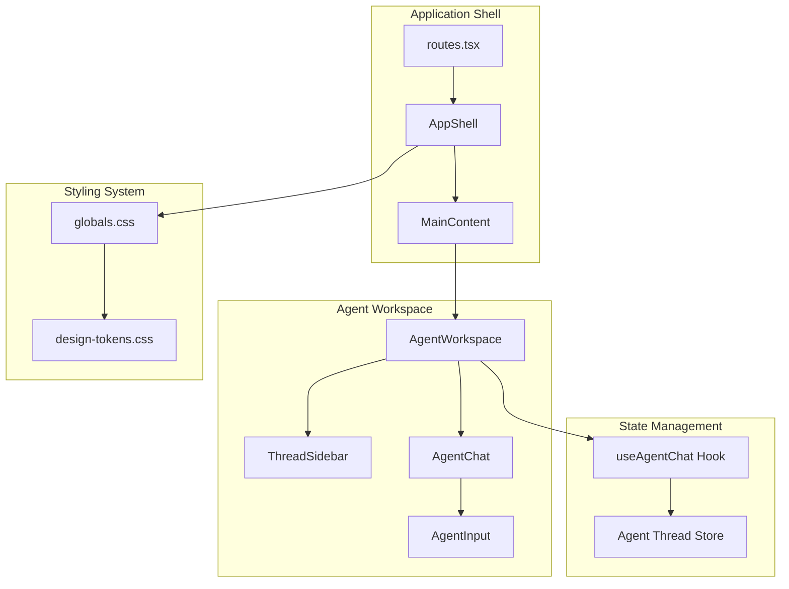
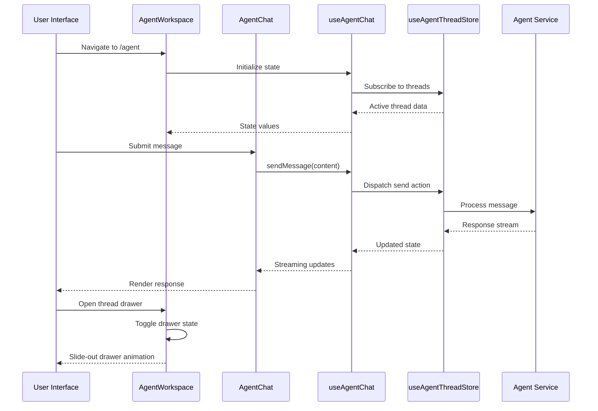
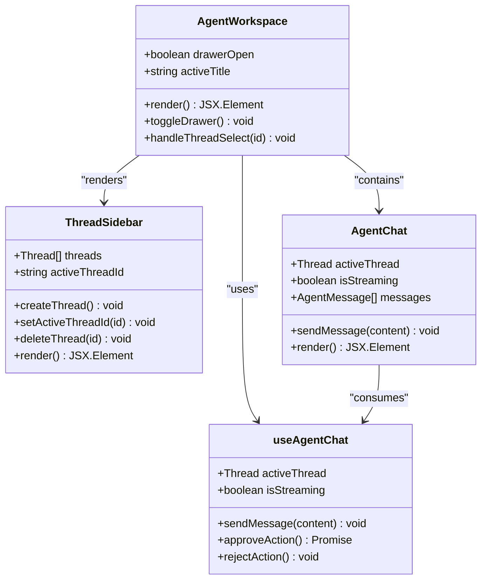
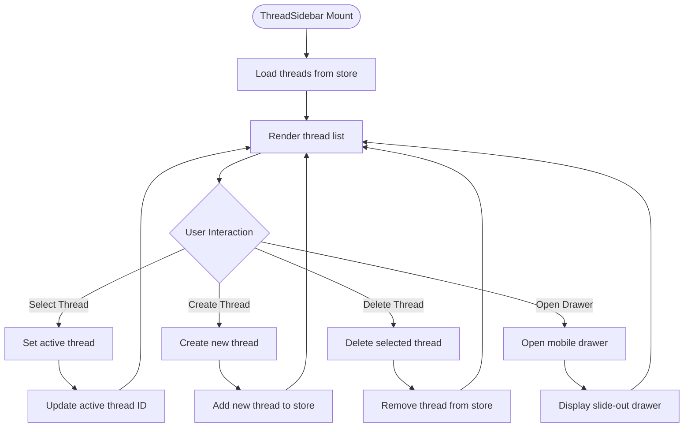
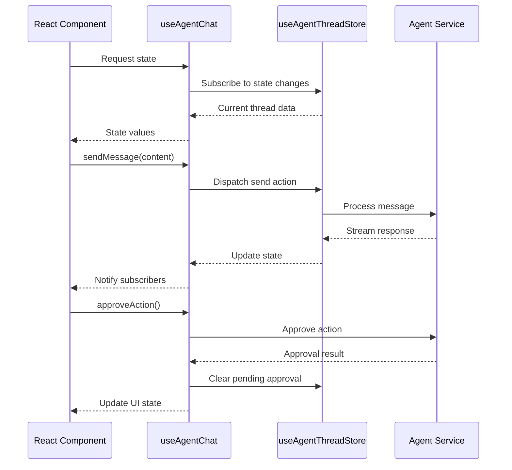
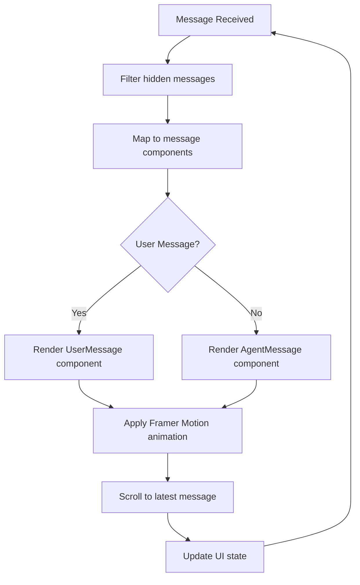
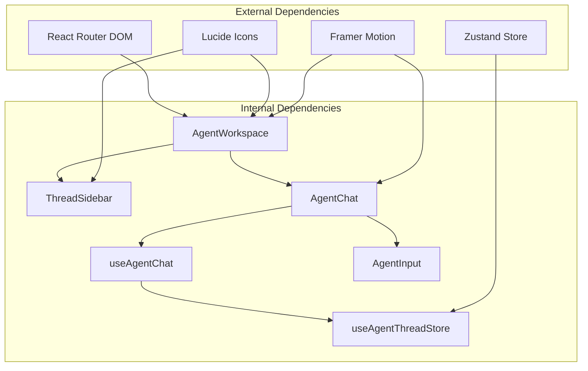

# Agent Workspace Interface

<cite>
**Referenced Files in This Document**
- [AgentWorkspace.tsx](file://src/components/agent/AgentWorkspace.tsx)
- [useAgentChat.ts](file://src/hooks/useAgentChat.ts)
- [ThreadSidebar.tsx](file://src/components/agent/ThreadSidebar.tsx)
- [useAgentThreadStore.ts](file://src/store/useAgentThreadStore.ts)
- [AgentChat.tsx](file://src/components/agent/AgentChat.tsx)
- [AgentInput.tsx](file://src/components/agent/AgentInput.tsx)
- [AppShell.tsx](file://src/components/layout/AppShell.tsx)
- [MainContent.tsx](file://src/components/layout/MainContent.tsx)
- [routes.tsx](file://src/routes.tsx)
- [globals.css](file://src/styles/globals.css)
- [design-tokens.css](file://src/styles/design-tokens.css)
</cite>

## Table of Contents
1. [Introduction](#introduction)
2. [Project Structure](#project-structure)
3. [Core Components](#core-components)
4. [Architecture Overview](#architecture-overview)
5. [Detailed Component Analysis](#detailed-component-analysis)
6. [Dependency Analysis](#dependency-analysis)
7. [Performance Considerations](#performance-considerations)
8. [Accessibility and Keyboard Navigation](#accessibility-and-keyboard-navigation)
9. [Troubleshooting Guide](#troubleshooting-guide)
10. [Conclusion](#conclusion)

## Introduction
The Agent Workspace interface is the central hub for conversational AI interactions within the SHADOW Protocol application. It provides a responsive layout combining a persistent thread sidebar for conversation history with a dynamic main chat area for real-time agent interactions. The component leverages modern React patterns including custom hooks for state management, Framer Motion for smooth animations, and a sophisticated thread management system powered by Zustand stores.

The workspace serves as the primary entry point for agent-driven DeFi assistance, enabling users to manage multiple conversation threads while maintaining contextual continuity across different interaction scenarios. Its design emphasizes operational efficiency with a dark-first aesthetic and glass-morphism UI elements that enhance the immersive experience.

## Project Structure
The Agent Workspace is integrated into the broader application routing system and follows a component-based architecture pattern. The workspace sits within the main application shell and responds to route changes while maintaining persistent state across navigation.

**Diagram sources**
- [routes.tsx:14-32](file://src/routes.tsx#L14-L32)
- [AppShell.tsx:31-277](file://src/components/layout/AppShell.tsx#L31-L277)
- [AgentWorkspace.tsx:10-65](file://src/components/agent/AgentWorkspace.tsx#L10-L65)

**Section sources**
- [routes.tsx:14-32](file://src/routes.tsx#L14-L32)
- [AppShell.tsx:31-277](file://src/components/layout/AppShell.tsx#L31-L277)

## Core Components
The Agent Workspace interface consists of several interconnected components that work together to provide a seamless conversational experience:

### Layout Architecture
The workspace employs a flexible two-column layout on larger screens with a mobile-first drawer system for smaller devices. The main container uses flexbox with responsive gap spacing controlled by Tailwind utility classes.

### State Management System
The component utilizes a custom hook (`useAgentChat`) that encapsulates all agent interaction logic, including message sending, approval workflows, and streaming state management. This hook provides a clean abstraction over the underlying Zustand store.

### Animation Framework
Framer Motion integration enables smooth transitions for the mobile drawer, message entries, and approval modals. The animation system enhances user experience through micro-interactions while maintaining performance standards.

**Section sources**
- [AgentWorkspace.tsx:10-65](file://src/components/agent/AgentWorkspace.tsx#L10-L65)
- [useAgentChat.ts:13-97](file://src/hooks/useAgentChat.ts#L13-L97)

## Architecture Overview
The Agent Workspace implements a layered architecture that separates concerns between presentation, state management, and data persistence. The system follows React best practices with clear component boundaries and predictable data flow.

**Diagram sources**
- [AgentWorkspace.tsx:10-65](file://src/components/agent/AgentWorkspace.tsx#L10-L65)
- [AgentChat.tsx:10-124](file://src/components/agent/AgentChat.tsx#L10-L124)
- [useAgentChat.ts:13-97](file://src/hooks/useAgentChat.ts#L13-L97)
- [useAgentThreadStore.ts:121-597](file://src/store/useAgentThreadStore.ts#L121-L597)

## Detailed Component Analysis

### AgentWorkspace Component
The AgentWorkspace serves as the primary container that orchestrates the entire agent interaction experience. It manages responsive layout behavior, mobile drawer functionality, and integrates with the thread management system.

**Diagram sources**
- [AgentWorkspace.tsx:10-65](file://src/components/agent/AgentWorkspace.tsx#L10-L65)
- [ThreadSidebar.tsx:117-176](file://src/components/agent/ThreadSidebar.tsx#L117-L176)
- [AgentChat.tsx:10-124](file://src/components/agent/AgentChat.tsx#L10-L124)
- [useAgentChat.ts:13-97](file://src/hooks/useAgentChat.ts#L13-L97)

#### Responsive Layout Implementation
The workspace implements a sophisticated responsive design pattern that adapts to different screen sizes:

- **Desktop View**: Persistent sidebar with full thread list
- **Tablet View**: Adaptive spacing and sizing adjustments  
- **Mobile View**: Slide-out drawer for thread navigation

The layout uses Tailwind's responsive utility classes with breakpoints at `md:` and `lg:` levels to ensure optimal viewing experience across devices.

#### Mobile Drawer Functionality
The mobile drawer system provides seamless thread navigation on smaller screens through a slide-out panel with backdrop overlay. The implementation includes:

- Smooth spring animations using Framer Motion
- Click-outside-to-close behavior
- Fixed positioning with z-index stacking
- Responsive width constraints

**Section sources**
- [AgentWorkspace.tsx:10-65](file://src/components/agent/AgentWorkspace.tsx#L10-L65)

### ThreadSidebar Component
The ThreadSidebar component manages conversation history with advanced filtering, selection, and deletion capabilities. It implements accessibility best practices with proper ARIA attributes and keyboard navigation support.

**Diagram sources**
- [ThreadSidebar.tsx:117-176](file://src/components/agent/ThreadSidebar.tsx#L117-L176)
- [useAgentThreadStore.ts:127-133](file://src/store/useAgentThreadStore.ts#L127-L133)

#### Thread Management Features
The sidebar provides comprehensive thread management capabilities:

- **Thread Preview Generation**: Intelligent preview extraction from message blocks
- **Timestamp Formatting**: Relative time display with contextual accuracy
- **Visual Indicators**: Active thread highlighting and hover states
- **Deletion Controls**: Conditional deletion based on thread count
- **Accessibility Support**: Keyboard navigation and screen reader compatibility

**Section sources**
- [ThreadSidebar.tsx:117-176](file://src/components/agent/ThreadSidebar.tsx#L117-L176)

### useAgentChat Hook
The useAgentChat hook encapsulates all agent interaction logic and provides a unified interface for the workspace components. It manages state synchronization between the UI and the underlying thread store.

**Diagram sources**
- [useAgentChat.ts:13-97](file://src/hooks/useAgentChat.ts#L13-L97)
- [useAgentThreadStore.ts:198-533](file://src/store/useAgentThreadStore.ts#L198-L533)

#### State Management Patterns
The hook implements several advanced state management patterns:

- **Selector Pattern**: Efficient state subscription with granular updates
- **Callback Memoization**: Stable function references to prevent unnecessary re-renders
- **Async State Handling**: Proper loading and error state management
- **Approval Workflow Coordination**: Synchronized approval and rejection flows

**Section sources**
- [useAgentChat.ts:13-97](file://src/hooks/useAgentChat.ts#L13-L97)

### AgentChat Component
The AgentChat component renders the main conversation interface with sophisticated message rendering and animation systems. It handles both user and agent messages with appropriate styling and interaction patterns.

**Diagram sources**
- [AgentChat.tsx:10-124](file://src/components/agent/AgentChat.tsx#L10-L124)

#### Message Rendering System
The chat component implements a flexible message rendering system:

- **Dynamic Component Selection**: Automatic component selection based on message role
- **Block-Based Content**: Support for various message block types (text, decisions, tools)
- **Approval Integration**: Seamless integration with approval workflow components
- **Animation System**: Spring-based animations for natural message appearance
- **Auto-scroll Behavior**: Intelligent scrolling to maintain conversation context

**Section sources**
- [AgentChat.tsx:10-124](file://src/components/agent/AgentChat.tsx#L10-L124)

## Dependency Analysis
The Agent Workspace interface demonstrates excellent separation of concerns with clear dependency relationships and minimal coupling between components.

**Diagram sources**
- [AgentWorkspace.tsx:1-8](file://src/components/agent/AgentWorkspace.tsx#L1-L8)
- [AgentChat.tsx:1-8](file://src/components/agent/AgentChat.tsx#L1-L8)
- [useAgentThreadStore.ts:1-2](file://src/store/useAgentThreadStore.ts#L1-L2)

### Component Coupling Analysis
The workspace maintains loose coupling through well-defined interfaces and prop drilling patterns. Each component has a single responsibility and communicates primarily through props and shared state.

### State Management Dependencies
The state management system relies on Zustand for efficient state updates and minimal re-renders. The useAgentChat hook acts as a mediator between UI components and the underlying store, providing a clean abstraction layer.

**Section sources**
- [AgentWorkspace.tsx:1-8](file://src/components/agent/AgentWorkspace.tsx#L1-L8)
- [useAgentThreadStore.ts:1-2](file://src/store/useAgentThreadStore.ts#L1-L2)

## Performance Considerations
The Agent Workspace implements several performance optimization strategies to ensure smooth operation across different device capabilities:

### Rendering Optimizations
- **Selective Re-rendering**: Components only update when their specific state changes
- **Memoized Callbacks**: Stable function references prevent unnecessary parent re-renders
- **Efficient List Rendering**: Virtualized lists for large thread collections
- **Lazy Loading**: Images and heavy components loaded on demand

### Animation Performance
- **Hardware Acceleration**: CSS transforms and opacity for GPU-accelerated animations
- **Spring Physics**: Optimized spring configurations for natural motion
- **Reduced DOM Manipulation**: Minimal DOM changes during animations

### Memory Management
- **Automatic Cleanup**: Proper cleanup of event listeners and subscriptions
- **State Pruning**: Efficient state updates without memory leaks
- **Resource Pooling**: Reuse of animation and rendering resources

## Accessibility and Keyboard Navigation
The Agent Workspace implements comprehensive accessibility features to ensure inclusive usage across diverse user needs:

### Keyboard Navigation Patterns
- **Tab Order**: Logical tab order through interactive elements
- **Focus Management**: Automatic focus restoration after interactions
- **Keyboard Shortcuts**: Support for essential shortcuts (Cmd/Ctrl+K for command palette)
- **Screen Reader Support**: ARIA labels and semantic HTML structure

### Screen Reader Compatibility
- **Descriptive Labels**: Comprehensive aria-label attributes for interactive elements
- **Live Regions**: Dynamic content announcements for new messages
- **Status Updates**: Real-time feedback for approval workflows
- **Error States**: Clear error messaging with proper focus management

### Visual Accessibility
- **Color Contrast**: High contrast ratios meeting WCAG guidelines
- **Text Scaling**: Responsive typography supporting zoom functionality
- **Motion Preferences**: Reduced motion mode support
- **Color Independence**: Non-color-dependent information conveyance

**Section sources**
- [ThreadSidebar.tsx:56-73](file://src/components/agent/ThreadSidebar.tsx#L56-L73)
- [AgentWorkspace.tsx:26-28](file://src/components/agent/AgentWorkspace.tsx#L26-L28)
- [AppShell.tsx:155-176](file://src/components/layout/AppShell.tsx#L155-L176)

## Troubleshooting Guide

### Common Issues and Solutions

#### Thread Loading Problems
**Symptoms**: Threads not appearing or loading slowly
**Causes**: 
- Store hydration delays
- Network connectivity issues
- Large thread histories

**Solutions**:
- Verify store persistence is functioning
- Check network connectivity for agent responses
- Implement pagination for large thread collections

#### Animation Performance Issues
**Symptoms**: Stuttering animations or delayed interactions
**Causes**:
- Excessive DOM nodes
- Complex animations on low-end devices
- Memory leaks in animation handlers

**Solutions**:
- Reduce concurrent animations
- Implement animation throttling
- Clean up animation event listeners

#### Mobile Drawer Not Responding
**Symptoms**: Drawer opens but ignores interactions
**Causes**:
- Event propagation issues
- CSS z-index conflicts
- Touch event handling problems

**Solutions**:
- Check for event handler conflicts
- Verify z-index stacking context
- Test touch event compatibility

### Debugging Tools and Techniques
- **React DevTools**: Monitor component re-renders and state changes
- **Zustand DevTools**: Track store mutations and state evolution
- **Performance Profiler**: Identify performance bottlenecks
- **Console Logging**: Strategic logging for async operations

**Section sources**
- [useAgentThreadStore.ts:502-531](file://src/store/useAgentThreadStore.ts#L502-L531)
- [AgentWorkspace.tsx:40-61](file://src/components/agent/AgentWorkspace.tsx#L40-L61)

## Conclusion
The Agent Workspace interface represents a sophisticated implementation of modern React patterns combined with thoughtful UX design. Its responsive architecture, robust state management, and accessibility features create a compelling foundation for agent-driven DeFi interactions.

The component's modular design enables easy maintenance and extension while its performance optimizations ensure smooth operation across diverse device capabilities. The integration with the broader application ecosystem through the AppShell and routing system demonstrates cohesive architectural planning.

Future enhancements could include advanced thread filtering, collaborative features, and expanded customization options while maintaining the existing high standards for performance and accessibility.