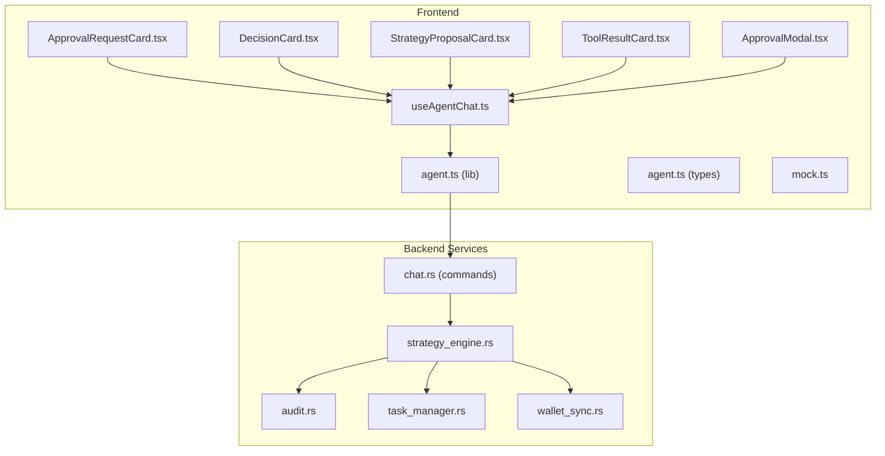
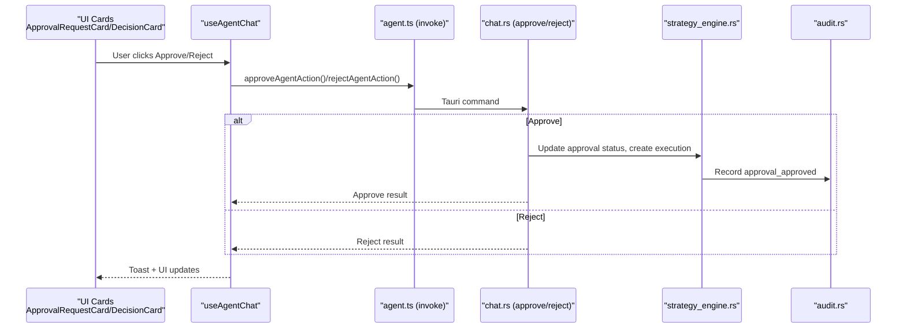
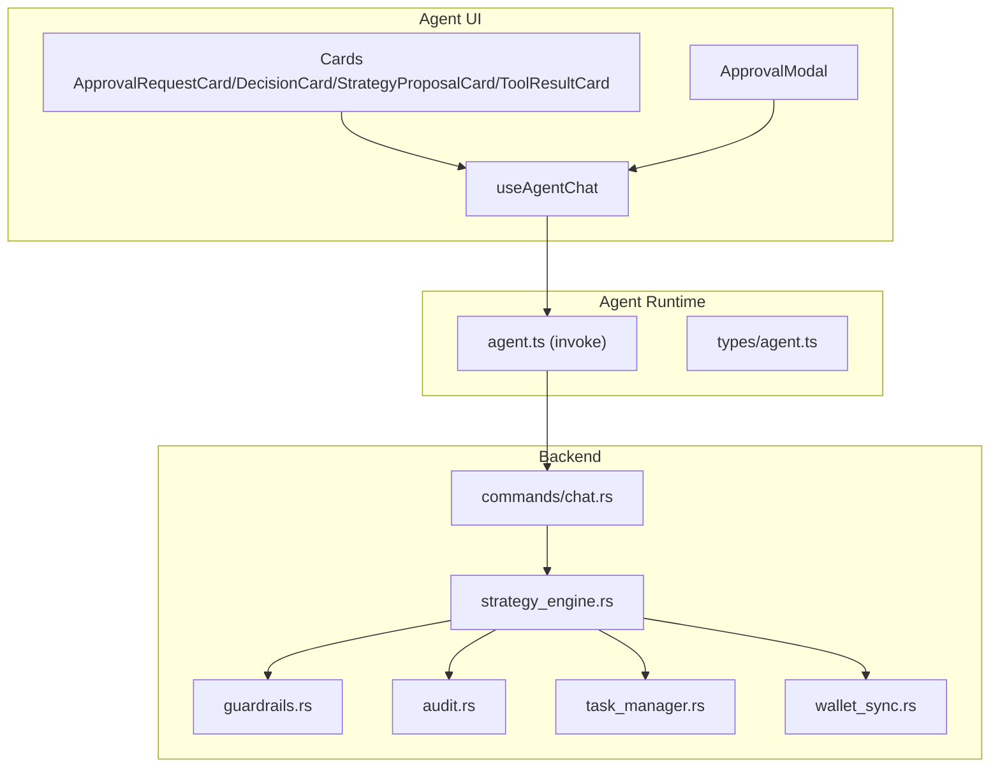
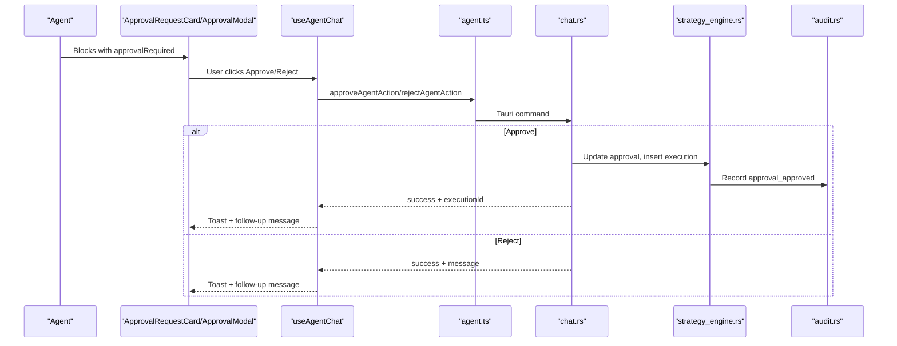
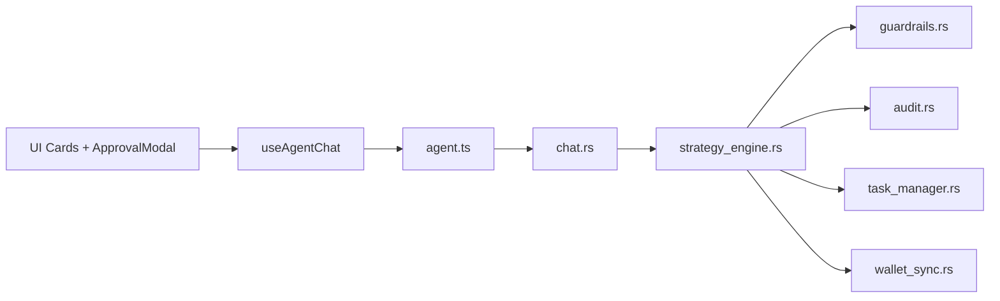

# Approval & Execution Workflow

<cite>
**Referenced Files in This Document**
- [ApprovalRequestCard.tsx](file://src/components/agent/ApprovalRequestCard.tsx)
- [DecisionCard.tsx](file://src/components/agent/DecisionCard.tsx)
- [StrategyProposalCard.tsx](file://src/components/agent/StrategyProposalCard.tsx)
- [ToolResultCard.tsx](file://src/components/agent/ToolResultCard.tsx)
- [ApprovalModal.tsx](file://src/components/shared/ApprovalModal.tsx)
- [agent.ts](file://src/lib/agent.ts)
- [useAgentChat.ts](file://src/hooks/useAgentChat.ts)
- [agent.ts](file://src/types/agent.ts)
- [mock.ts](file://src/data/mock.ts)
- [strategy_engine.rs](file://src-tauri/src/services/strategy_engine.rs)
- [task_manager.rs](file://src-tauri/src/services/task_manager.rs)
- [audit.rs](file://src-tauri/src/services/audit.rs)
- [wallet_sync.rs](file://src-tauri/src/services/wallet_sync.rs)
- [chat.rs](file://src-tauri/src/commands/chat.rs)
</cite>

## Table of Contents
1. [Introduction](#introduction)
2. [Project Structure](#project-structure)
3. [Core Components](#core-components)
4. [Architecture Overview](#architecture-overview)
5. [Detailed Component Analysis](#detailed-component-analysis)
6. [Dependency Analysis](#dependency-analysis)
7. [Performance Considerations](#performance-considerations)
8. [Troubleshooting Guide](#troubleshooting-guide)
9. [Conclusion](#conclusion)

## Introduction
This document explains the approval and execution workflow system powering autonomous DeFi operations in the AI agent interface. It covers how AI agents propose actions, how users review and approve or reject them, and how the system executes them under guardrails. It documents four UI cards that present actionable items to the user, details the approval flow from suggestion to execution confirmation, and explains security implications, user verification, audit trails, and integrations with wallet services, the strategy engine, and background task management. Examples of scenarios, rejection handling, escalation, and the balance between AI suggestions and human oversight are included.

## Project Structure
The approval and execution workflow spans React components for presentation, a Tauri-backed agent library for orchestration, and Rust services for strategy evaluation, guardrails, auditing, and background synchronization.

**Diagram sources**
- [ApprovalRequestCard.tsx:31-108](file://src/components/agent/ApprovalRequestCard.tsx#L31-L108)
- [DecisionCard.tsx:16-96](file://src/components/agent/DecisionCard.tsx#L16-L96)
- [StrategyProposalCard.tsx:16-87](file://src/components/agent/StrategyProposalCard.tsx#L16-L87)
- [ToolResultCard.tsx:121-159](file://src/components/agent/ToolResultCard.tsx#L121-L159)
- [ApprovalModal.tsx:25-141](file://src/components/shared/ApprovalModal.tsx#L25-L141)
- [useAgentChat.ts:13-96](file://src/hooks/useAgentChat.ts#L13-L96)
- [agent.ts:14-86](file://src/lib/agent.ts#L14-L86)
- [agent.ts:27-92](file://src/types/agent.ts#L27-L92)
- [mock.ts:80-90](file://src/data/mock.ts#L80-L90)
- [strategy_engine.rs:343-725](file://src-tauri/src/services/strategy_engine.rs#L343-L725)
- [audit.rs:5-24](file://src-tauri/src/services/audit.rs#L5-L24)
- [task_manager.rs:431-502](file://src-tauri/src/services/task_manager.rs#L431-L502)
- [wallet_sync.rs:260-452](file://src-tauri/src/services/wallet_sync.rs#L260-L452)
- [chat.rs:395-483](file://src-tauri/src/commands/chat.rs#L395-L483)

**Section sources**
- [ApprovalRequestCard.tsx:31-108](file://src/components/agent/ApprovalRequestCard.tsx#L31-L108)
- [useAgentChat.ts:13-96](file://src/hooks/useAgentChat.ts#L13-L96)
- [agent.ts:14-86](file://src/lib/agent.ts#L14-L86)
- [strategy_engine.rs:343-725](file://src-tauri/src/services/strategy_engine.rs#L343-L725)

## Core Components
- ApprovalRequestCard: Presents a single actionable item (swap preview or strategy proposal) with explicit approval controls and contextual details.
- DecisionCard: Summarizes AI-driven portfolio advice with risk, allocations, and confidence.
- StrategyProposalCard: Proposes automated strategies with triggers, actions, and active guardrails, enabling deployment.
- ToolResultCard: Renders tool outputs (portfolio aggregates, balances, prices) in a structured, readable format.
- ApprovalModal: Provides a modalized confirmation surface for transaction-level approvals with simulation and privacy toggles.
- Agent orchestration hooks and libraries: Manage approval lifecycle, invoke backend actions, and surface feedback.
- Backend services: Evaluate strategies, enforce guardrails, log audits, manage tasks, and synchronize wallets.

**Section sources**
- [ApprovalRequestCard.tsx:31-108](file://src/components/agent/ApprovalRequestCard.tsx#L31-L108)
- [DecisionCard.tsx:16-96](file://src/components/agent/DecisionCard.tsx#L16-L96)
- [StrategyProposalCard.tsx:16-87](file://src/components/agent/StrategyProposalCard.tsx#L16-L87)
- [ToolResultCard.tsx:121-159](file://src/components/agent/ToolResultCard.tsx#L121-L159)
- [ApprovalModal.tsx:25-141](file://src/components/shared/ApprovalModal.tsx#L25-L141)
- [agent.ts:14-86](file://src/lib/agent.ts#L14-L86)
- [agent.ts:27-92](file://src/types/agent.ts#L27-L92)

## Architecture Overview
The system integrates frontend UI cards with a Tauri agent runtime. AI suggestions are surfaced as response blocks. When an approval is required, the frontend displays either ApprovalRequestCard or ApprovalModal. The user’s decision invokes backend commands that update approval state, optionally create executions, and emit audit events. Strategy engine evaluates automation plans and may escalate to approval requests when direct execution is not available. Background services keep wallet data fresh and maintain audit logs.

**Diagram sources**
- [useAgentChat.ts:39-78](file://src/hooks/useAgentChat.ts#L39-L78)
- [agent.ts:29-51](file://src/lib/agent.ts#L29-L51)
- [chat.rs:395-483](file://src-tauri/src/commands/chat.rs#L395-L483)
- [strategy_engine.rs:343-725](file://src-tauri/src/services/strategy_engine.rs#L343-L725)
- [audit.rs:5-24](file://src-tauri/src/services/audit.rs#L5-L24)

## Detailed Component Analysis

### ApprovalRequestCard
Purpose: Render actionable items requiring user review. Supports swap previews and strategy proposals. Provides Approve/Reject buttons.

Key behaviors:
- Detects tool type and payload shape to render swap details or strategy proposal preview.
- Exposes onApprove/onReject callbacks and disabled state during pending operations.
- Swap preview shows network, slippage, gas estimate, and estimated output.
- Strategy proposal preview shows trigger/action and guardrails.

Security and UX:
- Clear labeling of tool name and message context.
- Disabled controls while pending to prevent concurrent approvals.

**Section sources**
- [ApprovalRequestCard.tsx:31-108](file://src/components/agent/ApprovalRequestCard.tsx#L31-L108)
- [agent.ts:94-110](file://src/types/agent.ts#L94-L110)

### DecisionCard
Purpose: Present AI-generated portfolio advice with risk, allocations, and recommended action.

Key behaviors:
- Displays total value, risk level, dominant asset, imbalance, and allocation breakdown.
- Shows action, amount percentage, and reason with confidence indicator.
- Indicates simulated mode when applicable.

Security and UX:
- Non-blocking advisory UI; does not execute actions itself.
- Confidence and reasoning help inform user judgment.

**Section sources**
- [DecisionCard.tsx:16-96](file://src/components/agent/DecisionCard.tsx#L16-L96)
- [agent.ts:67-71](file://src/types/agent.ts#L67-L71)

### StrategyProposalCard
Purpose: Allow users to deploy proposed automation strategies with guardrails.

Key behaviors:
- Renders strategy name, summary, trigger/action, and active guardrails.
- Deploys strategy via a simulated process and shows success feedback.

Security and UX:
- Guardrails visibility encourages cautious automation.
- Deployment is user-initiated and explicit.

**Section sources**
- [StrategyProposalCard.tsx:16-87](file://src/components/agent/StrategyProposalCard.tsx#L16-L87)
- [agent.ts:57-65](file://src/types/agent.ts#L57-L65)

### ToolResultCard
Purpose: Render tool outputs in a structured, readable way.

Key behaviors:
- Recognizes portfolio, balances, and price tool outputs and renders specialized cards.
- Falls back to raw JSON rendering for other tool results.

Security and UX:
- Structured views reduce cognitive load and improve trust.
- JSON fallback preserves fidelity for unknown outputs.

**Section sources**
- [ToolResultCard.tsx:121-159](file://src/components/agent/ToolResultCard.tsx#L121-L159)
- [agent.ts:54-56](file://src/types/agent.ts#L54-L56)

### ApprovalModal
Purpose: Modalized transaction approval with simulation preview, privacy toggle, and execution window notice.

Key behaviors:
- Displays action, amount, chain, slippage/gas, reason, and simulation outcome.
- Allows “Don’t ask again” preference for a given strategy.
- Emits approval or rejection via callback.

Security and UX:
- Simulation preview builds trust and sets expectations.
- Privacy toggle and execution window messaging enhance transparency.

**Section sources**
- [ApprovalModal.tsx:25-141](file://src/components/shared/ApprovalModal.tsx#L25-L141)
- [mock.ts:80-90](file://src/data/mock.ts#L80-L90)

### Agent Orchestration Hooks and Library
Purpose: Bridge UI actions to backend commands and manage approval lifecycle.

Key behaviors:
- approveAction invokes backend approveAgentAction with approvalId, toolName, payload, and expectedVersion.
- rejectAction invokes backend rejectAgentAction with approvalId and expectedVersion.
- Uses toast notifications and thread recording to track follow-ups.
- Prevents concurrent approvals and handles errors gracefully.

Security and UX:
- Expected version prevents race conditions on approvals.
- Hidden follow-up messages guide agent behavior after user decisions.

**Section sources**
- [useAgentChat.ts:39-78](file://src/hooks/useAgentChat.ts#L39-L78)
- [agent.ts:29-51](file://src/lib/agent.ts#L29-L51)
- [agent.ts:112-134](file://src/types/agent.ts#L112-L134)

### Backend Strategy Engine
Purpose: Evaluate automation strategies and escalate to approvals when direct execution is not available.

Key behaviors:
- Loads compiled strategy plans and builds context from wallet and portfolio data.
- Evaluates triggers (time, drift thresholds, thresholds) and conditions (portfolio floor, gas, slippage, availability, cooldown, drift minimum).
- Enforces guardrails (max per trade, allowed chains, min portfolio).
- Creates approval requests for strategy actions and emits alerts.
- Persists strategy execution records and audit events.

Security and UX:
- Guardrails protect capital and align with user-configured policies.
- Approval escalations ensure human oversight for risky or high-value actions.

**Section sources**
- [strategy_engine.rs:343-725](file://src-tauri/src/services/strategy_engine.rs#L343-L725)
- [audit.rs:5-24](file://src-tauri/src/services/audit.rs#L5-L24)

### Task Management (Background)
Purpose: Generate, validate, and track background tasks derived from portfolio and market signals.

Key behaviors:
- Generates tasks from health alerts and drift analysis with confidence scores.
- Validates tasks against guardrails and applies kill switch checks.
- Tracks task lifecycle (suggested → approved/rejected/executing/completed/failed/dismissed).
- Records behavior events for learning.

Security and UX:
- Kill switch prevents actions when safety is compromised.
- Clear status transitions support user visibility and auditability.

**Section sources**
- [task_manager.rs:167-502](file://src-tauri/src/services/task_manager.rs#L167-L502)

### Wallet Synchronization (Background)
Purpose: Keep wallet balances, NFTs, and transactions synchronized across supported networks.

Key behaviors:
- Fetches tokens, NFTs, and transfers via external APIs and persists snapshots.
- Emits progress and completion events.
- Triggers portfolio refresh and opportunity updates post-sync.

Security and UX:
- Periodic sync ensures accurate context for AI decisions and approvals.
- Progress events improve transparency.

**Section sources**
- [wallet_sync.rs:260-452](file://src-tauri/src/services/wallet_sync.rs#L260-L452)

## Architecture Overview
The approval and execution workflow integrates UI cards, agent orchestration, backend commands, strategy evaluation, guardrails, auditing, and background services.

**Diagram sources**
- [ApprovalRequestCard.tsx:31-108](file://src/components/agent/ApprovalRequestCard.tsx#L31-L108)
- [DecisionCard.tsx:16-96](file://src/components/agent/DecisionCard.tsx#L16-L96)
- [StrategyProposalCard.tsx:16-87](file://src/components/agent/StrategyProposalCard.tsx#L16-L87)
- [ToolResultCard.tsx:121-159](file://src/components/agent/ToolResultCard.tsx#L121-L159)
- [ApprovalModal.tsx:25-141](file://src/components/shared/ApprovalModal.tsx#L25-L141)
- [useAgentChat.ts:13-96](file://src/hooks/useAgentChat.ts#L13-L96)
- [agent.ts:14-86](file://src/lib/agent.ts#L14-L86)
- [agent.ts:27-92](file://src/types/agent.ts#L27-L92)
- [chat.rs:395-483](file://src-tauri/src/commands/chat.rs#L395-L483)
- [strategy_engine.rs:343-725](file://src-tauri/src/services/strategy_engine.rs#L343-L725)
- [task_manager.rs:431-502](file://src-tauri/src/services/task_manager.rs#L431-L502)
- [wallet_sync.rs:260-452](file://src-tauri/src/services/wallet_sync.rs#L260-L452)

## Detailed Component Analysis

### Approval Flow: From Agent Suggestion to Execution Confirmation
The flow begins when the agent responds with an approval-required block. The UI presents an appropriate card, and the user decides. The hook invokes backend commands, which update state and, if approved, initiate execution or strategy creation. Audit events are recorded, and the UI receives feedback.

**Diagram sources**
- [agent.ts:80-88](file://src/types/agent.ts#L80-L88)
- [useAgentChat.ts:39-78](file://src/hooks/useAgentChat.ts#L39-L78)
- [agent.ts:29-51](file://src/lib/agent.ts#L29-L51)
- [chat.rs:395-483](file://src-tauri/src/commands/chat.rs#L395-L483)
- [strategy_engine.rs:343-725](file://src-tauri/src/services/strategy_engine.rs#L343-L725)
- [audit.rs:5-24](file://src-tauri/src/services/audit.rs#L5-L24)

**Section sources**
- [agent.ts:80-88](file://src/types/agent.ts#L80-L88)
- [useAgentChat.ts:39-78](file://src/hooks/useAgentChat.ts#L39-L78)
- [chat.rs:395-483](file://src-tauri/src/commands/chat.rs#L395-L483)

### Security Implications by Approval Type
- Transaction approvals: Require explicit user confirmation, show simulation outcomes, and allow “don’t ask again” preferences per strategy. Guardrails and execution windows apply.
- Strategy proposals: Visible guardrails and triggers; deployment is user-initiated.
- Tool results: Advisory outputs; no execution occurs.
- Background tasks: Generated from portfolio and market signals; validated against guardrails and kill switches.

Verification and audit:
- Versioned approvals prevent concurrent modifications.
- Audit logging records approval events and outcomes.
- Wallet sync ensures accurate context for decisions.

Escalation:
- Strategies that cannot execute directly escalate to approval requests.
- Kill switch and guardrail violations block execution.

**Section sources**
- [ApprovalModal.tsx:25-141](file://src/components/shared/ApprovalModal.tsx#L25-L141)
- [StrategyProposalCard.tsx:16-87](file://src/components/agent/StrategyProposalCard.tsx#L16-L87)
- [strategy_engine.rs:343-725](file://src-tauri/src/services/strategy_engine.rs#L343-L725)
- [task_manager.rs:431-502](file://src-tauri/src/services/task_manager.rs#L431-L502)
- [audit.rs:5-24](file://src-tauri/src/services/audit.rs#L5-L24)

### Examples of Approval Scenarios
- Swap execution: The agent proposes a swap with details (from/to tokens, amounts, chain, slippage, gas). The user reviews and approves or rejects.
- Strategy creation: The agent proposes an automation strategy with trigger/action/guardrails. The user deploys it.
- Portfolio rebalance: The agent suggests rebalancing based on drift; the strategy engine creates an approval request when direct execution is not available.
- Task-based action: Background task generation may propose rebalancing or diversification; user approves or rejects.

Rejection handling:
- Rejection clears pending approval and sends a hidden follow-up message to the agent for graceful acknowledgment.

Escalation:
- When direct execution is unavailable, the strategy engine creates an approval request and records audit events.

**Section sources**
- [ApprovalRequestCard.tsx:31-108](file://src/components/agent/ApprovalRequestCard.tsx#L31-L108)
- [StrategyProposalCard.tsx:16-87](file://src/components/agent/StrategyProposalCard.tsx#L16-L87)
- [strategy_engine.rs:572-620](file://src-tauri/src/services/strategy_engine.rs#L572-L620)
- [task_manager.rs:167-195](file://src-tauri/src/services/task_manager.rs#L167-L195)

### Relationship Between AI Suggestions and Human Oversight
- AI provides suggestions and simulations; humans decide whether to act.
- Guardrails and kill switches ensure safety boundaries.
- Audit trails and execution logs provide transparency and compliance readiness.
- Background services keep context fresh, improving the quality of AI decisions.

**Section sources**
- [DecisionCard.tsx:16-96](file://src/components/agent/DecisionCard.tsx#L16-L96)
- [strategy_engine.rs:343-725](file://src-tauri/src/services/strategy_engine.rs#L343-L725)
- [audit.rs:5-24](file://src-tauri/src/services/audit.rs#L5-L24)

## Dependency Analysis
The approval and execution workflow depends on:
- Frontend UI cards and hooks for user interaction.
- Agent library for invoking backend commands.
- Backend strategy engine for evaluation and escalation.
- Guardrails and audit services for safety and compliance.
- Background task manager and wallet sync for context and lifecycle.

**Diagram sources**
- [useAgentChat.ts:13-96](file://src/hooks/useAgentChat.ts#L13-L96)
- [agent.ts:14-86](file://src/lib/agent.ts#L14-L86)
- [chat.rs:395-483](file://src-tauri/src/commands/chat.rs#L395-L483)
- [strategy_engine.rs:343-725](file://src-tauri/src/services/strategy_engine.rs#L343-L725)
- [task_manager.rs:431-502](file://src-tauri/src/services/task_manager.rs#L431-L502)
- [wallet_sync.rs:260-452](file://src-tauri/src/services/wallet_sync.rs#L260-L452)

**Section sources**
- [useAgentChat.ts:13-96](file://src/hooks/useAgentChat.ts#L13-L96)
- [agent.ts:14-86](file://src/lib/agent.ts#L14-L86)
- [strategy_engine.rs:343-725](file://src-tauri/src/services/strategy_engine.rs#L343-L725)

## Performance Considerations
- Minimize UI blocking: Pending states and disabled controls prevent redundant submissions.
- Efficient backend evaluation: Strategy engine short-circuits when conditions are not met.
- Background synchronization: Wallet sync is asynchronous and emits progress events.
- Audit logging: Lightweight JSON serialization avoids heavy computation.

## Troubleshooting Guide
Common issues and resolutions:
- Approval conflicts: Ensure expectedVersion matches server state to avoid concurrency errors.
- No execution: When direct execution is unavailable, the system escalates to approval requests; confirm the approval was created and approved.
- Guardrail violations: Review configured limits (trade size, chains, slippage) and adjust strategy or settings.
- Kill switch active: Execution is blocked globally; deactivate the kill switch or override policy carefully.
- Stale context: Wallet sync may be in progress; wait for completion or trigger a new sync.

**Section sources**
- [chat.rs:395-483](file://src-tauri/src/commands/chat.rs#L395-L483)
- [strategy_engine.rs:436-474](file://src-tauri/src/services/strategy_engine.rs#L436-L474)
- [task_manager.rs:470-483](file://src-tauri/src/services/task_manager.rs#L470-L483)
- [wallet_sync.rs:260-452](file://src-tauri/src/services/wallet_sync.rs#L260-L452)

## Conclusion
The approval and execution workflow blends AI-driven suggestions with robust human oversight, guardrails, and transparent audit trails. The UI cards present actionable items clearly, while the backend services ensure safety, compliance, and reliability. Users retain control over critical actions, and the system scales to automated strategies with explicit guardrails and escalation paths.