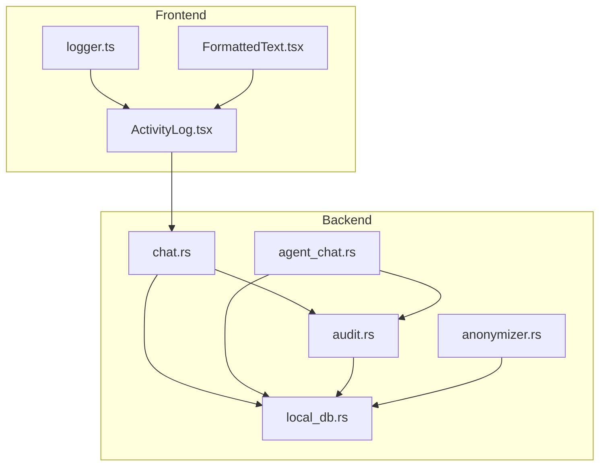
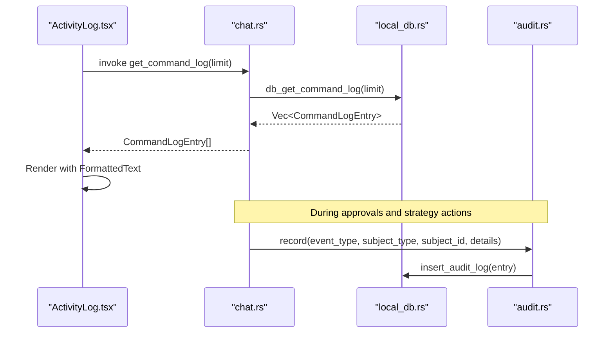
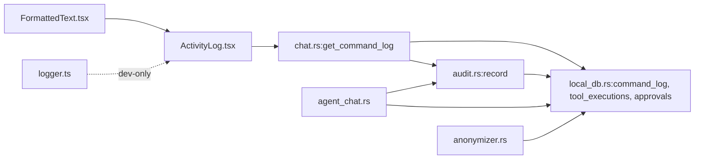

# Execution Logging & Audit Trail

<cite>
**Referenced Files in This Document**
- [FormattedText.tsx](file://src/components/agent/FormattedText.tsx)
- [logger.ts](file://src/lib/logger.ts)
- [ActivityLog.tsx](file://src/components/automation/ActivityLog.tsx)
- [audit.rs](file://src-tauri/src/services/audit.rs)
- [anonymizer.rs](file://src-tauri/src/services/anonymizer.rs)
- [local_db.rs](file://src-tauri/src/services/local_db.rs)
- [chat.rs](file://src-tauri/src/commands/chat.rs)
- [agent_chat.rs](file://src-tauri/src/services/agent_chat.rs)
</cite>

## Table of Contents
1. [Introduction](#introduction)
2. [Project Structure](#project-structure)
3. [Core Components](#core-components)
4. [Architecture Overview](#architecture-overview)
5. [Detailed Component Analysis](#detailed-component-analysis)
6. [Dependency Analysis](#dependency-analysis)
7. [Performance Considerations](#performance-considerations)
8. [Privacy-Preserving Logging & Compliance](#privacy-preserving-logging--compliance)
9. [Search, Filtering, and Export](#search-filtering-and-export)
10. [Relationship to Security Monitoring & Incident Investigation](#relationship-to-security-monitoring--incident-investigation)
11. [Troubleshooting Guide](#troubleshooting-guide)
12. [Conclusion](#conclusion)

## Introduction
This document describes the execution logging and audit trail system within the AI agent workflow. It explains how agent actions, approvals, and decisions are recorded with timestamps, user context, and system state. It documents the FormattedText component for displaying structured log information, the backend audit service for secure logging, and the logging hierarchy from low-level operations to high-level strategy executions. It also covers privacy-preserving logging techniques, anonymization, compliance considerations, search and filtering capabilities, export functionality, and the relationship between audit logs and security monitoring, incident investigation, and regulatory compliance.

## Project Structure
The logging and audit trail spans both frontend and backend components:
- Frontend displays logs and formatted content
- Backend records audit events and maintains local persistence
- Tools and agent orchestration trigger approvals and execution records

**Diagram sources**
- [ActivityLog.tsx:1-152](file://src/components/automation/ActivityLog.tsx#L1-L152)
- [FormattedText.tsx:1-63](file://src/components/agent/FormattedText.tsx#L1-L63)
- [logger.ts:1-6](file://src/lib/logger.ts#L1-L6)
- [chat.rs:1-609](file://src-tauri/src/commands/chat.rs#L1-L609)
- [agent_chat.rs:1-359](file://src-tauri/src/services/agent_chat.rs#L1-L359)
- [audit.rs:1-25](file://src-tauri/src/services/audit.rs#L1-L25)
- [anonymizer.rs:1-56](file://src-tauri/src/services/anonymizer.rs#L1-L56)
- [local_db.rs:108-176](file://src-tauri/src/services/local_db.rs#L108-L176)

**Section sources**
- [ActivityLog.tsx:1-152](file://src/components/automation/ActivityLog.tsx#L1-L152)
- [chat.rs:1-609](file://src-tauri/src/commands/chat.rs#L1-L609)
- [local_db.rs:108-176](file://src-tauri/src/services/local_db.rs#L108-L176)

## Core Components
- FormattedText: Renders markdown-formatted content for readable log entries and tool outputs.
- ActivityLog: Fetches and renders recent command logs with status, timestamps, and payloads.
- Audit service: Records structured audit events with event type, subject, optional subject ID, and serialized details.
- Local database: Stores audit logs, command logs, approvals, tool executions, strategy executions, and reasoning chains.
- Agent chat orchestration: Generates approval requests and records audit events for approvals and strategy lifecycle.
- Anonymizer: Produces privacy-preserving portfolio summaries for external processing.

**Section sources**
- [FormattedText.tsx:1-63](file://src/components/agent/FormattedText.tsx#L1-L63)
- [ActivityLog.tsx:1-152](file://src/components/automation/ActivityLog.tsx#L1-L152)
- [audit.rs:1-25](file://src-tauri/src/services/audit.rs#L1-L25)
- [local_db.rs:108-176](file://src-tauri/src/services/local_db.rs#L108-L176)
- [agent_chat.rs:190-359](file://src-tauri/src/services/agent_chat.rs#L190-L359)
- [anonymizer.rs:1-56](file://src-tauri/src/services/anonymizer.rs#L1-L56)

## Architecture Overview
The system captures agent actions and approvals, persists them locally, and exposes them via Tauri commands for the UI. Audit events are stored in a dedicated table with indexed timestamps for efficient retrieval.

**Diagram sources**
- [ActivityLog.tsx:92-108](file://src/components/automation/ActivityLog.tsx#L92-L108)
- [chat.rs:297-300](file://src-tauri/src/commands/chat.rs#L297-L300)
- [local_db.rs:108-115](file://src-tauri/src/services/local_db.rs#L108-L115)
- [audit.rs:5-24](file://src-tauri/src/services/audit.rs#L5-L24)

## Detailed Component Analysis

### FormattedText Component
Purpose:
- Renders markdown content from log entries and tool outputs with semantic HTML and code highlighting.

Key behaviors:
- Handles headings, paragraphs, lists, links, blockquotes, and inline code.
- Applies Tailwind-based styling for readability.
- Memoized rendering for performance.

Usage context:
- Used within ActivityLog to render structured payloads and tool results.

**Section sources**
- [FormattedText.tsx:1-63](file://src/components/agent/FormattedText.tsx#L1-L63)

### ActivityLog Component
Purpose:
- Displays recent command logs with status indicators, timestamps, and expandable payloads.

Key behaviors:
- Fetches latest logs via Tauri invoke.
- Expands/collapses entries to show raw JSON payloads.
- Formats timestamps and trims IDs for display.
- Provides a refresh mechanism.

Integration:
- Uses Tauri command get_command_log to retrieve entries from local_db.

**Section sources**
- [ActivityLog.tsx:1-152](file://src/components/automation/ActivityLog.tsx#L1-L152)
- [chat.rs:297-300](file://src-tauri/src/commands/chat.rs#L297-L300)

### Audit Service
Purpose:
- Centralized recording of audit events with consistent structure.

Behavior:
- Captures event_type, subject_type, optional subject_id, and serializable details.
- Adds a UNIX timestamp and a UUID for the entry.
- Inserts into the audit_log table.

Storage:
- audit_log table includes indexes on created_at for fast queries.

**Section sources**
- [audit.rs:1-25](file://src-tauri/src/services/audit.rs#L1-L25)
- [local_db.rs:169-176](file://src-tauri/src/services/local_db.rs#L169-L176)

### Local Database: Tables and Indices
Purpose:
- Persist audit logs, command logs, approvals, tool executions, strategy executions, and reasoning chains.

Highlights:
- command_log: stores tool execution attempts with status and payloads.
- audit_log: stores structured audit events with timestamps.
- approval_requests: tracks pending approvals with expiration and policies.
- tool_executions: records execution outcomes and errors.
- strategy_executions: ties strategy runs to approvals and tool executions.
- reasoning_chains: captures decision traces for transparency.

Indices:
- Created on created_at for audit_log and strategy_executions.
- Additional indices on status and timestamps for approvals and tool executions.

**Section sources**
- [local_db.rs:108-176](file://src-tauri/src/services/local_db.rs#L108-L176)
- [local_db.rs:321-416](file://src-tauri/src/services/local_db.rs#L321-L416)

### Agent Chat Orchestration and Audit
Purpose:
- Manages the agent’s reasoning loop, tool routing, and approval gating.
- Records audit events for approval creation, updates, and strategy lifecycle.

Key flows:
- Approval creation: When a tool requires user approval, an approval record is inserted and an audit event is emitted.
- Strategy lifecycle: Creation and updates emit audit events.
- Execution logging: Approved actions produce command logs and tool execution records.

**Section sources**
- [agent_chat.rs:190-359](file://src-tauri/src/services/agent_chat.rs#L190-L359)
- [chat.rs:116-140](file://src-tauri/src/commands/chat.rs#L116-L140)
- [chat.rs:143-210](file://src-tauri/src/commands/chat.rs#L143-L210)
- [chat.rs:374-421](file://src-tauri/src/commands/chat.rs#L374-L421)

### Privacy-Preserving Portfolio Sanitization
Purpose:
- Produce anonymized portfolio summaries for external AI processing.

Techniques:
- Removes sensitive identifiers.
- Converts absolute values to categories and percentages.
- Aggregates into coarse bins (e.g., “Small ($1k-$10k)”).

**Section sources**
- [anonymizer.rs:1-56](file://src-tauri/src/services/anonymizer.rs#L1-L56)

## Dependency Analysis
The following diagram shows how components depend on each other for logging and auditing:

**Diagram sources**
- [FormattedText.tsx:1-63](file://src/components/agent/FormattedText.tsx#L1-L63)
- [ActivityLog.tsx:1-152](file://src/components/automation/ActivityLog.tsx#L1-L152)
- [logger.ts:1-6](file://src/lib/logger.ts#L1-L6)
- [chat.rs:297-300](file://src-tauri/src/commands/chat.rs#L297-L300)
- [local_db.rs:108-176](file://src-tauri/src/services/local_db.rs#L108-L176)
- [audit.rs:1-25](file://src-tauri/src/services/audit.rs#L1-L25)
- [agent_chat.rs:190-359](file://src-tauri/src/services/agent_chat.rs#L190-L359)
- [anonymizer.rs:1-56](file://src-tauri/src/services/anonymizer.rs#L1-L56)

**Section sources**
- [chat.rs:297-300](file://src-tauri/src/commands/chat.rs#L297-L300)
- [audit.rs:1-25](file://src-tauri/src/services/audit.rs#L1-L25)
- [local_db.rs:108-176](file://src-tauri/src/services/local_db.rs#L108-L176)

## Performance Considerations
- Indexed queries: The audit_log and strategy_executions tables are indexed by created_at, enabling fast chronological retrieval.
- Pagination: The ActivityLog fetches a limited number of recent entries to avoid heavy UI rendering.
- Memoization: FormattedText uses memoization to reduce re-renders for static content.
- Asynchronous operations: Approval creation and tool execution updates occur asynchronously to keep the UI responsive.

[No sources needed since this section provides general guidance]

## Privacy-Preserving Logging & Compliance
- Data minimization: Audit details are serialized JSON blobs; only necessary fields are included.
- Anonymization: Portfolio summaries are sanitized to remove identifiers and convert absolute values to categories.
- Access control: Audit and logs are stored locally; exporting requires explicit user action.
- Retention: The database supports clearing all data, which can be used to meet data subject requests.
- Compliance alignment: Timestamped, immutable audit trails support SOX, financial controls, and internal governance requirements.

**Section sources**
- [audit.rs:5-24](file://src-tauri/src/services/audit.rs#L5-L24)
- [anonymizer.rs:1-56](file://src-tauri/src/services/anonymizer.rs#L1-L56)
- [local_db.rs:611-644](file://src-tauri/src/services/local_db.rs#L611-L644)

## Search, Filtering, and Export
- Search and filtering:
  - By status: approval_requests and tool_executions tables include status columns with supporting indices.
  - By time range: created_at indexing enables efficient time-window queries.
  - By subject: subject_type and subject_id fields allow narrowing to specific strategies or approvals.
- Export:
  - Current UI shows recent command logs; export functionality is not present in the reviewed files.
  - To implement export, extend the Tauri command to retrieve filtered logs and serialize to CSV/JSON.

**Section sources**
- [local_db.rs:117-150](file://src-tauri/src/services/local_db.rs#L117-L150)
- [local_db.rs:169-176](file://src-tauri/src/services/local_db.rs#L169-L176)
- [chat.rs:346-352](file://src-tauri/src/commands/chat.rs#L346-L352)

## Relationship to Security Monitoring & Incident Investigation
- Security monitoring:
  - Approvals and rejections are audited; anomalies (e.g., repeated rejections, expired approvals) can be detected via queries on approval_requests and audit_log.
  - Tool execution failures and errors are captured in tool_executions and command_log for alerting.
- Incident investigation:
  - Timeline reconstruction: Join strategy_executions, tool_executions, and audit_log by timestamps and IDs.
  - Evidence preservation: All payloads and results are persisted in JSON fields for forensic analysis.
- Regulatory compliance:
  - Immutable audit trails with timestamps support compliance needs for financial and governance audits.

**Section sources**
- [agent_chat.rs:324-334](file://src-tauri/src/services/agent_chat.rs#L324-L334)
- [chat.rs:360-371](file://src-tauri/src/commands/chat.rs#L360-L371)
- [local_db.rs:137-150](file://src-tauri/src/services/local_db.rs#L137-L150)
- [local_db.rs:155-164](file://src-tauri/src/services/local_db.rs#L155-L164)

## Troubleshooting Guide
Common issues and remedies:
- No logs displayed:
  - Verify the Tauri command get_command_log succeeds and returns entries.
  - Check that the ActivityLog component is invoking the command with a reasonable limit.
- Approval not appearing:
  - Confirm approval_requests insertion and that the UI filters by status/pending.
  - Ensure audit event for approval_created is recorded.
- Export missing:
  - Extend the backend to expose a new command that retrieves filtered logs and serializes them.
- Performance concerns:
  - Limit returned rows and rely on created_at indexing.
  - Consider pagination and caching for repeated queries.

**Section sources**
- [ActivityLog.tsx:92-108](file://src/components/automation/ActivityLog.tsx#L92-L108)
- [chat.rs:297-300](file://src-tauri/src/commands/chat.rs#L297-L300)
- [agent_chat.rs:324-334](file://src-tauri/src/services/agent_chat.rs#L324-L334)
- [audit.rs:5-24](file://src-tauri/src/services/audit.rs#L5-L24)

## Conclusion
The system provides a robust, privacy-aware audit trail spanning agent actions, approvals, and strategy lifecycle. Frontend components present structured logs with readable formatting, while the backend centralizes audit recording and local persistence. With indexing and modular components, the system supports efficient querying, future export capabilities, and alignment with security and compliance needs.