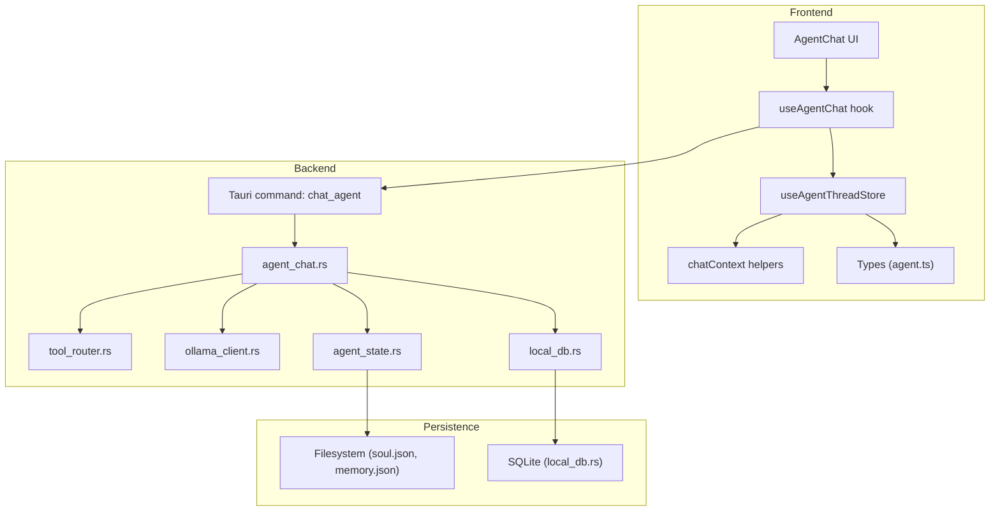
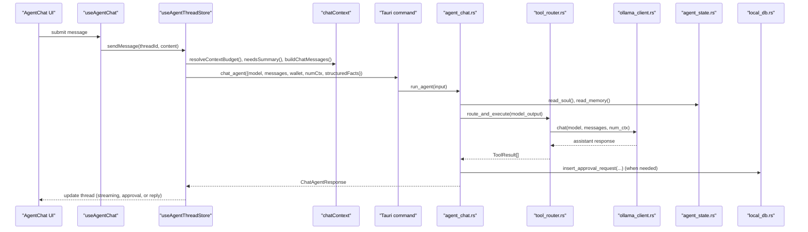
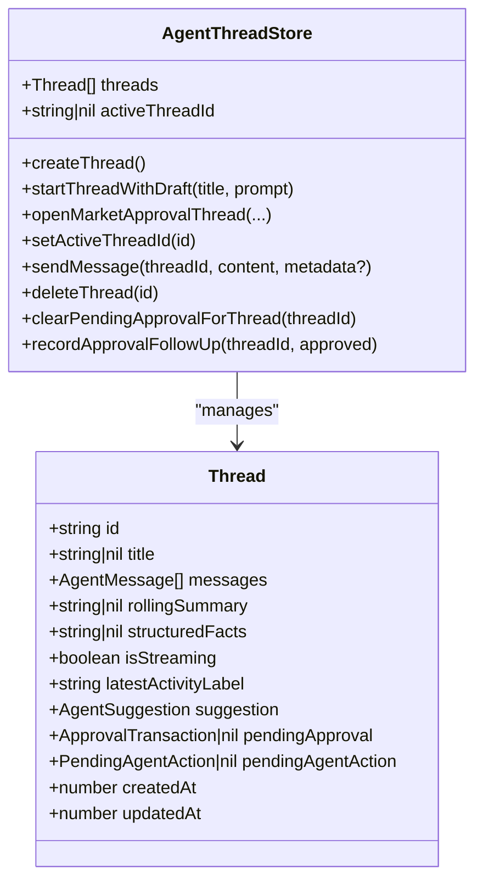
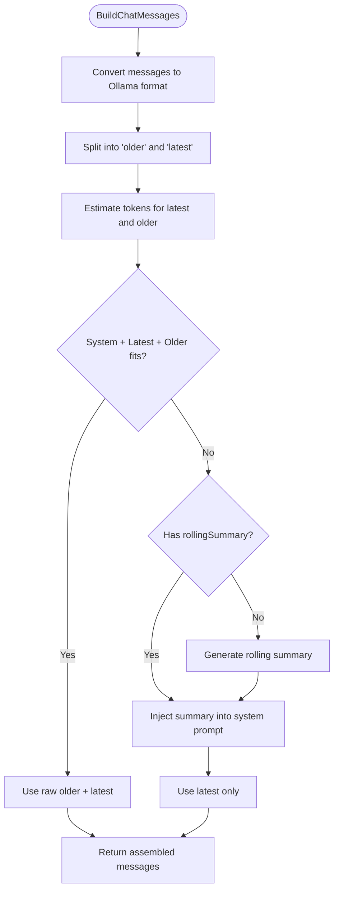
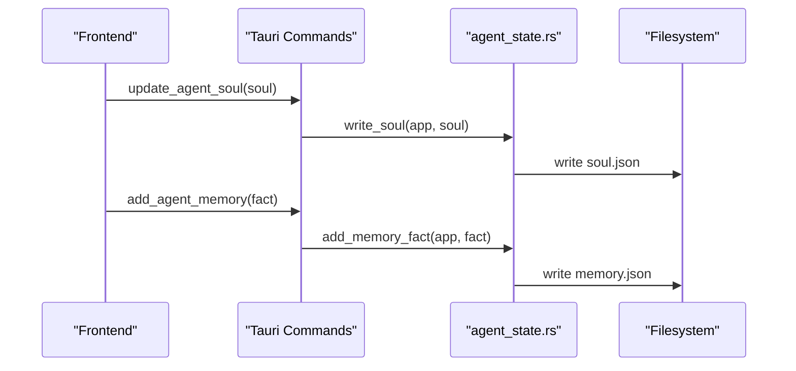
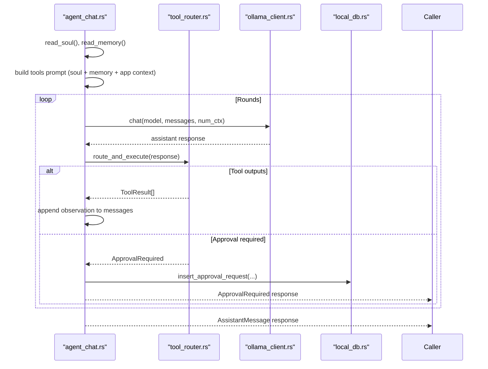
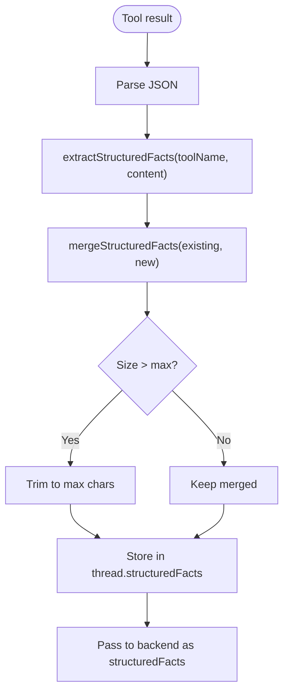
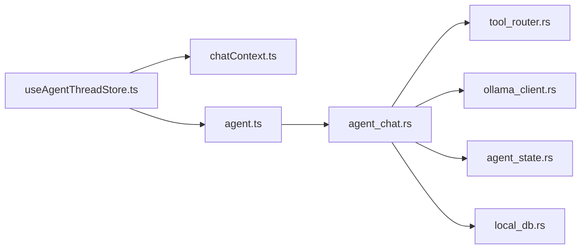

# Memory & Context Management

<cite>
**Referenced Files in This Document**
- [chatContext.ts](file://src/lib/chatContext.ts)
- [useAgentThreadStore.ts](file://src/store/useAgentThreadStore.ts)
- [agent_chat.rs](file://src-tauri/src/services/agent_chat.rs)
- [agent_state.rs](file://src-tauri/src/commands/agent_state.rs)
- [agent_state.ts](file://src-tauri/src/services/agent_state.rs)
- [modelOptions.ts](file://src/lib/modelOptions.ts)
- [agent.ts](file://src/lib/agent.ts)
- [ollama_client.rs](file://src-tauri/src/services/ollama_client.rs)
- [tool_router.rs](file://src-tauri/src/services/tool_router.rs)
- [local_db.rs](file://src-tauri/src/services/local_db.rs)
- [AgentChat.tsx](file://src/components/agent/AgentChat.tsx)
- [useAgentChat.ts](file://src/hooks/useAgentChat.ts)
- [agent.ts (types)](file://src/types/agent.ts)
</cite>

## Table of Contents
1. [Introduction](#introduction)
2. [Project Structure](#project-structure)
3. [Core Components](#core-components)
4. [Architecture Overview](#architecture-overview)
5. [Detailed Component Analysis](#detailed-component-analysis)
6. [Dependency Analysis](#dependency-analysis)
7. [Performance Considerations](#performance-considerations)
8. [Troubleshooting Guide](#troubleshooting-guide)
9. [Conclusion](#conclusion)

## Introduction
This document explains the agent’s memory and context management system across the frontend and backend. It covers how conversational context is maintained across sessions, how long-term memory is persisted and retrieved, and how the system balances contextual awareness with computational efficiency. It also documents the thread-based memory architecture, context window management, information prioritization, and privacy safeguards.

## Project Structure
The memory and context system spans three layers:
- Frontend state and UI: thread-based memory, context assembly, and streaming UI updates.
- Backend orchestration: deterministic agent pipeline, tool loop, and persistence.
- Persistent storage: local database and filesystem-backed agent soul/memory.

**Diagram sources**
- [AgentChat.tsx:10-124](file://src/components/agent/AgentChat.tsx#L10-L124)
- [useAgentChat.ts:13-97](file://src/hooks/useAgentChat.ts#L13-L97)
- [useAgentThreadStore.ts:121-621](file://src/store/useAgentThreadStore.ts#L121-L621)
- [chatContext.ts:59-90](file://src/lib/chatContext.ts#L59-L90)
- [agent.ts:14-27](file://src/lib/agent.ts#L14-L27)
- [agent_chat.rs:190-358](file://src-tauri/src/services/agent_chat.rs#L190-L358)
- [tool_router.rs:100-130](file://src-tauri/src/services/tool_router.rs#L100-L130)
- [ollama_client.rs:46-105](file://src-tauri/src/services/ollama_client.rs#L46-L105)
- [agent_state.ts:46-104](file://src-tauri/src/services/agent_state.rs#L46-L104)
- [agent_state.rs:9-38](file://src-tauri/src/commands/agent_state.rs#L9-L38)
- [local_db.rs:438-448](file://src-tauri/src/services/local_db.rs#L438-L448)

**Section sources**
- [AgentChat.tsx:10-124](file://src/components/agent/AgentChat.tsx#L10-L124)
- [useAgentChat.ts:13-97](file://src/hooks/useAgentChat.ts#L13-L97)
- [useAgentThreadStore.ts:121-621](file://src/store/useAgentThreadStore.ts#L121-L621)
- [chatContext.ts:59-90](file://src/lib/chatContext.ts#L59-L90)
- [agent.ts:14-27](file://src/lib/agent.ts#L14-L27)
- [agent_chat.rs:190-358](file://src-tauri/src/services/agent_chat.rs#L190-L358)
- [tool_router.rs:100-130](file://src-tauri/src/services/tool_router.rs#L100-L130)
- [ollama_client.rs:46-105](file://src-tauri/src/services/ollama_client.rs#L46-L105)
- [agent_state.ts:46-104](file://src-tauri/src/services/agent_state.rs#L46-L104)
- [agent_state.rs:9-38](file://src-tauri/src/commands/agent_state.rs#L9-L38)
- [local_db.rs:438-448](file://src-tauri/src/services/local_db.rs#L438-L448)

## Core Components
- Thread-based memory: Each thread stores messages, a rolling summary, recent structured facts, and UI state. The store persists threads and active thread ID.
- Context assembly: Converts thread messages to chat-ready arrays, estimates token budgets, decides between raw older history vs. a rolling summary, and injects structured facts and system prompts.
- Long-term memory: Agent soul (personality, risk, chains) and memory facts persisted to JSON files. These are injected into the tools prompt alongside memory snapshots.
- Backend orchestration: The agent pipeline runs a deterministic loop, calling tools, summarizing when needed, and handling approvals. It reads soul/memory and writes approval requests to the database.
- Persistence: SQLite for operational data; filesystem for soul/memory. Commands expose CRUD for agent soul/memory.

**Section sources**
- [useAgentThreadStore.ts:30-46](file://src/store/useAgentThreadStore.ts#L30-L46)
- [chatContext.ts:59-90](file://src/lib/chatContext.ts#L59-L90)
- [agent_chat.rs:214-235](file://src-tauri/src/services/agent_chat.rs#L214-L235)
- [agent_state.rs:46-104](file://src-tauri/src/services/agent_state.rs#L46-L104)
- [agent_state.rs:9-38](file://src-tauri/src/commands/agent_state.rs#L9-L38)
- [local_db.rs:117-132](file://src-tauri/src/services/local_db.rs#L117-L132)

## Architecture Overview
The system integrates frontend state management with backend orchestration and persistence:

**Diagram sources**
- [AgentChat.tsx:10-124](file://src/components/agent/AgentChat.tsx#L10-L124)
- [useAgentChat.ts:31-78](file://src/hooks/useAgentChat.ts#L31-L78)
- [useAgentThreadStore.ts:198-533](file://src/store/useAgentThreadStore.ts#L198-L533)
- [chatContext.ts:93-115](file://src/lib/chatContext.ts#L93-L115)
- [agent.ts:14-27](file://src/lib/agent.ts#L14-L27)
- [agent_chat.rs:190-358](file://src-tauri/src/services/agent_chat.rs#L190-L358)
- [tool_router.rs:100-130](file://src-tauri/src/services/tool_router.rs#L100-L130)
- [ollama_client.rs:46-105](file://src-tauri/src/services/ollama_client.rs#L46-L105)
- [agent_state.rs:46-104](file://src-tauri/src/services/agent_state.rs#L46-L104)
- [local_db.rs:117-132](file://src-tauri/src/services/local_db.rs#L117-L132)

## Detailed Component Analysis

### Thread-Based Memory Architecture
- Thread model: Each thread holds messages, rolling summary, structured facts, and UI metadata. The store supports creation, switching, deletion, and approval flows.
- Persistence: The store uses a zustand persist middleware to keep threads and active thread ID across sessions.
- Streaming UX: The store inserts a placeholder agent message immediately upon send, then replaces it with the final response or approval request.

**Diagram sources**
- [useAgentThreadStore.ts:30-93](file://src/store/useAgentThreadStore.ts#L30-L93)
- [useAgentThreadStore.ts:121-621](file://src/store/useAgentThreadStore.ts#L121-L621)

**Section sources**
- [useAgentThreadStore.ts:30-93](file://src/store/useAgentThreadStore.ts#L30-L93)
- [useAgentThreadStore.ts:121-621](file://src/store/useAgentThreadStore.ts#L121-L621)

### Context Assembly and Window Management
- Token estimation: A conservative character-per-token ratio is used to estimate token counts.
- Context composition: The system builds messages with a system prompt, optional rolling summary, and the latest N messages. Older messages are included only if they fit within the context budget after accounting for the system prompt and latest N.
- Summary generation: When older messages exceed budget, a rolling summary is generated and injected into the system prompt to preserve key facts without inflating token usage.
- Structured facts: Tool outputs are parsed into compact, capped structured facts to support follow-up queries without re-querying.

**Diagram sources**
- [chatContext.ts:59-90](file://src/lib/chatContext.ts#L59-L90)
- [chatContext.ts:101-115](file://src/lib/chatContext.ts#L101-L115)
- [chatContext.ts:177-202](file://src/lib/chatContext.ts#L177-L202)

**Section sources**
- [chatContext.ts:12-14](file://src/lib/chatContext.ts#L12-L14)
- [chatContext.ts:59-90](file://src/lib/chatContext.ts#L59-L90)
- [chatContext.ts:101-115](file://src/lib/chatContext.ts#L101-L115)
- [chatContext.ts:177-202](file://src/lib/chatContext.ts#L177-L202)

### Long-Term Memory and Personality
- Agent soul: Personality, risk appetite, and preferred chains are persisted to JSON and injected into the tools prompt.
- Agent memory: Facts are persisted to JSON and appended to the tools prompt as “User Profile & Memory Facts”.
- Commands: Frontend invokes Tauri commands to read/update soul and memory, with automatic snapshot uploads.

**Diagram sources**
- [agent_state.rs:9-38](file://src-tauri/src/commands/agent_state.rs#L9-L38)
- [agent_state.ts:46-104](file://src-tauri/src/services/agent_state.rs#L46-L104)
- [agent.ts:67-85](file://src/lib/agent.ts#L67-L85)

**Section sources**
- [agent_state.rs:9-38](file://src-tauri/src/commands/agent_state.rs#L9-L38)
- [agent_state.ts:46-104](file://src-tauri/src/services/agent_state.rs#L46-L104)
- [agent.ts:67-85](file://src/lib/agent.ts#L67-L85)

### Backend Orchestration and Tool Loop
- Deterministic pipeline: The agent loops up to a fixed number of rounds, invoking tools based on model output, appending observations, and generating a final assistant message when no tools are called.
- Approval flow: When tools require user approval, the agent creates an approval record and returns an approval-required response.
- Context injection: The tools prompt includes soul, memory, and app context derived from wallet addresses.

**Diagram sources**
- [agent_chat.rs:190-358](file://src-tauri/src/services/agent_chat.rs#L190-L358)
- [tool_router.rs:100-130](file://src-tauri/src/services/tool_router.rs#L100-L130)
- [ollama_client.rs:46-105](file://src-tauri/src/services/ollama_client.rs#L46-L105)
- [local_db.rs:117-132](file://src-tauri/src/services/local_db.rs#L117-L132)

**Section sources**
- [agent_chat.rs:190-358](file://src-tauri/src/services/agent_chat.rs#L190-L358)
- [tool_router.rs:100-130](file://src-tauri/src/services/tool_router.rs#L100-L130)
- [ollama_client.rs:46-105](file://src-tauri/src/services/ollama_client.rs#L46-L105)
- [local_db.rs:117-132](file://src-tauri/src/services/local_db.rs#L117-L132)

### Structured Facts and Information Prioritization
- Extraction: Tool results are parsed and compact summaries are extracted for frequently asked follow-ups.
- Merging: New facts are merged into existing structured facts with a cap to prevent unbounded growth.
- Injection: Structured facts are passed to the backend and included in the frontend thread state for subsequent turns.

**Diagram sources**
- [chatContext.ts:123-158](file://src/lib/chatContext.ts#L123-L158)
- [chatContext.ts:163-168](file://src/lib/chatContext.ts#L163-L168)
- [useAgentThreadStore.ts:366-372](file://src/store/useAgentThreadStore.ts#L366-L372)

**Section sources**
- [chatContext.ts:123-158](file://src/lib/chatContext.ts#L123-L158)
- [chatContext.ts:163-168](file://src/lib/chatContext.ts#L163-L168)
- [useAgentThreadStore.ts:366-372](file://src/store/useAgentThreadStore.ts#L366-L372)

### Privacy Safeguards and Data Handling
- Structured facts: Only compact, curated summaries are retained and reused; raw tool outputs are not stored.
- Approval gating: Sensitive actions require explicit user approval recorded in the database with expiration.
- Minimal context: The system avoids sending unnecessary data by truncating older context and using summaries.

**Section sources**
- [chatContext.ts:123-158](file://src/lib/chatContext.ts#L123-L158)
- [agent_chat.rs:296-335](file://src-tauri/src/services/agent_chat.rs#L296-L335)
- [local_db.rs:117-132](file://src-tauri/src/services/local_db.rs#L117-L132)

## Dependency Analysis
- Frontend depends on:
  - chatContext for context assembly and token budget resolution.
  - agent.ts for Tauri invocation of the backend chat agent.
  - useAgentThreadStore for thread state and UI updates.
- Backend depends on:
  - tool_router for parsing tool calls and executing tools.
  - ollama_client for model inference.
  - agent_state for personality and memory.
  - local_db for approvals and operational data.

**Diagram sources**
- [useAgentThreadStore.ts:121-621](file://src/store/useAgentThreadStore.ts#L121-L621)
- [chatContext.ts:93-95](file://src/lib/chatContext.ts#L93-L95)
- [agent.ts:14-27](file://src/lib/agent.ts#L14-L27)
- [agent_chat.rs:190-358](file://src-tauri/src/services/agent_chat.rs#L190-L358)
- [tool_router.rs:100-130](file://src-tauri/src/services/tool_router.rs#L100-L130)
- [ollama_client.rs:46-105](file://src-tauri/src/services/ollama_client.rs#L46-L105)
- [agent_state.rs:46-104](file://src-tauri/src/services/agent_state.rs#L46-L104)
- [local_db.rs:117-132](file://src-tauri/src/services/local_db.rs#L117-L132)

**Section sources**
- [useAgentThreadStore.ts:121-621](file://src/store/useAgentThreadStore.ts#L121-L621)
- [chatContext.ts:93-95](file://src/lib/chatContext.ts#L93-L95)
- [agent.ts:14-27](file://src/lib/agent.ts#L14-L27)
- [agent_chat.rs:190-358](file://src-tauri/src/services/agent_chat.rs#L190-L358)
- [tool_router.rs:100-130](file://src-tauri/src/services/tool_router.rs#L100-L130)
- [ollama_client.rs:46-105](file://src-tauri/src/services/ollama_client.rs#L46-L105)
- [agent_state.rs:46-104](file://src-tauri/src/services/agent_state.rs#L46-L104)
- [local_db.rs:117-132](file://src-tauri/src/services/local_db.rs#L117-L132)

## Performance Considerations
- Context budget: The system resolves the model’s context window and enforces it during message assembly to avoid overflows.
- Rolling summaries: When older context exceeds budget, summaries reduce token usage while preserving key facts.
- Structured facts: Compact, capped summaries minimize repeated tool calls and reduce latency.
- Streaming UI: Immediate placeholder insertion improves perceived responsiveness; backend responses replace placeholders atomically.
- Tool round limit: A bounded loop prevents excessive tool use and keeps latency predictable.

**Section sources**
- [modelOptions.ts:47-50](file://src/lib/modelOptions.ts#L47-L50)
- [chatContext.ts:93-95](file://src/lib/chatContext.ts#L93-L95)
- [chatContext.ts:177-202](file://src/lib/chatContext.ts#L177-L202)
- [useAgentThreadStore.ts:243-533](file://src/store/useAgentThreadStore.ts#L243-L533)
- [agent_chat.rs:13-13](file://src-tauri/src/services/agent_chat.rs#L13-L13)

## Troubleshooting Guide
- Model selection: If no model is selected, the frontend opens a setup modal and aborts the request.
- Context overflow: If older messages exceed budget, the store generates a rolling summary asynchronously and retries.
- Approval flow: When an approval is required, the backend writes an approval record; the frontend displays an actionable card and records follow-up text.
- Errors: The backend catches errors and returns a safe fallback; the frontend displays a user-friendly message.

**Section sources**
- [useAgentThreadStore.ts:244-274](file://src/store/useAgentThreadStore.ts#L244-L274)
- [useAgentThreadStore.ts:281-299](file://src/store/useAgentThreadStore.ts#L281-L299)
- [agent_chat.rs:296-335](file://src-tauri/src/services/agent_chat.rs#L296-L335)
- [useAgentThreadStore.ts:502-531](file://src/store/useAgentThreadStore.ts#L502-L531)

## Conclusion
The memory and context system combines thread-based conversation state, rolling summaries, and compact structured facts to maintain contextual awareness efficiently. Long-term memory and personality are persisted and injected into the tools prompt, while backend orchestration ensures deterministic, approval-aware execution. Together, these mechanisms balance depth of understanding with computational efficiency and strong privacy safeguards.