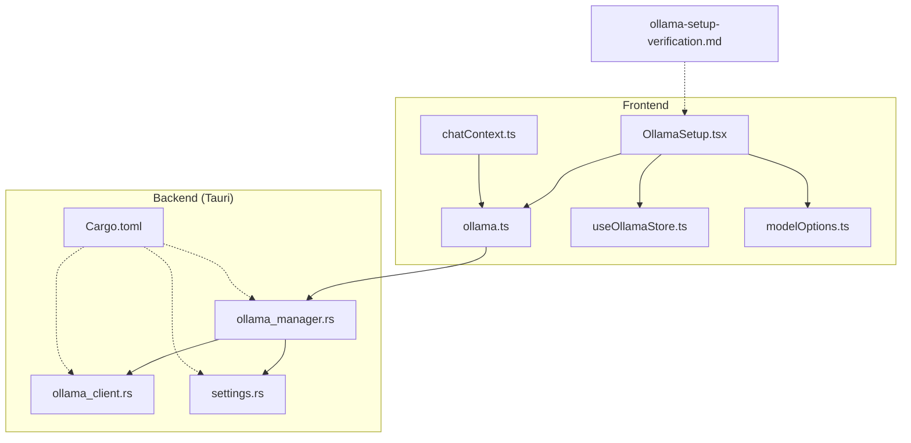
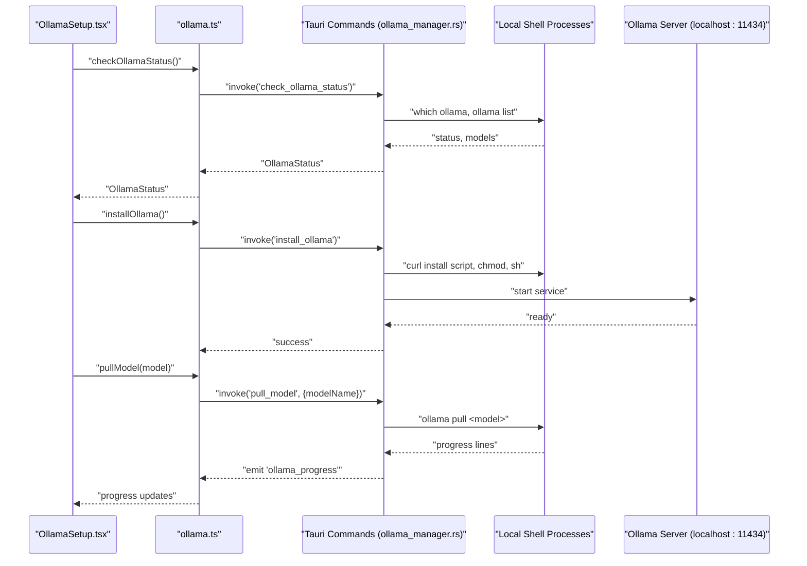
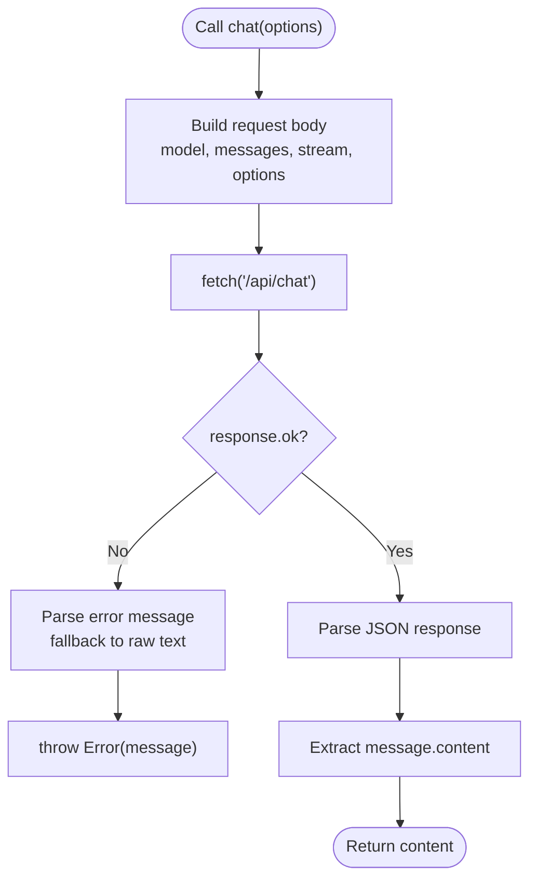
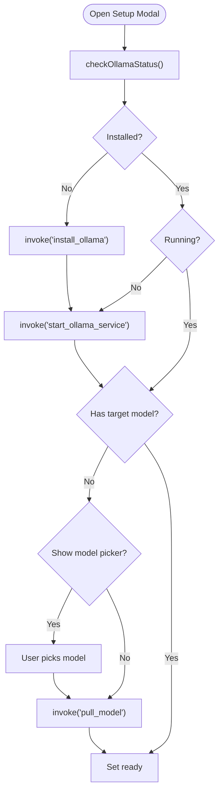
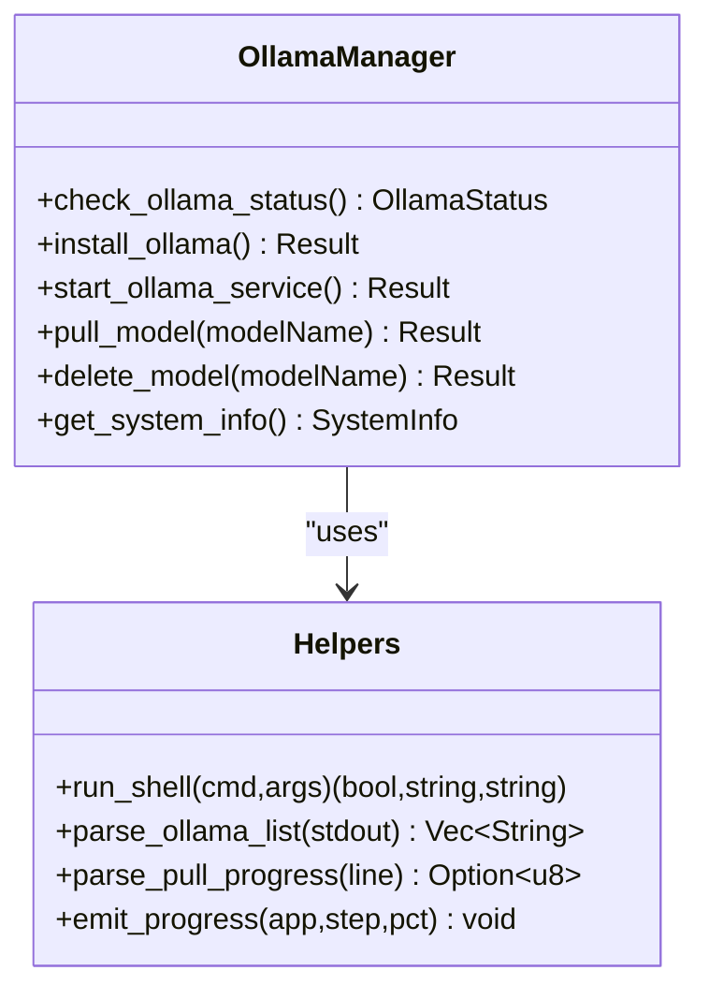
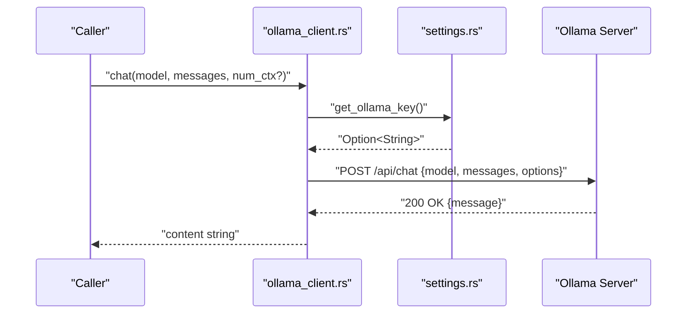
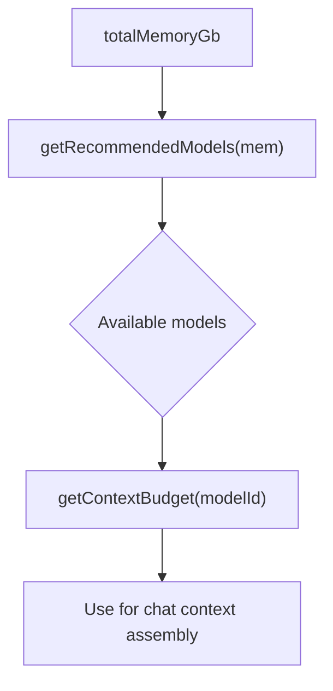
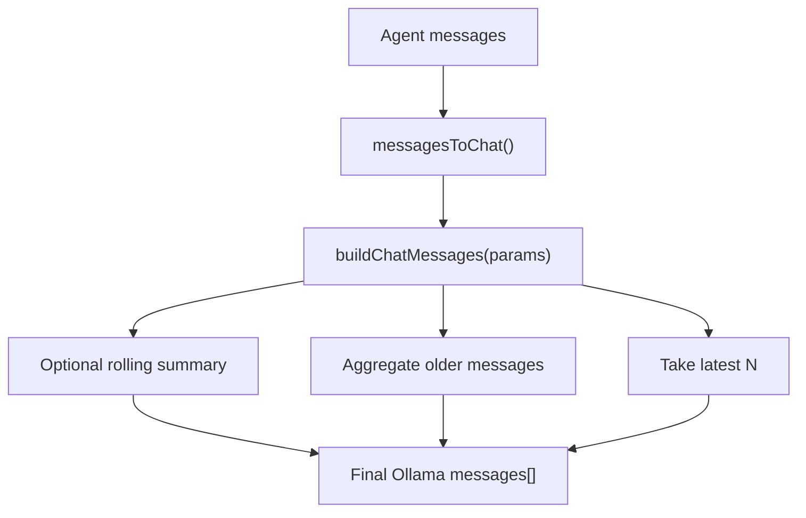
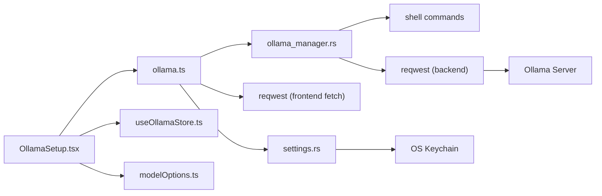
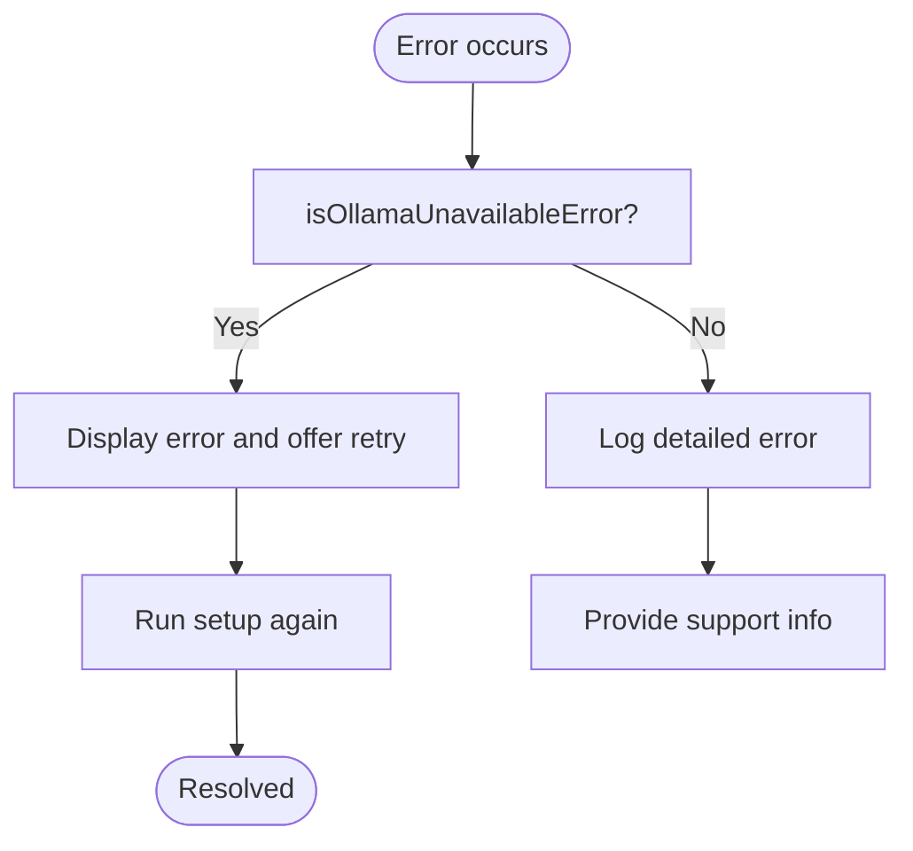

# Ollama Integration & Local AI

<cite>
**Referenced Files in This Document**
- [src/lib/ollama.ts](file://src/lib/ollama.ts)
- [src/components/OllamaSetup.tsx](file://src/components/OllamaSetup.tsx)
- [src-tauri/src/commands/ollama_manager.rs](file://src-tauri/src/commands/ollama_manager.rs)
- [src-tauri/src/services/ollama_client.rs](file://src-tauri/src/services/ollama_client.rs)
- [src/store/useOllamaStore.ts](file://src/store/useOllamaStore.ts)
- [src/lib/modelOptions.ts](file://src/lib/modelOptions.ts)
- [src/lib/chatContext.ts](file://src/lib/chatContext.ts)
- [src/lib/agent.ts](file://src/lib/agent.ts)
- [src-tauri/src/services/settings.rs](file://src-tauri/src/services/settings.rs)
- [src-tauri/Cargo.toml](file://src-tauri/Cargo.toml)
- [docs/ollama-setup-verification.md](file://docs/ollama-setup-verification.md)
</cite>

## Table of Contents
1. [Introduction](#introduction)
2. [Project Structure](#project-structure)
3. [Core Components](#core-components)
4. [Architecture Overview](#architecture-overview)
5. [Detailed Component Analysis](#detailed-component-analysis)
6. [Dependency Analysis](#dependency-analysis)
7. [Performance Considerations](#performance-considerations)
8. [Troubleshooting Guide](#troubleshooting-guide)
9. [Conclusion](#conclusion)
10. [Appendices](#appendices)

## Introduction
This document explains the Ollama integration and local AI inference system in the project. It covers the Ollama client library, model management (Llama 3.2 3B, Qwen 2.5), and the privacy-first architecture that keeps AI workloads on-device. It documents the ollama.ts library functions, model selection criteria, and performance optimization techniques. It also explains the integration between frontend components (OllamaSetup.tsx) and backend services (ollama_manager.rs, ollama_client.rs) for seamless local AI processing, including model downloading, caching strategies, and resource management. Examples of AI tasks, error handling for offline scenarios, and performance tuning are included, along with security benefits of local inference and troubleshooting guidance.

## Project Structure
The Ollama integration spans three layers:
- Frontend library and UI: ollama.ts (client), OllamaSetup.tsx (setup UI), modelOptions.ts (recommendations), and useOllamaStore.ts (state).
- Backend commands and services: ollama_manager.rs (Tauri commands for installation, service, and model management), ollama_client.rs (HTTP client to Ollama), and settings.rs (secure storage for keys).
- Documentation and verification: ollama-setup-verification.md (manual verification flows).

**Diagram sources**
- [src/components/OllamaSetup.tsx:1-308](file://src/components/OllamaSetup.tsx#L1-L308)
- [src/lib/ollama.ts:1-165](file://src/lib/ollama.ts#L1-L165)
- [src/store/useOllamaStore.ts:1-82](file://src/store/useOllamaStore.ts#L1-L82)
- [src/lib/modelOptions.ts:1-65](file://src/lib/modelOptions.ts#L1-L65)
- [src/lib/chatContext.ts:29-74](file://src/lib/chatContext.ts#L29-L74)
- [src-tauri/src/commands/ollama_manager.rs:1-328](file://src-tauri/src/commands/ollama_manager.rs#L1-L328)
- [src-tauri/src/services/ollama_client.rs:1-106](file://src-tauri/src/services/ollama_client.rs#L1-L106)
- [src-tauri/src/services/settings.rs:1-243](file://src-tauri/src/services/settings.rs#L1-L243)
- [src-tauri/Cargo.toml:1-44](file://src-tauri/Cargo.toml#L1-L44)
- [docs/ollama-setup-verification.md:1-66](file://docs/ollama-setup-verification.md#L1-L66)

**Section sources**
- [src/lib/ollama.ts:1-165](file://src/lib/ollama.ts#L1-L165)
- [src/components/OllamaSetup.tsx:1-308](file://src/components/OllamaSetup.tsx#L1-L308)
- [src-tauri/src/commands/ollama_manager.rs:1-328](file://src-tauri/src/commands/ollama_manager.rs#L1-L328)
- [src-tauri/src/services/ollama_client.rs:1-106](file://src-tauri/src/services/ollama_client.rs#L1-L106)
- [src-tauri/src/services/settings.rs:1-243](file://src-tauri/src/services/settings.rs#L1-L243)
- [src/lib/modelOptions.ts:1-65](file://src/lib/modelOptions.ts#L1-L65)
- [src/lib/chatContext.ts:29-74](file://src/lib/chatContext.ts#L29-L74)
- [src/lib/agent.ts:1-86](file://src/lib/agent.ts#L1-L86)
- [src-tauri/Cargo.toml:1-44](file://src-tauri/Cargo.toml#L1-L44)
- [docs/ollama-setup-verification.md:1-66](file://docs/ollama-setup-verification.md#L1-L66)

## Core Components
- ollama.ts: Provides typed functions to check Ollama status, install Ollama, start the service, pull/delete models, listen to progress events, and perform chat and generation requests against the local Ollama API. Includes helpers to detect offline/unavailable errors.
- OllamaSetup.tsx: Orchestrates the setup flow, listens to progress events, selects or recommends models, and coordinates with Tauri commands to ensure Ollama is installed, running, and has the desired model.
- ollama_manager.rs: Implements Tauri commands for status checks, installation, service startup, model pulling with progress emission, model deletion, and system info retrieval. Parses ollama list output and pull progress.
- ollama_client.rs: Thin HTTP client wrapper around the Ollama server for chat requests, including optional Authorization header support via settings.
- settings.rs: Secure key management for API keys (including Ollama) using the OS keychain, with in-memory caching to avoid repeated prompts.
- modelOptions.ts: Defines model metadata, recommended models by memory capacity, and context budget helpers.
- useOllamaStore.ts: Zustand store for Ollama setup state, progress, and last status.
- chatContext.ts: Converts agent messages to Ollama chat messages and builds the chat payload respecting context budgets.
- agent.ts: Invokes Tauri commands for agent chat and approvals.

**Section sources**
- [src/lib/ollama.ts:1-165](file://src/lib/ollama.ts#L1-L165)
- [src/components/OllamaSetup.tsx:1-308](file://src/components/OllamaSetup.tsx#L1-L308)
- [src-tauri/src/commands/ollama_manager.rs:1-328](file://src-tauri/src/commands/ollama_manager.rs#L1-L328)
- [src-tauri/src/services/ollama_client.rs:1-106](file://src-tauri/src/services/ollama_client.rs#L1-L106)
- [src-tauri/src/services/settings.rs:155-195](file://src-tauri/src/services/settings.rs#L155-L195)
- [src/lib/modelOptions.ts:1-65](file://src/lib/modelOptions.ts#L1-L65)
- [src/store/useOllamaStore.ts:1-82](file://src/store/useOllamaStore.ts#L1-L82)
- [src/lib/chatContext.ts:29-74](file://src/lib/chatContext.ts#L29-L74)
- [src/lib/agent.ts:14-27](file://src/lib/agent.ts#L14-L27)

## Architecture Overview
The system integrates a React frontend with Tauri-backed Rust services. The frontend invokes Tauri commands to manage Ollama lifecycle and emits progress events. The backend executes shell commands, parses outputs, and communicates with the local Ollama server.

**Diagram sources**
- [src/components/OllamaSetup.tsx:55-137](file://src/components/OllamaSetup.tsx#L55-L137)
- [src/lib/ollama.ts:17-44](file://src/lib/ollama.ts#L17-L44)
- [src-tauri/src/commands/ollama_manager.rs:161-243](file://src-tauri/src/commands/ollama_manager.rs#L161-L243)

## Detailed Component Analysis

### Ollama Client Library (ollama.ts)
Responsibilities:
- Expose typed functions for status, install, start, pull, delete, and system info.
- Listen to progress events emitted by the backend.
- Perform chat and generate requests against the local Ollama API.
- Detect offline/unavailable errors for graceful fallback.

Key functions and types:
- Status and lifecycle: checkOllamaStatus, installOllama, startOllamaService, getSystemInfo, deleteModel.
- Model operations: pullModel.
- Eventing: listenOllamaProgress.
- Chat and generate: chat, generate with typed options and responses.
- Error detection: isOllamaUnavailableError.

**Diagram sources**
- [src/lib/ollama.ts:78-109](file://src/lib/ollama.ts#L78-L109)

**Section sources**
- [src/lib/ollama.ts:17-44](file://src/lib/ollama.ts#L17-L44)
- [src/lib/ollama.ts:46-56](file://src/lib/ollama.ts#L46-L56)
- [src/lib/ollama.ts:78-109](file://src/lib/ollama.ts#L78-L109)
- [src/lib/ollama.ts:123-151](file://src/lib/ollama.ts#L123-L151)
- [src/lib/ollama.ts:153-165](file://src/lib/ollama.ts#L153-L165)

### Ollama Setup UI (OllamaSetup.tsx)
Responsibilities:
- Drive the setup flow: check status, install, start service, choose or pull model.
- Render progress and recommendations based on system info.
- Manage state via useOllamaStore and react to progress events.

Setup flow highlights:
- Listens to progress events and updates UI.
- Determines whether to install, start, or pull models.
- Presents model recommendations and allows custom model input.
- Handles errors and retries.

**Diagram sources**
- [src/components/OllamaSetup.tsx:55-137](file://src/components/OllamaSetup.tsx#L55-L137)

**Section sources**
- [src/components/OllamaSetup.tsx:31-156](file://src/components/OllamaSetup.tsx#L31-L156)
- [src/components/OllamaSetup.tsx:188-303](file://src/components/OllamaSetup.tsx#L188-L303)
- [src/store/useOllamaStore.ts:1-82](file://src/store/useOllamaStore.ts#L1-L82)

### Ollama Manager (Tauri Commands) (ollama_manager.rs)
Responsibilities:
- Check Ollama installation and running status.
- Install Ollama via curl and shell execution.
- Start the Ollama service in detached mode.
- Pull models and emit progress events parsed from stderr lines.
- Delete models and report errors with sanitized output.
- Gather system info using sysinfo.

**Diagram sources**
- [src-tauri/src/commands/ollama_manager.rs:161-328](file://src-tauri/src/commands/ollama_manager.rs#L161-L328)

**Section sources**
- [src-tauri/src/commands/ollama_manager.rs:161-243](file://src-tauri/src/commands/ollama_manager.rs#L161-L243)
- [src-tauri/src/commands/ollama_manager.rs:290-328](file://src-tauri/src/commands/ollama_manager.rs#L290-L328)
- [src-tauri/src/commands/ollama_manager.rs:51-84](file://src-tauri/src/commands/ollama_manager.rs#L51-L84)

### Ollama HTTP Client (ollama_client.rs)
Responsibilities:
- Build and send chat requests to the local Ollama server.
- Optionally attach an Authorization header if an Ollama key is configured.
- Parse responses and propagate errors.

**Diagram sources**
- [src-tauri/src/services/ollama_client.rs:46-105](file://src-tauri/src/services/ollama_client.rs#L46-L105)
- [src-tauri/src/services/settings.rs:159-186](file://src-tauri/src/services/settings.rs#L159-L186)

**Section sources**
- [src-tauri/src/services/ollama_client.rs:46-105](file://src-tauri/src/services/ollama_client.rs#L46-L105)
- [src-tauri/src/services/settings.rs:159-186](file://src-tauri/src/services/settings.rs#L159-L186)

### Model Options and Selection (modelOptions.ts)
Responsibilities:
- Define model metadata (id, label, size, min RAM, description, context tokens).
- Recommend models based on system memory.
- Provide context budget helpers for chat assembly.

**Diagram sources**
- [src/lib/modelOptions.ts:52-64](file://src/lib/modelOptions.ts#L52-L64)
- [src/lib/modelOptions.ts:46-50](file://src/lib/modelOptions.ts#L46-L50)

**Section sources**
- [src/lib/modelOptions.ts:19-44](file://src/lib/modelOptions.ts#L19-L44)
- [src/lib/modelOptions.ts:52-64](file://src/lib/modelOptions.ts#L52-L64)
- [src/lib/modelOptions.ts:46-50](file://src/lib/modelOptions.ts#L46-L50)

### Chat Context Assembly (chatContext.ts)
Responsibilities:
- Convert agent messages to Ollama chat messages.
- Build the final chat payload respecting rolling summaries, latest N messages, and context budget.

**Diagram sources**
- [src/lib/chatContext.ts:29-74](file://src/lib/chatContext.ts#L29-L74)

**Section sources**
- [src/lib/chatContext.ts:29-74](file://src/lib/chatContext.ts#L29-L74)

### Agent Integration (agent.ts)
Responsibilities:
- Invoke Tauri commands for agent chat, approvals, and memory operations.

**Section sources**
- [src/lib/agent.ts:14-27](file://src/lib/agent.ts#L14-L27)

## Dependency Analysis
- Frontend depends on Tauri core APIs and events to orchestrate backend commands.
- Backend commands depend on shell execution and network clients to interact with Ollama.
- Security-sensitive keys are managed via settings.rs with OS keychain integration.
- Cargo dependencies include reqwest, tokio, sysinfo, and keyring.

**Diagram sources**
- [src/lib/ollama.ts:1-165](file://src/lib/ollama.ts#L1-L165)
- [src/components/OllamaSetup.tsx:1-308](file://src/components/OllamaSetup.tsx#L1-L308)
- [src-tauri/src/commands/ollama_manager.rs:1-328](file://src-tauri/src/commands/ollama_manager.rs#L1-L328)
- [src-tauri/src/services/ollama_client.rs:1-106](file://src-tauri/src/services/ollama_client.rs#L1-L106)
- [src-tauri/src/services/settings.rs:1-243](file://src-tauri/src/services/settings.rs#L1-L243)
- [src-tauri/Cargo.toml:20-44](file://src-tauri/Cargo.toml#L20-L44)

**Section sources**
- [src-tauri/Cargo.toml:20-44](file://src-tauri/Cargo.toml#L20-L44)

## Performance Considerations
- Context window sizing: Use modelOptions to select appropriate context budgets; unknown models fall back to a default.
- Streaming vs non-streaming: The library supports streaming flags in chat/generate; disable streaming for simpler error handling and reduced overhead when latency is critical.
- Model selection: Prefer smaller models on constrained systems to reduce memory pressure; use recommendations derived from total memory.
- Concurrency: Avoid overlapping long-running pulls; the UI serializes setup steps and suppresses concurrent operations.
- Network timeouts: Backend clients set short timeouts for status checks; adjust as needed for slower machines.
- Resource cleanup: Delete unused models to reclaim disk space; use deleteModel when switching models.

[No sources needed since this section provides general guidance]

## Troubleshooting Guide
Common issues and resolutions:
- Ollama not installed: The setup flow downloads and installs Ollama, makes it executable, and starts the service. Verify the installer path and permissions.
- Service not running: Restart the service using the setup flow; ensure port 11434 is reachable.
- Model not found: Pull the model via the setup UI or command; progress is emitted during pull.
- Offline or unreachable: The client detects unavailable errors; the UI shows an error state and allows retry.
- macOS-specific flows: Refer to the verification guide for expected behaviors across scenarios.

**Diagram sources**
- [src/lib/ollama.ts:153-165](file://src/lib/ollama.ts#L153-L165)

**Section sources**
- [src/lib/ollama.ts:153-165](file://src/lib/ollama.ts#L153-L165)
- [docs/ollama-setup-verification.md:1-66](file://docs/ollama-setup-verification.md#L1-L66)

## Conclusion
The Ollama integration provides a robust, privacy-first local AI inference pipeline. The frontend offers a guided setup experience, while the backend manages installation, service lifecycle, and model management with transparent progress reporting. The design emphasizes local execution, secure key management, and practical performance tuning, enabling reliable AI tasks without exposing sensitive data to external services.

[No sources needed since this section summarizes without analyzing specific files]

## Appendices

### Security Benefits and Privacy Guarantees
- Local execution: All inference runs on-device, minimizing data exposure.
- Secure key storage: API keys are cached in memory and persisted via OS keychain to avoid repeated prompts and plaintext storage.
- Minimal surface area: The integration targets a single localhost endpoint and uses minimal external dependencies.

**Section sources**
- [src-tauri/src/services/settings.rs:159-186](file://src-tauri/src/services/settings.rs#L159-L186)
- [src-tauri/Cargo.toml:28-29](file://src-tauri/Cargo.toml#L28-L29)

### Example AI Tasks
- Chat assistant: Build a chat payload using chatContext, invoke the Ollama server via ollama.ts, and render responses.
- Model switching: Use the model picker to switch between Llama 3.2 variants and Qwen; the setup flow pulls the chosen model.
- Approval-driven actions: Use agent.ts to submit actions for approval; upon approval, trigger follow-up chat turns.

**Section sources**
- [src/lib/chatContext.ts:29-74](file://src/lib/chatContext.ts#L29-L74)
- [src/lib/agent.ts:14-27](file://src/lib/agent.ts#L14-L27)
- [src/components/OllamaSetup.tsx:139-147](file://src/components/OllamaSetup.tsx#L139-L147)