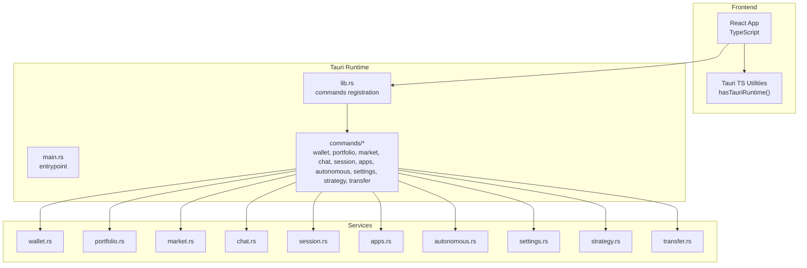
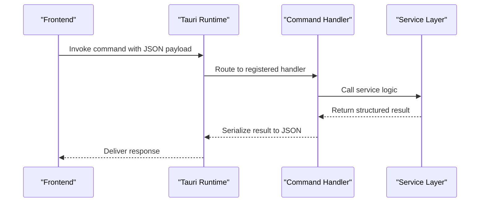
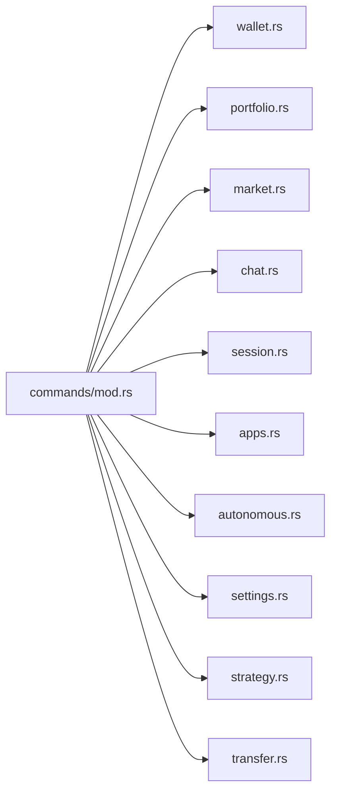
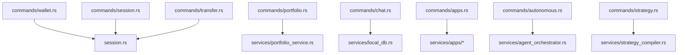

# API Reference

<cite>
**Referenced Files in This Document**
- [src-tauri/src/lib.rs](file://src-tauri/src/lib.rs)
- [src-tauri/src/main.rs](file://src-tauri/src/main.rs)
- [src-tauri/src/commands/mod.rs](file://src-tauri/src/commands/mod.rs)
- [src-tauri/src/commands/wallet.rs](file://src-tauri/src/commands/wallet.rs)
- [src-tauri/src/commands/portfolio.rs](file://src-tauri/src/commands/portfolio.rs)
- [src-tauri/src/commands/market.rs](file://src-tauri/src/commands/market.rs)
- [src-tauri/src/commands/chat.rs](file://src-tauri/src/commands/chat.rs)
- [src-tauri/src/commands/session.rs](file://src-tauri/src/commands/session.rs)
- [src-tauri/src/commands/apps.rs](file://src-tauri/src/commands/apps.rs)
- [src-tauri/src/commands/autonomous.rs](file://src-tauri/src/commands/autonomous.rs)
- [src-tauri/src/commands/settings.rs](file://src-tauri/src/commands/settings.rs)
- [src-tauri/src/commands/strategy.rs](file://src-tauri/src/commands/strategy.rs)
- [src-tauri/src/commands/transfer.rs](file://src-tauri/src/commands/transfer.rs)
- [src-tauri/tauri.conf.json](file://src-tauri/tauri.conf.json)
- [src/lib/tauri.ts](file://src/lib/tauri.ts)
</cite>

## Table of Contents
1. [Introduction](#introduction)
2. [Project Structure](#project-structure)
3. [Core Components](#core-components)
4. [Architecture Overview](#architecture-overview)
5. [Detailed Component Analysis](#detailed-component-analysis)
6. [Dependency Analysis](#dependency-analysis)
7. [Performance Considerations](#performance-considerations)
8. [Troubleshooting Guide](#troubleshooting-guide)
9. [Conclusion](#conclusion)
10. [Appendices](#appendices)

## Introduction
This document provides a comprehensive API reference for SHADOW Protocol’s Tauri command system and backend services. It covers all Tauri command handlers, their JavaScript frontend interfaces, Rust backend implementations, parameter schemas, return value formats, and error handling. It also documents the command routing system, permission requirements, security considerations, service interfaces for wallet services, market data services, strategy engine, and background task management. IPC communication patterns, data serialization formats, asynchronous operation handling, common usage patterns, error codes, debugging techniques, rate limiting considerations, versioning, and backwards compatibility notes are included.

## Project Structure
The Tauri application is organized into:
- Frontend: React-based UI with TypeScript and Tauri bindings.
- Backend: Rust-based Tauri application with command handlers and services.
- Commands: Per-feature modules exposing Tauri commands.
- Services: Backend services implementing business logic and integrations.

**Diagram sources**
- [src-tauri/src/main.rs:4-6](file://src-tauri/src/main.rs#L4-L6)
- [src-tauri/src/lib.rs:34-198](file://src-tauri/src/lib.rs#L34-L198)
- [src-tauri/src/commands/mod.rs:1-27](file://src-tauri/src/commands/mod.rs#L1-L27)

**Section sources**
- [src-tauri/src/main.rs:1-7](file://src-tauri/src/main.rs#L1-L7)
- [src-tauri/src/lib.rs:34-198](file://src-tauri/src/lib.rs#L34-L198)
- [src-tauri/src/commands/mod.rs:1-27](file://src-tauri/src/commands/mod.rs#L1-L27)

## Core Components
- Tauri command router registers all commands and exposes them to the frontend.
- Commands are grouped by feature modules under commands/.
- Services encapsulate business logic and integrate with external APIs and local storage.
- IPC uses JSON serialization for parameters and return values.

Key aspects:
- Command registration occurs in lib.rs invoke_handler.
- Commands are defined in individual modules under commands/.
- Services are invoked from commands to perform operations.
- Asynchronous commands use async/await and Tokio runtime.
- Error handling uses Result<T, E> with serialized error strings or custom error enums.

**Section sources**
- [src-tauri/src/lib.rs:90-190](file://src-tauri/src/lib.rs#L90-L190)

## Architecture Overview
The Tauri application initializes plugins, sets up services, and registers commands. Commands are invoked from the frontend and return structured JSON responses. Background tasks and periodic operations are scheduled via async runtime.

**Diagram sources**
- [src-tauri/src/lib.rs:90-190](file://src-tauri/src/lib.rs#L90-L190)

**Section sources**
- [src-tauri/src/lib.rs:34-198](file://src-tauri/src/lib.rs#L34-L198)

## Detailed Component Analysis

### Command Routing System
- All commands are declared in lib.rs invoke_handler and routed to their respective modules.
- Commands are grouped under commands/ and re-exported via commands/mod.rs.
- The router supports synchronous and asynchronous handlers.

**Diagram sources**
- [src-tauri/src/commands/mod.rs:1-27](file://src-tauri/src/commands/mod.rs#L1-L27)

**Section sources**
- [src-tauri/src/commands/mod.rs:1-27](file://src-tauri/src/commands/mod.rs#L1-L27)
- [src-tauri/src/lib.rs:90-190](file://src-tauri/src/lib.rs#L90-L190)

### Wallet Commands
- Purpose: Create/import/list/remove wallets; biometric and OS keychain-backed storage.
- Frontend interface: Use Tauri’s invoke with camelCase parameters.
- Backend: Implements BIP39 mnemonic generation, private key import, and secure storage.

Parameters and returns:
- wallet_create: input CreateWalletInput (word_count), returns CreateWalletResult (address, mnemonic)
- wallet_import_mnemonic: input ImportMnemonicInput (mnemonic), returns ImportWalletResult (address)
- wallet_import_private_key: input ImportPrivateKeyInput (private_key), returns ImportWalletResult (address)
- wallet_list: returns WalletListResult (addresses)
- wallet_remove: input RemoveWalletInput (address), returns RemoveWalletResult (success)

Errors:
- WalletError variants include invalid mnemonic/private key, keychain errors, not found.

Security:
- Private keys stored in OS keychain; optional biometric protection.
- Addresses list stored in plain JSON file for convenience.

**Section sources**
- [src-tauri/src/commands/wallet.rs:18-284](file://src-tauri/src/commands/wallet.rs#L18-L284)

### Portfolio Commands
- Purpose: Fetch balances, transactions, NFTs, allocations, and performance history.
- Frontend interface: invoke with camelCase parameters.
- Backend: Prefers local DB cache; falls back to external providers for EVM chains; special handling for Flow addresses.

Parameters and returns:
- portfolio_fetch_balances(address, chain?): returns Vec<PortfolioAsset>
- portfolio_fetch_balances_multi(addresses): returns Vec<PortfolioAsset>
- portfolio_fetch_transactions(addresses, limit?): returns Vec<TransactionDisplay>
- portfolio_fetch_nfts(addresses): returns Vec<NftDisplay>
- portfolio_fetch_history(range): returns PortfolioPerformanceRange
- portfolio_fetch_allocations(addresses?): returns Vec<AllocationValue>
- portfolio_fetch_performance_summary(range): returns PortfolioPerformanceSummary

Flow-specific conversion:
- Converts Flow assets to PortfolioAsset format when detected.

**Section sources**
- [src-tauri/src/commands/portfolio.rs:43-469](file://src-tauri/src/commands/portfolio.rs#L43-L469)

### Market Commands
- Purpose: Retrieve market opportunities, refresh data, get opportunity details, and prepare actions.
- Frontend interface: invoke with Market*Input structures.

Parameters and returns:
- market_fetch_opportunities(input: MarketFetchInput): returns MarketOpportunitiesResponse
- market_refresh_opportunities(input: MarketRefreshInput): returns MarketRefreshResult
- market_get_opportunity_detail(input: MarketOpportunityDetailInput): returns MarketOpportunityDetail
- market_prepare_opportunity_action(input: MarketPrepareOpportunityActionInput): returns MarketPrepareOpportunityActionResult

**Section sources**
- [src-tauri/src/commands/market.rs:8-36](file://src-tauri/src/commands/market.rs#L8-L36)

### Chat and Strategy Commands
- Purpose: Manage strategies, approvals, execution logs, and agent chat.
- Frontend interface: invoke with strategy and approval structures.

Parameters and returns:
- get_strategies(): returns Vec<ActiveStrategy>
- create_strategy(input: CreateStrategyInput): returns StrategyResult
- update_strategy(input: UpdateStrategyInput): returns StrategyResult
- update_strategy_status(input: StrategyStatusInput): returns StrategyResult
- pause_strategy(input: StrategyStatusInput): returns StrategyResult
- resume_strategy(input: StrategyStatusInput): returns StrategyResult
- delete_strategy(input: DeleteStrategyInput): returns DeleteStrategyResult
- run_strategy_simulation(input: RunStrategySimulationInput): returns StrategySimulationResult
- get_strategy_executions(input: GetStrategyExecutionsInput): returns Vec<ToolExecutionRecord>
- get_command_log(limit): returns Vec<CommandLogEntry>
- chat_agent(input: agent_chat::ChatAgentInput): returns ChatAgentResponse
- get_pending_approvals(input: GetPendingApprovalsInput): returns Vec<ApprovalRecord>
- get_execution_log(input: GetExecutionLogInput): returns Vec<ToolExecutionRecord>
- reject_agent_action(input: RejectAgentActionInput): returns RejectAgentActionResult
- approve_agent_action(input: ApproveAgentActionInput): returns ApproveAgentActionResult

Approvals:
- Versioned approval requests with expiration and status updates.
- Supported tools include swap preparation, strategy creation, Flow sponsored transactions, Filecoin backup/restore.

**Section sources**
- [src-tauri/src/commands/chat.rs:110-609](file://src-tauri/src/commands/chat.rs#L110-L609)

### Session Commands
- Purpose: Manage wallet unlock/lock/status with biometric and keychain support.
- Frontend interface: invoke with camelCase parameters.

Parameters and returns:
- session_unlock(input: SessionUnlockInput): returns SessionUnlockResult
- session_lock(input: SessionLockInput): returns SessionLockResult
- session_status(input: SessionStatusInput): returns SessionStatusResult

Security:
- Biometric unlock via Touch ID; fallback to keyring authentication.
- Audit logging for unlock/lock events.

**Section sources**
- [src-tauri/src/commands/session.rs:61-155](file://src-tauri/src/commands/session.rs#L61-L155)

### Apps Commands
- Purpose: Integrate third-party apps, manage permissions, runtime health, secrets, and backups.
- Frontend interface: invoke with camelCase parameters.

Parameters and returns:
- apps_marketplace_list(): returns AppsMarketplaceResponse
- apps_install(input: AppsInstallInput): returns AppsMarketplaceResponse
- apps_uninstall(input: AppsAppIdInput): returns AppsMarketplaceResponse
- apps_set_enabled(input: AppsSetEnabledInput): returns AppsMarketplaceResponse
- apps_set_config(input: AppsConfigInput): returns ()
- apps_get_config(input: AppsAppIdInput): returns serde_json::Value
- apps_list_backups(): returns Vec<AppBackupRow>
- apps_runtime_health(): returns runtime::RuntimeResponse
- apps_refresh_health(): returns AppsMarketplaceResponse
- apps_lit_wallet_status(): returns serde_json::Value
- apps_lit_mint_pkp(): returns serde_json::Value
- apps_lit_pkp_address(): returns serde_json::Value
- apps_flow_account_status(): returns serde_json::Value
- apps_filecoin_auto_restore(): returns bool
- apps_set_secret(input: AppsSecretInput): returns ()
- apps_remove_secret(input: AppsSecretKeyInput): returns ()

Permissions:
- Requires unlocked session for settings/secrets.
- Validates app IDs and secret keys.

**Section sources**
- [src-tauri/src/commands/apps.rs:38-380](file://src-tauri/src/commands/apps.rs#L38-L380)

### Autonomous Agent Commands
- Purpose: Guardrails, tasks, health monitoring, opportunities, orchestrator control, and learned preferences.
- Frontend interface: invoke with camelCase parameters.

Parameters and returns:
- get_guardrails(): returns GuardrailsResult
- set_guardrails(input: SetGuardrailsInput): returns SetGuardrailsResult
- activate_kill_switch(): returns KillSwitchResult
- deactivate_kill_switch(): returns KillSwitchResult
- get_pending_tasks(): returns TasksResult
- approve_task(input: ApproveTaskInput): returns TaskActionResult
- reject_task(input: RejectTaskInput): returns TaskActionResult
- get_task_reasoning(input: TaskIdInput): returns ReasoningChainResult
- get_portfolio_health(): returns HealthResult
- get_opportunities(input: GetOpportunitiesInput): returns OpportunitiesResult
- get_orchestrator_state(): returns OrchestratorStateResult
- start_autonomous(): returns OrchestratorControlResult
- stop_autonomous(): returns OrchestratorControlResult
- run_analysis_now(): returns AnalysisResult
- get_learned_preferences(): returns PreferencesResult

**Section sources**
- [src-tauri/src/commands/autonomous.rs:74-786](file://src-tauri/src/commands/autonomous.rs#L74-L786)

### Settings Commands
- Purpose: Store and retrieve API keys for external services.
- Frontend interface: invoke with SetKeyInput and get_* variants.

Parameters and returns:
- set_perplexity_key(input: SetKeyInput): returns SettingsResult
- get_perplexity_key(): returns GetKeyResult
- remove_perplexity_key(): returns SettingsResult
- set_alchemy_key(input: SetKeyInput): returns SettingsResult
- get_alchemy_key(): returns GetKeyResult
- remove_alchemy_key(): returns SettingsResult
- set_ollama_key(input: SetKeyInput): returns SettingsResult
- get_ollama_key(): returns GetKeyResult
- remove_ollama_key(): returns SettingsResult
- delete_all_data(app): returns SettingsResult

**Section sources**
- [src-tauri/src/commands/settings.rs:23-102](file://src-tauri/src/commands/settings.rs#L23-L102)

### Strategy Commands
- Purpose: Compile strategy drafts, persist strategies, and fetch execution history.
- Frontend interface: invoke with Strategy*Input structures.

Parameters and returns:
- strategy_compile_draft(input: StrategyCompileDraftInput): returns StrategySimulationResult
- strategy_create_from_draft(input: StrategyCreateFromDraftInput): returns StrategyPersistResult
- strategy_update_from_draft(input: StrategyUpdateFromDraftInput): returns StrategyPersistResult
- strategy_get(input: StrategyGetInput): returns StrategyDetailResult
- strategy_get_execution_history(input: StrategyExecutionHistoryInput): returns Vec<StrategyExecutionRecordIpc>

Validation:
- Draft compilation and status normalization enforced.
- Pre-authorized mode requires valid plans.

**Section sources**
- [src-tauri/src/commands/strategy.rs:216-309](file://src-tauri/src/commands/strategy.rs#L216-L309)

### Transfer Commands
- Purpose: Execute native token and ERC20 transfers via Alchemy RPC using cached or stored keys.
- Frontend interface: invoke with TransferInput.

Parameters and returns:
- portfolio_transfer(input: TransferInput): returns TransferResult (tx_hash)
- portfolio_transfer_background(input: TransferInput): returns TransferBackgroundResult (tx_hash, status)

Asynchronous confirmation:
- Emits tx_confirmation event with status after polling.

Errors:
- TransferError variants include invalid address/amount, missing API key, unsupported chain, wallet not found/locked, transaction failures.

**Section sources**
- [src-tauri/src/commands/transfer.rs:78-280](file://src-tauri/src/commands/transfer.rs#L78-L280)

### IPC Communication Patterns and Serialization
- Frontend invokes commands via Tauri’s invoke with JSON payloads.
- Backend handlers accept strongly-typed structs derived from serde Deserialize/Serialize.
- Results are serialized to JSON and returned to the frontend.
- Asynchronous commands spawn background tasks and optionally emit events.

**Section sources**
- [src-tauri/src/lib.rs:90-190](file://src-tauri/src/lib.rs#L90-L190)
- [src/lib/tauri.ts:1-4](file://src/lib/tauri.ts#L1-L4)

## Dependency Analysis
- Commands depend on services for business logic.
- Services depend on external providers (Alchemy, Flow sidecar, apps runtime) and local storage.
- Session module caches decrypted keys for short-lived operations.
- Audit logging records sensitive operations.

**Diagram sources**
- [src-tauri/src/commands/wallet.rs:169-284](file://src-tauri/src/commands/wallet.rs#L169-L284)
- [src-tauri/src/commands/portfolio.rs:43-91](file://src-tauri/src/commands/portfolio.rs#L43-L91)
- [src-tauri/src/commands/chat.rs:110-310](file://src-tauri/src/commands/chat.rs#L110-L310)
- [src-tauri/src/commands/session.rs:61-125](file://src-tauri/src/commands/session.rs#L61-L125)
- [src-tauri/src/commands/apps.rs:52-109](file://src-tauri/src/commands/apps.rs#L52-L109)
- [src-tauri/src/commands/autonomous.rs:74-109](file://src-tauri/src/commands/autonomous.rs#L74-L109)
- [src-tauri/src/commands/strategy.rs:216-243](file://src-tauri/src/commands/strategy.rs#L216-L243)
- [src-tauri/src/commands/transfer.rs:78-160](file://src-tauri/src/commands/transfer.rs#L78-L160)

**Section sources**
- [src-tauri/src/commands/mod.rs:1-27](file://src-tauri/src/commands/mod.rs#L1-L27)

## Performance Considerations
- Prefer local DB caching for portfolio queries to reduce external API calls.
- Batch operations where possible (e.g., multi-address portfolio fetch).
- Use background transfers to avoid blocking the UI; poll for receipts asynchronously.
- Limit history and execution log sizes to reasonable defaults.
- Avoid frequent biometric prompts by leveraging session caching.

## Troubleshooting Guide
Common issues and resolutions:
- Missing API keys: Ensure Alchemy key is set via settings commands.
- Wallet locked/unavailable: Unlock session before signing transfers or approvals.
- Invalid addresses/amounts: Validate inputs before invoking transfer commands.
- External service errors: Check market service health and apps runtime health.
- Approval conflicts: Handle version mismatches and expiration when approving/rejecting.

Audit and logging:
- Use get_command_log and get_execution_log to inspect recent operations.
- Monitor tx_confirmation events for background transfer statuses.

**Section sources**
- [src-tauri/src/commands/settings.rs:23-102](file://src-tauri/src/commands/settings.rs#L23-L102)
- [src-tauri/src/commands/transfer.rs:78-160](file://src-tauri/src/commands/transfer.rs#L78-L160)
- [src-tauri/src/commands/chat.rs:297-300](file://src-tauri/src/commands/chat.rs#L297-L300)

## Conclusion
SHADOW Protocol’s Tauri command system provides a robust, modular API for wallet management, portfolio insights, market data, autonomous agents, strategy orchestration, and secure transfers. Commands are strongly typed, asynchronous where appropriate, and integrated with services that handle external dependencies and local persistence. Security is enforced through biometric unlocks, OS keychain storage, and audit logging. The frontend interacts via JSON-serialized payloads, enabling predictable IPC behavior across platforms.

## Appendices

### Permission Requirements and Security Considerations
- Session unlock required for sensitive operations (approvals, settings updates, secret management).
- Biometric unlock preferred; keyring fallback available.
- Private keys stored securely; addresses list stored for convenience.
- Audit records maintained for unlock/lock and strategy operations.

**Section sources**
- [src-tauri/src/commands/session.rs:61-125](file://src-tauri/src/commands/session.rs#L61-L125)
- [src-tauri/src/commands/apps.rs:10-17](file://src-tauri/src/commands/apps.rs#L10-L17)

### Rate Limiting and Backwards Compatibility
- No explicit rate limiting is implemented in the commands; external providers (e.g., Alchemy) enforce limits.
- Versioning: Strategy commands maintain version increments on updates; status normalization ensures compatibility.
- Backwards compatibility: Command signatures are stable; error messages are standardized.

**Section sources**
- [src-tauri/src/commands/strategy.rs:245-268](file://src-tauri/src/commands/strategy.rs#L245-L268)

### Versioning Information
- Application version is defined in tauri.conf.json.

**Section sources**
- [src-tauri/tauri.conf.json](file://src-tauri/tauri.conf.json#L4)

### Frontend Integration Examples
- Detect Tauri runtime availability using hasTauriRuntime().
- Invoke commands with camelCase parameters and handle JSON responses.
- Subscribe to tx_confirmation events for background transfer updates.

**Section sources**
- [src/lib/tauri.ts:1-4](file://src/lib/tauri.ts#L1-L4)