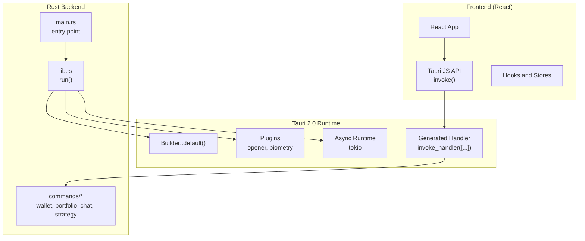
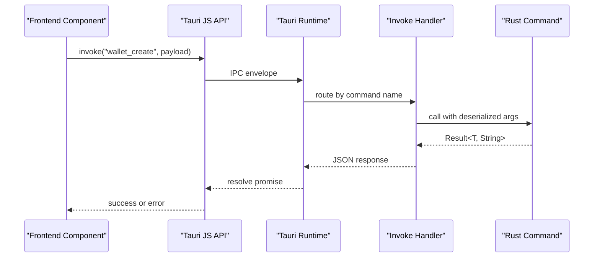
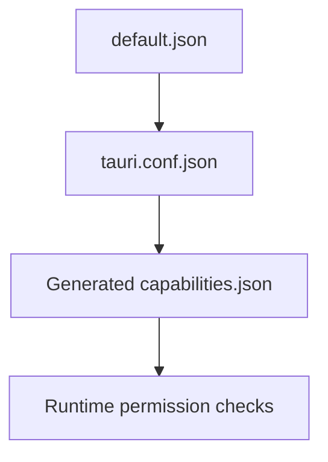
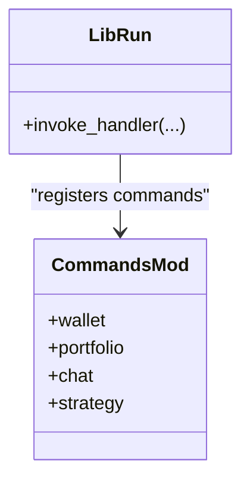
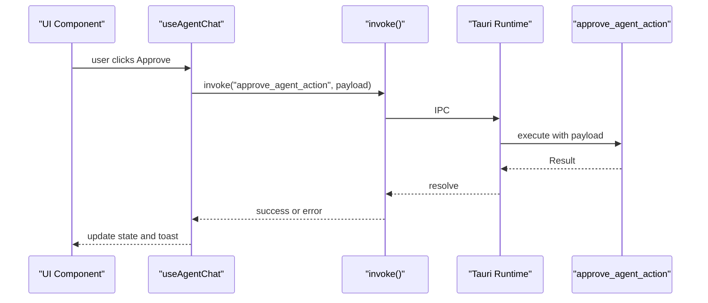
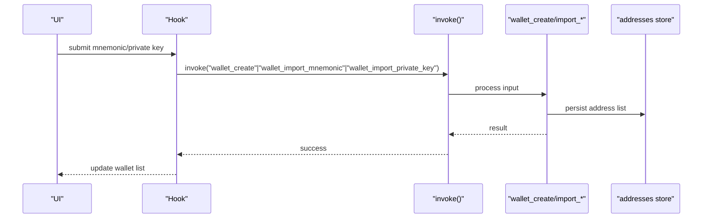
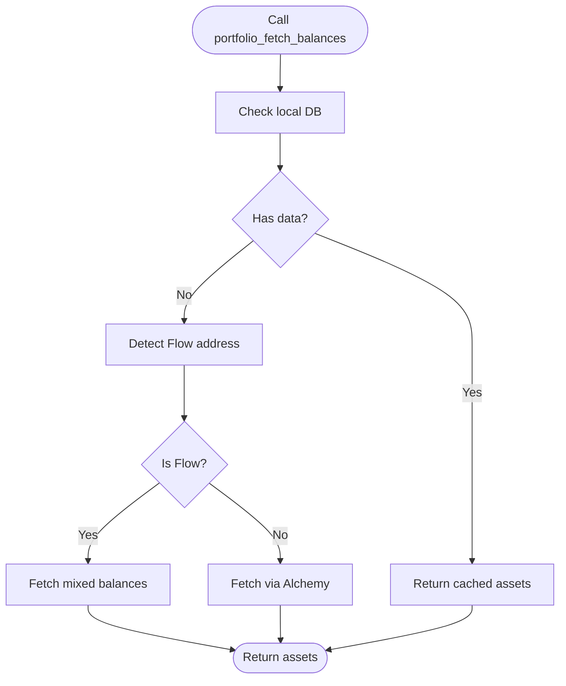
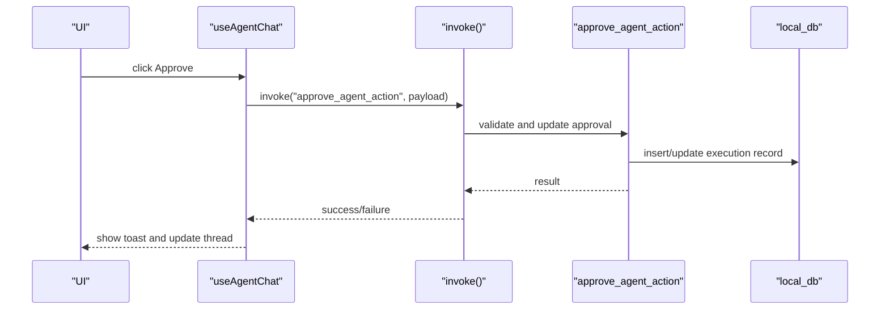
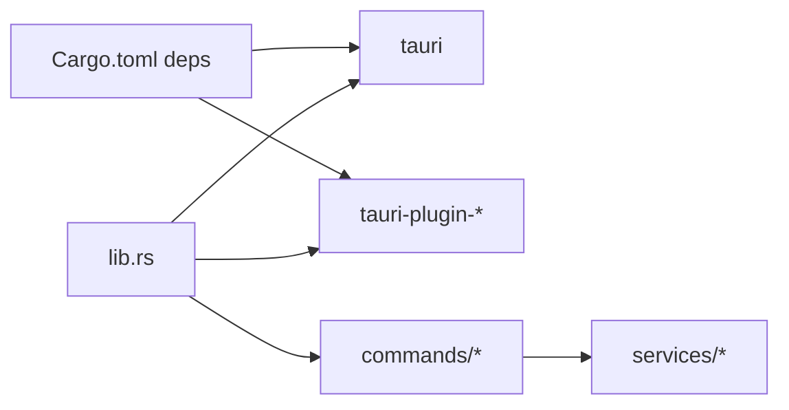

# IPC Communication Patterns

<cite>
**Referenced Files in This Document**
- [src-tauri/tauri.conf.json](file://src-tauri/tauri.conf.json)
- [src-tauri/capabilities/default.json](file://src-tauri/capabilities/default.json)
- [src-tauri/gen/schemas/capabilities.json](file://src-tauri/gen/schemas/capabilities.json)
- [src-tauri/Cargo.toml](file://src-tauri/Cargo.toml)
- [src-tauri/src/main.rs](file://src-tauri/src/main.rs)
- [src-tauri/src/lib.rs](file://src-tauri/src/lib.rs)
- [src-tauri/src/commands/mod.rs](file://src-tauri/src/commands/mod.rs)
- [src-tauri/src/commands/wallet.rs](file://src-tauri/src/commands/wallet.rs)
- [src-tauri/src/commands/portfolio.rs](file://src-tauri/src/commands/portfolio.rs)
- [src-tauri/src/commands/chat.rs](file://src-tauri/src/commands/chat.rs)
- [src-tauri/src/commands/strategy.rs](file://src-tauri/src/commands/strategy.rs)
- [src/lib/tauri.ts](file://src/lib/tauri.ts)
- [src/components/system/TauriDevContextMenu.tsx](file://src/components/system/TauriDevContextMenu.tsx)
- [src/hooks/useAgentChat.ts](file://src/hooks/useAgentChat.ts)
- [src/lib/logger.ts](file://src/lib/logger.ts)
</cite>

## Table of Contents
1. [Introduction](#introduction)
2. [Project Structure](#project-structure)
3. [Core Components](#core-components)
4. [Architecture Overview](#architecture-overview)
5. [Detailed Component Analysis](#detailed-component-analysis)
6. [Dependency Analysis](#dependency-analysis)
7. [Performance Considerations](#performance-considerations)
8. [Troubleshooting Guide](#troubleshooting-guide)
9. [Conclusion](#conclusion)
10. [Appendices](#appendices)

## Introduction
This document explains SHADOW Protocol’s Inter-Process Communication (IPC) patterns built on Tauri 2.0. It covers the command routing mechanism, message serialization, frontend-to-backend communication, async operations, error propagation, capability and security policies, and practical patterns for invoking commands from the frontend. It also includes performance guidance, memory management tips, debugging techniques, and troubleshooting advice for common IPC issues.

## Project Structure
The IPC stack spans the frontend React application and the Tauri 2.0 backend written in Rust. The backend exposes commands that the frontend invokes using the Tauri JS API. Security and capabilities are defined in JSON configuration files and generated schemas. The Rust binary initializes plugins, registers commands, and runs async services.

**Diagram sources**
- [src-tauri/src/lib.rs:34-198](file://src-tauri/src/lib.rs#L34-L198)
- [src-tauri/src/main.rs:4-6](file://src-tauri/src/main.rs#L4-L6)
- [src-tauri/src/commands/mod.rs:1-27](file://src-tauri/src/commands/mod.rs#L1-L27)

**Section sources**
- [src-tauri/tauri.conf.json:1-60](file://src-tauri/tauri.conf.json#L1-L60)
- [src-tauri/src/lib.rs:34-198](file://src-tauri/src/lib.rs#L34-L198)
- [src-tauri/src/main.rs:4-6](file://src-tauri/src/main.rs#L4-L6)

## Core Components
- Tauri configuration defines product metadata, dev/build URLs, CSP, and bundling resources.
- Capability definitions grant permissions to the main window and plugins.
- The Rust backend registers commands and plugins, sets up async tasks, and initializes services.
- Frontend invokes commands via the Tauri JS API and handles responses and errors.

Key IPC elements:
- Command registration and invocation handler wiring.
- Async command handlers returning futures.
- Error propagation via Result types serialized to JSON.
- Security via CSP and capability permissions.

**Section sources**
- [src-tauri/tauri.conf.json:1-60](file://src-tauri/tauri.conf.json#L1-L60)
- [src-tauri/capabilities/default.json:1-13](file://src-tauri/capabilities/default.json#L1-L13)
- [src-tauri/gen/schemas/capabilities.json:1-1](file://src-tauri/gen/schemas/capabilities.json#L1-L1)
- [src-tauri/src/lib.rs:90-190](file://src-tauri/src/lib.rs#L90-L190)

## Architecture Overview
The frontend calls Tauri commands using the invoke API. The Tauri runtime routes the call to the registered handler, which executes the corresponding Rust command. Commands may be synchronous or asynchronous. Results and errors are serialized to JSON and returned to the frontend.

**Diagram sources**
- [src-tauri/src/lib.rs:90-190](file://src-tauri/src/lib.rs#L90-L190)
- [src-tauri/src/commands/wallet.rs:169-200](file://src-tauri/src/commands/wallet.rs#L169-L200)

## Detailed Component Analysis

### Tauri Configuration and Security Policies
- Product and build configuration define dev URL, dist path, and resources.
- Content Security Policy restricts connections and assets.
- Capabilities define the main window permissions and plugin grants.

Security implications:
- CSP limits outbound connections to localhost and specific providers.
- Capabilities gate access to window dragging and opener/biometry plugins.

**Section sources**
- [src-tauri/tauri.conf.json:6-34](file://src-tauri/tauri.conf.json#L6-L34)
- [src-tauri/capabilities/default.json:6-11](file://src-tauri/capabilities/default.json#L6-L11)
- [src-tauri/gen/schemas/capabilities.json:1-1](file://src-tauri/gen/schemas/capabilities.json#L1-L1)

### Capability Definitions and Generated Schemas
Capabilities describe the identity, scope, and permissions granted to the main window. The generated schema reflects the effective set of permissions applied during build.

**Diagram sources**
- [src-tauri/capabilities/default.json:1-13](file://src-tauri/capabilities/default.json#L1-L13)
- [src-tauri/tauri.conf.json:2](file://src-tauri/tauri.conf.json#L2)
- [src-tauri/gen/schemas/capabilities.json:1-1](file://src-tauri/gen/schemas/capabilities.json#L1-L1)

**Section sources**
- [src-tauri/capabilities/default.json:1-13](file://src-tauri/capabilities/default.json#L1-L13)
- [src-tauri/gen/schemas/capabilities.json:1-1](file://src-tauri/gen/schemas/capabilities.json#L1-L1)

### Command Routing and Registration
Commands are grouped under modules and registered in the invoke handler. The handler maps command names to their implementations. This enables centralized routing and consistent error handling.

**Diagram sources**
- [src-tauri/src/lib.rs:90-190](file://src-tauri/src/lib.rs#L90-L190)
- [src-tauri/src/commands/mod.rs:1-27](file://src-tauri/src/commands/mod.rs#L1-L27)

**Section sources**
- [src-tauri/src/lib.rs:90-190](file://src-tauri/src/lib.rs#L90-L190)
- [src-tauri/src/commands/mod.rs:1-27](file://src-tauri/src/commands/mod.rs#L1-L27)

### Message Serialization Formats
- Request arguments are deserialized from JSON into strongly-typed structs.
- Responses are serialized to JSON and returned to the frontend.
- Errors are serialized as strings and propagated as rejections.

Examples of serialization patterns:
- Wallet creation input/output structs define snake_case field mapping.
- Portfolio commands return typed arrays and objects suitable for UI rendering.
- Chat and strategy commands return structured results for agent orchestration.

**Section sources**
- [src-tauri/src/commands/wallet.rs:39-79](file://src-tauri/src/commands/wallet.rs#L39-L79)
- [src-tauri/src/commands/portfolio.rs:89-264](file://src-tauri/src/commands/portfolio.rs#L89-L264)
- [src-tauri/src/commands/chat.rs:24-113](file://src-tauri/src/commands/chat.rs#L24-L113)
- [src-tauri/src/commands/strategy.rs:22-68](file://src-tauri/src/commands/strategy.rs#L22-L68)

### Frontend-to-Backend Communication Flow
- The frontend detects Tauri runtime availability.
- Components invoke commands using the Tauri JS API.
- The runtime routes to the handler and executes the command.
- Results are delivered back to the frontend.

**Diagram sources**
- [src/hooks/useAgentChat.ts:39-66](file://src/hooks/useAgentChat.ts#L39-L66)
- [src-tauri/src/commands/chat.rs:373-400](file://src-tauri/src/commands/chat.rs#L373-L400)

**Section sources**
- [src/lib/tauri.ts:1-3](file://src/lib/tauri.ts#L1-L3)
- [src/hooks/useAgentChat.ts:39-66](file://src/hooks/useAgentChat.ts#L39-L66)
- [src-tauri/src/commands/chat.rs:373-400](file://src-tauri/src/commands/chat.rs#L373-L400)

### Async Operation Handling
- Many commands are async and may call external services or perform I/O.
- Async commands return futures; the runtime awaits completion.
- Long-running operations should be designed to avoid blocking the UI thread.

Patterns observed:
- Async portfolio fetch commands delegate to services and return futures.
- Background tasks spawn periodic cleanup and sync routines.

**Section sources**
- [src-tauri/src/commands/portfolio.rs:38-87](file://src-tauri/src/commands/portfolio.rs#L38-L87)
- [src-tauri/src/lib.rs:50-87](file://src-tauri/src/lib.rs#L50-L87)

### Error Propagation Patterns
- Commands return Result<T, String>, where errors are serialized strings.
- Frontend receives rejections and can surface user-friendly messages.
- Logging utilities help capture errors in development.

**Section sources**
- [src-tauri/src/commands/wallet.rs:18-37](file://src-tauri/src/commands/wallet.rs#L18-L37)
- [src-tauri/src/commands/chat.rs:354-371](file://src-tauri/src/commands/chat.rs#L354-L371)
- [src/lib/logger.ts:1-6](file://src/lib/logger.ts#L1-L6)

### JavaScript API Bindings and Invocation Patterns
- The frontend uses the Tauri JS API to invoke commands.
- Runtime detection helps adapt behavior when outside Tauri.
- Developer context menu demonstrates invoking internal commands.

**Section sources**
- [src/lib/tauri.ts:1-3](file://src/lib/tauri.ts#L1-L3)
- [src/components/system/TauriDevContextMenu.tsx:47-52](file://src/components/system/TauriDevContextMenu.tsx#L47-L52)

### Synchronous vs Asynchronous Commands
- Synchronous examples: greeting and devtools toggles.
- Asynchronous examples: wallet operations, portfolio fetches, chat approvals, strategy persistence.

**Section sources**
- [src-tauri/src/lib.rs:8-31](file://src-tauri/src/lib.rs#L8-L31)
- [src-tauri/src/commands/wallet.rs:169-200](file://src-tauri/src/commands/wallet.rs#L169-L200)
- [src-tauri/src/commands/portfolio.rs:38-87](file://src-tauri/src/commands/portfolio.rs#L38-L87)
- [src-tauri/src/commands/chat.rs:373-400](file://src-tauri/src/commands/chat.rs#L373-L400)
- [src-tauri/src/commands/strategy.rs:216-243](file://src-tauri/src/commands/strategy.rs#L216-L243)

### Batch Operations and Real-Time Subscriptions
- Batch operations: multi-address portfolio queries and bulk snapshot uploads.
- Real-time subscriptions: not shown in the referenced files; implement via Tauri events if needed.

**Section sources**
- [src-tauri/src/commands/portfolio.rs:73-87](file://src-tauri/src/commands/portfolio.rs#L73-L87)
- [src-tauri/src/commands/chat.rs:138-139](file://src-tauri/src/commands/chat.rs#L138-L139)

### Example Workflows

#### Wallet Lifecycle (Create, Import, List, Remove)

**Diagram sources**
- [src-tauri/src/commands/wallet.rs:169-283](file://src-tauri/src/commands/wallet.rs#L169-L283)

**Section sources**
- [src-tauri/src/commands/wallet.rs:169-283](file://src-tauri/src/commands/wallet.rs#L169-L283)

#### Portfolio Fetching (Local DB First, Fallback)

**Diagram sources**
- [src-tauri/src/commands/portfolio.rs:38-71](file://src-tauri/src/commands/portfolio.rs#L38-L71)

**Section sources**
- [src-tauri/src/commands/portfolio.rs:38-71](file://src-tauri/src/commands/portfolio.rs#L38-L71)

#### Agent Action Approval Flow

**Diagram sources**
- [src/hooks/useAgentChat.ts:39-66](file://src/hooks/useAgentChat.ts#L39-L66)
- [src-tauri/src/commands/chat.rs:373-608](file://src-tauri/src/commands/chat.rs#L373-L608)

**Section sources**
- [src/hooks/useAgentChat.ts:39-66](file://src/hooks/useAgentChat.ts#L39-L66)
- [src-tauri/src/commands/chat.rs:373-608](file://src-tauri/src/commands/chat.rs#L373-L608)

## Dependency Analysis
- The Rust binary depends on Tauri core and optional plugins.
- The lib registers commands and plugins, and spawns async tasks.
- Commands depend on services and local database abstractions.

**Diagram sources**
- [src-tauri/Cargo.toml:20-44](file://src-tauri/Cargo.toml#L20-L44)
- [src-tauri/src/lib.rs:40-63](file://src-tauri/src/lib.rs#L40-L63)

**Section sources**
- [src-tauri/Cargo.toml:20-44](file://src-tauri/Cargo.toml#L20-L44)
- [src-tauri/src/lib.rs:40-63](file://src-tauri/src/lib.rs#L40-L63)

## Performance Considerations
- Prefer async commands for I/O-bound operations to keep the UI responsive.
- Minimize large JSON payloads; consider batching where appropriate.
- Use local caching (e.g., local DB) to reduce repeated network calls.
- Avoid long-lived synchronous operations in the main thread.
- Monitor Tokio runtime usage and tune worker threads if needed.

## Troubleshooting Guide
Common issues and remedies:
- Command not found: Verify the command name exists in the invoke handler registration.
- Permission denied: Check capability definitions and CSP to ensure required permissions are granted.
- Runtime detection failures: Confirm the frontend runtime detection logic and environment.
- Devtools not opening: Ensure devtools are enabled in the configuration and the command is available.
- Error messages: Use logging utilities to capture and inspect errors during development.

**Section sources**
- [src-tauri/src/lib.rs:90-190](file://src-tauri/src/lib.rs#L90-L190)
- [src-tauri/tauri.conf.json:32-34](file://src-tauri/tauri.conf.json#L32-L34)
- [src/lib/tauri.ts:1-3](file://src/lib/tauri.ts#L1-L3)
- [src/lib/logger.ts:1-6](file://src/lib/logger.ts#L1-L6)

## Conclusion
SHADOW Protocol’s IPC leverages Tauri 2.0 to provide a secure, efficient bridge between the frontend and Rust backend. Commands are organized, strongly typed, and support both synchronous and asynchronous execution. Security is enforced via CSP and capability-based permissions. The frontend uses the Tauri JS API to invoke commands, receive structured results, and handle errors. Following the patterns documented here ensures robust, maintainable IPC integrations.

## Appendices
- Tauri entry point and library initialization.
- Command modules and representative command implementations.

**Section sources**
- [src-tauri/src/main.rs:4-6](file://src-tauri/src/main.rs#L4-L6)
- [src-tauri/src/lib.rs:34-198](file://src-tauri/src/lib.rs#L34-L198)
- [src-tauri/src/commands/mod.rs:1-27](file://src-tauri/src/commands/mod.rs#L1-L27)
- [src-tauri/src/commands/wallet.rs:169-283](file://src-tauri/src/commands/wallet.rs#L169-L283)
- [src-tauri/src/commands/portfolio.rs:38-406](file://src-tauri/src/commands/portfolio.rs#L38-L406)
- [src-tauri/src/commands/chat.rs:110-609](file://src-tauri/src/commands/chat.rs#L110-L609)
- [src-tauri/src/commands/strategy.rs:216-309](file://src-tauri/src/commands/strategy.rs#L216-L309)