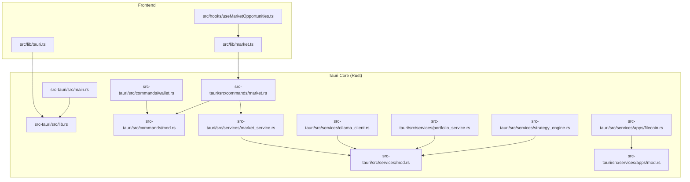
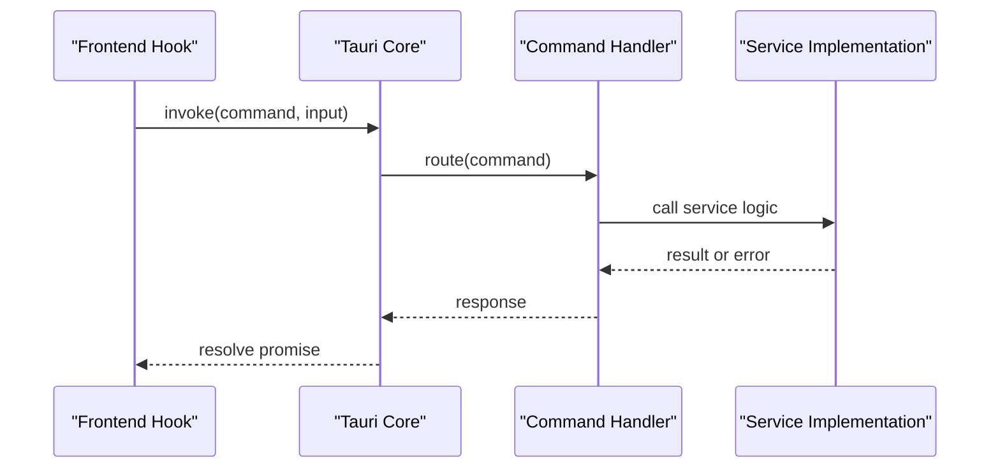
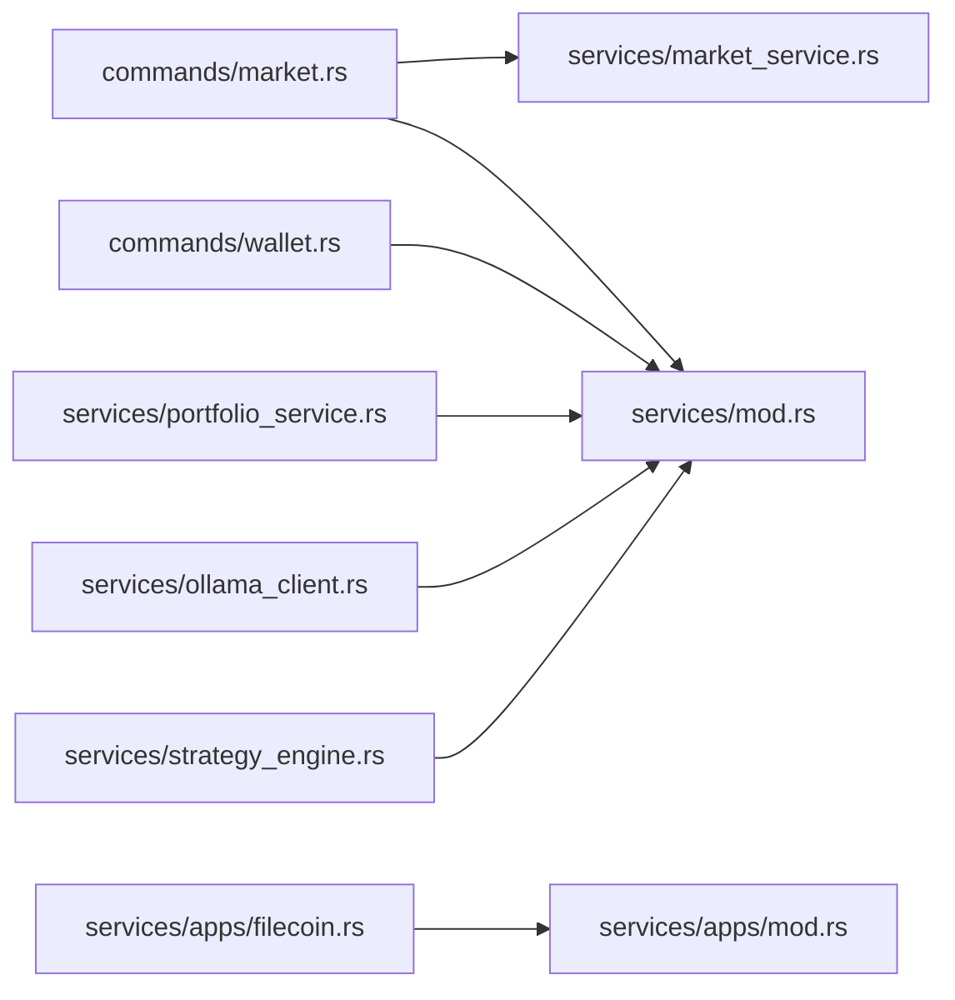

# Integration Examples

<cite>
**Referenced Files in This Document**
- [src-tauri/src/main.rs](file://src-tauri/src/main.rs)
- [src-tauri/src/lib.rs](file://src-tauri/src/lib.rs)
- [src-tauri/src/commands/mod.rs](file://src-tauri/src/commands/mod.rs)
- [src-tauri/src/commands/wallet.rs](file://src-tauri/src/commands/wallet.rs)
- [src-tauri/src/commands/market.rs](file://src-tauri/src/commands/market.rs)
- [src-tauri/src/services/mod.rs](file://src-tauri/src/services/mod.rs)
- [src-tauri/src/services/market_service.rs](file://src-tauri/src/services/market_service.rs)
- [src-tauri/src/services/apps/mod.rs](file://src-tauri/src/services/apps/mod.rs)
- [src-tauri/src/services/apps/filecoin.rs](file://src-tauri/src/services/apps/filecoin.rs)
- [src-tauri/src/services/ollama_client.rs](file://src-tauri/src/services/ollama_client.rs)
- [src-tauri/src/services/portfolio_service.rs](file://src-tauri/src/services/portfolio_service.rs)
- [src-tauri/src/services/strategy_engine.rs](file://src-tauri/src/services/strategy_engine.rs)
- [src/lib/tauri.ts](file://src/lib/tauri.ts)
- [src/lib/market.ts](file://src/lib/market.ts)
- [src/hooks/useMarketOpportunities.ts](file://src/hooks/useMarketOpportunities.ts)
</cite>

## Table of Contents
1. [Introduction](#introduction)
2. [Project Structure](#project-structure)
3. [Core Components](#core-components)
4. [Architecture Overview](#architecture-overview)
5. [Detailed Component Analysis](#detailed-component-analysis)
6. [Dependency Analysis](#dependency-analysis)
7. [Performance Considerations](#performance-considerations)
8. [Troubleshooting Guide](#troubleshooting-guide)
9. [Conclusion](#conclusion)
10. [Appendices](#appendices)

## Introduction
This document provides practical integration examples for extending SHADOW Protocol’s API system. It focuses on:
- Creating custom Tauri commands
- Implementing new service interfaces
- Integrating external APIs
- Extending wallet functionality
- Adding new blockchain providers
- Implementing custom AI models
- Creating new market data sources

The guide includes step-by-step instructions, code example paths, frontend integration patterns, error handling strategies, and best practices for API design, backward compatibility, and performance optimization.

## Project Structure
SHADOW Protocol separates the frontend (React + Tauri) from the backend (Rust Tauri core). The Rust side exposes commands and services, while the frontend invokes commands and listens to events.

**Diagram sources**
- [src-tauri/src/main.rs:1-7](file://src-tauri/src/main.rs#L1-L7)
- [src-tauri/src/lib.rs:1-199](file://src-tauri/src/lib.rs#L1-L199)
- [src-tauri/src/commands/mod.rs:1-27](file://src-tauri/src/commands/mod.rs#L1-L27)
- [src-tauri/src/commands/wallet.rs:1-284](file://src-tauri/src/commands/wallet.rs#L1-L284)
- [src-tauri/src/commands/market.rs:1-36](file://src-tauri/src/commands/market.rs#L1-L36)
- [src-tauri/src/services/mod.rs:1-37](file://src-tauri/src/services/mod.rs#L1-L37)
- [src-tauri/src/services/market_service.rs:1-745](file://src-tauri/src/services/market_service.rs#L1-L745)
- [src-tauri/src/services/apps/mod.rs:1-15](file://src-tauri/src/services/apps/mod.rs#L1-L15)
- [src-tauri/src/services/apps/filecoin.rs:1-266](file://src-tauri/src/services/apps/filecoin.rs#L1-L266)
- [src-tauri/src/services/ollama_client.rs:1-106](file://src-tauri/src/services/ollama_client.rs#L1-L106)
- [src-tauri/src/services/portfolio_service.rs:1-498](file://src-tauri/src/services/portfolio_service.rs#L1-L498)
- [src-tauri/src/services/strategy_engine.rs:1-726](file://src-tauri/src/services/strategy_engine.rs#L1-L726)
- [src/lib/tauri.ts:1-4](file://src/lib/tauri.ts#L1-L4)
- [src/lib/market.ts:1-135](file://src/lib/market.ts#L1-L135)
- [src/hooks/useMarketOpportunities.ts:1-131](file://src/hooks/useMarketOpportunities.ts#L1-L131)

**Section sources**
- [src-tauri/src/main.rs:1-7](file://src-tauri/src/main.rs#L1-L7)
- [src-tauri/src/lib.rs:33-198](file://src-tauri/src/lib.rs#L33-L198)
- [src/lib/tauri.ts:1-4](file://src/lib/tauri.ts#L1-L4)

## Core Components
- Tauri command registration: Commands are declared with attributes and registered in the Tauri builder invocation handler.
- Services orchestration: Services are initialized during setup and run periodic tasks or event emitters.
- Frontend integration: React hooks and libraries invoke commands and subscribe to events.

Key patterns:
- Command definition with #[tauri::command] and typed input/output structs.
- Service initialization in setup and periodic refresh loops.
- Frontend invoke calls and event listeners for real-time updates.

**Section sources**
- [src-tauri/src/lib.rs:8-31](file://src-tauri/src/lib.rs#L8-L31)
- [src-tauri/src/lib.rs:34-89](file://src-tauri/src/lib.rs#L34-L89)
- [src/lib/market.ts:16-59](file://src/lib/market.ts#L16-L59)
- [src/hooks/useMarketOpportunities.ts:64-92](file://src/hooks/useMarketOpportunities.ts#L64-L92)

## Architecture Overview
The system follows a layered architecture:
- Frontend (React) invokes Tauri commands via @tauri-apps/api.
- Tauri core registers commands and routes them to service implementations.
- Services interact with external APIs, databases, and emit events.
- Frontend listens to events to update UI reactively.

**Diagram sources**
- [src/lib/market.ts:16-59](file://src/lib/market.ts#L16-L59)
- [src-tauri/src/lib.rs:90-190](file://src-tauri/src/lib.rs#L90-L190)
- [src-tauri/src/commands/market.rs:8-36](file://src-tauri/src/commands/market.rs#L8-L36)
- [src-tauri/src/services/market_service.rs:220-261](file://src-tauri/src/services/market_service.rs#L220-L261)

## Detailed Component Analysis

### Creating a Custom Tauri Command
Steps:
1. Define input/output structs in Rust.
2. Implement the #[tauri::command] function.
3. Register the command in the invoke handler.

Example paths:
- Command registration: [src-tauri/src/lib.rs:90-190](file://src-tauri/src/lib.rs#L90-L190)
- Command module exports: [src-tauri/src/commands/mod.rs:1-27](file://src-tauri/src/commands/mod.rs#L1-L27)
- Example wallet command: [src-tauri/src/commands/wallet.rs:169-200](file://src-tauri/src/commands/wallet.rs#L169-L200)

Best practices:
- Keep input/output structs serializable and snake_case for frontend compatibility.
- Return Result<T, E> with E implementing Serialize for consistent error propagation.
- Use AppHandle for filesystem and OS integrations.

**Section sources**
- [src-tauri/src/lib.rs:90-190](file://src-tauri/src/lib.rs#L90-L190)
- [src-tauri/src/commands/mod.rs:15-27](file://src-tauri/src/commands/mod.rs#L15-L27)
- [src-tauri/src/commands/wallet.rs:18-37](file://src-tauri/src/commands/wallet.rs#L18-L37)

### Implementing a New Service Interface
Steps:
1. Add a new module under src-tauri/src/services/.
2. Implement service functions and periodic tasks.
3. Initialize the service in setup and register event emitters.

Example paths:
- Service module exports: [src-tauri/src/services/mod.rs:1-37](file://src-tauri/src/services/mod.rs#L1-L37)
- Market service lifecycle: [src-tauri/src/services/market_service.rs:189-218](file://src-tauri/src/services/market_service.rs#L189-L218)
- Portfolio service integration: [src-tauri/src/services/portfolio_service.rs:131-147](file://src-tauri/src/services/portfolio_service.rs#L131-L147)

Patterns:
- Periodic refresh loops with intervals.
- Event emission for frontend updates.
- Robust error handling with fallback to cached data.

**Section sources**
- [src-tauri/src/services/mod.rs:1-37](file://src-tauri/src/services/mod.rs#L1-L37)
- [src-tauri/src/services/market_service.rs:189-218](file://src-tauri/src/services/market_service.rs#L189-L218)
- [src-tauri/src/services/portfolio_service.rs:271-318](file://src-tauri/src/services/portfolio_service.rs#L271-L318)

### Integrating External APIs
Examples:
- Ollama HTTP client: [src-tauri/src/services/ollama_client.rs:46-105](file://src-tauri/src/services/ollama_client.rs#L46-L105)
- Alchemy portfolio API: [src-tauri/src/services/portfolio_service.rs:271-318](file://src-tauri/src/services/portfolio_service.rs#L271-L318)

Guidelines:
- Use typed requests/responses and handle non-success statuses.
- Centralize API keys via settings or environment variables.
- Implement timeouts and retries where appropriate.

**Section sources**
- [src-tauri/src/services/ollama_client.rs:46-105](file://src-tauri/src/services/ollama_client.rs#L46-L105)
- [src-tauri/src/services/portfolio_service.rs:271-318](file://src-tauri/src/services/portfolio_service.rs#L271-L318)

### Extending Wallet Functionality
Pattern:
- Wallet commands manage creation, import, listing, and removal.
- Private keys are stored securely using OS keychain and optional biometric protection.
- Addresses are persisted separately for quick access.

Example paths:
- Wallet command definitions: [src-tauri/src/commands/wallet.rs:169-284](file://src-tauri/src/commands/wallet.rs#L169-L284)
- Address persistence and migration: [src-tauri/src/commands/wallet.rs:87-126](file://src-tauri/src/commands/wallet.rs#L87-L126)

Frontend integration:
- Use hasTauriRuntime check before invoking commands.
- Example runtime detection: [src/lib/tauri.ts:1-4](file://src/lib/tauri.ts#L1-L4)

**Section sources**
- [src-tauri/src/commands/wallet.rs:169-284](file://src-tauri/src/commands/wallet.rs#L169-L284)
- [src/lib/tauri.ts:1-4](file://src/lib/tauri.ts#L1-L4)

### Adding a New Blockchain Provider
Pattern:
- Implement provider-specific fetch logic in a service module.
- Integrate with the market pipeline and caching layer.
- Emit events to notify the UI of updates.

Example paths:
- Market service orchestrates providers and refresh cycles: [src-tauri/src/services/market_service.rs:263-365](file://src-tauri/src/services/market_service.rs#L263-L365)
- Filecoin backup adapter demonstrates sidecar integration: [src-tauri/src/services/apps/filecoin.rs:99-131](file://src-tauri/src/services/apps/filecoin.rs#L99-L131)

Frontend consumption:
- Frontend invokes market commands and listens to events: [src/lib/market.ts:16-59](file://src/lib/market.ts#L16-L59), [src/hooks/useMarketOpportunities.ts:64-92](file://src/hooks/useMarketOpportunities.ts#L64-L92)

**Section sources**
- [src-tauri/src/services/market_service.rs:263-365](file://src-tauri/src/services/market_service.rs#L263-L365)
- [src-tauri/src/services/apps/filecoin.rs:99-131](file://src-tauri/src/services/apps/filecoin.rs#L99-L131)
- [src/lib/market.ts:16-59](file://src/lib/market.ts#L16-L59)
- [src/hooks/useMarketOpportunities.ts:64-92](file://src/hooks/useMarketOpportunities.ts#L64-L92)

### Implementing Custom AI Models
Pattern:
- Use an HTTP client to communicate with the model server.
- Support optional authentication via settings.
- Return structured responses for downstream consumers.

Example paths:
- Ollama chat client: [src-tauri/src/services/ollama_client.rs:46-105](file://src-tauri/src/services/ollama_client.rs#L46-L105)

Frontend integration:
- Use invoke to call Rust commands that wrap AI clients.
- Example command wrappers: [src-tauri/src/commands/market.rs:8-36](file://src-tauri/src/commands/market.rs#L8-L36)

**Section sources**
- [src-tauri/src/services/ollama_client.rs:46-105](file://src-tauri/src/services/ollama_client.rs#L46-L105)
- [src-tauri/src/commands/market.rs:8-36](file://src-tauri/src/commands/market.rs#L8-L36)

### Creating New Market Data Sources
Pattern:
- Implement a provider module that fetches and normalizes data.
- Integrate with the ranking and caching pipeline.
- Emit events to update the UI.

Example paths:
- Market service refresh and caching: [src-tauri/src/services/market_service.rs:263-365](file://src-tauri/src/services/market_service.rs#L263-L365)
- Frontend query and event listeners: [src/hooks/useMarketOpportunities.ts:27-92](file://src/hooks/useMarketOpportunities.ts#L27-L92)

**Section sources**
- [src-tauri/src/services/market_service.rs:263-365](file://src-tauri/src/services/market_service.rs#L263-L365)
- [src/hooks/useMarketOpportunities.ts:27-92](file://src/hooks/useMarketOpportunities.ts#L27-L92)

### Strategy Engine Integration
Pattern:
- Strategies are evaluated periodically against conditions and triggers.
- Guardrails enforce safety policies and emit alerts or approval requests.

Example paths:
- Strategy evaluation and approval creation: [src-tauri/src/services/strategy_engine.rs:343-401](file://src-tauri/src/services/strategy_engine.rs#L343-L401)

**Section sources**
- [src-tauri/src/services/strategy_engine.rs:343-401](file://src-tauri/src/services/strategy_engine.rs#L343-L401)

## Dependency Analysis
The Rust core composes commands and services into a cohesive API surface. Commands depend on services, and services depend on external APIs and local storage.

**Diagram sources**
- [src-tauri/src/commands/market.rs:1-36](file://src-tauri/src/commands/market.rs#L1-L36)
- [src-tauri/src/services/market_service.rs:1-745](file://src-tauri/src/services/market_service.rs#L1-L745)
- [src-tauri/src/commands/wallet.rs:1-284](file://src-tauri/src/commands/wallet.rs#L1-L284)
- [src-tauri/src/services/mod.rs:1-37](file://src-tauri/src/services/mod.rs#L1-L37)
- [src-tauri/src/services/portfolio_service.rs:1-498](file://src-tauri/src/services/portfolio_service.rs#L1-L498)
- [src-tauri/src/services/ollama_client.rs:1-106](file://src-tauri/src/services/ollama_client.rs#L1-L106)
- [src-tauri/src/services/apps/filecoin.rs:1-266](file://src-tauri/src/services/apps/filecoin.rs#L1-L266)
- [src-tauri/src/services/apps/mod.rs:1-15](file://src-tauri/src/services/apps/mod.rs#L1-L15)
- [src-tauri/src/services/strategy_engine.rs:1-726](file://src-tauri/src/services/strategy_engine.rs#L1-L726)

**Section sources**
- [src-tauri/src/commands/mod.rs:1-27](file://src-tauri/src/commands/mod.rs#L1-L27)
- [src-tauri/src/services/mod.rs:1-37](file://src-tauri/src/services/mod.rs#L1-L37)

## Performance Considerations
- Cache and refresh strategies: Services often cache results and refresh at fixed intervals to minimize external API calls.
- Asynchronous execution: Long-running tasks are spawned asynchronously to keep the UI responsive.
- Event-driven updates: Services emit events to inform the frontend of changes, reducing polling overhead.
- Input sanitization: Validate and sanitize inputs early to avoid unnecessary work.

[No sources needed since this section provides general guidance]

## Troubleshooting Guide
Common issues and resolutions:
- Missing API keys: Ensure secrets are set via settings commands and retrieved in services.
- Network failures: Implement fallback to cached data and emit refresh failure events.
- Serialization errors: Keep input/output structs consistent with serde conventions.
- Biometric/keychain errors: Gracefully handle platform differences and provide fallbacks.

Example paths:
- Market fallback to cached results: [src-tauri/src/services/market_service.rs:601-624](file://src-tauri/src/services/market_service.rs#L601-L624)
- Wallet error types and serialization: [src-tauri/src/commands/wallet.rs:18-37](file://src-tauri/src/commands/wallet.rs#L18-L37)
- Frontend event binding and error extraction: [src/hooks/useMarketOpportunities.ts:118-129](file://src/hooks/useMarketOpportunities.ts#L118-L129)

**Section sources**
- [src-tauri/src/services/market_service.rs:601-624](file://src-tauri/src/services/market_service.rs#L601-L624)
- [src-tauri/src/commands/wallet.rs:18-37](file://src-tauri/src/commands/wallet.rs#L18-L37)
- [src/hooks/useMarketOpportunities.ts:118-129](file://src/hooks/useMarketOpportunities.ts#L118-L129)

## Conclusion
SHADOW Protocol’s API system cleanly separates frontend interactions from backend services. By following the established patterns for commands, services, and event-driven updates, you can rapidly integrate new blockchain providers, AI models, and market data sources while maintaining backward compatibility and strong error handling.

[No sources needed since this section summarizes without analyzing specific files]

## Appendices

### Step-by-Step Integration Templates

- Template: Custom Tauri Command
  - Define input/output structs and #[tauri::command] function.
  - Register the command in the invoke handler.
  - Example paths: [src-tauri/src/lib.rs:90-190](file://src-tauri/src/lib.rs#L90-L190), [src-tauri/src/commands/wallet.rs:169-200](file://src-tauri/src/commands/wallet.rs#L169-L200)

- Template: New Service Module
  - Add module under services/, implement functions and setup.
  - Initialize in setup and emit events.
  - Example paths: [src-tauri/src/services/mod.rs:1-37](file://src-tauri/src/services/mod.rs#L1-L37), [src-tauri/src/services/market_service.rs:189-218](file://src-tauri/src/services/market_service.rs#L189-L218)

- Template: External API Integration
  - Use typed requests, handle non-success statuses, centralize credentials.
  - Example paths: [src-tauri/src/services/ollama_client.rs:46-105](file://src-tauri/src/services/ollama_client.rs#L46-L105), [src-tauri/src/services/portfolio_service.rs:271-318](file://src-tauri/src/services/portfolio_service.rs#L271-L318)

- Template: Frontend Integration
  - Use invoke and listen for events.
  - Example paths: [src/lib/market.ts:16-59](file://src/lib/market.ts#L16-L59), [src/hooks/useMarketOpportunities.ts:64-92](file://src/hooks/useMarketOpportunities.ts#L64-L92)

- Template: Wallet Extension
  - Manage addresses and private keys securely; persist addresses separately.
  - Example paths: [src-tauri/src/commands/wallet.rs:87-126](file://src-tauri/src/commands/wallet.rs#L87-L126), [src/lib/tauri.ts:1-4](file://src/lib/tauri.ts#L1-L4)

- Template: Strategy Action Integration
  - Evaluate conditions and triggers; create approvals or emit alerts.
  - Example paths: [src-tauri/src/services/strategy_engine.rs:343-401](file://src-tauri/src/services/strategy_engine.rs#L343-L401)

### Best Practices Checklist
- API Design
  - Use snake_case for JSON fields and consistent naming.
  - Keep inputs minimal and validated.
  - Return Result<T, E> with serializable errors.
- Backward Compatibility
  - Avoid breaking changes to command signatures.
  - Maintain existing event payloads.
- Performance
  - Cache frequently accessed data.
  - Use asynchronous tasks for long-running work.
  - Emit targeted events instead of polling.

[No sources needed since this section provides general guidance]