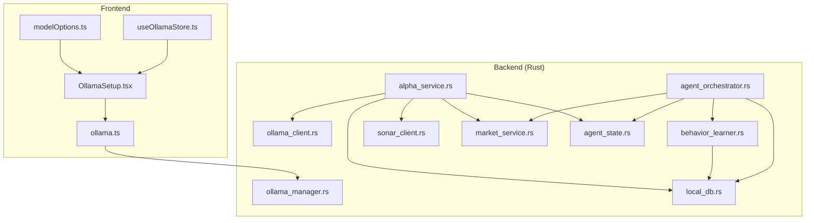
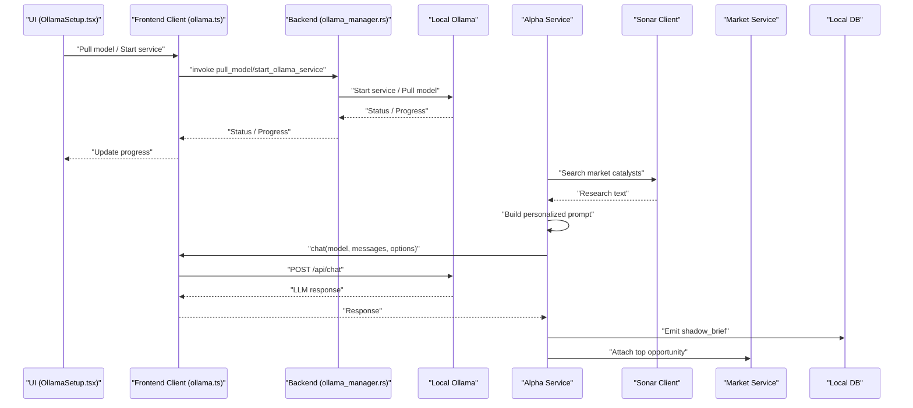
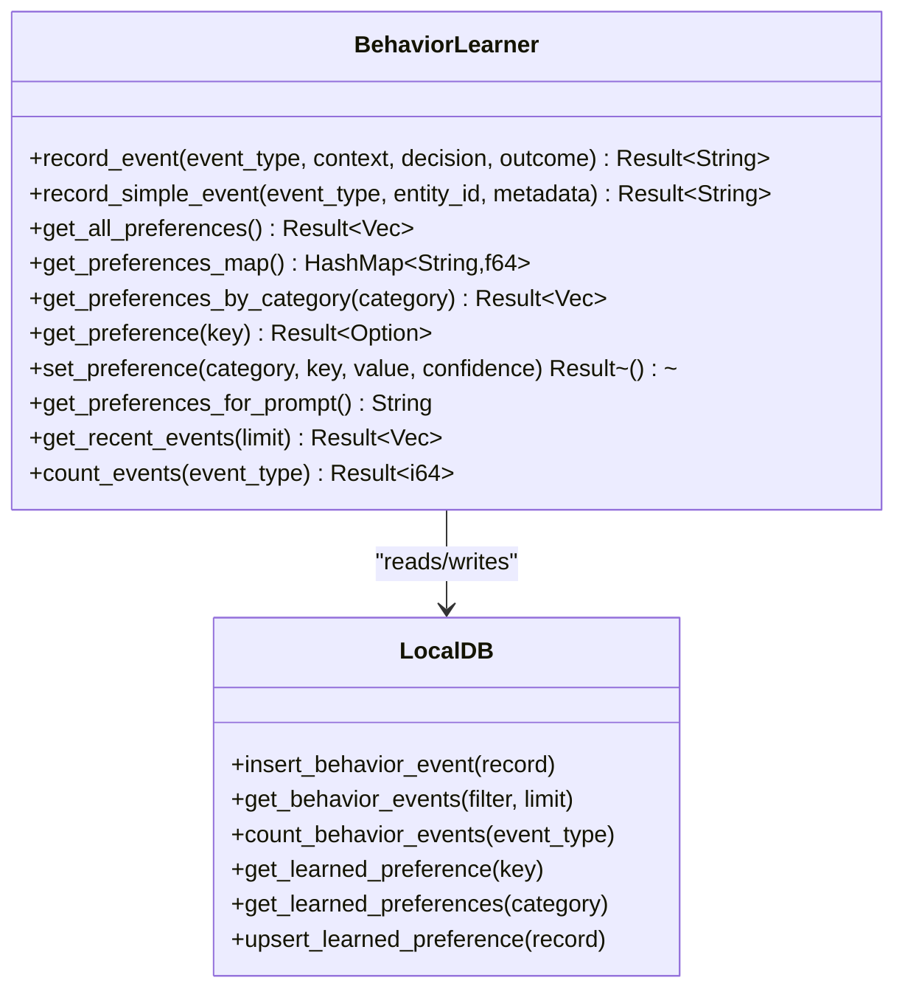
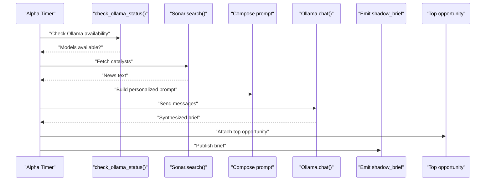
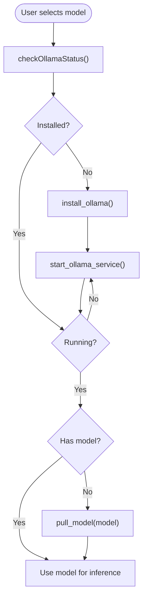
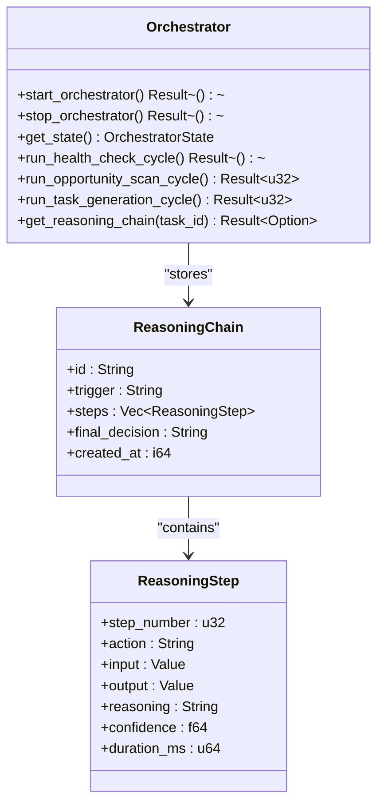
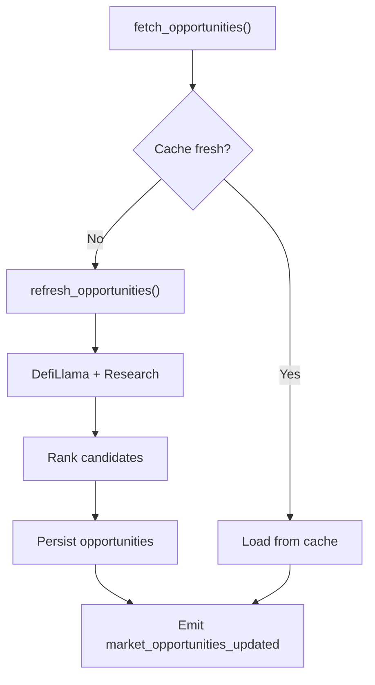
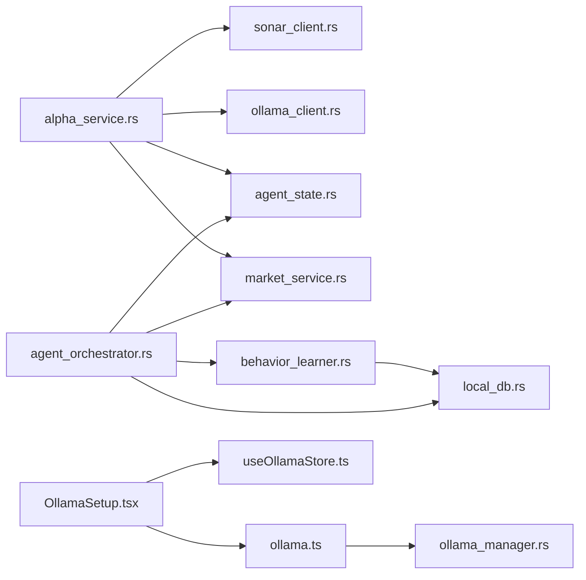

# AI & Machine Learning Services

<cite>
**Referenced Files in This Document**
- [behavior_learner.rs](file://src-tauri/src/services/behavior_learner.rs)
- [alpha_service.rs](file://src-tauri/src/services/alpha_service.rs)
- [ollama_client.rs](file://src-tauri/src/services/ollama_client.rs)
- [ollama.ts](file://src/lib/ollama.ts)
- [modelOptions.ts](file://src/lib/modelOptions.ts)
- [OllamaSetup.tsx](file://src/components/OllamaSetup.tsx)
- [useOllamaStore.ts](file://src/store/useOllamaStore.ts)
- [local_db.rs](file://src-tauri/src/services/local_db.rs)
- [sonar_client.rs](file://src-tauri/src/services/sonar_client.rs)
- [market_service.rs](file://src-tauri/src/services/market_service.rs)
- [agent_orchestrator.rs](file://src-tauri/src/services/agent_orchestrator.rs)
- [agent_state.rs](file://src-tauri/src/services/agent_state.rs)
- [ollama_manager.rs](file://src-tauri/src/commands/ollama_manager.rs)
- [README.md](file://README.md)
</cite>

## Table of Contents
1. [Introduction](#introduction)
2. [Project Structure](#project-structure)
3. [Core Components](#core-components)
4. [Architecture Overview](#architecture-overview)
5. [Detailed Component Analysis](#detailed-component-analysis)
6. [Dependency Analysis](#dependency-analysis)
7. [Performance Considerations](#performance-considerations)
8. [Troubleshooting Guide](#troubleshooting-guide)
9. [Conclusion](#conclusion)

## Introduction
This document explains Shadow Protocol’s AI and machine learning services with a focus on three pillars:
- Behavior learner: pattern recognition and behavioral preference learning from user decisions
- Alpha service: quantitative synthesis, signal processing, and predictive modeling using local AI
- Ollama client: local AI inference, model management, and privacy-preserving operations

It covers service interfaces, model integration patterns, inference pipelines, and practical workflows for AI-driven decision making, pattern analysis, and autonomous operation. It also addresses configuration, model selection, performance optimization, and privacy considerations for local AI processing.

## Project Structure
Shadow Protocol integrates AI across frontend React components and Rust backend services:
- Frontend: model management UI, model selection, and local AI status monitoring
- Backend: behavior learning, alpha synthesis, market intelligence, and local model orchestration
- Storage: local SQLite for behavior events, preferences, reasoning chains, and market data

**Diagram sources**
- [OllamaSetup.tsx:31-156](file://src/components/OllamaSetup.tsx#L31-L156)
- [ollama.ts:17-40](file://src/lib/ollama.ts#L17-L40)
- [modelOptions.ts:19-64](file://src/lib/modelOptions.ts#L19-L64)
- [useOllamaStore.ts:39-82](file://src/store/useOllamaStore.ts#L39-L82)
- [ollama_manager.rs:162-187](file://src-tauri/src/commands/ollama_manager.rs#L162-L187)
- [ollama_client.rs:46-105](file://src-tauri/src/services/ollama_client.rs#L46-L105)
- [behavior_learner.rs:112-158](file://src-tauri/src/services/behavior_learner.rs#L112-L158)
- [alpha_service.rs:27-57](file://src-tauri/src/services/alpha_service.rs#L27-L57)
- [sonar_client.rs:33-77](file://src-tauri/src/services/sonar_client.rs#L33-L77)
- [market_service.rs:189-218](file://src-tauri/src/services/market_service.rs#L189-L218)
- [agent_orchestrator.rs:92-122](file://src-tauri/src/services/agent_orchestrator.rs#L92-L122)
- [agent_state.rs:46-76](file://src-tauri/src/services/agent_state.rs#L46-L76)
- [local_db.rs:321-347](file://src-tauri/src/services/local_db.rs#L321-L347)

**Section sources**
- [OllamaSetup.tsx:31-156](file://src/components/OllamaSetup.tsx#L31-L156)
- [ollama.ts:17-40](file://src/lib/ollama.ts#L17-L40)
- [modelOptions.ts:19-64](file://src/lib/modelOptions.ts#L19-L64)
- [useOllamaStore.ts:39-82](file://src/store/useOllamaStore.ts#L39-L82)
- [ollama_manager.rs:162-187](file://src-tauri/src/commands/ollama_manager.rs#L162-L187)
- [ollama_client.rs:46-105](file://src-tauri/src/services/ollama_client.rs#L46-L105)
- [behavior_learner.rs:112-158](file://src-tauri/src/services/behavior_learner.rs#L112-L158)
- [alpha_service.rs:27-57](file://src-tauri/src/services/alpha_service.rs#L27-L57)
- [sonar_client.rs:33-77](file://src-tauri/src/services/sonar_client.rs#L33-L77)
- [market_service.rs:189-218](file://src-tauri/src/services/market_service.rs#L189-L218)
- [agent_orchestrator.rs:92-122](file://src-tauri/src/services/agent_orchestrator.rs#L92-L122)
- [agent_state.rs:46-76](file://src-tauri/src/services/agent_state.rs#L46-L76)
- [local_db.rs:321-347](file://src-tauri/src/services/local_db.rs#L321-L347)

## Core Components
- Behavior learner service
  - Records user behavior events and updates learned preferences via Bayesian updates
  - Stores events and preferences in local SQLite and exposes retrieval APIs
- Alpha service
  - Periodic synthesis of daily alpha using local LLM, market data, and user profile
  - Emits structured briefs and integrates with market opportunities
- Ollama client
  - Frontend and backend clients for local model inference and chat
  - Provides model management commands and progress reporting

**Section sources**
- [behavior_learner.rs:112-158](file://src-tauri/src/services/behavior_learner.rs#L112-L158)
- [alpha_service.rs:27-57](file://src-tauri/src/services/alpha_service.rs#L27-L57)
- [ollama_client.rs:46-105](file://src-tauri/src/services/ollama_client.rs#L46-L105)
- [ollama.ts:17-40](file://src/lib/ollama.ts#L17-L40)

## Architecture Overview
The AI pipeline combines external market intelligence, local model inference, and autonomous orchestration:
- External research via Sonar API enriches alpha generation
- Local Ollama inference synthesizes insights personalized by user profile and memory
- Behavior learner continuously refines user preferences to improve recommendations
- Agent orchestrator coordinates health checks, opportunity scans, and task generation

**Diagram sources**
- [OllamaSetup.tsx:55-137](file://src/components/OllamaSetup.tsx#L55-L137)
- [ollama.ts:78-109](file://src/lib/ollama.ts#L78-L109)
- [ollama_manager.rs:290-327](file://src-tauri/src/commands/ollama_manager.rs#L290-L327)
- [alpha_service.rs:71-130](file://src-tauri/src/services/alpha_service.rs#L71-L130)
- [sonar_client.rs:33-77](file://src-tauri/src/services/sonar_client.rs#L33-L77)
- [market_service.rs:393-396](file://src-tauri/src/services/market_service.rs#L393-L396)
- [local_db.rs:321-347](file://src-tauri/src/services/local_db.rs#L321-L347)

## Detailed Component Analysis

### Behavior Learner Service
Behavior learner tracks user decisions and outcomes to learn preferences over time. It:
- Defines behavior event types and preference categories
- Records events with context, decisions, and outcomes
- Updates preferences using Bayesian updates with confidence and sample counts
- Persists events and preferences to local SQLite and exposes retrieval APIs

**Diagram sources**
- [behavior_learner.rs:112-158](file://src-tauri/src/services/behavior_learner.rs#L112-L158)
- [behavior_learner.rs:201-256](file://src-tauri/src/services/behavior_learner.rs#L201-L256)
- [behavior_learner.rs:258-313](file://src-tauri/src/services/behavior_learner.rs#L258-L313)
- [local_db.rs:321-347](file://src-tauri/src/services/local_db.rs#L321-L347)
- [local_db.rs:2211-2245](file://src-tauri/src/services/local_db.rs#L2211-L2245)

**Section sources**
- [behavior_learner.rs:112-158](file://src-tauri/src/services/behavior_learner.rs#L112-L158)
- [behavior_learner.rs:201-256](file://src-tauri/src/services/behavior_learner.rs#L201-L256)
- [behavior_learner.rs:258-313](file://src-tauri/src/services/behavior_learner.rs#L258-L313)
- [local_db.rs:321-347](file://src-tauri/src/services/local_db.rs#L321-L347)
- [local_db.rs:2211-2245](file://src-tauri/src/services/local_db.rs#L2211-L2245)

### Alpha Service
The alpha service performs daily synthesis of market insights using:
- External research from Sonar API
- Local LLM via Ollama client
- Personalized context from user profile and memory
- Optional integration with top market opportunities

**Diagram sources**
- [alpha_service.rs:27-57](file://src-tauri/src/services/alpha_service.rs#L27-L57)
- [alpha_service.rs:71-130](file://src-tauri/src/services/alpha_service.rs#L71-L130)
- [sonar_client.rs:33-77](file://src-tauri/src/services/sonar_client.rs#L33-L77)
- [ollama_client.rs:46-105](file://src-tauri/src/services/ollama_client.rs#L46-L105)
- [market_service.rs:393-396](file://src-tauri/src/services/market_service.rs#L393-L396)

**Section sources**
- [alpha_service.rs:27-57](file://src-tauri/src/services/alpha_service.rs#L27-L57)
- [alpha_service.rs:71-130](file://src-tauri/src/services/alpha_service.rs#L71-L130)
- [sonar_client.rs:33-77](file://src-tauri/src/services/sonar_client.rs#L33-L77)
- [ollama_client.rs:46-105](file://src-tauri/src/services/ollama_client.rs#L46-L105)
- [market_service.rs:393-396](file://src-tauri/src/services/market_service.rs#L393-L396)

### Ollama Client and Model Management
The Ollama client supports:
- Frontend: status checks, model pulls, chat, and progress listening
- Backend: model management commands and local inference requests
- Model selection: recommended models based on system resources

**Diagram sources**
- [OllamaSetup.tsx:55-137](file://src/components/OllamaSetup.tsx#L55-L137)
- [ollama.ts:17-40](file://src/lib/ollama.ts#L17-L40)
- [ollama_manager.rs:189-243](file://src-tauri/src/commands/ollama_manager.rs#L189-L243)
- [ollama_manager.rs:290-327](file://src-tauri/src/commands/ollama_manager.rs#L290-L327)
- [modelOptions.ts:52-64](file://src/lib/modelOptions.ts#L52-L64)

**Section sources**
- [OllamaSetup.tsx:55-137](file://src/components/OllamaSetup.tsx#L55-L137)
- [ollama.ts:17-40](file://src/lib/ollama.ts#L17-L40)
- [ollama_manager.rs:189-243](file://src-tauri/src/commands/ollama_manager.rs#L189-L243)
- [ollama_manager.rs:290-327](file://src-tauri/src/commands/ollama_manager.rs#L290-L327)
- [modelOptions.ts:52-64](file://src/lib/modelOptions.ts#L52-L64)

### Agent Orchestration and Reasoning Chains
The agent orchestrator coordinates autonomous operations:
- Health monitoring, opportunity scanning, and task generation
- Persists reasoning chains for transparency and auditability
- Integrates behavior learner preferences and user state

**Diagram sources**
- [agent_orchestrator.rs:92-122](file://src-tauri/src/services/agent_orchestrator.rs#L92-L122)
- [agent_orchestrator.rs:392-467](file://src-tauri/src/services/agent_orchestrator.rs#L392-L467)
- [agent_orchestrator.rs:469-490](file://src-tauri/src/services/agent_orchestrator.rs#L469-L490)

**Section sources**
- [agent_orchestrator.rs:92-122](file://src-tauri/src/services/agent_orchestrator.rs#L92-L122)
- [agent_orchestrator.rs:392-467](file://src-tauri/src/services/agent_orchestrator.rs#L392-L467)
- [agent_orchestrator.rs:469-490](file://src-tauri/src/services/agent_orchestrator.rs#L469-L490)

### Market Intelligence and Opportunities
Market service aggregates and ranks opportunities:
- Fetches candidates from providers and research
- Builds portfolio context and ranks opportunities
- Emits updates and supports detail retrieval

**Diagram sources**
- [market_service.rs:220-261](file://src-tauri/src/services/market_service.rs#L220-L261)
- [market_service.rs:263-365](file://src-tauri/src/services/market_service.rs#L263-L365)

**Section sources**
- [market_service.rs:220-261](file://src-tauri/src/services/market_service.rs#L220-L261)
- [market_service.rs:263-365](file://src-tauri/src/services/market_service.rs#L263-L365)

## Dependency Analysis
Key dependencies and interactions:
- Alpha service depends on Sonar client, Ollama client, agent state, and market service
- Behavior learner persists to local DB and feeds preferences to orchestrator
- Ollama manager provides model lifecycle operations invoked by frontend and backend
- Agent orchestrator coordinates multiple subsystems and stores reasoning chains

**Diagram sources**
- [alpha_service.rs:10-13](file://src-tauri/src/services/alpha_service.rs#L10-L13)
- [sonar_client.rs:33-77](file://src-tauri/src/services/sonar_client.rs#L33-L77)
- [ollama_client.rs:46-105](file://src-tauri/src/services/ollama_client.rs#L46-L105)
- [agent_state.rs:46-76](file://src-tauri/src/services/agent_state.rs#L46-L76)
- [market_service.rs:189-218](file://src-tauri/src/services/market_service.rs#L189-L218)
- [behavior_learner.rs:112-158](file://src-tauri/src/services/behavior_learner.rs#L112-L158)
- [local_db.rs:321-347](file://src-tauri/src/services/local_db.rs#L321-L347)
- [agent_orchestrator.rs:92-122](file://src-tauri/src/services/agent_orchestrator.rs#L92-L122)
- [ollama.ts:17-40](file://src/lib/ollama.ts#L17-L40)
- [ollama_manager.rs:162-187](file://src-tauri/src/commands/ollama_manager.rs#L162-L187)
- [OllamaSetup.tsx:31-156](file://src/components/OllamaSetup.tsx#L31-L156)
- [useOllamaStore.ts:39-82](file://src/store/useOllamaStore.ts#L39-L82)

**Section sources**
- [alpha_service.rs:10-13](file://src-tauri/src/services/alpha_service.rs#L10-L13)
- [behavior_learner.rs:112-158](file://src-tauri/src/services/behavior_learner.rs#L112-L158)
- [local_db.rs:321-347](file://src-tauri/src/services/local_db.rs#L321-L347)
- [agent_orchestrator.rs:92-122](file://src-tauri/src/services/agent_orchestrator.rs#L92-L122)
- [ollama.ts:17-40](file://src/lib/ollama.ts#L17-L40)
- [ollama_manager.rs:162-187](file://src-tauri/src/commands/ollama_manager.rs#L162-L187)
- [OllamaSetup.tsx:31-156](file://src/components/OllamaSetup.tsx#L31-L156)
- [useOllamaStore.ts:39-82](file://src/store/useOllamaStore.ts#L39-L82)

## Performance Considerations
- Model selection and context sizing
  - Use recommended models based on system RAM to avoid heavy inference overhead
  - Respect context token budgets per model to prevent truncation and latency spikes
- Inference efficiency
  - Prefer streaming where supported to reduce perceived latency
  - Cache frequent prompts and reuse model outputs when appropriate
- Background scheduling
  - Alpha cycles run on fixed intervals; tune intervals to balance freshness and resource usage
  - Market refresh intervals separate regular and research refreshes to minimize API load
- Local storage
  - Indexes on behavior events and preferences support fast retrieval and scoring
  - Batch writes for market opportunities to reduce I/O contention

[No sources needed since this section provides general guidance]

## Troubleshooting Guide
Common issues and resolutions:
- Ollama not running or no models
  - Verify installation and service start; ensure model is pulled and available
  - Use progress listeners to diagnose pull failures
- Network/API errors
  - Sonar API requires a valid key; confirm settings and retry
  - Alpha service gracefully skips optional research when unavailable
- Local AI privacy
  - All inference runs locally; ensure no sensitive data leaves the host
  - Use model deletion to clean up after testing

**Section sources**
- [alpha_service.rs:59-69](file://src-tauri/src/services/alpha_service.rs#L59-L69)
- [sonar_client.rs:33-77](file://src-tauri/src/services/sonar_client.rs#L33-L77)
- [ollama_manager.rs:189-243](file://src-tauri/src/commands/ollama_manager.rs#L189-L243)
- [ollama.ts:153-164](file://src/lib/ollama.ts#L153-L164)

## Conclusion
Shadow Protocol’s AI stack integrates local model inference, behavioral learning, and autonomous orchestration to deliver privacy-preserving, user-aligned decision support. The behavior learner refines preferences over time, the alpha service synthesizes actionable insights, and the orchestrator coordinates operations with transparent reasoning chains. With robust model management and performance-conscious design, the system supports scalable, responsible AI-driven workflows.