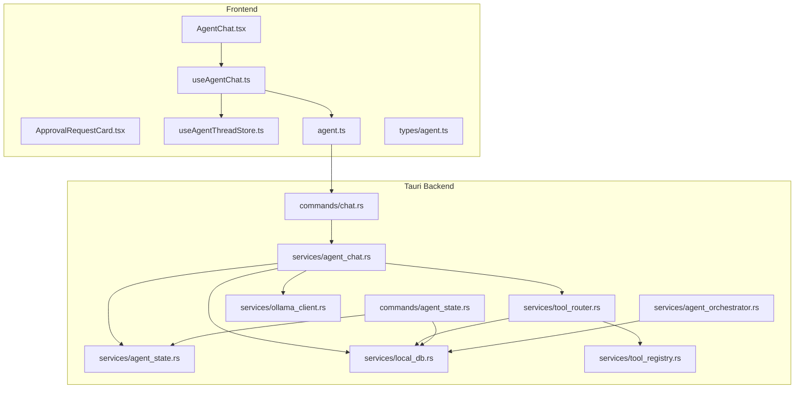
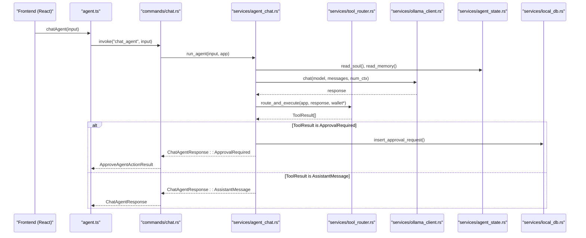
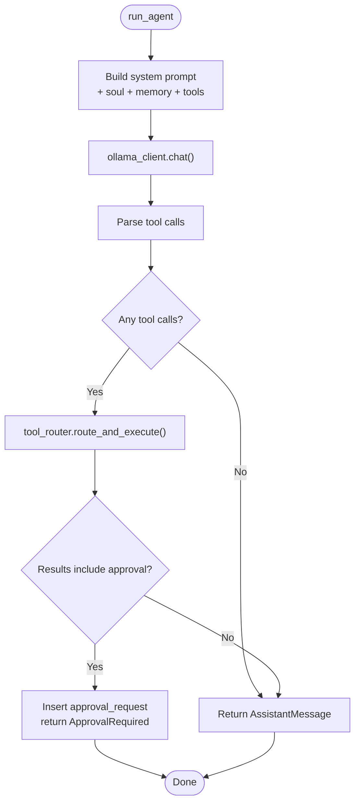
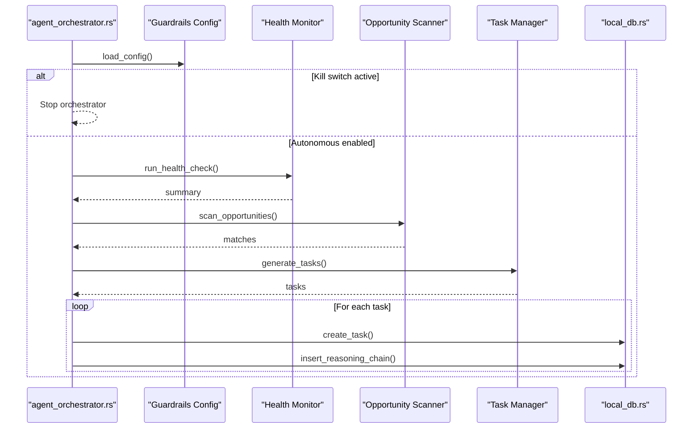
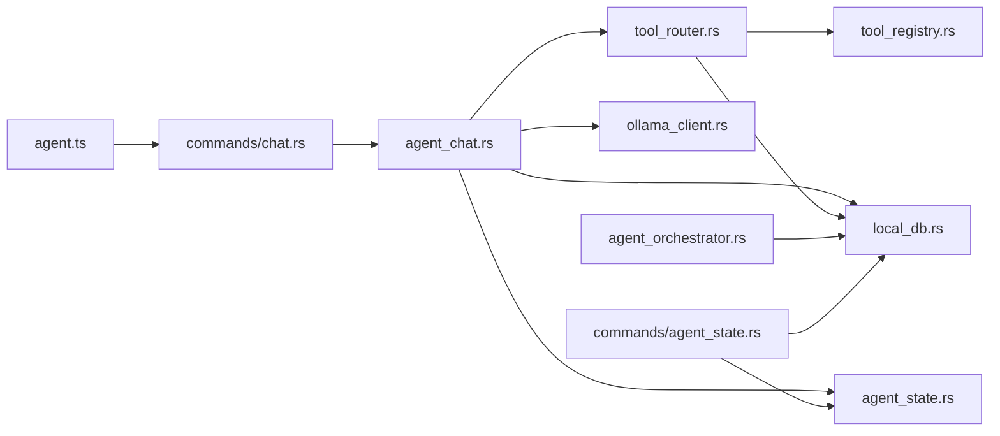

# Agent Services

<cite>
**Referenced Files in This Document**
- [agent_chat.rs](file://src-tauri/src/services/agent_chat.rs)
- [agent_orchestrator.rs](file://src-tauri/src/services/agent_orchestrator.rs)
- [agent_state.rs](file://src-tauri/src/services/agent_state.rs)
- [chat.rs](file://src-tauri/src/commands/chat.rs)
- [agent_state.rs](file://src-tauri/src/commands/agent_state.rs)
- [tool_router.rs](file://src-tauri/src/services/tool_router.rs)
- [tool_registry.rs](file://src-tauri/src/services/tool_registry.rs)
- [ollama_client.rs](file://src-tauri/src/services/ollama_client.rs)
- [local_db.rs](file://src-tauri/src/services/local_db.rs)
- [agent.ts](file://src/lib/agent.ts)
- [useAgentChat.ts](file://src/hooks/useAgentChat.ts)
- [useAgentThreadStore.ts](file://src/store/useAgentThreadStore.ts)
- [AgentChat.tsx](file://src/components/agent/AgentChat.tsx)
- [ApprovalRequestCard.tsx](file://src/components/agent/ApprovalRequestCard.tsx)
- [agent.ts](file://src/types/agent.ts)
</cite>

## Table of Contents
1. [Introduction](#introduction)
2. [Project Structure](#project-structure)
3. [Core Components](#core-components)
4. [Architecture Overview](#architecture-overview)
5. [Detailed Component Analysis](#detailed-component-analysis)
6. [Dependency Analysis](#dependency-analysis)
7. [Performance Considerations](#performance-considerations)
8. [Security and Privacy](#security-and-privacy)
9. [Monitoring and Observability](#monitoring-and-observability)
10. [Troubleshooting Guide](#troubleshooting-guide)
11. [Conclusion](#conclusion)

## Introduction
This document describes Shadow Protocol’s agent services: agent_chat, agent_orchestrator, and agent_state. It explains how chat message handling, conversation persistence, AI interaction patterns, agent lifecycle management, task coordination, workflow orchestration, and state synchronization work together. It also covers method signatures, parameters, return values, error handling, initialization, configuration, frontend integration, approval workflows, execution logging, performance considerations, security implications, and monitoring approaches.

## Project Structure
The agent services span the Tauri backend (Rust) and React frontend (TypeScript/TSX):
- Backend services: agent_chat, agent_orchestrator, agent_state, tool_router, tool_registry, ollama_client, local_db
- Frontend integration: agent.ts (invocation wrappers), useAgentChat.ts (hook), useAgentThreadStore.ts (state), AgentChat.tsx (UI), ApprovalRequestCard.tsx (approval UI)
- Commands: chat.rs and agent_state.rs define Tauri commands that bridge frontend and backend services

**Diagram sources**
- [AgentChat.tsx:1-124](file://src/components/agent/AgentChat.tsx#L1-L124)
- [ApprovalRequestCard.tsx:1-109](file://src/components/agent/ApprovalRequestCard.tsx#L1-L109)
- [useAgentChat.ts:1-97](file://src/hooks/useAgentChat.ts#L1-L97)
- [useAgentThreadStore.ts:1-642](file://src/store/useAgentThreadStore.ts#L1-L642)
- [agent.ts:1-86](file://src/lib/agent.ts#L1-L86)
- [chat.rs:1-609](file://src-tauri/src/commands/chat.rs#L1-L609)
- [agent_state.rs:1-39](file://src-tauri/src/commands/agent_state.rs#L1-L39)
- [agent_chat.rs:1-359](file://src-tauri/src/services/agent_chat.rs#L1-L359)
- [tool_router.rs:1-818](file://src-tauri/src/services/tool_router.rs#L1-L818)
- [ollama_client.rs:1-106](file://src-tauri/src/services/ollama_client.rs#L1-L106)
- [agent_state.rs:1-104](file://src-tauri/src/services/agent_state.rs#L1-L104)
- [local_db.rs:1-2735](file://src-tauri/src/services/local_db.rs#L1-L2735)
- [tool_registry.rs:1-313](file://src-tauri/src/services/tool_registry.rs#L1-L313)
- [agent_orchestrator.rs:1-571](file://src-tauri/src/services/agent_orchestrator.rs#L1-L571)

**Section sources**
- [chat.rs:1-609](file://src-tauri/src/commands/chat.rs#L1-L609)
- [agent_state.rs:1-39](file://src-tauri/src/commands/agent_state.rs#L1-L39)
- [agent_chat.rs:1-359](file://src-tauri/src/services/agent_chat.rs#L1-L359)
- [agent_orchestrator.rs:1-571](file://src-tauri/src/services/agent_orchestrator.rs#L1-L571)
- [agent_state.rs:1-104](file://src-tauri/src/services/agent_state.rs#L1-L104)
- [tool_router.rs:1-818](file://src-tauri/src/services/tool_router.rs#L1-L818)
- [tool_registry.rs:1-313](file://src-tauri/src/services/tool_registry.rs#L1-L313)
- [ollama_client.rs:1-106](file://src-tauri/src/services/ollama_client.rs#L1-L106)
- [local_db.rs:1-2735](file://src-tauri/src/services/local_db.rs#L1-L2735)
- [agent.ts:1-86](file://src/lib/agent.ts#L1-L86)
- [useAgentChat.ts:1-97](file://src/hooks/useAgentChat.ts#L1-L97)
- [useAgentThreadStore.ts:1-642](file://src/store/useAgentThreadStore.ts#L1-L642)
- [AgentChat.tsx:1-124](file://src/components/agent/AgentChat.tsx#L1-L124)
- [ApprovalRequestCard.tsx:1-109](file://src/components/agent/ApprovalRequestCard.tsx#L1-L109)
- [agent.ts:1-184](file://src/types/agent.ts#L1-L184)

## Core Components
- agent_chat: orchestrates chat turns, integrates LLM via Ollama, routes tool calls, manages approvals, and builds response blocks
- agent_orchestrator: autonomous workflow coordinator that runs periodic health checks, scans opportunities, generates tasks, and stores reasoning chains
- agent_state: manages agent persona/soul and memory persistence on disk
- tool_router: parses model tool calls, validates permissions, dispatches to tools, and returns unified results
- local_db: SQLite-backed persistence for approvals, executions, strategies, tasks, reasoning chains, and more
- frontend integration: agent.ts invokes Tauri commands, useAgentChat.ts coordinates UI and state, useAgentThreadStore.ts maintains chat threads and approval state

**Section sources**
- [agent_chat.rs:1-359](file://src-tauri/src/services/agent_chat.rs#L1-L359)
- [agent_orchestrator.rs:1-571](file://src-tauri/src/services/agent_orchestrator.rs#L1-L571)
- [agent_state.rs:1-104](file://src-tauri/src/services/agent_state.rs#L1-L104)
- [tool_router.rs:1-818](file://src-tauri/src/services/tool_router.rs#L1-L818)
- [local_db.rs:1-2735](file://src-tauri/src/services/local_db.rs#L1-L2735)
- [agent.ts:1-86](file://src/lib/agent.ts#L1-L86)
- [useAgentChat.ts:1-97](file://src/hooks/useAgentChat.ts#L1-L97)
- [useAgentThreadStore.ts:1-642](file://src/store/useAgentThreadStore.ts#L1-L642)

## Architecture Overview
The agent_chat service composes a deterministic advice pipeline with a tool loop:
- Build a system prompt enriched with agent soul/memory and tool availability
- Query Ollama for a response
- Parse tool calls from the LLM output
- Route and execute tools via tool_router
- Aggregate results into response blocks and optionally request user approvals
- Persist approvals and executions in local_db

**Diagram sources**
- [chat.rs:302-310](file://src-tauri/src/commands/chat.rs#L302-L310)
- [agent_chat.rs:190-358](file://src-tauri/src/services/agent_chat.rs#L190-L358)
- [tool_router.rs:100-717](file://src-tauri/src/services/tool_router.rs#L100-L717)
- [ollama_client.rs:46-105](file://src-tauri/src/services/ollama_client.rs#L46-L105)
- [agent_state.rs:46-76](file://src-tauri/src/services/agent_state.rs#L46-L76)
- [local_db.rs:117-136](file://src-tauri/src/services/local_db.rs#L117-L136)

## Detailed Component Analysis

### agent_chat Service
Responsibilities:
- Chat message handling and conversation persistence
- AI interaction via Ollama
- Tool routing and execution
- Approval workflow initiation and persistence
- Response block construction

Key types and methods:
- ChatAgentInput: model, messages, optional wallet addresses, num_ctx, structuredFacts, demoMode
- ChatAgentResponse: AssistantMessage, ApprovalRequired, Error
- ResponseBlock: Text, ToolResult
- run_agent(input, app): orchestrates the chat loop, tool execution, and approvals

Processing logic:
- Builds system prompt with tool availability, agent soul, risk appetite, preferred chains, and memory facts
- Calls Ollama chat with bounded context
- Parses tool calls from model output
- Executes tools via tool_router and aggregates results
- If a tool requires approval, persists an approval request and returns ApprovalRequired
- Otherwise returns AssistantMessage with blocks

**Diagram sources**
- [agent_chat.rs:190-358](file://src-tauri/src/services/agent_chat.rs#L190-L358)
- [tool_router.rs:100-717](file://src-tauri/src/services/tool_router.rs#L100-L717)
- [ollama_client.rs:46-105](file://src-tauri/src/services/ollama_client.rs#L46-L105)
- [local_db.rs:117-136](file://src-tauri/src/services/local_db.rs#L117-L136)

Method signatures and parameters:
- run_agent(input: ChatAgentInput, app: AppHandle) -> Result<ChatAgentResponse, String>
- ChatAgentInput fields: model, messages, walletAddress?, walletAddresses?, numCtx?, structuredFacts?, demoMode?
- ChatAgentResponse variants:
  - AssistantMessage { content, blocks }
  - ApprovalRequired { approvalId, toolName, approvalKind, payload, message, expiresAt?, version }
  - Error { message }

Error handling:
- Validates model presence
- Propagates tool execution errors
- Handles approval expiration and version mismatches
- Returns descriptive errors for malformed inputs or unavailable integrations

Integration with frontend:
- Frontend calls agent.ts chatAgent, which maps to Tauri command chat_agent
- useAgentThreadStore builds context, resolves model, and sends messages
- AgentChat.tsx renders assistant messages and approval cards

**Section sources**
- [agent_chat.rs:1-359](file://src-tauri/src/services/agent_chat.rs#L1-L359)
- [chat.rs:302-310](file://src-tauri/src/commands/chat.rs#L302-L310)
- [agent.ts:14-27](file://src/lib/agent.ts#L14-L27)
- [useAgentThreadStore.ts:319-330](file://src/store/useAgentThreadStore.ts#L319-L330)
- [AgentChat.tsx:84-96](file://src/components/agent/AgentChat.tsx#L84-L96)

### agent_orchestrator Service
Responsibilities:
- Autonomous agent lifecycle management
- Periodic health monitoring, opportunity scanning, and task generation
- Workflow orchestration and reasoning chain persistence
- Configuration and runtime state management

Key types and methods:
- OrchestratorState: isRunning, lastCheck, nextCheck, counters, errors
- ReasoningStep and ReasoningChain: decision transparency
- OrchestratorConfig: intervals, limits, and autonomous flag
- start_orchestrator(), stop_orchestrator(), get_state(), update_config()
- run_orchestrator_loop(): main scheduling loop
- run_health_check_cycle(), run_opportunity_scan_cycle(), run_task_generation_cycle()
- store_reasoning_chain(), get_reasoning_chain()
- analyze_now(): on-demand analysis

Processing logic:
- Enforces guardrails kill switch and autonomous mode flag
- Runs cycles at configured intervals
- Generates tasks, persists them, and records reasoning chains
- Tracks state and errors for observability

**Diagram sources**
- [agent_orchestrator.rs:92-231](file://src-tauri/src/services/agent_orchestrator.rs#L92-L231)
- [agent_orchestrator.rs:233-390](file://src-tauri/src/services/agent_orchestrator.rs#L233-L390)
- [local_db.rs:298-414](file://src-tauri/src/services/local_db.rs#L298-L414)

Method signatures and parameters:
- start_orchestrator() -> Result<(), String>
- stop_orchestrator() -> Result<(), String>
- get_state() -> OrchestratorState
- update_config(config: OrchestratorConfig) -> Result<(), String>
- run_health_check_cycle() -> Result<(), String>
- run_opportunity_scan_cycle() -> Result<u32, String>
- run_task_generation_cycle() -> Result<u32, String>
- get_reasoning_chain(task_id: &str) -> Result<Option<ReasoningChain>, String>
- analyze_now() -> Result<AnalysisResult, String>

Configuration options:
- check_interval_secs, health_check_interval_secs, opportunity_scan_interval_secs
- task_expiry_secs, max_pending_tasks, enable_autonomous

**Section sources**
- [agent_orchestrator.rs:1-571](file://src-tauri/src/services/agent_orchestrator.rs#L1-L571)
- [local_db.rs:298-414](file://src-tauri/src/services/local_db.rs#L298-L414)

### agent_state Service
Responsibilities:
- Manage agent soul (risk appetite, preferred chains, persona, custom rules)
- Manage agent memory (facts with timestamps)
- Persist state to app data directory

Key types and methods:
- AgentSoul: risk_appetite, preferred_chains, persona, custom_rules
- AgentMemory: facts array
- read_soul(app), write_soul(app, soul)
- read_memory(app), write_memory(app, memory)
- add_memory_fact(app, fact), remove_memory_fact(app, id)

Persistence:
- Uses app data directory path resolution
- Serializes/deserializes JSON with pretty formatting
- Creates directories if missing

**Section sources**
- [agent_state.rs:1-104](file://src-tauri/src/services/agent_state.rs#L1-L104)

### tool_router Service
Responsibilities:
- Parse tool calls from model output
- Validate app gate and permissions
- Dispatch to tools and return unified ToolResult variants
- Build dynamic system prompts with tool availability and app context

Key types and methods:
- ToolCall: name, parameters
- ToolResult: AssistantMessage, ToolOutput, ApprovalRequired, Error
- parse_tool_calls(text): extracts JSON tool call objects
- route_and_execute(app, model_output, wallet*, wallet_addresses*): executes tools
- tools_system_prompt(ctx): constructs tool availability prompt
- AgentContext: wallet counts and addresses

Execution modes:
- ReadAuto: immediate read-only execution
- ApprovalRequired: requires user approval before write execution

**Section sources**
- [tool_router.rs:1-818](file://src-tauri/src/services/tool_router.rs#L1-L818)
- [tool_registry.rs:1-313](file://src-tauri/src/services/tool_registry.rs#L1-L313)

### Frontend Integration
Frontend components and hooks:
- agent.ts: wraps Tauri commands for chat and state
- useAgentChat.ts: manages pending approvals, approval actions, and follow-ups
- useAgentThreadStore.ts: maintains threads, rolling summaries, structured facts, and streaming state
- AgentChat.tsx: renders chat UI and handles user input
- ApprovalRequestCard.tsx: renders approval UI for swaps and strategies

Approval workflow:
- When agent_chat returns ApprovalRequired, store persists the approval and UI displays ApprovalRequestCard
- User approves or rejects via useAgentChat hook
- approve_agent_action updates approval status and creates a tool execution record

**Section sources**
- [agent.ts:1-86](file://src/lib/agent.ts#L1-L86)
- [useAgentChat.ts:1-97](file://src/hooks/useAgentChat.ts#L1-L97)
- [useAgentThreadStore.ts:1-642](file://src/store/useAgentThreadStore.ts#L1-L642)
- [AgentChat.tsx:1-124](file://src/components/agent/AgentChat.tsx#L1-L124)
- [ApprovalRequestCard.tsx:1-109](file://src/components/agent/ApprovalRequestCard.tsx#L1-L109)
- [chat.rs:345-408](file://src-tauri/src/commands/chat.rs#L345-L408)

## Dependency Analysis
High-level dependencies:
- agent_chat depends on tool_router, ollama_client, agent_state, and local_db
- tool_router depends on tool_registry, apps state, and local_db
- agent_orchestrator depends on guardrails, health_monitor, opportunity_scanner, task_manager, and local_db
- Frontend depends on agent.ts commands, which call into backend services

**Diagram sources**
- [agent_chat.rs:1-359](file://src-tauri/src/services/agent_chat.rs#L1-L359)
- [tool_router.rs:1-818](file://src-tauri/src/services/tool_router.rs#L1-L818)
- [ollama_client.rs:1-106](file://src-tauri/src/services/ollama_client.rs#L1-L106)
- [agent_state.rs:1-104](file://src-tauri/src/services/agent_state.rs#L1-L104)
- [local_db.rs:1-2735](file://src-tauri/src/services/local_db.rs#L1-L2735)
- [tool_registry.rs:1-313](file://src-tauri/src/services/tool_registry.rs#L1-L313)
- [agent_orchestrator.rs:1-571](file://src-tauri/src/services/agent_orchestrator.rs#L1-L571)
- [agent.ts:1-86](file://src/lib/agent.ts#L1-L86)
- [chat.rs:1-609](file://src-tauri/src/commands/chat.rs#L1-L609)
- [agent_state.rs:1-39](file://src-tauri/src/commands/agent_state.rs#L1-L39)

**Section sources**
- [agent_chat.rs:1-359](file://src-tauri/src/services/agent_chat.rs#L1-L359)
- [tool_router.rs:1-818](file://src-tauri/src/services/tool_router.rs#L1-L818)
- [agent_orchestrator.rs:1-571](file://src-tauri/src/services/agent_orchestrator.rs#L1-L571)
- [agent.ts:1-86](file://src/lib/agent.ts#L1-L86)

## Performance Considerations
- Context window: num_ctx controls Ollama context length; useAgentThreadStore computes and applies a context budget
- Loop limits: agent_chat enforces a maximum tool round limit to prevent runaway loops
- Async concurrency: agent_chat spawns background tasks (e.g., Filecoin backup) without blocking the main loop
- Database writes: approvals and executions are persisted via local_db; batching or indexing can improve throughput
- Model latency: Ollama host is configurable; ensure low-latency access for responsive UI

[No sources needed since this section provides general guidance]

## Security and Privacy
- Approval-required tools: agent_chat routes sensitive actions (swaps, strategy creation, protocol-specific actions) to approval workflow
- Permission gating: tool_router ensures required app integrations and permissions are present before execution
- Data retention: approvals, executions, and reasoning chains are persisted; consider purging policies for sensitive data
- Authentication: Ollama client respects bearer tokens from settings when provided

**Section sources**
- [tool_router.rs:79-91](file://src-tauri/src/services/tool_router.rs#L79-L91)
- [agent_chat.rs:296-335](file://src-tauri/src/services/agent_chat.rs#L296-L335)
- [ollama_client.rs:70-74](file://src-tauri/src/services/ollama_client.rs#L70-L74)

## Monitoring and Observability
- Audit logs: commands and approvals emit audit events
- Execution logs: tool_executions table captures request/result/error details
- Reasoning chains: agent_orchestrator persists reasoning chains for transparency
- Guardrails: violations tracked in guardrail_violations
- Orchestrator state: counters and errors exposed for runtime visibility

**Section sources**
- [chat.rs:597-608](file://src-tauri/src/commands/chat.rs#L597-L608)
- [local_db.rs:169-178](file://src-tauri/src/services/local_db.rs#L169-L178)
- [local_db.rs:137-150](file://src-tauri/src/services/local_db.rs#L137-L150)
- [local_db.rs:401-416](file://src-tauri/src/services/local_db.rs#L401-L416)
- [local_db.rs:365-382](file://src-tauri/src/services/local_db.rs#L365-L382)
- [agent_orchestrator.rs:137-140](file://src-tauri/src/services/agent_orchestrator.rs#L137-L140)

## Troubleshooting Guide
Common issues and resolutions:
- Model not selected: frontend requires a model selection before sending messages; the hook opens setup modal when missing
- Approval conflicts: version mismatches or expired approvals cause errors during approve/reject; re-check pending approvals
- Tool not available: ensure required app integrations are installed/enabled and permissions granted
- Database initialization: local_db.init must be called before use; schema migration runs on first connection
- Ollama connectivity: verify host/port and bearer token settings; handle non-success responses

**Section sources**
- [useAgentThreadStore.ts:244-274](file://src/store/useAgentThreadStore.ts#L244-L274)
- [chat.rs:360-371](file://src-tauri/src/commands/chat.rs#L360-L371)
- [tool_router.rs:79-91](file://src-tauri/src/services/tool_router.rs#L79-L91)
- [local_db.rs:438-448](file://src-tauri/src/services/local_db.rs#L438-L448)
- [ollama_client.rs:81-92](file://src-tauri/src/services/ollama_client.rs#L81-L92)

## Conclusion
Shadow Protocol’s agent services provide a robust, extensible framework for conversational DeFi assistance. The agent_chat service integrates LLMs with a deterministic tool loop and approval workflows, while agent_orchestrator manages autonomous operations and transparency via reasoning chains. agent_state persists agent personality and memory. Together with frontend integration and comprehensive persistence, these services support secure, observable, and user-controlled agent interactions.