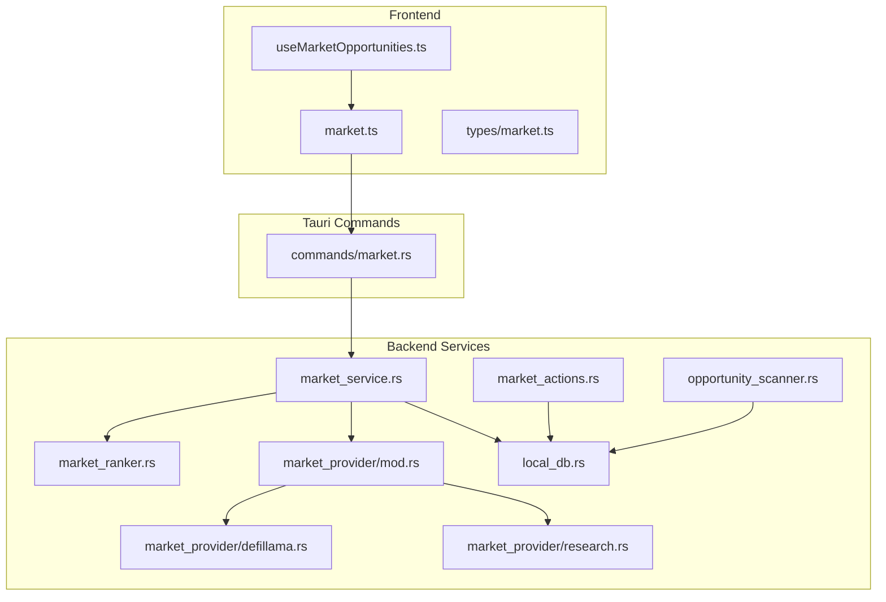
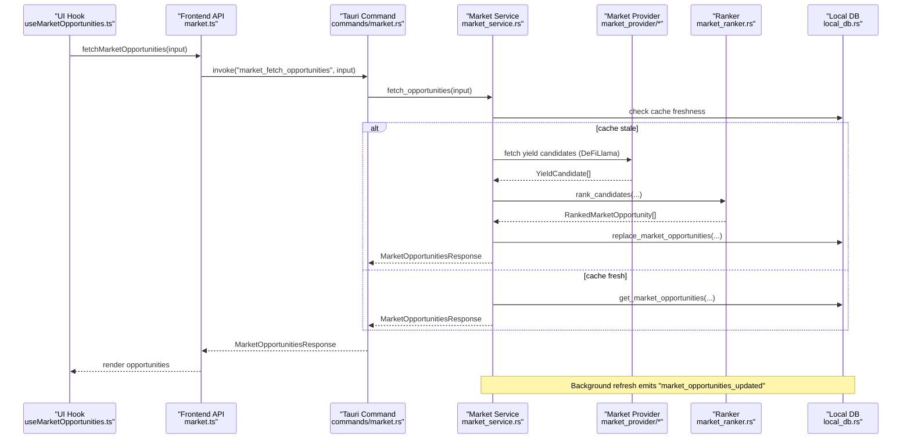
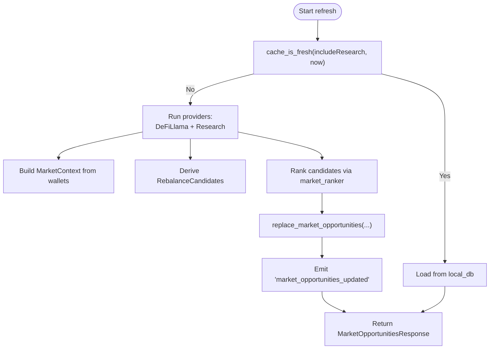
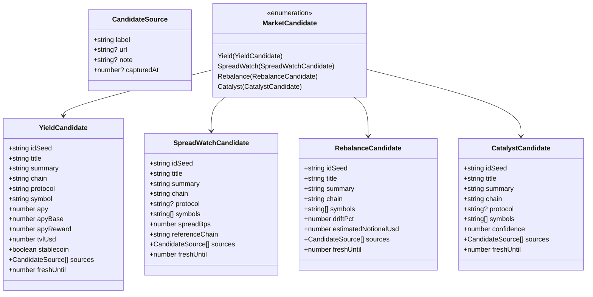
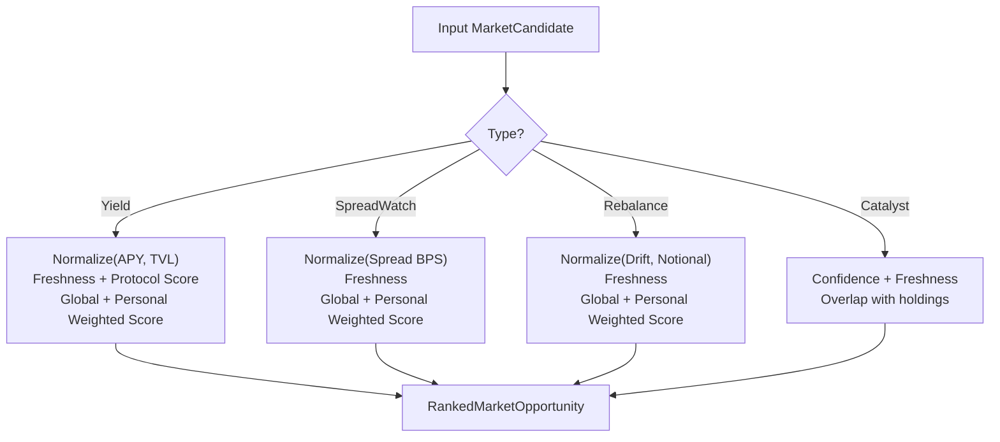
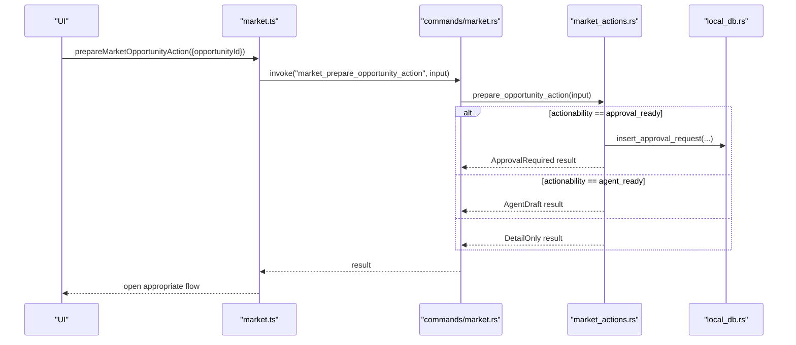
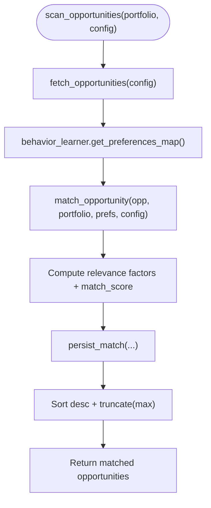
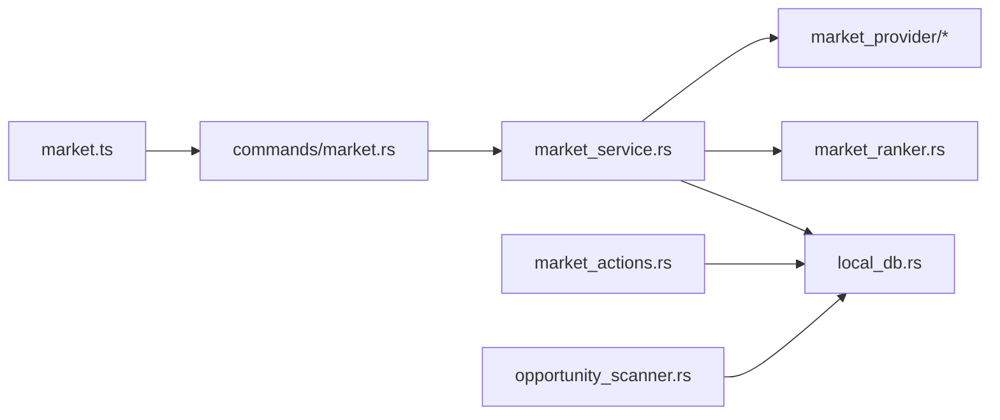

# Market Data Services

<cite>
**Referenced Files in This Document**
- [market_service.rs](file://src-tauri/src/services/market_service.rs)
- [market_provider/mod.rs](file://src-tauri/src/services/market_provider/mod.rs)
- [market_provider/defillama.rs](file://src-tauri/src/services/market_provider/defillama.rs)
- [market_provider/research.rs](file://src-tauri/src/services/market_provider/research.rs)
- [market_ranker.rs](file://src-tauri/src/services/market_ranker.rs)
- [market_actions.rs](file://src-tauri/src/services/market_actions.rs)
- [opportunity_scanner.rs](file://src-tauri/src/services/opportunity_scanner.rs)
- [local_db.rs](file://src-tauri/src/services/local_db.rs)
- [market.ts](file://src/lib/market.ts)
- [useMarketOpportunities.ts](file://src/hooks/useMarketOpportunities.ts)
- [market.ts (types)](file://src/types/market.ts)
- [commands/market.rs](file://src-tauri/src/commands/market.rs)
- [services/mod.rs](file://src-tauri/src/services/mod.rs)
</cite>

## Table of Contents
1. [Introduction](#introduction)
2. [Project Structure](#project-structure)
3. [Core Components](#core-components)
4. [Architecture Overview](#architecture-overview)
5. [Detailed Component Analysis](#detailed-component-analysis)
6. [Dependency Analysis](#dependency-analysis)
7. [Performance Considerations](#performance-considerations)
8. [Troubleshooting Guide](#troubleshooting-guide)
9. [Conclusion](#conclusion)
10. [Appendices](#appendices)

## Introduction
This document describes Shadow Protocol’s market data services: how market data is aggregated, normalized, ranked, and surfaced as actionable opportunities. It covers:
- Market service orchestration and caching
- Market provider integrations (DeFi data sources and research synthesis)
- Ranking algorithms and scoring
- Action preparation and guardrails
- Opportunity scanning and filtering
- Frontend integration patterns and data models
- Data freshness, reliability, and performance strategies

## Project Structure
The market data stack spans Rust backend services and TypeScript frontend bindings:
- Backend services under src-tauri/src/services implement market ingestion, ranking, caching, and action preparation.
- Frontend hooks and libraries expose typed APIs for fetching opportunities, refreshing data, and preparing actions.



**Diagram sources**
- [services/mod.rs:1-37](file://src-tauri/src/services/mod.rs#L1-L37)
- [market.ts:1-135](file://src/lib/market.ts#L1-L135)
- [useMarketOpportunities.ts:1-131](file://src/hooks/useMarketOpportunities.ts#L1-L131)
- [market.ts (types):1-134](file://src/types/market.ts#L1-L134)
- [commands/market.rs:1-36](file://src-tauri/src/commands/market.rs#L1-L36)
- [market_service.rs:1-745](file://src-tauri/src/services/market_service.rs#L1-L745)
- [market_ranker.rs:1-559](file://src-tauri/src/services/market_ranker.rs#L1-L559)
- [market_provider/mod.rs:1-160](file://src-tauri/src/services/market_provider/mod.rs#L1-L160)
- [market_provider/defillama.rs:1-151](file://src-tauri/src/services/market_provider/defillama.rs#L1-L151)
- [market_provider/research.rs:1-112](file://src-tauri/src/services/market_provider/research.rs#L1-L112)
- [market_actions.rs:1-141](file://src-tauri/src/services/market_actions.rs#L1-L141)
- [opportunity_scanner.rs:1-599](file://src-tauri/src/services/opportunity_scanner.rs#L1-L599)
- [local_db.rs:180-379](file://src-tauri/src/services/local_db.rs#L180-L379)

**Section sources**
- [services/mod.rs:1-37](file://src-tauri/src/services/mod.rs#L1-L37)
- [market.ts:1-135](file://src/lib/market.ts#L1-L135)
- [useMarketOpportunities.ts:1-131](file://src/hooks/useMarketOpportunities.ts#L1-L131)
- [market.ts (types):1-134](file://src/types/market.ts#L1-L134)
- [commands/market.rs:1-36](file://src-tauri/src/commands/market.rs#L1-L36)

## Core Components
- Market service orchestrates data ingestion, caching, and emission of opportunities to the UI.
- Market provider integrates DeFi yield data and research synthesis into unified candidate sets.
- Market ranker applies scoring and risk/rule heuristics to produce ranked opportunities.
- Market actions prepares guardrails-aware actions (approval or agent drafts).
- Opportunity scanner filters and scores generic opportunities against user preferences and portfolio context.
- Local DB persists opportunities, provider runs, and related artifacts.

**Section sources**
- [market_service.rs:189-365](file://src-tauri/src/services/market_service.rs#L189-L365)
- [market_provider/mod.rs:62-82](file://src-tauri/src/services/market_provider/mod.rs#L62-L82)
- [market_ranker.rs:17-48](file://src-tauri/src/services/market_ranker.rs#L17-L48)
- [market_actions.rs:8-36](file://src-tauri/src/services/market_actions.rs#L8-L36)
- [opportunity_scanner.rs:125-161](file://src-tauri/src/services/opportunity_scanner.rs#L125-L161)
- [local_db.rs:180-220](file://src-tauri/src/services/local_db.rs#L180-L220)

## Architecture Overview
End-to-end flow from data sources to UI:



**Diagram sources**
- [useMarketOpportunities.ts:39-62](file://src/hooks/useMarketOpportunities.ts#L39-L62)
- [market.ts:16-28](file://src/lib/market.ts#L16-L28)
- [commands/market.rs:8-13](file://src-tauri/src/commands/market.rs#L8-L13)
- [market_service.rs:220-261](file://src-tauri/src/services/market_service.rs#L220-L261)
- [market_provider/defillama.rs:27-116](file://src-tauri/src/services/market_provider/defillama.rs#L27-L116)
- [market_ranker.rs:17-35](file://src-tauri/src/services/market_ranker.rs#L17-L35)
- [local_db.rs:180-220](file://src-tauri/src/services/local_db.rs#L180-L220)

## Detailed Component Analysis

### Market Service
Responsibilities:
- Periodic refresh and caching of opportunities
- Portfolio-aware rebalance derivation
- Research provider integration
- Emission of UI events and fallback to cached data on errors

Key behaviors:
- Automatic refresh every 15 minutes; research included every fourth cycle
- Freshness checks per provider and combined cache staleness
- Portfolio context building from local tokens
- Rebalance candidates derived from stablecoin and chain concentration thresholds
- Detailed parsing and serialization of stored opportunity payloads



**Diagram sources**
- [market_service.rs:263-365](file://src-tauri/src/services/market_service.rs#L263-L365)
- [market_service.rs:561-593](file://src-tauri/src/services/market_service.rs#L561-L593)
- [market_service.rs:462-529](file://src-tauri/src/services/market_service.rs#L462-L529)
- [market_ranker.rs:17-35](file://src-tauri/src/services/market_ranker.rs#L17-L35)
- [local_db.rs:180-220](file://src-tauri/src/services/local_db.rs#L180-L220)

**Section sources**
- [market_service.rs:189-218](file://src-tauri/src/services/market_service.rs#L189-L218)
- [market_service.rs:220-261](file://src-tauri/src/services/market_service.rs#L220-L261)
- [market_service.rs:263-365](file://src-tauri/src/services/market_service.rs#L263-L365)
- [market_service.rs:430-460](file://src-tauri/src/services/market_service.rs#L430-L460)
- [market_service.rs:462-529](file://src-tauri/src/services/market_service.rs#L462-L529)
- [market_service.rs:561-593](file://src-tauri/src/services/market_service.rs#L561-L593)
- [market_service.rs:626-694](file://src-tauri/src/services/market_service.rs#L626-L694)

### Market Provider Module
Defines candidate types and derivation logic:
- YieldCandidate: APY, TVL, protocol, chain, symbol, stability flag
- SpreadWatchCandidate: cross-chain spread detection from yield deltas
- RebalanceCandidate: derived from portfolio concentration
- CatalystCandidate: research-derived signals



**Diagram sources**
- [market_provider/mod.rs:6-82](file://src-tauri/src/services/market_provider/mod.rs#L6-L82)

**Section sources**
- [market_provider/mod.rs:84-143](file://src-tauri/src/services/market_provider/mod.rs#L84-L143)

#### DeFiLlama Integration
- Fetches yield pools, normalizes chain/symbol/protocol, filters by APY and TVL thresholds, and sorts by hybrid score.

**Section sources**
- [market_provider/defillama.rs:27-116](file://src-tauri/src/services/market_provider/defillama.rs#L27-L116)

#### Research Provider Integration
- Synthesizes research via a structured prompt to Sonar client, normalizes chains and symbols, and produces catalyst candidates.

**Section sources**
- [market_provider/research.rs:23-83](file://src-tauri/src/services/market_provider/research.rs#L23-L83)

### Market Ranker Service
- Scores each candidate type using weighted criteria and personalization:
  - Yield: APY, TVL, protocol safety, freshness
  - Spread Watch: spread magnitude, freshness
  - Rebalance: drift severity, notional size, freshness
  - Catalyst: confidence, freshness
- Produces a compact detail payload with breakdown and guardrail notes.



**Diagram sources**
- [market_ranker.rs:17-48](file://src-tauri/src/services/market_ranker.rs#L17-L48)
- [market_ranker.rs:50-187](file://src-tauri/src/services/market_ranker.rs#L50-L187)
- [market_ranker.rs:189-294](file://src-tauri/src/services/market_ranker.rs#L189-L294)
- [market_ranker.rs:296-405](file://src-tauri/src/services/market_ranker.rs#L296-L405)
- [market_ranker.rs:407-493](file://src-tauri/src/services/market_ranker.rs#L407-L493)

**Section sources**
- [market_ranker.rs:17-48](file://src-tauri/src/services/market_ranker.rs#L17-L48)
- [market_ranker.rs:50-187](file://src-tauri/src/services/market_ranker.rs#L50-L187)
- [market_ranker.rs:189-294](file://src-tauri/src/services/market_ranker.rs#L189-L294)
- [market_ranker.rs:296-405](file://src-tauri/src/services/market_ranker.rs#L296-L405)
- [market_ranker.rs:407-493](file://src-tauri/src/services/market_ranker.rs#L407-L493)

### Market Actions Service
- Prepares actions based on opportunity actionability:
  - approval_ready → creates an approval request persisted to DB and returns approval payload
  - agent_ready → returns agent draft prompt
  - otherwise → detail-only



**Diagram sources**
- [market_actions.rs:8-36](file://src-tauri/src/services/market_actions.rs#L8-L36)
- [market_actions.rs:38-118](file://src-tauri/src/services/market_actions.rs#L38-L118)
- [market.ts:50-59](file://src/lib/market.ts#L50-L59)
- [commands/market.rs:30-35](file://src-tauri/src/commands/market.rs#L30-L35)
- [local_db.rs:117-132](file://src-tauri/src/services/local_db.rs#L117-L132)

**Section sources**
- [market_actions.rs:8-36](file://src-tauri/src/services/market_actions.rs#L8-L36)
- [market_actions.rs:38-118](file://src-tauri/src/services/market_actions.rs#L38-L118)

### Opportunity Scanner Service
- Scans for generic DeFi opportunities across chains and protocols
- Matches opportunities against user preferences and portfolio context
- Persists matches and exposes recent matches



**Diagram sources**
- [opportunity_scanner.rs:125-161](file://src-tauri/src/services/opportunity_scanner.rs#L125-L161)
- [opportunity_scanner.rs:334-407](file://src-tauri/src/services/opportunity_scanner.rs#L334-L407)
- [opportunity_scanner.rs:510-534](file://src-tauri/src/services/opportunity_scanner.rs#L510-L534)

**Section sources**
- [opportunity_scanner.rs:125-161](file://src-tauri/src/services/opportunity_scanner.rs#L125-L161)
- [opportunity_scanner.rs:163-202](file://src-tauri/src/services/opportunity_scanner.rs#L163-L202)
- [opportunity_scanner.rs:334-407](file://src-tauri/src/services/opportunity_scanner.rs#L334-L407)
- [opportunity_scanner.rs:510-534](file://src-tauri/src/services/opportunity_scanner.rs#L510-L534)

### Data Models and API Endpoints
Frontend types and backend commands define the surface area:

- Types (frontend):
  - MarketOpportunity, MarketOpportunitiesResponse, MarketOpportunityDetail, MarketPrepareOpportunityActionResult, MarketRefreshResult, MarketFetchInput, MarketRefreshInput
- Backend commands:
  - market_fetch_opportunities
  - market_refresh_opportunities
  - market_get_opportunity_detail
  - market_prepare_opportunity_action

```mermaid
erDiagram
MARKET_OPPORTUNITIES {
string id PK
string fingerprint
string title
string summary
string category
string chain
string protocol
string symbols_json
string risk
float confidence
float score
string actionability
string metrics_json
string portfolio_fit_json
string primary_action_json
string details_json
string sources_json
int stale
int fresh_until
int first_seen_at
int last_seen_at
int expires_at
}
MARKET_PROVIDER_RUNS {
string id PK
string provider
string status
int items_seen
string error_summary
int started_at
int completed_at
}
APPROVAL_REQUESTS {
string id PK
string source
string tool_name
string kind
string status
string payload_json
string? simulation_json
string? policy_json
string message
int? expires_at
int version
string? strategy_id
int created_at
int updated_at
}
```

**Diagram sources**
- [local_db.rs:180-220](file://src-tauri/src/services/local_db.rs#L180-L220)
- [local_db.rs:209-217](file://src-tauri/src/services/local_db.rs#L209-L217)
- [local_db.rs:117-132](file://src-tauri/src/services/local_db.rs#L117-L132)

**Section sources**
- [market.ts (types):1-134](file://src/types/market.ts#L1-L134)
- [commands/market.rs:8-35](file://src-tauri/src/commands/market.rs#L8-L35)

## Dependency Analysis
- market_service depends on:
  - market_provider (DeFiLlama and research)
  - market_ranker
  - local_db (caching and persistence)
  - tauri events for UI updates
- market_actions depends on:
  - market_service cached opportunities
  - local_db for approvals
  - audit logging
- opportunity_scanner depends on:
  - local_db for persisted matches
  - behavior_learner preferences



**Diagram sources**
- [market_service.rs:7-10](file://src-tauri/src/services/market_service.rs#L7-L10)
- [market_actions.rs:1-6](file://src-tauri/src/services/market_actions.rs#L1-L6)
- [opportunity_scanner.rs:10-11](file://src-tauri/src/services/opportunity_scanner.rs#L10-L11)
- [market.ts:1-14](file://src/lib/market.ts#L1-L14)
- [commands/market.rs:1-6](file://src-tauri/src/commands/market.rs#L1-L6)

**Section sources**
- [market_service.rs:7-10](file://src-tauri/src/services/market_service.rs#L7-L10)
- [market_actions.rs:1-6](file://src-tauri/src/services/market_actions.rs#L1-L6)
- [opportunity_scanner.rs:10-11](file://src-tauri/src/services/opportunity_scanner.rs#L10-L11)
- [market.ts:1-14](file://src/lib/market.ts#L1-L14)
- [commands/market.rs:1-6](file://src-tauri/src/commands/market.rs#L1-L6)

## Performance Considerations
- Caching and freshness:
  - Market refresh interval is 15 minutes; research refresh is hourly. The service checks provider runs and completion timestamps to avoid redundant fetches.
- Data normalization:
  - Symbol and chain normalization reduces duplication and improves matching.
- Ranking truncation:
  - Top candidates are truncated to a fixed limit to bound downstream rendering costs.
- Event-driven UI updates:
  - Frontend listens for “market_opportunities_updated” to invalidate queries and re-render efficiently.
- Network timeouts:
  - HTTP client timeout configured for DeFiLlama fetch to prevent stalls.

Recommendations:
- Monitor provider run statuses and error summaries to detect partial failures.
- Consider parallelizing provider fetches if more sources are added.
- Tune truncation thresholds and freshness windows based on latency SLAs.

**Section sources**
- [market_service.rs:12-16](file://src-tauri/src/services/market_service.rs#L12-L16)
- [market_service.rs:561-593](file://src-tauri/src/services/market_service.rs#L561-L593)
- [market_provider/defillama.rs:27-46](file://src-tauri/src/services/market_provider/defillama.rs#L27-L46)
- [market_ranker.rs:32-34](file://src-tauri/src/services/market_ranker.rs#L32-L34)
- [useMarketOpportunities.ts:64-92](file://src/hooks/useMarketOpportunities.ts#L64-L92)

## Troubleshooting Guide
Common issues and mitigations:
- No opportunities returned:
  - Verify wallet addresses are properly formatted and synced; the service sanitizes inputs and requires checksum addresses.
  - Check provider run records for failures and error summaries.
- Stale opportunities:
  - Trigger a forced refresh; the service will emit a refresh failed event with a cached fallback when appropriate.
- Action not available:
  - Check opportunity.actionability and primaryAction.enabled; some opportunities are research-only or require approval gating.

Operational checks:
- Inspect latest provider runs and statuses in local_db.
- Confirm UI listeners are bound and React Query invalidation occurs on events.

**Section sources**
- [market_service.rs:421-428](file://src-tauri/src/services/market_service.rs#L421-L428)
- [market_service.rs:601-624](file://src-tauri/src/services/market_service.rs#L601-L624)
- [market_actions.rs:16-24](file://src-tauri/src/services/market_actions.rs#L16-L24)
- [local_db.rs:209-217](file://src-tauri/src/services/local_db.rs#L209-L217)
- [useMarketOpportunities.ts:64-92](file://src/hooks/useMarketOpportunities.ts#L64-L92)

## Conclusion
Shadow Protocol’s market data services form a robust pipeline from DeFi yield and research synthesis to personalized, ranked opportunities with guardrails-aware actions. The modular design enables incremental improvements to providers, ranking, and UI integration while maintaining strong caching and reliability guarantees.

## Appendices

### Frontend Integration Examples
- Fetch opportunities with filters and wallet context
- Refresh opportunities on demand
- Prepare actions for approval or agent drafting
- Listen for real-time updates and stale warnings

**Section sources**
- [market.ts:16-59](file://src/lib/market.ts#L16-L59)
- [useMarketOpportunities.ts:39-109](file://src/hooks/useMarketOpportunities.ts#L39-L109)
- [market.ts (types):40-134](file://src/types/market.ts#L40-L134)