# Portfolio & Wallet Services

<cite>
**Referenced Files in This Document**
- [portfolio_service.rs](file://src-tauri/src/services/portfolio_service.rs)
- [wallet_sync.rs](file://src-tauri/src/services/wallet_sync.rs)
- [chain.rs](file://src-tauri/src/services/chain.rs)
- [anonymizer.rs](file://src-tauri/src/services/anonymizer.rs)
- [portfolio.rs](file://src-tauri/src/commands/portfolio.rs)
- [wallet_sync.rs](file://src-tauri/src/commands/wallet_sync.rs)
- [local_db.rs](file://src-tauri/src/services/local_db.rs)
- [portfolio_tools.rs](file://src-tauri/src/services/tools/portfolio_tools.rs)
- [settings.rs](file://src-tauri/src/services/settings.rs)
- [lib.rs](file://src-tauri/src/lib.rs)
- [flow.rs](file://src-tauri/src/services/apps/flow.rs)
- [state.rs](file://src-tauri/src/services/apps/state.rs)
</cite>

## Table of Contents
1. [Introduction](#introduction)
2. [Project Structure](#project-structure)
3. [Core Components](#core-components)
4. [Architecture Overview](#architecture-overview)
5. [Detailed Component Analysis](#detailed-component-analysis)
6. [Dependency Analysis](#dependency-analysis)
7. [Performance Considerations](#performance-considerations)
8. [Troubleshooting Guide](#troubleshooting-guide)
9. [Conclusion](#conclusion)

## Introduction
This document explains Shadow Protocol’s portfolio and wallet services with a focus on:
- Portfolio service: multi-chain asset discovery, balance normalization, and analytics aggregation
- Wallet sync: background synchronization of tokens, NFTs, and transactions with state reconciliation
- Chain service: mapping between chain identifiers and network names for unified display and navigation
- Anonymizer service: privacy-preserving sanitization of portfolio data for external AI processing
- Integration patterns with external providers (Alchemy, Flow sidecar)
- Security, performance, and error handling strategies

## Project Structure
The portfolio and wallet services live in the Tauri backend under src-tauri. They expose Tauri commands consumed by the frontend and integrate with a local SQLite database for persistence.

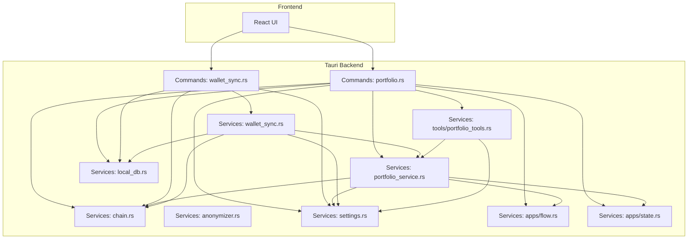

**Diagram sources**
- [portfolio.rs:1-406](file://src-tauri/src/commands/portfolio.rs#L1-L406)
- [wallet_sync.rs:1-90](file://src-tauri/src/commands/wallet_sync.rs#L1-L90)
- [portfolio_service.rs:1-498](file://src-tauri/src/services/portfolio_service.rs#L1-L498)
- [wallet_sync.rs:1-453](file://src-tauri/src/services/wallet_sync.rs#L1-L453)
- [chain.rs:1-90](file://src-tauri/src/services/chain.rs#L1-L90)
- [anonymizer.rs:1-56](file://src-tauri/src/services/anonymizer.rs#L1-L56)
- [portfolio_tools.rs:1-220](file://src-tauri/src/services/tools/portfolio_tools.rs#L1-L220)
- [settings.rs:1-243](file://src-tauri/src/services/settings.rs#L1-L243)
- [local_db.rs:1-800](file://src-tauri/src/services/local_db.rs#L1-L800)
- [flow.rs:1-119](file://src-tauri/src/services/apps/flow.rs#L1-L119)
- [state.rs:1-458](file://src-tauri/src/services/apps/state.rs#L1-L458)

**Section sources**
- [lib.rs:34-199](file://src-tauri/src/lib.rs#L34-L199)
- [portfolio.rs:1-406](file://src-tauri/src/commands/portfolio.rs#L1-L406)
- [wallet_sync.rs:1-90](file://src-tauri/src/commands/wallet_sync.rs#L1-L90)
- [local_db.rs:10-800](file://src-tauri/src/services/local_db.rs#L10-L800)

## Core Components
- Portfolio service: fetches multi-chain balances, normalizes raw balances, enriches with prices, and merges Flow native balances via a sidecar
- Wallet sync: orchestrates background sync of tokens, NFTs, and transactions; emits progress events; persists to local DB; triggers downstream analytics
- Chain service: maps chain codes to display names and explorers; normalizes network identifiers
- Anonymizer service: converts exact portfolio values into categories and percentages for privacy
- Tools: higher-level aggregations and price lookups for UI and agent workflows
- Settings: secure API key management and environment fallback
- Local DB: schema for tokens, NFTs, transactions, snapshots, and auxiliary tables

**Section sources**
- [portfolio_service.rs:1-498](file://src-tauri/src/services/portfolio_service.rs#L1-L498)
- [wallet_sync.rs:1-453](file://src-tauri/src/services/wallet_sync.rs#L1-L453)
- [chain.rs:1-90](file://src-tauri/src/services/chain.rs#L1-L90)
- [anonymizer.rs:1-56](file://src-tauri/src/services/anonymizer.rs#L1-L56)
- [portfolio_tools.rs:1-220](file://src-tauri/src/services/tools/portfolio_tools.rs#L1-L220)
- [settings.rs:1-243](file://src-tauri/src/services/settings.rs#L1-L243)
- [local_db.rs:10-800](file://src-tauri/src/services/local_db.rs#L10-L800)

## Architecture Overview
The system separates concerns across commands, services, and persistence:
- Commands expose typed Tauri handlers for UI and agent consumption
- Services encapsulate provider integrations, data modeling, and privacy logic
- Local DB provides fast reads and historical snapshots
- Settings centralizes secret management and environment fallbacks
- Chain service ensures consistent display and navigation across networks

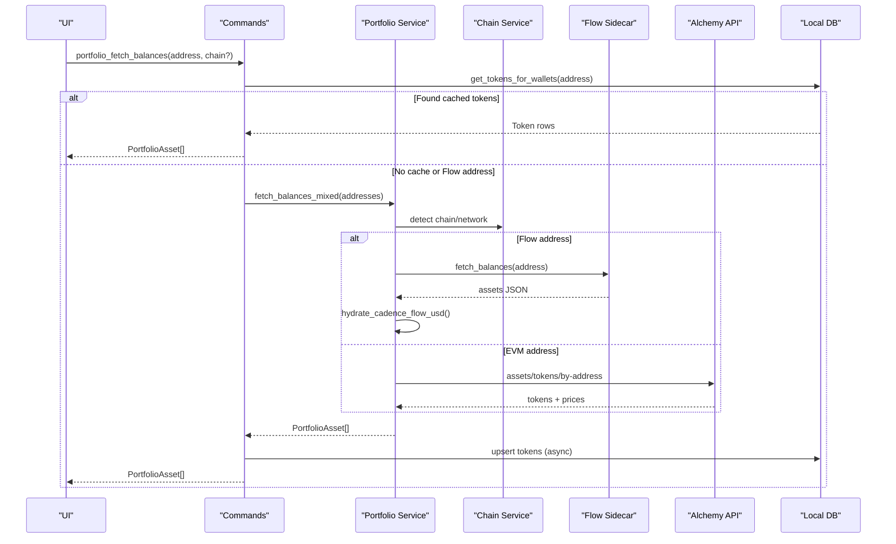

**Diagram sources**
- [portfolio.rs:38-87](file://src-tauri/src/commands/portfolio.rs#L38-L87)
- [portfolio_service.rs:228-269](file://src-tauri/src/services/portfolio_service.rs#L228-L269)
- [flow.rs:52-83](file://src-tauri/src/services/apps/flow.rs#L52-L83)
- [local_db.rs:518-537](file://src-tauri/src/services/local_db.rs#L518-L537)

## Detailed Component Analysis

### Portfolio Service
Responsibilities:
- Multi-chain balance retrieval via Alchemy for EVM addresses
- Flow native balance retrieval via Flow sidecar for Cadence addresses
- Balance normalization and display formatting
- Price enrichment and USD valuation
- Mixed-mode aggregation across EVM and Flow
- Error modeling and serialization

Key data models:
- PortfolioAsset: normalized asset representation with chain, symbol, balance, value_usd, decimals, token_contract, and optional wallet_address
- PortfolioError: typed errors for missing keys, invalid addresses, request failures, and provider errors

Processing logic highlights:
- Active networks selection conditioned on Flow availability
- Raw balance parsing supporting hex and decimal inputs
- Sorting by value_usd descending
- Flow USD hydration using token price lookup

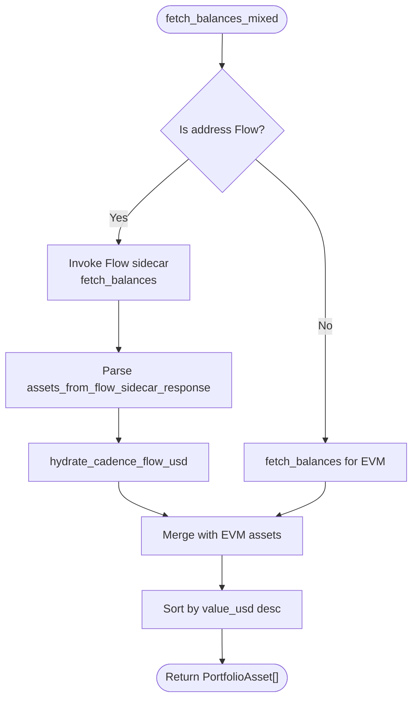

**Diagram sources**
- [portfolio_service.rs:228-269](file://src-tauri/src/services/portfolio_service.rs#L228-L269)
- [portfolio_service.rs:149-212](file://src-tauri/src/services/portfolio_service.rs#L149-L212)
- [portfolio_service.rs:214-226](file://src-tauri/src/services/portfolio_service.rs#L214-L226)

**Section sources**
- [portfolio_service.rs:1-498](file://src-tauri/src/services/portfolio_service.rs#L1-L498)

### Wallet Sync Service
Responsibilities:
- Background orchestration of token, NFT, and transaction sync per wallet and network
- Progress and completion events emitted to the UI
- Snapshot generation and portfolio analytics after sync
- State reconciliation and status updates

Processing stages:
- Tokens: fetch via portfolio_service, group by chain, upsert tokens
- NFTs: iterate active networks, fetch NFTs, upsert NFTs
- Transactions: iterate active networks, call alchemy_getAssetTransfers, upsert transactions
- Post-sync: update wallet status, capture portfolio snapshot, refresh market opportunities

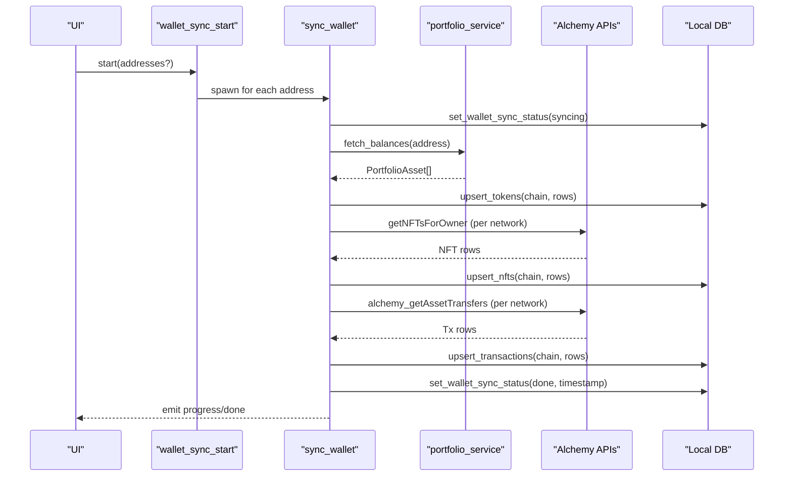

**Diagram sources**
- [wallet_sync.rs:59-90](file://src-tauri/src/commands/wallet_sync.rs#L59-L90)
- [wallet_sync.rs:260-453](file://src-tauri/src/services/wallet_sync.rs#L260-L453)
- [portfolio_service.rs:271-418](file://src-tauri/src/services/portfolio_service.rs#L271-L418)

**Section sources**
- [wallet_sync.rs:1-453](file://src-tauri/src/services/wallet_sync.rs#L1-L453)
- [wallet_sync.rs:1-90](file://src-tauri/src/commands/wallet_sync.rs#L1-L90)

### Chain Service
Responsibilities:
- Map chain codes to display names and explorer bases
- Normalize network identifiers to chain codes and display names
- Provide explorer URLs for EVM and Flow variants

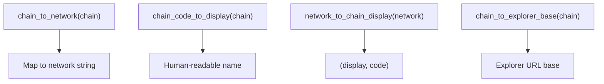

**Diagram sources**
- [chain.rs:9-89](file://src-tauri/src/services/chain.rs#L9-L89)

**Section sources**
- [chain.rs:1-90](file://src-tauri/src/services/chain.rs#L1-L90)

### Anonymizer Service
Responsibilities:
- Sanitize portfolio data for external AI processing
- Convert exact values to categories and percentages
- Produce a human-readable summary of total value, wallet count, and asset allocation

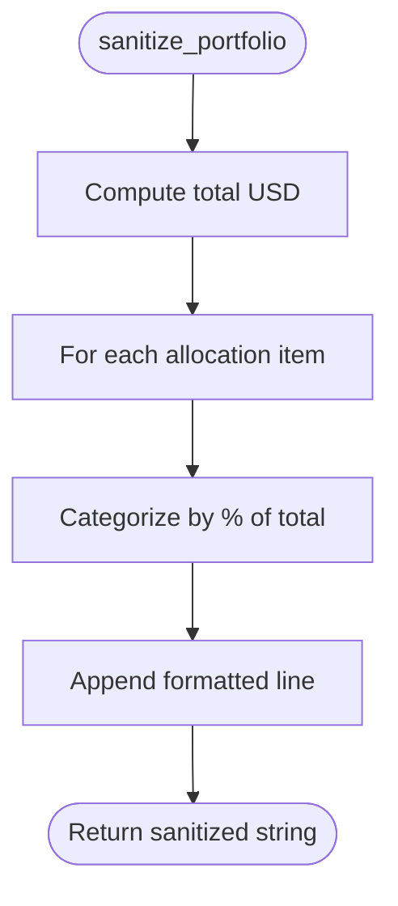

**Diagram sources**
- [anonymizer.rs:7-28](file://src-tauri/src/services/anonymizer.rs#L7-L28)

**Section sources**
- [anonymizer.rs:1-56](file://src-tauri/src/services/anonymizer.rs#L1-L56)

### Tools: Portfolio Aggregation and Pricing
Responsibilities:
- Aggregate per-token totals across wallets and chains
- Provide total portfolio value and breakdown
- Retrieve token prices from Alchemy

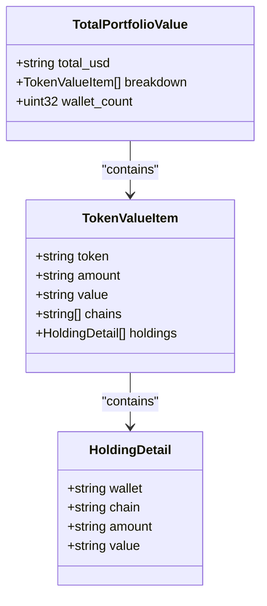

**Diagram sources**
- [portfolio_tools.rs:61-90](file://src-tauri/src/services/tools/portfolio_tools.rs#L61-L90)

**Section sources**
- [portfolio_tools.rs:1-220](file://src-tauri/src/services/tools/portfolio_tools.rs#L1-L220)

### Settings and Secrets Management
Responsibilities:
- Securely store and retrieve API keys (Alchemy, Perplexity, Ollama)
- Cache keys in-memory to avoid repeated OS prompts
- Fallback to environment variables when keychain entries are absent
- Provide convenience functions for key removal and app data cleanup

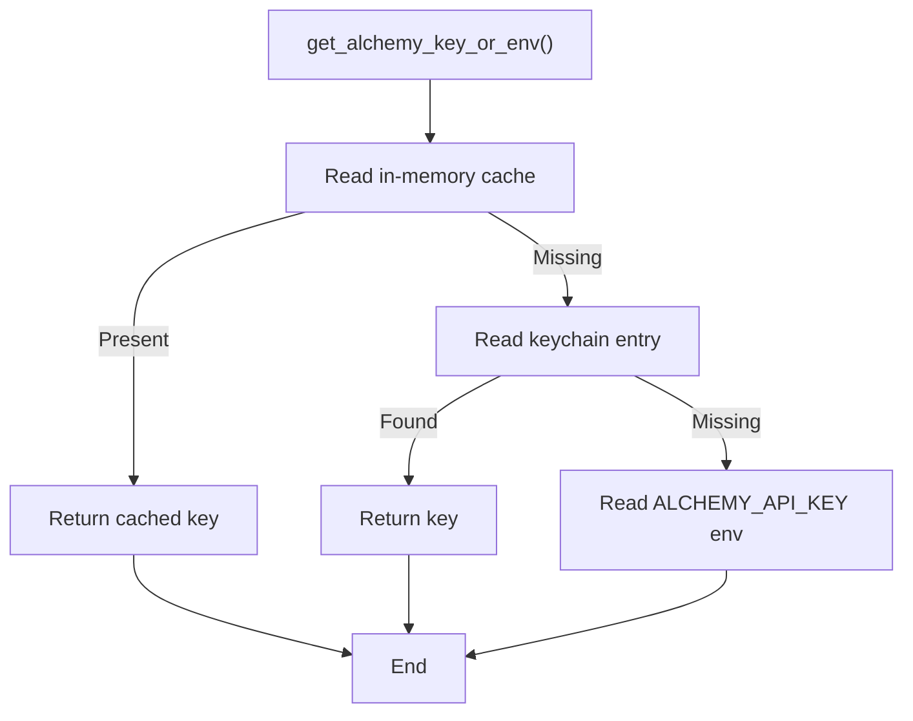

**Diagram sources**
- [settings.rs:197-200](file://src-tauri/src/services/settings.rs#L197-L200)

**Section sources**
- [settings.rs:1-243](file://src-tauri/src/services/settings.rs#L1-L243)

### Local Database Schema
Responsibilities:
- Persist tokens, NFTs, transactions, and portfolio snapshots
- Indexes for efficient queries on wallet, chain, and timestamps
- Auxiliary tables for strategies, approvals, executions, and market data

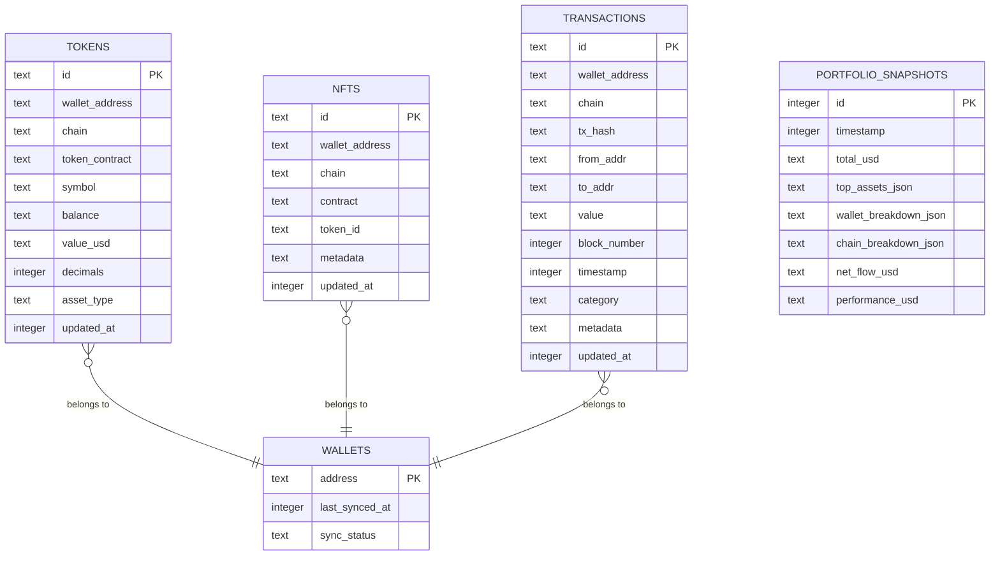

**Diagram sources**
- [local_db.rs:10-800](file://src-tauri/src/services/local_db.rs#L10-L800)

**Section sources**
- [local_db.rs:1-800](file://src-tauri/src/services/local_db.rs#L1-L800)

### Integration Patterns with External Providers
- Alchemy: assets, NFTs, and asset transfers via REST and JSON-RPC
- Flow sidecar: Flow account status and balance retrieval for Cadence addresses
- Explorer links: constructed via chain service for EVM and Flow networks

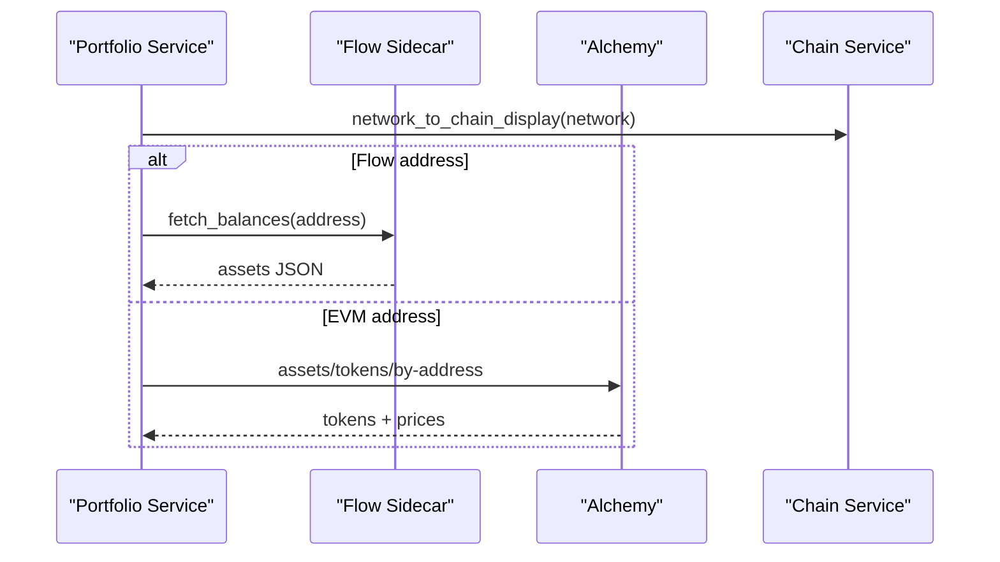

**Diagram sources**
- [portfolio_service.rs:271-418](file://src-tauri/src/services/portfolio_service.rs#L271-L418)
- [flow.rs:52-83](file://src-tauri/src/services/apps/flow.rs#L52-L83)
- [chain.rs:75-89](file://src-tauri/src/services/chain.rs#L75-L89)

**Section sources**
- [portfolio_service.rs:1-498](file://src-tauri/src/services/portfolio_service.rs#L1-L498)
- [flow.rs:1-119](file://src-tauri/src/services/apps/flow.rs#L1-L119)
- [state.rs:170-181](file://src-tauri/src/services/apps/state.rs#L170-L181)

## Dependency Analysis
- Commands depend on services and local DB for data access and mutations
- Services depend on chain mapping, settings, and external providers
- Wallet sync depends on portfolio service, local DB, and settings
- Tools depend on portfolio service and settings
- Flow integration depends on apps runtime and state

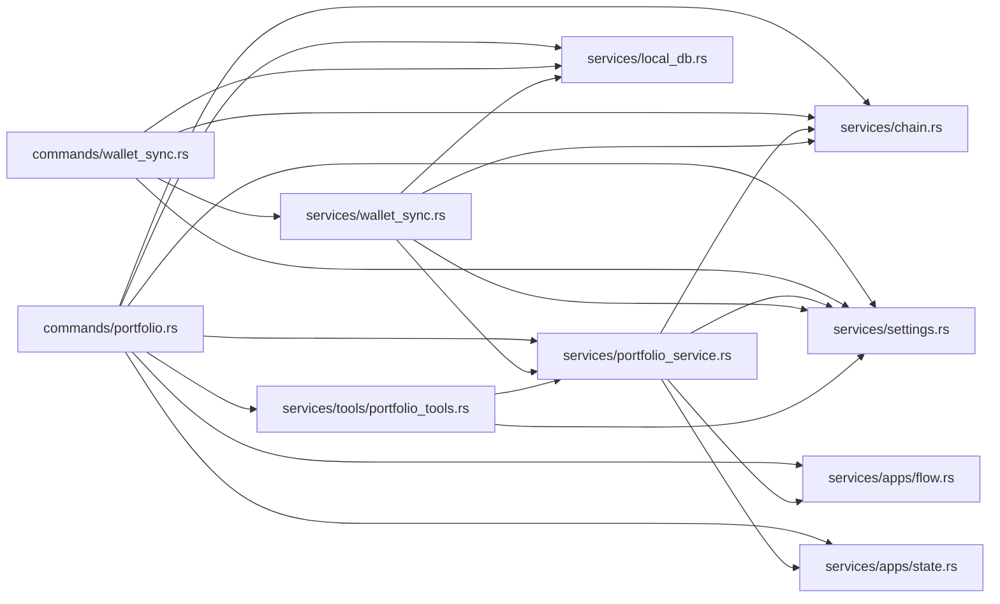

**Diagram sources**
- [portfolio.rs:1-406](file://src-tauri/src/commands/portfolio.rs#L1-L406)
- [wallet_sync.rs:1-90](file://src-tauri/src/commands/wallet_sync.rs#L1-L90)
- [portfolio_service.rs:1-498](file://src-tauri/src/services/portfolio_service.rs#L1-L498)
- [wallet_sync.rs:1-453](file://src-tauri/src/services/wallet_sync.rs#L1-L453)
- [chain.rs:1-90](file://src-tauri/src/services/chain.rs#L1-L90)
- [anonymizer.rs:1-56](file://src-tauri/src/services/anonymizer.rs#L1-L56)
- [portfolio_tools.rs:1-220](file://src-tauri/src/services/tools/portfolio_tools.rs#L1-L220)
- [settings.rs:1-243](file://src-tauri/src/services/settings.rs#L1-L243)
- [local_db.rs:1-800](file://src-tauri/src/services/local_db.rs#L1-L800)
- [flow.rs:1-119](file://src-tauri/src/services/apps/flow.rs#L1-L119)
- [state.rs:1-458](file://src-tauri/src/services/apps/state.rs#L1-L458)

**Section sources**
- [lib.rs:34-199](file://src-tauri/src/lib.rs#L34-L199)

## Performance Considerations
- Caching and early exits:
  - Local DB cache for tokens prevents redundant provider calls
  - Mixed-mode fetch short-circuits when Flow sidecar returns empty accounts
- Batched writes:
  - Upserts grouped by chain reduce round-trips
- Progressive UI feedback:
  - Sync progress events enable responsive UX during long operations
- Indexing:
  - Indices on wallet_address, chain, and timestamps optimize reads for transactions and tokens
- Concurrency:
  - Background tasks spawn per wallet address to parallelize sync workloads

[No sources needed since this section provides general guidance]

## Troubleshooting Guide
Common issues and resolutions:
- Missing API key:
  - Symptom: sync or portfolio fetch fails with a “missing key” error
  - Resolution: set Alchemy API key in Settings; the system falls back to environment variable if keychain is empty
- Invalid or unsupported address:
  - Symptom: portfolio fetch returns an invalid address error
  - Resolution: ensure the address is a valid EVM-style 0x-prefixed 20-byte address or a Flow address supported by the sidecar
- Flow sidecar not ready:
  - Symptom: Flow address not detected or sidecar errors
  - Resolution: install and enable the Flow app; confirm readiness via state checks
- Stale data:
  - Symptom: outdated balances or missing recent transactions
  - Resolution: trigger wallet sync; the system considers data stale after a configured interval and re-fetches from providers
- Network mismatch:
  - Symptom: incorrect chain display or explorer links
  - Resolution: rely on chain service mapping; ensure network identifiers are normalized

**Section sources**
- [settings.rs:197-200](file://src-tauri/src/services/settings.rs#L197-L200)
- [portfolio_service.rs:271-314](file://src-tauri/src/services/portfolio_service.rs#L271-L314)
- [state.rs:170-181](file://src-tauri/src/services/apps/state.rs#L170-L181)
- [wallet_sync.rs:260-304](file://src-tauri/src/services/wallet_sync.rs#L260-L304)

## Conclusion
Shadow Protocol’s portfolio and wallet services combine robust provider integrations, resilient caching, and privacy-aware processing to deliver a seamless multi-chain experience. The architecture cleanly separates commands, services, and persistence, enabling scalable enhancements for additional chains, richer analytics, and stronger privacy controls.