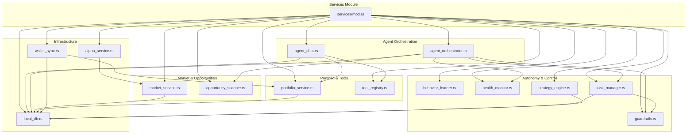
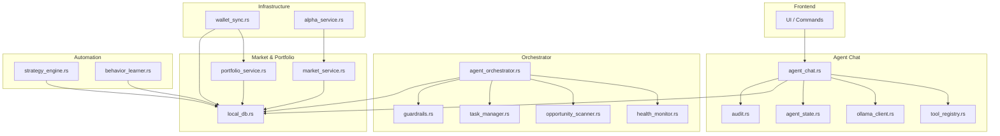
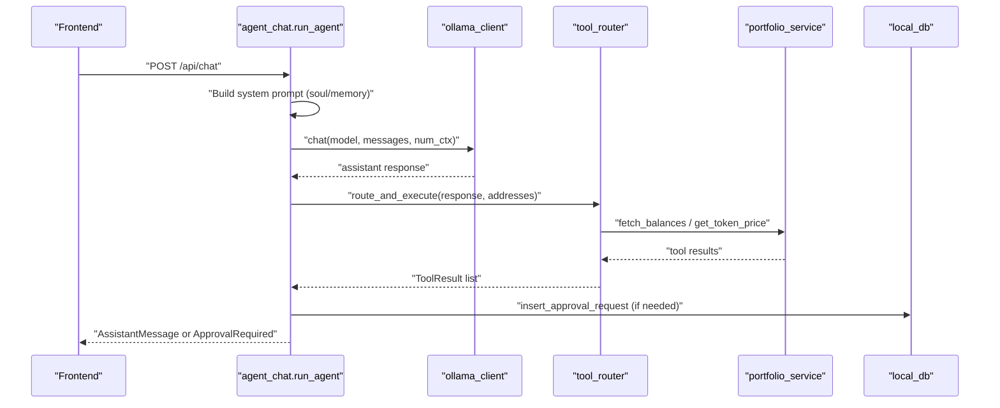
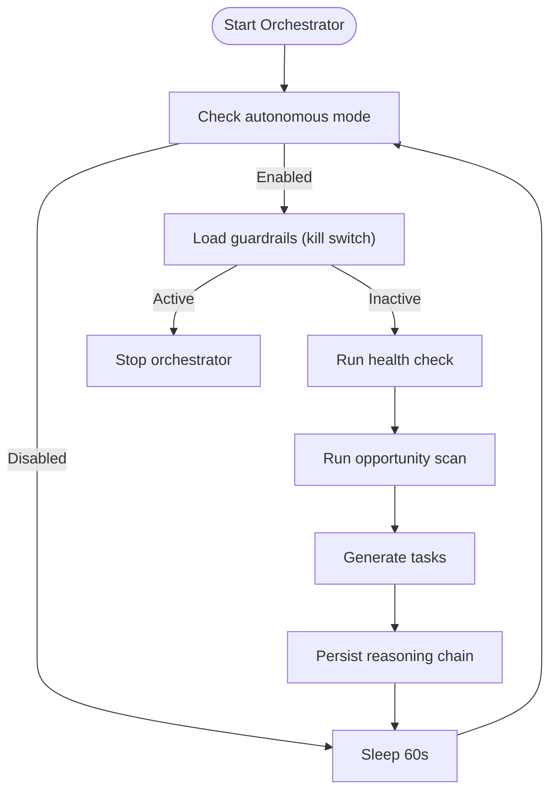
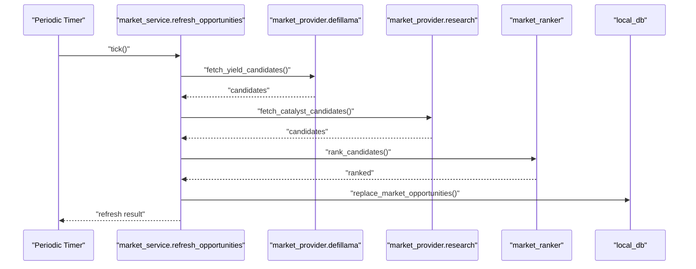
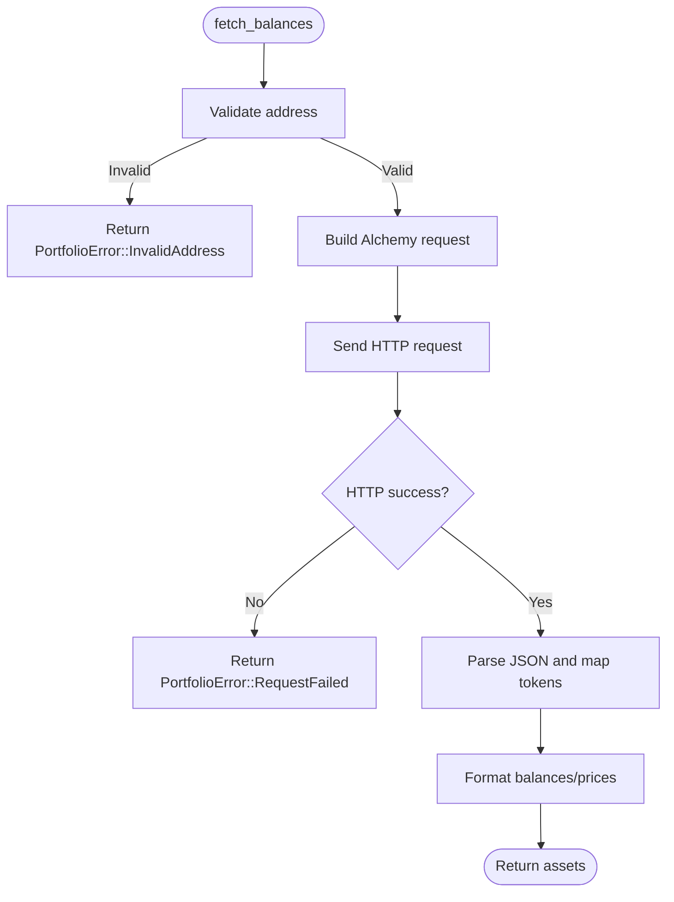
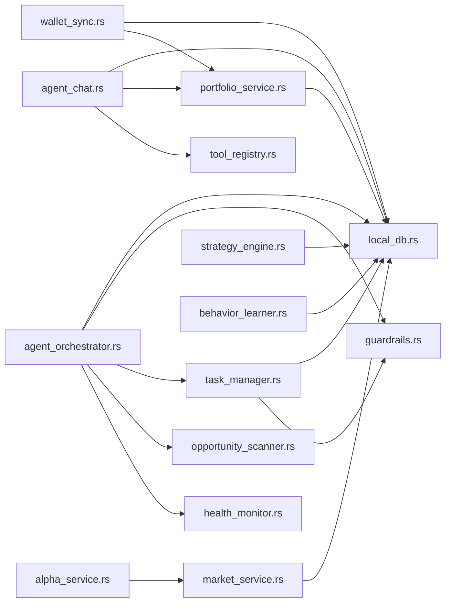

# Service Interfaces

<cite>
**Referenced Files in This Document**
- [mod.rs](file://src-tauri/src/services/mod.rs)
- [agent_chat.rs](file://src-tauri/src/services/agent_chat.rs)
- [agent_orchestrator.rs](file://src-tauri/src/services/agent_orchestrator.rs)
- [market_service.rs](file://src-tauri/src/services/market_service.rs)
- [portfolio_service.rs](file://src-tauri/src/services/portfolio_service.rs)
- [behavior_learner.rs](file://src-tauri/src/services/behavior_learner.rs)
- [guardrails.rs](file://src-tauri/src/services/guardrails.rs)
- [health_monitor.rs](file://src-tauri/src/services/health_monitor.rs)
- [opportunity_scanner.rs](file://src-tauri/src/services/opportunity_scanner.rs)
- [task_manager.rs](file://src-tauri/src/services/task_manager.rs)
- [tool_registry.rs](file://src-tauri/src/services/tool_registry.rs)
- [wallet_sync.rs](file://src-tauri/src/services/wallet_sync.rs)
- [strategy_engine.rs](file://src-tauri/src/services/strategy_engine.rs)
- [alpha_service.rs](file://src-tauri/src/services/alpha_service.rs)
- [local_db.rs](file://src-tauri/src/services/local_db.rs)
</cite>

## Table of Contents
1. [Introduction](#introduction)
2. [Project Structure](#project-structure)
3. [Core Components](#core-components)
4. [Architecture Overview](#architecture-overview)
5. [Detailed Component Analysis](#detailed-component-analysis)
6. [Dependency Analysis](#dependency-analysis)
7. [Performance Considerations](#performance-considerations)
8. [Troubleshooting Guide](#troubleshooting-guide)
9. [Conclusion](#conclusion)

## Introduction
This document describes the Rust service layer for SHADOW Protocol’s Tauri application. It focuses on the service interfaces, method contracts, initialization patterns, lifecycle management, and integration with Tauri commands. The covered services include agent_chat, agent_orchestrator, alpha_service, behavior_learner, guardrails, health_monitor, market_service, opportunity_scanner, portfolio_service, strategy_engine, task_manager, tool_registry, and wallet_sync. For each service, we outline interface contracts, parameter types, return values, error conditions, initialization and lifecycle management, data flow, and integration points with Tauri commands. We also provide guidance on testing, performance, and monitoring.

## Project Structure
The service layer is organized under src-tauri/src/services with a central module re-exporting all services. Services are grouped by domain: agent orchestration, market data, portfolio analytics, guardrails, strategies, and wallet synchronization.

**Diagram sources**
- [mod.rs:1-36](file://src-tauri/src/services/mod.rs#L1-L36)
- [agent_chat.rs:1-359](file://src-tauri/src/services/agent_chat.rs#L1-L359)
- [agent_orchestrator.rs:1-571](file://src-tauri/src/services/agent_orchestrator.rs#L1-L571)
- [market_service.rs:1-745](file://src-tauri/src/services/market_service.rs#L1-L745)
- [opportunity_scanner.rs:1-599](file://src-tauri/src/services/opportunity_scanner.rs#L1-L599)
- [portfolio_service.rs:1-352](file://src-tauri/src/services/portfolio_service.rs#L1-L352)
- [tool_registry.rs:1-313](file://src-tauri/src/services/tool_registry.rs#L1-L313)
- [behavior_learner.rs:1-463](file://src-tauri/src/services/behavior_learner.rs#L1-L463)
- [health_monitor.rs:1-573](file://src-tauri/src/services/health_monitor.rs#L1-L573)
- [guardrails.rs:1-620](file://src-tauri/src/services/guardrails.rs#L1-L620)
- [task_manager.rs:1-633](file://src-tauri/src/services/task_manager.rs#L1-L633)
- [strategy_engine.rs:1-726](file://src-tauri/src/services/strategy_engine.rs#L1-L726)
- [wallet_sync.rs:1-453](file://src-tauri/src/services/wallet_sync.rs#L1-L453)
- [alpha_service.rs:1-143](file://src-tauri/src/services/alpha_service.rs#L1-L143)
- [local_db.rs:1-800](file://src-tauri/src/services/local_db.rs#L1-L800)

**Section sources**
- [mod.rs:1-36](file://src-tauri/src/services/mod.rs#L1-L36)

## Core Components
This section summarizes the primary responsibilities and key interfaces for each service.

- agent_chat
  - Purpose: Deterministic advice pipeline with tool loop and approval gating.
  - Key interface: run_agent(input, app) -> Result<ChatAgentResponse, String>.
  - Dependencies: ollama_client, tool_router, agent_state, local_db, audit.
  - Error conditions: Tool errors, invalid input, approval creation failures.
  - Lifecycle: Invoked via Tauri commands; emits assistant messages or approval requests.

- agent_orchestrator
  - Purpose: Autonomous orchestration of health checks, opportunity scans, task generation.
  - Key interfaces: start_orchestrator(), stop_orchestrator(), get_state(), analyze_now().
  - Configuration: OrchestratorConfig with intervals and limits.
  - Lifecycle: Long-running loop with kill-switch and guardrails checks.

- market_service
  - Purpose: Market opportunity discovery, ranking, caching, and emission to frontend.
  - Key interfaces: start(app), fetch_opportunities(input), refresh_opportunities(input), get_opportunity_detail().
  - Data: MarketOpportunity, MarketOpportunitiesResponse, MarketRefreshResult.
  - Lifecycle: Periodic refresh with cache freshness checks; emits market_opportunities_updated.

- portfolio_service
  - Purpose: Portfolio balance retrieval via Alchemy; token price lookup.
  - Key interfaces: fetch_balances(address), fetch_balances_multi(addresses), get_token_price_usd(symbol).
  - Error types: PortfolioError (missing API key, invalid address, request failures).
  - Lifecycle: Called by tools and wallet sync.

- behavior_learner
  - Purpose: Learn user preferences from behavior events; update confidence-based preferences.
  - Key interfaces: record_event(...), get_preferences_map(), set_preference(...).
  - Data: BehaviorEventType, PreferenceCategory, BehaviorContext, BehaviorDecision, BehaviorOutcome.
  - Lifecycle: Event-driven updates; used by scanners and task generator.

- guardrails
  - Purpose: Enforce execution constraints; kill switch and validation pipeline.
  - Key interfaces: load_config(), save_config(config), validate_action(context), activate/deactivate_kill_switch().
  - Data: GuardrailConfig, ActionContext, GuardrailValidationResult.
  - Lifecycle: Loaded on startup; validated before task execution and strategy actions.

- health_monitor
  - Purpose: Compute portfolio health scores, alerts, drift analysis.
  - Key interfaces: run_health_check(holdings, targets, total_usd) -> PortfolioHealthSummary.
  - Data: AssetHolding, TargetAllocation, HealthAlert, DriftAnalysis, PortfolioHealthSummary.
  - Lifecycle: Used by orchestrator and task manager.

- opportunity_scanner
  - Purpose: Scan and match opportunities against user preferences and portfolio context.
  - Key interfaces: scan_opportunities(portfolio, config) -> Vec<MatchedOpportunity>.
  - Data: ScannerConfig, PortfolioContext, MarketOpportunity, MatchedOpportunity.
  - Lifecycle: Used by orchestrator.

- task_manager
  - Purpose: Generate, approve, and track tasks derived from health and opportunities.
  - Key interfaces: generate_tasks(ctx), create_task(task), approve_task(id), get_pending_tasks().
  - Data: Task, TaskAction, TaskReasoning, GeneratedTask, TaskStats.
  - Lifecycle: Validates against guardrails; persists to local_db.

- tool_registry
  - Purpose: Define tool schema, execution modes, and permissions.
  - Key data: ToolDef, ToolKind, ExecutionMode.
  - Lifecycle: Used by agent_chat and tool_router.

- wallet_sync
  - Purpose: Background sync of tokens, NFTs, transactions; snapshot and market refresh triggers.
  - Key interfaces: sync_wallet(app, address, wallet_index, wallet_count).
  - Lifecycle: Emits progress and completion events; integrates with market_service.

- strategy_engine
  - Purpose: Evaluate compiled automation strategies on heartbeat ticks; create approvals.
  - Key interfaces: evaluate_strategy(app, strategy) -> StrategyEvaluationResult.
  - Data: StrategyAction, StrategyTrigger, StrategyCondition, StrategyExecutionPolicy.
  - Lifecycle: Driven by scheduler; integrates with approvals and audit.

- alpha_service
  - Purpose: Daily synthesis of market alpha using LLM with personalized context.
  - Key interfaces: start(app), run_alpha_cycle(app, client) -> Result<(), String>.
  - Lifecycle: Periodic 24-hour cycle emitting shadow_brief.

- local_db
  - Purpose: Central SQLite schema and CRUD helpers for all domain entities.
  - Scope: Wallets, tokens, NFTs, transactions, strategies, tasks, guardrails, opportunities, reasoning chains, etc.
  - Lifecycle: Initialized early; used by all services.

**Section sources**
- [agent_chat.rs:190-359](file://src-tauri/src/services/agent_chat.rs#L190-L359)
- [agent_orchestrator.rs:93-148](file://src-tauri/src/services/agent_orchestrator.rs#L93-L148)
- [market_service.rs:189-365](file://src-tauri/src/services/market_service.rs#L189-L365)
- [portfolio_service.rs:128-352](file://src-tauri/src/services/portfolio_service.rs#L128-L352)
- [behavior_learner.rs:112-384](file://src-tauri/src/services/behavior_learner.rs#L112-L384)
- [guardrails.rs:183-230](file://src-tauri/src/services/guardrails.rs#L183-L230)
- [health_monitor.rs:107-221](file://src-tauri/src/services/health_monitor.rs#L107-L221)
- [opportunity_scanner.rs:126-161](file://src-tauri/src/services/opportunity_scanner.rs#L126-L161)
- [task_manager.rs:167-195](file://src-tauri/src/services/task_manager.rs#L167-L195)
- [tool_registry.rs:36-313](file://src-tauri/src/services/tool_registry.rs#L36-L313)
- [wallet_sync.rs:260-453](file://src-tauri/src/services/wallet_sync.rs#L260-L453)
- [strategy_engine.rs:343-726](file://src-tauri/src/services/strategy_engine.rs#L343-L726)
- [alpha_service.rs:27-143](file://src-tauri/src/services/alpha_service.rs#L27-L143)
- [local_db.rs:438-800](file://src-tauri/src/services/local_db.rs#L438-L800)

## Architecture Overview
The service layer follows a modular, event-driven architecture with strong separation of concerns. Services communicate primarily through:
- Function calls within the Rust process
- Local database persistence (local_db)
- Tauri event emission to the frontend
- Shared tool registry and agent state

**Diagram sources**
- [agent_chat.rs:1-359](file://src-tauri/src/services/agent_chat.rs#L1-L359)
- [agent_orchestrator.rs:1-571](file://src-tauri/src/services/agent_orchestrator.rs#L1-L571)
- [market_service.rs:1-745](file://src-tauri/src/services/market_service.rs#L1-L745)
- [portfolio_service.rs:1-352](file://src-tauri/src/services/portfolio_service.rs#L1-L352)
- [tool_registry.rs:1-313](file://src-tauri/src/services/tool_registry.rs#L1-L313)
- [strategy_engine.rs:1-726](file://src-tauri/src/services/strategy_engine.rs#L1-L726)
- [behavior_learner.rs:1-463](file://src-tauri/src/services/behavior_learner.rs#L1-L463)
- [guardrails.rs:1-620](file://src-tauri/src/services/guardrails.rs#L1-L620)
- [health_monitor.rs:1-573](file://src-tauri/src/services/health_monitor.rs#L1-L573)
- [opportunity_scanner.rs:1-599](file://src-tauri/src/services/opportunity_scanner.rs#L1-L599)
- [task_manager.rs:1-633](file://src-tauri/src/services/task_manager.rs#L1-L633)
- [wallet_sync.rs:1-453](file://src-tauri/src/services/wallet_sync.rs#L1-L453)
- [alpha_service.rs:1-143](file://src-tauri/src/services/alpha_service.rs#L1-L143)
- [local_db.rs:1-800](file://src-tauri/src/services/local_db.rs#L1-L800)

## Detailed Component Analysis

### agent_chat
- Interface contract
  - run_agent(input: ChatAgentInput, app: &AppHandle) -> Result<ChatAgentResponse, String>
  - Input fields: model, messages, wallet_address, wallet_addresses, num_ctx, structured_facts, demo_mode
  - Response kinds: AssistantMessage, ApprovalRequired, Error
- Processing logic
  - Builds tool system prompt with soul/memory
  - Calls LLM via ollama_client
  - Routes and executes tools via tool_router
  - Formats tool results and observations
  - Persists approvals and audits
- Error conditions
  - LLM/chat errors, tool execution errors, invalid input, approval persistence failures
- Lifecycle
  - Invoked by Tauri chat commands; spawns background Filecoin backup when idle

**Diagram sources**
- [agent_chat.rs:190-359](file://src-tauri/src/services/agent_chat.rs#L190-L359)
- [portfolio_service.rs:128-352](file://src-tauri/src/services/portfolio_service.rs#L128-L352)

**Section sources**
- [agent_chat.rs:15-359](file://src-tauri/src/services/agent_chat.rs#L15-L359)

### agent_orchestrator
- Interface contract
  - start_orchestrator() -> Result<(), String>
  - stop_orchestrator() -> Result<(), String>
  - get_state() -> OrchestratorState
  - analyze_now() -> Result<AnalysisResult, String>
- Configuration
  - OrchestratorConfig with intervals, limits, and autonomous flag
- Processing logic
  - Runs health checks, opportunity scans, and task generation cycles
  - Stores reasoning chains and maintains state
  - Respects kill switch and guardrails
- Error conditions
  - Kill switch activation, guardrail violations, task creation failures

**Diagram sources**
- [agent_orchestrator.rs:93-231](file://src-tauri/src/services/agent_orchestrator.rs#L93-L231)

**Section sources**
- [agent_orchestrator.rs:60-148](file://src-tauri/src/services/agent_orchestrator.rs#L60-L148)

### market_service
- Interface contract
  - start(app): void (background periodic refresh)
  - fetch_opportunities(input: MarketFetchInput) -> Result<MarketOpportunitiesResponse, String>
  - refresh_opportunities(app: Option<&AppHandle>, input: MarketRefreshInput) -> Result<MarketRefreshResult, String>
  - get_opportunity_detail(input: MarketOpportunityDetailInput) -> Result<MarketOpportunityDetail, String>
- Data models
  - MarketOpportunity, MarketOpportunitiesResponse, MarketRefreshResult, MarketOpportunityDetail
- Processing logic
  - Refreshes opportunities from DefiLlama and Sonar research
  - Ranks candidates and persists to local_db
  - Emits market_opportunities_updated on updates
- Error conditions
  - Provider failures, cache fallback, invalid input

**Diagram sources**
- [market_service.rs:263-365](file://src-tauri/src/services/market_service.rs#L263-L365)

**Section sources**
- [market_service.rs:189-397](file://src-tauri/src/services/market_service.rs#L189-L397)

### portfolio_service
- Interface contract
  - fetch_balances(address: &str) -> Result<Vec<PortfolioAsset>, PortfolioError>
  - fetch_balances_multi(addresses: &[String]) -> Result<Vec<PortfolioAsset>, PortfolioError>
  - get_token_price_usd(token_symbol: &str) -> Result<f64, PortfolioError>
- Data models
  - PortfolioAsset, PortfolioError
- Processing logic
  - Queries Alchemy for tokens, NFTs, and transfers
  - Formats balances and prices
  - Handles hex and decimal raw values
- Error conditions
  - Missing API key, invalid address, request failures

**Diagram sources**
- [portfolio_service.rs:146-293](file://src-tauri/src/services/portfolio_service.rs#L146-L293)

**Section sources**
- [portfolio_service.rs:128-352](file://src-tauri/src/services/portfolio_service.rs#L128-L352)

### behavior_learner
- Interface contract
  - record_event(event_type, context, decision, outcome) -> Result<String, String>
  - record_simple_event(event_type, entity_id, metadata) -> Result<String, String>
  - get_preferences_map() -> HashMap<String, f64>
  - set_preference(category, key, value, confidence) -> Result<(), String>
- Processing logic
  - Reinforces preferences via Bayesian updates
  - Serializes context/decisions/outcomes
  - Logs to audit
- Error conditions
  - Serialization/deserialization errors, DB upsert failures

**Section sources**
- [behavior_learner.rs:112-384](file://src-tauri/src/services/behavior_learner.rs#L112-L384)

### guardrails
- Interface contract
  - load_config() -> GuardrailConfig
  - save_config(config: &GuardrailConfig) -> Result<(), String>
  - validate_action(context: &ActionContext) -> GuardrailValidationResult
  - activate_kill_switch() -> Result<(), String>
  - deactivate_kill_switch() -> Result<(), String>
- Data models
  - GuardrailConfig, ActionContext, GuardrailViolation, GuardrailValidationResult
- Processing logic
  - Validates portfolio floor, max single tx, allowed chains, blocked tokens/protocols, execution windows, approval thresholds, slippage
  - Supports kill switch and audit logging
- Error conditions
  - Parsing errors, DB save failures

**Section sources**
- [guardrails.rs:183-426](file://src-tauri/src/services/guardrails.rs#L183-L426)

### health_monitor
- Interface contract
  - run_health_check(holdings, targets, total_value_usd) -> Result<PortfolioHealthSummary, String>
  - get_latest_health() -> Result<Option<PortfolioHealthRecord>, String>
- Data models
  - AssetHolding, TargetAllocation, HealthAlert, DriftAnalysis, PortfolioHealthSummary
- Processing logic
  - Computes drift, concentration, risk, and performance scores
  - Generates alerts and recommendations
  - Persists health records and audit logs

**Section sources**
- [health_monitor.rs:107-221](file://src-tauri/src/services/health_monitor.rs#L107-L221)

### opportunity_scanner
- Interface contract
  - scan_opportunities(portfolio, config) -> Result<Vec<MatchedOpportunity>, String>
  - get_recent_matches(limit) -> Result<Vec<MatchedOpportunity>, String>
- Data models
  - ScannerConfig, PortfolioContext, MarketOpportunity, MatchedOpportunity
- Processing logic
  - Fetches opportunities from known protocols
  - Matches against preferences and portfolio context
  - Scores and persists matches

**Section sources**
- [opportunity_scanner.rs:126-161](file://src-tauri/src/services/opportunity_scanner.rs#L126-L161)

### task_manager
- Interface contract
  - generate_tasks(ctx: &TaskContext) -> Result<Vec<GeneratedTask>, String>
  - create_task(task: &Task) -> Result<String, String>
  - approve_task(id, user_reason) -> Result<Task, String>
  - get_pending_tasks() -> Result<Vec<Task>, String>
  - get_task_stats() -> Result<TaskStats, String>
- Data models
  - Task, TaskAction, TaskReasoning, GeneratedTask, TaskStats
- Processing logic
  - Generates tasks from health alerts and drift analysis
  - Validates against guardrails and kill switch
  - Persists and tracks task lifecycle

**Section sources**
- [task_manager.rs:167-502](file://src-tauri/src/services/task_manager.rs#L167-L502)

### tool_registry
- Interface contract
  - all_tools() -> Vec<ToolDef>
- Data models
  - ToolDef, ToolKind, ExecutionMode
- Notes
  - Defines tool schema, permissions, and execution modes for agent_chat and tool_router

**Section sources**
- [tool_registry.rs:36-313](file://src-tauri/src/services/tool_registry.rs#L36-L313)

### wallet_sync
- Interface contract
  - sync_wallet(app, address, wallet_index, wallet_count) -> void
- Processing logic
  - Fetches tokens, NFTs, and transactions from Alchemy
  - Emits progress and completion events
  - Triggers portfolio snapshot and market refresh
- Error conditions
  - Missing API key, provider errors

**Section sources**
- [wallet_sync.rs:260-453](file://src-tauri/src/services/wallet_sync.rs#L260-L453)

### strategy_engine
- Interface contract
  - evaluate_strategy(app, strategy) -> Result<StrategyEvaluationResult, String>
- Data models
  - StrategyAction, StrategyTrigger, StrategyCondition, StrategyExecutionPolicy
- Processing logic
  - Evaluates triggers and conditions
  - Creates approval requests for strategy actions
  - Emits alerts and updates execution records
- Error conditions
  - Missing compiled plan, guardrail violations, chain allowlist failures

**Section sources**
- [strategy_engine.rs:343-726](file://src-tauri/src/services/strategy_engine.rs#L343-L726)

### alpha_service
- Interface contract
  - start(app): void (background 24h cycle)
  - run_alpha_cycle(app, client) -> Result<(), String>
- Processing logic
  - Checks Ollama status and models
  - Performs web research and synthesizes personalized alpha
  - Emits shadow_brief with optional opportunity
- Error conditions
  - Ollama/model unavailability, missing API keys, timeouts

**Section sources**
- [alpha_service.rs:27-143](file://src-tauri/src/services/alpha_service.rs#L27-L143)

### local_db
- Scope
  - Central SQLite schema covering wallets, tokens, NFTs, transactions, strategies, tasks, guardrails, opportunities, reasoning chains, and more
- Initialization
  - init(path) creates schema and runs migrations
- Usage
  - All services depend on local_db for persistence and queries

**Section sources**
- [local_db.rs:438-800](file://src-tauri/src/services/local_db.rs#L438-L800)

## Dependency Analysis
The services exhibit clear dependency chains and shared infrastructure:

**Diagram sources**
- [agent_chat.rs:1-359](file://src-tauri/src/services/agent_chat.rs#L1-L359)
- [agent_orchestrator.rs:1-571](file://src-tauri/src/services/agent_orchestrator.rs#L1-L571)
- [market_service.rs:1-745](file://src-tauri/src/services/market_service.rs#L1-L745)
- [portfolio_service.rs:1-352](file://src-tauri/src/services/portfolio_service.rs#L1-L352)
- [tool_registry.rs:1-313](file://src-tauri/src/services/tool_registry.rs#L1-L313)
- [strategy_engine.rs:1-726](file://src-tauri/src/services/strategy_engine.rs#L1-L726)
- [behavior_learner.rs:1-463](file://src-tauri/src/services/behavior_learner.rs#L1-L463)
- [guardrails.rs:1-620](file://src-tauri/src/services/guardrails.rs#L1-L620)
- [health_monitor.rs:1-573](file://src-tauri/src/services/health_monitor.rs#L1-L573)
- [opportunity_scanner.rs:1-599](file://src-tauri/src/services/opportunity_scanner.rs#L1-L599)
- [task_manager.rs:1-633](file://src-tauri/src/services/task_manager.rs#L1-L633)
- [wallet_sync.rs:1-453](file://src-tauri/src/services/wallet_sync.rs#L1-L453)
- [alpha_service.rs:1-143](file://src-tauri/src/services/alpha_service.rs#L1-L143)
- [local_db.rs:1-800](file://src-tauri/src/services/local_db.rs#L1-L800)

**Section sources**
- [mod.rs:1-36](file://src-tauri/src/services/mod.rs#L1-L36)

## Performance Considerations
- Asynchronous design
  - Services use async runtime for I/O-bound operations (HTTP, DB).
  - Tokio tasks and channels minimize blocking the main thread.
- Caching and batching
  - market_service caches opportunities and refreshes periodically.
  - portfolio_service batches multi-address queries.
- Concurrency controls
  - agent_orchestrator enforces max pending tasks and intervals.
  - strategy_engine computes next run times to avoid redundant evaluations.
- Resource limits
  - guardrails enforce per-action and portfolio constraints.
  - task_manager validates against guardrails before execution.

## Troubleshooting Guide
- Missing API keys
  - portfolio_service returns PortfolioError::MissingApiKey; ensure ALCHEMY_API_KEY is configured.
  - alpha_service skips synthesis when Ollama or models are unavailable.
- Validation failures
  - guardrails.validate_action returns violations; inspect GuardrailViolation details.
  - task_manager.approve_task fails if kill switch is active or guardrails block action.
- Persistence errors
  - local_db.with_connection wraps SQLite errors; check DB path initialization and migrations.
- Market refresh issues
  - market_service falls back to cached results when providers fail; verify cache freshness.

**Section sources**
- [portfolio_service.rs:24-43](file://src-tauri/src/services/portfolio_service.rs#L24-L43)
- [guardrails.rs:278-426](file://src-tauri/src/services/guardrails.rs#L278-L426)
- [task_manager.rs:432-502](file://src-tauri/src/services/task_manager.rs#L432-L502)
- [local_db.rs:438-516](file://src-tauri/src/services/local_db.rs#L438-L516)
- [market_service.rs:601-624](file://src-tauri/src/services/market_service.rs#L601-L624)

## Conclusion
The SHADOW Protocol Rust service layer provides a robust, modular foundation for autonomous agent operations, market intelligence, portfolio analytics, and strategy automation. Services are designed with clear interfaces, strong error handling, and integration with Tauri commands and events. The architecture emphasizes safety via guardrails, transparency via reasoning chains, and scalability through asynchronous processing and caching.