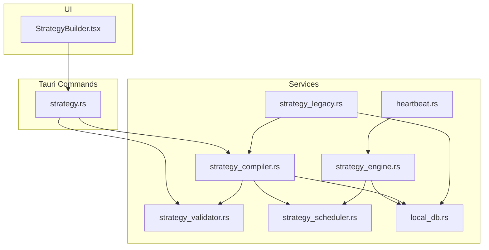
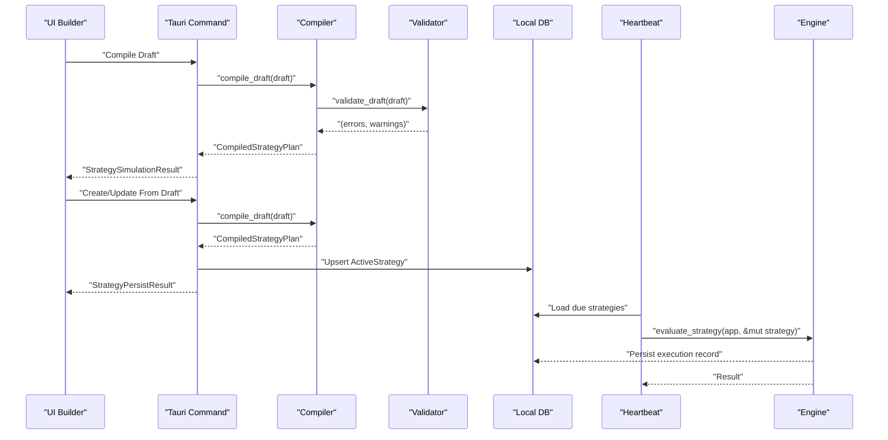
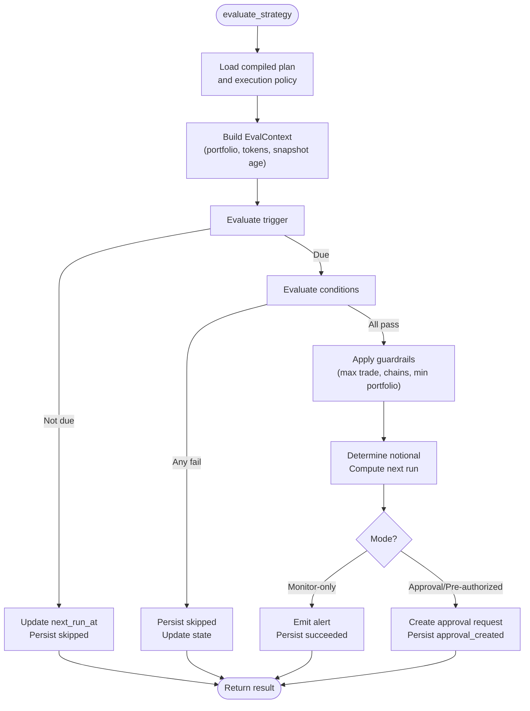
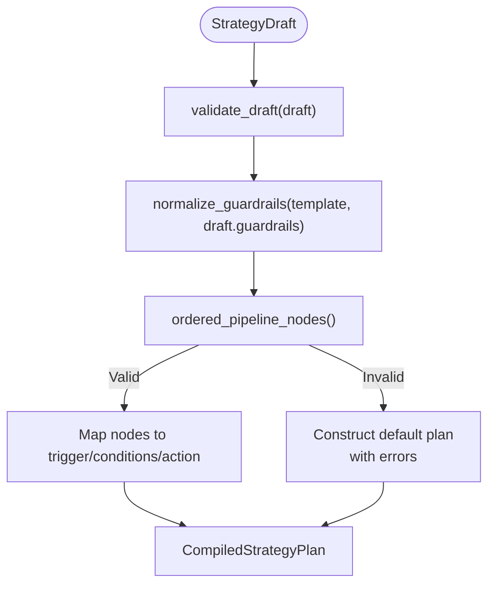
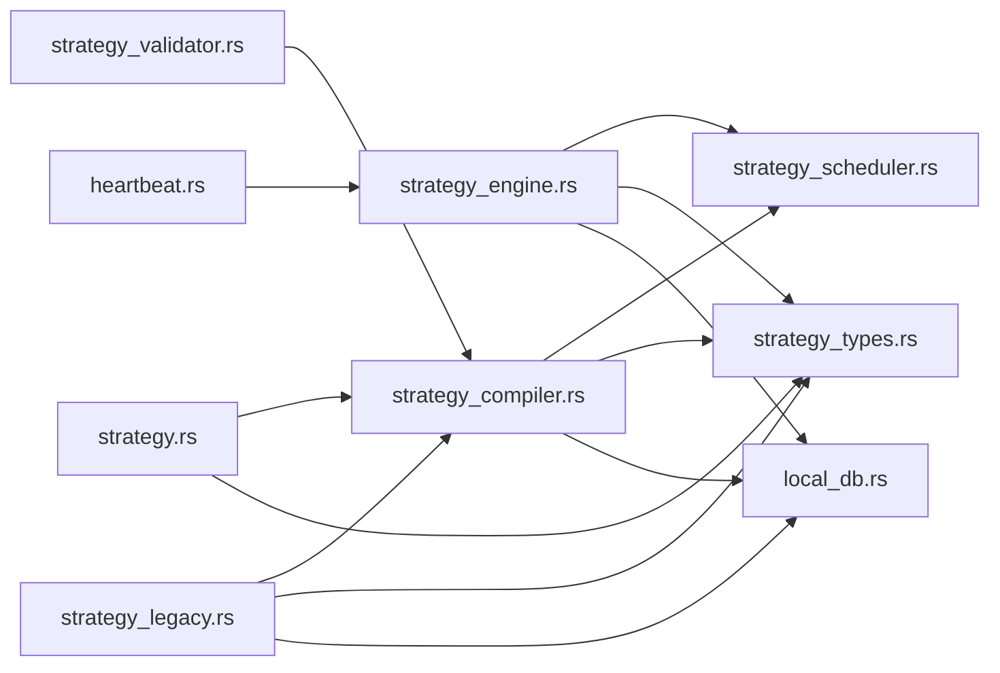

# Strategy Services

<cite>
**Referenced Files in This Document**
- [strategy_engine.rs](file://src-tauri/src/services/strategy_engine.rs)
- [strategy_compiler.rs](file://src-tauri/src/services/strategy_compiler.rs)
- [strategy_scheduler.rs](file://src-tauri/src/services/strategy_scheduler.rs)
- [strategy_validator.rs](file://src-tauri/src/services/strategy_validator.rs)
- [strategy_types.rs](file://src-tauri/src/services/strategy_types.rs)
- [strategy_legacy.rs](file://src-tauri/src/services/strategy_legacy.rs)
- [strategy.rs](file://src-tauri/src/commands/strategy.rs)
- [heartbeat.rs](file://src-tauri/src/services/heartbeat.rs)
- [local_db.rs](file://src-tauri/src/services/local_db.rs)
- [StrategyBuilder.tsx](file://src/components/strategy/StrategyBuilder.tsx)
</cite>

## Table of Contents
1. [Introduction](#introduction)
2. [Project Structure](#project-structure)
3. [Core Components](#core-components)
4. [Architecture Overview](#architecture-overview)
5. [Detailed Component Analysis](#detailed-component-analysis)
6. [Dependency Analysis](#dependency-analysis)
7. [Performance Considerations](#performance-considerations)
8. [Troubleshooting Guide](#troubleshooting-guide)
9. [Conclusion](#conclusion)
10. [Appendices](#appendices)

## Introduction
This document describes Shadow Protocol’s strategy services that power automated, auditable, and composable trading and monitoring strategies. It covers the strategy_engine service for evaluation and execution, strategy_compiler for parsing and validating strategy drafts into executable plans, strategy_scheduler for timing and scheduling, strategy_validator for structural and semantic checks, strategy_types for canonical data models, and strategy_legacy for backward compatibility and migration. It also documents integration via Tauri commands, heartbeat-driven evaluation, and UI workflows.

## Project Structure
The strategy domain spans Rust backend services and Tauri commands, with UI integration for building and inspecting strategies.

**Diagram sources**
- [StrategyBuilder.tsx](file://src/components/strategy/StrategyBuilder.tsx)
- [strategy.rs](file://src-tauri/src/commands/strategy.rs)
- [strategy_validator.rs](file://src-tauri/src/services/strategy_validator.rs)
- [strategy_compiler.rs](file://src-tauri/src/services/strategy_compiler.rs)
- [strategy_scheduler.rs](file://src-tauri/src/services/strategy_scheduler.rs)
- [strategy_engine.rs](file://src-tauri/src/services/strategy_engine.rs)
- [strategy_legacy.rs](file://src-tauri/src/services/strategy_legacy.rs)
- [heartbeat.rs](file://src-tauri/src/services/heartbeat.rs)
- [local_db.rs](file://src-tauri/src/services/local_db.rs)

**Section sources**
- [strategy.rs](file://src-tauri/src/commands/strategy.rs)
- [strategy_engine.rs](file://src-tauri/src/services/strategy_engine.rs)
- [strategy_compiler.rs](file://src-tauri/src/services/strategy_compiler.rs)
- [strategy_scheduler.rs](file://src-tauri/src/services/strategy_scheduler.rs)
- [strategy_validator.rs](file://src-tauri/src/services/strategy_validator.rs)
- [strategy_types.rs](file://src-tauri/src/services/strategy_types.rs)
- [strategy_legacy.rs](file://src-tauri/src/services/strategy_legacy.rs)
- [heartbeat.rs](file://src-tauri/src/services/heartbeat.rs)
- [local_db.rs](file://src-tauri/src/services/local_db.rs)
- [StrategyBuilder.tsx](file://src/components/strategy/StrategyBuilder.tsx)

## Core Components
- strategy_engine: Evaluates compiled strategies on heartbeat ticks, computes triggers and conditions, emits alerts or creates approvals, persists execution records, and updates strategy state.
- strategy_compiler: Validates strategy drafts, normalizes guardrails, constructs a linear pipeline from trigger to action, and produces a CompiledStrategyPlan.
- strategy_scheduler: Computes next-run timestamps based on trigger types and intervals.
- strategy_validator: Enforces structural and semantic rules for strategy drafts (node counts, edges, templates, guardrails).
- strategy_types: Defines canonical data structures for drafts, compiled plans, triggers, conditions, actions, guardrails, and validation issues.
- strategy_legacy: Infers templates and reconstructs drafts from legacy JSON, compiles them, and migrates historical strategies.
- Tauri commands: Expose compile, create/update, fetch, and execution history APIs to the UI.
- Heartbeat: Periodically loads due strategies and invokes the engine for evaluation.

**Section sources**
- [strategy_engine.rs](file://src-tauri/src/services/strategy_engine.rs)
- [strategy_compiler.rs](file://src-tauri/src/services/strategy_compiler.rs)
- [strategy_scheduler.rs](file://src-tauri/src/services/strategy_scheduler.rs)
- [strategy_validator.rs](file://src-tauri/src/services/strategy_validator.rs)
- [strategy_types.rs](file://src-tauri/src/services/strategy_types.rs)
- [strategy_legacy.rs](file://src-tauri/src/services/strategy_legacy.rs)
- [strategy.rs](file://src-tauri/src/commands/strategy.rs)
- [heartbeat.rs](file://src-tauri/src/services/heartbeat.rs)

## Architecture Overview
The system evaluates strategies on a fixed heartbeat. Strategies are authored in the UI, compiled into a plan, persisted, and executed according to schedule.

**Diagram sources**
- [StrategyBuilder.tsx](file://src/components/strategy/StrategyBuilder.tsx)
- [strategy.rs](file://src-tauri/src/commands/strategy.rs)
- [strategy_compiler.rs](file://src-tauri/src/services/strategy_compiler.rs)
- [strategy_validator.rs](file://src-tauri/src/services/strategy_validator.rs)
- [local_db.rs](file://src-tauri/src/services/local_db.rs)
- [heartbeat.rs](file://src-tauri/src/services/heartbeat.rs)
- [strategy_engine.rs](file://src-tauri/src/services/strategy_engine.rs)

## Detailed Component Analysis

### strategy_engine
Responsibilities:
- Load and parse compiled plan and execution policy from ActiveStrategy.
- Build evaluation context (portfolio USD, tokens, snapshot age).
- Evaluate trigger (time, drift, threshold).
- Evaluate conditions (portfolio floor, gas, slippage, asset availability, cooldown, drift minimum).
- Apply guardrails (max per trade, allowed chains, min portfolio).
- Determine notional and compute next run.
- Emit alerts or create approval requests; persist execution records; update strategy state.

Key behaviors:
- Skips when trigger not due; updates next_run_at accordingly.
- Blocks execution if any condition fails; persists skipped state.
- Pauses strategies exceeding max per trade guardrail and records audit events.
- Respects strategy mode (monitor_only, approval_required, pre_authorized) and execution policy fallback.
- Emits UI events for alerts and briefs.

Integration points:
- Uses strategy_scheduler for next-run computation.
- Persists StrategyExecutionRecord via local_db.
- Emits approval_request_created and shadow alert events.

**Diagram sources**
- [strategy_engine.rs](file://src-tauri/src/services/strategy_engine.rs)
- [strategy_scheduler.rs](file://src-tauri/src/services/strategy_scheduler.rs)
- [local_db.rs](file://src-tauri/src/services/local_db.rs)

**Section sources**
- [strategy_engine.rs](file://src-tauri/src/services/strategy_engine.rs)
- [strategy_scheduler.rs](file://src-tauri/src/services/strategy_scheduler.rs)
- [local_db.rs](file://src-tauri/src/services/local_db.rs)

### strategy_compiler
Responsibilities:
- Validate draft using strategy_validator.
- Normalize guardrails based on template.
- Derive a linear pipeline from trigger to action.
- Map draft nodes to StrategyTrigger, StrategyCondition, StrategyAction.
- Produce CompiledStrategyPlan with validation errors/warnings and normalization.

Key behaviors:
- Enforces exactly one trigger and one action.
- Ensures edges form a single linear chain with no cycles or disconnected nodes.
- Normalizes missing guardrails to safe defaults (except AlertOnly).
- Produces a valid plan or a plan with errors and a default AlertOnly action.

**Diagram sources**
- [strategy_compiler.rs](file://src-tauri/src/services/strategy_compiler.rs)
- [strategy_validator.rs](file://src-tauri/src/services/strategy_validator.rs)
- [strategy_types.rs](file://src-tauri/src/services/strategy_types.rs)

**Section sources**
- [strategy_compiler.rs](file://src-tauri/src/services/strategy_compiler.rs)
- [strategy_validator.rs](file://src-tauri/src/services/strategy_validator.rs)
- [strategy_types.rs](file://src-tauri/src/services/strategy_types.rs)

### strategy_scheduler
Responsibilities:
- Compute next evaluation timestamp given a StrategyTrigger and current time.
- Supports TimeInterval (hourly/daily/weekly/monthly), DriftThreshold, and Threshold triggers.

Behavior:
- TimeInterval adds interval seconds to now.
- DriftThreshold and Threshold clamp evaluation intervals to a bounded range and add to now.

**Section sources**
- [strategy_scheduler.rs](file://src-tauri/src/services/strategy_scheduler.rs)

### strategy_validator
Responsibilities:
- Structural validation: exactly one trigger and one action, linear chain, no cycles, no fan-out/fan-in violations.
- Template-specific validation: DCA requires TimeInterval trigger and DCA action; Rebalance allows TimeInterval or DriftThreshold; AlertOnly warns about time-based triggers.
- Guardrails validation: positive max per trade, positive daily notional when set, slippage within range, allowlist sanity checks.

**Section sources**
- [strategy_validator.rs](file://src-tauri/src/services/strategy_validator.rs)

### strategy_types
Responsibilities:
- Define StrategyDraft (nodes, edges, guardrails, policies).
- Define StrategyTrigger, StrategyCondition, StrategyAction variants.
- Define CompiledStrategyPlan and related structures.
- Define StrategyMode, StrategyStatus, StrategyTemplate enums.
- Define StrategyValidationIssue, ConditionResult, StrategyConditionPreview, EvaluationPreview, StrategySimulationResult.

**Section sources**
- [strategy_types.rs](file://src-tauri/src/services/strategy_types.rs)

### strategy_legacy
Responsibilities:
- Infer StrategyTemplate from legacy trigger/action JSON.
- Convert legacy JSON to StrategyDraft with inferred nodes/edges/guardrails.
- Compile legacy strategies and backfill compiled_plan_json and draft_graph_json.
- Persist migrated ActiveStrategy entries.

Integration:
- Uses compile_draft to produce CompiledStrategyPlan.
- Updates active_strategies with compiled JSON and status.

**Section sources**
- [strategy_legacy.rs](file://src-tauri/src/services/strategy_legacy.rs)
- [strategy_compiler.rs](file://src-tauri/src/services/strategy_compiler.rs)
- [local_db.rs](file://src-tauri/src/services/local_db.rs)

### Tauri Commands and UI Integration
Key commands:
- strategy_compile_draft: Compile a StrategyDraft and return StrategySimulationResult.
- strategy_create_from_draft: Create a new ActiveStrategy from a StrategyDraft.
- strategy_update_from_draft: Update an existing ActiveStrategy from a StrategyDraft.
- strategy_get: Fetch ActiveStrategy with optional parsed draft and plan.
- strategy_get_execution_history: Retrieve strategy execution records.

UI integration:
- StrategyBuilder.tsx orchestrates draft editing, compilation, saving, and activation.
- Validation feedback is surfaced in the builder UI and inspector.

**Section sources**
- [strategy.rs](file://src-tauri/src/commands/strategy.rs)
- [StrategyBuilder.tsx](file://src/components/strategy/StrategyBuilder.tsx)

## Dependency Analysis
High-level dependencies:
- strategy_engine depends on strategy_scheduler, strategy_types, local_db, and emits events.
- strategy_compiler depends on strategy_validator and strategy_types.
- strategy_scheduler depends on strategy_types.
- strategy_validator depends on strategy_types.
- strategy_legacy depends on strategy_compiler and strategy_types; migrates via local_db.
- heartbeat periodically invokes strategy_engine and local_db helpers.

**Diagram sources**
- [strategy_engine.rs](file://src-tauri/src/services/strategy_engine.rs)
- [strategy_compiler.rs](file://src-tauri/src/services/strategy_compiler.rs)
- [strategy_scheduler.rs](file://src-tauri/src/services/strategy_scheduler.rs)
- [strategy_validator.rs](file://src-tauri/src/services/strategy_validator.rs)
- [strategy_types.rs](file://src-tauri/src/services/strategy_types.rs)
- [strategy_legacy.rs](file://src-tauri/src/services/strategy_legacy.rs)
- [strategy.rs](file://src-tauri/src/commands/strategy.rs)
- [heartbeat.rs](file://src-tauri/src/services/heartbeat.rs)
- [local_db.rs](file://src-tauri/src/services/local_db.rs)

**Section sources**
- [strategy_engine.rs](file://src-tauri/src/services/strategy_engine.rs)
- [strategy_compiler.rs](file://src-tauri/src/services/strategy_compiler.rs)
- [strategy_scheduler.rs](file://src-tauri/src/services/strategy_scheduler.rs)
- [strategy_validator.rs](file://src-tauri/src/services/strategy_validator.rs)
- [strategy_types.rs](file://src-tauri/src/services/strategy_types.rs)
- [strategy_legacy.rs](file://src-tauri/src/services/strategy_legacy.rs)
- [strategy.rs](file://src-tauri/src/commands/strategy.rs)
- [heartbeat.rs](file://src-tauri/src/services/heartbeat.rs)
- [local_db.rs](file://src-tauri/src/services/local_db.rs)

## Performance Considerations
- Heartbeat cadence: The heartbeat runs every 60 seconds; ensure evaluation logic remains lightweight to avoid backlog.
- Trigger evaluation: DriftThreshold and Threshold triggers include bounded evaluation intervals to prevent excessive polling.
- Guardrails: Early exits on exceeded guardrails reduce unnecessary downstream work.
- Persistence: Minimize repeated writes by batching updates and leveraging upsert semantics.
- UI responsiveness: Keep compile previews asynchronous and debounced to avoid blocking the builder.

[No sources needed since this section provides general guidance]

## Troubleshooting Guide
Common issues and resolutions:
- Strategy not triggering:
  - Verify next_run_at and trigger evaluation; check strategy_scheduler computations.
  - Confirm portfolio snapshot freshness for drift thresholds.
- Strategy blocked by conditions:
  - Review condition previews and adjust guardrails or conditions.
- Approval required vs pre-authorized:
  - Ensure mode and execution policy align with desired behavior; monitor approval_request_created events.
- Validation errors:
  - Fix structural issues (node counts, edges) and template mismatches; address guardrail constraints.
- Migration failures:
  - Inspect legacy JSON fields and recompile via strategy_legacy; confirm compiled_plan_json is populated.

Operational logs:
- Heartbeat logs include evaluation results and failures; consecutive failures can auto-pause strategies.

**Section sources**
- [strategy_engine.rs](file://src-tauri/src/services/strategy_engine.rs)
- [strategy_scheduler.rs](file://src-tauri/src/services/strategy_scheduler.rs)
- [strategy_validator.rs](file://src-tauri/src/services/strategy_validator.rs)
- [strategy_legacy.rs](file://src-tauri/src/services/strategy_legacy.rs)
- [heartbeat.rs](file://src-tauri/src/services/heartbeat.rs)

## Conclusion
Shadow Protocol’s strategy services provide a robust, validated, and auditable framework for authoring, compiling, scheduling, and executing automation strategies. The separation of concerns across validator, compiler, scheduler, engine, and legacy migration ensures maintainability and extensibility while preserving backward compatibility.

[No sources needed since this section summarizes without analyzing specific files]

## Appendices

### Method Signatures and Responsibilities (paths)
- strategy_engine.evaluate_strategy: [strategy_engine.rs](file://src-tauri/src/services/strategy_engine.rs)
- strategy_compiler.compile_draft: [strategy_compiler.rs](file://src-tauri/src/services/strategy_compiler.rs)
- strategy_scheduler.compute_next_run: [strategy_scheduler.rs](file://src-tauri/src/services/strategy_scheduler.rs)
- strategy_validator.validate_draft: [strategy_validator.rs](file://src-tauri/src/services/strategy_validator.rs)
- strategy_types (enums, structs): [strategy_types.rs](file://src-tauri/src/services/strategy_types.rs)
- strategy_legacy (infer and migrate): [strategy_legacy.rs](file://src-tauri/src/services/strategy_legacy.rs)
- Tauri commands (compile/create/update/get/history): [strategy.rs](file://src-tauri/src/commands/strategy.rs)
- Heartbeat loop: [heartbeat.rs](file://src-tauri/src/services/heartbeat.rs)

### Example Workflows (paths)
- Strategy creation and activation (UI to backend):
  - [StrategyBuilder.tsx](file://src/components/strategy/StrategyBuilder.tsx)
  - [strategy.rs](file://src-tauri/src/commands/strategy.rs)
- Strategy execution and monitoring (heartbeat to engine):
  - [heartbeat.rs](file://src-tauri/src/services/heartbeat.rs)
  - [strategy_engine.rs](file://src-tauri/src/services/strategy_engine.rs)
- Legacy migration:
  - [strategy_legacy.rs](file://src-tauri/src/services/strategy_legacy.rs)

### Security and Compliance Notes
- Guardrails enforce per-trade and daily notional caps, slippage limits, and chain allowlists.
- Approval flows ensure human oversight for fund-moving actions.
- Audit logging records strategy lifecycle events and pauses.

**Section sources**
- [strategy_engine.rs](file://src-tauri/src/services/strategy_engine.rs)
- [strategy_types.rs](file://src-tauri/src/services/strategy_types.rs)
- [local_db.rs](file://src-tauri/src/services/local_db.rs)