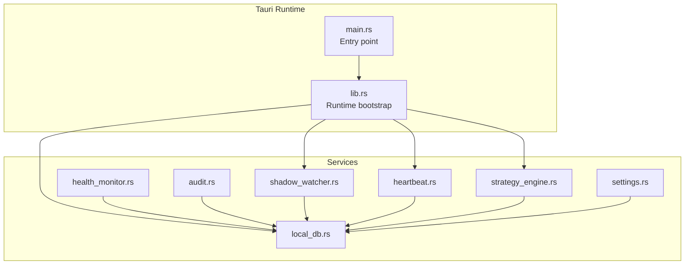
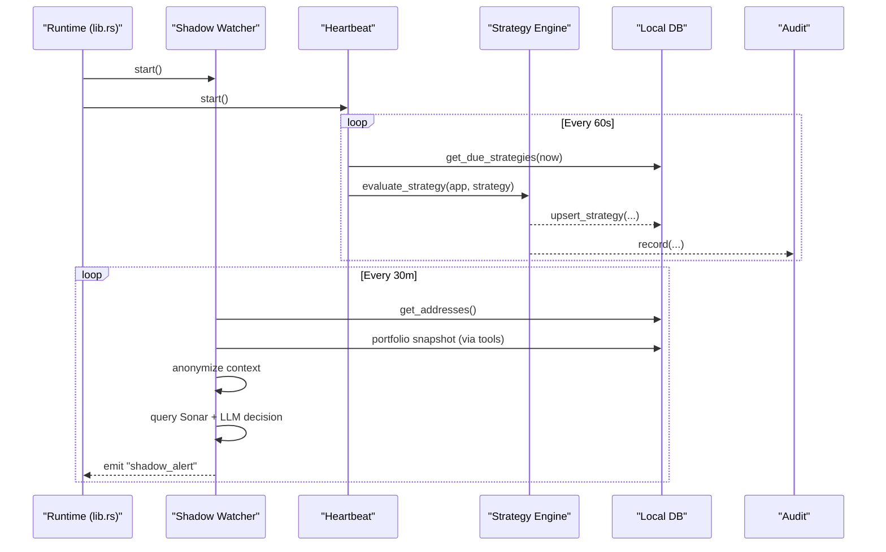
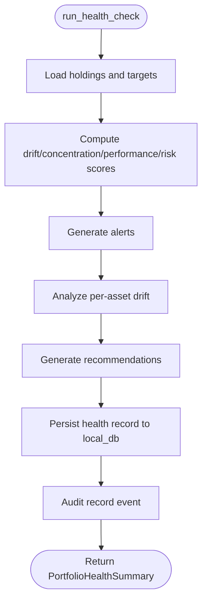
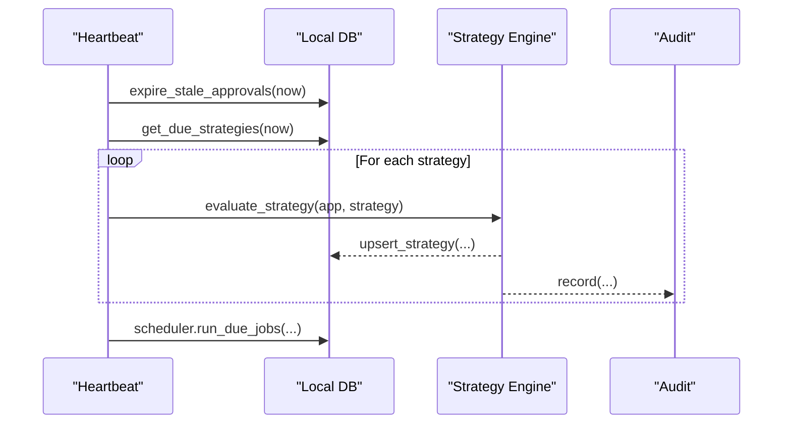
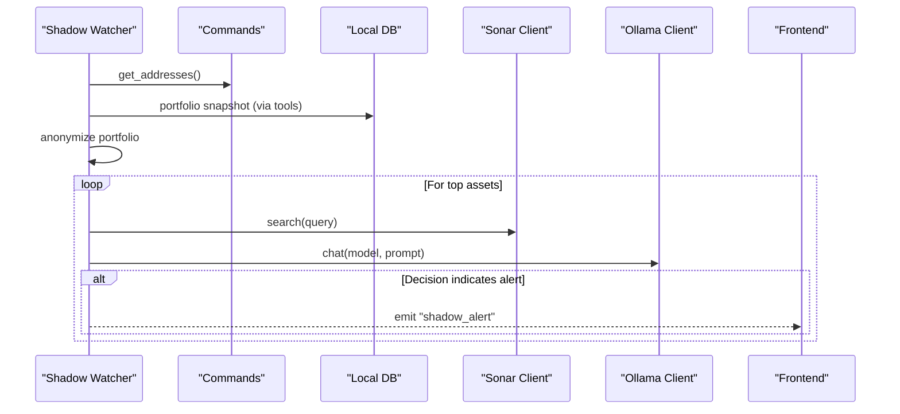
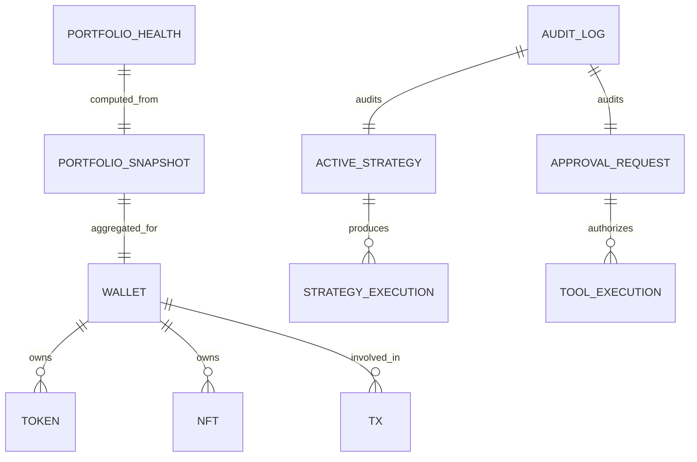
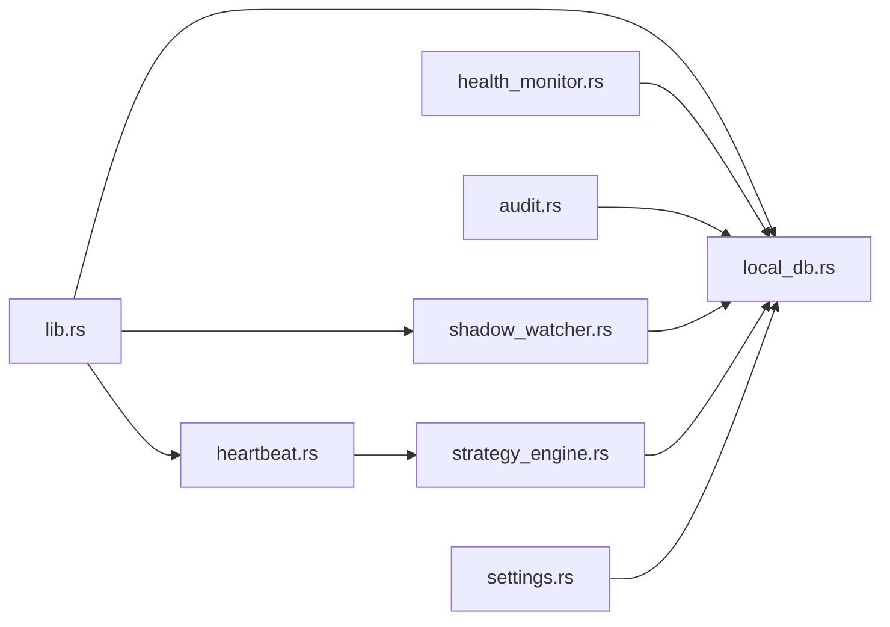

# System & Monitoring Services

<cite>
**Referenced Files in This Document**
- [health_monitor.rs](file://src-tauri/src/services/health_monitor.rs)
- [heartbeat.rs](file://src-tauri/src/services/heartbeat.rs)
- [shadow_watcher.rs](file://src-tauri/src/services/shadow_watcher.rs)
- [audit.rs](file://src-tauri/src/services/audit.rs)
- [local_db.rs](file://src-tauri/src/services/local_db.rs)
- [settings.rs](file://src-tauri/src/services/settings.rs)
- [strategy_engine.rs](file://src-tauri/src/services/strategy_engine.rs)
- [lib.rs](file://src-tauri/src/lib.rs)
- [mod.rs](file://src-tauri/src/services/mod.rs)
- [main.rs](file://src-tauri/src/main.rs)
</cite>

## Table of Contents
1. [Introduction](#introduction)
2. [Project Structure](#project-structure)
3. [Core Components](#core-components)
4. [Architecture Overview](#architecture-overview)
5. [Detailed Component Analysis](#detailed-component-analysis)
6. [Dependency Analysis](#dependency-analysis)
7. [Performance Considerations](#performance-considerations)
8. [Troubleshooting Guide](#troubleshooting-guide)
9. [Conclusion](#conclusion)
10. [Appendices](#appendices)

## Introduction
This document describes Shadow Protocol’s system and monitoring services. It covers:
- Health monitoring and portfolio health assessment
- Heartbeat-driven strategy evaluation and lifecycle management
- Shadow Watcher for proactive surveillance and anomaly detection
- Audit logging for compliance and activity tracking
- Local database for persistent storage, indexing, and analytics
- Settings service for secure configuration and secret management
- Service interfaces, monitoring dashboards, alerting mechanisms, and practical workflows

The goal is to provide a clear understanding of how these services interact, what they expose, and how to operate them effectively for performance monitoring, security auditing, and system diagnostics.

## Project Structure
Shadow Protocol’s backend services live under src-tauri/src/services and are wired into the Tauri runtime in src-tauri/src/lib.rs. The services module aggregates all service crates, and the main entry point initializes the database and starts background monitors.

**Diagram sources**
- [lib.rs:34-89](file://src-tauri/src/lib.rs#L34-L89)
- [mod.rs:1-37](file://src-tauri/src/services/mod.rs#L1-L37)

**Section sources**
- [lib.rs:34-89](file://src-tauri/src/lib.rs#L34-L89)
- [mod.rs:1-37](file://src-tauri/src/services/mod.rs#L1-L37)

## Core Components
- Health Monitor: Computes portfolio health scores, drift, concentration, risk, and generates actionable alerts and recommendations.
- Heartbeat: Periodic tick that evaluates due strategies, manages approvals, and schedules recurring tasks.
- Shadow Watcher: Proactive surveillance using anonymized portfolio context, optional news retrieval, and local LLM evaluation to emit alerts.
- Audit: Centralized logging of events with structured JSON payloads for compliance and forensics.
- Local DB: SQLite-backed schema for on-chain data, strategies, approvals, executions, audits, and health records.
- Settings: Secure secret storage via OS keychain with in-memory caching and environment fallbacks.

**Section sources**
- [health_monitor.rs:107-221](file://src-tauri/src/services/health_monitor.rs#L107-L221)
- [heartbeat.rs:10-75](file://src-tauri/src/services/heartbeat.rs#L10-L75)
- [shadow_watcher.rs:29-61](file://src-tauri/src/services/shadow_watcher.rs#L29-L61)
- [audit.rs:5-25](file://src-tauri/src/services/audit.rs#L5-L25)
- [local_db.rs:10-416](file://src-tauri/src/services/local_db.rs#L10-L416)
- [settings.rs:1-243](file://src-tauri/src/services/settings.rs#L1-L243)

## Architecture Overview
The runtime initializes the local database, then spawns:
- Shadow Watcher: Runs every 30 minutes after a short startup delay.
- Heartbeat: Runs every 60 seconds, evaluating due strategies and managing approvals.
- Strategy Engine: Executes strategy actions upon approval or monitor-only modes.
- Audit and Health Monitor: Persist health records and log events for compliance.

**Diagram sources**
- [lib.rs:53-56](file://src-tauri/src/lib.rs#L53-L56)
- [heartbeat.rs:10-75](file://src-tauri/src/services/heartbeat.rs#L10-L75)
- [strategy_engine.rs:343-400](file://src-tauri/src/services/strategy_engine.rs#L343-L400)
- [shadow_watcher.rs:77-160](file://src-tauri/src/services/shadow_watcher.rs#L77-L160)

## Detailed Component Analysis

### Health Monitor Service
Purpose:
- Assess portfolio health by computing drift, concentration, performance, and risk.
- Generate alerts, drift analysis, and recommendations.
- Persist health records and log audit events.

Key behaviors:
- Drift score: Average deviation from target allocations.
- Concentration score: Based on Herfindahl-Hirschman Index and penalties for large single positions.
- Risk score: Penalizes non-stablecoin exposure and chain concentration.
- Alerts: High drift, high concentration, large holdings, elevated risk.
- Recommendations: Derived from alerts and drift analysis.

**Diagram sources**
- [health_monitor.rs:107-221](file://src-tauri/src/services/health_monitor.rs#L107-L221)

**Section sources**
- [health_monitor.rs:107-221](file://src-tauri/src/services/health_monitor.rs#L107-L221)
- [health_monitor.rs:223-347](file://src-tauri/src/services/health_monitor.rs#L223-L347)
- [health_monitor.rs:349-507](file://src-tauri/src/services/health_monitor.rs#L349-L507)

### Heartbeat Service
Purpose:
- Periodic maintenance and strategy evaluation.
- Expiration of stale approvals and scheduling of due jobs.

Behavior:
- Interval: 60 seconds.
- Loads due strategies, evaluates each, updates persistence, and logs outcomes.
- Auto-pauses strategies after consecutive failures and audits the pause.

**Diagram sources**
- [heartbeat.rs:10-75](file://src-tauri/src/services/heartbeat.rs#L10-L75)
- [strategy_engine.rs:343-400](file://src-tauri/src/services/strategy_engine.rs#L343-L400)

**Section sources**
- [heartbeat.rs:10-75](file://src-tauri/src/services/heartbeat.rs#L10-L75)
- [strategy_engine.rs:343-400](file://src-tauri/src/services/strategy_engine.rs#L343-L400)

### Shadow Watcher Service
Purpose:
- Proactive surveillance of top portfolio positions.
- Optional news aggregation and local LLM evaluation to decide whether to emit alerts.

Behavior:
- Interval: 30 minutes (after a short initial delay).
- Retrieves wallet addresses and portfolio totals.
- Selects top assets, anonymizes context, queries Sonar for recent news, and asks a local LLM to assess risk.
- Emits a frontend event for alerts.

**Diagram sources**
- [shadow_watcher.rs:29-61](file://src-tauri/src/services/shadow_watcher.rs#L29-L61)
- [shadow_watcher.rs:77-160](file://src-tauri/src/services/shadow_watcher.rs#L77-L160)

**Section sources**
- [shadow_watcher.rs:29-61](file://src-tauri/src/services/shadow_watcher.rs#L29-L61)
- [shadow_watcher.rs:77-160](file://src-tauri/src/services/shadow_watcher.rs#L77-L160)

### Audit Service
Purpose:
- Centralized event logging with structured payloads for compliance and diagnostics.

Behavior:
- Records events with type, subject, optional ID, and details JSON.
- Persists to local DB audit log table.

**Section sources**
- [audit.rs:5-25](file://src-tauri/src/services/audit.rs#L5-L25)
- [local_db.rs:169-178](file://src-tauri/src/services/local_db.rs#L169-L178)

### Local DB Service
Purpose:
- Persistent storage for on-chain data, strategies, approvals, executions, audits, and health records.
- Provides CRUD helpers and indexes for efficient queries.

Highlights:
- Schema includes tables for wallets, tokens, NFTs, transactions, portfolio snapshots, strategies, approvals, executions, audits, market opportunities, apps, tasks, behavior events, guardrails, and reasoning chains.
- Includes helpers to manage strategies, approvals, and health records.
- Migration support for evolving schemas.

**Diagram sources**
- [local_db.rs:10-416](file://src-tauri/src/services/local_db.rs#L10-L416)

**Section sources**
- [local_db.rs:10-416](file://src-tauri/src/services/local_db.rs#L10-L416)
- [local_db.rs:505-516](file://src-tauri/src/services/local_db.rs#L505-L516)
- [local_db.rs:802-813](file://src-tauri/src/services/local_db.rs#L802-L813)

### Settings Service
Purpose:
- Secure secret storage using OS keychain with in-memory caching to minimize repeated prompts.
- Environment variable fallback for API keys.
- Utilities to clear all application data including secrets, DB, and session caches.

Key features:
- Cached API keys for Perplexity, Alchemy, and Ollama.
- App-scoped secrets with keyring entries.
- Deletion of all data including biometric data and DB truncation.

**Section sources**
- [settings.rs:1-243](file://src-tauri/src/services/settings.rs#L1-L243)

## Dependency Analysis
- Runtime bootstrap initializes the database and starts Shadow Watcher, Heartbeat, and Market services.
- Health Monitor depends on Local DB for persistence and Audit for logging.
- Heartbeat depends on Local DB for strategy and approval state and Strategy Engine for evaluation.
- Shadow Watcher depends on anonymization, Sonar client, and Ollama client; emits frontend events.
- Audit is used across services to maintain a consistent audit trail.
- Settings integrates with keychain and session management.

**Diagram sources**
- [lib.rs:43-89](file://src-tauri/src/lib.rs#L43-L89)
- [mod.rs:1-37](file://src-tauri/src/services/mod.rs#L1-L37)

**Section sources**
- [lib.rs:43-89](file://src-tauri/src/lib.rs#L43-L89)
- [mod.rs:1-37](file://src-tauri/src/services/mod.rs#L1-L37)

## Performance Considerations
- Heartbeat interval: 60 seconds balances responsiveness with CPU usage.
- Shadow Watcher interval: 30 minutes reduces external API load while keeping surveillance timely.
- Local DB indexing: Strategic indexes on timestamps and foreign keys improve query performance for snapshots, executions, and logs.
- In-memory API key cache: Reduces repeated OS keychain access and biometric prompts.
- Strategy evaluation: Guardrails prevent excessive trades and protect from misconfiguration.

[No sources needed since this section provides general guidance]

## Troubleshooting Guide
Common scenarios and remedies:
- Missing API keys or services:
  - Shadow Watcher gracefully skips cycles when services are unavailable and logs at warning level for expected failures.
  - Settings supports environment variable fallbacks for Alchemy key.
- Stale data or approvals:
  - Heartbeat periodically expires stale approvals and auto-pauses failing strategies after consecutive failures.
- Health monitoring:
  - Health records are persisted and can be retrieved for diagnostics; ensure Local DB is initialized and healthy.
- Audit trails:
  - Verify audit log inserts succeed; payloads are JSON-serialized for traceability.

**Section sources**
- [shadow_watcher.rs:64-75](file://src-tauri/src/services/shadow_watcher.rs#L64-L75)
- [settings.rs:197-200](file://src-tauri/src/services/settings.rs#L197-L200)
- [heartbeat.rs:44-68](file://src-tauri/src/services/heartbeat.rs#L44-L68)
- [local_db.rs:169-178](file://src-tauri/src/services/local_db.rs#L169-L178)

## Conclusion
Shadow Protocol’s monitoring and system services form a cohesive runtime:
- Health Monitor provides portfolio insights and recommendations.
- Heartbeat ensures continuous strategy evaluation and lifecycle management.
- Shadow Watcher adds proactive surveillance with optional external data and local LLM evaluation.
- Audit and Local DB provide robust persistence and compliance-ready logging.
- Settings centralizes secure configuration and secret management.

These components integrate cleanly via Tauri and offer extensibility for dashboards, alerting, and advanced diagnostics.

[No sources needed since this section summarizes without analyzing specific files]

## Appendices

### Service Interfaces and Monitoring Dashboards
- Health Dashboard: Use health summaries and recommendations to drive UI panels and alerts.
- Strategy Execution Dashboard: View strategy evaluations, approvals, and execution outcomes.
- Audit Dashboard: Filter and search audit logs by event type, subject, and timestamp.
- Shadow Alerts: Surface real-time risk notifications in the UI.

[No sources needed since this section provides general guidance]

### Alerting Mechanisms
- Heartbeat: Emits strategy evaluation outcomes and pauses with audit records.
- Shadow Watcher: Emits “shadow_alert” events for high-severity conditions.
- Strategy Engine: Emits monitor-only signals and approval requests.

**Section sources**
- [strategy_engine.rs:331-341](file://src-tauri/src/services/strategy_engine.rs#L331-L341)
- [shadow_watcher.rs:148-155](file://src-tauri/src/services/shadow_watcher.rs#L148-L155)

### Examples: System Monitoring, Health Reporting, Maintenance Workflows
- Portfolio Health Report:
  - Trigger health check with holdings and target allocations.
  - Review component scores, alerts, drift analysis, and recommendations.
  - Persist and audit the result.
- Strategy Lifecycle:
  - Create and compile a strategy; mark as active.
  - Heartbeat evaluates triggers and conditions; creates approvals when required.
  - Approve or reject; observe execution and audit logs.
- Surveillance Cycle:
  - Configure API keys and ensure services are running.
  - Observe emitted shadow alerts and review anonymized portfolio context.
- Maintenance:
  - Use settings to clear all data safely, including secrets and DB.

**Section sources**
- [health_monitor.rs:107-221](file://src-tauri/src/services/health_monitor.rs#L107-L221)
- [strategy_engine.rs:343-400](file://src-tauri/src/services/strategy_engine.rs#L343-L400)
- [shadow_watcher.rs:77-160](file://src-tauri/src/services/shadow_watcher.rs#L77-L160)
- [settings.rs:203-242](file://src-tauri/src/services/settings.rs#L203-L242)