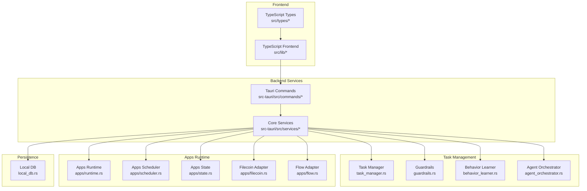
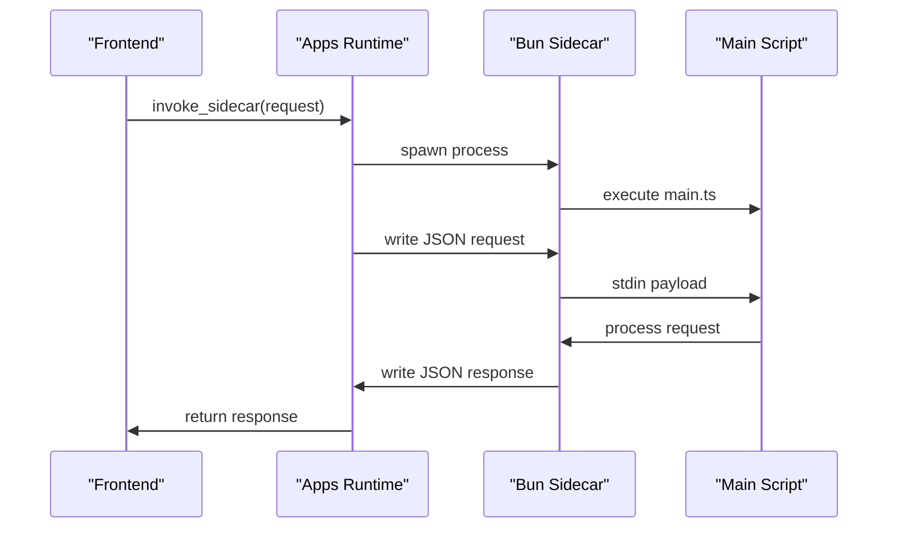
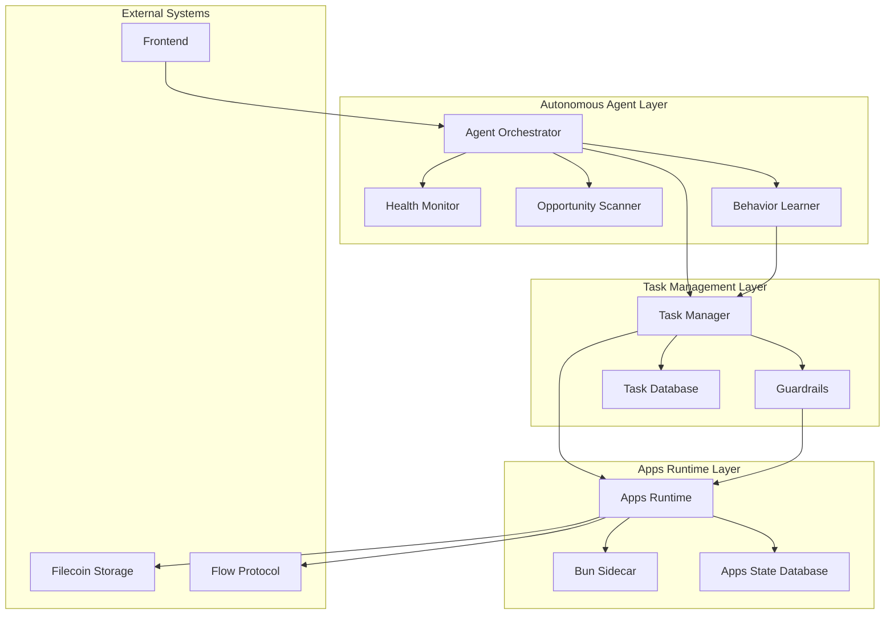
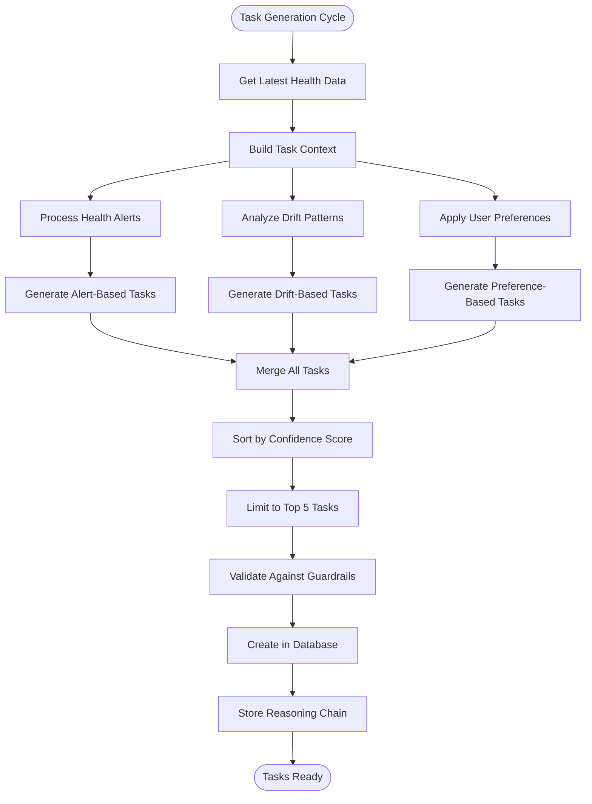
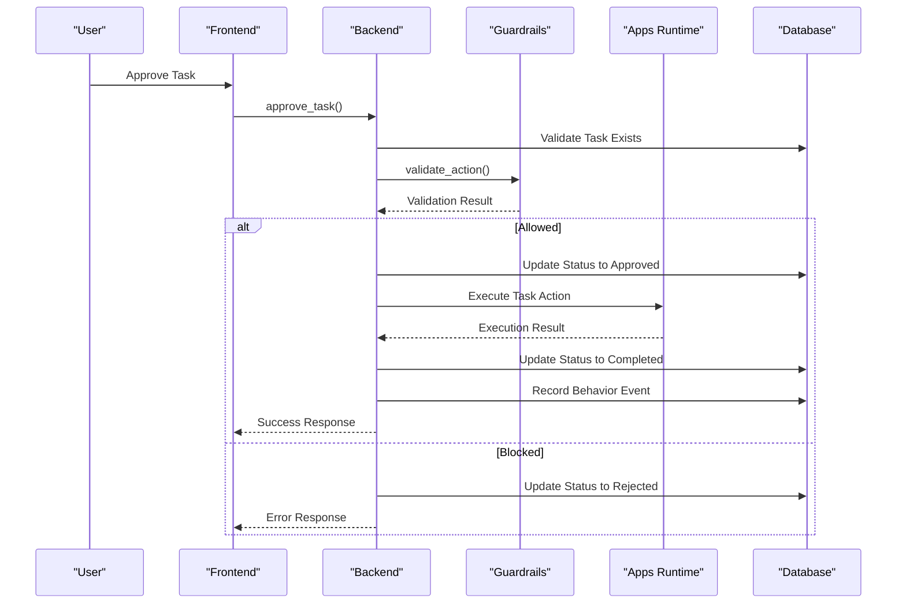
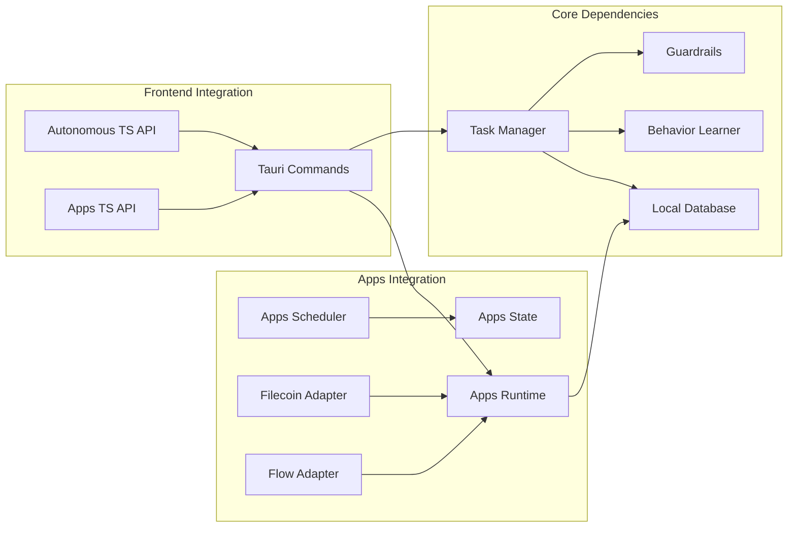

# Task Management Services

<cite>
**Referenced Files in This Document**
- [task_manager.rs](file://src-tauri/src/services/task_manager.rs)
- [runtime.rs](file://src-tauri/src/services/apps/runtime.rs)
- [scheduler.rs](file://src-tauri/src/services/apps/scheduler.rs)
- [state.rs](file://src-tauri/src/services/apps/state.rs)
- [local_db.rs](file://src-tauri/src/services/local_db.rs)
- [guardrails.rs](file://src-tauri/src/services/guardrails.rs)
- [behavior_learner.rs](file://src-tauri/src/services/behavior_learner.rs)
- [filecoin.rs](file://src-tauri/src/services/apps/filecoin.rs)
- [flow.rs](file://src-tauri/src/services/apps/flow.rs)
- [apps.rs](file://src-tauri/src/commands/apps.rs)
- [autonomous.rs](file://src-tauri/src/commands/autonomous.rs)
- [agent_orchestrator.rs](file://src-tauri/src/services/agent_orchestrator.rs)
- [apps.ts](file://src/lib/apps.ts)
- [autonomous.ts](file://src/lib/autonomous.ts)
- [apps.ts](file://src-tauri/src/services/apps/mod.rs)
</cite>

## Table of Contents
1. [Introduction](#introduction)
2. [Project Structure](#project-structure)
3. [Core Components](#core-components)
4. [Architecture Overview](#architecture-overview)
5. [Detailed Component Analysis](#detailed-component-analysis)
6. [Dependency Analysis](#dependency-analysis)
7. [Performance Considerations](#performance-considerations)
8. [Troubleshooting Guide](#troubleshooting-guide)
9. [Conclusion](#conclusion)

## Introduction
This document provides comprehensive documentation for Shadow Protocol's task management services, focusing on three core areas:
- Task Manager: Proactive task generation, scheduling, execution coordination, and resource management
- Apps Runtime: Application execution environment, lifecycle management, and isolation
- Apps Scheduler: Task prioritization, queue management, and execution timing

The system integrates autonomous agent orchestration with guardrails, behavior learning, and a robust SQLite-backed persistence layer. It supports crash-isolated execution through a dedicated sidecar runtime and provides comprehensive monitoring, analytics, and safety controls.

## Project Structure
The task management ecosystem spans both Rust backend services and TypeScript frontend bindings:

**Diagram sources**
- [apps.ts:1-15](file://src-tauri/src/services/apps/mod.rs#L1-L15)
- [autonomous.rs:1-783](file://src-tauri/src/commands/autonomous.rs#L1-L783)
- [task_manager.rs:1-630](file://src-tauri/src/services/task_manager.rs#L1-L630)

**Section sources**
- [apps.ts:1-15](file://src-tauri/src/services/apps/mod.rs#L1-L15)
- [autonomous.rs:1-783](file://src-tauri/src/commands/autonomous.rs#L1-L783)

## Core Components

### Task Manager Service
The task manager generates proactive tasks from portfolio health alerts, market opportunities, and user behavior patterns. It manages the complete task lifecycle from suggestion to completion with comprehensive validation and safety controls.

**Key Features:**
- Proactive task generation from health monitoring and drift analysis
- Multi-tier priority system (Low, Medium, High, Urgent)
- Comprehensive task validation through guardrails
- Behavior learning integration for preference modeling
- Expiration handling and cleanup mechanisms

**Task Lifecycle:**
1. Generation from health alerts and drift analysis
2. Validation against guardrails and user preferences
3. Approval/rejection workflow
4. Execution coordination
5. Completion/failure tracking with behavior learning

**Section sources**
- [task_manager.rs:1-630](file://src-tauri/src/services/task_manager.rs#L1-L630)

### Apps Runtime Service
The apps runtime provides a secure, crash-isolated execution environment for bundled applications using a dedicated Bun sidecar process. Each request runs in a separate process for maximum isolation.

**Key Features:**
- One-request-per-process isolation model
- Secure sidecar communication via stdin/stdout
- Configurable timeout handling (45 seconds default)
- Comprehensive error handling and logging
- Automatic process cleanup and resource management

**Execution Pattern:**

**Diagram sources**
- [runtime.rs:69-131](file://src-tauri/src/services/apps/runtime.rs#L69-L131)

**Section sources**
- [runtime.rs:1-144](file://src-tauri/src/services/apps/runtime.rs#L1-L144)

### Apps Scheduler Service
The apps scheduler manages bundled application jobs with configurable intervals and execution policies. It coordinates recurring tasks like Filecoin backups and Flow transaction preparation.

**Key Features:**
- Configurable job intervals and schedules
- Job gating based on app readiness
- Automatic job execution and result recording
- Audit logging for all scheduler activities
- Graceful error handling and recovery

**Supported Jobs:**
- Filecoin automatic backup uploads
- Flow recurring transaction preparation
- Configurable execution policies

**Section sources**
- [scheduler.rs:1-96](file://src-tauri/src/services/apps/scheduler.rs#L1-L96)

## Architecture Overview

**Diagram sources**
- [agent_orchestrator.rs:1-571](file://src-tauri/src/services/agent_orchestrator.rs#L1-L571)
- [task_manager.rs:1-630](file://src-tauri/src/services/task_manager.rs#L1-L630)
- [runtime.rs:1-144](file://src-tauri/src/services/apps/runtime.rs#L1-L144)

## Detailed Component Analysis

### Task Generation and Scheduling Algorithms

The task generation system implements a multi-source approach with sophisticated prioritization:

**Diagram sources**
- [task_manager.rs:167-195](file://src-tauri/src/services/task_manager.rs#L167-L195)
- [task_manager.rs:368-390](file://src-tauri/src/services/task_manager.rs#L368-L390)

**Task Priority Determination:**
- Health alerts: Critical → High → Medium based on severity
- Drift analysis: Over 20% drift → High, otherwise Medium
- User preferences: Confidence-weighted scoring
- Time-sensitive tasks: Urgent priority

**Section sources**
- [task_manager.rs:167-387](file://src-tauri/src/services/task_manager.rs#L167-L387)

### Task Execution Coordination

The task execution workflow ensures safety and traceability:

**Diagram sources**
- [task_manager.rs:429-520](file://src-tauri/src/services/task_manager.rs#L429-L520)
- [guardrails.rs:278-426](file://src-tauri/src/services/guardrails.rs#L278-L426)

**Section sources**
- [task_manager.rs:429-551](file://src-tauri/src/services/task_manager.rs#L429-L551)
- [guardrails.rs:278-426](file://src-tauri/src/services/guardrails.rs#L278-L426)

### Resource Management and Concurrency

The system implements several concurrency and resource management strategies:

**Process Isolation:**
- Each apps runtime request executes in a separate Bun process
- Automatic process cleanup with kill_on_drop
- Resource limits through timeout mechanisms

**Database Concurrency:**
- Centralized SQLite connection management
- Atomic operations for state transitions
- Index-based query optimization for task retrieval

**Memory Management:**
- Task expiration handling (default 15 minutes)
- Cleanup routines for expired and dismissed tasks
- Behavior learning memory optimization

**Section sources**
- [runtime.rs:77-84](file://src-tauri/src/services/apps/runtime.rs#L77-L84)
- [local_db.rs:505-516](file://src-tauri/src/services/local_db.rs#L505-L516)

### Error Handling and Safety Controls

The system implements comprehensive error handling across all layers:

**Guardrails Implementation:**
- Emergency kill switch for complete system shutdown
- Configurable spending limits and approval thresholds
- Chain and protocol restrictions
- Time-based execution windows

**Task Safety:**
- Expiration-based task cleanup
- Validation before execution
- Audit logging for all actions
- Graceful error propagation

**Section sources**
- [guardrails.rs:14-620](file://src-tauri/src/services/guardrails.rs#L14-L620)
- [task_manager.rs:432-443](file://src-tauri/src/services/task_manager.rs#L432-L443)

## Dependency Analysis

**Diagram sources**
- [autonomous.rs:8-11](file://src-tauri/src/commands/autonomous.rs#L8-L11)
- [apps.rs:6-8](file://src-tauri/src/commands/apps.rs#L6-L8)

**Section sources**
- [autonomous.rs:8-11](file://src-tauri/src/commands/autonomous.rs#L8-L11)
- [apps.rs:6-8](file://src-tauri/src/commands/apps.rs#L6-L8)

## Performance Considerations

### Database Optimization
- Indexed task queries by status, priority, and creation time
- Efficient pagination for task retrieval (default 50 tasks)
- Batch operations for bulk data management
- Connection pooling for concurrent access

### Memory Management
- Task expiration cleanup reduces database bloat
- Behavior learning uses incremental updates
- Streaming JSON parsing for large payloads
- Configurable limits on pending tasks (default 10)

### Network and I/O
- Asynchronous processing for external API calls
- Timeout handling for external services
- Efficient serialization/deserialization
- Minimal data transfer between processes

### Concurrency Patterns
- Tokio-based async runtime for non-blocking operations
- Atomic state management for orchestrator
- Thread-safe configuration loading
- Graceful degradation on failures

## Troubleshooting Guide

### Common Issues and Solutions

**Task Approval Failures:**
- Verify guardrails configuration allows the proposed action
- Check kill switch status if all actions are blocked
- Review token and protocol restrictions
- Validate spending limits and approval thresholds

**Apps Runtime Issues:**
- Ensure Bun is properly installed and accessible
- Verify apps-runtime script path exists
- Check sidecar process spawning permissions
- Monitor timeout errors (default 45 seconds)

**Database Connectivity:**
- Verify SQLite file permissions
- Check database initialization status
- Review migration compatibility
- Monitor connection pool exhaustion

**Task Generation Problems:**
- Confirm health monitor data availability
- Verify behavior learner preferences
- Check orchestrator configuration
- Review task expiration settings

**Section sources**
- [runtime.rs:13-26](file://src-tauri/src/services/apps/runtime.rs#L13-L26)
- [guardrails.rs:232-275](file://src-tauri/src/services/guardrails.rs#L232-L275)
- [local_db.rs:418-435](file://src-tauri/src/services/local_db.rs#L418-L435)

## Conclusion

Shadow Protocol's task management services provide a comprehensive, secure, and scalable framework for autonomous task execution. The system combines:

- **Robust Task Management**: Multi-source generation, sophisticated prioritization, and comprehensive lifecycle management
- **Secure Execution**: Crash-isolated sidecar processes with strict safety controls
- **Intelligent Orchestration**: Behavior learning integration and real-time decision-making
- **Production-Ready Infrastructure**: Comprehensive error handling, monitoring, and performance optimization

The modular architecture enables easy extension and maintenance while maintaining strong security guarantees and operational reliability. The integration of guardrails, behavior learning, and comprehensive auditing creates a transparent and trustworthy autonomous system.