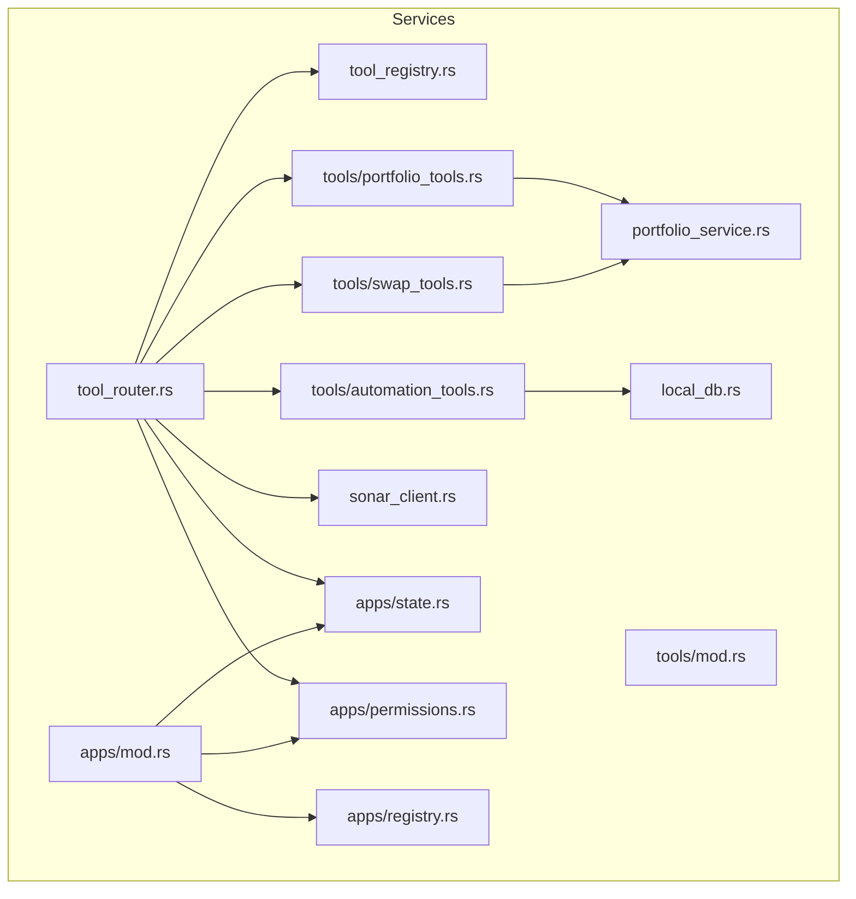
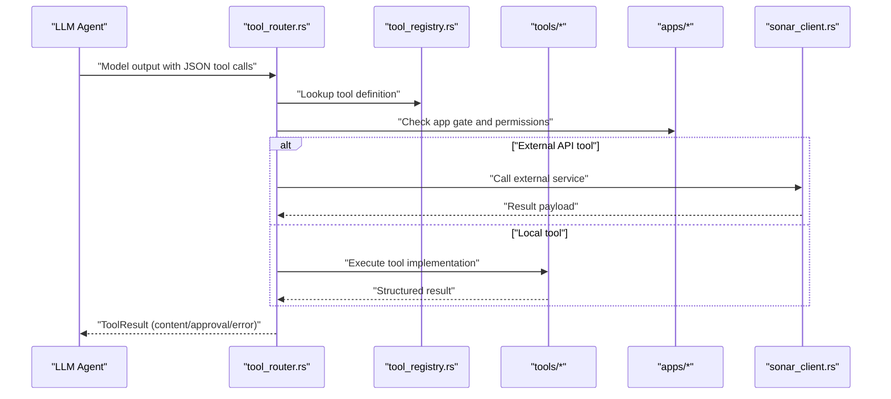
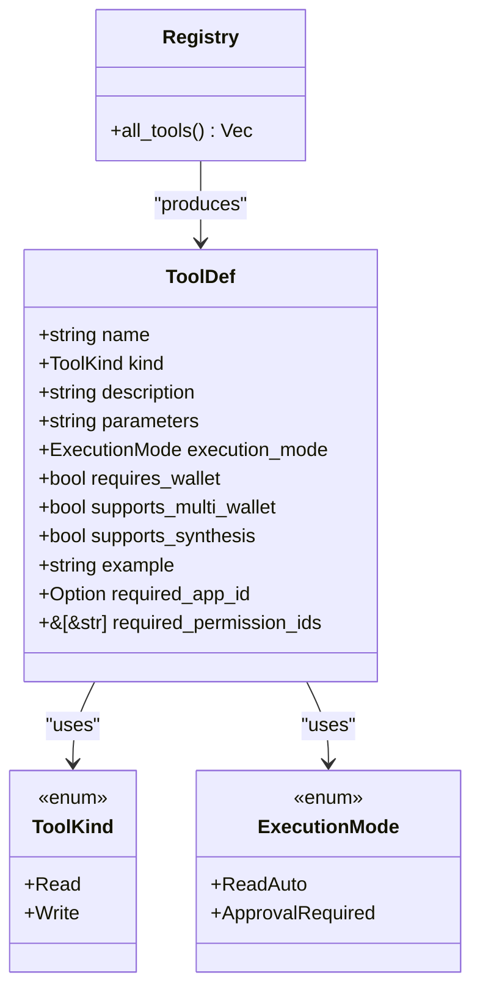
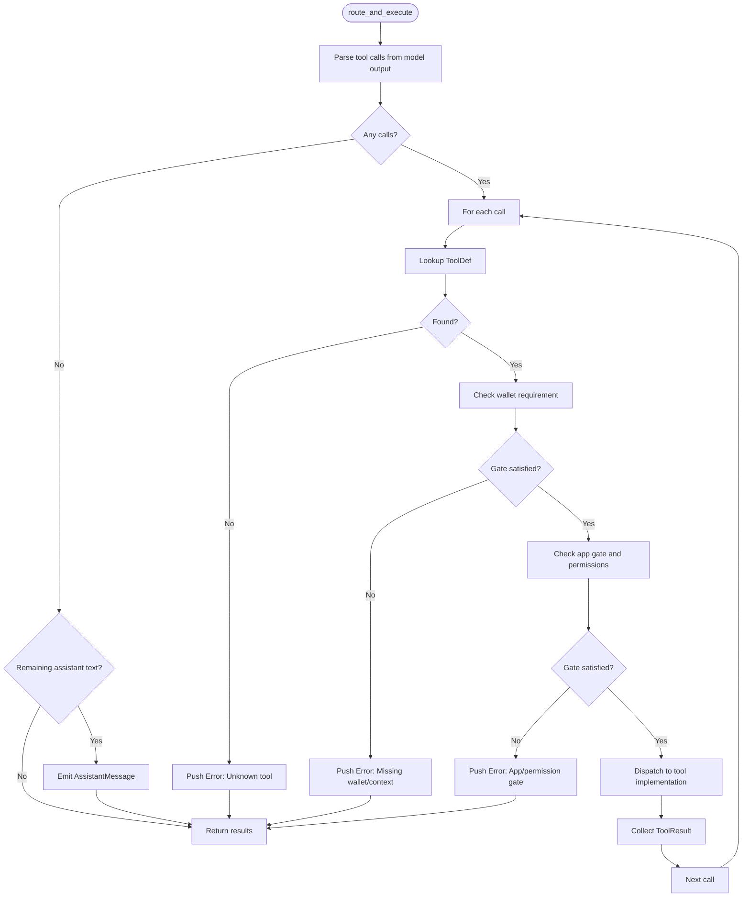
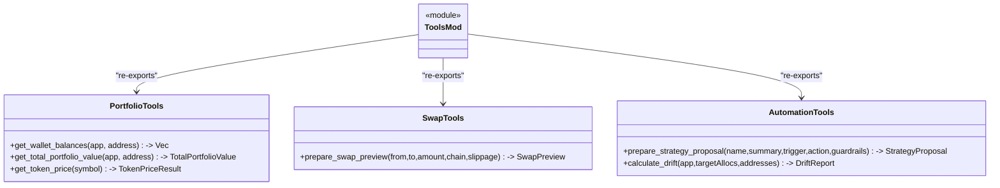
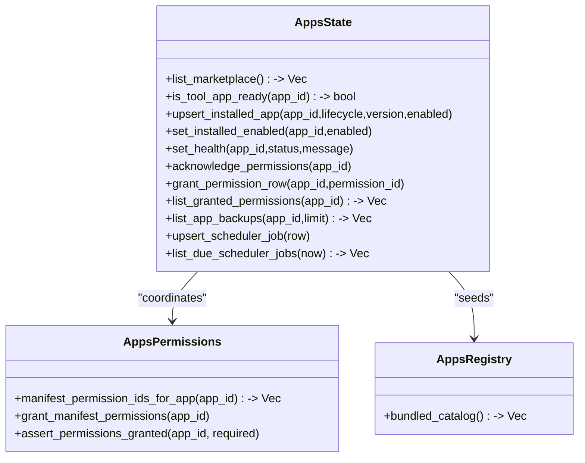
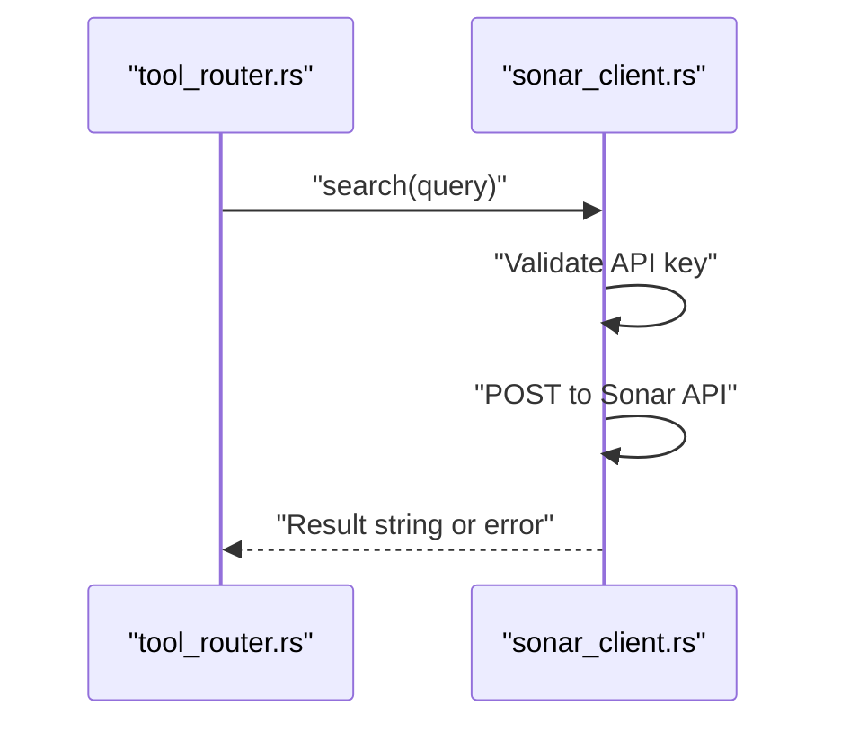
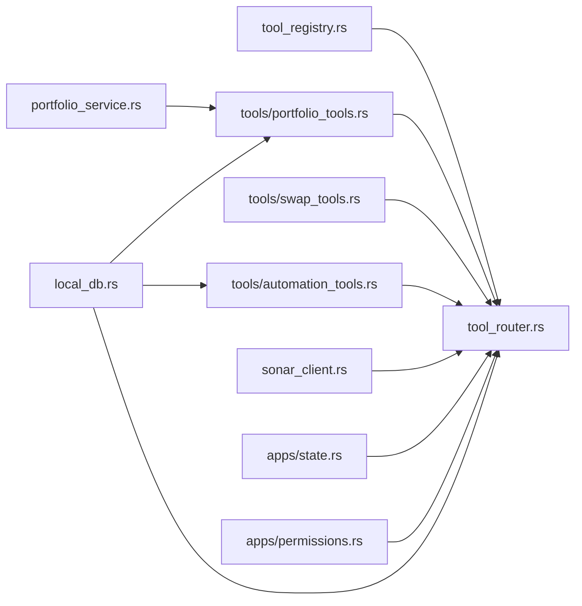

# Tools & Integration Services

<cite>
**Referenced Files in This Document**
- [tool_registry.rs](file://src-tauri/src/services/tool_registry.rs)
- [tool_router.rs](file://src-tauri/src/services/tool_router.rs)
- [mod.rs](file://src-tauri/src/services/tools/mod.rs)
- [portfolio_tools.rs](file://src-tauri/src/services/tools/portfolio_tools.rs)
- [swap_tools.rs](file://src-tauri/src/services/tools/swap_tools.rs)
- [automation_tools.rs](file://src-tauri/src/services/tools/automation_tools.rs)
- [apps/mod.rs](file://src-tauri/src/services/apps/mod.rs)
- [apps/state.rs](file://src-tauri/src/services/apps/state.rs)
- [apps/permissions.rs](file://src-tauri/src/services/apps/permissions.rs)
- [apps/registry.rs](file://src-tauri/src/services/apps/registry.rs)
- [sonar_client.rs](file://src-tauri/src/services/sonar_client.rs)
- [local_db.rs](file://src-tauri/src/services/local_db.rs)
- [portfolio_service.rs](file://src-tauri/src/services/portfolio_service.rs)
- [lib.rs](file://src-tauri/src/lib.rs)
</cite>

## Table of Contents
1. [Introduction](#introduction)
2. [Project Structure](#project-structure)
3. [Core Components](#core-components)
4. [Architecture Overview](#architecture-overview)
5. [Detailed Component Analysis](#detailed-component-analysis)
6. [Dependency Analysis](#dependency-analysis)
7. [Performance Considerations](#performance-considerations)
8. [Troubleshooting Guide](#troubleshooting-guide)
9. [Conclusion](#conclusion)

## Introduction
This document explains Shadow Protocol’s tools and integration services. It covers:
- Tool registry and lifecycle: how tools are defined, discovered, and gated by app integrations and permissions.
- Tool router: parsing model output, validating tool calls, enforcing approvals, and returning structured results.
- Tools module: portfolio, swap, and automation tool implementations.
- Apps service: integration lifecycle, permission management, and runtime coordination.
- Sonar client: external API integration for market intelligence.
- Plugin architecture and integration patterns, with examples and operational guidance.

## Project Structure
The tools and integration services live primarily under src-tauri/src/services, organized by domain:
- tool_registry: central tool definitions and metadata.
- tool_router: orchestration of tool execution and approval gating.
- tools: modular tool implementations (portfolio, swap, automation).
- apps: integration lifecycle, permissions, state, and runtime coordination.
- sonar_client: external API client for market research.
- local_db: schema and persistence for strategies, approvals, and snapshots.
- portfolio_service: portfolio aggregation and price queries.

**Diagram sources**
- [tool_registry.rs:1-313](file://src-tauri/src/services/tool_registry.rs#L1-L313)
- [tool_router.rs:1-818](file://src-tauri/src/services/tool_router.rs#L1-L818)
- [mod.rs:1-10](file://src-tauri/src/services/tools/mod.rs#L1-L10)
- [portfolio_tools.rs:1-220](file://src-tauri/src/services/tools/portfolio_tools.rs#L1-L220)
- [swap_tools.rs:1-84](file://src-tauri/src/services/tools/swap_tools.rs#L1-L84)
- [automation_tools.rs:1-134](file://src-tauri/src/services/tools/automation_tools.rs#L1-L134)
- [apps/mod.rs:1-15](file://src-tauri/src/services/apps/mod.rs#L1-L15)
- [apps/state.rs:1-458](file://src-tauri/src/services/apps/state.rs#L1-L458)
- [apps/permissions.rs:1-53](file://src-tauri/src/services/apps/permissions.rs#L1-L53)
- [apps/registry.rs:1-138](file://src-tauri/src/services/apps/registry.rs#L1-L138)
- [sonar_client.rs:1-78](file://src-tauri/src/services/sonar_client.rs#L1-L78)
- [local_db.rs:1-2735](file://src-tauri/src/services/local_db.rs#L1-L2735)
- [portfolio_service.rs:1-498](file://src-tauri/src/services/portfolio_service.rs#L1-L498)

**Section sources**
- [tool_registry.rs:1-313](file://src-tauri/src/services/tool_registry.rs#L1-L313)
- [tool_router.rs:1-818](file://src-tauri/src/services/tool_router.rs#L1-L818)
- [mod.rs:1-10](file://src-tauri/src/services/tools/mod.rs#L1-L10)
- [apps/mod.rs:1-15](file://src-tauri/src/services/apps/mod.rs#L1-L15)

## Core Components
- Tool registry: enumerates tools with metadata (kind, execution mode, parameters, gating).
- Tool router: parses model output, validates tool calls, enforces app/permission gates, and routes to tool implementations.
- Tools module: portfolio queries, swap previews, and strategy proposal helpers.
- Apps service: catalogs, installs, enables, health-checks, permissions, and scheduling.
- Sonar client: integrates Perplexity Sonar for market intelligence.
- Persistence: SQLite-backed schema for strategies, approvals, snapshots, and audit logs.

**Section sources**
- [tool_registry.rs:18-34](file://src-tauri/src/services/tool_registry.rs#L18-L34)
- [tool_router.rs:100-131](file://src-tauri/src/services/tool_router.rs#L100-L131)
- [mod.rs:1-10](file://src-tauri/src/services/tools/mod.rs#L1-L10)
- [apps/state.rs:170-181](file://src-tauri/src/services/apps/state.rs#L170-L181)
- [sonar_client.rs:33-77](file://src-tauri/src/services/sonar_client.rs#L33-L77)
- [local_db.rs:10-200](file://src-tauri/src/services/local_db.rs#L10-L200)

## Architecture Overview
The system composes a tool registry with a router that interprets model-generated tool calls, enforces gating, and executes tools. Tools may call external APIs, apps runtime, or local database.

**Diagram sources**
- [tool_router.rs:100-131](file://src-tauri/src/services/tool_router.rs#L100-L131)
- [tool_registry.rs:36-312](file://src-tauri/src/services/tool_registry.rs#L36-L312)
- [sonar_client.rs:33-77](file://src-tauri/src/services/sonar_client.rs#L33-L77)
- [apps/state.rs:170-181](file://src-tauri/src/services/apps/state.rs#L170-L181)
- [apps/permissions.rs:35-43](file://src-tauri/src/services/apps/permissions.rs#L35-L43)

## Detailed Component Analysis

### Tool Registry
- Purpose: centralize tool definitions with JSON Schema parameters, execution modes, and gating metadata.
- Key elements:
  - ToolKind: Read vs Write.
  - ExecutionMode: ReadAuto vs ApprovalRequired.
  - ToolDef: name, description, parameters (JSON Schema), execution_mode, wallet requirements, synthesis support, app gating, and required permissions.
  - all_tools(): returns the canonical list of tools.

**Diagram sources**
- [tool_registry.rs:3-34](file://src-tauri/src/services/tool_registry.rs#L3-L34)
- [tool_registry.rs:36-312](file://src-tauri/src/services/tool_registry.rs#L36-L312)

**Section sources**
- [tool_registry.rs:3-34](file://src-tauri/src/services/tool_registry.rs#L3-L34)
- [tool_registry.rs:36-312](file://src-tauri/src/services/tool_registry.rs#L36-L312)

### Tool Router
- Purpose: parse model output, validate tool calls, enforce app/permission gates, and route to tool implementations.
- Key flows:
  - parse_tool_calls: robustly extracts JSON tool call objects from model text.
  - route_and_execute: iterates parsed calls, validates presence, wallet presence, app gate, and permissions; dispatches to tools; returns ToolResult variants (AssistantMessage, ToolOutput, ApprovalRequired, Error).
  - tools_system_prompt: injects available tools and app context into the agent prompt.

**Diagram sources**
- [tool_router.rs:25-62](file://src-tauri/src/services/tool_router.rs#L25-L62)
- [tool_router.rs:100-131](file://src-tauri/src/services/tool_router.rs#L100-L131)
- [tool_router.rs:161-717](file://src-tauri/src/services/tool_router.rs#L161-L717)

**Section sources**
- [tool_router.rs:25-62](file://src-tauri/src/services/tool_router.rs#L25-L62)
- [tool_router.rs:100-131](file://src-tauri/src/services/tool_router.rs#L100-L131)
- [tool_router.rs:161-717](file://src-tauri/src/services/tool_router.rs#L161-L717)

### Tools Module
- Portfolio tools: balance retrieval, aggregated portfolio valuation, and token price lookup.
- Swap tools: swap preview generation (no execution).
- Automation tools: strategy proposal preparation and drift calculation.

**Diagram sources**
- [portfolio_tools.rs:21-220](file://src-tauri/src/services/tools/portfolio_tools.rs#L21-L220)
- [swap_tools.rs:22-56](file://src-tauri/src/services/tools/swap_tools.rs#L22-L56)
- [automation_tools.rs:18-134](file://src-tauri/src/services/tools/automation_tools.rs#L18-L134)
- [mod.rs:1-10](file://src-tauri/src/services/tools/mod.rs#L1-L10)

**Section sources**
- [portfolio_tools.rs:21-220](file://src-tauri/src/services/tools/portfolio_tools.rs#L21-L220)
- [swap_tools.rs:22-56](file://src-tauri/src/services/tools/swap_tools.rs#L22-L56)
- [automation_tools.rs:18-134](file://src-tauri/src/services/tools/automation_tools.rs#L18-L134)
- [mod.rs:1-10](file://src-tauri/src/services/tools/mod.rs#L1-L10)

### Apps Service
- Lifecycle and state:
  - Catalog seeding and marketplace listing.
  - Install, enable, health, and permission acknowledgment.
  - Scheduler jobs for integration tasks.
- Permissions:
  - Manifest permission extraction and runtime assertions.
- Integration prompts and payloads for agent context.

**Diagram sources**
- [apps/state.rs:88-458](file://src-tauri/src/services/apps/state.rs#L88-L458)
- [apps/permissions.rs:10-43](file://src-tauri/src/services/apps/permissions.rs#L10-L43)
- [apps/registry.rs:1-138](file://src-tauri/src/services/apps/registry.rs#L1-L138)

**Section sources**
- [apps/state.rs:170-181](file://src-tauri/src/services/apps/state.rs#L170-L181)
- [apps/permissions.rs:35-43](file://src-tauri/src/services/apps/permissions.rs#L35-L43)
- [apps/registry.rs:1-138](file://src-tauri/src/services/apps/registry.rs#L1-L138)

### Sonar Client
- Integrates Perplexity Sonar to provide real-time market intelligence.
- Validates API key presence and handles HTTP errors.

**Diagram sources**
- [tool_router.rs:216-221](file://src-tauri/src/services/tool_router.rs#L216-L221)
- [sonar_client.rs:33-77](file://src-tauri/src/services/sonar_client.rs#L33-L77)

**Section sources**
- [sonar_client.rs:33-77](file://src-tauri/src/services/sonar_client.rs#L33-L77)

### Integration Patterns and Examples
- Tool invocation:
  - Router parses model output and dispatches to tools. For write tools, it emits ApprovalRequired payloads for user consent.
  - Example flows:
    - Portfolio read: get_wallet_balances, get_total_portfolio_value.
    - Price read: get_token_price.
    - External research: web_research via Sonar.
    - Swap preview: execute_token_swap (ApprovalRequired).
    - Strategy proposal: create_automation_strategy (ApprovalRequired).
- App integration:
  - Apps gate tools (e.g., Lit, Flow, Filecoin) and require explicit permissions.
  - Scheduler jobs can be registered for recurring tasks (e.g., filecoin_autobackup, flow_recurring_prepare).
- External service communication:
  - Sonar client encapsulates API key management and request/response handling.

**Section sources**
- [tool_router.rs:161-717](file://src-tauri/src/services/tool_router.rs#L161-L717)
- [apps/state.rs:378-430](file://src-tauri/src/services/apps/state.rs#L378-L430)
- [sonar_client.rs:33-77](file://src-tauri/src/services/sonar_client.rs#L33-L77)

## Dependency Analysis
- Coupling:
  - tool_router depends on tool_registry, tools implementations, apps state/permissions, sonar_client, and local_db.
  - tools depend on portfolio_service and local_db for portfolio and strategy data.
  - apps state and permissions coordinate with registry and runtime.
- Cohesion:
  - Each module focuses on a single responsibility: registry, routing, tool logic, app lifecycle, persistence, and external clients.
- External dependencies:
  - reqwest for HTTP calls (sonar_client).
  - rusqlite for local persistence (local_db).
  - Tauri app handle for orchestrating commands and UI.

**Diagram sources**
- [tool_router.rs:1-16](file://src-tauri/src/services/tool_router.rs#L1-L16)
- [tool_registry.rs:1-34](file://src-tauri/src/services/tool_registry.rs#L1-L34)
- [portfolio_tools.rs:1-10](file://src-tauri/src/services/tools/portfolio_tools.rs#L1-L10)
- [swap_tools.rs:1-8](file://src-tauri/src/services/tools/swap_tools.rs#L1-L8)
- [automation_tools.rs:1-7](file://src-tauri/src/services/tools/automation_tools.rs#L1-L7)
- [sonar_client.rs:1-7](file://src-tauri/src/services/sonar_client.rs#L1-L7)
- [apps/state.rs:1-10](file://src-tauri/src/services/apps/state.rs#L1-L10)
- [apps/permissions.rs:1-8](file://src-tauri/src/services/apps/permissions.rs#L1-L8)
- [portfolio_service.rs:1-10](file://src-tauri/src/services/portfolio_service.rs#L1-L10)
- [local_db.rs:1-200](file://src-tauri/src/services/local_db.rs#L1-L200)

**Section sources**
- [tool_router.rs:1-16](file://src-tauri/src/services/tool_router.rs#L1-L16)
- [local_db.rs:1-200](file://src-tauri/src/services/local_db.rs#L1-L200)

## Performance Considerations
- Parsing tool calls: The parser scans text and extracts balanced JSON blocks; keep model output concise to minimize parsing overhead.
- External API calls: Sonar client sets a 60-second timeout; cache results where appropriate and avoid redundant calls.
- Multi-wallet aggregation: Portfolio aggregation sums across addresses; batch operations and avoid repeated network calls.
- Database writes: Upserts for scheduler jobs and strategy updates; ensure indexes are leveraged (existing indices on timestamps and statuses).
- Permission checks: Minimal SQL queries; cache granted permissions per session if needed.

[No sources needed since this section provides general guidance]

## Troubleshooting Guide
- Unknown tool error: Ensure the tool name matches tool_registry definitions.
- Missing wallet context: Connect a wallet or provide addresses; router rejects calls requiring wallets when absent.
- App gate failures: Install and enable the required app; confirm permissions acknowledged and health status is ok.
- Permission errors: Verify required permission IDs are granted for the app.
- Sonar API errors: Confirm API key is set and the HTTP response indicates success.
- Scheduler job errors: Validate appId, kind, and intervalSeconds; ensure app is ready and permissions granted.

**Section sources**
- [tool_router.rs:138-159](file://src-tauri/src/services/tool_router.rs#L138-L159)
- [apps/state.rs:170-181](file://src-tauri/src/services/apps/state.rs#L170-L181)
- [apps/permissions.rs:35-43](file://src-tauri/src/services/apps/permissions.rs#L35-L43)
- [sonar_client.rs:65-69](file://src-tauri/src/services/sonar_client.rs#L65-L69)

## Conclusion
Shadow Protocol’s tools and integration services form a cohesive framework:
- A centralized tool registry defines capabilities and gating.
- A robust router enforces context, permissions, and approvals.
- Modular tools implement portfolio, swap, and automation logic.
- The apps service manages integration lifecycles and permissions.
- The Sonar client enables external intelligence.
This architecture supports secure, extensible, and observable tooling for autonomous DeFi operations.