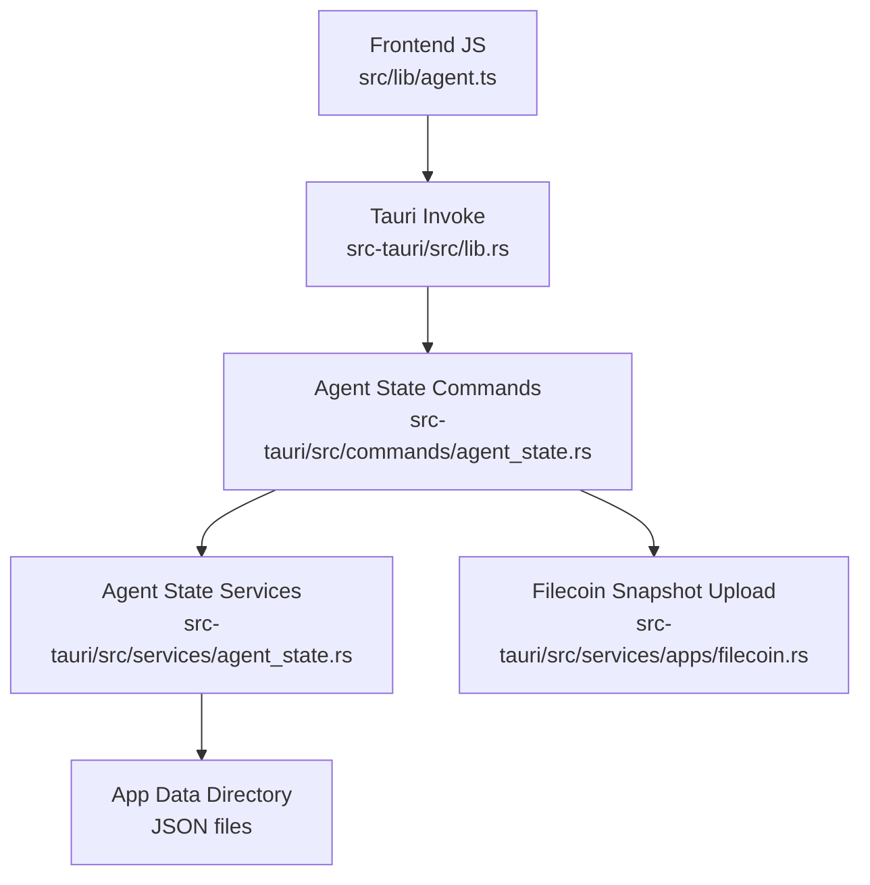
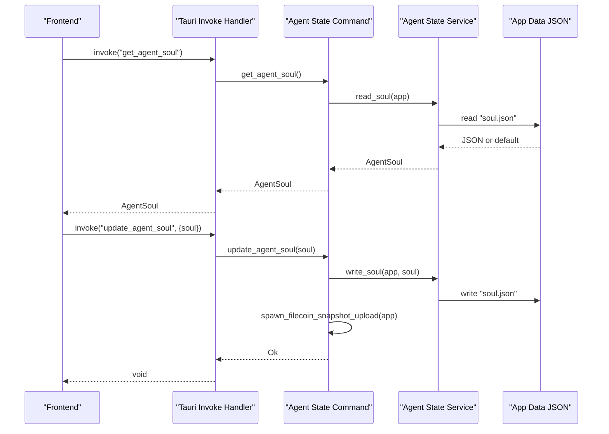
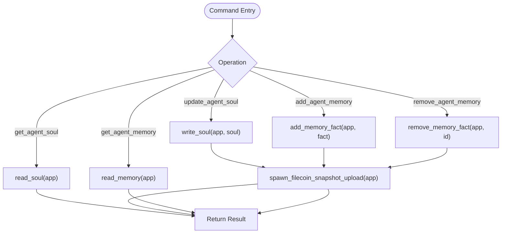
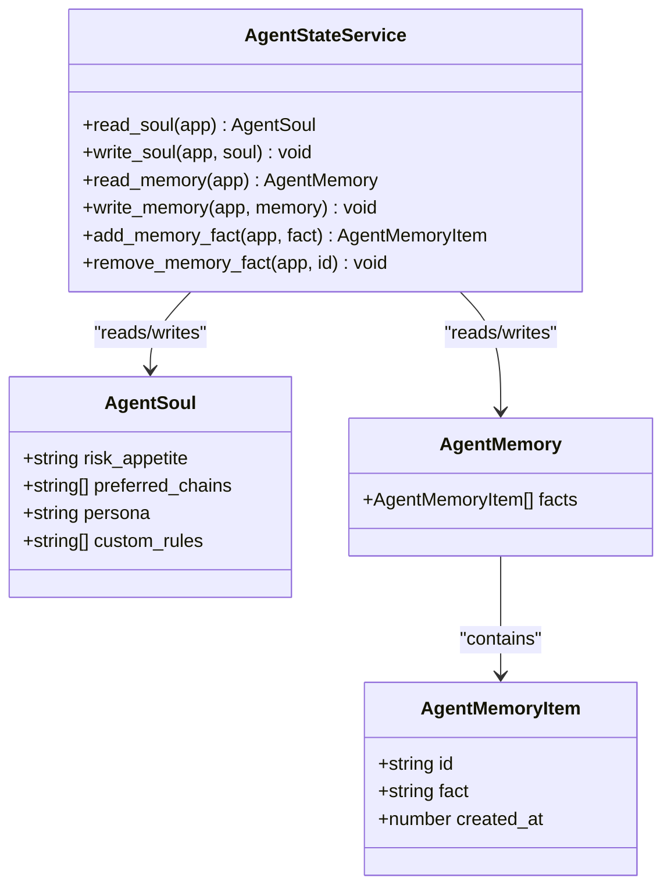
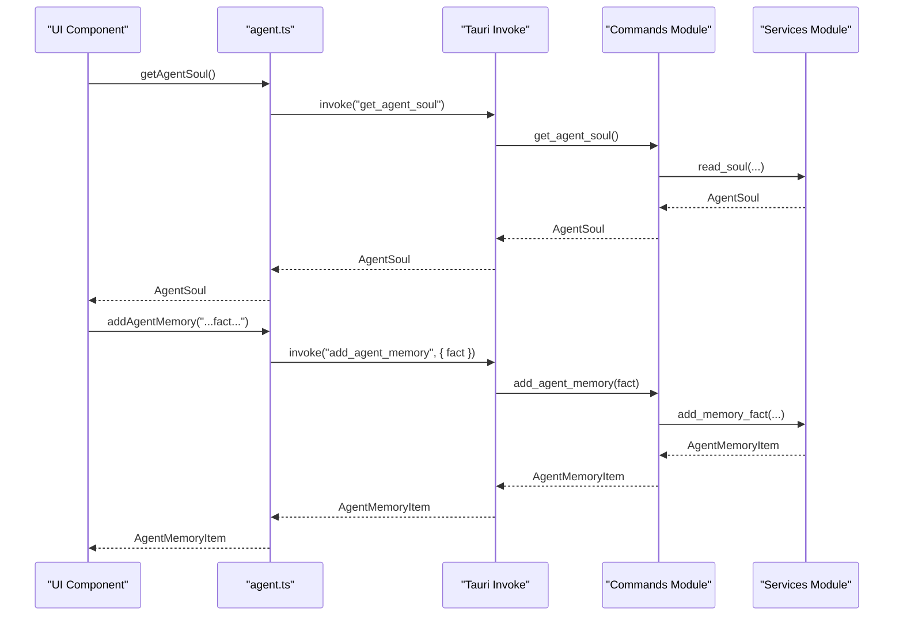
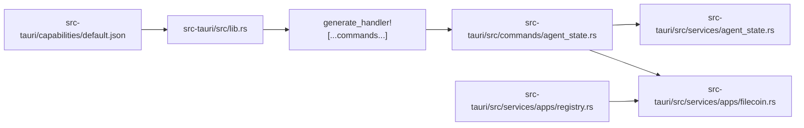

# Agent State Commands

<cite>
**Referenced Files in This Document**
- [agent_state.rs](file://src-tauri/src/commands/agent_state.rs)
- [agent_state.rs](file://src-tauri/src/services/agent_state.rs)
- [lib.rs](file://src-tauri/src/lib.rs)
- [agent.ts](file://src/lib/agent.ts)
- [agent.ts](file://src/types/agent.ts)
- [filecoin.rs](file://src-tauri/src/services/apps/filecoin.rs)
- [default.json](file://src-tauri/capabilities/default.json)
- [registry.rs](file://src-tauri/src/services/apps/registry.rs)
</cite>

## Table of Contents
1. [Introduction](#introduction)
2. [Project Structure](#project-structure)
3. [Core Components](#core-components)
4. [Architecture Overview](#architecture-overview)
5. [Detailed Component Analysis](#detailed-component-analysis)
6. [Dependency Analysis](#dependency-analysis)
7. [Performance Considerations](#performance-considerations)
8. [Troubleshooting Guide](#troubleshooting-guide)
9. [Conclusion](#conclusion)

## Introduction
This document describes the Agent State command handlers that manage agent configuration and memory persistence. It covers:
- Backend Rust command handlers and service layer
- Frontend JavaScript invocations
- Parameter schemas and return value formats
- Serialization/deserialization and persistence
- Backup and restore integration
- Permission and capability requirements
- Error handling patterns and practical usage examples

## Project Structure
Agent state commands are exposed as Tauri commands and backed by Rust services that persist agent “soul” and “memory” to the application data directory. The commands are registered in the Tauri builder and invoked from the frontend using @tauri-apps/api.

**Diagram sources**
- [agent.ts:67-85](file://src/lib/agent.ts#L67-L85)
- [lib.rs:138-142](file://src-tauri/src/lib.rs#L138-L142)
- [agent_state.rs:9-38](file://src-tauri/src/commands/agent_state.rs#L9-L38)
- [agent_state.rs:46-103](file://src-tauri/src/services/agent_state.rs#L46-L103)
- [filecoin.rs:214-238](file://src-tauri/src/services/apps/filecoin.rs#L214-L238)

**Section sources**
- [agent_state.rs:1-39](file://src-tauri/src/commands/agent_state.rs#L1-L39)
- [agent_state.rs:1-104](file://src-tauri/src/services/agent_state.rs#L1-L104)
- [lib.rs:138-142](file://src-tauri/src/lib.rs#L138-L142)
- [agent.ts:67-85](file://src/lib/agent.ts#L67-L85)

## Core Components
- Agent Soul: configuration profile persisted as JSON
- Agent Memory: append-only list of facts with timestamps
- Tauri Commands: get/update soul, get/add/remove memory
- Persistence: JSON files under the app data directory
- Backup: automatic Filecoin snapshot uploads after state changes

**Section sources**
- [agent_state.rs:6-35](file://src-tauri/src/services/agent_state.rs#L6-L35)
- [agent_state.rs:9-38](file://src-tauri/src/commands/agent_state.rs#L9-L38)
- [agent.ts:67-85](file://src/lib/agent.ts#L67-L85)

## Architecture Overview
The agent state subsystem consists of:
- Frontend methods that invoke Tauri commands
- Tauri command handlers that delegate to service functions
- Service functions that serialize/deserialize and persist state
- Optional backup pipeline triggered after writes

**Diagram sources**
- [lib.rs:138-139](file://src-tauri/src/lib.rs#L138-L139)
- [agent_state.rs:9-19](file://src-tauri/src/commands/agent_state.rs#L9-L19)
- [agent_state.rs:46-60](file://src-tauri/src/services/agent_state.rs#L46-L60)
- [filecoin.rs:214-219](file://src-tauri/src/services/apps/filecoin.rs#L214-L219)

## Detailed Component Analysis

### Backend Rust Command Handlers
- get_agent_soul: reads the current soul from disk
- update_agent_soul: writes the soul and triggers a backup
- get_agent_memory: reads the memory collection
- add_agent_memory: appends a new fact with generated id and timestamp, persists, triggers backup
- remove_agent_memory: removes a fact by id, persists, triggers backup

**Diagram sources**
- [agent_state.rs:9-38](file://src-tauri/src/commands/agent_state.rs#L9-L38)
- [agent_state.rs:46-103](file://src-tauri/src/services/agent_state.rs#L46-L103)
- [filecoin.rs:214-219](file://src-tauri/src/services/apps/filecoin.rs#L214-L219)

**Section sources**
- [agent_state.rs:9-38](file://src-tauri/src/commands/agent_state.rs#L9-L38)

### Backend Service Layer
- Data models:
  - AgentSoul: risk_appetite, preferred_chains, persona, custom_rules
  - AgentMemory: facts array
  - AgentMemoryItem: id, fact, created_at
- Persistence:
  - read_soul/write_soul: JSON to/from soul.json
  - read_memory/write_memory: JSON to/from memory.json
  - add_memory_fact: generates id and timestamp, appends to facts
  - remove_memory_fact: filters out by id
- File location: app data directory; creates directory if missing

**Diagram sources**
- [agent_state.rs:6-35](file://src-tauri/src/services/agent_state.rs#L6-L35)
- [agent_state.rs:46-103](file://src-tauri/src/services/agent_state.rs#L46-L103)

**Section sources**
- [agent_state.rs:6-35](file://src-tauri/src/services/agent_state.rs#L6-L35)
- [agent_state.rs:46-103](file://src-tauri/src/services/agent_state.rs#L46-L103)

### Frontend JavaScript Interface
- Methods:
  - getAgentSoul(): returns AgentSoul
  - updateAgentSoul(soul: AgentSoul): void
  - getAgentMemory(): returns AgentMemory
  - addAgentMemory(fact: string): returns AgentMemoryItem
  - removeAgentMemory(id: string): void
- Types:
  - AgentSoul, AgentMemory, AgentMemoryItem defined in types/agent.ts

**Diagram sources**
- [agent.ts:67-85](file://src/lib/agent.ts#L67-L85)
- [lib.rs:138-142](file://src-tauri/src/lib.rs#L138-L142)
- [agent_state.rs:21-31](file://src-tauri/src/commands/agent_state.rs#L21-L31)
- [agent_state.rs:78-96](file://src-tauri/src/services/agent_state.rs#L78-L96)

**Section sources**
- [agent.ts:67-85](file://src/lib/agent.ts#L67-L85)
- [agent.ts:168-183](file://src/types/agent.ts#L168-L183)

### Parameter Schemas and Return Formats
- get_agent_soul
  - Input: none
  - Output: AgentSoul
- update_agent_soul
  - Input: AgentSoul
  - Output: void
- get_agent_memory
  - Input: none
  - Output: AgentMemory
- add_agent_memory
  - Input: string fact
  - Output: AgentMemoryItem
- remove_agent_memory
  - Input: string id
  - Output: void

**Section sources**
- [agent.ts:168-183](file://src/types/agent.ts#L168-L183)
- [agent_state.rs:9-38](file://src-tauri/src/commands/agent_state.rs#L9-L38)

### Serialization and Deserialization
- JSON serialization/deserialization for both soul.json and memory.json
- Pretty-printed JSON for human readability
- Default values returned when files do not exist

**Section sources**
- [agent_state.rs:46-76](file://src-tauri/src/services/agent_state.rs#L46-L76)

### Memory Management Strategies
- Append-only memory: facts are appended and removed by id; no in-place mutation
- Timestamps: created_at stored per fact
- No explicit eviction policy in code; growth is unbounded

**Section sources**
- [agent_state.rs:78-103](file://src-tauri/src/services/agent_state.rs#L78-L103)

### State Synchronization Mechanisms
- After write operations (update_agent_soul, add_agent_memory, remove_agent_memory), a backup is scheduled asynchronously
- Backup scope includes agent memory; optional policy can be merged from app configuration

**Section sources**
- [agent_state.rs:17-18](file://src-tauri/src/commands/agent_state.rs#L17-L18)
- [agent_state.rs:29-30](file://src-tauri/src/commands/agent_state.rs#L29-L30)
- [agent_state.rs:36-37](file://src-tauri/src/commands/agent_state.rs#L36-L37)
- [filecoin.rs:214-238](file://src-tauri/src/services/apps/filecoin.rs#L214-L238)

### Practical Examples
- Initialize agent configuration:
  - Call updateAgentSoul with a populated AgentSoul
  - Observe automatic backup scheduling
- Query current state:
  - Call getAgentSoul and getAgentMemory
- Add a memory fact:
  - Call addAgentMemory with a string fact
  - Use returned AgentMemoryItem.id for later removal
- Remove a memory fact:
  - Call removeAgentMemory with the previously returned id

**Section sources**
- [agent.ts:67-85](file://src/lib/agent.ts#L67-L85)
- [agent_state.rs:9-38](file://src-tauri/src/commands/agent_state.rs#L9-L38)

## Dependency Analysis
- Command registration: commands are listed in the Tauri invoke handler
- Command-to-service linkage: commands import and call service functions
- Backup dependency: commands trigger Filecoin snapshot upload via spawn_filecoin_snapshot_upload
- Capability and permissions: default capability grants core permissions; Filecoin backup requires additional permissions

**Diagram sources**
- [lib.rs:138-142](file://src-tauri/src/lib.rs#L138-L142)
- [agent_state.rs:1-39](file://src-tauri/src/commands/agent_state.rs#L1-L39)
- [agent_state.rs:1-104](file://src-tauri/src/services/agent_state.rs#L1-L104)
- [filecoin.rs:214-238](file://src-tauri/src/services/apps/filecoin.rs#L214-L238)
- [default.json:1-13](file://src-tauri/capabilities/default.json#L1-L13)
- [registry.rs:58-80](file://src-tauri/src/services/apps/registry.rs#L58-L80)

**Section sources**
- [lib.rs:138-142](file://src-tauri/src/lib.rs#L138-L142)
- [default.json:1-13](file://src-tauri/capabilities/default.json#L1-L13)
- [registry.rs:58-80](file://src-tauri/src/services/apps/registry.rs#L58-L80)

## Performance Considerations
- JSON read/write per operation; minimal overhead for small state sizes
- Asynchronous backup scheduling avoids blocking UI updates
- No indexing or pagination for memory facts; expect linear scans for large histories

## Troubleshooting Guide
Common issues and resolutions:
- Missing app data directory
  - Symptom: errors when reading/writing state
  - Cause: platform-specific app data directory resolution
  - Resolution: ensure app has permission to create and write to app data directory
- Invalid JSON content
  - Symptom: deserialization errors
  - Cause: corrupted or manually edited JSON files
  - Resolution: delete malformed files; defaults will be used on next read
- Backup failures
  - Symptom: backup not recorded or upload errors
  - Cause: Filecoin integration not ready or missing API key
  - Resolution: enable Filecoin app, configure API key, retry
- Version mismatch or concurrency
  - Note: while not present in agent state commands, similar patterns elsewhere require checking expected versions before updates

**Section sources**
- [agent_state.rs:46-76](file://src-tauri/src/services/agent_state.rs#L46-L76)
- [filecoin.rs:222-238](file://src-tauri/src/services/apps/filecoin.rs#L222-L238)

## Security and Permissions
- Capability: default capability grants basic permissions for the main window
- Backup permissions: Filecoin backup requires “backup.read_local_state” and “network.filecoin”
- Secret requirements: Filecoin API key is required for backup operations
- Recommendation: restrict backup scope and policy appropriately; avoid exposing sensitive data in snapshots

**Section sources**
- [default.json:1-13](file://src-tauri/capabilities/default.json#L1-L13)
- [registry.rs:58-80](file://src-tauri/src/services/apps/registry.rs#L58-L80)

## Conclusion
The Agent State command handlers provide a straightforward, JSON-backed persistence mechanism for agent configuration and memory. They integrate with a backup pipeline for resilience and are easy to invoke from the frontend. Adhering to the schemas and permissions ensures reliable operation and secure handling of agent state data.