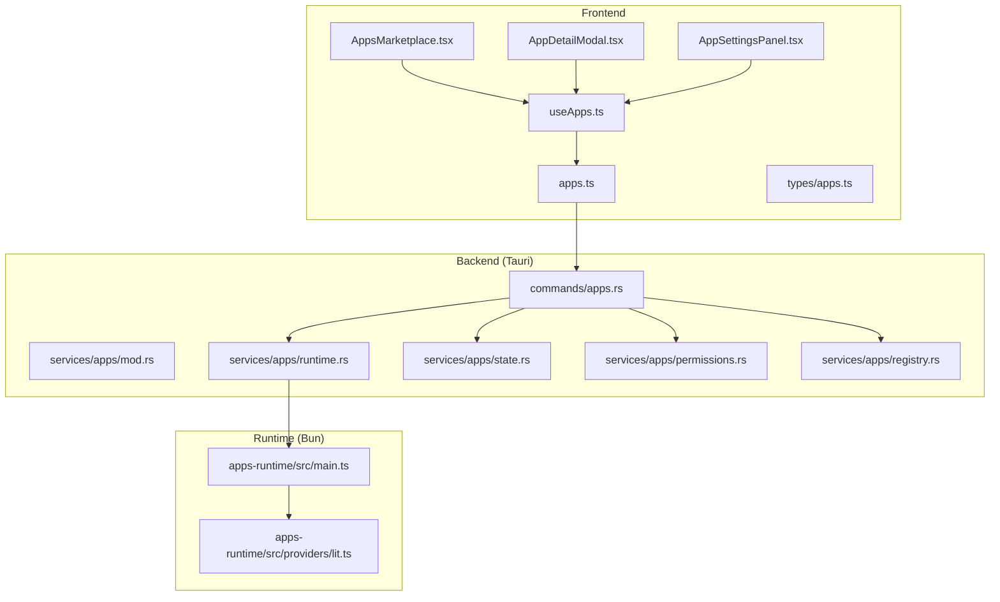
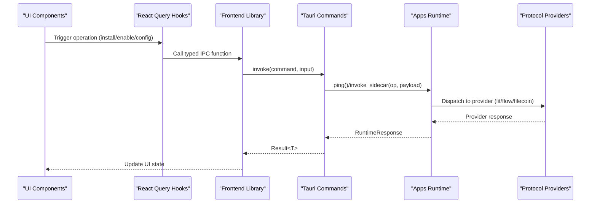
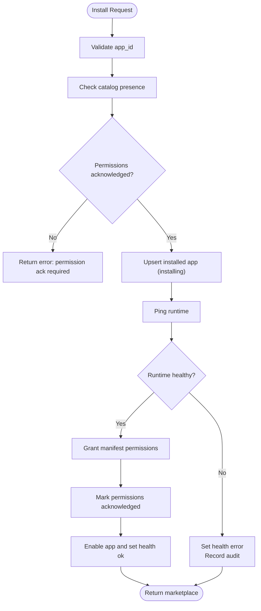
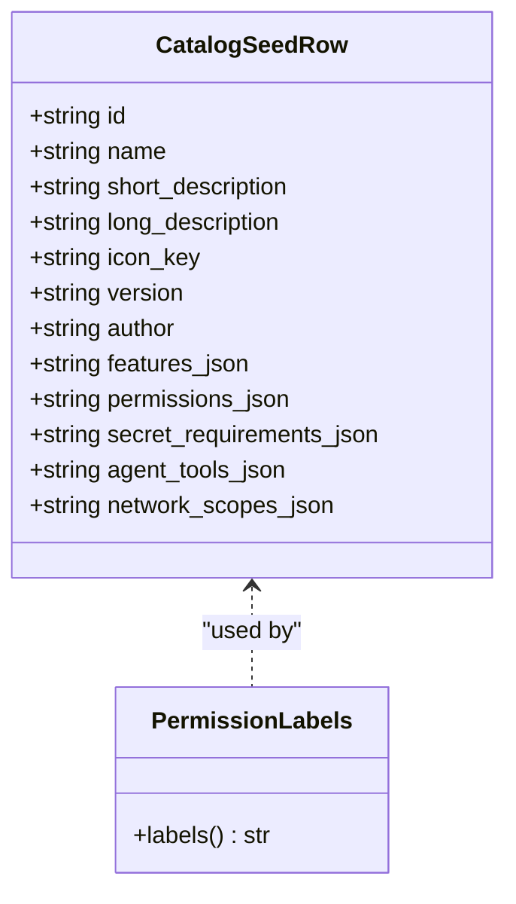
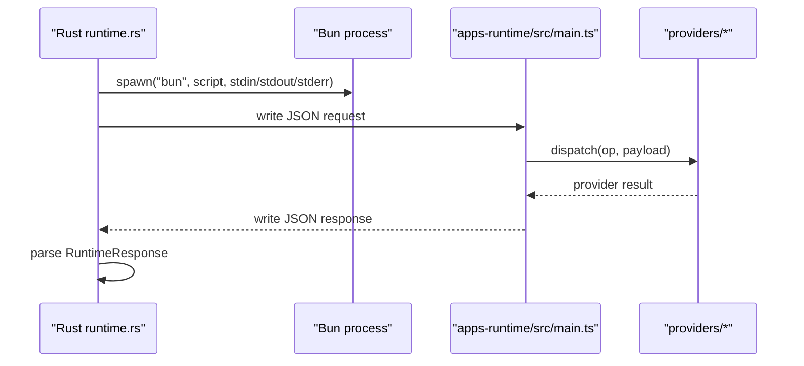
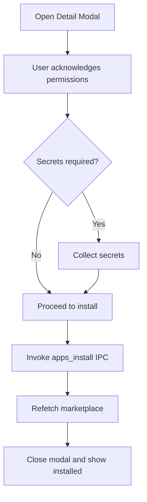
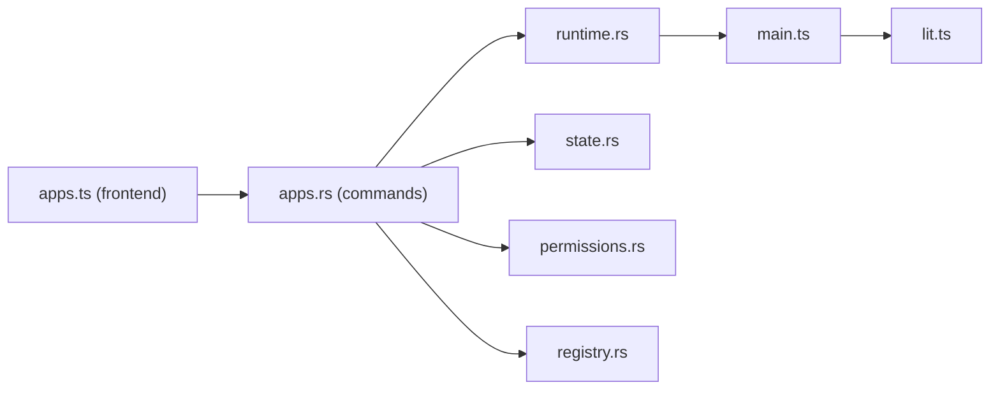

# Apps Commands

<cite>
**Referenced Files in This Document**
- [apps.rs](file://src-tauri/src/commands/apps.rs)
- [apps.ts](file://src/lib/apps.ts)
- [useApps.ts](file://src/hooks/useApps.ts)
- [apps.ts](file://src/types/apps.ts)
- [apps.ts](file://src/data/apps.ts)
- [apps.ts](file://src-tauri/src/services/apps/mod.rs)
- [runtime.rs](file://src-tauri/src/services/apps/runtime.rs)
- [state.rs](file://src-tauri/src/services/apps/state.rs)
- [registry.rs](file://src-tauri/src/services/apps/registry.rs)
- [permissions.rs](file://src-tauri/src/services/apps/permissions.rs)
- [AppsMarketplace.tsx](file://src/components/apps/AppsMarketplace.tsx)
- [AppDetailModal.tsx](file://src/components/apps/AppDetailModal.tsx)
- [AppSettingsPanel.tsx](file://src/components/apps/AppSettingsPanel.tsx)
- [main.ts](file://apps-runtime/src/main.ts)
- [lit.ts](file://apps-runtime/src/providers/lit.ts)
</cite>

## Table of Contents
1. [Introduction](#introduction)
2. [Project Structure](#project-structure)
3. [Core Components](#core-components)
4. [Architecture Overview](#architecture-overview)
5. [Detailed Component Analysis](#detailed-component-analysis)
6. [Dependency Analysis](#dependency-analysis)
7. [Performance Considerations](#performance-considerations)
8. [Troubleshooting Guide](#troubleshooting-guide)
9. [Conclusion](#conclusion)
10. [Appendices](#appendices)

## Introduction
This document describes the Apps command handlers that manage application lifecycle and runtime operations for first-party integrations (Lit Protocol, Flow, Filecoin Backup). It covers:
- Backend Rust Tauri commands for installation, uninstallation, configuration, enabling/disabling, and runtime health
- Frontend TypeScript interfaces for invoking commands and parsing responses
- Parameter schemas for app metadata, permissions, and configuration
- Return value formats for app status and runtime health
- Error handling patterns and security considerations
- App registry seeding, runtime provider integration, and sandboxing
- Practical workflows for installing apps, validating parameters, and processing responses

## Project Structure
The Apps subsystem spans three layers:
- Frontend (React + Tauri IPC): UI components and typed APIs for app operations
- Backend (Tauri + Rust): Tauri commands, app state persistence, runtime orchestration, and permission management
- Runtime (Node.js via Bun): Isolated sidecar process implementing protocol adapters

**Diagram sources**
- [AppsMarketplace.tsx](file://src/components/apps/AppsMarketplace.tsx)
- [AppDetailModal.tsx](file://src/components/apps/AppDetailModal.tsx)
- [AppSettingsPanel.tsx](file://src/components/apps/AppSettingsPanel.tsx)
- [useApps.ts](file://src/hooks/useApps.ts)
- [apps.ts](file://src/lib/apps.ts)
- [apps.ts](file://src/types/apps.ts)
- [apps.rs](file://src-tauri/src/commands/apps.rs)
- [mod.rs](file://src-tauri/src/services/apps/mod.rs)
- [runtime.rs](file://src-tauri/src/services/apps/runtime.rs)
- [state.rs](file://src-tauri/src/services/apps/state.rs)
- [permissions.rs](file://src-tauri/src/services/apps/permissions.rs)
- [registry.rs](file://src-tauri/src/services/apps/registry.rs)
- [main.ts](file://apps-runtime/src/main.ts)
- [lit.ts](file://apps-runtime/src/providers/lit.ts)

**Section sources**
- [apps.rs](file://src-tauri/src/commands/apps.rs)
- [apps.ts](file://src/lib/apps.ts)
- [useApps.ts](file://src/hooks/useApps.ts)
- [apps.ts](file://src/types/apps.ts)
- [apps.ts](file://src-tauri/src/services/apps/mod.rs)
- [runtime.rs](file://src-tauri/src/services/apps/runtime.rs)
- [state.rs](file://src-tauri/src/services/apps/state.rs)
- [registry.rs](file://src-tauri/src/services/apps/registry.rs)
- [permissions.rs](file://src-tauri/src/services/apps/permissions.rs)
- [AppsMarketplace.tsx](file://src/components/apps/AppsMarketplace.tsx)
- [AppDetailModal.tsx](file://src/components/apps/AppDetailModal.tsx)
- [AppSettingsPanel.tsx](file://src/components/apps/AppSettingsPanel.tsx)
- [main.ts](file://apps-runtime/src/main.ts)
- [lit.ts](file://apps-runtime/src/providers/lit.ts)

## Core Components
- Tauri commands module: Defines IPC endpoints for marketplace listing, install/uninstall, enable/disable, config get/set, runtime health, and provider-specific operations.
- Frontend library: Wraps Tauri invocations with typed responses and parses UI-friendly app rows.
- Services: Runtime orchestration, SQLite state, permissions, registry seeding, and scheduler support.
- Runtime sidecar: One-request-per-process Node.js server invoked by Rust via Bun, with lazy-loaded protocol adapters.

Key responsibilities:
- Validation: App ID and secret key constraints, permission acknowledgments, and session unlock requirements
- Persistence: Catalog, installed state, configs, backups, and scheduler jobs
- Orchestration: Runtime health checks, permission grants, and provider operations
- UI: Marketplace rendering, detail modal, and settings panels

**Section sources**
- [apps.rs](file://src-tauri/src/commands/apps.rs)
- [apps.ts](file://src/lib/apps.ts)
- [runtime.rs](file://src-tauri/src/services/apps/runtime.rs)
- [state.rs](file://src-tauri/src/services/apps/state.rs)
- [registry.rs](file://src-tauri/src/services/apps/registry.rs)
- [permissions.rs](file://src-tauri/src/services/apps/permissions.rs)

## Architecture Overview
The Apps subsystem integrates frontend UI, backend Tauri commands, Rust services, and a Bun-powered runtime sidecar.

**Diagram sources**
- [apps.ts](file://src/lib/apps.ts)
- [apps.rs](file://src-tauri/src/commands/apps.rs)
- [runtime.rs](file://src-tauri/src/services/apps/runtime.rs)
- [main.ts](file://apps-runtime/src/main.ts)
- [lit.ts](file://apps-runtime/src/providers/lit.ts)

## Detailed Component Analysis

### Tauri Commands: Lifecycle and Configuration
- Command registration: All commands are annotated with Tauri’s command macro and exposed to the frontend via IPC.
- Validation: App ID and secret key constraints enforce safe identifiers and key names.
- Permission handling: Installation requires explicit permission acknowledgment; runtime operations assert granted permissions.
- Session requirements: Secret updates and sensitive operations require an unlocked session.
- Audit logging: All mutations record audit events for compliance visibility.

Key commands and behaviors:
- apps_marketplace_list: Returns marketplace entries with catalog and installed state.
- apps_install: Validates app existence and permissions acknowledgment, creates an installing state, pings runtime, grants permissions, and sets health.
- apps_uninstall: Removes secrets, deletes installed records, and returns updated marketplace.
- apps_set_enabled: Toggles enabled flag and updates lifecycle state.
- apps_get_config/apps_set_config: Persists JSON config for an app; config updates trigger provider-specific actions.
- apps_runtime_health/apps_refresh_health: Pings runtime and updates per-integration health statuses.
- Provider-specific commands: Lit PKP minting, wallet status preview; Flow account status; Filecoin auto restore.

**Diagram sources**
- [apps.rs](file://src-tauri/src/commands/apps.rs)

**Section sources**
- [apps.rs](file://src-tauri/src/commands/apps.rs)

### Frontend JavaScript Interface
- Typed IPC wrappers: Mirror Rust structs and enums for runtime health and marketplace responses.
- Parameter schemas: Config parsers for each integration (Lit, Flow, Filecoin) define allowed fields and defaults.
- Response processing: Converts backend marketplace entries to UI-friendly ShadowApp objects, mapping lifecycle and health to status.
- Hooks: React Query-based hooks for marketplace, mutations, runtime health, and config updates.

Key types and functions:
- AppsRuntimeHealthIpc mirrors Rust RuntimeResponse for health checks.
- parseLitConfig/parseFlowConfig/parseFilecoinConfig normalize user inputs.
- marketplaceEntryToShadowApp converts backend rows to UI rows.
- installApp/uninstallApp/setAppEnabled wrap IPC invocations and refetch marketplace.

**Section sources**
- [apps.ts](file://src/lib/apps.ts)
- [apps.ts](file://src/types/apps.ts)
- [useApps.ts](file://src/hooks/useApps.ts)

### App Registry and Permissions
- Registry seeding: Bundled catalog rows define first-party integrations with features, permissions, and secret requirements.
- Permission labels: Human-readable labels for capability IDs.
- Manifest parsing: Extracts permission IDs from JSON and grants them upon installation.
- Assertion: Ensures required permissions are granted before runtime operations.

**Diagram sources**
- [registry.rs](file://src-tauri/src/services/apps/registry.rs)

**Section sources**
- [registry.rs](file://src-tauri/src/services/apps/registry.rs)
- [permissions.rs](file://src-tauri/src/services/apps/permissions.rs)

### Runtime Provider Integration
- Sidecar invocation: Rust spawns Bun with a TypeScript entrypoint; stdin receives a JSON request, stdout returns a JSON response.
- Isolation: One process per request; logs are redirected to stderr to preserve stdout IPC boundaries.
- Operations: Provider dispatch supports health checks, wallet status, prechecks, minting, and Filecoin operations.

**Diagram sources**
- [runtime.rs](file://src-tauri/src/services/apps/runtime.rs)
- [main.ts](file://apps-runtime/src/main.ts)

**Section sources**
- [runtime.rs](file://src-tauri/src/services/apps/runtime.rs)
- [main.ts](file://apps-runtime/src/main.ts)
- [lit.ts](file://apps-runtime/src/providers/lit.ts)

### UI Components and Workflows
- Marketplace: Filters, search, and category views; sync health button; detail modal for installation.
- Detail Modal: Permission acknowledgment, secret collection, and install flow.
- Settings Panel: Per-integration forms (Lit guardrails, Flow network/account, Filecoin policy/scope); runtime health strip; backup listing.

**Diagram sources**
- [AppsMarketplace.tsx](file://src/components/apps/AppsMarketplace.tsx)
- [AppDetailModal.tsx](file://src/components/apps/AppDetailModal.tsx)
- [apps.ts](file://src/lib/apps.ts)

**Section sources**
- [AppsMarketplace.tsx](file://src/components/apps/AppsMarketplace.tsx)
- [AppDetailModal.tsx](file://src/components/apps/AppDetailModal.tsx)
- [AppSettingsPanel.tsx](file://src/components/apps/AppSettingsPanel.tsx)
- [apps.ts](file://src/lib/apps.ts)

## Dependency Analysis
- Frontend depends on Tauri IPC and typed responses; hooks coordinate queries and mutations.
- Backend commands depend on runtime service, state service, permissions service, and registry.
- Runtime depends on provider modules; providers depend on external SDKs.

**Diagram sources**
- [apps.ts](file://src/lib/apps.ts)
- [apps.rs](file://src-tauri/src/commands/apps.rs)
- [runtime.rs](file://src-tauri/src/services/apps/runtime.rs)
- [state.rs](file://src-tauri/src/services/apps/state.rs)
- [permissions.rs](file://src-tauri/src/services/apps/permissions.rs)
- [registry.rs](file://src-tauri/src/services/apps/registry.rs)
- [main.ts](file://apps-runtime/src/main.ts)
- [lit.ts](file://apps-runtime/src/providers/lit.ts)

**Section sources**
- [apps.rs](file://src-tauri/src/commands/apps.rs)
- [apps.ts](file://src/lib/apps.ts)
- [runtime.rs](file://src-tauri/src/services/apps/runtime.rs)
- [state.rs](file://src-tauri/src/services/apps/state.rs)
- [permissions.rs](file://src-tauri/src/services/apps/permissions.rs)
- [registry.rs](file://src-tauri/src/services/apps/registry.rs)
- [main.ts](file://apps-runtime/src/main.ts)
- [lit.ts](file://apps-runtime/src/providers/lit.ts)

## Performance Considerations
- Runtime isolation: One Bun process per request prevents long-lived connections and reduces cross-request interference.
- Health polling: Runtime health is cached with a short staleness window to balance freshness and performance.
- Database operations: Batched updates and indexed lookups minimize latency for marketplace and state queries.
- UI updates: React Query invalidations ensure efficient cache updates after mutations.

## Troubleshooting Guide
Common errors and handling patterns:
- Unknown app or missing catalog entry during install
- Permission acknowledgment required before install
- Runtime unreachable or invalid response from sidecar
- Missing session for secret updates
- Invalid app_id or secret key formats
- DB errors during state transitions

Resolution tips:
- Verify app_id format and length constraints
- Confirm runtime health and Bun availability
- Ensure session is unlocked for secret operations
- Check audit logs for detailed error contexts

**Section sources**
- [apps.rs](file://src-tauri/src/commands/apps.rs)
- [runtime.rs](file://src-tauri/src/services/apps/runtime.rs)
- [state.rs](file://src-tauri/src/services/apps/state.rs)

## Conclusion
The Apps subsystem provides a secure, auditable, and user-friendly mechanism to manage first-party integrations. It enforces permission boundaries, isolates runtime operations, and offers robust UI surfaces for configuration and monitoring. The layered design ensures maintainability and extensibility for future integrations.

## Appendices

### Command Reference and Schemas

- apps_marketplace_list
  - Input: none
  - Output: AppsMarketplaceResponse with entries
  - Return type: [AppsMarketplaceResponse](file://src/types/apps.ts)

- apps_install
  - Input: AppsInstallInput { appId, acknowledgePermissions }
  - Output: AppsMarketplaceResponse
  - Validation: app_id length and character set, catalog presence, permission ack
  - Behavior: creates installing state, pings runtime, grants permissions, enables app

- apps_uninstall
  - Input: AppsAppIdInput { appId }
  - Output: AppsMarketplaceResponse
  - Behavior: removes secrets and installed rows

- apps_set_enabled
  - Input: AppsSetEnabledInput { appId, enabled }
  - Output: AppsMarketplaceResponse
  - Behavior: toggles enabled flag and lifecycle

- apps_get_config
  - Input: AppsAppIdInput { appId }
  - Output: JSON value
  - Behavior: returns stored config JSON

- apps_set_config
  - Input: AppsConfigInput { appId, config }
  - Output: none
  - Behavior: validates session, persists JSON, triggers provider actions

- apps_runtime_health
  - Input: none
  - Output: RuntimeResponse (ok, errorCode?, errorMessage?, data)
  - Behavior: health.ping via runtime

- apps_refresh_health
  - Input: none
  - Output: AppsMarketplaceResponse
  - Behavior: re-checks runtime and updates per-integration health

- apps_lit_wallet_status
  - Input: none
  - Output: JSON value
  - Behavior: provider wallet status preview

- apps_lit_mint_pkp
  - Input: none
  - Output: JSON value (pkpEthAddress, pkpPublicKey, tokenId)
  - Behavior: requires unlocked session and ready tool app

- apps_flow_account_status
  - Input: none
  - Output: JSON value
  - Behavior: provider account status preview

- apps_filecoin_auto_restore
  - Input: none
  - Output: boolean
  - Behavior: restores latest snapshot

- apps_set_secret
  - Input: AppsSecretInput { appId, key, value }
  - Output: none
  - Validation: session unlock, key format, value length limit

- apps_remove_secret
  - Input: AppsSecretKeyInput { appId, key }
  - Output: none
  - Validation: session unlock, key format

**Section sources**
- [apps.rs](file://src-tauri/src/commands/apps.rs)
- [apps.ts](file://src/lib/apps.ts)
- [apps.ts](file://src/types/apps.ts)

### Parameter Validation and Security

- App ID validation
  - Length: 1–64 characters
  - Allowed chars: lowercase ASCII letters, digits, hyphen
- Secret key validation
  - Length: 1–64 characters
  - Allowed chars: lowercase ASCII letters, digits, underscore
- Secret value limit
  - Maximum length: 4096 characters
- Session requirement
  - Secret updates and sensitive operations require an unlocked session

**Section sources**
- [apps.rs](file://src-tauri/src/commands/apps.rs)

### Return Value Formats

- RuntimeResponse
  - Fields: ok, errorCode?, errorMessage?, data
  - Used by apps_runtime_health and sidecar responses
- AppsMarketplaceResponse
  - Fields: entries (AppMarketplaceEntryIpc[])
- ShadowApp
  - Computed status from installed lifecycle and health

**Section sources**
- [apps.ts](file://src/types/apps.ts)
- [apps.ts](file://src/lib/apps.ts)

### Practical Examples

- Installing an app
  - UI: open detail modal, acknowledge permissions, optionally enter secrets, click install
  - Backend: validate, mark installing, ping runtime, grant permissions, enable app, update health
  - Frontend: refetch marketplace and update UI

- Updating Filecoin backup policy
  - UI: open settings panel, adjust TTL, cost limit, redundancy, scope, auto-renew
  - Backend: persist config JSON, trigger provider actions
  - Frontend: notify success and invalidate queries

- Checking runtime health
  - UI: click “Sync health” or view runtime strip
  - Backend: ping sidecar, update per-integration health rows
  - Frontend: display ok/error badge and refresh marketplace

**Section sources**
- [AppDetailModal.tsx](file://src/components/apps/AppDetailModal.tsx)
- [AppSettingsPanel.tsx](file://src/components/apps/AppSettingsPanel.tsx)
- [AppsMarketplace.tsx](file://src/components/apps/AppsMarketplace.tsx)
- [apps.rs](file://src-tauri/src/commands/apps.rs)