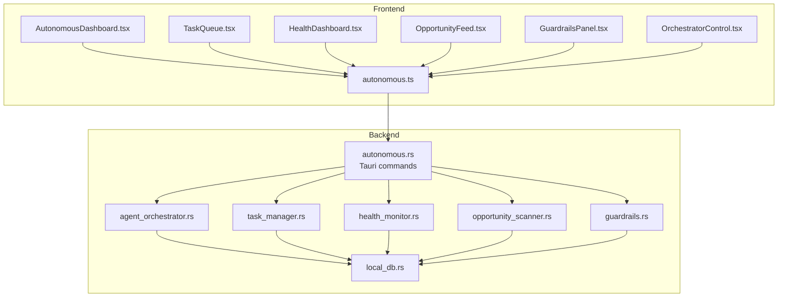
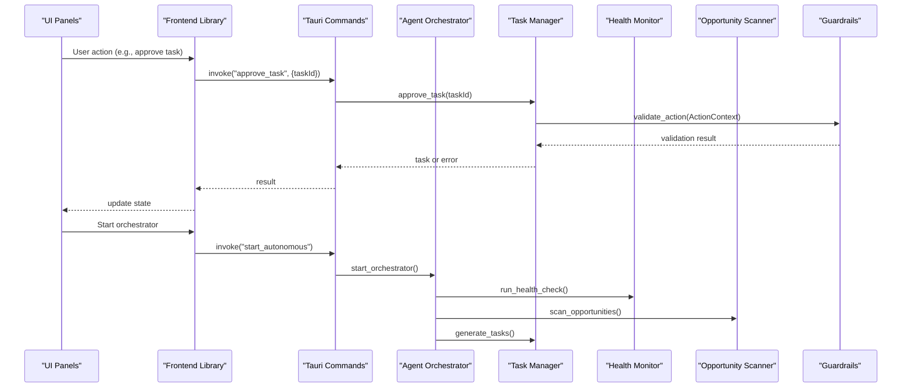
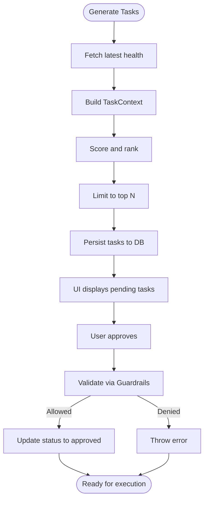
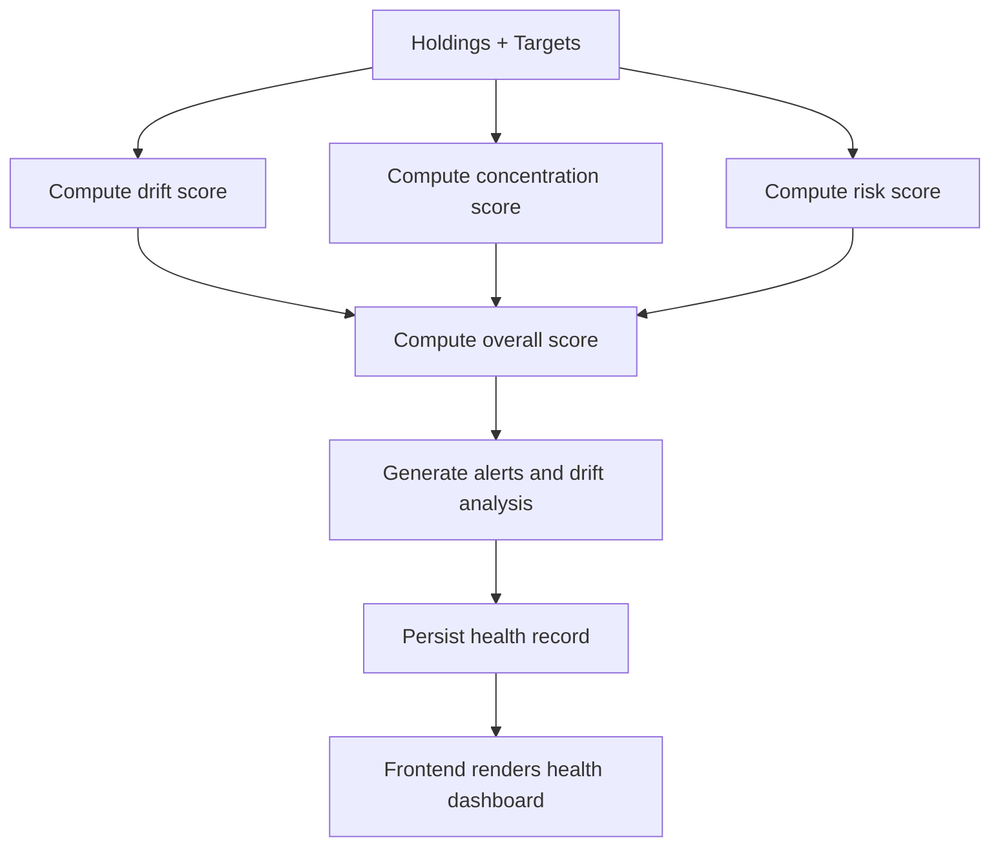
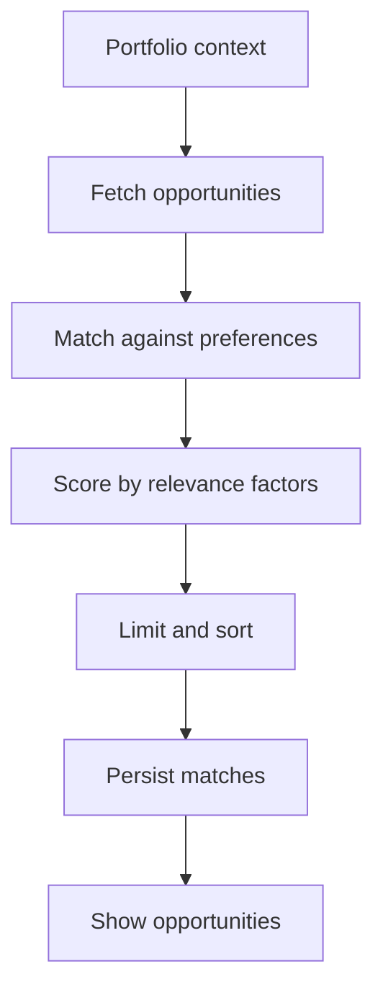
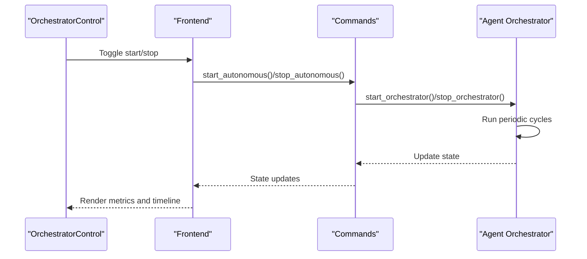
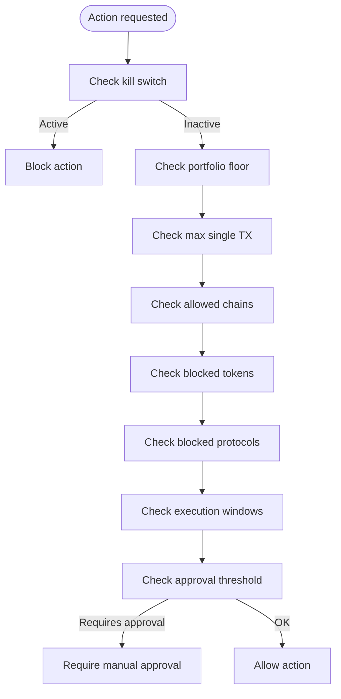
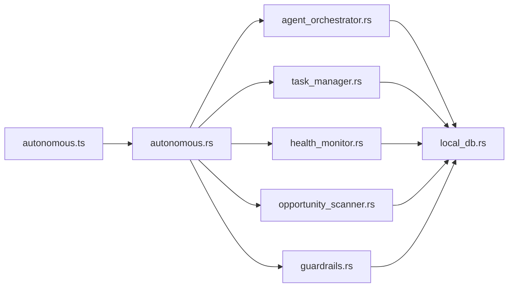

# Autonomous Commands

<cite>
**Referenced Files in This Document**
- [autonomous.ts](file://src/lib/autonomous.ts)
- [autonomous.rs](file://src-tauri/src/commands/autonomous.rs)
- [task_manager.rs](file://src-tauri/src/services/task_manager.rs)
- [health_monitor.rs](file://src-tauri/src/services/health_monitor.rs)
- [opportunity_scanner.rs](file://src-tauri/src/services/opportunity_scanner.rs)
- [guardrails.rs](file://src-tauri/src/services/guardrails.rs)
- [agent_orchestrator.rs](file://src-tauri/src/services/agent_orchestrator.rs)
- [local_db.rs](file://src-tauri/src/services/local_db.rs)
- [autonomous.tsx](file://src/components/autonomous/AutonomousDashboard.tsx)
- [TaskQueue.tsx](file://src/components/autonomous/TaskQueue.tsx)
- [HealthDashboard.tsx](file://src/components/autonomous/HealthDashboard.tsx)
- [OpportunityFeed.tsx](file://src/components/autonomous/OpportunityFeed.tsx)
- [GuardrailsPanel.tsx](file://src/components/autonomous/GuardrailsPanel.tsx)
- [OrchestratorControl.tsx](file://src/components/autonomous/OrchestratorControl.tsx)
- [autonomous.ts (types)](file://src/types/autonomous.ts)
</cite>

## Table of Contents
1. [Introduction](#introduction)
2. [Project Structure](#project-structure)
3. [Core Components](#core-components)
4. [Architecture Overview](#architecture-overview)
5. [Detailed Component Analysis](#detailed-component-analysis)
6. [Dependency Analysis](#dependency-analysis)
7. [Performance Considerations](#performance-considerations)
8. [Troubleshooting Guide](#troubleshooting-guide)
9. [Conclusion](#conclusion)

## Introduction
This document describes the Autonomous command handlers that power the autonomous agent system. It covers the JavaScript frontend interface for autonomous operations, the Rust backend implementation for task scheduling, guardrails, health monitoring, and opportunity scanning, and the orchestrator control. It also documents parameter schemas, return value formats, error handling patterns, command registration, permission and security considerations, and practical examples for creating and processing autonomous tasks.

## Project Structure
The autonomous subsystem spans three layers:
- Frontend (React/TypeScript): UI components and a thin frontend library that invokes Tauri commands.
- Backend (Rust/Tauri): Tauri commands expose typed APIs backed by services for guardrails, task management, health monitoring, opportunity scanning, and orchestration.
- Storage (Rust): Local database schema supports persistence for tasks, health records, matches, and reasoning chains.

**Diagram sources**
- [autonomous.tsx:1-84](file://src/components/autonomous/AutonomousDashboard.tsx#L1-L84)
- [TaskQueue.tsx:1-89](file://src/components/autonomous/TaskQueue.tsx#L1-L89)
- [HealthDashboard.tsx:1-199](file://src/components/autonomous/HealthDashboard.tsx#L1-L199)
- [OpportunityFeed.tsx:1-160](file://src/components/autonomous/OpportunityFeed.tsx#L1-L160)
- [GuardrailsPanel.tsx:1-327](file://src/components/autonomous/GuardrailsPanel.tsx#L1-L327)
- [OrchestratorControl.tsx:1-248](file://src/components/autonomous/OrchestratorControl.tsx#L1-L248)
- [autonomous.ts:1-478](file://src/lib/autonomous.ts#L1-L478)
- [autonomous.rs:1-783](file://src-tauri/src/commands/autonomous.rs#L1-L783)
- [agent_orchestrator.rs:1-571](file://src-tauri/src/services/agent_orchestrator.rs#L1-L571)
- [task_manager.rs:1-630](file://src-tauri/src/services/task_manager.rs#L1-L630)
- [health_monitor.rs:1-573](file://src-tauri/src/services/health_monitor.rs#L1-L573)
- [opportunity_scanner.rs:1-599](file://src-tauri/src/services/opportunity_scanner.rs#L1-L599)
- [guardrails.rs:1-620](file://src-tauri/src/services/guardrails.rs#L1-L620)
- [local_db.rs:1-200](file://src-tauri/src/services/local_db.rs#L1-L200)

**Section sources**
- [autonomous.tsx:1-84](file://src/components/autonomous/AutonomousDashboard.tsx#L1-L84)
- [autonomous.ts:1-478](file://src/lib/autonomous.ts#L1-L478)
- [autonomous.rs:1-783](file://src-tauri/src/commands/autonomous.rs#L1-L783)

## Core Components
- Frontend library (JavaScript):
  - Provides typed wrappers around Tauri commands for tasks, guardrails, health monitoring, opportunities, and orchestrator control.
  - Handles runtime checks for Tauri availability and error propagation.
- Backend commands (Rust):
  - Expose Tauri commands for guardrails, tasks, health, opportunities, orchestrator state, and analysis triggers.
  - Convert between frontend types and internal service structs.
- Services:
  - Task Manager: generates, persists, approves, rejects, and tracks task lifecycles.
  - Health Monitor: computes portfolio health scores, alerts, drift analysis, and recommendations.
  - Opportunity Scanner: discovers and matches opportunities to user preferences.
  - Guardrails: validates actions against configurable constraints and enforces kill switches.
  - Agent Orchestrator: coordinates cycles of health checks, opportunity scans, and task generation.
- Storage:
  - Local database schema stores tasks, health records, opportunity matches, and reasoning chains.

**Section sources**
- [autonomous.ts:1-478](file://src/lib/autonomous.ts#L1-L478)
- [autonomous.rs:1-783](file://src-tauri/src/commands/autonomous.rs#L1-L783)
- [task_manager.rs:1-630](file://src-tauri/src/services/task_manager.rs#L1-L630)
- [health_monitor.rs:1-573](file://src-tauri/src/services/health_monitor.rs#L1-L573)
- [opportunity_scanner.rs:1-599](file://src-tauri/src/services/opportunity_scanner.rs#L1-L599)
- [guardrails.rs:1-620](file://src-tauri/src/services/guardrails.rs#L1-L620)
- [agent_orchestrator.rs:1-571](file://src-tauri/src/services/agent_orchestrator.rs#L1-L571)
- [local_db.rs:1-200](file://src-tauri/src/services/local_db.rs#L1-L200)

## Architecture Overview
The autonomous system is orchestrated by a Rust service that periodically runs health checks, scans for opportunities, and generates tasks. The frontend exposes a dashboard with dedicated panels for tasks, health, opportunities, guardrails, and orchestrator control. All sensitive validations and decisions are performed in the backend.

**Diagram sources**
- [autonomous.ts:94-159](file://src/lib/autonomous.ts#L94-L159)
- [autonomous.rs:304-341](file://src-tauri/src/commands/autonomous.rs#L304-L341)
- [agent_orchestrator.rs:93-122](file://src-tauri/src/services/agent_orchestrator.rs#L93-L122)
- [task_manager.rs:429-499](file://src-tauri/src/services/task_manager.rs#L429-L499)
- [guardrails.rs:278-426](file://src-tauri/src/services/guardrails.rs#L278-L426)
- [health_monitor.rs:107-221](file://src-tauri/src/services/health_monitor.rs#L107-L221)
- [opportunity_scanner.rs:126-161](file://src-tauri/src/services/opportunity_scanner.rs#L126-L161)

## Detailed Component Analysis

### Frontend Library: JavaScript API surface
- Task APIs:
  - getPendingTasks(): returns array of Task with nested reasoning and suggestedAction.
  - getTaskStats(): returns TaskStats.
  - getTaskReasoning(taskId): returns a human-readable conclusion string.
  - approveTask(taskId, reason?): returns the approved Task or throws.
  - rejectTask(taskId, reason?): void or throws.
- Guardrails APIs:
  - getGuardrails(): returns GuardrailConfig.
  - setGuardrails(config): void or throws.
  - activateKillSwitch()/deactivateKillSwitch(): void or throws.
- Health APIs:
  - getLatestHealth(): returns PortfolioHealth or null.
  - runHealthCheck(): void.
  - getHealthAlerts(): returns HealthAlert[].
- Opportunity APIs:
  - getOpportunities(limit?): returns MatchedOpportunity[].
  - runOpportunityScan(): void.
  - dismissOpportunity(opportunityId): currently unimplemented.
- Orchestrator APIs:
  - getOrchestratorState(): returns OrchestratorState.
  - startOrchestrator()/stopOrchestrator(): void or throws.

Return value formats:
- Arrays and objects are returned as-is from Tauri invocations; the library normalizes types and omits optional fields when missing.
- Errors are surfaced via thrown exceptions with error messages.

Parameter schemas:
- GuardrailConfig mirrors backend fields (with camelCase serialization).
- TaskAction supports a generic parameters map for extensibility.
- MatchedOpportunity wraps MarketOpportunity with match metadata.

Security and permissions:
- All sensitive validations (guardrails, kill switch) are enforced in the backend.
- Frontend does not construct privileged actions; approvals route through backend.

**Section sources**
- [autonomous.ts:17-478](file://src/lib/autonomous.ts#L17-L478)
- [autonomous.ts (types):1-137](file://src/types/autonomous.ts#L1-L137)

### Backend Commands: Rust command registration
- Guardrails commands:
  - get_guardrails(): returns GuardrailsResult { config, error? }.
  - set_guardrails(input): returns SetGuardrailsResult { success, error? }.
  - activate_kill_switch()/deactivate_kill_switch(): returns KillSwitchResult { success, active, error? }.
- Task commands:
  - get_pending_tasks(): returns TasksResult { tasks, stats, error? }.
  - approve_task(input): returns TaskActionResult { success, task?, error? }.
  - reject_task(input): returns TaskActionResult { success, error? }.
  - get_task_reasoning(input): returns ReasoningChainResult { chain?, error? }.
- Health commands:
  - get_portfolio_health(): returns HealthResult { health?, error? }.
- Opportunity commands:
  - get_opportunities(input): returns OpportunitiesResult { opportunities, error? }.
- Orchestrator commands:
  - get_orchestrator_state(): returns OrchestratorStateResult { state, error? }.
  - start_autonomous()/stop_autonomous(): returns OrchestratorControlResult { success, is_running, error? }.
  - run_analysis_now(): returns AnalysisResult { ..., errors }.

Command registration:
- Commands are declared with #[tauri::command] and exposed to the frontend via Tauri’s invoke mechanism.

**Section sources**
- [autonomous.rs:74-783](file://src-tauri/src/commands/autonomous.rs#L74-L783)

### Task Queue Management
- Generation:
  - Agent Orchestrator builds a TaskContext from latest health alerts and drift analysis, then delegates to Task Manager to generate tasks.
  - Tasks are scored and limited to top candidates.
- Persistence:
  - Tasks are stored in local DB with JSON-serialized reasoning and suggested actions.
- Lifecycle:
  - Pending tasks are fetched and presented in the UI.
  - Approve/reject transitions status and records behavior events.
  - Expiration prevents stale suggestions from being executed.
- Validation:
  - Approve path validates against Guardrails and Kill Switch before allowing execution.

**Diagram sources**
- [agent_orchestrator.rs:330-390](file://src-tauri/src/services/agent_orchestrator.rs#L330-L390)
- [task_manager.rs:167-195](file://src-tauri/src/services/task_manager.rs#L167-L195)
- [task_manager.rs:429-499](file://src-tauri/src/services/task_manager.rs#L429-L499)
- [local_db.rs:1-200](file://src-tauri/src/services/local_db.rs#L1-L200)

**Section sources**
- [agent_orchestrator.rs:330-390](file://src-tauri/src/services/agent_orchestrator.rs#L330-L390)
- [task_manager.rs:167-195](file://src-tauri/src/services/task_manager.rs#L167-L195)
- [task_manager.rs:410-520](file://src-tauri/src/services/task_manager.rs#L410-L520)

### Health Monitoring Protocols
- Inputs:
  - Asset holdings, target allocations, and total portfolio value.
- Computation:
  - Drift score, concentration score, risk score, and performance score.
  - Alerts and drift analysis derived from deviations and thresholds.
- Outputs:
  - PortfolioHealthSummary persisted to DB and returned to frontend.
- Frontend:
  - Displays overall score, component scores, drift details, and active alerts.
  - Supports on-demand analysis via run_analysis_now.

**Diagram sources**
- [health_monitor.rs:107-221](file://src-tauri/src/services/health_monitor.rs#L107-L221)
- [health_monitor.rs:349-427](file://src-tauri/src/services/health_monitor.rs#L349-L427)
- [HealthDashboard.tsx:26-175](file://src/components/autonomous/HealthDashboard.tsx#L26-L175)

**Section sources**
- [health_monitor.rs:107-221](file://src-tauri/src/services/health_monitor.rs#L107-L221)
- [HealthDashboard.tsx:26-175](file://src/components/autonomous/HealthDashboard.tsx#L26-L175)

### Opportunity Detection Algorithms
- Inputs:
  - Portfolio context (value, holdings, chain distribution).
  - Scanner configuration (chains, risk cap, exclusions).
- Matching:
  - Scores opportunities by chain preference, token preference, risk alignment, portfolio fit, and timing.
  - Generates recommended actions and estimates value.
- Frontend:
  - Displays opportunities with match scores, risk levels, and actions.

**Diagram sources**
- [opportunity_scanner.rs:126-161](file://src-tauri/src/services/opportunity_scanner.rs#L126-L161)
- [opportunity_scanner.rs:334-407](file://src-tauri/src/services/opportunity_scanner.rs#L334-L407)
- [OpportunityFeed.tsx:39-159](file://src/components/autonomous/OpportunityFeed.tsx#L39-L159)

**Section sources**
- [opportunity_scanner.rs:126-161](file://src-tauri/src/services/opportunity_scanner.rs#L126-L161)
- [opportunity_scanner.rs:334-407](file://src-tauri/src/services/opportunity_scanner.rs#L334-L407)
- [OpportunityFeed.tsx:39-159](file://src/components/autonomous/OpportunityFeed.tsx#L39-L159)

### Orchestrator Control
- State:
  - Tracks running status, last/next check times, counts of tasks generated, opportunities found, and errors.
- Loop:
  - Periodic cycles of health checks, opportunity scans, and task generation.
  - Enforces guardrails and kill switch during each cycle.
- Frontend:
  - Start/stop toggles, live metrics, activity timeline, and error display.

**Diagram sources**
- [OrchestratorControl.tsx:36-212](file://src/components/autonomous/OrchestratorControl.tsx#L36-L212)
- [autonomous.rs:586-633](file://src-tauri/src/commands/autonomous.rs#L586-L633)
- [agent_orchestrator.rs:93-148](file://src-tauri/src/services/agent_orchestrator.rs#L93-L148)

**Section sources**
- [OrchestratorControl.tsx:36-212](file://src/components/autonomous/OrchestratorControl.tsx#L36-L212)
- [agent_orchestrator.rs:93-148](file://src-tauri/src/services/agent_orchestrator.rs#L93-L148)

### Guardrails and Security
- Configurable constraints:
  - Portfolio floor, single transaction and daily/weekly spend caps, allowed/blocked chains/tokens/protocols, execution windows, approval thresholds, slippage limits, and kill switch.
- Enforcement:
  - All validations occur in the backend; approvals may be required based on thresholds.
- Kill switch:
  - Immediate global block of autonomous actions; can be toggled via UI and persists in configuration.

**Diagram sources**
- [guardrails.rs:278-426](file://src-tauri/src/services/guardrails.rs#L278-L426)
- [GuardrailsPanel.tsx:19-327](file://src/components/autonomous/GuardrailsPanel.tsx#L19-L327)

**Section sources**
- [guardrails.rs:278-426](file://src-tauri/src/services/guardrails.rs#L278-L426)
- [GuardrailsPanel.tsx:19-327](file://src/components/autonomous/GuardrailsPanel.tsx#L19-L327)

### Parameter Schemas and Return Formats
- Task:
  - Fields include id, category, priority, status, title, summary, reasoning (trigger, analysis, recommendation, riskFactors), suggestedAction (actionType, chain, tokenIn/tokenOut, amount/amountUsd, targetAddress, parameters), confidenceScore, sourceTrigger, createdAt, expiresAt.
- TaskStats:
  - Counts for total, pending, approved, rejected, executing, completed, failed, expired.
- GuardrailConfig:
  - Optional numeric limits, allowed/blocked lists, execution windows, approval thresholds, slippage, and kill switch flag.
- HealthAlert:
  - Alert type, severity, title, message, affected assets, recommended action, and timestamps.
- PortfolioHealth:
  - Scores, component scores, alerts JSON, drift JSON, recommendations JSON, and timestamps.
- MarketOpportunity and MatchedOpportunity:
  - Opportunity metadata, risk level, match score, reasons, recommended action, estimated value.
- OrchestratorState:
  - Running status, last/next check, counters, and errors.

**Section sources**
- [autonomous.ts (types):1-137](file://src/types/autonomous.ts#L1-L137)
- [autonomous.rs:155-783](file://src-tauri/src/commands/autonomous.rs#L155-L783)

### Practical Examples

- Creating and approving a task:
  - Fetch pending tasks, then approve a task by ID with an optional reason. The backend validates via guardrails and updates status.
  - Example invocation paths:
    - [approveTask:94-159](file://src/lib/autonomous.ts#L94-L159)
    - [approve_task command:304-318](file://src-tauri/src/commands/autonomous.rs#L304-L318)
    - [approve_task service:429-499](file://src-tauri/src/services/task_manager.rs#L429-L499)

- Running a health check:
  - Trigger on-demand analysis and refresh the dashboard.
  - Example invocation paths:
    - [runHealthCheck:333-335](file://src/lib/autonomous.ts#L333-L335)
    - [run_analysis_now command:664-678](file://src-tauri/src/commands/autonomous.rs#L664-L678)
    - [HealthDashboard:49-60](file://src/components/autonomous/HealthDashboard.tsx#L49-L60)

- Starting the orchestrator:
  - Toggle the orchestrator on/off; the backend manages periodic cycles.
  - Example invocation paths:
    - [startOrchestrator:455-465](file://src/lib/autonomous.ts#L455-L465)
    - [start_autonomous command:604-617](file://src-tauri/src/commands/autonomous.rs#L604-L617)
    - [OrchestratorControl:71-89](file://src/components/autonomous/OrchestratorControl.tsx#L71-L89)

- Parameter validation for guardrails:
  - Update guardrails configuration; the backend validates and persists.
  - Example invocation paths:
    - [setGuardrails:241-265](file://src/lib/autonomous.ts#L241-L265)
    - [set_guardrails command:96-109](file://src-tauri/src/commands/autonomous.rs#L96-L109)
    - [GuardrailsPanel:43-54](file://src/components/autonomous/GuardrailsPanel.tsx#L43-L54)

- Response processing:
  - Frontend handles success/error, shows toast notifications, and updates UI state.
  - Example paths:
    - [TaskQueue:38-48](file://src/components/autonomous/TaskQueue.tsx#L38-L48)
    - [OpportunityFeed:74-85](file://src/components/autonomous/OpportunityFeed.tsx#L74-L85)
    - [GuardrailsPanel:43-54](file://src/components/autonomous/GuardrailsPanel.tsx#L43-L54)

**Section sources**
- [autonomous.ts:94-265](file://src/lib/autonomous.ts#L94-L265)
- [autonomous.rs:304-678](file://src-tauri/src/commands/autonomous.rs#L304-L678)
- [task_manager.rs:429-499](file://src-tauri/src/services/task_manager.rs#L429-L499)
- [TaskQueue.tsx:38-48](file://src/components/autonomous/TaskQueue.tsx#L38-L48)
- [OpportunityFeed.tsx:74-85](file://src/components/autonomous/OpportunityFeed.tsx#L74-L85)
- [GuardrailsPanel.tsx:43-54](file://src/components/autonomous/GuardrailsPanel.tsx#L43-L54)

## Dependency Analysis
- Frontend depends on:
  - Tauri invoke for all autonomous operations.
  - React components for rendering and user interactions.
- Backend depends on:
  - Tauri commands for frontend integration.
  - Services for domain logic.
  - Local DB for persistence.
- Coupling:
  - Commands translate frontend types to service types.
  - Services encapsulate business logic and validation.
  - UI components coordinate multiple asynchronous operations.

**Diagram sources**
- [autonomous.ts:1-478](file://src/lib/autonomous.ts#L1-L478)
- [autonomous.rs:1-783](file://src-tauri/src/commands/autonomous.rs#L1-L783)
- [agent_orchestrator.rs:1-571](file://src-tauri/src/services/agent_orchestrator.rs#L1-L571)
- [task_manager.rs:1-630](file://src-tauri/src/services/task_manager.rs#L1-L630)
- [health_monitor.rs:1-573](file://src-tauri/src/services/health_monitor.rs#L1-L573)
- [opportunity_scanner.rs:1-599](file://src-tauri/src/services/opportunity_scanner.rs#L1-L599)
- [guardrails.rs:1-620](file://src-tauri/src/services/guardrails.rs#L1-L620)
- [local_db.rs:1-200](file://src-tauri/src/services/local_db.rs#L1-L200)

**Section sources**
- [autonomous.ts:1-478](file://src/lib/autonomous.ts#L1-L478)
- [autonomous.rs:1-783](file://src-tauri/src/commands/autonomous.rs#L1-L783)

## Performance Considerations
- Asynchronous UI updates: Frontend uses concurrent fetches for health and alerts to minimize latency.
- Backend batching: Orchestrator cycles consolidate operations and avoid redundant work.
- Data serialization: JSON fields are used for complex structures; keep payloads minimal to reduce IPC overhead.
- Database indexing: Existing indices support queries for tasks, health, and matches.

[No sources needed since this section provides general guidance]

## Troubleshooting Guide
Common issues and resolutions:
- Approve/Reject failures:
  - Validate backend error messages and ensure tasks are not expired.
  - Check guardrails configuration for blocking rules.
- Health check failures:
  - Inspect orchestrator errors and retry on-demand.
- Opportunity scan failures:
  - Verify network connectivity and configuration limits.
- Kill switch activation:
  - Confirm guardrails state and deactivate if needed.

Error handling patterns:
- Frontend catches exceptions from invoke and surfaces user-friendly messages.
- Backend returns structured results with optional error fields; frontend maps to UI feedback.

**Section sources**
- [autonomous.ts:53-56](file://src/lib/autonomous.ts#L53-L56)
- [autonomous.ts:167-169](file://src/lib/autonomous.ts#L167-L169)
- [agent_orchestrator.rs:178-222](file://src-tauri/src/services/agent_orchestrator.rs#L178-L222)

## Conclusion
The autonomous command handlers provide a secure, modular, and observable system for proactive portfolio management. The frontend offers intuitive dashboards, while the backend enforces guardrails, coordinates cycles, and persists state. Together, they enable safe, auditable autonomous operations with clear return formats and robust error handling.