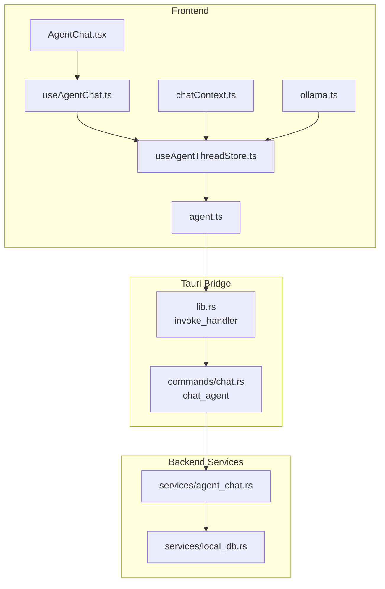
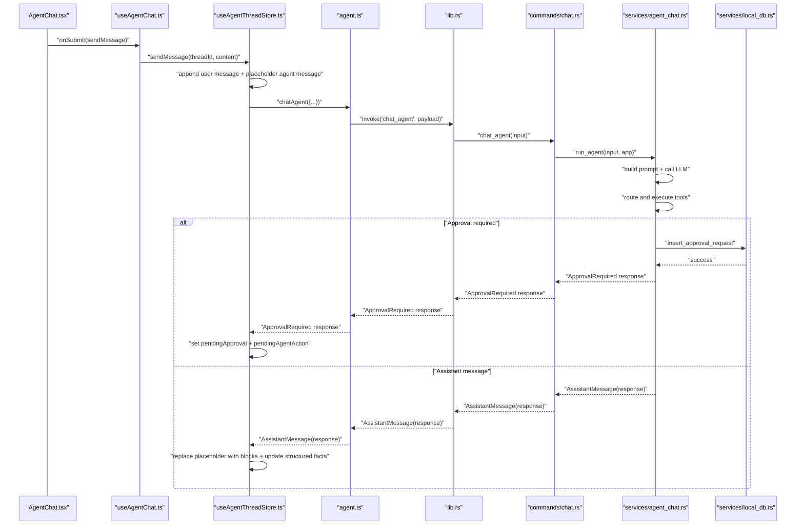
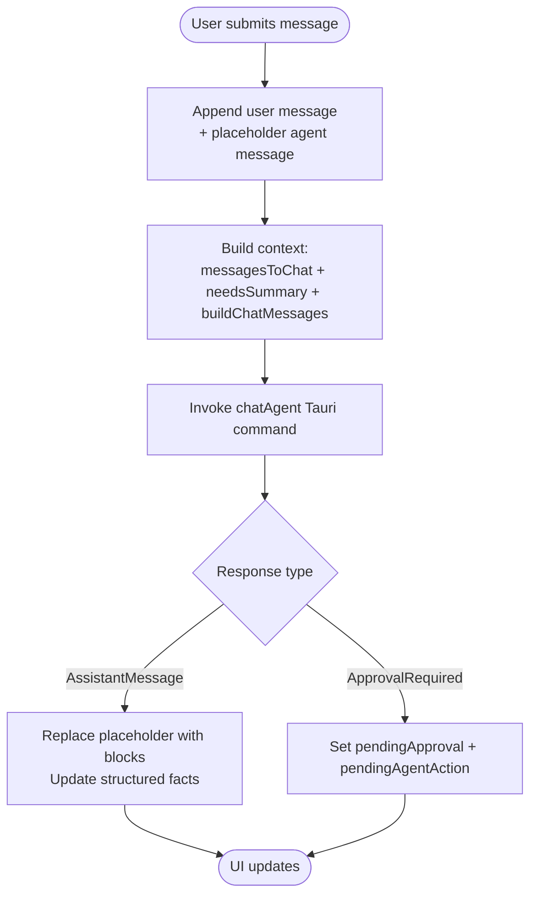
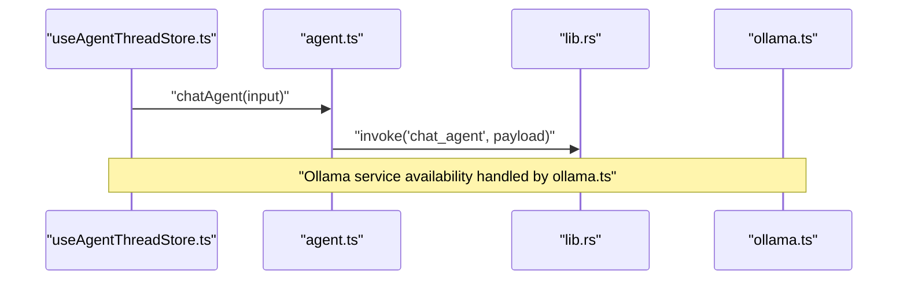
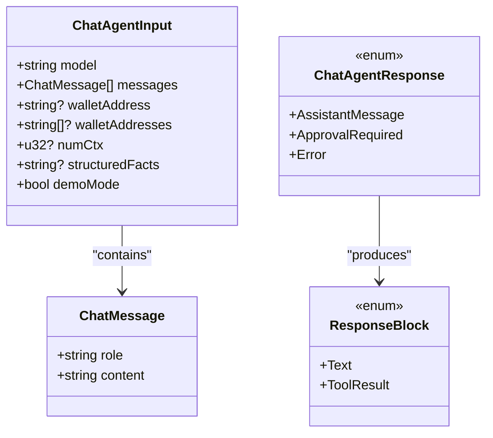
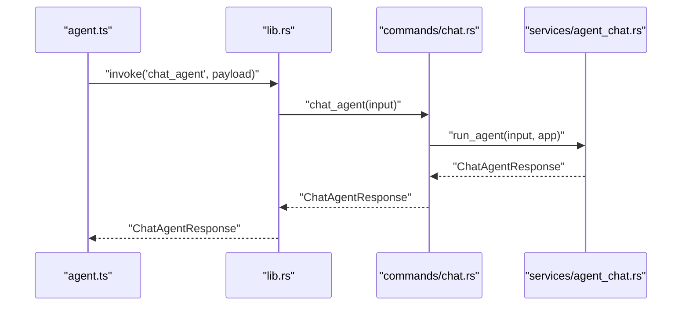
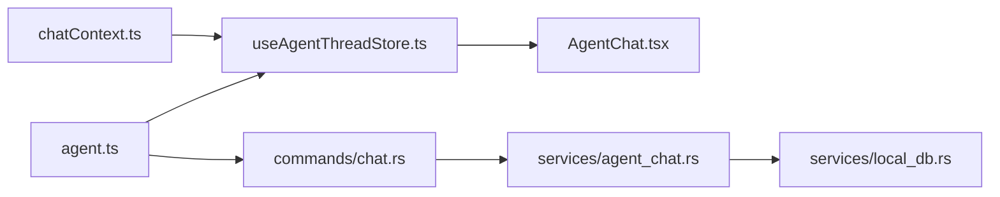

# Chat Commands

<cite>
**Referenced Files in This Document**
- [chat.rs](file://src-tauri/src/commands/chat.rs)
- [agent_chat.rs](file://src-tauri/src/services/agent_chat.rs)
- [local_db.rs](file://src-tauri/src/services/local_db.rs)
- [lib.rs](file://src-tauri/src/lib.rs)
- [ollama.ts](file://src/lib/ollama.ts)
- [chatContext.ts](file://src/lib/chatContext.ts)
- [useAgentThreadStore.ts](file://src/store/useAgentThreadStore.ts)
- [useAgentChat.ts](file://src/hooks/useAgentChat.ts)
- [AgentChat.tsx](file://src/components/agent/AgentChat.tsx)
- [agent.ts](file://src/lib/agent.ts)
</cite>

## Table of Contents
1. [Introduction](#introduction)
2. [Project Structure](#project-structure)
3. [Core Components](#core-components)
4. [Architecture Overview](#architecture-overview)
5. [Detailed Component Analysis](#detailed-component-analysis)
6. [Dependency Analysis](#dependency-analysis)
7. [Performance Considerations](#performance-considerations)
8. [Troubleshooting Guide](#troubleshooting-guide)
9. [Conclusion](#conclusion)

## Introduction
This document describes the Chat command handlers that power the agent-driven chat experience. It covers:
- Frontend JavaScript interface for chat operations
- Backend Rust implementation for message processing and tool orchestration
- Parameter schemas for chat messages and approvals
- Return value formats for chat responses
- Error handling patterns
- Command registration and invocation
- Permission and security considerations
- Message serialization, thread persistence, and real-time synchronization
- Practical examples and validation patterns

## Project Structure
The chat system spans three layers:
- Frontend React components and stores manage UI state, message composition, and real-time updates
- Frontend libraries expose typed Tauri invocations for chat and approvals
- Backend Rust commands and services process chat requests, integrate with tools, and persist state

**Diagram sources**
- [AgentChat.tsx:1-124](file://src/components/agent/AgentChat.tsx#L1-L124)
- [useAgentChat.ts:1-97](file://src/hooks/useAgentChat.ts#L1-L97)
- [useAgentThreadStore.ts:1-642](file://src/store/useAgentThreadStore.ts#L1-L642)
- [agent.ts:1-86](file://src/lib/agent.ts#L1-L86)
- [ollama.ts:1-165](file://src/lib/ollama.ts#L1-L165)
- [chatContext.ts:1-203](file://src/lib/chatContext.ts#L1-L203)
- [lib.rs:90-190](file://src-tauri/src/lib.rs#L90-L190)
- [chat.rs:303-310](file://src-tauri/src/commands/chat.rs#L303-L310)
- [agent_chat.rs:190-358](file://src-tauri/src/services/agent_chat.rs#L190-L358)
- [local_db.rs:108-154](file://src-tauri/src/services/local_db.rs#L108-L154)

**Section sources**
- [lib.rs:90-190](file://src-tauri/src/lib.rs#L90-L190)
- [chat.rs:303-310](file://src-tauri/src/commands/chat.rs#L303-L310)
- [agent_chat.rs:190-358](file://src-tauri/src/services/agent_chat.rs#L190-L358)
- [local_db.rs:108-154](file://src-tauri/src/services/local_db.rs#L108-L154)
- [useAgentThreadStore.ts:198-533](file://src/store/useAgentThreadStore.ts#L198-L533)
- [agent.ts:14-51](file://src/lib/agent.ts#L14-L51)
- [ollama.ts:78-109](file://src/lib/ollama.ts#L78-L109)
- [chatContext.ts:59-90](file://src/lib/chatContext.ts#L59-L90)

## Core Components
- Frontend chat pipeline:
  - UI renders messages and handles user input
  - Hook orchestrates send, approve, and reject actions
  - Store manages threads, streaming state, rolling summaries, and structured facts
  - Libraries wrap Tauri commands and Ollama calls
- Backend chat pipeline:
  - Tauri command validates inputs and delegates to agent service
  - Agent service builds prompts, calls LLM, routes tool calls, and persists approvals
  - Local DB stores approvals, executions, logs, and audits

Key responsibilities:
- Message sending: compose context, call backend, render response blocks
- Thread management: create, open, delete, and maintain rolling summaries
- Conversation history: truncate, summarize, and inject structured facts
- Chat state operations: streaming indicators, pending approvals, suggestions
- Real-time synchronization: store updates, approval UI, and follow-ups

**Section sources**
- [AgentChat.tsx:10-124](file://src/components/agent/AgentChat.tsx#L10-L124)
- [useAgentChat.ts:13-97](file://src/hooks/useAgentChat.ts#L13-L97)
- [useAgentThreadStore.ts:71-117](file://src/store/useAgentThreadStore.ts#L71-L117)
- [agent.ts:14-51](file://src/lib/agent.ts#L14-L51)
- [chat.rs:303-310](file://src-tauri/src/commands/chat.rs#L303-L310)
- [agent_chat.rs:190-358](file://src-tauri/src/services/agent_chat.rs#L190-L358)

## Architecture Overview
End-to-end flow for a chat message submission and response:

**Diagram sources**
- [AgentChat.tsx:10-124](file://src/components/agent/AgentChat.tsx#L10-L124)
- [useAgentChat.ts:31-37](file://src/hooks/useAgentChat.ts#L31-L37)
- [useAgentThreadStore.ts:198-533](file://src/store/useAgentThreadStore.ts#L198-L533)
- [agent.ts:14-27](file://src/lib/agent.ts#L14-L27)
- [lib.rs:90-190](file://src-tauri/src/lib.rs#L90-L190)
- [chat.rs:303-310](file://src-tauri/src/commands/chat.rs#L303-L310)
- [agent_chat.rs:190-358](file://src-tauri/src/services/agent_chat.rs#L190-L358)
- [local_db.rs:117-132](file://src-tauri/src/services/local_db.rs#L117-L132)

## Detailed Component Analysis

### Frontend: Chat UI and Stores
- AgentChat.tsx renders the conversation and input area, scrolling to the latest message and disabling input during streaming.
- useAgentChat.ts exposes sendMessage, approveAction, and rejectAction, coordinating with the store and toast notifications.
- useAgentThreadStore.ts:
  - Manages threads, titles, rolling summaries, structured facts, and streaming state
  - Builds context for the agent using chatContext helpers
  - Persists thread state and handles approval follow-ups
- chatContext.ts:
  - Converts internal messages to Ollama messages
  - Computes context budgets and decides whether to summarize older messages
  - Generates rolling summaries and merges structured facts

**Diagram sources**
- [useAgentThreadStore.ts:198-533](file://src/store/useAgentThreadStore.ts#L198-L533)
- [chatContext.ts:29-90](file://src/lib/chatContext.ts#L29-L90)
- [AgentChat.tsx:25-30](file://src/components/agent/AgentChat.tsx#L25-L30)

**Section sources**
- [AgentChat.tsx:10-124](file://src/components/agent/AgentChat.tsx#L10-L124)
- [useAgentChat.ts:13-97](file://src/hooks/useAgentChat.ts#L13-L97)
- [useAgentThreadStore.ts:71-117](file://src/store/useAgentThreadStore.ts#L71-L117)
- [chatContext.ts:29-90](file://src/lib/chatContext.ts#L29-L90)

### Frontend: Chat Library and Ollama Integration
- agent.ts wraps Tauri invocations for chat_agent, approve_agent_action, reject_agent_action, and related queries.
- ollama.ts encapsulates local Ollama service checks, model pulls, and chat/generate calls.

**Diagram sources**
- [agent.ts:14-51](file://src/lib/agent.ts#L14-L51)
- [lib.rs:90-190](file://src-tauri/src/lib.rs#L90-L190)
- [ollama.ts:17-44](file://src/lib/ollama.ts#L17-L44)

**Section sources**
- [agent.ts:14-51](file://src/lib/agent.ts#L14-L51)
- [ollama.ts:78-109](file://src/lib/ollama.ts#L78-L109)

### Backend: Chat Command and Agent Service
- commands/chat.rs:
  - Validates model presence and delegates to agent_chat::run_agent
  - Exposes approval and execution log commands
- services/agent_chat.rs:
  - Builds a tools-aware system prompt, injects soul/memory, and appends conversation history
  - Calls LLM, routes tool results, and either returns AssistantMessage or ApprovalRequired
  - Inserts approval records and records audit events
- services/local_db.rs:
  - Provides approval_requests, tool_executions, command_log, and audit_log tables
  - Used for persistence of approvals, execution records, and logs

**Diagram sources**
- [agent_chat.rs:15-69](file://src-tauri/src/services/agent_chat.rs#L15-L69)

**Section sources**
- [chat.rs:303-310](file://src-tauri/src/commands/chat.rs#L303-L310)
- [agent_chat.rs:15-69](file://src-tauri/src/services/agent_chat.rs#L15-L69)
- [agent_chat.rs:190-358](file://src-tauri/src/services/agent_chat.rs#L190-L358)
- [local_db.rs:117-132](file://src-tauri/src/services/local_db.rs#L117-L132)

### Parameter Schemas and Validation
- ChatAgentInput (frontend to backend):
  - model: required string
  - messages: array of { role, content }
  - walletAddress: optional single address
  - walletAddresses: optional array of addresses
  - numCtx: optional context size
  - structuredFacts: optional summary of recent tool results
  - demoMode: optional boolean (default applied in frontend)
- ChatMessage:
  - role: "user" or "assistant"
  - content: string
- Response envelopes:
  - AssistantMessage: content + blocks
  - ApprovalRequired: approvalId, toolName, approvalKind, payload, message, expiresAt, version
  - Error: message

Validation highlights:
- Backend requires model to be non-empty
- Frontend filters placeholder agent messages and excludes hidden metadata
- Context budget computed from model and truncated to latest N messages; older messages summarized when needed

**Section sources**
- [agent.ts:14-27](file://src/lib/agent.ts#L14-L27)
- [chat.rs:303-310](file://src-tauri/src/commands/chat.rs#L303-L310)
- [agent_chat.rs:15-69](file://src-tauri/src/services/agent_chat.rs#L15-L69)
- [useAgentThreadStore.ts:280-309](file://src/store/useAgentThreadStore.ts#L280-L309)
- [chatContext.ts:59-90](file://src/lib/chatContext.ts#L59-L90)

### Return Value Formats
- AssistantMessage:
  - content: final synthesized text
  - blocks: array of ResponseBlock variants
    - Text: content
    - ToolResult: toolName + raw content
- ApprovalRequired:
  - approvalId: unique identifier
  - toolName: tool being executed
  - approvalKind: categorized kind
  - payload: tool-specific JSON payload
  - message: human-readable description
  - expiresAt: expiration timestamp
  - version: optimistic locking version
- Error:
  - message: error string

**Section sources**
- [agent_chat.rs:38-69](file://src-tauri/src/services/agent_chat.rs#L38-L69)
- [agent_chat.rs:190-358](file://src-tauri/src/services/agent_chat.rs#L190-L358)

### Error Handling Patterns
- Frontend:
  - Catches errors during chatAgent invocation and displays user-friendly messages
  - Falls back to a placeholder assistant message when model is missing
- Backend:
  - Propagates errors from LLM calls and tool routing
  - On approval rejection, returns structured result with success flag and message
  - On approval approve, inserts execution record and updates status; returns success/failure with optional txHash

**Section sources**
- [useAgentThreadStore.ts:244-274](file://src/store/useAgentThreadStore.ts#L244-L274)
- [useAgentThreadStore.ts:502-531](file://src/store/useAgentThreadStore.ts#L502-L531)
- [chat.rs:360-371](file://src-tauri/src/commands/chat.rs#L360-L371)
- [chat.rs:374-608](file://src-tauri/src/commands/chat.rs#L374-L608)

### Command Registration and Invocation
- Command registration:
  - lib.rs registers chat_agent, approve_agent_action, reject_agent_action, get_pending_approvals, get_execution_log, and many others
- Invocation:
  - agent.ts uses @tauri-apps/api invoke to call Rust commands
  - Payloads are serialized and validated by frontend helpers

**Diagram sources**
- [lib.rs:90-190](file://src-tauri/src/lib.rs#L90-L190)
- [chat.rs:303-310](file://src-tauri/src/commands/chat.rs#L303-L310)
- [agent_chat.rs:190-358](file://src-tauri/src/services/agent_chat.rs#L190-L358)

**Section sources**
- [lib.rs:90-190](file://src-tauri/src/lib.rs#L90-L190)
- [agent.ts:14-27](file://src/lib/agent.ts#L14-L27)

### Permission Requirements and Security Considerations
- Permissions:
  - Access to Tauri commands is controlled by the Tauri capability system; ensure appropriate permissions are granted for chat and approval operations
- Security:
  - Approval records include versioning and expiration timestamps to prevent replay and stale updates
  - Audit logging is performed for approval creation and updates
  - Tool execution records capture request payloads, results, and errors for traceability
  - Demo mode is used by default in frontend to avoid unintended production actions

Recommendations:
- Enforce capability policies for sensitive commands
- Validate and sanitize tool payloads before execution
- Monitor approval expiration and stale requests
- Limit context size and summarize older messages to reduce prompt injection risks

**Section sources**
- [chat.rs:360-371](file://src-tauri/src/commands/chat.rs#L360-L371)
- [chat.rs:374-608](file://src-tauri/src/commands/chat.rs#L374-L608)
- [agent_chat.rs:296-335](file://src-tauri/src/services/agent_chat.rs#L296-L335)
- [local_db.rs:108-154](file://src-tauri/src/services/local_db.rs#L108-L154)

### Message Serialization, Thread Persistence, and Real-Time Synchronization
- Message serialization:
  - Frontend converts internal AgentMessage blocks to Ollama messages
  - Backend deserializes ChatAgentInput and serializes ChatAgentResponse
- Thread persistence:
  - useAgentThreadStore persists threads and activeThreadId to local storage
  - Rolling summaries and structured facts are stored per-thread
- Real-time synchronization:
  - Placeholder agent messages enable immediate UI feedback
  - Approval UI appears when backend returns ApprovalRequired
  - Follow-up messages record approval outcomes

**Section sources**
- [chatContext.ts:29-45](file://src/lib/chatContext.ts#L29-L45)
- [useAgentThreadStore.ts:198-533](file://src/store/useAgentThreadStore.ts#L198-L533)
- [AgentChat.tsx:25-30](file://src/components/agent/AgentChat.tsx#L25-L30)

### Practical Examples
- Sending a message:
  - UI triggers sendMessage with user content
  - Store appends a placeholder agent message and calls chatAgent
  - Backend responds with AssistantMessage; Store replaces placeholder with formatted blocks
- Requesting approval:
  - Backend routes tool call requiring user approval
  - Store sets pendingApproval and pendingAgentAction; UI shows approval card
  - Approve or reject updates DB and records command log
- Parameter validation:
  - Frontend trims content and ignores empty submissions
  - Backend enforces non-empty model field
  - Context budget ensures long histories remain within limits

**Section sources**
- [useAgentChat.ts:31-37](file://src/hooks/useAgentChat.ts#L31-L37)
- [useAgentThreadStore.ts:198-533](file://src/store/useAgentThreadStore.ts#L198-L533)
- [chat.rs:303-310](file://src-tauri/src/commands/chat.rs#L303-L310)

## Dependency Analysis
- Frontend depends on:
  - agent.ts for Tauri command wrappers
  - chatContext.ts for context building and summarization
  - useAgentThreadStore.ts for state and persistence
- Backend depends on:
  - commands/chat.rs for command entrypoints
  - services/agent_chat.rs for orchestration
  - services/local_db.rs for persistence

**Diagram sources**
- [agent.ts:14-51](file://src/lib/agent.ts#L14-L51)
- [useAgentThreadStore.ts:198-533](file://src/store/useAgentThreadStore.ts#L198-L533)
- [AgentChat.tsx:10-124](file://src/components/agent/AgentChat.tsx#L10-L124)
- [chat.rs:303-310](file://src-tauri/src/commands/chat.rs#L303-L310)
- [agent_chat.rs:190-358](file://src-tauri/src/services/agent_chat.rs#L190-L358)
- [local_db.rs:117-132](file://src-tauri/src/services/local_db.rs#L117-L132)

**Section sources**
- [agent.ts:14-51](file://src/lib/agent.ts#L14-L51)
- [useAgentThreadStore.ts:198-533](file://src/store/useAgentThreadStore.ts#L198-L533)
- [chat.rs:303-310](file://src-tauri/src/commands/chat.rs#L303-L310)
- [agent_chat.rs:190-358](file://src-tauri/src/services/agent_chat.rs#L190-L358)
- [local_db.rs:117-132](file://src-tauri/src/services/local_db.rs#L117-L132)

## Performance Considerations
- Context budgeting:
  - Compute token estimates and cap context to latest N messages
  - Summarize older messages when exceeding budget to keep prompts manageable
- Streaming and placeholders:
  - Show immediate placeholder feedback to improve perceived latency
- Tool round limiting:
  - Cap tool-execution rounds to avoid long loops
- Database indexing:
  - Indexes on approval_requests and tool_executions support fast retrieval and filtering

[No sources needed since this section provides general guidance]

## Troubleshooting Guide
Common issues and resolutions:
- Model not selected:
  - Frontend opens setup modal and shows a message when model is missing
- Ollama service unavailable:
  - Use ollama.ts helpers to check status and pull models
- Approval conflicts:
  - Ensure expectedVersion matches stored version; otherwise reject stale updates
- Execution failures:
  - Inspect tool_executions for error_code and error_message; consult command_log for audit trail

**Section sources**
- [useAgentThreadStore.ts:244-274](file://src/store/useAgentThreadStore.ts#L244-L274)
- [ollama.ts:17-44](file://src/lib/ollama.ts#L17-L44)
- [chat.rs:360-371](file://src-tauri/src/commands/chat.rs#L360-L371)
- [local_db.rs:137-150](file://src-tauri/src/services/local_db.rs#L137-L150)

## Conclusion
The chat command handlers provide a robust, extensible pipeline for conversational AI with integrated tool execution and approvals. The frontend manages context, persistence, and real-time updates, while the backend orchestrates LLM calls, tool routing, and secure state management. By adhering to the schemas, validation patterns, and security recommendations outlined here, teams can reliably extend and operate the chat system.