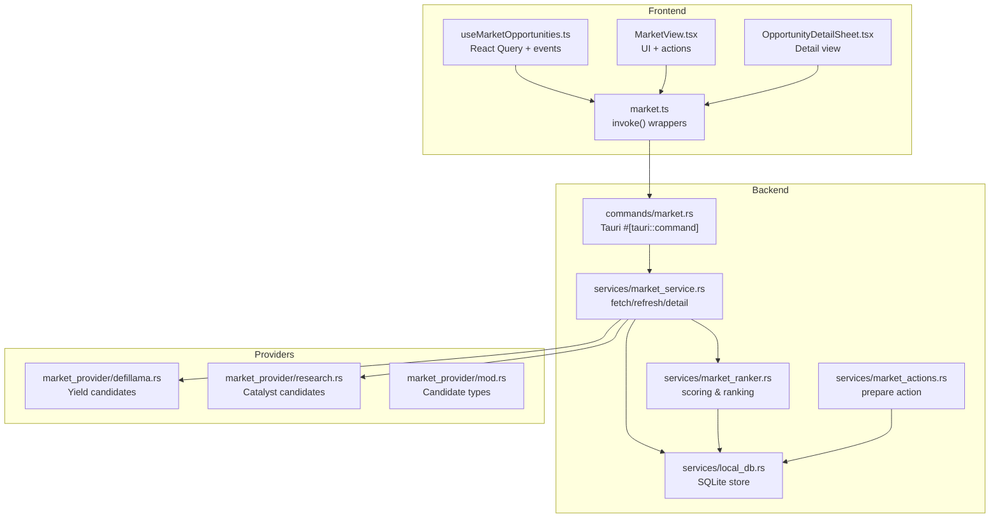
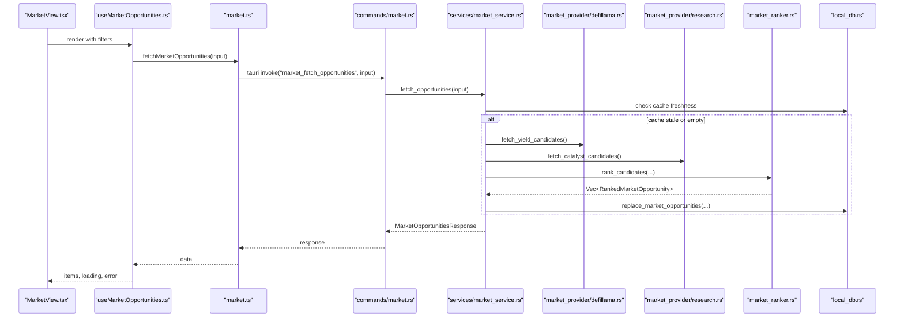
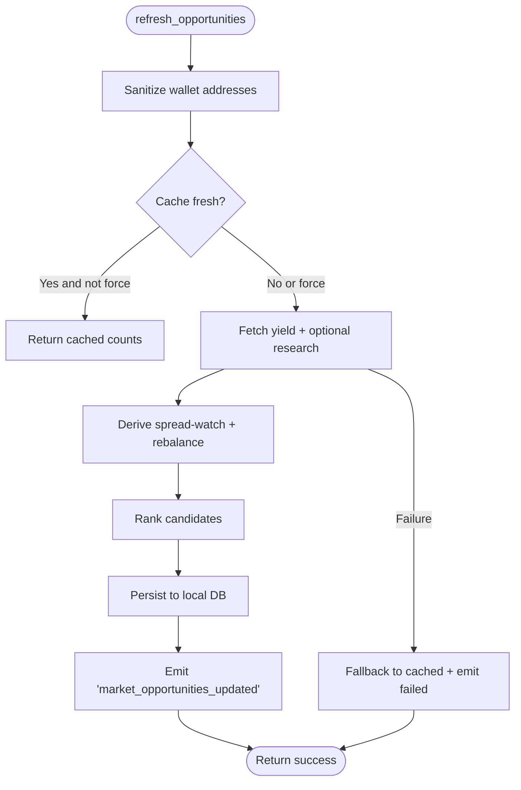
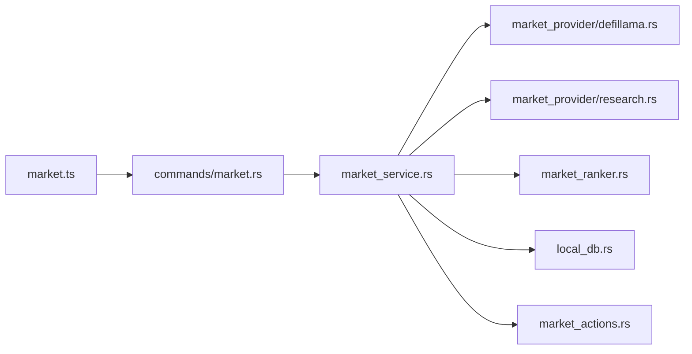

# Market Commands

<cite>
**Referenced Files in This Document**
- [src/lib/market.ts](file://src/lib/market.ts)
- [src/types/market.ts](file://src/types/market.ts)
- [src/hooks/useMarketOpportunities.ts](file://src/hooks/useMarketOpportunities.ts)
- [src/components/market/MarketView.tsx](file://src/components/market/MarketView.tsx)
- [src/components/market/OpportunityDetailSheet.tsx](file://src/components/market/OpportunityDetailSheet.tsx)
- [src-tauri/src/commands/market.rs](file://src-tauri/src/commands/market.rs)
- [src-tauri/src/services/market_service.rs](file://src-tauri/src/services/market_service.rs)
- [src-tauri/src/services/market_provider/mod.rs](file://src-tauri/src/services/market_provider/mod.rs)
- [src-tauri/src/services/market_provider/defillama.rs](file://src-tauri/src/services/market_provider/defillama.rs)
- [src-tauri/src/services/market_provider/research.rs](file://src-tauri/src/services/market_provider/research.rs)
- [src-tauri/src/services/market_ranker.rs](file://src-tauri/src/services/market_ranker.rs)
- [src-tauri/src/services/market_actions.rs](file://src-tauri/src/services/market_actions.rs)
- [src-tauri/src/services/local_db.rs](file://src-tauri/src/services/local_db.rs)
</cite>

## Table of Contents
1. [Introduction](#introduction)
2. [Project Structure](#project-structure)
3. [Core Components](#core-components)
4. [Architecture Overview](#architecture-overview)
5. [Detailed Component Analysis](#detailed-component-analysis)
6. [Dependency Analysis](#dependency-analysis)
7. [Performance Considerations](#performance-considerations)
8. [Troubleshooting Guide](#troubleshooting-guide)
9. [Conclusion](#conclusion)
10. [Appendices](#appendices)

## Introduction
This document describes the Market command handlers that power market data discovery, filtering, and presentation across yield opportunities, spread watches, rebalancing suggestions, and DeFi research catalysts. It covers the JavaScript frontend interface for market operations, the Rust backend implementation for market data processing, parameter schemas, return value formats, error handling patterns, command registration, permission and security considerations, data aggregation and scoring, and real-time updates. Practical examples and response processing guidance are included for developers integrating or extending the market subsystem.

## Project Structure
The market feature spans three layers:
- Frontend (TypeScript/React): UI components, hooks, and typed APIs for invoking backend commands.
- Backend (Rust/Tauri): Tauri commands that orchestrate market data fetching, ranking, caching, and event emission.
- Services: Market providers (DeFiLlama yield pools, Sonar research), ranking engine, actions preparation, and local database persistence.

**Diagram sources**
- [src/lib/market.ts:1-135](file://src/lib/market.ts#L1-L135)
- [src/hooks/useMarketOpportunities.ts:1-131](file://src/hooks/useMarketOpportunities.ts#L1-L131)
- [src/components/market/MarketView.tsx:1-267](file://src/components/market/MarketView.tsx#L1-L267)
- [src/components/market/OpportunityDetailSheet.tsx:1-110](file://src/components/market/OpportunityDetailSheet.tsx#L1-L110)
- [src-tauri/src/commands/market.rs:1-36](file://src-tauri/src/commands/market.rs#L1-L36)
- [src-tauri/src/services/market_service.rs:1-745](file://src-tauri/src/services/market_service.rs#L1-L745)
- [src-tauri/src/services/market_provider/mod.rs:1-160](file://src-tauri/src/services/market_provider/mod.rs#L1-L160)
- [src-tauri/src/services/market_provider/defillama.rs:1-151](file://src-tauri/src/services/market_provider/defillama.rs#L1-L151)
- [src-tauri/src/services/market_provider/research.rs:1-112](file://src-tauri/src/services/market_provider/research.rs#L1-L112)
- [src-tauri/src/services/market_ranker.rs:1-559](file://src-tauri/src/services/market_ranker.rs#L1-L559)
- [src-tauri/src/services/market_actions.rs:1-141](file://src-tauri/src/services/market_actions.rs#L1-L141)
- [src-tauri/src/services/local_db.rs:1-200](file://src-tauri/src/services/local_db.rs#L1-L200)

**Section sources**
- [src/lib/market.ts:1-135](file://src/lib/market.ts#L1-L135)
- [src-tauri/src/commands/market.rs:1-36](file://src-tauri/src/commands/market.rs#L1-L36)

## Core Components
- Frontend market API: Typed invocations for fetching opportunities, refreshing, retrieving details, and preparing actions.
- React hook: Fetches and caches market data, listens for backend events, and exposes loading/error states.
- UI components: Market view with filters, cards, and a detail sheet.
- Backend commands: Expose Tauri commands for market operations.
- Market service: Orchestrates provider fetching, caching, ranking, and emits real-time updates.
- Providers: DeFiLlama yield pools and Sonar research synthesis.
- Ranking engine: Scores and ranks candidates by global/personal/portfolio-fit heuristics.
- Actions: Prepares approval-required strategies or agent drafts depending on opportunity actionability.
- Local DB: Stores opportunities, provider runs, and approval requests.

**Section sources**
- [src/lib/market.ts:16-135](file://src/lib/market.ts#L16-L135)
- [src/hooks/useMarketOpportunities.ts:27-131](file://src/hooks/useMarketOpportunities.ts#L27-L131)
- [src-tauri/src/commands/market.rs:8-36](file://src-tauri/src/commands/market.rs#L8-L36)
- [src-tauri/src/services/market_service.rs:220-365](file://src-tauri/src/services/market_service.rs#L220-L365)
- [src-tauri/src/services/market_provider/defillama.rs:27-116](file://src-tauri/src/services/market_provider/defillama.rs#L27-L116)
- [src-tauri/src/services/market_provider/research.rs:23-83](file://src-tauri/src/services/market_provider/research.rs#L23-L83)
- [src-tauri/src/services/market_ranker.rs:17-493](file://src-tauri/src/services/market_ranker.rs#L17-L493)
- [src-tauri/src/services/market_actions.rs:8-36](file://src-tauri/src/services/market_actions.rs#L8-L36)
- [src-tauri/src/services/local_db.rs:180-200](file://src-tauri/src/services/local_db.rs#L180-L200)

## Architecture Overview
The market pipeline:
- Frontend invokes Tauri commands via typed wrappers.
- Backend commands delegate to the market service.
- Market service fetches candidates from providers, derives spread-watch opportunities, builds portfolio context, optionally fetches research, ranks candidates, persists to local DB, and emits real-time events.
- Frontend reacts to events and refetches data.

**Diagram sources**
- [src/components/market/MarketView.tsx:42-56](file://src/components/market/MarketView.tsx#L42-L56)
- [src/hooks/useMarketOpportunities.ts:39-62](file://src/hooks/useMarketOpportunities.ts#L39-L62)
- [src/lib/market.ts:16-28](file://src/lib/market.ts#L16-L28)
- [src-tauri/src/commands/market.rs:8-13](file://src-tauri/src/commands/market.rs#L8-L13)
- [src-tauri/src/services/market_service.rs:220-261](file://src-tauri/src/services/market_service.rs#L220-L261)
- [src-tauri/src/services/market_provider/defillama.rs:27-116](file://src-tauri/src/services/market_provider/defillama.rs#L27-L116)
- [src-tauri/src/services/market_provider/research.rs:23-83](file://src-tauri/src/services/market_provider/research.rs#L23-L83)
- [src-tauri/src/services/market_ranker.rs:17-35](file://src-tauri/src/services/market_ranker.rs#L17-L35)
- [src-tauri/src/services/local_db.rs:180-200](file://src-tauri/src/services/local_db.rs#L180-L200)

## Detailed Component Analysis

### Frontend API and Types
- Functions:
  - fetchMarketOpportunities(input): Returns MarketOpportunitiesResponse.
  - refreshMarketOpportunities(input): Returns MarketRefreshResult.
  - getMarketOpportunityDetail(opportunityId): Returns MarketOpportunityDetail.
  - prepareMarketOpportunityAction(input): Returns MarketPrepareOpportunityActionResult.
  - Utility label helpers for chain, category, and actionability.
  - launchPreparedMarketAction(opportunity, result): Opens agent thread or returns route.
- Parameter schemas:
  - MarketFetchInput: category, chain, includeResearch, walletAddresses[], limit.
  - MarketRefreshInput: includeResearch, walletAddresses[], force.
  - MarketPrepareOpportunityActionInput: opportunityId.
- Return schemas:
  - MarketOpportunitiesResponse: items[], generatedAt, nextRefreshAt, stale, availableChains[], availableCategories[].
  - MarketOpportunityDetail: opportunity, sources[], rankingBreakdown, guardrailNotes[], executionReadinessNotes[].
  - MarketPrepareOpportunityActionResult: discriminated union with approvalRequired, agentDraft, detailOnly.

**Section sources**
- [src/lib/market.ts:16-135](file://src/lib/market.ts#L16-L135)
- [src/types/market.ts:61-134](file://src/types/market.ts#L61-L134)

### React Hook: useMarketOpportunities
- Normalizes wallet addresses and filters invalid entries.
- Uses React Query to cache MarketOpportunitiesResponse with a 60s staleTime.
- Listens to market_opportunities_updated and market_opportunities_refresh_failed events to invalidate queries.
- Provides refresh() that triggers backend refresh with force=true.

**Section sources**
- [src/hooks/useMarketOpportunities.ts:27-131](file://src/hooks/useMarketOpportunities.ts#L27-L131)

### UI Components: MarketView and Detail Sheet
- MarketView:
  - Filters by category and chain, shows loading skeletons or empty states.
  - Displays OpportunityCard items with APY/TVL/risk/confidence/freshness.
  - Handles primary action: detail-only, agent draft, or approval-required strategy creation.
  - Shows wallet-aware notices and stale cache notices.
- OpportunityDetailSheet:
  - Renders opportunity metrics, ranking breakdown, guardrails, execution notes, and sources.

**Section sources**
- [src/components/market/MarketView.tsx:27-267](file://src/components/market/MarketView.tsx#L27-L267)
- [src/components/market/OpportunityDetailSheet.tsx:11-110](file://src/components/market/OpportunityDetailSheet.tsx#L11-L110)

### Backend Commands: market.rs
- Registers four #[tauri::command] functions:
  - market_fetch_opportunities(input) -> MarketOpportunitiesResponse
  - market_refresh_opportunities(app, input) -> MarketRefreshResult
  - market_get_opportunity_detail(input) -> MarketOpportunityDetail
  - market_prepare_opportunity_action(input) -> MarketPrepareOpportunityActionResult

**Section sources**
- [src-tauri/src/commands/market.rs:8-36](file://src-tauri/src/commands/market.rs#L8-L36)

### Market Service: Data Aggregation, Scoring, and Real-Time Updates
- fetch_opportunities:
  - Checks cache freshness and triggers refresh if needed.
  - Loads opportunities from local DB with filters and limit.
  - Computes generatedAt, stale flag, and available filters.
- refresh_opportunities:
  - Sanitizes wallet addresses and decides include_research and force.
  - Runs provider fetch (DeFiLlama yield), optional research (Sonar), and derives spread-watch candidates.
  - Builds MarketContext from wallet holdings and derives rebalance candidates.
  - Ranks candidates via market_ranker and persists to local DB.
  - Emits market_opportunities_updated with new items and available filters.
  - Emits market_opportunities_refresh_failed with stale=true when serving cached results.
- Helper functions:
  - cache_is_fresh, supported_chains, supported_categories, sanitize_wallet_addresses, build_market_context, build_rebalance_candidates, refresh_research_provider, fallback_to_cached, record mapping helpers.

**Diagram sources**
- [src-tauri/src/services/market_service.rs:263-365](file://src-tauri/src/services/market_service.rs#L263-L365)
- [src-tauri/src/services/market_provider/defillama.rs:27-116](file://src-tauri/src/services/market_provider/defillama.rs#L27-L116)
- [src-tauri/src/services/market_provider/research.rs:23-83](file://src-tauri/src/services/market_provider/research.rs#L23-L83)
- [src-tauri/src/services/market_ranker.rs:17-35](file://src-tauri/src/services/market_ranker.rs#L17-L35)
- [src-tauri/src/services/local_db.rs:180-200](file://src-tauri/src/services/local_db.rs#L180-L200)

**Section sources**
- [src-tauri/src/services/market_service.rs:220-365](file://src-tauri/src/services/market_service.rs#L220-L365)

### Market Providers
- DeFiLlama provider:
  - Fetches yield pools, normalizes chain/symbol/protocol, filters by APY and TVL thresholds, sorts by combined score, truncates to 24.
- Research provider:
  - Queries Sonar client with a strict JSON schema prompt, normalizes chains and symbols, produces catalyst candidates with confidence and freshness.

**Section sources**
- [src-tauri/src/services/market_provider/defillama.rs:27-116](file://src-tauri/src/services/market_provider/defillama.rs#L27-L116)
- [src-tauri/src/services/market_provider/research.rs:23-83](file://src-tauri/src/services/market_provider/research.rs#L23-L83)
- [src-tauri/src/services/market_provider/mod.rs:62-82](file://src-tauri/src/services/market_provider/mod.rs#L62-L82)

### Ranking Engine: Opportunity Scoring
- Weighted scoring across global and personal dimensions:
  - Yield: APY, TVL, freshness, protocol safety; personal: owned assets, chain coverage.
  - Spread watch: spread size, freshness; personal: overlap and chain coverage.
  - Rebalance: drift severity, notional, freshness; personal: overlap and wallet presence; actionability approval_ready when conditions met.
  - Catalyst: confidence and freshness; actionability research_only.
- Produces MarketOpportunity with metrics, portfolioFit, primaryAction, and compact details.

**Section sources**
- [src-tauri/src/services/market_ranker.rs:17-493](file://src-tauri/src/services/market_ranker.rs#L17-L493)

### Actions Preparation
- prepare_opportunity_action:
  - Validates opportunityId and checks primaryAction.enabled.
  - For approval_ready: creates an approval request persisted to local DB, emits audit, returns approvalRequired with payload.
  - For agent_ready: returns agentDraft with title and prompt built from opportunity data.
  - Otherwise: returns detailOnly with reason.

**Section sources**
- [src-tauri/src/services/market_actions.rs:8-36](file://src-tauri/src/services/market_actions.rs#L8-L36)

### Local Database Schema (Market)
- market_opportunities table stores:
  - id, fingerprint, title, summary, category, chain, protocol, symbols_json, risk, confidence, score, actionability, metrics_json, portfolio_fit_json, primary_action_json, details_json, sources_json, stale, fresh_until, timestamps.
- approval_requests table supports approval gating for queued strategies.

**Section sources**
- [src-tauri/src/services/local_db.rs:180-200](file://src-tauri/src/services/local_db.rs#L180-L200)

## Dependency Analysis
- Frontend depends on:
  - @tauri-apps/api for invoke().
  - @tanstack/react-query for caching and invalidation.
  - Local event listeners for real-time updates.
- Backend depends on:
  - tauri::Emitter for events.
  - market_provider modules for external data.
  - market_ranker for scoring.
  - local_db for persistence.
  - market_actions for approval/agent preparation.

**Diagram sources**
- [src/lib/market.ts:1-14](file://src/lib/market.ts#L1-L14)
- [src-tauri/src/commands/market.rs:1-6](file://src-tauri/src/commands/market.rs#L1-L6)
- [src-tauri/src/services/market_service.rs:1-16](file://src-tauri/src/services/market_service.rs#L1-L16)
- [src-tauri/src/services/market_provider/defillama.rs:1-6](file://src-tauri/src/services/market_provider/defillama.rs#L1-L6)
- [src-tauri/src/services/market_provider/research.rs:1-4](file://src-tauri/src/services/market_provider/research.rs#L1-L4)
- [src-tauri/src/services/market_ranker.rs:1-8](file://src-tauri/src/services/market_ranker.rs#L1-L8)
- [src-tauri/src/services/local_db.rs:1-6](file://src-tauri/src/services/local_db.rs#L1-L6)
- [src-tauri/src/services/market_actions.rs:1-6](file://src-tauri/src/services/market_actions.rs#L1-L6)

**Section sources**
- [src-tauri/src/services/market_service.rs:1-16](file://src-tauri/src/services/market_service.rs#L1-L16)

## Performance Considerations
- Stale-time caching: React Query uses 60s staleTime for market data to reduce redundant network calls.
- Backend cache freshness: Market refresh respects intervals (15 min for market data, 1 hour for research) and avoids unnecessary work when cached results are fresh.
- Provider limits: Yield candidates truncated to 24; ranking caps output to 24.
- Network timeouts: HTTP client configured with 20s timeout for DeFiLlama.
- Sorting and normalization: Precomputed scores and normalized ranges keep ranking efficient.

[No sources needed since this section provides general guidance]

## Troubleshooting Guide
Common issues and handling patterns:
- Empty or stale data:
  - Backend serves cached results and emits market_opportunities_refresh_failed with stale=true; frontend shows a notice and continues with cached items.
- Invalid wallet addresses:
  - Frontend filters walletAddresses to valid checksum addresses; backend sanitizes input.
- Disabled actions:
  - primaryAction.enabled may be false; prepare returns detailOnly with reason.
- Permission/access:
  - Market commands are invoked via Tauri; ensure frontend runtime detection and capability configuration are set up.
- Error propagation:
  - Backend returns Result<T, String>; frontend surfaces errors via toast or query error state.

**Section sources**
- [src-tauri/src/services/market_service.rs:601-624](file://src-tauri/src/services/market_service.rs#L601-L624)
- [src/hooks/useMarketOpportunities.ts:118-127](file://src/hooks/useMarketOpportunities.ts#L118-L127)
- [src-tauri/src/services/market_service.rs:421-428](file://src-tauri/src/services/market_service.rs#L421-L428)

## Conclusion
The Market command handlers provide a robust, real-time pipeline for discovering, scoring, and presenting DeFi opportunities. The frontend integrates seamlessly with Tauri commands, while the backend orchestrates provider ingestion, ranking, persistence, and event-driven updates. Security is enforced via approval-gated actions for high-risk operations, and performance is optimized through caching and selective refresh.

[No sources needed since this section summarizes without analyzing specific files]

## Appendices

### Command Registration and Permissions
- Commands are registered in the market module and exposed to the frontend via Tauri’s invoke mechanism.
- Permissions are managed by Tauri capabilities; ensure the frontend runtime is detected before invoking commands.

**Section sources**
- [src-tauri/src/commands/market.rs:8-36](file://src-tauri/src/commands/market.rs#L8-L36)
- [src/lib/market.ts:13-14](file://src/lib/market.ts#L13-L14)

### Security Considerations
- Approval gating: Opportunities requiring capital movement are transformed into approval requests stored locally and audited.
- Agent-first actions: Many opportunities are presented as agent-ready to minimize direct protocol exposure.
- Data sanitization: Wallet addresses are validated and normalized; provider inputs are normalized and filtered.

**Section sources**
- [src-tauri/src/services/market_actions.rs:38-118](file://src-tauri/src/services/market_actions.rs#L38-L118)
- [src-tauri/src/services/market_service.rs:421-428](file://src-tauri/src/services/market_service.rs#L421-L428)
- [src-tauri/src/services/market_provider/defillama.rs:118-151](file://src-tauri/src/services/market_provider/defillama.rs#L118-L151)
- [src-tauri/src/services/market_provider/research.rs:85-104](file://src-tauri/src/services/market_provider/research.rs#L85-L104)

### Practical Examples

- Retrieving opportunities:
  - Call fetchMarketOpportunities with category, chain, includeResearch, walletAddresses, limit.
  - Use React Query to cache and invalidate on market_opportunities_updated.
- Parameter validation:
  - Frontend trims and filters walletAddresses; backend validates and normalizes.
  - MarketFetchInput and MarketRefreshInput define optional fields with defaults.
- Response processing:
  - MarketOpportunitiesResponse provides items with actionability and primaryAction.
  - MarketOpportunityDetail includes ranking breakdown and guardrail notes.
  - prepareMarketOpportunityAction returns either approvalRequired, agentDraft, or detailOnly.

**Section sources**
- [src/lib/market.ts:16-59](file://src/lib/market.ts#L16-L59)
- [src/hooks/useMarketOpportunities.ts:27-131](file://src/hooks/useMarketOpportunities.ts#L27-L131)
- [src-tauri/src/services/market_service.rs:220-365](file://src-tauri/src/services/market_service.rs#L220-L365)
- [src-tauri/src/services/market_actions.rs:8-36](file://src-tauri/src/services/market_actions.rs#L8-L36)