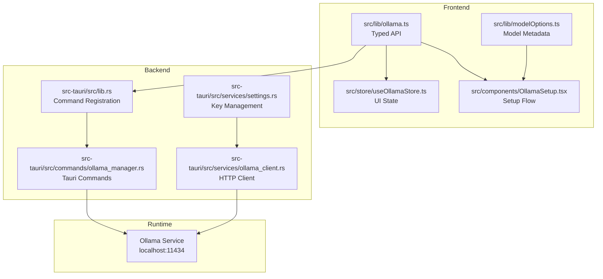
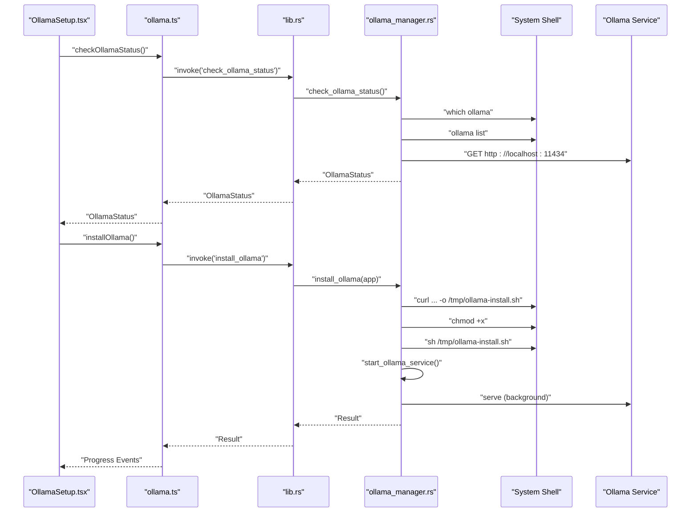
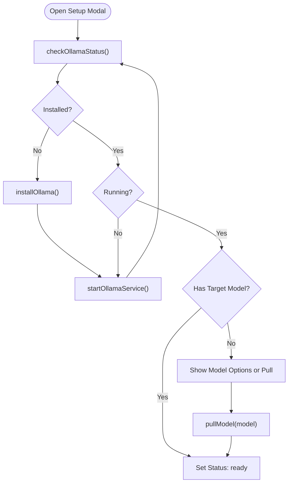
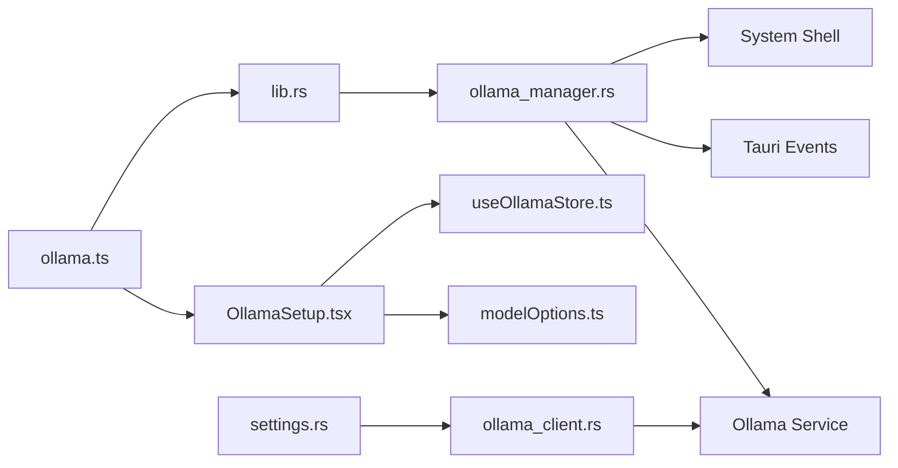

# Ollama Manager Commands

<cite>
**Referenced Files in This Document**
- [ollama_manager.rs](file://src-tauri/src/commands/ollama_manager.rs)
- [ollama.ts](file://src/lib/ollama.ts)
- [useOllamaStore.ts](file://src/store/useOllamaStore.ts)
- [OllamaSetup.tsx](file://src/components/OllamaSetup.tsx)
- [modelOptions.ts](file://src/lib/modelOptions.ts)
- [ollama_client.rs](file://src-tauri/src/services/ollama_client.rs)
- [lib.rs](file://src-tauri/src/lib.rs)
- [settings.rs](file://src-tauri/src/services/settings.rs)
- [tauri.conf.json](file://src-tauri/tauri.conf.json)
</cite>

## Table of Contents
1. [Introduction](#introduction)
2. [Project Structure](#project-structure)
3. [Core Components](#core-components)
4. [Architecture Overview](#architecture-overview)
5. [Detailed Component Analysis](#detailed-component-analysis)
6. [Dependency Analysis](#dependency-analysis)
7. [Performance Considerations](#performance-considerations)
8. [Troubleshooting Guide](#troubleshooting-guide)
9. [Conclusion](#conclusion)

## Introduction
This document describes the Ollama Manager command handlers that enable local AI model lifecycle management and inference within the Shadow Protocol desktop application. It covers:
- Frontend JavaScript interface for Ollama operations
- Rust backend implementation for model management and inference
- Parameter schemas for model configuration and inference
- Return value formats for AI responses
- Error handling patterns
- Command registration for Ollama services
- Permission and security considerations for local AI processing
- Practical workflows for model management and inference

## Project Structure
The Ollama integration spans three layers:
- Frontend (TypeScript): exposes typed APIs for invoking backend commands and performing inference
- Backend (Rust): implements Tauri commands and an HTTP client for Ollama
- UI (React): orchestrates setup, progress tracking, and model selection

**Diagram sources**
- [ollama.ts:1-165](file://src/lib/ollama.ts#L1-L165)
- [useOllamaStore.ts:1-82](file://src/store/useOllamaStore.ts#L1-L82)
- [OllamaSetup.tsx:1-308](file://src/components/OllamaSetup.tsx#L1-L308)
- [modelOptions.ts:1-65](file://src/lib/modelOptions.ts#L1-L65)
- [ollama_manager.rs:1-328](file://src-tauri/src/commands/ollama_manager.rs#L1-L328)
- [ollama_client.rs:1-106](file://src-tauri/src/services/ollama_client.rs#L1-L106)
- [settings.rs:1-243](file://src-tauri/src/services/settings.rs#L1-L243)
- [lib.rs:90-190](file://src-tauri/src/lib.rs#L90-L190)

**Section sources**
- [ollama.ts:1-165](file://src/lib/ollama.ts#L1-L165)
- [ollama_manager.rs:1-328](file://src-tauri/src/commands/ollama_manager.rs#L1-L328)
- [lib.rs:90-190](file://src-tauri/src/lib.rs#L90-L190)

## Core Components
- Frontend API surface for Ollama operations
  - Status checks, installation, service start, model pull/delete, system info, and inference helpers
  - Typed request/response interfaces for chat and generate endpoints
- Backend command handlers
  - Local shell orchestration for installation and model management
  - Progress emission via Tauri events
  - HTTP client for inference with optional bearer token support
- UI orchestration
  - Setup modal with progress tracking and model recommendation engine
  - Store for persistent setup state and progress

**Section sources**
- [ollama.ts:17-165](file://src/lib/ollama.ts#L17-L165)
- [ollama_manager.rs:161-328](file://src-tauri/src/commands/ollama_manager.rs#L161-L328)
- [OllamaSetup.tsx:31-137](file://src/components/OllamaSetup.tsx#L31-L137)
- [useOllamaStore.ts:1-82](file://src/store/useOllamaStore.ts#L1-L82)

## Architecture Overview
The system integrates a desktop-first privacy model: all AI workloads run locally via the Ollama service. The frontend communicates with the backend through Tauri commands, and inference requests are sent directly to the Ollama HTTP API.

**Diagram sources**
- [lib.rs:132-137](file://src-tauri/src/lib.rs#L132-L137)
- [ollama_manager.rs:161-243](file://src-tauri/src/commands/ollama_manager.rs#L161-L243)
- [ollama.ts:17-44](file://src/lib/ollama.ts#L17-L44)

## Detailed Component Analysis

### Frontend API: Ollama Operations
- Status and lifecycle
  - checkOllamaStatus: returns installed, running, models
  - installOllama: downloads and installs Ollama
  - startOllamaService: starts the Ollama server
  - getSystemInfo: CPU and memory metrics
  - deleteModel: removes a model by name
  - pullModel: streams progress via event listener
- Inference
  - chat: POST to /api/chat with optional num_ctx
  - generate: POST to /api/generate
  - isOllamaUnavailableError: recognizes common connectivity errors

Return value formats:
- chat: returns the assistant's content string
- generate: returns the generated response string
- pullModel: resolves when download completes; progress emitted via event

Parameter schemas:
- ChatOptions: model, messages array, stream flag, options.num_ctx
- GenerateOptions: model, prompt, stream flag
- Messages: role ("system" | "user" | "assistant"), content string

Security and privacy:
- Frontend enforces CSP allowing connections to localhost:11434 for inference
- Optional bearer token for inference requests via settings

**Section sources**
- [ollama.ts:9-165](file://src/lib/ollama.ts#L9-L165)
- [tauri.conf.json:32-34](file://src-tauri/tauri.conf.json#L32-L34)

### Backend Commands: Model Lifecycle and Management
- check_ollama_status
  - Detects installation via which
  - Lists models via ollama list
  - Probes service availability at http://localhost:11434
- install_ollama
  - Downloads installer, makes executable, runs installation
  - Emits progress events during each phase
  - Starts service and waits for readiness
- start_ollama_service
  - Runs ollama serve in background
  - Waits briefly then probes service
- get_system_info
  - Reports total memory (GB) and CPU count
- pull_model
  - Spawns ollama pull with stderr streaming
  - Parses progress lines and emits progress events
- delete_model
  - Validates non-empty model name
  - Executes ollama rm and normalizes error messages

Progress reporting:
- Backend emits "ollama_progress" events with step and percentage
- Frontend listens and updates UI state

Error handling:
- Shell command failures return descriptive errors
- Parsing errors are normalized and surfaced to callers
- Network probe timeouts are handled gracefully

**Section sources**
- [ollama_manager.rs:161-328](file://src-tauri/src/commands/ollama_manager.rs#L161-L328)

### Inference Pipeline: HTTP Client and Authorization
- ollama_client.rs
  - Sends POST to /api/chat with model, messages, stream, and optional options.num_ctx
  - Adds Authorization header if a bearer token is present
  - Parses response and returns trimmed content string
  - Converts non-success responses to structured errors

Authorization:
- Tokens are stored securely and cached per session
- Optional bearer token is attached to inference requests

**Section sources**
- [ollama_client.rs:46-105](file://src-tauri/src/services/ollama_client.rs#L46-L105)
- [settings.rs:159-195](file://src-tauri/src/services/settings.rs#L159-L195)

### UI Orchestration: Setup Flow and Model Selection
- OllamaSetup.tsx
  - Listens to progress events and updates modal state
  - Checks current status, installs or starts service if needed
  - Presents recommended models based on system info
  - Initiates model pull and finalizes setup
- useOllamaStore.ts
  - Persistent store for selected model, setup status, progress, and error messages
- modelOptions.ts
  - Defines model metadata, context budgets, and recommendation logic

**Diagram sources**
- [OllamaSetup.tsx:55-137](file://src/components/OllamaSetup.tsx#L55-L137)
- [useOllamaStore.ts:1-82](file://src/store/useOllamaStore.ts#L1-L82)
- [modelOptions.ts:46-65](file://src/lib/modelOptions.ts#L46-L65)

**Section sources**
- [OllamaSetup.tsx:31-137](file://src/components/OllamaSetup.tsx#L31-L137)
- [useOllamaStore.ts:1-82](file://src/store/useOllamaStore.ts#L1-L82)
- [modelOptions.ts:1-65](file://src/lib/modelOptions.ts#L1-L65)

### Command Registration and Permissions
- Registration
  - All Ollama commands are registered in lib.rs under generate_handler!
  - Includes check_ollama_status, install_ollama, pull_model, start_ollama_service, get_system_info, delete_model
- Permissions and Security
  - Tauri CSP restricts network access to localhost:11434 for inference
  - Settings module manages secure storage of bearer tokens
  - Shell commands operate with user privileges; ensure appropriate OS permissions

**Section sources**
- [lib.rs:132-137](file://src-tauri/src/lib.rs#L132-L137)
- [tauri.conf.json:32-34](file://src-tauri/tauri.conf.json#L32-L34)
- [settings.rs:159-195](file://src-tauri/src/services/settings.rs#L159-L195)

## Dependency Analysis
- Frontend depends on Tauri’s invoke/listen APIs and the Ollama HTTP API
- Backend depends on system shell, reqwest for probing, and Tauri event emission
- UI depends on Zustand store and model recommendation logic

**Diagram sources**
- [ollama.ts:1-165](file://src/lib/ollama.ts#L1-L165)
- [lib.rs:90-190](file://src-tauri/src/lib.rs#L90-L190)
- [ollama_manager.rs:1-328](file://src-tauri/src/commands/ollama_manager.rs#L1-L328)
- [OllamaSetup.tsx:1-308](file://src/components/OllamaSetup.tsx#L1-L308)
- [useOllamaStore.ts:1-82](file://src/store/useOllamaStore.ts#L1-L82)
- [modelOptions.ts:1-65](file://src/lib/modelOptions.ts#L1-L65)
- [ollama_client.rs:1-106](file://src-tauri/src/services/ollama_client.rs#L1-L106)
- [settings.rs:1-243](file://src-tauri/src/services/settings.rs#L1-L243)

**Section sources**
- [lib.rs:90-190](file://src-tauri/src/lib.rs#L90-L190)
- [ollama_manager.rs:1-328](file://src-tauri/src/commands/ollama_manager.rs#L1-L328)

## Performance Considerations
- Model pulls: progress parsing uses lightweight line scanning; avoid heavy synchronous operations in UI threads
- Inference: prefer streaming where supported; batch requests judiciously to reduce overhead
- System info: cached in UI store to minimize repeated backend calls
- Shell operations: run asynchronously and avoid blocking the main thread

## Troubleshooting Guide
Common issues and resolutions:
- Service not ready after install
  - Verify ollama serve started and responds to http://localhost:11434
  - Check progress events for failure points during install
- Model pull failures
  - Ensure model name is non-empty and correctly formatted
  - Inspect stderr/stdout normalization for actionable error messages
- Inference errors
  - Confirm service is running and reachable
  - Validate bearer token presence if required
  - Use isOllamaUnavailableError to detect network/unavailable conditions
- UI stuck on “waiting”
  - Ensure progress event listener is attached and unlistening is handled properly

**Section sources**
- [ollama_manager.rs:290-328](file://src-tauri/src/commands/ollama_manager.rs#L290-L328)
- [ollama.ts:153-165](file://src/lib/ollama.ts#L153-L165)
- [OllamaSetup.tsx:119-127](file://src/components/OllamaSetup.tsx#L119-L127)

## Conclusion
The Ollama Manager provides a robust, privacy-first framework for local AI model lifecycle management and inference. The frontend-backend separation, typed interfaces, and event-driven progress reporting deliver a reliable user experience while keeping sensitive AI workloads on-device. Secure key management and CSP enforcement further strengthen operational safety.