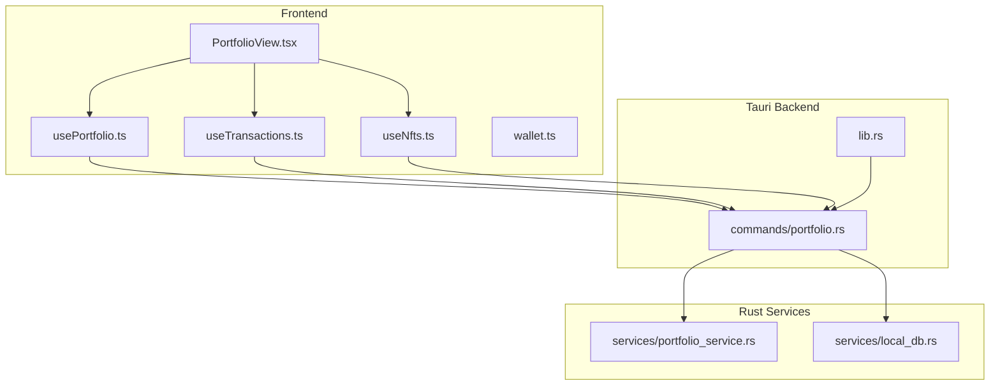
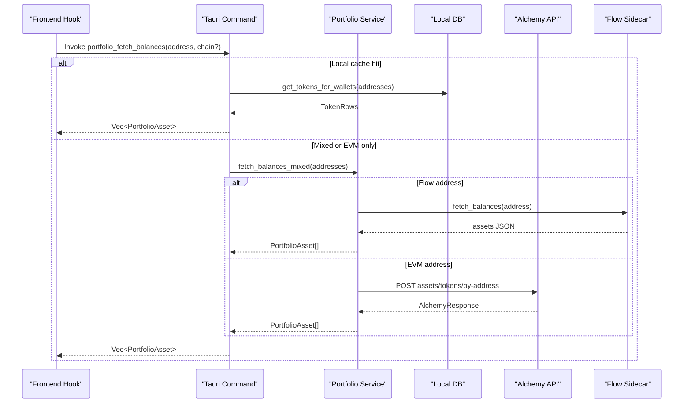
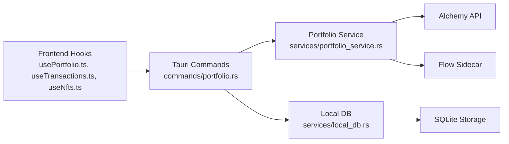

# Portfolio Commands

<cite>
**Referenced Files in This Document**
- [portfolio.rs](file://src-tauri/src/commands/portfolio.rs)
- [portfolio_service.rs](file://src-tauri/src/services/portfolio_service.rs)
- [local_db.rs](file://src-tauri/src/services/local_db.rs)
- [lib.rs](file://src-tauri/src/lib.rs)
- [usePortfolio.ts](file://src/hooks/usePortfolio.ts)
- [useTransactions.ts](file://src/hooks/useTransactions.ts)
- [useNfts.ts](file://src/hooks/useNfts.ts)
- [PortfolioView.tsx](file://src/components/portfolio/PortfolioView.tsx)
- [wallet.ts](file://src/types/wallet.ts)
- [tauri.ts](file://src/lib/tauri.ts)
</cite>

## Table of Contents
1. [Introduction](#introduction)
2. [Project Structure](#project-structure)
3. [Core Components](#core-components)
4. [Architecture Overview](#architecture-overview)
5. [Detailed Component Analysis](#detailed-component-analysis)
6. [Dependency Analysis](#dependency-analysis)
7. [Performance Considerations](#performance-considerations)
8. [Troubleshooting Guide](#troubleshooting-guide)
9. [Conclusion](#conclusion)

## Introduction
This document describes the Portfolio command handlers that power asset tracking, transaction history, performance analytics, and multi-chain portfolio operations. It covers the JavaScript frontend interface, the Rust backend implementation, parameter schemas, return value formats, error handling patterns, command registration, permission requirements, and security considerations for financial data. Practical examples demonstrate data retrieval, parameter validation, and response processing.

## Project Structure
The portfolio feature spans three layers:
- Frontend React hooks and components orchestrate user interactions and render data.
- Tauri commands expose Rust-backed services to the frontend.
- Rust services manage multi-chain asset aggregation, transaction processing, analytics, and local database persistence.

**Diagram sources**
- [PortfolioView.tsx:1-306](file://src/components/portfolio/PortfolioView.tsx#L1-L306)
- [usePortfolio.ts:1-184](file://src/hooks/usePortfolio.ts#L1-L184)
- [useTransactions.ts:1-48](file://src/hooks/useTransactions.ts#L1-L48)
- [useNfts.ts:1-43](file://src/hooks/useNfts.ts#L1-L43)
- [wallet.ts:1-59](file://src/types/wallet.ts#L1-L59)
- [portfolio.rs:1-406](file://src-tauri/src/commands/portfolio.rs#L1-L406)
- [lib.rs:1-199](file://src-tauri/src/lib.rs#L1-L199)
- [portfolio_service.rs:1-498](file://src-tauri/src/services/portfolio_service.rs#L1-L498)
- [local_db.rs:1-800](file://src-tauri/src/services/local_db.rs#L1-L800)

**Section sources**
- [portfolio.rs:1-406](file://src-tauri/src/commands/portfolio.rs#L1-L406)
- [portfolio_service.rs:1-498](file://src-tauri/src/services/portfolio_service.rs#L1-L498)
- [local_db.rs:1-800](file://src-tauri/src/services/local_db.rs#L1-L800)
- [lib.rs:1-199](file://src-tauri/src/lib.rs#L1-L199)
- [usePortfolio.ts:1-184](file://src/hooks/usePortfolio.ts#L1-L184)
- [useTransactions.ts:1-48](file://src/hooks/useTransactions.ts#L1-L48)
- [useNfts.ts:1-43](file://src/hooks/useNfts.ts#L1-L43)
- [PortfolioView.tsx:1-306](file://src/components/portfolio/PortfolioView.tsx#L1-L306)
- [wallet.ts:1-59](file://src/types/wallet.ts#L1-L59)
- [tauri.ts:1-4](file://src/lib/tauri.ts#L1-L4)

## Core Components
- Portfolio commands:
  - Balances: single and multi-wallet aggregation across EVM and Flow.
  - Transactions: historical activity per wallet(s).
  - NFTs: metadata and media URLs per wallet(s).
  - Analytics: performance history, allocations, and summaries.
- Frontend hooks:
  - usePortfolio: orchestrates balances, history, and derived analytics.
  - useTransactions and useNfts: fetch and normalize transaction/NFT lists.
- Rust services:
  - portfolio_service: Alchemy-based EVM asset fetching, Flow-sidecar integration, and USD hydration.
  - local_db: SQLite-backed storage for tokens, NFTs, transactions, snapshots, and allocations.

**Section sources**
- [portfolio.rs:38-406](file://src-tauri/src/commands/portfolio.rs#L38-L406)
- [portfolio_service.rs:27-498](file://src-tauri/src/services/portfolio_service.rs#L27-L498)
- [local_db.rs:10-800](file://src-tauri/src/services/local_db.rs#L10-L800)
- [usePortfolio.ts:32-184](file://src/hooks/usePortfolio.ts#L32-L184)
- [useTransactions.ts:23-48](file://src/hooks/useTransactions.ts#L23-L48)
- [useNfts.ts:19-43](file://src/hooks/useNfts.ts#L19-L43)

## Architecture Overview
The portfolio pipeline integrates local caching, multi-chain providers, and analytics:

**Diagram sources**
- [portfolio.rs:38-87](file://src-tauri/src/commands/portfolio.rs#L38-L87)
- [portfolio_service.rs:228-269](file://src-tauri/src/services/portfolio_service.rs#L228-L269)
- [portfolio_service.rs:271-418](file://src-tauri/src/services/portfolio_service.rs#L271-L418)
- [local_db.rs:586-609](file://src-tauri/src/services/local_db.rs#L586-L609)

## Detailed Component Analysis

### Portfolio Commands (Rust)
- portfolio_fetch_balances(address, chain?, app):
  - Checks local DB for cached tokens; if present, converts rows to PortfolioAsset.
  - Determines Flow address; if so, calls fetch_balances_mixed; otherwise falls back to EVM via Alchemy.
- portfolio_fetch_balances_multi(addresses, app):
  - Same logic for multiple addresses; aggregates results.
- portfolio_fetch_transactions(addresses, limit?):
  - Queries local DB for transactions; builds TransactionDisplay with chain metadata and block explorer URL.
- portfolio_fetch_nfts(addresses):
  - Queries local DB for NFTs; parses metadata JSON for name and image URL.
- portfolio_fetch_history(input: PortfolioHistoryInput):
  - Loads snapshots from local DB; computes summary and allocations; aggregates by wallet and symbol.
- portfolio_fetch_allocations(input: PortfolioAllocationsInput):
  - Computes allocation by symbol and wallet from cached tokens.
- portfolio_fetch_performance_summary(input: PortfolioPerformanceSummaryInput):
  - Delegates to portfolio_fetch_history and returns summary.

Return types:
- PortfolioAsset, TransactionDisplay, NftDisplay, PortfolioPerformanceRange, PortfolioPerformanceSummary, AllocationValue, AssetValue.

Error handling:
- PortfolioError enumerates missing API keys, invalid addresses, request failures, and generic fetch errors; serialized as strings.

**Section sources**
- [portfolio.rs:38-406](file://src-tauri/src/commands/portfolio.rs#L38-L406)
- [portfolio_service.rs:27-46](file://src-tauri/src/services/portfolio_service.rs#L27-L46)

### Portfolio Service (Rust)
- fetch_balances(address):
  - Validates address, retrieves Alchemy API key, sends POST to Alchemy Assets API, parses tokens, normalizes balances and prices, and formats assets.
- fetch_balances_mixed(app, addresses):
  - Routes Flow addresses to sidecar, EVM addresses to Alchemy; merges results; hydrates Flow USD value.
- assets_from_flow_sidecar_response:
  - Parses sidecar JSON shape variants and constructs PortfolioAsset entries.
- get_token_price_usd:
  - Queries Alchemy Prices API for token value.

**Section sources**
- [portfolio_service.rs:271-418](file://src-tauri/src/services/portfolio_service.rs#L271-L418)
- [portfolio_service.rs:228-269](file://src-tauri/src/services/portfolio_service.rs#L228-L269)
- [portfolio_service.rs:149-212](file://src-tauri/src/services/portfolio_service.rs#L149-L212)
- [portfolio_service.rs:458-497](file://src-tauri/src/services/portfolio_service.rs#L458-L497)

### Local Database (Rust)
- Schema includes tables for wallets, tokens, nfts, transactions, portfolio_snapshots, target_allocations, and auxiliary system tables.
- Functions:
  - get_tokens_for_wallets, get_nfts_for_wallets, get_transactions_for_wallets.
  - get_portfolio_snapshots(limit), insert_portfolio_snapshot(_full).
  - get_target_allocations, set_target_allocations.
  - with_connection for safe DB access.

**Section sources**
- [local_db.rs:10-800](file://src-tauri/src/services/local_db.rs#L10-L800)
- [local_db.rs:586-609](file://src-tauri/src/services/local_db.rs#L586-L609)
- [local_db.rs:667-683](file://src-tauri/src/services/local_db.rs#L667-L683)

### Frontend Hooks and Components
- usePortfolio(params):
  - Invokes portfolio_fetch_balances or portfolio_fetch_balances_multi depending on single/multi address input.
  - Also invokes portfolio_fetch_history for performance analytics.
  - Maps raw assets to UI Asset type and computes totals, chains, series, and target series.
- useTransactions(params):
  - Invokes portfolio_fetch_transactions with addresses and optional limit.
- useNfts(params):
  - Invokes portfolio_fetch_nfts with addresses.
- PortfolioView:
  - Renders hero stats, filters, tabs, and modals; integrates hooks and stores.

**Section sources**
- [usePortfolio.ts:32-184](file://src/hooks/usePortfolio.ts#L32-L184)
- [useTransactions.ts:23-48](file://src/hooks/useTransactions.ts#L23-L48)
- [useNfts.ts:19-43](file://src/hooks/useNfts.ts#L19-L43)
- [PortfolioView.tsx:33-306](file://src/components/portfolio/PortfolioView.tsx#L33-L306)

### Parameter Schemas and Return Formats
- Inputs:
  - PortfolioHistoryInput: range (e.g., "1D", "7D", "30D", "90D", "1Y").
  - PortfolioAllocationsInput: addresses (optional array).
  - PortfolioPerformanceSummaryInput: range.
  - Transactions query: addresses (array), limit (optional).
- Outputs:
  - PortfolioAsset: id, symbol, chain, chainName, balance, valueUsd, type, tokenContract, decimals, walletAddress.
  - TransactionDisplay: id, txHash, chain, chainName, category, value, fromAddr, toAddr, timestamp, blockExplorerUrl.
  - NftDisplay: id, contract, tokenId, chain, chainName, name, imageUrl.
  - PortfolioPerformanceRange: range, points, summary, allocationActual, allocationTarget, walletAttribution.
  - PortfolioPerformanceSummary: currentTotalUsd, changeUsd, changePct, netFlowUsd, performanceUsd.
  - AllocationValue: wallet, chain, symbol, valueUsd, percentage.
  - AssetValue: symbol, valueUsd.

**Section sources**
- [portfolio.rs:198-264](file://src-tauri/src/commands/portfolio.rs#L198-L264)
- [wallet.ts:20-59](file://src/types/wallet.ts#L20-L59)

### Command Registration and Permissions
- Registration:
  - All portfolio commands are registered in lib.rs under the invoke handler list.
- Permissions:
  - Requires Alchemy API key for EVM queries; missing key produces a dedicated error.
  - Flow sidecar integration requires the Flow app to be ready; otherwise only EVM networks are queried.
- Security considerations:
  - API keys are retrieved from settings; avoid logging sensitive values.
  - Responses are sanitized and formatted; ensure frontend does not echo raw internal fields.
  - Local DB persists sensitive financial data; ensure secure storage and access controls.

**Section sources**
- [lib.rs:119-130](file://src-tauri/src/lib.rs#L119-L130)
- [portfolio_service.rs:271-304](file://src-tauri/src/services/portfolio_service.rs#L271-L304)
- [portfolio_service.rs:17-25](file://src-tauri/src/services/portfolio_service.rs#L17-L25)

## Dependency Analysis

**Diagram sources**
- [portfolio.rs:38-406](file://src-tauri/src/commands/portfolio.rs#L38-L406)
- [portfolio_service.rs:271-418](file://src-tauri/src/services/portfolio_service.rs#L271-L418)
- [local_db.rs:586-609](file://src-tauri/src/services/local_db.rs#L586-L609)

**Section sources**
- [portfolio.rs:38-406](file://src-tauri/src/commands/portfolio.rs#L38-L406)
- [portfolio_service.rs:271-418](file://src-tauri/src/services/portfolio_service.rs#L271-L418)
- [local_db.rs:586-609](file://src-tauri/src/services/local_db.rs#L586-L609)

## Performance Considerations
- Caching:
  - Local DB is checked first for balances and transactions to reduce external API calls.
- Sorting:
  - Results are sorted by value to optimize rendering order.
- Pagination:
  - Transactions support a configurable limit; defaults to 100.
- Network selection:
  - Active networks are dynamically computed based on installed tools (e.g., Flow), minimizing unnecessary requests.
- Stale-time and retries:
  - Frontend queries use staleTime and retry policies to balance freshness and performance.

[No sources needed since this section provides general guidance]

## Troubleshooting Guide
Common issues and resolutions:
- Missing Alchemy API key:
  - Symptom: PortfolioError indicating missing key.
  - Resolution: Set API key via settings commands and restart if necessary.
- Invalid or unsupported address:
  - Symptom: InvalidAddress error for non-EVM/Flow addresses.
  - Resolution: Ensure address format is supported (EVM 0x... or Flow).
- Empty or partial results:
  - Symptom: No assets or limited assets.
  - Resolution: Verify wallet sync status, check local DB, and confirm network availability.
- Flow integration:
  - Symptom: Flow assets missing.
  - Resolution: Confirm Flow app readiness and sidecar availability.

**Section sources**
- [portfolio_service.rs:27-46](file://src-tauri/src/services/portfolio_service.rs#L27-L46)
- [portfolio_service.rs:271-304](file://src-tauri/src/services/portfolio_service.rs#L271-L304)

## Conclusion
The portfolio system combines a responsive frontend with robust Rust services to deliver multi-chain asset tracking, transaction history, NFT metadata, and performance analytics. Commands are registered centrally, validated rigorously, and backed by local caching and structured analytics. Adhering to the documented schemas, error handling patterns, and security practices ensures reliable and secure financial data operations.