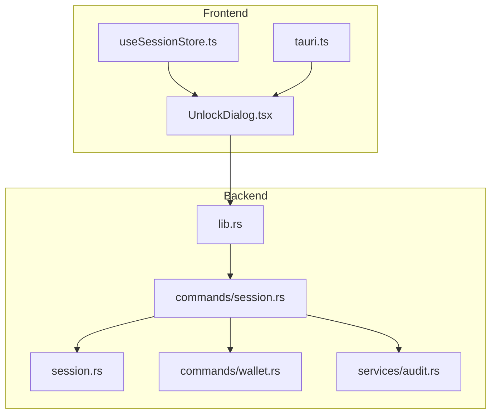
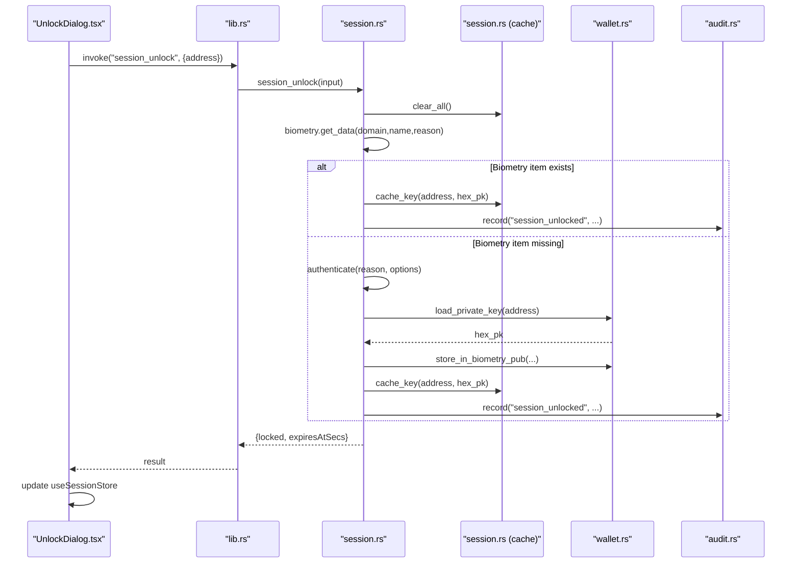
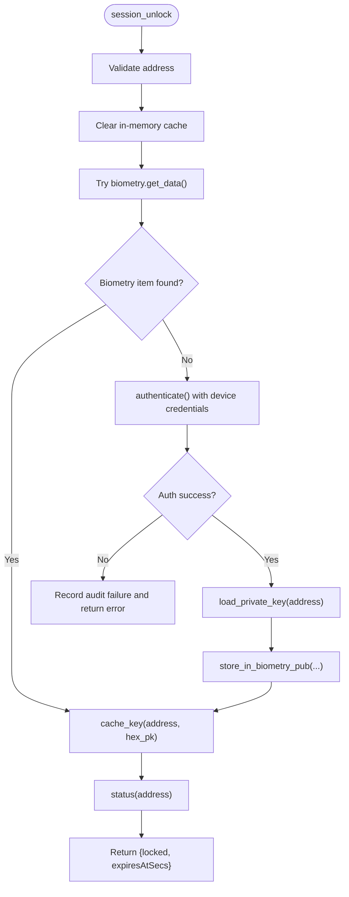
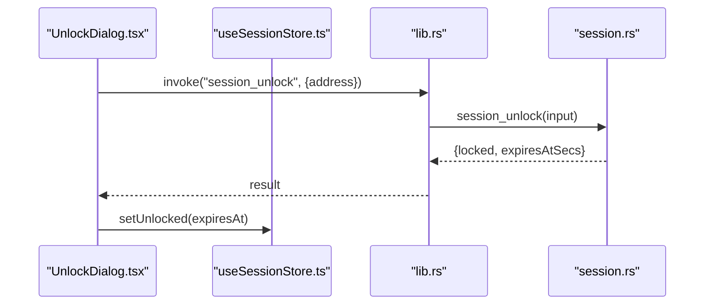
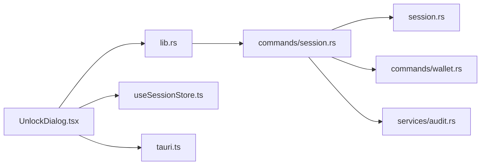

# Session Commands

<cite>
**Referenced Files in This Document**
- [session.rs](file://src-tauri/src/commands/session.rs)
- [session_store.rs](file://src-tauri/src/session.rs)
- [wallet_commands.rs](file://src-tauri/src/commands/wallet.rs)
- [lib.rs](file://src-tauri/src/lib.rs)
- [unlock_dialog.tsx](file://src/components/wallet/UnlockDialog.tsx)
- [useSessionStore.ts](file://src/store/useSessionStore.ts)
- [tauri.ts](file://src/lib/tauri.ts)
- [audit.rs](file://src-tauri/src/services/audit.rs)
</cite>

## Table of Contents
1. [Introduction](#introduction)
2. [Project Structure](#project-structure)
3. [Core Components](#core-components)
4. [Architecture Overview](#architecture-overview)
5. [Detailed Component Analysis](#detailed-component-analysis)
6. [Dependency Analysis](#dependency-analysis)
7. [Performance Considerations](#performance-considerations)
8. [Troubleshooting Guide](#troubleshooting-guide)
9. [Conclusion](#conclusion)

## Introduction
This document describes the Session command handlers that manage user authentication, session persistence, token-like caching, and security context operations for wallet keys. It covers:
- JavaScript frontend interface for session operations
- Rust backend implementation for session handling
- Parameter schemas for authentication and session data
- Return value formats for session status
- Error handling patterns for session operations
- Command registration for session services
- Permission requirements and security considerations
- Authentication flow, session token lifecycle, and security context management
- Practical examples of session management workflows, parameter validation, and response processing

## Project Structure
The session management system spans three layers:
- Frontend (React + Tauri bindings): UI dialogs and state management for unlocking wallets and displaying session status
- Backend (Rust + Tauri): Session commands and in-memory cache with biometric/keychain integration
- Supporting services: Audit logging and periodic cleanup

**Diagram sources**
- [lib.rs:90-190](file://src-tauri/src/lib.rs#L90-L190)
- [session.rs:61-155](file://src-tauri/src/commands/session.rs#L61-L155)
- [session_store.rs:16-125](file://src-tauri/src/session.rs#L16-L125)
- [wallet_commands.rs:134-167](file://src-tauri/src/commands/wallet.rs#L134-L167)
- [audit.rs:5-25](file://src-tauri/src/services/audit.rs#L5-L25)
- [unlock_dialog.tsx:27-102](file://src/components/wallet/UnlockDialog.tsx#L27-L102)
- [useSessionStore.ts:16-28](file://src/store/useSessionStore.ts#L16-L28)
- [tauri.ts:1-4](file://src/lib/tauri.ts#L1-L4)

**Section sources**
- [lib.rs:90-190](file://src-tauri/src/lib.rs#L90-L190)
- [session.rs:61-155](file://src-tauri/src/commands/session.rs#L61-L155)
- [session_store.rs:16-125](file://src-tauri/src/session.rs#L16-L125)
- [wallet_commands.rs:134-167](file://src-tauri/src/commands/wallet.rs#L134-L167)
- [audit.rs:5-25](file://src-tauri/src/services/audit.rs#L5-L25)
- [unlock_dialog.tsx:27-102](file://src/components/wallet/UnlockDialog.tsx#L27-L102)
- [useSessionStore.ts:16-28](file://src/store/useSessionStore.ts#L16-L28)
- [tauri.ts:1-4](file://src/lib/tauri.ts#L1-L4)

## Core Components
- Session commands (Rust):
  - session_unlock: Authenticates via biometric or device credentials, loads private key from secure storage, caches it in memory, and returns session status
  - session_lock: Clears cached key(s) and records audit events
  - session_status: Returns current lock state and remaining seconds until expiration
- Session cache (Rust):
  - In-memory cache with per-address entries and 30-minute inactivity expiry
  - Secure wipe on removal; pruning on read/write
- Wallet integration (Rust):
  - Keyring-backed storage and optional biometric migration during unlock
- Frontend (TypeScript/React):
  - UnlockDialog invokes session_unlock and updates session state
  - useSessionStore tracks locked/unlocked state, expiry, and active address
- Audit logging (Rust):
  - Records session unlock/lock events with contextual details

**Section sources**
- [session.rs:61-155](file://src-tauri/src/commands/session.rs#L61-L155)
- [session_store.rs:16-125](file://src-tauri/src/session.rs#L16-L125)
- [wallet_commands.rs:134-167](file://src-tauri/src/commands/wallet.rs#L134-L167)
- [unlock_dialog.tsx:27-102](file://src/components/wallet/UnlockDialog.tsx#L27-L102)
- [useSessionStore.ts:16-28](file://src/store/useSessionStore.ts#L16-L28)
- [audit.rs:5-25](file://src-tauri/src/services/audit.rs#L5-L25)

## Architecture Overview
The session architecture integrates biometric authentication, secure key storage, and in-memory caching with audit logging.

**Diagram sources**
- [lib.rs:106-108](file://src-tauri/src/lib.rs#L106-L108)
- [session.rs:61-155](file://src-tauri/src/commands/session.rs#L61-L155)
- [session_store.rs:60-75](file://src-tauri/src/session.rs#L60-L75)
- [wallet_commands.rs:164-167](file://src-tauri/src/commands/wallet.rs#L164-L167)
- [audit.rs:5-25](file://src-tauri/src/services/audit.rs#L5-L25)
- [unlock_dialog.tsx:37-58](file://src/components/wallet/UnlockDialog.tsx#L37-L58)

## Detailed Component Analysis

### Session Unlock Command
Behavior:
- Validates input address
- Clears in-memory cache
- Attempts biometric retrieval; if available, uses Touch ID (or equivalent) to fetch encrypted private key
- On absence of biometric item, authenticates via device credentials and falls back to keyring
- Migrates key into biometry for future unlocks
- Caches the key and returns lock status and expiry

Parameters:
- Input: address (string)
- Output: locked (boolean), expiresAtSecs (optional number)

Error handling:
- Propagates authentication failures and cancellations
- Records audit events for unlock failures

**Diagram sources**
- [session.rs:61-155](file://src-tauri/src/commands/session.rs#L61-L155)
- [session_store.rs:60-107](file://src-tauri/src/session.rs#L60-L107)
- [wallet_commands.rs:164-167](file://src-tauri/src/commands/wallet.rs#L164-L167)
- [audit.rs:5-25](file://src-tauri/src/services/audit.rs#L5-L25)

**Section sources**
- [session.rs:61-155](file://src-tauri/src/commands/session.rs#L61-L155)
- [session_store.rs:60-107](file://src-tauri/src/session.rs#L60-L107)
- [wallet_commands.rs:164-167](file://src-tauri/src/commands/wallet.rs#L164-L167)
- [audit.rs:5-25](file://src-tauri/src/services/audit.rs#L5-L25)

### Session Lock Command
Behavior:
- Clears a specific address’s cached key or clears all cached keys
- Records audit events for targeted lock and global lock

Parameters:
- Input: address (optional string)
- Output: locked (boolean, always true after lock)

**Section sources**
- [session.rs:127-140](file://src-tauri/src/commands/session.rs#L127-L140)
- [session_store.rs:77-93](file://src-tauri/src/session.rs#L77-L93)
- [audit.rs:5-25](file://src-tauri/src/services/audit.rs#L5-L25)

### Session Status Command
Behavior:
- Returns current lock state and remaining seconds until expiration for the given address
- Prunes expired entries before reporting

Parameters:
- Input: address (string)
- Output: locked (boolean), expiresAtSecs (optional number)

**Section sources**
- [session.rs:142-154](file://src-tauri/src/commands/session.rs#L142-L154)
- [session_store.rs:96-107](file://src-tauri/src/session.rs#L96-L107)

### Session Cache Internals
Behavior:
- Maintains per-address cached keys with 30-minute inactivity expiry
- Provides get_cached_key, get_unlocked_key, refresh_expiry, cache_key, clear_key, clear_all, status, prune_expired, has_unlocked_session
- Uses zeroization for secure wiping

Complexity:
- Cache operations are O(1) average for insert/read/update/remove
- Pruning is O(n) over cached entries

Security:
- Zeroizing prevents accidental leaks
- Only one active unlocked wallet is retained at a time

**Section sources**
- [session_store.rs:16-125](file://src-tauri/src/session.rs#L16-L125)

### Wallet Integration for Key Storage
Behavior:
- Private keys stored in OS keychain keyed by address
- Optional biometric protection via tauri-plugin-biometry
- Migration path from legacy keychain storage to new biometric storage

**Section sources**
- [wallet_commands.rs:128-167](file://src-tauri/src/commands/wallet.rs#L128-L167)

### Frontend Session Operations
JavaScript/TypeScript interface:
- UnlockDialog invokes session_unlock with { address }
- On success, computes expiresAt from expiresAtSecs or defaults to 30 minutes
- useSessionStore manages locked state, expiry, and active address

**Diagram sources**
- [unlock_dialog.tsx:37-58](file://src/components/wallet/UnlockDialog.tsx#L37-L58)
- [useSessionStore.ts:21-23](file://src/store/useSessionStore.ts#L21-L23)
- [lib.rs:106-108](file://src-tauri/src/lib.rs#L106-L108)
- [session.rs:61-155](file://src-tauri/src/commands/session.rs#L61-L155)

**Section sources**
- [unlock_dialog.tsx:27-102](file://src/components/wallet/UnlockDialog.tsx#L27-L102)
- [useSessionStore.ts:16-28](file://src/store/useSessionStore.ts#L16-L28)
- [lib.rs:106-108](file://src-tauri/src/lib.rs#L106-L108)

### Command Registration
Session commands are registered in the Tauri builder and exposed to the frontend:
- session_unlock
- session_lock
- session_status

**Section sources**
- [lib.rs:106-108](file://src-tauri/src/lib.rs#L106-L108)
- [lib.rs:190-190](file://src-tauri/src/lib.rs#L190-L190)

### Security Context Management
- Biometric-first unlock with device credential fallback
- In-memory cache with 30-minute expiry and zeroization on clear
- Audit trail for unlock/lock events
- Global and per-address locking

**Section sources**
- [session.rs:61-155](file://src-tauri/src/commands/session.rs#L61-L155)
- [session_store.rs:16-125](file://src-tauri/src/session.rs#L16-L125)
- [audit.rs:5-25](file://src-tauri/src/services/audit.rs#L5-L25)

## Dependency Analysis

**Diagram sources**
- [lib.rs:90-190](file://src-tauri/src/lib.rs#L90-L190)
- [session.rs:61-155](file://src-tauri/src/commands/session.rs#L61-L155)
- [session_store.rs:16-125](file://src-tauri/src/session.rs#L16-L125)
- [wallet_commands.rs:134-167](file://src-tauri/src/commands/wallet.rs#L134-L167)
- [audit.rs:5-25](file://src-tauri/src/services/audit.rs#L5-L25)
- [unlock_dialog.tsx:27-102](file://src/components/wallet/UnlockDialog.tsx#L27-L102)
- [useSessionStore.ts:16-28](file://src/store/useSessionStore.ts#L16-L28)
- [tauri.ts:1-4](file://src/lib/tauri.ts#L1-L4)

**Section sources**
- [lib.rs:90-190](file://src-tauri/src/lib.rs#L90-L190)
- [session.rs:61-155](file://src-tauri/src/commands/session.rs#L61-L155)
- [session_store.rs:16-125](file://src-tauri/src/session.rs#L16-L125)
- [wallet_commands.rs:134-167](file://src-tauri/src/commands/wallet.rs#L134-L167)
- [audit.rs:5-25](file://src-tauri/src/services/audit.rs#L5-L25)
- [unlock_dialog.tsx:27-102](file://src/components/wallet/UnlockDialog.tsx#L27-L102)
- [useSessionStore.ts:16-28](file://src/store/useSessionStore.ts#L16-L28)
- [tauri.ts:1-4](file://src/lib/tauri.ts#L1-L4)

## Performance Considerations
- Cache operations are O(1) average; pruning is O(n) but runs periodically
- Biometric authentication avoids repeated keyring prompts when available
- Expiration reduces memory retention of sensitive keys
- Periodic pruning ensures stale entries do not accumulate

[No sources needed since this section provides general guidance]

## Troubleshooting Guide
Common issues and resolutions:
- Authentication failures or cancellations:
  - session_unlock returns an error when biometry fails or user cancels; audit logs capture the reason
- Missing biometric item:
  - Falls back to device credential authentication; if that fails, returns an error
- Invalid address:
  - All commands validate address presence and return errors for empty input
- Session lock behavior:
  - session_lock with no address locks all sessions; with an address locks only that session

**Section sources**
- [session.rs:82-115](file://src-tauri/src/commands/session.rs#L82-L115)
- [session.rs:142-154](file://src-tauri/src/commands/session.rs#L142-L154)
- [audit.rs:5-25](file://src-tauri/src/services/audit.rs#L5-L25)

## Conclusion
The session command handlers provide a secure, user-friendly mechanism for managing wallet access:
- Biometric-first authentication with device credential fallback
- In-memory caching with strict expiry and secure wiping
- Comprehensive audit logging
- Clean separation between frontend UX and backend security primitives