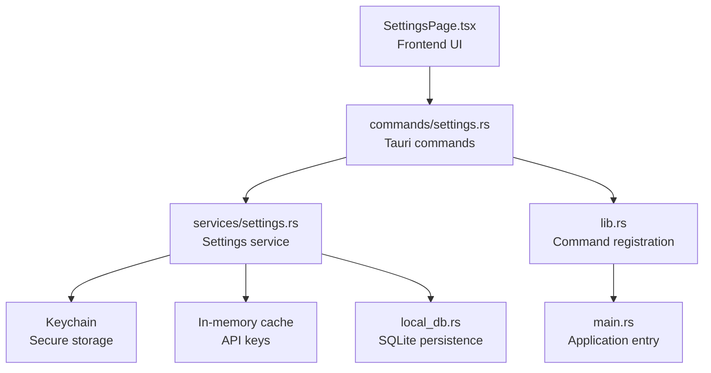
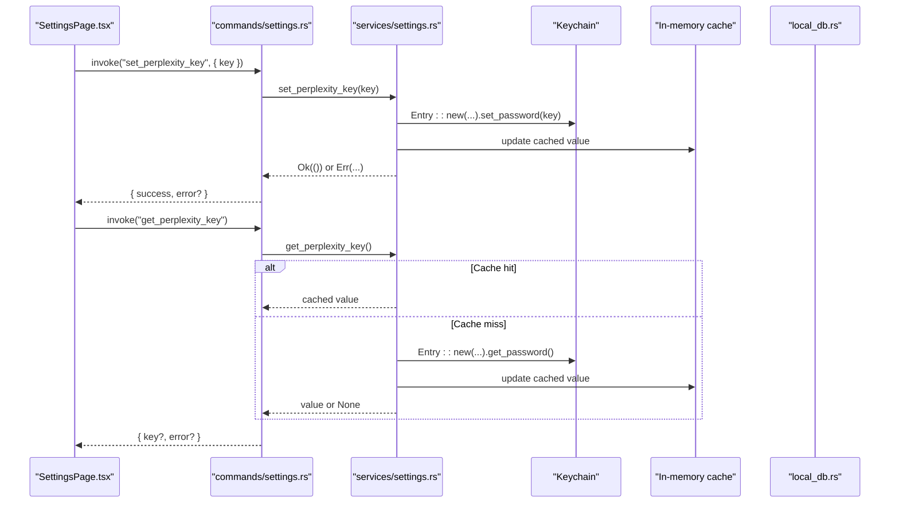
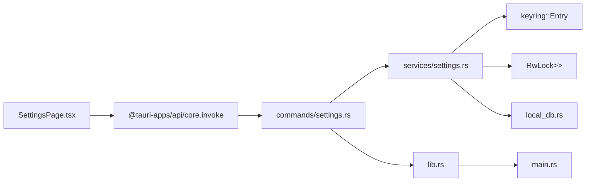

# Settings Commands

<cite>
**Referenced Files in This Document**
- [settings.rs](file://src-tauri/src/commands/settings.rs)
- [settings.rs](file://src-tauri/src/services/settings.rs)
- [SettingsPage.tsx](file://src/components/settings/SettingsPage.tsx)
- [tauri.ts](file://src/lib/tauri.ts)
- [lib.rs](file://src-tauri/src/lib.rs)
- [main.rs](file://src-tauri/src/main.rs)
- [useUiStore.ts](file://src/store/useUiStore.ts)
- [local_db.rs](file://src-tauri/src/services/local_db.rs)
- [wallet.rs](file://src-tauri/src/commands/wallet.rs)
</cite>

## Table of Contents
1. [Introduction](#introduction)
2. [Project Structure](#project-structure)
3. [Core Components](#core-components)
4. [Architecture Overview](#architecture-overview)
5. [Detailed Component Analysis](#detailed-component-analysis)
6. [Dependency Analysis](#dependency-analysis)
7. [Performance Considerations](#performance-considerations)
8. [Troubleshooting Guide](#troubleshooting-guide)
9. [Conclusion](#conclusion)

## Introduction
This document describes the Settings command handlers that manage application configuration, user preferences, security configurations, and feature toggles. It covers the JavaScript frontend interface for settings operations, the Rust backend implementation for configuration management, parameter schemas, return value formats, error handling patterns, command registration, permission requirements, security considerations, persistence mechanisms, validation, and synchronization behavior. Practical examples demonstrate settings management workflows, parameter validation, and response processing.

## Project Structure
The settings functionality spans three layers:
- Frontend React component that invokes Tauri commands and renders settings UI
- Tauri command layer that exposes Rust functions to the frontend
- Rust services layer that manages persistence and security

**Diagram sources**
- [SettingsPage.tsx:1-603](file://src/components/settings/SettingsPage.tsx#L1-603)
- [settings.rs:1-102](file://src-tauri/src/commands/settings.rs#L1-102)
- [settings.rs:1-243](file://src-tauri/src/services/settings.rs#L1-243)
- [lib.rs:90-190](file://src-tauri/src/lib.rs#L90-190)
- [main.rs:1-7](file://src-tauri/src/main.rs#L1-7)
- [local_db.rs:1-800](file://src-tauri/src/services/local_db.rs#L1-800)

**Section sources**
- [SettingsPage.tsx:1-603](file://src/components/settings/SettingsPage.tsx#L1-603)
- [settings.rs:1-102](file://src-tauri/src/commands/settings.rs#L1-102)
- [settings.rs:1-243](file://src-tauri/src/services/settings.rs#L1-243)
- [lib.rs:90-190](file://src-tauri/src/lib.rs#L90-190)
- [main.rs:1-7](file://src-tauri/src/main.rs#L1-7)

## Core Components
- Settings commands: set/get/remove API keys for Perplexity, Alchemy, and Ollama; delete all application data
- Settings service: secure keychain-backed storage, in-memory caching, environment fallback, and comprehensive data deletion
- Frontend settings page: UI for managing keys, theme, developer mode, and destructive actions
- Persistence: keychain for secrets, SQLite for non-secret settings and app state
- Security: biometric integration for wallet keys, environment variable fallback for Alchemy

**Section sources**
- [settings.rs:23-101](file://src-tauri/src/commands/settings.rs#L23-101)
- [settings.rs:75-242](file://src-tauri/src/services/settings.rs#L75-242)
- [SettingsPage.tsx:35-602](file://src/components/settings/SettingsPage.tsx#L35-602)
- [local_db.rs:418-435](file://src-tauri/src/services/local_db.rs#L418-435)

## Architecture Overview
The settings subsystem follows a layered architecture:
- Frontend invokes Tauri commands via @tauri-apps/api
- Tauri commands delegate to Rust services
- Services interact with keychain, in-memory cache, and SQLite
- Environment variables provide fallbacks for certain keys

**Diagram sources**
- [SettingsPage.tsx:112-132](file://src/components/settings/SettingsPage.tsx#L112-132)
- [settings.rs:23-37](file://src-tauri/src/commands/settings.rs#L23-37)
- [settings.rs:84-102](file://src-tauri/src/services/settings.rs#L84-102)

## Detailed Component Analysis

### Backend Settings Commands
The Rust commands expose the following operations:
- set_perplexity_key(input: SetKeyInput) -> SettingsResult
- get_perplexity_key() -> GetKeyResult
- remove_perplexity_key() -> SettingsResult
- set_alchemy_key(input: SetKeyInput) -> SettingsResult
- get_alchemy_key() -> GetKeyResult
- remove_alchemy_key() -> SettingsResult
- set_ollama_key(input: SetKeyInput) -> SettingsResult
- get_ollama_key() -> GetKeyResult
- remove_ollama_key() -> SettingsResult
- delete_all_data(app: AppHandle) -> SettingsResult

Each command wraps a service call and returns a standardized result structure.

**Section sources**
- [settings.rs:23-101](file://src-tauri/src/commands/settings.rs#L23-101)

### Settings Service Implementation
The service layer provides:
- Keychain-backed storage for API keys with service identifiers
- In-memory cache to minimize repeated keychain reads
- Environment variable fallback for Alchemy key
- Comprehensive data deletion routine that clears keychain, SQLite, sessions, and local files

Key behaviors:
- API cache uses RwLock<Option<Option<String>>> to track loading state and values
- get_alchemy_key_or_env() returns cached value or environment variable
- delete_all_app_data() orchestrates clearing of secrets, wallets, sessions, DB, and addresses file

**Section sources**
- [settings.rs:11-26](file://src-tauri/src/services/settings.rs#L11-26)
- [settings.rs:75-242](file://src-tauri/src/services/settings.rs#L75-242)

### Frontend Settings Interface
The frontend component:
- Fetches existing keys on mount and displays masked values
- Provides save/remove actions for each key
- Handles success/error feedback via toasts
- Supports theme selection and developer mode toggle
- Offers destructive actions like deleting all data with confirmation

Invoke patterns:
- invoke("get_perplexity_key") returns { key?, error? }
- invoke("set_perplexity_key", { input: { key } }) returns { success, error? }
- invoke("remove_perplexity_key") returns { success, error? }
- invoke("delete_all_data") returns { success, error? }

**Section sources**
- [SettingsPage.tsx:83-110](file://src/components/settings/SettingsPage.tsx#L83-110)
- [SettingsPage.tsx:112-145](file://src/components/settings/SettingsPage.tsx#L112-145)
- [SettingsPage.tsx:222-246](file://src/components/settings/SettingsPage.tsx#L222-246)

### Parameter Schemas and Return Formats
- SetKeyInput: { key: string }
- SettingsResult: { success: boolean, error?: string }
- GetKeyResult: { key?: string, error?: string }

These schemas are derived from the Rust structs used by the commands and are serialized/deserialized by Tauri.

**Section sources**
- [settings.rs:4-21](file://src-tauri/src/commands/settings.rs#L4-21)

### Error Handling Patterns
- Commands wrap service calls and convert errors to string messages
- Results include an optional error field for frontend display
- Frontend uses toasts to present success and error states
- Environment fallbacks prevent failures when keys are missing (e.g., Alchemy)

**Section sources**
- [settings.rs:24-44](file://src-tauri/src/commands/settings.rs#L24-44)
- [settings.rs:198-200](file://src-tauri/src/services/settings.rs#L198-200)
- [SettingsPage.tsx:120-126](file://src/components/settings/SettingsPage.tsx#L120-126)

### Command Registration and Permissions
- All settings commands are registered in lib.rs within the invoke handler
- No explicit permissions are declared for settings commands in the provided code
- The application initializes plugins including biometry, which underpins wallet key protection

**Section sources**
- [lib.rs:109-118](file://src-tauri/src/lib.rs#L109-118)
- [lib.rs:42-42](file://src-tauri/src/lib.rs#L42-42)

### Security Considerations
- API keys are stored in the platform keychain
- In-memory cache reduces repeated keychain prompts
- Biometric plugin enables Touch ID-secured storage for wallet keys
- Environment variable fallback allows deployment flexibility
- Destructive operations require explicit user confirmation

**Section sources**
- [settings.rs:11-15](file://src-tauri/src/services/settings.rs#L11-15)
- [settings.rs:203-242](file://src-tauri/src/services/settings.rs#L203-242)
- [wallet.rs:134-142](file://src-tauri/src/commands/wallet.rs#L134-142)

### Settings Persistence Mechanism
- Secrets: Keychain entries keyed by service and purpose
- Non-secrets: SQLite tables managed by local_db.rs
- In-memory cache: RwLock-based cache for API keys
- Environment fallback: ALCH_API_KEY for Alchemy key

**Section sources**
- [settings.rs:42-62](file://src-tauri/src/services/settings.rs#L42-62)
- [local_db.rs:418-435](file://src-tauri/src/services/local_db.rs#L418-435)
- [settings.rs:198-200](file://src-tauri/src/services/settings.rs#L198-200)

### Configuration Validation
- Input validation occurs at the command boundary via serde deserialization
- No explicit runtime validation of key formats is implemented in the settings service
- Frontend enforces basic presence checks before invoking commands

**Section sources**
- [settings.rs:4-7](file://src-tauri/src/commands/settings.rs#L4-7)
- [SettingsPage.tsx:112-132](file://src/components/settings/SettingsPage.tsx#L112-132)

### Settings Synchronization
- The settings service does not implement explicit synchronization across devices
- Wallet synchronization uses SQLite timestamps and periodic background jobs
- Settings changes are immediate and local to the device

**Section sources**
- [local_db.rs:518-553](file://src-tauri/src/services/local_db.rs#L518-553)
- [lib.rs:65-87](file://src-tauri/src/lib.rs#L65-87)

## Dependency Analysis

**Diagram sources**
- [SettingsPage.tsx](file://src/components/settings/SettingsPage.tsx#L2)
- [settings.rs](file://src-tauri/src/commands/settings.rs#L1)
- [settings.rs](file://src-tauri/src/services/settings.rs#L1)
- [lib.rs:90-190](file://src-tauri/src/lib.rs#L90-190)
- [main.rs:4-6](file://src-tauri/src/main.rs#L4-6)

**Section sources**
- [SettingsPage.tsx:1-25](file://src/components/settings/SettingsPage.tsx#L1-25)
- [settings.rs:1-2](file://src-tauri/src/commands/settings.rs#L1-2)
- [settings.rs:1-9](file://src-tauri/src/services/settings.rs#L1-9)
- [lib.rs:90-190](file://src-tauri/src/lib.rs#L90-190)

## Performance Considerations
- In-memory cache significantly reduces keychain access frequency
- SQLite operations are batched during initialization and data deletion
- Background synchronization avoids blocking the UI thread

## Troubleshooting Guide
Common issues and resolutions:
- Keychain access failures: Verify platform keychain availability and permissions
- Missing environment variable fallback: Ensure ALCH_API_KEY is set if using environment fallback
- Cache inconsistencies: Restart the application to refresh the in-memory cache
- Data deletion failures: Confirm sufficient permissions to remove files and clear database

**Section sources**
- [settings.rs:198-200](file://src-tauri/src/services/settings.rs#L198-200)
- [settings.rs:203-242](file://src-tauri/src/services/settings.rs#L203-242)

## Conclusion
The settings subsystem provides a secure, efficient, and user-friendly way to manage application configuration. It leverages platform keychain storage, in-memory caching, and SQLite persistence to deliver responsive settings operations while maintaining strong security practices. The frontend offers intuitive controls for sensitive configuration, with robust error handling and destructive operation safeguards.