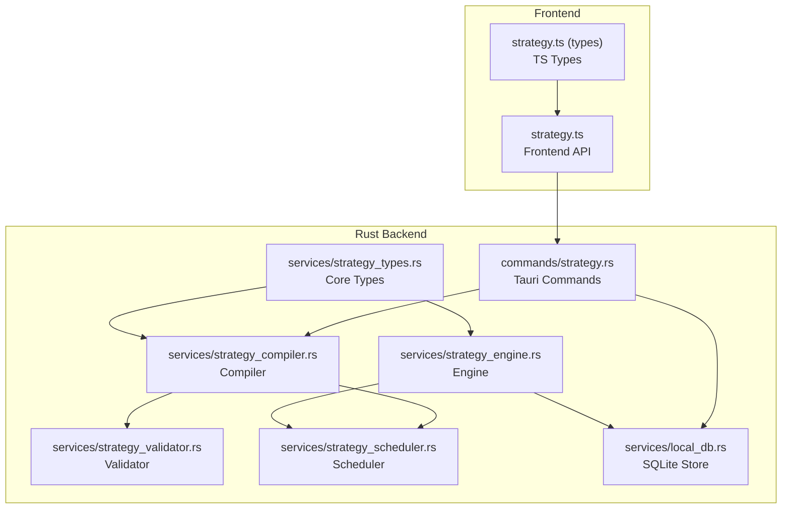
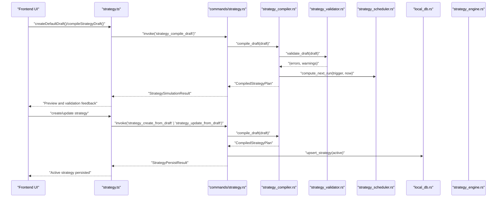
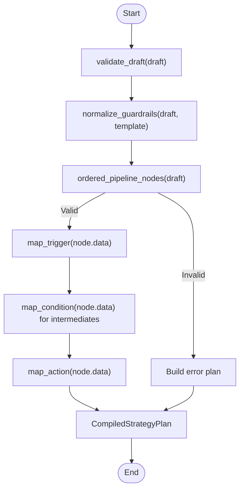
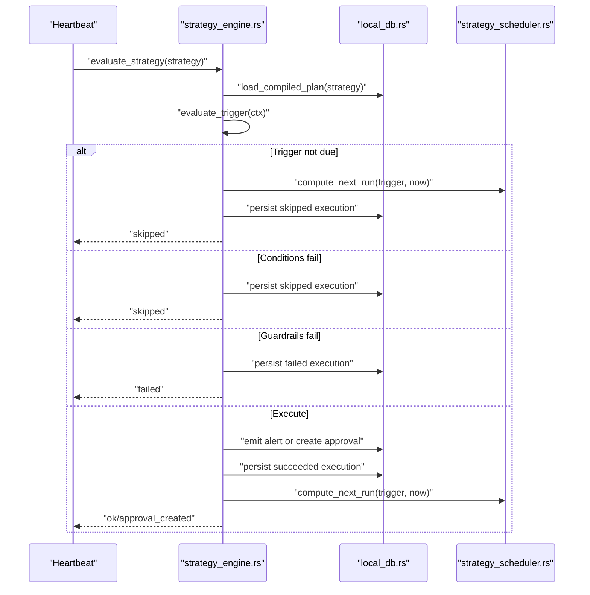
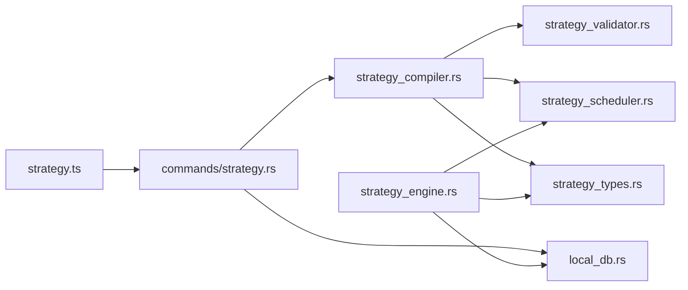

# Strategy Commands

<cite>
**Referenced Files in This Document**
- [strategy.ts](file://src/lib/strategy.ts)
- [strategy.test.ts](file://src/lib/strategy.test.ts)
- [strategy.ts (types)](file://src/types/strategy.ts)
- [strategy.rs (commands)](file://src-tauri/src/commands/strategy.rs)
- [strategy_compiler.rs](file://src-tauri/src/services/strategy_compiler.rs)
- [strategy_engine.rs](file://src-tauri/src/services/strategy_engine.rs)
- [strategy_validator.rs](file://src-tauri/src/services/strategy_validator.rs)
- [strategy_scheduler.rs](file://src-tauri/src/services/strategy_scheduler.rs)
- [strategy_types.rs](file://src-tauri/src/services/strategy_types.rs)
- [local_db.rs](file://src-tauri/src/services/local_db.rs)
- [lib.rs](file://src-tauri/src/lib.rs)
</cite>

## Table of Contents
1. [Introduction](#introduction)
2. [Project Structure](#project-structure)
3. [Core Components](#core-components)
4. [Architecture Overview](#architecture-overview)
5. [Detailed Component Analysis](#detailed-component-analysis)
6. [Dependency Analysis](#dependency-analysis)
7. [Performance Considerations](#performance-considerations)
8. [Troubleshooting Guide](#troubleshooting-guide)
9. [Conclusion](#conclusion)
10. [Appendices](#appendices)

## Introduction
This document describes the Strategy command handlers that enable end-to-end strategy lifecycle management. It covers:
- Strategy creation and updates from a draft
- Compilation and validation of strategy definitions
- Execution and monitoring of strategies
- Simulation and preview of strategy outcomes
- Frontend interface for strategy operations
- Backend Rust services for compilation, validation, scheduling, and execution
- Parameter schemas and return value formats
- Error handling and security considerations
- Permission and execution modes

## Project Structure
The strategy feature spans a small set of frontend TypeScript utilities and a comprehensive Rust backend with commands, services, and database persistence.

**Diagram sources**
- [strategy.ts:1-218](file://src/lib/strategy.ts#L1-L218)
- [strategy.ts (types):1-258](file://src/types/strategy.ts#L1-L258)
- [strategy.rs (commands):1-309](file://src-tauri/src/commands/strategy.rs#L1-L309)
- [strategy_compiler.rs:1-369](file://src-tauri/src/services/strategy_compiler.rs#L1-L369)
- [strategy_validator.rs:1-457](file://src-tauri/src/services/strategy_validator.rs#L1-L457)
- [strategy_scheduler.rs:1-64](file://src-tauri/src/services/strategy_scheduler.rs#L1-L64)
- [strategy_engine.rs:1-726](file://src-tauri/src/services/strategy_engine.rs#L1-L726)
- [strategy_types.rs:1-417](file://src-tauri/src/services/strategy_types.rs#L1-L417)
- [local_db.rs:1-200](file://src-tauri/src/services/local_db.rs#L1-L200)

**Section sources**
- [strategy.ts:1-218](file://src/lib/strategy.ts#L1-L218)
- [strategy.ts (types):1-258](file://src/types/strategy.ts#L1-L258)
- [strategy.rs (commands):1-309](file://src-tauri/src/commands/strategy.rs#L1-L309)
- [strategy_compiler.rs:1-369](file://src-tauri/src/services/strategy_compiler.rs#L1-L369)
- [strategy_engine.rs:1-726](file://src-tauri/src/services/strategy_engine.rs#L1-L726)
- [strategy_validator.rs:1-457](file://src-tauri/src/services/strategy_validator.rs#L1-L457)
- [strategy_scheduler.rs:1-64](file://src-tauri/src/services/strategy_scheduler.rs#L1-L64)
- [strategy_types.rs:1-417](file://src-tauri/src/services/strategy_types.rs#L1-L417)
- [local_db.rs:80-106](file://src-tauri/src/services/local_db.rs#L80-L106)
- [lib.rs:90-190](file://src-tauri/src/lib.rs#L90-L190)

## Core Components
- Frontend API: Provides helpers to create default drafts, compile drafts, and manage strategy lifecycle via Tauri invoke calls.
- Backend Commands: Expose typed Tauri commands for compiling drafts, persisting strategies, retrieving details, and fetching execution history.
- Compiler: Translates a StrategyDraft into a CompiledStrategyPlan, normalizes guardrails, validates structure, and maps nodes to trigger/conditions/actions.
- Validator: Enforces structural and semantic rules for drafts (names, templates, pipeline shape, guardrails).
- Scheduler: Computes next-run timestamps based on trigger types.
- Engine: Evaluates strategies on heartbeat ticks, applies guardrails, emits alerts or creates approvals, and persists execution records.
- Storage: SQLite-backed persistence for strategies, executions, approvals, and related artifacts.

**Section sources**
- [strategy.ts:13-218](file://src/lib/strategy.ts#L13-L218)
- [strategy.rs (commands):216-309](file://src-tauri/src/commands/strategy.rs#L216-L309)
- [strategy_compiler.rs:185-292](file://src-tauri/src/services/strategy_compiler.rs#L185-L292)
- [strategy_validator.rs:13-106](file://src-tauri/src/services/strategy_validator.rs#L13-L106)
- [strategy_scheduler.rs:9-36](file://src-tauri/src/services/strategy_scheduler.rs#L9-L36)
- [strategy_engine.rs:343-725](file://src-tauri/src/services/strategy_engine.rs#L343-L725)
- [local_db.rs:80-106](file://src-tauri/src/services/local_db.rs#L80-L106)

## Architecture Overview
The strategy lifecycle flows from the UI to Tauri commands, then to compiler and validator, and finally to the engine and persistence.

**Diagram sources**
- [strategy.ts:174-218](file://src/lib/strategy.ts#L174-L218)
- [strategy.rs (commands):216-268](file://src-tauri/src/commands/strategy.rs#L216-L268)
- [strategy_compiler.rs:185-292](file://src-tauri/src/services/strategy_compiler.rs#L185-L292)
- [strategy_validator.rs:13-106](file://src-tauri/src/services/strategy_validator.rs#L13-L106)
- [strategy_scheduler.rs:9-36](file://src-tauri/src/services/strategy_scheduler.rs#L9-L36)
- [local_db.rs:80-106](file://src-tauri/src/services/local_db.rs#L80-L106)

## Detailed Component Analysis

### Frontend Strategy API
- Purpose: Provide a typed interface to create default drafts, compile drafts, and manage strategies.
- Key functions:
  - createDefaultDraft(template): Builds a default StrategyDraft for templates like DCA buy, rebalance to target, and alert-only.
  - compileStrategyDraft(draft): Sends draft to backend for compilation and returns StrategySimulationResult.
  - createStrategyFromDraft(draft, status): Persists a new strategy.
  - updateStrategyFromDraft(id, draft, status): Updates an existing strategy.
  - getStrategyDetail(id): Retrieves strategy detail with optional draft and plan.
  - getStrategyExecutionHistory(strategyId?): Fetches recent execution records.
  - strategyBuilderAvailable(): Detects Tauri runtime availability.

Return value formats:
- StrategySimulationResult: Includes validity flag, compiled plan, evaluation preview, and message.
- StrategyDetailResult: Contains ActiveStrategy plus optional draft and plan.
- StrategyExecutionRecord[]: Records of past runs with status, reason, and timestamps.

**Section sources**
- [strategy.ts:13-218](file://src/lib/strategy.ts#L13-L218)
- [strategy.ts (types):202-258](file://src/types/strategy.ts#L202-L258)

### Backend Strategy Commands
- strategy_compile_draft: Compiles a StrategyDraft into a CompiledStrategyPlan and builds a StrategySimulationResult.
- strategy_create_from_draft: Validates name length, compiles, normalizes status, and persists an ActiveStrategy.
- strategy_update_from_draft: Loads existing strategy, increments version, compiles, and updates persistence.
- strategy_get: Loads an ActiveStrategy and optionally deserializes draft and plan JSON.
- strategy_get_execution_history: Returns recent execution records with pagination.

Command registration:
- Registered in lib.rs under generate_handler!.

**Section sources**
- [strategy.rs (commands):216-309](file://src-tauri/src/commands/strategy.rs#L216-L309)
- [lib.rs:147-151](file://src-tauri/src/lib.rs#L147-L151)

### Strategy Compilation and Validation
- Compiler:
  - Normalizes guardrails for non-alert templates.
  - Derives a linear pipeline from nodes and edges.
  - Maps DraftNodeData to StrategyTrigger/StrategyCondition/StrategyAction.
  - Produces CompiledStrategyPlan with validation errors/warnings.
- Validator:
  - Enforces name length, summary length, mode-template compatibility.
  - Validates linear pipeline (exactly one trigger and one action, no cycles, single chain).
  - Template-specific payload validation.
  - Guardrails validation (positive amounts, sane slippage, allowlists).

**Diagram sources**
- [strategy_compiler.rs:185-292](file://src-tauri/src/services/strategy_compiler.rs#L185-L292)
- [strategy_validator.rs:13-106](file://src-tauri/src/services/strategy_validator.rs#L13-L106)

**Section sources**
- [strategy_compiler.rs:120-292](file://src-tauri/src/services/strategy_compiler.rs#L120-L292)
- [strategy_validator.rs:13-106](file://src-tauri/src/services/strategy_validator.rs#L13-L106)

### Strategy Execution Engine
- Evaluation cycle:
  - Load compiled plan and context (portfolio value, tokens, snapshots).
  - Evaluate trigger (time-based or drift/threshold).
  - Evaluate conditions (portfolio floor, gas, slippage, asset availability, cooldown, drift minimum).
  - Apply guardrails (per-trade limits, allowed chains, minimum portfolio).
  - Emit alerts or create approval requests depending on mode and action type.
  - Persist execution records and update strategy metadata.
- Scheduling:
  - compute_next_run computes next evaluation time based on trigger type and interval.

**Diagram sources**
- [strategy_engine.rs:343-725](file://src-tauri/src/services/strategy_engine.rs#L343-L725)
- [strategy_scheduler.rs:9-36](file://src-tauri/src/services/strategy_scheduler.rs#L9-L36)
- [local_db.rs:155-167](file://src-tauri/src/services/local_db.rs#L155-L167)

**Section sources**
- [strategy_engine.rs:343-725](file://src-tauri/src/services/strategy_engine.rs#L343-L725)
- [strategy_scheduler.rs:9-36](file://src-tauri/src/services/strategy_scheduler.rs#L9-L36)
- [local_db.rs:155-167](file://src-tauri/src/services/local_db.rs#L155-L167)

### Data Models and Parameter Schemas
- StrategyDraft: Name, summary, template, mode, nodes, edges, guardrails, policies.
- DraftNodeData: time_interval, drift_threshold, threshold, cooldown, portfolio_floor, max_gas, max_slippage, wallet_asset_available, drift_minimum, dca_buy, rebalance_to_target, alert_only.
- CompiledStrategyPlan: trigger, conditions, action, normalized guardrails, validity, validation errors/warnings.
- StrategyExecutionRecordIpc: execution record shape returned to frontend.
- ActiveStrategy: persisted strategy row with JSON blobs for draft, plan, guardrails, policies, plus metadata.

**Section sources**
- [strategy_types.rs:226-417](file://src-tauri/src/services/strategy_types.rs#L226-L417)
- [strategy.ts (types):110-258](file://src/types/strategy.ts#L110-L258)
- [local_db.rs:80-106](file://src-tauri/src/services/local_db.rs#L80-L106)

### Command Registration and Permissions
- Commands are registered in lib.rs generate_handler! list.
- Execution modes:
  - monitor_only: Emits alerts without trading.
  - approval_required: Creates approval requests for trades.
  - pre_authorized: Executes directly when supported; otherwise falls back to approval.
- Guardrails and policies influence whether execution proceeds or requires approvals.

**Section sources**
- [lib.rs:147-151](file://src-tauri/src/lib.rs#L147-L151)
- [strategy_engine.rs:572-595](file://src-tauri/src/services/strategy_engine.rs#L572-L595)

## Dependency Analysis
- Frontend depends on Tauri invoke to call backend commands.
- Backend commands depend on compiler and validator services.
- Compiler depends on validator and scheduler.
- Engine depends on scheduler, DB, and emits events.
- All services share core types for serialization/deserialization.

**Diagram sources**
- [strategy.ts:1-218](file://src/lib/strategy.ts#L1-L218)
- [strategy.rs (commands):1-309](file://src-tauri/src/commands/strategy.rs#L1-L309)
- [strategy_compiler.rs:1-369](file://src-tauri/src/services/strategy_compiler.rs#L1-L369)
- [strategy_validator.rs:1-457](file://src-tauri/src/services/strategy_validator.rs#L1-L457)
- [strategy_scheduler.rs:1-64](file://src-tauri/src/services/strategy_scheduler.rs#L1-L64)
- [strategy_engine.rs:1-726](file://src-tauri/src/services/strategy_engine.rs#L1-L726)
- [strategy_types.rs:1-417](file://src-tauri/src/services/strategy_types.rs#L1-L417)
- [local_db.rs:1-200](file://src-tauri/src/services/local_db.rs#L1-L200)

**Section sources**
- [strategy.ts:1-218](file://src/lib/strategy.ts#L1-L218)
- [strategy.rs (commands):1-309](file://src-tauri/src/commands/strategy.rs#L1-L309)
- [strategy_compiler.rs:1-369](file://src-tauri/src/services/strategy_compiler.rs#L1-L369)
- [strategy_engine.rs:1-726](file://src-tauri/src/services/strategy_engine.rs#L1-L726)

## Performance Considerations
- Linear pipeline assumption: The compiler expects a single trigger-to-action chain; complex graphs produce errors and a safe fallback plan.
- Guardrail checks: Early exits on per-trade limits and chain allowlists prevent unnecessary work.
- Scheduling: Next-run computation avoids backlog replay and respects minimum intervals.
- Persistence: SQLite writes occur only on state changes and execution events.

[No sources needed since this section provides general guidance]

## Troubleshooting Guide
Common validation errors and remedies:
- Name too short or missing: Ensure strategy name meets length requirements.
- Invalid pipeline: Exactly one trigger and one action; no cycles; single linear chain.
- Mode/template mismatch: Pre-authorized mode is not allowed with alert-only template.
- Guardrail violations: Positive per-trade limits, valid slippage range, non-empty allowlists if used.
- Activation of invalid strategies: Cannot activate a strategy with invalid plan; fix validation errors first.

Execution issues:
- Skipped runs: Trigger not due or conditions failed; inspect evaluation preview and logs.
- Paused due to limits: Strategy exceeded max per trade guardrail; adjust guardrails or reduce notional.
- Chain not allowed: Strategy chain not in allowed list; update guardrails.
- Minimum portfolio not met: Portfolio value below configured minimum; fund the account.

**Section sources**
- [strategy_validator.rs:13-106](file://src-tauri/src/services/strategy_validator.rs#L13-L106)
- [strategy_engine.rs:403-498](file://src-tauri/src/services/strategy_engine.rs#L403-L498)
- [strategy_compiler.rs:193-222](file://src-tauri/src/services/strategy_compiler.rs#L193-L222)

## Conclusion
The Strategy command handlers provide a robust framework for designing, validating, executing, and monitoring automated strategies. The frontend offers a concise API for creating and previewing strategies, while the backend enforces strong validation, schedules evaluations, and safely executes actions with guardrails and approvals.

[No sources needed since this section summarizes without analyzing specific files]

## Appendices

### Practical Examples

- Strategy lifecycle management
  - Create default draft: Use createDefaultDraft with a template to bootstrap a StrategyDraft.
  - Compile draft: Call compileStrategyDraft to receive a StrategySimulationResult with validation preview.
  - Persist strategy: Use createStrategyFromDraft or updateStrategyFromDraft with a desired status.
  - Retrieve details: Call getStrategyDetail to fetch ActiveStrategy with optional draft and plan.
  - View history: Use getStrategyExecutionHistory to inspect recent runs.

- Parameter validation for strategy creation
  - Name length and summary length are validated.
  - Pipeline must be linear with one trigger and one action.
  - Template-specific payloads must match expectations (e.g., DCA requires time_interval trigger and dca_buy action).
  - Guardrails must be positive and within acceptable ranges.

- Response processing for strategy operations
  - StrategySimulationResult: Use valid flag and evaluation preview to inform UI decisions.
  - StrategyDetailResult: Access ActiveStrategy fields and optional draft/plan for inspection.
  - StrategyExecutionRecord[]: Paginate and render execution status, reasons, and timestamps.

**Section sources**
- [strategy.ts:13-218](file://src/lib/strategy.ts#L13-L218)
- [strategy.ts (types):202-258](file://src/types/strategy.ts#L202-L258)
- [strategy.rs (commands):216-309](file://src-tauri/src/commands/strategy.rs#L216-L309)
- [strategy_compiler.rs:185-292](file://src-tauri/src/services/strategy_compiler.rs#L185-L292)
- [strategy_validator.rs:13-106](file://src-tauri/src/services/strategy_validator.rs#L13-L106)