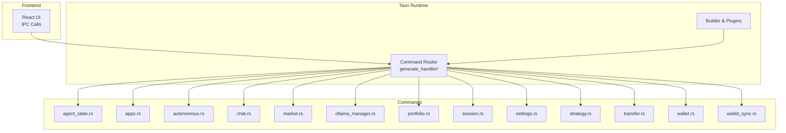
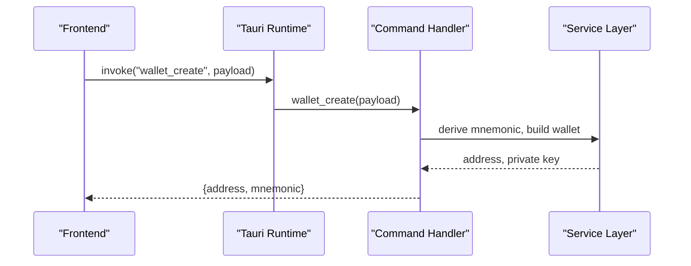
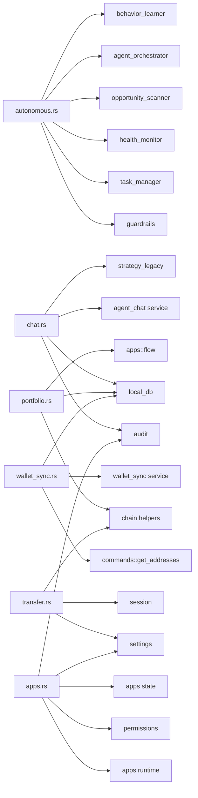

# Tauri Command Handlers

<cite>
**Referenced Files in This Document**
- [lib.rs](file://src-tauri/src/lib.rs)
- [main.rs](file://src-tauri/src/main.rs)
- [mod.rs](file://src-tauri/src/commands/mod.rs)
- [agent_state.rs](file://src-tauri/src/commands/agent_state.rs)
- [apps.rs](file://src-tauri/src/commands/apps.rs)
- [autonomous.rs](file://src-tauri/src/commands/autonomous.rs)
- [chat.rs](file://src-tauri/src/commands/chat.rs)
- [market.rs](file://src-tauri/src/commands/market.rs)
- [ollama_manager.rs](file://src-tauri/src/commands/ollama_manager.rs)
- [portfolio.rs](file://src-tauri/src/commands/portfolio.rs)
- [session.rs](file://src-tauri/src/commands/session.rs)
- [settings.rs](file://src-tauri/src/commands/settings.rs)
- [strategy.rs](file://src-tauri/src/commands/strategy.rs)
- [transfer.rs](file://src-tauri/src/commands/transfer.rs)
- [wallet.rs](file://src-tauri/src/commands/wallet.rs)
- [wallet_sync.rs](file://src-tauri/src/commands/wallet_sync.rs)
</cite>

## Table of Contents
1. [Introduction](#introduction)
2. [Project Structure](#project-structure)
3. [Core Components](#core-components)
4. [Architecture Overview](#architecture-overview)
5. [Detailed Component Analysis](#detailed-component-analysis)
6. [Dependency Analysis](#dependency-analysis)
7. [Performance Considerations](#performance-considerations)
8. [Troubleshooting Guide](#troubleshooting-guide)
9. [Conclusion](#conclusion)

## Introduction
This document describes the Tauri command handlers that power SHADOW Protocol’s desktop application. It covers the command registration, routing, and IPC patterns, and provides a comprehensive breakdown of each command module: agent_state, apps, autonomous, chat, market, ollama_manager, portfolio, session, settings, strategy, transfer, wallet, and wallet_sync. For each command, we describe the JavaScript frontend interface, Rust backend implementation, parameter schemas, return value formats, error handling patterns, permission requirements, and security considerations. We also include practical invocation examples, validation rules, and debugging techniques.

## Project Structure
The Tauri application is organized around a central command router that registers all backend commands and exposes them to the frontend. Commands are grouped by domain and live under src-tauri/src/commands. Each module defines one or more #[tauri::command] functions and associated serialization types. The main entry point initializes plugins, services, and the command router.

**Diagram sources**
- [lib.rs:90-190](file://src-tauri/src/lib.rs#L90-L190)
- [mod.rs:1-27](file://src-tauri/src/commands/mod.rs#L1-L27)

**Section sources**
- [lib.rs:34-198](file://src-tauri/src/lib.rs#L34-L198)
- [main.rs:4-6](file://src-tauri/src/main.rs#L4-L6)
- [mod.rs:1-27](file://src-tauri/src/commands/mod.rs#L1-L27)

## Core Components
- Command Registration: All commands are registered via generate_handler! in lib.rs, enabling frontend-to-backend IPC.
- IPC Communication: Frontend invokes commands by name; backend executes the corresponding #[tauri::command] function and returns structured JSON.
- Asynchronous Operations: Many commands spawn background tasks (e.g., wallet sync, Ollama pull, transaction polling) and emit events to the frontend.
- Security: Wallet keys are stored in OS keychain and optionally protected by biometric authentication. Session caching ensures secure, prompt-free unlocks when available.

**Section sources**
- [lib.rs:90-190](file://src-tauri/src/lib.rs#L90-L190)
- [session.rs:62-125](file://src-tauri/src/commands/session.rs#L62-L125)
- [wallet.rs:128-167](file://src-tauri/src/commands/wallet.rs#L128-L167)

## Architecture Overview
The command routing system binds frontend IPC calls to Rust functions. Commands are grouped by domain and often depend on services for market data, portfolio aggregation, strategy compilation, wallet signing, and autonomous orchestration.

**Diagram sources**
- [lib.rs:90-190](file://src-tauri/src/lib.rs#L90-L190)
- [wallet.rs:169-200](file://src-tauri/src/commands/wallet.rs#L169-L200)

## Detailed Component Analysis

### Command Routing and Registration
- All commands are declared in commands/mod.rs and re-exported for the router.
- The router registers commands in lib.rs using generate_handler!, enabling frontend invocation by exact command names.
- Example registrations include wallet_* commands, session_* commands, portfolio_* commands, market_* commands, strategy_* commands, and autonomous agent commands.

**Section sources**
- [mod.rs:1-27](file://src-tauri/src/commands/mod.rs#L1-L27)
- [lib.rs:90-190](file://src-tauri/src/lib.rs#L90-L190)

### agent_state
- Purpose: Manage agent soul and memory persistence.
- Frontend Interface: Methods to get/update soul, get/add/remove memory facts.
- Backend Implementation: Reads/writes to persistent storage; triggers snapshot upload after updates.
- Parameters:
  - get_agent_soul: none
  - update_agent_soul: AgentSoul
  - get_agent_memory: none
  - add_agent_memory: string fact
  - remove_agent_memory: string id
- Returns:
  - get_agent_soul: AgentSoul
  - update_agent_soul: unit
  - get_agent_memory: AgentMemory
  - add_agent_memory: AgentMemoryItem
  - remove_agent_memory: unit
- Errors: String error messages on IO/storage failures.
- Security: Updates trigger snapshot uploads; sensitive data is persisted locally.

**Section sources**
- [agent_state.rs:9-38](file://src-tauri/src/commands/agent_state.rs#L9-L38)

### apps
- Purpose: Manage bundled apps integrations (installation, configuration, secrets, health).
- Frontend Interface: Marketplace listing, install/uninstall, enable/disable, set/get config, set/remove secrets, health checks, app-specific operations (Lit, Flow, Filecoin).
- Backend Implementation: Validates inputs, checks runtime health, manages permissions, persists configs/secrets, audits actions.
- Parameters:
  - apps_marketplace_list: none
  - apps_install: { appId, acknowledgePermissions }
  - apps_uninstall: { appId }
  - apps_set_enabled: { appId, enabled }
  - apps_set_config: { appId, config }
  - apps_get_config: { appId }
  - apps_runtime_health: none
  - apps_refresh_health: none
  - apps_lit_wallet_status: none
  - apps_lit_mint_pkp: none
  - apps_lit_pkp_address: none
  - apps_flow_account_status: none
  - apps_filecoin_auto_restore: none
  - apps_set_secret: { appId, key, value }
  - apps_remove_secret: { appId, key }
- Returns:
  - apps_marketplace_list: { entries: AppMarketplaceEntry[] }
  - apps_install/uninstall/set_enabled/set_config/get_config/runtime_health/refresh_health/lit_wallet_status/lit_mint_pkp/lit_pkp_address/flow_account_status/filecoin_auto_restore/set_secret/remove_secret: typed results or lists
- Errors: Validation errors for malformed IDs, missing permissions, runtime health failures, keyring errors.
- Permissions: Requires unlocked session for settings and secrets; permission acknowledgment required during install.

**Section sources**
- [apps.rs:10-380](file://src-tauri/src/commands/apps.rs#L10-L380)

### autonomous
- Purpose: Autonomous agent guardrails, tasks, health monitoring, opportunities, orchestrator control, reasoning chain, and learned preferences.
- Frontend Interface: get/set guardrails, kill switch, task queries/approval/rejection, health summaries, opportunities, orchestrator state/control, run analysis, get reasoning chain, get learned preferences.
- Backend Implementation: Bridges to guardrails, task manager, health monitor, opportunity scanner, agent orchestrator, behavior learner.
- Parameters:
  - get_guardrails: none
  - set_guardrails: { config: GuardrailsConfig }
  - activate/deactivate_kill_switch: none
  - get_pending_tasks: none
  - approve_task/reject_task: { taskId, reason? }
  - get_task_reasoning: { taskId }
  - get_portfolio_health: none
  - get_opportunities: { limit? }
  - get_orchestrator_state: none
  - start_autonomous/stop_autonomous: none
  - run_analysis_now: none
  - get_learned_preferences: none
- Returns:
  - GuardrailsResult, KillSwitchResult, TasksResult, TaskActionResult, ReasoningChainResult, HealthResult, OpportunitiesResult, OrchestratorStateResult, AnalysisResult, PreferencesResult.
- Errors: Propagated from underlying services; includes validation and runtime errors.

**Section sources**
- [autonomous.rs:74-785](file://src-tauri/src/commands/autonomous.rs#L74-L785)

### chat
- Purpose: Agent chat, strategy lifecycle, approvals, execution logs, and command audit logging.
- Frontend Interface: chat_agent, approve/reject agent actions, get pending approvals, get execution/log, strategy CRUD, strategy simulation, strategy executions.
- Backend Implementation: Validates inputs, enforces approval workflows, records audit logs, integrates with tools (swap, Flow, Filecoin).
- Parameters:
  - chat_agent: ChatAgentInput
  - approve_agent_action: { approvalId, toolName, payload, expectedVersion }
  - reject_agent_action: { approvalId, expectedVersion }
  - get_pending_approvals: { source? }
  - get_execution_log: { limit? }
  - get_command_log: { limit }
  - create/update/pause/resume/delete strategy: Create/UpdateStrategyInput plus status updates
  - run_strategy_simulation: { id }
  - get_strategy_executions: { strategyId?, limit? }
- Returns:
  - ChatAgentResponse, ApproveAgentActionResult, RejectAgentActionResult, Vec<ApprovalRecord>, Vec<ToolExecutionRecord>, StrategyResult, StrategySimulationResult, DeleteStrategyResult.
- Errors: Version mismatches, expired approvals, unsupported tools, database errors.

**Section sources**
- [chat.rs:110-608](file://src-tauri/src/commands/chat.rs#L110-L608)

### market
- Purpose: Fetch market opportunities, refresh, get details, prepare actions.
- Frontend Interface: market_fetch_opportunities, market_refresh_opportunities, market_get_opportunity_detail, market_prepare_opportunity_action.
- Backend Implementation: Delegates to market_service and market_actions.
- Parameters:
  - market_fetch_opportunities: MarketFetchInput
  - market_refresh_opportunities: MarketRefreshInput
  - market_get_opportunity_detail: MarketOpportunityDetailInput
  - market_prepare_opportunity_action: MarketPrepareOpportunityActionInput
- Returns:
  - MarketOpportunitiesResponse, MarketRefreshResult, MarketOpportunityDetail, MarketPrepareOpportunityActionResult.
- Errors: Propagated from market services.

**Section sources**
- [market.rs:8-35](file://src-tauri/src/commands/market.rs#L8-L35)

### ollama_manager
- Purpose: Ollama status, installation, service start, model pull, model deletion, system info, progress events.
- Frontend Interface: check_ollama_status, install_ollama, start_ollama_service, pull_model, delete_model, get_system_info.
- Backend Implementation: Spawns shell processes, parses CLI output, emits progress events.
- Parameters:
  - check_ollama_status: none
  - install_ollama: none
  - start_ollama_service: none
  - pull_model: string modelName
  - delete_model: string modelName
  - get_system_info: none
- Returns:
  - OllamaStatus, SystemInfo, unit on success.
- Errors: Shell/command failures, timeouts, parsing errors.

**Section sources**
- [ollama_manager.rs:161-327](file://src-tauri/src/commands/ollama_manager.rs#L161-L327)

### portfolio
- Purpose: Portfolio balances, transactions, NFTs, allocations, performance history.
- Frontend Interface: portfolio_fetch_balances, portfolio_fetch_balances_multi, portfolio_fetch_transactions, portfolio_fetch_nfts, portfolio_fetch_history, portfolio_fetch_allocations, portfolio_fetch_performance_summary.
- Backend Implementation: Prefers local DB cache; falls back to external APIs for EVM chains; special handling for Flow.
- Parameters:
  - portfolio_fetch_balances: address, chain?, AppHandle
  - portfolio_fetch_balances_multi: addresses[]
  - portfolio_fetch_transactions: addresses[], limit?
  - portfolio_fetch_nfts: addresses[]
  - portfolio_fetch_history: { range }
  - portfolio_fetch_allocations: { addresses? }
  - portfolio_fetch_performance_summary: { range }
- Returns:
  - Vec<PortfolioAsset>, Vec<TransactionDisplay>, Vec<NftDisplay>, PortfolioPerformanceRange, PortfolioPerformanceSummary, Vec<AllocationValue>.
- Errors: PortfolioError variants for fetch failures.

**Section sources**
- [portfolio.rs:43-468](file://src-tauri/src/commands/portfolio.rs#L43-L468)

### session
- Purpose: Wallet session unlock/lock/status with biometric support.
- Frontend Interface: session_unlock, session_lock, session_status.
- Backend Implementation: Uses biometry plugin for Touch ID; falls back to keyring authentication; caches keys in memory with expiry.
- Parameters:
  - session_unlock: { address }
  - session_lock: { address? }
  - session_status: { address }
- Returns:
  - SessionUnlockResult, SessionLockResult, SessionStatusResult.
- Errors: Authentication failures, biometry lockouts, session errors.

**Section sources**
- [session.rs:61-154](file://src-tauri/src/commands/session.rs#L61-L154)

### settings
- Purpose: Store and retrieve provider API keys (Perplexity, Alchemy, Ollama).
- Frontend Interface: set_perplexity_key, get_perplexity_key, remove_perplexity_key, set_alchemy_key, get_alchemy_key, remove_alchemy_key, set_ollama_key, get_ollama_key, remove_ollama_key, delete_all_data.
- Backend Implementation: Persists keys via settings service; delete_all_data clears app data asynchronously.
- Parameters:
  - SetKeyInput: { key }
- Returns:
  - SettingsResult, GetKeyResult.
- Errors: Storage errors propagated.

**Section sources**
- [settings.rs:23-101](file://src-tauri/src/commands/settings.rs#L23-L101)

### strategy
- Purpose: Compile strategy drafts, persist, retrieve, and fetch execution history.
- Frontend Interface: strategy_compile_draft, strategy_create_from_draft, strategy_update_from_draft, strategy_get, strategy_get_execution_history.
- Backend Implementation: Compiles drafts into plans, validates, computes next run, records simulations, audits changes.
- Parameters:
  - StrategyCompileDraftInput: { draft }
  - StrategyCreateFromDraftInput: { draft, status }
  - StrategyUpdateFromDraftInput: { id, draft, status }
  - StrategyGetInput: { id }
  - StrategyExecutionHistoryInput: { strategyId?, limit? }
- Returns:
  - StrategySimulationResult, StrategyPersistResult, StrategyDetailResult, Vec<StrategyExecutionRecordIpc>.
- Errors: Validation errors, invalid status transitions, database errors.

**Section sources**
- [strategy.rs:216-308](file://src-tauri/src/commands/strategy.rs#L216-L308)

### transfer
- Purpose: Execute native token and ERC20 transfers via Alchemy RPC using cached or keychain-stored keys.
- Frontend Interface: portfolio_transfer, portfolio_transfer_background.
- Backend Implementation: Encodes ERC20 transfers, signs with LocalWallet, sends via SignerMiddleware, polls receipts for background mode.
- Parameters:
  - TransferInput: { fromAddress, toAddress, amount, chain, tokenContract?, decimals? }
- Returns:
  - TransferResult, TransferBackgroundResult.
- Errors: Invalid addresses/amounts, missing API key, unsupported chain, wallet locked/not found, transaction failures.

**Section sources**
- [transfer.rs:78-279](file://src-tauri/src/commands/transfer.rs#L78-L279)

### wallet
- Purpose: Create/import/list/remove wallets; manage addresses list and key storage.
- Frontend Interface: wallet_create, wallet_import_mnemonic, wallet_import_private_key, wallet_list, wallet_remove.
- Backend Implementation: Generates mnemonics, derives keys, stores in OS keychain and biometric keychain, maintains public addresses file.
- Parameters:
  - CreateWalletInput: { wordCount? }
  - ImportMnemonicInput: { mnemonic }
  - ImportPrivateKeyInput: { privateKey }
  - RemoveWalletInput: { address }
- Returns:
  - CreateWalletResult, ImportWalletResult, WalletListResult, RemoveWalletResult.
- Errors: Invalid inputs, keychain errors, not found.

**Section sources**
- [wallet.rs:169-283](file://src-tauri/src/commands/wallet.rs#L169-L283)

### wallet_sync
- Purpose: Trigger wallet synchronization and report sync status.
- Frontend Interface: wallet_sync_status, wallet_sync_start.
- Backend Implementation: Checks last synced timestamps, spawns background sync jobs, filters valid addresses.
- Parameters:
  - wallet_sync_status: none
  - wallet_sync_start: { addresses? }
- Returns:
  - WalletSyncStatusResult, WalletSyncStartResult.
- Errors: Database errors.

**Section sources**
- [wallet_sync.rs:34-89](file://src-tauri/src/commands/wallet_sync.rs#L34-L89)

## Dependency Analysis
- Command Coupling:
  - chat depends on agent_chat, local_db, strategy_legacy, audit, apps state.
  - autonomous depends on guardrails, task_manager, health_monitor, opportunity_scanner, agent_orchestrator, behavior_learner.
  - portfolio depends on local_db, chain helpers, apps flow for Flow balances.
  - transfer depends on session, settings, chain helpers, ethers.
  - wallet_sync depends on commands::get_addresses, local_db, wallet_sync service.
  - apps depends on apps runtime, permissions, state, settings, audit.
- External Dependencies:
  - Biometry plugin for secure key storage.
  - Keyring for OS keychain integration.
  - reqwest for HTTP requests (Ollama status, market actions).
  - Ethers for signing and sending transactions.
  - tokio for async operations and event emission.

**Diagram sources**
- [chat.rs:10-15](file://src-tauri/src/commands/chat.rs#L10-L15)
- [autonomous.rs:8-11](file://src-tauri/src/commands/autonomous.rs#L8-L11)
- [portfolio.rs:8-9](file://src-tauri/src/commands/portfolio.rs#L8-L9)
- [transfer.rs:13-14](file://src-tauri/src/commands/transfer.rs#L13-L14)
- [wallet_sync.rs:6-8](file://src-tauri/src/commands/wallet_sync.rs#L6-L8)
- [apps.rs:6-8](file://src-tauri/src/commands/apps.rs#L6-L8)

**Section sources**
- [chat.rs:10-15](file://src-tauri/src/commands/chat.rs#L10-L15)
- [autonomous.rs:8-11](file://src-tauri/src/commands/autonomous.rs#L8-L11)
- [portfolio.rs:8-9](file://src-tauri/src/commands/portfolio.rs#L8-L9)
- [transfer.rs:13-14](file://src-tauri/src/commands/transfer.rs#L13-L14)
- [wallet_sync.rs:6-8](file://src-tauri/src/commands/wallet_sync.rs#L6-L8)
- [apps.rs:6-8](file://src-tauri/src/commands/apps.rs#L6-L8)

## Performance Considerations
- Asynchronous Operations: Many commands spawn background tasks (e.g., wallet sync, Ollama pull, transaction polling). Use wallet_sync_start to batch and throttle workloads.
- Caching: Portfolio and agent data are cached in local_db; prefer cached reads before hitting external APIs.
- Event Emission: Ollama progress and transaction confirmations are emitted via Tauri events; avoid excessive listeners to reduce overhead.
- Biometric Authentication: Session unlock uses biometry to minimize repeated keyring prompts; leverage cached keys to avoid frequent unlocks.

[No sources needed since this section provides general guidance]

## Troubleshooting Guide
- Command Invocation Failures:
  - Verify command names match router registration in lib.rs.
  - Ensure parameter shapes match #[derive(Deserialize)] structs.
- Wallet and Keys:
  - Unlock session before operations requiring secrets or signing.
  - Confirm biometry availability; fallback to keyring authentication if needed.
- Network and Providers:
  - Missing API keys cause TransferError::MissingApiKey or similar.
  - Validate chain/network support for transfers and portfolio queries.
- Async Operations:
  - For background transfers, listen for tx_confirmation events.
  - For Ollama, subscribe to ollama_progress events.
- Audit and Logs:
  - Use get_command_log and get_execution_log to inspect recent operations and errors.

**Section sources**
- [lib.rs:90-190](file://src-tauri/src/lib.rs#L90-L190)
- [session.rs:62-125](file://src-tauri/src/commands/session.rs#L62-L125)
- [transfer.rs:78-160](file://src-tauri/src/commands/transfer.rs#L78-L160)
- [ollama_manager.rs:47-49](file://src-tauri/src/commands/ollama_manager.rs#L47-L49)

## Conclusion
SHADOW Protocol’s Tauri command handlers provide a robust, modular IPC layer connecting the React frontend to Rust services. Each domain module encapsulates validation, persistence, and security concerns, with clear parameter and return schemas. The registration and routing system centralizes command exposure, while asynchronous operations and event emission enable responsive UX. Following the documented patterns and error handling will help maintain reliability and security across the application.