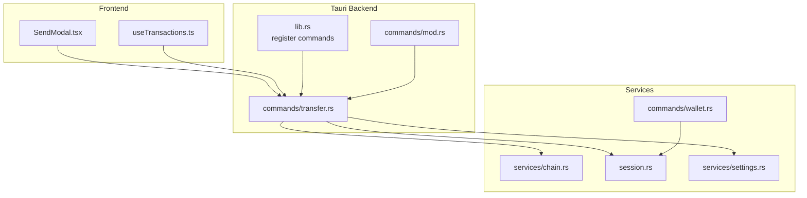
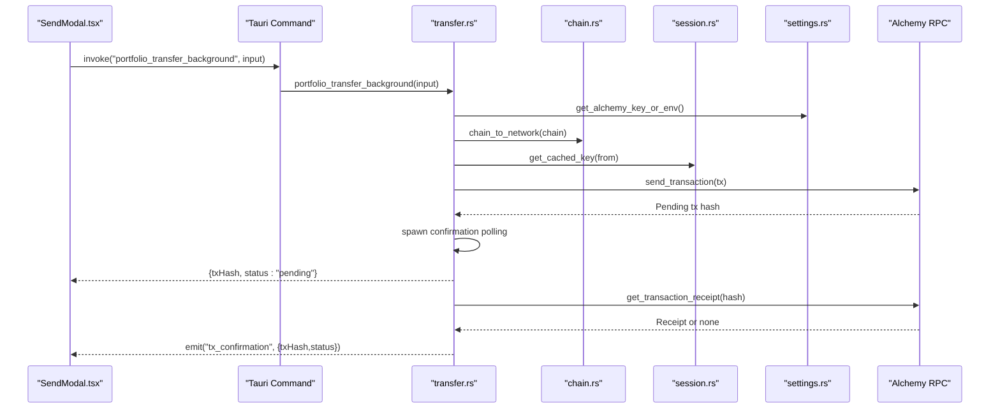
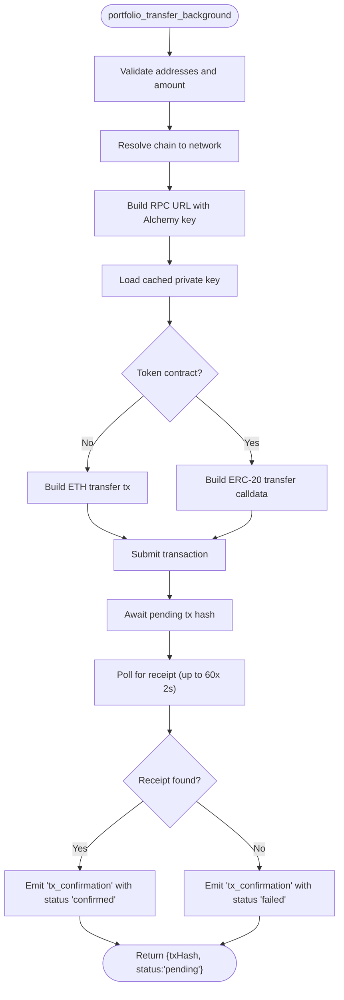
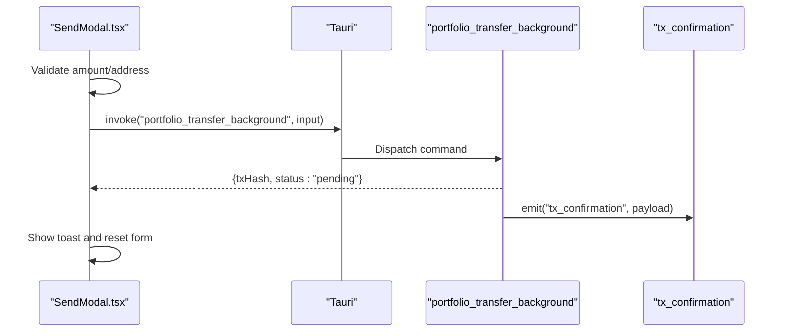
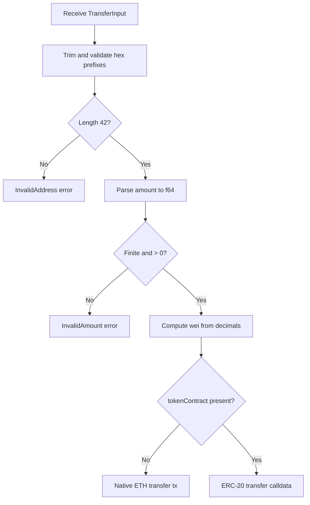
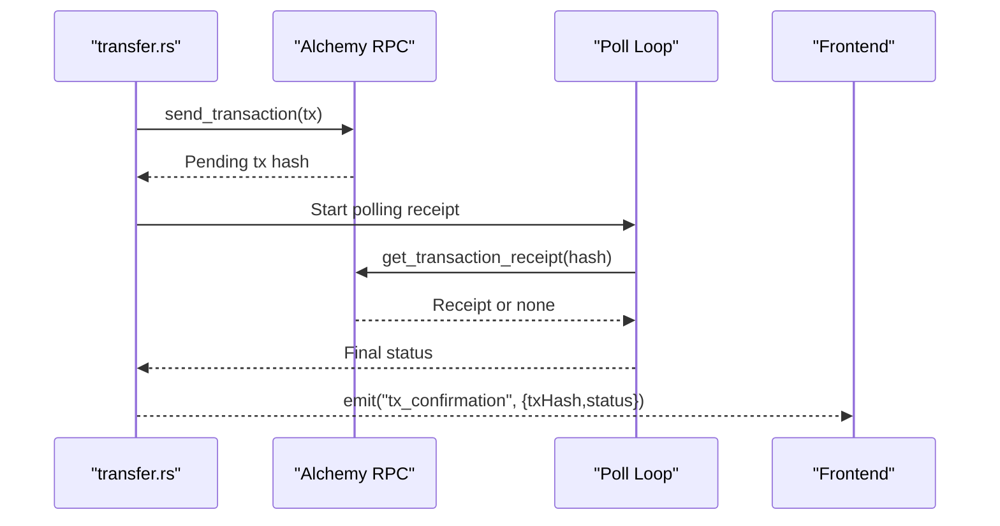
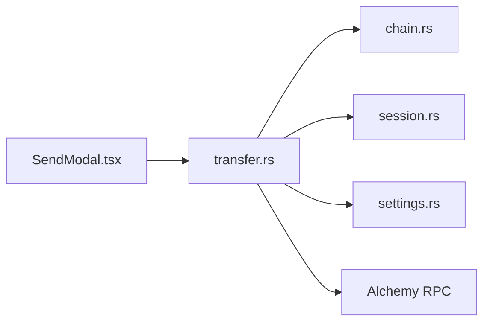

# Transfer Commands

<cite>
**Referenced Files in This Document**
- [transfer.rs](file://src-tauri/src/commands/transfer.rs)
- [lib.rs](file://src-tauri/src/lib.rs)
- [mod.rs](file://src-tauri/src/commands/mod.rs)
- [chain.rs](file://src-tauri/src/services/chain.rs)
- [session.rs](file://src-tauri/src/session.rs)
- [settings.rs](file://src-tauri/src/services/settings.rs)
- [SendModal.tsx](file://src/components/portfolio/SendModal.tsx)
- [useTransactions.ts](file://src/hooks/useTransactions.ts)
- [wallet.rs](file://src-tauri/src/commands/wallet.rs)
</cite>

## Table of Contents
1. [Introduction](#introduction)
2. [Project Structure](#project-structure)
3. [Core Components](#core-components)
4. [Architecture Overview](#architecture-overview)
5. [Detailed Component Analysis](#detailed-component-analysis)
6. [Dependency Analysis](#dependency-analysis)
7. [Performance Considerations](#performance-considerations)
8. [Troubleshooting Guide](#troubleshooting-guide)
9. [Conclusion](#conclusion)
10. [Appendices](#appendices)

## Introduction
This document describes the Transfer command handlers that enable token transfers across supported blockchains. It covers the JavaScript frontend interface for initiating transfers, the Rust backend implementation for transaction processing, parameter schemas, return value formats, error handling patterns, command registration, permission requirements, and security considerations. It also documents transaction signing, blockchain interaction patterns, validation mechanisms, and practical examples for end-to-end transfer operations.

## Project Structure
The transfer functionality spans the frontend and backend:
- Frontend: A modal component invokes a Tauri command to broadcast transfers.
- Backend: Two Tauri commands implement transfer logic and confirmation handling.
- Services: Chain mapping, session caching, and settings integration.

**Diagram sources**
- [SendModal.tsx:115-124](file://src/components/portfolio/SendModal.tsx#L115-L124)
- [transfer.rs:78-160](file://src-tauri/src/commands/transfer.rs#L78-L160)
- [lib.rs:130-131](file://src-tauri/src/lib.rs#L130-L131)
- [mod.rs](file://src-tauri/src/commands/mod.rs#L11)
- [chain.rs:9-23](file://src-tauri/src/services/chain.rs#L9-L23)
- [session.rs:31-37](file://src-tauri/src/session.rs#L31-L37)
- [settings.rs:197-200](file://src-tauri/src/services/settings.rs#L197-L200)
- [wallet.rs:88-90](file://src-tauri/src/commands/wallet.rs#L88-L90)

**Section sources**
- [SendModal.tsx:115-124](file://src/components/portfolio/SendModal.tsx#L115-L124)
- [transfer.rs:78-160](file://src-tauri/src/commands/transfer.rs#L78-L160)
- [lib.rs:130-131](file://src-tauri/src/lib.rs#L130-L131)
- [mod.rs](file://src-tauri/src/commands/mod.rs#L11)
- [chain.rs:9-23](file://src-tauri/src/services/chain.rs#L9-L23)
- [session.rs:31-37](file://src-tauri/src/session.rs#L31-L37)
- [settings.rs:197-200](file://src-tauri/src/services/settings.rs#L197-L200)
- [wallet.rs:88-90](file://src-tauri/src/commands/wallet.rs#L88-L90)

## Core Components
- Transfer commands:
  - Synchronous transfer with immediate confirmation.
  - Background transfer with asynchronous confirmation via emitted events.
- Parameter schemas:
  - TransferInput: sender, recipient, amount, chain, optional token contract and decimals.
- Return schemas:
  - TransferResult: transaction hash.
  - TransferBackgroundResult: transaction hash and initial status.
- Error handling:
  - Address/amount validation, missing API key, unsupported chain, wallet not found/locked, transaction failure.

**Section sources**
- [transfer.rs:54-76](file://src-tauri/src/commands/transfer.rs#L54-L76)
- [transfer.rs:27-52](file://src-tauri/src/commands/transfer.rs#L27-L52)
- [transfer.rs:78-160](file://src-tauri/src/commands/transfer.rs#L78-L160)
- [transfer.rs:162-279](file://src-tauri/src/commands/transfer.rs#L162-L279)

## Architecture Overview
End-to-end transfer flow:
- Frontend validates inputs and invokes a Tauri command.
- Backend resolves chain network, loads a cached private key, constructs a transaction, signs and submits it.
- Immediate command returns a transaction hash; background command additionally emits confirmation events.

**Diagram sources**
- [SendModal.tsx:115-124](file://src/components/portfolio/SendModal.tsx#L115-L124)
- [transfer.rs:162-279](file://src-tauri/src/commands/transfer.rs#L162-L279)
- [chain.rs:9-23](file://src-tauri/src/services/chain.rs#L9-L23)
- [session.rs:31-37](file://src-tauri/src/session.rs#L31-L37)
- [settings.rs:197-200](file://src-tauri/src/services/settings.rs#L197-L200)

## Detailed Component Analysis

### Transfer Command Handlers
- Purpose:
  - portfolio_transfer: synchronous transfer with immediate receipt.
  - portfolio_transfer_background: asynchronous transfer with periodic polling and confirmation emission.
- Inputs:
  - TransferInput fields: fromAddress, toAddress, amount, chain, tokenContract (optional), decimals (optional).
- Processing:
  - Validates addresses and amount.
  - Resolves chain to network and constructs RPC URL.
  - Loads cached private key and constructs a transaction (ETH transfer or ERC-20 transfer).
  - Submits transaction and returns tx hash.
  - Background variant spawns a polling routine and emits "tx_confirmation".
- Outputs:
  - TransferResult: { txHash }.
  - TransferBackgroundResult: { txHash, status }.

**Diagram sources**
- [transfer.rs:162-279](file://src-tauri/src/commands/transfer.rs#L162-L279)

**Section sources**
- [transfer.rs:54-76](file://src-tauri/src/commands/transfer.rs#L54-L76)
- [transfer.rs:78-160](file://src-tauri/src/commands/transfer.rs#L78-L160)
- [transfer.rs:162-279](file://src-tauri/src/commands/transfer.rs#L162-L279)

### Frontend Interface for Transfer Operations
- Component: SendModal
  - Collects amount and recipient address.
  - Invokes portfolio_transfer_background with serialized TransferInput.
  - Handles errors (e.g., wallet locked) and displays notifications.
- Hook: useTransactions
  - Fetches transaction history via portfolio_fetch_transactions.

**Diagram sources**
- [SendModal.tsx:115-124](file://src/components/portfolio/SendModal.tsx#L115-L124)
- [transfer.rs:162-279](file://src-tauri/src/commands/transfer.rs#L162-L279)

**Section sources**
- [SendModal.tsx:33-53](file://src/components/portfolio/SendModal.tsx#L33-L53)
- [SendModal.tsx:115-124](file://src/components/portfolio/SendModal.tsx#L115-L124)
- [useTransactions.ts:23-47](file://src/hooks/useTransactions.ts#L23-L47)

### Parameter Schemas and Validation
- TransferInput (backend):
  - fromAddress: string, required.
  - toAddress: string, required.
  - amount: string, required; parsed to positive finite f64.
  - chain: string, required; mapped to network.
  - tokenContract: optional string; empty treated as native ETH transfer.
  - decimals: optional u8; defaults to 18.
- Frontend validation:
  - Ensures amount > 0, addresses non-empty, recipient address length check.

**Diagram sources**
- [transfer.rs:82-126](file://src-tauri/src/commands/transfer.rs#L82-L126)
- [SendModal.tsx:40-46](file://src/components/portfolio/SendModal.tsx#L40-L46)

**Section sources**
- [transfer.rs:54-63](file://src-tauri/src/commands/transfer.rs#L54-L63)
- [transfer.rs:82-126](file://src-tauri/src/commands/transfer.rs#L82-L126)
- [SendModal.tsx:40-46](file://src/components/portfolio/SendModal.tsx#L40-L46)

### Return Value Formats
- TransferResult:
  - txHash: string (transaction hash).
- TransferBackgroundResult:
  - txHash: string.
  - status: string ("pending" initially; later updated to "confirmed" or "failed").

**Section sources**
- [transfer.rs:65-76](file://src-tauri/src/commands/transfer.rs#L65-L76)
- [transfer.rs:71-76](file://src-tauri/src/commands/transfer.rs#L71-L76)

### Error Handling Patterns
- TransferError variants:
  - InvalidAddress, InvalidAmount, MissingApiKey, UnsupportedChain, WalletNotFound, WalletLocked, TransactionFailed.
- Propagation:
  - Backend commands convert failures to TransferError and serialize them for the frontend.
  - Frontend catches errors and surfaces user-friendly messages (e.g., wallet locked).

**Section sources**
- [transfer.rs:27-52](file://src-tauri/src/commands/transfer.rs#L27-L52)
- [SendModal.tsx:131-139](file://src/components/portfolio/SendModal.tsx#L131-L139)

### Command Registration and Permissions
- Registration:
  - Both commands are registered in lib.rs under the invoke handler list.
- Permissions:
  - No explicit permission checks are implemented in the transfer commands themselves; they rely on session state and key availability.

**Section sources**
- [lib.rs:130-131](file://src-tauri/src/lib.rs#L130-L131)
- [mod.rs](file://src-tauri/src/commands/mod.rs#L11)

### Security Considerations
- Private key handling:
  - Keys are cached in-memory with inactivity expiry; cleared on exit.
  - Wallets are stored in OS keychain/biometry; session module migrates keys into biometry when available.
- RPC and API keys:
  - Alchemy API key is retrieved from keychain/cache or environment variable.
- Transaction safety:
  - Addresses and amounts validated before submission.
  - Native ETH vs ERC-20 selection prevents misuse of calldata.

**Section sources**
- [session.rs:31-37](file://src-tauri/src/session.rs#L31-L37)
- [session.rs:86-93](file://src-tauri/src/session.rs#L86-L93)
- [settings.rs:197-200](file://src-tauri/src/services/settings.rs#L197-L200)
- [wallet.rs:128-148](file://src-tauri/src/commands/wallet.rs#L128-L148)

### Transaction Signing and Blockchain Interaction
- Signing:
  - Private key loaded from session cache; wallet bound to chain ID from RPC.
- Submission:
  - Transaction submitted via Alchemy RPC; pending hash awaited.
- Confirmation:
  - Background command polls for receipt; emits "tx_confirmation" with status.

**Diagram sources**
- [transfer.rs:148-156](file://src-tauri/src/commands/transfer.rs#L148-L156)
- [transfer.rs:245-273](file://src-tauri/src/commands/transfer.rs#L245-L273)

**Section sources**
- [transfer.rs:106-114](file://src-tauri/src/commands/transfer.rs#L106-L114)
- [transfer.rs:148-156](file://src-tauri/src/commands/transfer.rs#L148-L156)
- [transfer.rs:245-273](file://src-tauri/src/commands/transfer.rs#L245-L273)

### Cross-Chain Bridging and NFT Transfers
- Cross-chain bridging:
  - Not implemented in the current transfer commands; transfers are executed on the selected chain via Alchemy RPC.
- NFT transfers:
  - The ERC-20 selector is used for token transfers; NFT transfers would require different selectors/calldata and are not part of the current implementation.

**Section sources**
- [transfer.rs:16-16](file://src-tauri/src/commands/transfer.rs#L16-L16)
- [transfer.rs:128-146](file://src-tauri/src/commands/transfer.rs#L128-L146)

## Dependency Analysis
- Internal dependencies:
  - transfer.rs depends on chain.rs for chain-to-network mapping, session.rs for cached keys, and settings.rs for API keys.
- External dependencies:
  - Alchemy RPC endpoint for transaction submission and receipt polling.
- Frontend-backend boundary:
  - Tauri commands bridge UI actions to Rust logic.

**Diagram sources**
- [SendModal.tsx:115-124](file://src/components/portfolio/SendModal.tsx#L115-L124)
- [transfer.rs:78-160](file://src-tauri/src/commands/transfer.rs#L78-L160)
- [chain.rs:9-23](file://src-tauri/src/services/chain.rs#L9-L23)
- [session.rs:31-37](file://src-tauri/src/session.rs#L31-L37)
- [settings.rs:197-200](file://src-tauri/src/services/settings.rs#L197-L200)

**Section sources**
- [transfer.rs:78-160](file://src-tauri/src/commands/transfer.rs#L78-L160)
- [chain.rs:9-23](file://src-tauri/src/services/chain.rs#L9-L23)
- [session.rs:31-37](file://src-tauri/src/session.rs#L31-L37)
- [settings.rs:197-200](file://src-tauri/src/services/settings.rs#L197-L200)

## Performance Considerations
- Polling cadence:
  - Background confirmation polls every 2 seconds up to 60 attempts; adjust for UX responsiveness vs. RPC load.
- Gas optimization:
  - Native ETH transfers avoid calldata overhead; ERC-20 transfers include ABI-encoded arguments.
- Session cache:
  - Cached keys reduce repeated keychain access; ensure appropriate expiry to balance security and performance.

[No sources needed since this section provides general guidance]

## Troubleshooting Guide
Common issues and resolutions:
- Wallet locked:
  - Frontend detects "Wallet locked" and prompts unlocking; ensure session cache has a valid key.
- Invalid address/amount:
  - Validate hex prefix and length; ensure amount is finite and positive.
- Unsupported chain:
  - Verify chain code is supported; consult chain-to-network mapping.
- Missing API key:
  - Provide Alchemy key via keychain or environment variable.
- Transaction dropped:
  - Background confirmation may report failure if receipt not found within polling window.

**Section sources**
- [SendModal.tsx:131-139](file://src/components/portfolio/SendModal.tsx#L131-L139)
- [transfer.rs:82-89](file://src-tauri/src/commands/transfer.rs#L82-L89)
- [transfer.rs:91-92](file://src-tauri/src/commands/transfer.rs#L91-L92)
- [transfer.rs:80-80](file://src-tauri/src/commands/transfer.rs#L80-L80)
- [transfer.rs:261-271](file://src-tauri/src/commands/transfer.rs#L261-L271)

## Conclusion
The Transfer command handlers provide a robust foundation for executing token transfers across supported chains. They integrate frontend validation, backend signing, and asynchronous confirmation, while leveraging secure session caching and external RPC infrastructure. Extending support for NFTs and cross-chain bridges would involve adding new selectors/calldata and bridging protocols, respectively.

[No sources needed since this section summarizes without analyzing specific files]

## Appendices

### Practical Examples
- Initiating a transfer:
  - Frontend collects amount and recipient, then invokes portfolio_transfer_background with TransferInput.
- Receiving confirmation:
  - Listen for "tx_confirmation" events to update UI state.

**Section sources**
- [SendModal.tsx:115-124](file://src/components/portfolio/SendModal.tsx#L115-L124)
- [transfer.rs:261-273](file://src-tauri/src/commands/transfer.rs#L261-L273)