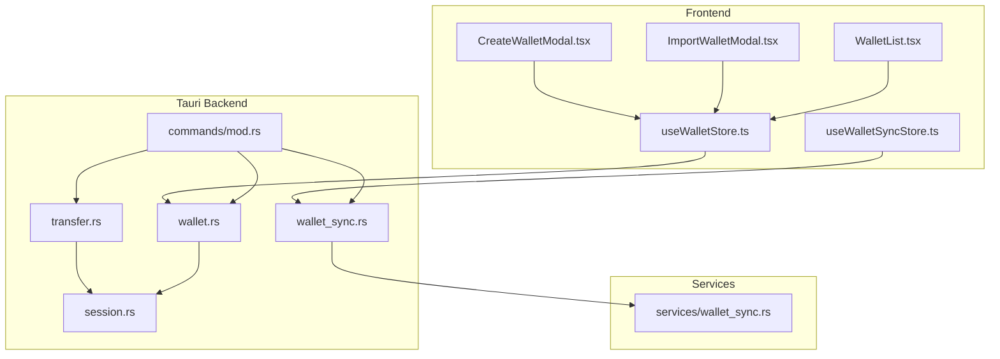
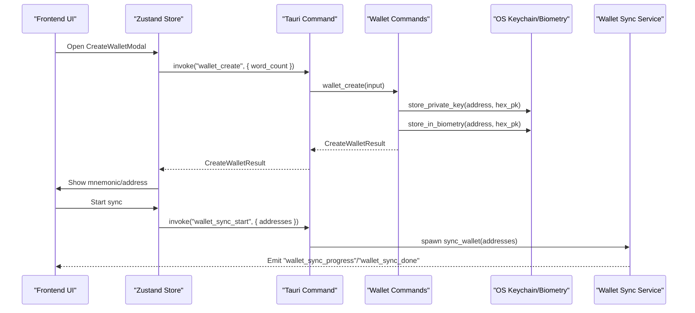
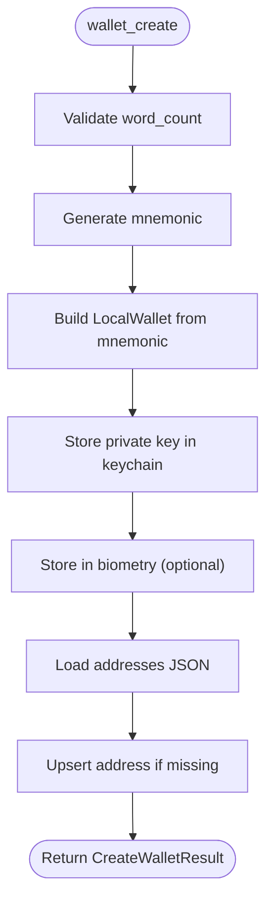
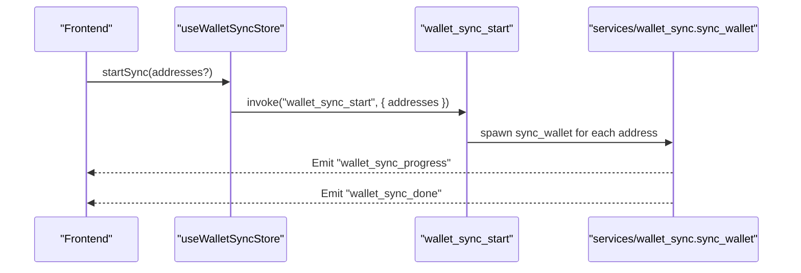
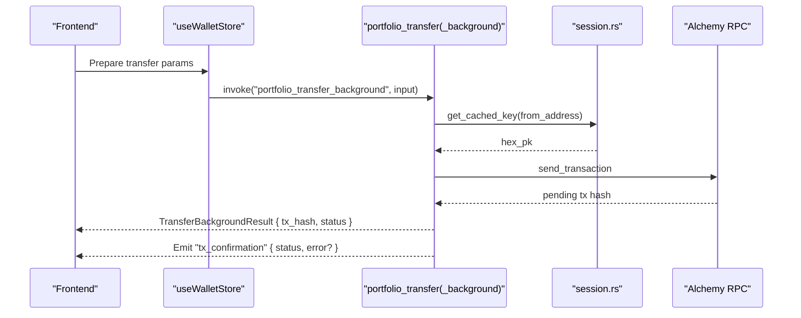
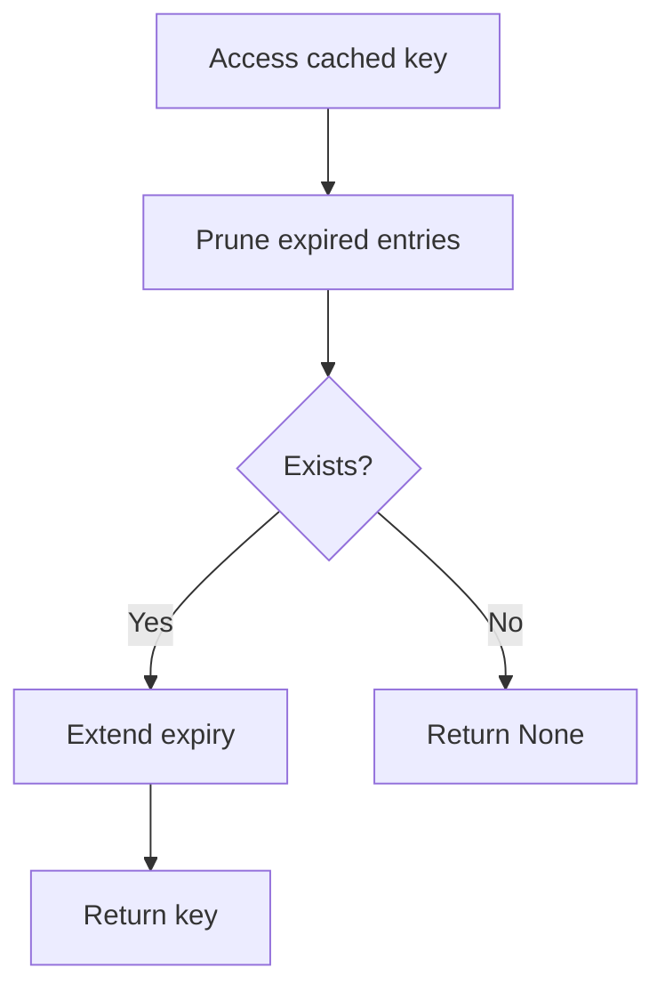
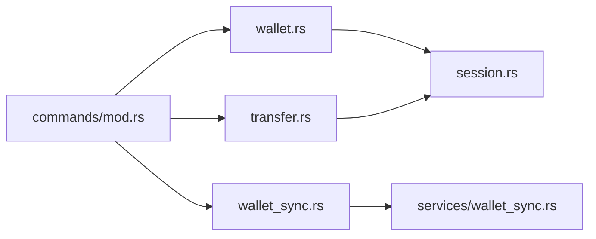

# Wallet Commands

<cite>
**Referenced Files in This Document**
- [wallet.rs](file://src-tauri/src/commands/wallet.rs)
- [wallet_sync.rs](file://src-tauri/src/commands/wallet_sync.rs)
- [transfer.rs](file://src-tauri/src/commands/transfer.rs)
- [session.rs](file://src-tauri/src/session.rs)
- [wallet.ts](file://src/types/wallet.ts)
- [useWalletStore.ts](file://src/store/useWalletStore.ts)
- [useWalletSyncStore.ts](file://src/store/useWalletSyncStore.ts)
- [CreateWalletModal.tsx](file://src/components/wallet/CreateWalletModal.tsx)
- [ImportWalletModal.tsx](file://src/components/wallet/ImportWalletModal.tsx)
- [WalletList.tsx](file://src/components/wallet/WalletList.tsx)
- [mod.rs](file://src-tauri/src/commands/mod.rs)
- [wallet_sync.rs](file://src-tauri/src/services/wallet_sync.rs)
</cite>

## Table of Contents
1. [Introduction](#introduction)
2. [Project Structure](#project-structure)
3. [Core Components](#core-components)
4. [Architecture Overview](#architecture-overview)
5. [Detailed Component Analysis](#detailed-component-analysis)
6. [Dependency Analysis](#dependency-analysis)
7. [Performance Considerations](#performance-considerations)
8. [Troubleshooting Guide](#troubleshooting-guide)
9. [Conclusion](#conclusion)
10. [Appendices](#appendices)

## Introduction
This document describes the Wallet command handlers and related systems for managing EVM wallets within the application. It covers wallet creation and import, key storage and security, balance and portfolio synchronization, transaction signing, and the frontend interfaces that invoke these commands. It also documents parameter schemas, return value formats, error handling patterns, and security considerations.

## Project Structure
The wallet functionality spans three layers:
- Frontend (TypeScript/React): UI components and stores that invoke Tauri commands and manage state.
- Backend (Rust/Tauri): Wallet command handlers and services for key storage, sync, and transfers.
- Services: Supporting modules for portfolio data, local database, and event emission.



**Diagram sources**
- [CreateWalletModal.tsx:1-169](file://src/components/wallet/CreateWalletModal.tsx#L1-L169)
- [ImportWalletModal.tsx:1-181](file://src/components/wallet/ImportWalletModal.tsx#L1-L181)
- [WalletList.tsx:1-76](file://src/components/wallet/WalletList.tsx#L1-L76)
- [useWalletStore.ts:1-48](file://src/store/useWalletStore.ts#L1-L48)
- [useWalletSyncStore.ts:1-199](file://src/store/useWalletSyncStore.ts#L1-L199)
- [wallet.rs:1-284](file://src-tauri/src/commands/wallet.rs#L1-L284)
- [wallet_sync.rs:1-90](file://src-tauri/src/commands/wallet_sync.rs#L1-L90)
- [transfer.rs:1-280](file://src-tauri/src/commands/transfer.rs#L1-L280)
- [session.rs:1-145](file://src-tauri/src/session.rs#L1-L145)
- [mod.rs:1-27](file://src-tauri/src/commands/mod.rs#L1-L27)
- [wallet_sync.rs:1-453](file://src-tauri/src/services/wallet_sync.rs#L1-L453)

**Section sources**
- [mod.rs:1-27](file://src-tauri/src/commands/mod.rs#L1-L27)

## Core Components
- Wallet command handlers: create, import (mnemonic/private key), list, remove.
- Wallet sync commands: start sync and check status.
- Transfer commands: execute native token and ERC20 transfers with optional background confirmation.
- Session cache: in-memory caching of decrypted private keys with expiration.
- Frontend stores and components: invoke commands, manage UI state, and listen to events.

**Section sources**
- [wallet.rs:169-284](file://src-tauri/src/commands/wallet.rs#L169-L284)
- [wallet_sync.rs:34-90](file://src-tauri/src/commands/wallet_sync.rs#L34-L90)
- [transfer.rs:78-280](file://src-tauri/src/commands/transfer.rs#L78-L280)
- [session.rs:1-145](file://src-tauri/src/session.rs#L1-L145)
- [useWalletStore.ts:1-48](file://src/store/useWalletStore.ts#L1-L48)
- [useWalletSyncStore.ts:1-199](file://src/store/useWalletSyncStore.ts#L1-L199)

## Architecture Overview
The wallet system integrates frontend UI with Tauri commands and Rust services. Keys are stored in the OS keychain and optionally protected by biometric authentication. Private keys are cached in memory for short sessions to enable transaction signing. Wallet addresses are persisted in a JSON file for quick access.



**Diagram sources**
- [CreateWalletModal.tsx:33-62](file://src/components/wallet/CreateWalletModal.tsx#L33-L62)
- [useWalletStore.ts:23-37](file://src/store/useWalletStore.ts#L23-L37)
- [wallet.rs:169-200](file://src-tauri/src/commands/wallet.rs#L169-L200)
- [wallet_sync.rs:59-90](file://src-tauri/src/commands/wallet_sync.rs#L59-L90)
- [wallet_sync.rs:260-452](file://src-tauri/src/services/wallet_sync.rs#L260-L452)

## Detailed Component Analysis

### Wallet Command Handlers
- Purpose: Manage wallet lifecycle and key storage.
- Key operations:
  - Create wallet with configurable mnemonic length.
  - Import wallet from mnemonic or private key.
  - List stored addresses.
  - Remove wallet and associated keys.
- Security:
  - Private keys stored in OS keychain; optional biometric protection.
  - Address list stored in a plain JSON file for fast access without prompting.
- Error handling:
  - Structured errors for invalid inputs, keychain failures, and missing wallets.



**Diagram sources**
- [wallet.rs:169-200](file://src-tauri/src/commands/wallet.rs#L169-L200)

**Section sources**
- [wallet.rs:18-37](file://src-tauri/src/commands/wallet.rs#L18-L37)
- [wallet.rs:169-284](file://src-tauri/src/commands/wallet.rs#L169-L284)

### Wallet Sync Commands
- Purpose: Trigger and monitor background sync of tokens, NFTs, and transactions.
- Operations:
  - Start sync for selected or all wallets.
  - Query sync status per wallet.
- Events:
  - Emits progress updates and completion notifications.
- Data flow:
  - Validates addresses, spawns async sync tasks, and persists snapshots.



**Diagram sources**
- [useWalletSyncStore.ts:64-73](file://src/store/useWalletSyncStore.ts#L64-L73)
- [wallet_sync.rs:59-90](file://src-tauri/src/commands/wallet_sync.rs#L59-L90)
- [wallet_sync.rs:260-452](file://src-tauri/src/services/wallet_sync.rs#L260-L452)

**Section sources**
- [wallet_sync.rs:12-57](file://src-tauri/src/commands/wallet_sync.rs#L12-L57)
- [wallet_sync.rs:59-90](file://src-tauri/src/commands/wallet_sync.rs#L59-L90)
- [useWalletSyncStore.ts:111-151](file://src/store/useWalletSyncStore.ts#L111-L151)

### Transfer Commands
- Purpose: Execute native token and ERC20 transfers using cached or stored keys.
- Operations:
  - Immediate transfer with synchronous receipt.
  - Background transfer with periodic confirmation events.
- Validation:
  - Address and amount checks, chain support, API key presence.
- Signing:
  - Uses session-cached private key; parses chain ID from RPC.



**Diagram sources**
- [transfer.rs:162-280](file://src-tauri/src/commands/transfer.rs#L162-L280)
- [session.rs:31-57](file://src-tauri/src/session.rs#L31-L57)

**Section sources**
- [transfer.rs:78-160](file://src-tauri/src/commands/transfer.rs#L78-L160)
- [transfer.rs:162-280](file://src-tauri/src/commands/transfer.rs#L162-L280)
- [session.rs:1-145](file://src-tauri/src/session.rs#L1-L145)

### Session Management
- Purpose: Securely cache decrypted private keys in memory with inactivity expiry.
- Behavior:
  - Single active session retained.
  - Automatic pruning of expired entries.
  - Zeroization on clear.



**Diagram sources**
- [session.rs:31-57](file://src-tauri/src/session.rs#L31-L57)

**Section sources**
- [session.rs:1-145](file://src-tauri/src/session.rs#L1-L145)

### Frontend Interfaces
- Types:
  - TypeScript types mirror Rust command payloads and responses for wallet operations.
- Stores:
  - Wallet store manages addresses, active address, and wallet names.
  - Sync store manages sync progress, steps, and listens to backend events.
- Components:
  - Create wallet modal invokes creation and starts sync.
  - Import wallet modal validates inputs and triggers import.
  - Wallet list supports copy and removal.

```mermaid
classDiagram
class WalletStore {
+string[] addresses
+string|null activeAddress
+Record~string,string~ walletNames
+refreshWallets() Promise~void~
+setActiveAddress(address) void
+setWalletName(address,name) void
}
class WalletSyncStore {
+string syncStatus
+number progress
+string currentStep
+number walletCount
+number walletIndex
+number doneCount
+startSync(addresses?) Promise~void~
+setSyncing(progress,step,walletIndex,walletCount) void
+onWalletDone(walletCount) void
+setIdle() void
}
WalletStore --> "invokes" "wallet_list"
WalletSyncStore --> "invokes" "wallet_sync_start"
```

**Diagram sources**
- [useWalletStore.ts:7-14](file://src/store/useWalletStore.ts#L7-L14)
- [useWalletSyncStore.ts:10-34](file://src/store/useWalletSyncStore.ts#L10-L34)

**Section sources**
- [wallet.ts:1-59](file://src/types/wallet.ts#L1-L59)
- [useWalletStore.ts:1-48](file://src/store/useWalletStore.ts#L1-L48)
- [useWalletSyncStore.ts:1-199](file://src/store/useWalletSyncStore.ts#L1-L199)
- [CreateWalletModal.tsx:1-169](file://src/components/wallet/CreateWalletModal.tsx#L1-L169)
- [ImportWalletModal.tsx:1-181](file://src/components/wallet/ImportWalletModal.tsx#L1-L181)
- [WalletList.tsx:1-76](file://src/components/wallet/WalletList.tsx#L1-L76)

## Dependency Analysis
- Command registration:
  - Commands are re-exported via the module index for global availability.
- Coupling:
  - Wallet commands depend on session cache for signing and keychain/biometry for storage.
  - Transfer commands depend on session cache and RPC providers.
  - Sync commands depend on portfolio service and local database.
- External integrations:
  - Alchemy RPC and NFT APIs for balance, NFTs, and transactions.
  - OS keychain and biometry plugins for secure key storage.



**Diagram sources**
- [mod.rs:1-27](file://src-tauri/src/commands/mod.rs#L1-L27)
- [wallet.rs:1-20](file://src-tauri/src/commands/wallet.rs#L1-L20)
- [wallet_sync.rs:1-10](file://src-tauri/src/commands/wallet_sync.rs#L1-L10)
- [transfer.rs:1-15](file://src-tauri/src/commands/transfer.rs#L1-L15)
- [wallet_sync.rs:1-10](file://src-tauri/src/services/wallet_sync.rs#L1-L10)

**Section sources**
- [mod.rs:1-27](file://src-tauri/src/commands/mod.rs#L1-L27)

## Performance Considerations
- Async sync:
  - Wallet sync runs concurrently across networks and wallets; progress events keep UI responsive.
- Memory cache:
  - Session cache avoids repeated keychain prompts; automatic pruning prevents memory bloat.
- Event-driven UI:
  - Listeners update UI incrementally as sync progresses, reducing polling overhead.

[No sources needed since this section provides general guidance]

## Troubleshooting Guide
- Missing API key:
  - Wallet sync and transfers require an Alchemy API key; errors indicate missing configuration.
- Invalid inputs:
  - Creation requires supported word counts; import validates mnemonic length and private key format.
- Wallet locked:
  - Transfers require an active session; unlock to cache the key.
- Keychain/biometry issues:
  - Biometric storage may fall back to keychain password depending on build configuration.

**Section sources**
- [wallet_sync.rs:261-274](file://src-tauri/src/commands/wallet_sync.rs#L261-L274)
- [transfer.rs:80-92](file://src-tauri/src/commands/transfer.rs#L80-L92)
- [transfer.rs:96-104](file://src-tauri/src/commands/transfer.rs#L96-L104)
- [session.rs:31-57](file://src-tauri/src/session.rs#L31-L57)

## Conclusion
The wallet system provides a secure, modular foundation for EVM wallet management. It combines OS-backed key storage, in-memory session caching, and robust frontend integration to deliver a smooth user experience while maintaining strong security practices.

[No sources needed since this section summarizes without analyzing specific files]

## Appendices

### Parameter Schemas and Return Formats
- Create wallet
  - Input: word_count (12 or 24)
  - Output: address, mnemonic
- Import wallet (mnemonic)
  - Input: mnemonic (string)
  - Output: address
- Import wallet (private key)
  - Input: private_key (string, 64 hex chars, optional 0x prefix)
  - Output: address
- List wallets
  - Input: none
  - Output: addresses (array of strings)
- Remove wallet
  - Input: address (string)
  - Output: success (boolean)
- Wallet sync start
  - Input: addresses (optional array)
  - Output: started (boolean), count (number)
- Wallet sync status
  - Output: wallets (array of items with address, last_synced_at, sync_status, needs_sync)
- Transfer (immediate)
  - Input: from_address, to_address, amount, chain, token_contract (optional), decimals (optional)
  - Output: tx_hash
- Transfer (background)
  - Input: same as immediate
  - Output: tx_hash, status ("pending")

**Section sources**
- [wallet.rs:39-79](file://src-tauri/src/commands/wallet.rs#L39-L79)
- [wallet_sync.rs:21-32](file://src-tauri/src/commands/wallet_sync.rs#L21-L32)
- [transfer.rs:54-76](file://src-tauri/src/commands/transfer.rs#L54-L76)
- [wallet.ts:3-18](file://src/types/wallet.ts#L3-L18)
- [transfer.rs:65-76](file://src-tauri/src/commands/transfer.rs#L65-L76)

### Security Considerations
- Private key storage:
  - Stored in OS keychain; biometric protection enabled when available.
- Session cache:
  - In-memory cache with strict inactivity expiry; zeroization on clear.
- Input validation:
  - Frontend and backend validate addresses, amounts, and mnemonic lengths.
- Permissions:
  - Wallet operations are constrained to local device storage and configured RPC endpoints.

**Section sources**
- [wallet.rs:128-167](file://src-tauri/src/commands/wallet.rs#L128-L167)
- [session.rs:1-145](file://src-tauri/src/session.rs#L1-L145)
- [ImportWalletModal.tsx:25-33](file://src/components/wallet/ImportWalletModal.tsx#L25-L33)
- [CreateWalletModal.tsx:120-146](file://src/components/wallet/CreateWalletModal.tsx#L120-L146)

### Practical Examples
- Create a new wallet:
  - Invoke wallet_create with word_count 12 or 24; copy and securely store the returned mnemonic.
- Import an existing wallet:
  - Use wallet_import_mnemonic or wallet_import_private_key with validated inputs.
- Start sync:
  - Call wallet_sync_start to refresh balances and transactions; monitor progress events.
- Send a transfer:
  - Use portfolio_transfer or portfolio_transfer_background; confirm status via tx_confirmation events.

**Section sources**
- [CreateWalletModal.tsx:33-62](file://src/components/wallet/CreateWalletModal.tsx#L33-L62)
- [ImportWalletModal.tsx:51-94](file://src/components/wallet/ImportWalletModal.tsx#L51-L94)
- [useWalletSyncStore.ts:64-73](file://src/store/useWalletSyncStore.ts#L64-L73)
- [transfer.rs:162-280](file://src-tauri/src/commands/transfer.rs#L162-L280)