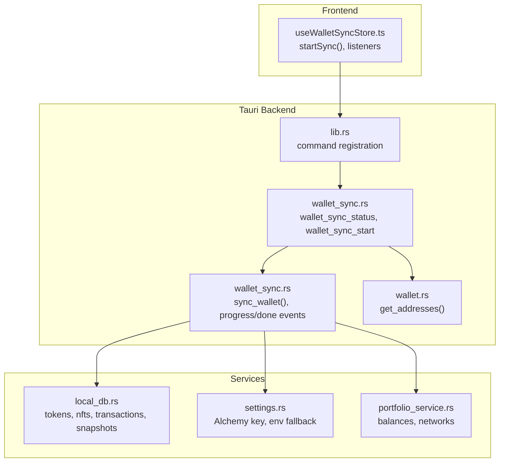
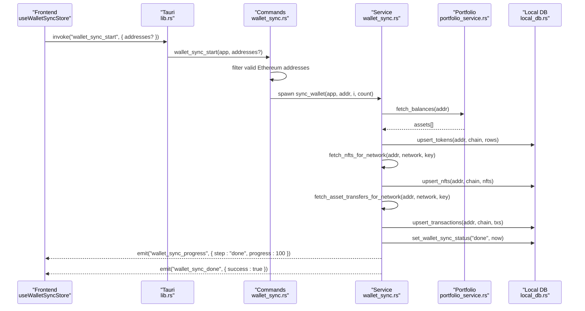
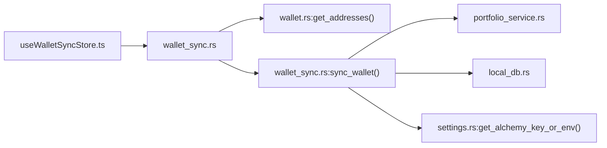

# Wallet Sync Commands

<cite>
**Referenced Files in This Document**
- [wallet_sync.rs](file://src-tauri/src/commands/wallet_sync.rs)
- [wallet_sync_service.rs](file://src-tauri/src/services/wallet_sync.rs)
- [useWalletSyncStore.ts](file://src/store/useWalletSyncStore.ts)
- [wallet_commands.rs](file://src-tauri/src/commands/wallet.rs)
- [lib.rs](file://src-tauri/src/lib.rs)
- [local_db.rs](file://src-tauri/src/services/local_db.rs)
- [settings.rs](file://src-tauri/src/services/settings.rs)
- [portfolio_service.rs](file://src-tauri/src/services/portfolio_service.rs)
- [wallet.ts](file://src/types/wallet.ts)
</cite>

## Table of Contents
1. [Introduction](#introduction)
2. [Project Structure](#project-structure)
3. [Core Components](#core-components)
4. [Architecture Overview](#architecture-overview)
5. [Detailed Component Analysis](#detailed-component-analysis)
6. [Dependency Analysis](#dependency-analysis)
7. [Performance Considerations](#performance-considerations)
8. [Troubleshooting Guide](#troubleshooting-guide)
9. [Conclusion](#conclusion)

## Introduction
This document describes the Wallet Sync command handlers that orchestrate cross-chain wallet synchronization. It covers the JavaScript frontend interface for initiating and observing sync operations, the Rust backend implementation for blockchain data retrieval and persistence, parameter schemas, return value formats, error handling patterns, command registration, permission/security considerations, and multi-wallet/multi-chain coordination. Practical examples and response processing guidance are included to help integrate and troubleshoot sync operations.

## Project Structure
The wallet sync capability spans three layers:
- Frontend (React + Zustand): Initiates sync, listens to progress/done events, and updates UI state.
- Backend (Tauri + Rust): Exposes commands, validates parameters, spawns background sync tasks, emits progress events, and persists results.
- Services: Portfolio aggregation, local database storage, settings management, and chain/network selection.

**Diagram sources**
- [lib.rs:90-190](file://src-tauri/src/lib.rs#L90-L190)
- [wallet_sync.rs:34-89](file://src-tauri/src/commands/wallet_sync.rs#L34-L89)
- [wallet_sync_service.rs:260-452](file://src-tauri/src/services/wallet_sync.rs#L260-L452)
- [wallet_commands.rs:87-90](file://src-tauri/src/commands/wallet.rs#L87-L90)
- [local_db.rs:10-72](file://src-tauri/src/services/local_db.rs#L10-L72)
- [settings.rs:197-200](file://src-tauri/src/services/settings.rs#L197-L200)
- [portfolio_service.rs:16-25](file://src-tauri/src/services/portfolio_service.rs#L16-L25)

**Section sources**
- [lib.rs:90-190](file://src-tauri/src/lib.rs#L90-L190)
- [wallet_sync.rs:34-89](file://src-tauri/src/commands/wallet_sync.rs#L34-L89)
- [wallet_sync_service.rs:260-452](file://src-tauri/src/services/wallet_sync.rs#L260-L452)
- [wallet_commands.rs:87-90](file://src-tauri/src/commands/wallet.rs#L87-L90)
- [local_db.rs:10-72](file://src-tauri/src/services/local_db.rs#L10-L72)
- [settings.rs:197-200](file://src-tauri/src/services/settings.rs#L197-L200)
- [portfolio_service.rs:16-25](file://src-tauri/src/services/portfolio_service.rs#L16-L25)

## Core Components
- Wallet Sync Commands
  - wallet_sync_status: Returns per-address sync status and staleness.
  - wallet_sync_start: Starts background sync for specified or all wallets.
- Wallet Sync Service
  - sync_wallet: Orchestrates token/NFT/transaction sync across networks, emits progress, and persists results.
- Frontend Store
  - useWalletSyncStore: Invokes commands, listens to progress/done events, and manages UI state.
- Supporting Services
  - Local DB: Schema for tokens, NFTs, transactions, and snapshots.
  - Settings: Alchemy API key retrieval (cache + env fallback).
  - Portfolio Service: Network lists and balance aggregation.

**Section sources**
- [wallet_sync.rs:34-89](file://src-tauri/src/commands/wallet_sync.rs#L34-L89)
- [wallet_sync_service.rs:260-452](file://src-tauri/src/services/wallet_sync.rs#L260-L452)
- [useWalletSyncStore.ts:45-73](file://src/store/useWalletSyncStore.ts#L45-L73)
- [local_db.rs:10-72](file://src-tauri/src/services/local_db.rs#L10-L72)
- [settings.rs:197-200](file://src-tauri/src/services/settings.rs#L197-L200)
- [portfolio_service.rs:16-25](file://src-tauri/src/services/portfolio_service.rs#L16-L25)

## Architecture Overview
The sync pipeline is event-driven:
- Frontend invokes wallet_sync_start with optional addresses.
- Backend validates addresses and spawns per-wallet async tasks.
- Each task fetches balances, NFTs, and transactions from Alchemy, upserts into local DB, and emits progress events.
- On completion, a portfolio snapshot is captured and market opportunities are refreshed.

**Diagram sources**
- [lib.rs:90-190](file://src-tauri/src/lib.rs#L90-L190)
- [wallet_sync.rs:60-89](file://src-tauri/src/commands/wallet_sync.rs#L60-L89)
- [wallet_sync_service.rs:260-452](file://src-tauri/src/services/wallet_sync.rs#L260-L452)
- [portfolio_service.rs:131-147](file://src-tauri/src/services/portfolio_service.rs#L131-L147)
- [local_db.rs:10-72](file://src-tauri/src/services/local_db.rs#L10-L72)

## Detailed Component Analysis

### Wallet Sync Commands
- wallet_sync_status
  - Purpose: Determine if each wallet needs syncing based on last synced timestamp and staleness threshold.
  - Inputs: App handle.
  - Outputs: WalletSyncStatusResult with per-address items containing address, last_synced_at, sync_status ("idle" or "done"), and needs_sync flag.
  - Staleness: 5-minute threshold determines "idle" vs "done".
- wallet_sync_start
  - Purpose: Trigger background sync for selected or all wallets.
  - Inputs: Optional addresses array; if omitted, uses all known wallet addresses.
  - Validation: Filters to valid Ethereum addresses (0x-prefixed, 42 characters).
  - Behavior: Spawns async tasks per wallet; returns WalletSyncStartResult with started flag and count.

**Section sources**
- [wallet_sync.rs:34-57](file://src-tauri/src/commands/wallet_sync.rs#L34-L57)
- [wallet_sync.rs:59-89](file://src-tauri/src/commands/wallet_sync.rs#L59-L89)
- [wallet_commands.rs:87-90](file://src-tauri/src/commands/wallet.rs#L87-L90)

### Wallet Sync Service
- sync_wallet
  - Networks: Builds active network list including base networks and optionally Flow networks if the app is ready.
  - Steps:
    - Tokens: Fetch balances via portfolio_service, group by chain, upsert tokens, and snapshot portfolio.
    - NFTs: For each network, fetch NFTs via Alchemy, normalize metadata, upsert per chain.
    - Transactions: For each network, fetch transfers via Alchemy RPC, normalize fields, upsert per chain.
  - Events:
    - Progress: Emits "wallet_sync_progress" with step, progress/total, and wallet index/count.
    - Done: Emits "wallet_sync_done" with success flag and optional error.
  - Persistence: Updates wallet sync status and timestamps; captures portfolio snapshots and refreshes market opportunities.

**Section sources**
- [wallet_sync_service.rs:19-28](file://src-tauri/src/services/wallet_sync.rs#L19-L28)
- [wallet_sync_service.rs:260-452](file://src-tauri/src/services/wallet_sync.rs#L260-L452)
- [portfolio_service.rs:16-25](file://src-tauri/src/services/portfolio_service.rs#L16-L25)

### Frontend Interface (JavaScript/TypeScript)
- useWalletSyncStore
  - Actions:
    - startSync(addresses?): Invokes wallet_sync_start; ignores errors if sync already running.
    - setSyncing(progress, step, walletIndex, walletCount): Updates UI state during sync.
    - onWalletDone(walletCount): Tracks completion across multiple wallets.
    - setIdle(): Resets state to idle.
  - Listeners:
    - Listens to "wallet_sync_progress" to update progress and step.
    - Listens to "wallet_sync_done" to finalize UI and notify user on last wallet completion.
  - Types:
    - SyncProgressPayload mirrors backend progress payload.
    - SyncStatus is "idle" or "syncing".

**Section sources**
- [useWalletSyncStore.ts:45-73](file://src/store/useWalletSyncStore.ts#L45-L73)
- [useWalletSyncStore.ts:111-151](file://src/store/useWalletSyncStore.ts#L111-L151)

### Parameter Schemas and Return Values
- Command Parameters
  - wallet_sync_start
    - addresses: Optional array of strings; defaults to all known wallet addresses.
    - Validation: Non-empty arrays are filtered to Ethereum addresses (0x-prefixed, length 42).
  - wallet_sync_status
    - No parameters; uses current app wallet list.
- Return Value Formats
  - WalletSyncStatusResult
    - wallets: Array of WalletSyncStatusItem
      - address: string
      - last_synced_at: integer or null
      - sync_status: "idle" | "done"
      - needs_sync: boolean
  - WalletSyncStartResult
    - started: boolean
    - count: number
  - SyncProgressPayload (service)
    - address: string
    - step: "tokens" | "nfts" | "transactions" | "done"
    - progress: number (0–100)
    - total: number (typically 100)
    - wallet_index: number
    - wallet_count: number
  - SyncDonePayload (service)
    - address: string
    - success: boolean
    - error: string | null
- Data Models
  - PortfolioAsset (used by sync)
    - id, symbol, chain, chainName, balance, valueUsd, type, tokenContract, decimals, walletAddress?
  - Local DB Entities
    - tokens: id, wallet_address, chain, token_contract, symbol, balance, value_usd, decimals, asset_type, updated_at
    - nfts: id, wallet_address, chain, contract, token_id, metadata, updated_at
    - transactions: id, wallet_address, chain, tx_hash, from_addr, to_addr, value, block_number, timestamp, category, metadata, updated_at

**Section sources**
- [wallet_sync.rs:21-32](file://src-tauri/src/commands/wallet_sync.rs#L21-L32)
- [wallet_sync.rs:12-25](file://src-tauri/src/commands/wallet_sync.rs#L12-L25)
- [wallet_sync_service.rs:30-48](file://src-tauri/src/services/wallet_sync.rs#L30-L48)
- [wallet.ts:20-31](file://src/types/wallet.ts#L20-L31)
- [local_db.rs:17-53](file://src-tauri/src/services/local_db.rs#L17-L53)

### Error Handling Patterns
- Missing Alchemy API Key
  - sync_wallet checks for API key; if missing, emits done with error and sets wallet status to "error".
- API Failures
  - NFT and transfer fetches return errors; sync continues per-network and logs failures.
- Frontend
  - startSync ignores invocation errors to prevent double-start races.
  - Listeners surface success/failure notifications; last-wallet completion triggers a summary notification.

**Section sources**
- [wallet_sync_service.rs:261-274](file://src-tauri/src/services/wallet_sync.rs#L261-L274)
- [wallet_sync_service.rs:136-164](file://src-tauri/src/services/wallet_sync.rs#L136-L164)
- [useWalletSyncStore.ts:64-72](file://src/store/useWalletSyncStore.ts#L64-L72)
- [useWalletSyncStore.ts:128-144](file://src/store/useWalletSyncStore.ts#L128-L144)

### Command Registration and Permissions
- Command Registration
  - Commands are registered in lib.rs under invoke_handler, including wallet_sync_status and wallet_sync_start.
- Permissions and Security
  - Wallet addresses are persisted in a plain JSON file to avoid frequent OS password prompts.
  - Private keys are stored in OS keychain and optionally protected by biometric unlock.
  - Alchemy API key is cached in memory and can fall back to environment variable.
  - No explicit permission model is enforced for sync commands; access is controlled by the app’s frontend/UI gating.

**Section sources**
- [lib.rs:90-190](file://src-tauri/src/lib.rs#L90-L190)
- [wallet_commands.rs:83-126](file://src-tauri/src/commands/wallet.rs#L83-L126)
- [settings.rs:197-200](file://src-tauri/src/services/settings.rs#L197-L200)

### Multi-Wallet Coordination and Conflict Resolution
- Multi-Wallet
  - wallet_sync_start accepts an optional addresses array; if omitted, all known addresses are synced.
  - Each wallet is processed independently with per-wallet progress and done events.
- Multi-Chain
  - active_sync_networks selects base networks and optionally Flow networks if the app is ready.
  - Data is grouped by chain and upserted separately to maintain clean separation.
- Conflict Resolution
  - Upsert operations in local_db ensure idempotency; latest updated_at timestamps reflect freshness.
  - Portfolio snapshots capture totals and breakdowns after successful sync.

**Section sources**
- [wallet_sync.rs:64-83](file://src-tauri/src/commands/wallet_sync.rs#L64-L83)
- [wallet_sync_service.rs:19-28](file://src-tauri/src/services/wallet_sync.rs#L19-L28)
- [local_db.rs:17-53](file://src-tauri/src/services/local_db.rs#L17-L53)

### Practical Examples and Response Processing
- Example: Start sync for all wallets
  - Frontend: await startSync()
  - Backend: wallet_sync_start filters valid addresses and spawns tasks
  - Events: Progress updates for tokens, nfts, transactions, and done
  - Response: WalletSyncStartResult with started=true and count
- Example: Start sync for specific wallets
  - Frontend: await startSync(["0x...", "0x..."])
  - Backend: Only those addresses are considered; invalid entries are ignored
- Response Processing
  - Frontend listens to "wallet_sync_progress" to update progress bar and step label.
  - Frontend listens to "wallet_sync_done" to finalize UI; on last wallet completion, show a notification.

**Section sources**
- [useWalletSyncStore.ts:64-72](file://src/store/useWalletSyncStore.ts#L64-L72)
- [wallet_sync.rs:64-83](file://src-tauri/src/commands/wallet_sync.rs#L64-L83)
- [wallet_sync_service.rs:278-451](file://src-tauri/src/services/wallet_sync.rs#L278-L451)

## Dependency Analysis

**Diagram sources**
- [useWalletSyncStore.ts:45-73](file://src/store/useWalletSyncStore.ts#L45-L73)
- [wallet_sync.rs:34-89](file://src-tauri/src/commands/wallet_sync.rs#L34-L89)
- [wallet_commands.rs:87-90](file://src-tauri/src/commands/wallet.rs#L87-L90)
- [wallet_sync_service.rs:260-452](file://src-tauri/src/services/wallet_sync.rs#L260-L452)
- [settings.rs:197-200](file://src-tauri/src/services/settings.rs#L197-L200)
- [local_db.rs:10-72](file://src-tauri/src/services/local_db.rs#L10-L72)

**Section sources**
- [lib.rs:90-190](file://src-tauri/src/lib.rs#L90-L190)
- [wallet_sync.rs:34-89](file://src-tauri/src/commands/wallet_sync.rs#L34-L89)
- [wallet_sync_service.rs:260-452](file://src-tauri/src/services/wallet_sync.rs#L260-L452)
- [wallet_commands.rs:87-90](file://src-tauri/src/commands/wallet.rs#L87-L90)
- [local_db.rs:10-72](file://src-tauri/src/services/local_db.rs#L10-L72)
- [settings.rs:197-200](file://src-tauri/src/services/settings.rs#L197-L200)

## Performance Considerations
- Asynchronous Parallelism
  - Multiple wallets are spawned concurrently; each wallet sync iterates networks sequentially to avoid rate limits.
- Network Selection
  - active_sync_networks dynamically includes Flow networks only when the app is ready, reducing unnecessary requests.
- Event Granularity
  - Progress events are emitted per step and per network iteration to provide smooth UX feedback.
- Data Persistence
  - Upserts minimize redundant writes; snapshots are captured post-success to avoid frequent recomputation.

[No sources needed since this section provides general guidance]

## Troubleshooting Guide
- Missing Alchemy API Key
  - Symptom: Immediate "wallet_sync_done" with error indicating missing key.
  - Action: Set API key in Settings or provide ALCHEMY_API_KEY environment variable.
- Invalid Addresses
  - Symptom: wallet_sync_start returns started=false and count=0.
  - Action: Ensure addresses are 0x-prefixed and 42 characters long.
- Frequent OS Password Prompts
  - Cause: Keychain access for private keys.
  - Mitigation: Biometric unlock reduces repeated prompts; keep app unlocked during sync.
- Slow Sync
  - Causes: Many networks, large NFT/transaction sets, or API throttling.
  - Mitigation: Reduce concurrent wallets, retry later, or adjust network list.

**Section sources**
- [wallet_sync_service.rs:261-274](file://src-tauri/src/services/wallet_sync.rs#L261-L274)
- [wallet_sync.rs:67-68](file://src-tauri/src/commands/wallet_sync.rs#L67-L68)
- [settings.rs:197-200](file://src-tauri/src/services/settings.rs#L197-L200)

## Conclusion
The Wallet Sync system provides a robust, event-driven mechanism to synchronize wallet portfolios across multiple chains. The frontend integrates seamlessly with Tauri commands and service events, while the backend encapsulates validation, asynchronous processing, and persistent storage. By leveraging network-aware sync, progress reporting, and snapshotting, the system delivers a responsive and reliable user experience for multi-wallet, multi-chain portfolio management.