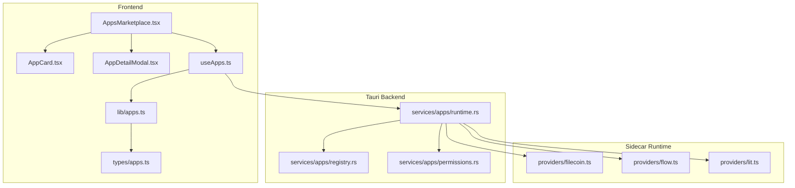
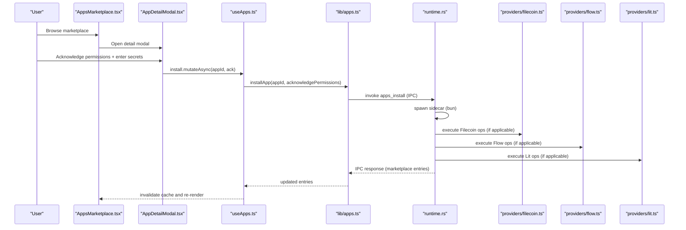
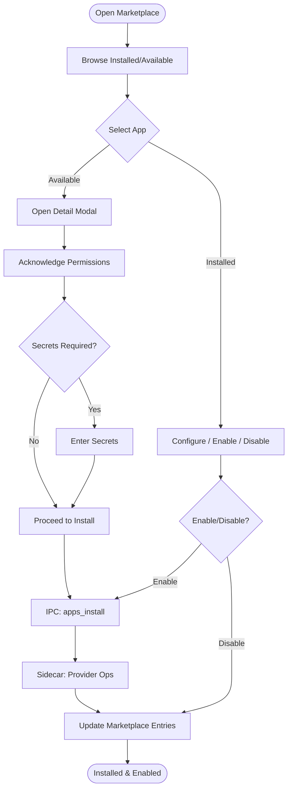
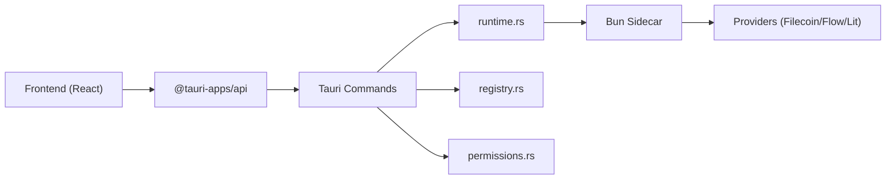

# Applications & Extensions

<cite>
**Referenced Files in This Document**
- [AppsMarketplace.tsx](file://src/components/apps/AppsMarketplace.tsx)
- [AppCard.tsx](file://src/components/apps/AppCard.tsx)
- [AppDetailModal.tsx](file://src/components/apps/AppDetailModal.tsx)
- [apps.ts](file://src/lib/apps.ts)
- [apps.ts (types)](file://src/types/apps.ts)
- [useApps.ts](file://src/hooks/useApps.ts)
- [runtime.rs](file://src-tauri/src/services/apps/runtime.rs)
- [registry.rs](file://src-tauri/src/services/apps/registry.rs)
- [permissions.rs](file://src-tauri/src/services/apps/permissions.rs)
- [filecoin.ts](file://apps-runtime/src/providers/filecoin.ts)
- [flow.ts](file://apps-runtime/src/providers/flow.ts)
- [lit.ts](file://apps-runtime/src/providers/lit.ts)
- [package.json](file://package.json)
</cite>

## Table of Contents
1. [Introduction](#introduction)
2. [Project Structure](#project-structure)
3. [Core Components](#core-components)
4. [Architecture Overview](#architecture-overview)
5. [Detailed Component Analysis](#detailed-component-analysis)
6. [Dependency Analysis](#dependency-analysis)
7. [Performance Considerations](#performance-considerations)
8. [Troubleshooting Guide](#troubleshooting-guide)
9. [Conclusion](#conclusion)
10. [Appendices](#appendices)

## Introduction
This document explains SHADOW Protocol’s applications and extensions system with a focus on the marketplace and runtime provider integration. It covers the AppsMarketplace interface, AppCard components for application display, and AppDetailModal for detailed information. It documents the runtime provider architecture supporting Filecoin, Flow, and Lit protocols, permission management, and security frameworks. It also describes the application installation process, dependency management, updates, integration patterns, sandboxing, and the lifecycle from browsing to activation and monitoring. Guidance is included for developers building applications, publishing to the marketplace, and integrating with SHADOW’s ecosystem.

## Project Structure
The applications and extensions system spans three layers:
- Frontend UI components and hooks that render the marketplace, cards, and modals, and orchestrate IPC calls to the backend.
- Backend Tauri services that manage the app registry, permissions, runtime invocation, and database state.
- Sidecar runtime written in TypeScript/Bun that executes protocol-specific providers for Filecoin, Flow, and Lit.

**Diagram sources**
- [AppsMarketplace.tsx:1-198](file://src/components/apps/AppsMarketplace.tsx#L1-L198)
- [AppCard.tsx:1-165](file://src/components/apps/AppCard.tsx#L1-L165)
- [AppDetailModal.tsx:1-210](file://src/components/apps/AppDetailModal.tsx#L1-L210)
- [useApps.ts:1-139](file://src/hooks/useApps.ts#L1-L139)
- [apps.ts:1-307](file://src/lib/apps.ts#L1-L307)
- [apps.ts (types):1-61](file://src/types/apps.ts#L1-L61)
- [runtime.rs:1-144](file://src-tauri/src/services/apps/runtime.rs#L1-L144)
- [registry.rs:1-139](file://src-tauri/src/services/apps/registry.rs#L1-L139)
- [permissions.rs:1-53](file://src-tauri/src/services/apps/permissions.rs#L1-L53)
- [filecoin.ts:1-264](file://apps-runtime/src/providers/filecoin.ts#L1-L264)
- [flow.ts:1-188](file://apps-runtime/src/providers/flow.ts#L1-L188)
- [lit.ts:1-382](file://apps-runtime/src/providers/lit.ts#L1-L382)

**Section sources**
- [AppsMarketplace.tsx:1-198](file://src/components/apps/AppsMarketplace.tsx#L1-L198)
- [useApps.ts:1-139](file://src/hooks/useApps.ts#L1-L139)
- [apps.ts:1-307](file://src/lib/apps.ts#L1-L307)
- [apps.ts (types):1-61](file://src/types/apps.ts#L1-L61)
- [runtime.rs:1-144](file://src-tauri/src/services/apps/runtime.rs#L1-L144)
- [registry.rs:1-139](file://src-tauri/src/services/apps/registry.rs#L1-L139)
- [permissions.rs:1-53](file://src-tauri/src/services/apps/permissions.rs#L1-L53)
- [filecoin.ts:1-264](file://apps-runtime/src/providers/filecoin.ts#L1-L264)
- [flow.ts:1-188](file://apps-runtime/src/providers/flow.ts#L1-L188)
- [lit.ts:1-382](file://apps-runtime/src/providers/lit.ts#L1-L382)

## Core Components
- AppsMarketplace: Renders the marketplace UI, filters, search, category toggles, and lists installed vs available apps. Integrates with mutations for install, enable/disable, and health refresh.
- AppCard: Displays app metadata, status badges, version/health info, and action buttons (Install, Configure, Enable/Disable).
- AppDetailModal: Presents detailed app information, capabilities, required permissions, and optional secret configuration before installation.
- Frontend IPC and state: useApps.ts orchestrates TanStack Query for fetching marketplace entries and mutating app state; lib/apps.ts exposes typed IPC invocations to Tauri commands.
- Backend registry and permissions: registry.rs seeds the bundled catalog; permissions.rs enforces install-time and runtime permission checks.
- Runtime provider sandbox: runtime.rs spawns a Bun sidecar per request to isolate provider execution.

**Section sources**
- [AppsMarketplace.tsx:1-198](file://src/components/apps/AppsMarketplace.tsx#L1-L198)
- [AppCard.tsx:1-165](file://src/components/apps/AppCard.tsx#L1-L165)
- [AppDetailModal.tsx:1-210](file://src/components/apps/AppDetailModal.tsx#L1-L210)
- [useApps.ts:1-139](file://src/hooks/useApps.ts#L1-L139)
- [apps.ts:1-307](file://src/lib/apps.ts#L1-L307)
- [registry.rs:1-139](file://src-tauri/src/services/apps/registry.rs#L1-L139)
- [permissions.rs:1-53](file://src-tauri/src/services/apps/permissions.rs#L1-L53)
- [runtime.rs:1-144](file://src-tauri/src/services/apps/runtime.rs#L1-L144)

## Architecture Overview
The system follows a layered architecture:
- UI layer (React) renders marketplace and app details, collects user consent and secrets, and triggers mutations.
- IPC layer (TanStack Query + @tauri-apps/api) invokes Tauri commands.
- Backend services (Rust/Tauri) manage catalog, permissions, runtime invocation, and database state.
- Sidecar runtime (Bun + TypeScript) executes protocol providers in an isolated process.

**Diagram sources**
- [AppsMarketplace.tsx:179-197](file://src/components/apps/AppsMarketplace.tsx#L179-L197)
- [AppDetailModal.tsx:59-72](file://src/components/apps/AppDetailModal.tsx#L59-L72)
- [useApps.ts:33-44](file://src/hooks/useApps.ts#L33-L44)
- [apps.ts:233-241](file://src/lib/apps.ts#L233-L241)
- [runtime.rs:69-131](file://src-tauri/src/services/apps/runtime.rs#L69-L131)
- [filecoin.ts:145-242](file://apps-runtime/src/providers/filecoin.ts#L145-L242)
- [flow.ts:39-131](file://apps-runtime/src/providers/flow.ts#L39-L131)
- [lit.ts:108-382](file://apps-runtime/src/providers/lit.ts#L108-L382)

## Detailed Component Analysis

### AppsMarketplace
Responsibilities:
- Filter and search installed vs available apps.
- Trigger install, enable/disable, and health refresh.
- Render AppCard instances and AppDetailModal for installation flow.
- Manage settings panel for installed apps.

Key behaviors:
- Uses memoized filtering by search term and category.
- Delegates install and enable/disable to mutations.
- Calls backend health refresh and updates UI state.

**Section sources**
- [AppsMarketplace.tsx:20-197](file://src/components/apps/AppsMarketplace.tsx#L20-L197)

### AppCard
Responsibilities:
- Visualize app metadata, status, version, and health.
- Provide actions: Install (for available), Configure (for installed), Enable/Disable (for installed).

Key behaviors:
- Maps icon keys to Lucide icons.
- Shows status indicators (active/error/updating/paused/inactive).
- Displays version and health for installed apps; “Bundled” trust indicator for available apps.

**Section sources**
- [AppCard.tsx:26-165](file://src/components/apps/AppCard.tsx#L26-L165)

### AppDetailModal
Responsibilities:
- Present app overview, features, and permissions.
- Collect user acknowledgment of permissions and optional secrets.
- Persist secrets and initiate installation.

Key behaviors:
- Validates permission acknowledgment and presence of required secrets.
- Saves secrets via IPC before installing.
- Disables install button until prerequisites are met.

**Section sources**
- [AppDetailModal.tsx:34-210](file://src/components/apps/AppDetailModal.tsx#L34-L210)

### Frontend IPC and State Management
Responsibilities:
- useApps.ts: TanStack Query hooks for marketplace, mutations, runtime health, and backups.
- lib/apps.ts: Typed IPC wrappers for marketplace, install/uninstall, enable/disable, config, secrets, and runtime health.

Key behaviors:
- Mutations invalidate queries to keep UI in sync.
- Config and secrets are persisted via IPC and do not require UI refresh.

**Section sources**
- [useApps.ts:19-139](file://src/hooks/useApps.ts#L19-L139)
- [apps.ts:17-307](file://src/lib/apps.ts#L17-L307)

### Backend Registry and Permissions
Responsibilities:
- registry.rs: Seeds bundled catalog (Lit, Flow, Filecoin) with features, permissions, secrets, and agent tools.
- permissions.rs: Resolves manifest permissions, grants them at install time, and asserts permissions at runtime.

Key behaviors:
- Permission IDs are validated against the manifest and stored in the database.
- Human-readable labels are available for UI presentation.

**Section sources**
- [registry.rs:21-80](file://src-tauri/src/services/apps/registry.rs#L21-L80)
- [permissions.rs:10-43](file://src-tauri/src/services/apps/permissions.rs#L10-L43)

### Runtime Provider Sandbox
Responsibilities:
- runtime.rs: Spawns a Bun sidecar per request to execute provider logic in isolation.
- Providers: filecoin.ts, flow.ts, lit.ts encapsulate protocol-specific operations.

Key behaviors:
- One request per process for crash isolation.
- JSON-based request/response protocol with timeouts.
- Providers expose typed interfaces and handle errors gracefully.

**Section sources**
- [runtime.rs:69-144](file://src-tauri/src/services/apps/runtime.rs#L69-L144)
- [filecoin.ts:43-264](file://apps-runtime/src/providers/filecoin.ts#L43-L264)
- [flow.ts:18-188](file://apps-runtime/src/providers/flow.ts#L18-L188)
- [lit.ts:108-382](file://apps-runtime/src/providers/lit.ts#L108-L382)

### Protocol Providers

#### Filecoin Storage Provider
Capabilities:
- Upload encrypted backups, restore previews, cost quoting, dataset listing, and termination.
- Enforces policy-driven redundancy and cost caps.

Security and validation:
- Validates payload size and policy cost cap.
- Throws descriptive errors for invalid keys or exceeded limits.

**Section sources**
- [filecoin.ts:8-64](file://apps-runtime/src/providers/filecoin.ts#L8-L64)
- [filecoin.ts:145-242](file://apps-runtime/src/providers/filecoin.ts#L145-L242)

#### Flow Provider
Capabilities:
- Account status, asset balances, and sponsored transaction preparation.
- Network selection (testnet/mainnet).

Security and validation:
- Validates Flow address format.
- Returns normalized balances and network-scoped asset metadata.

**Section sources**
- [flow.ts:3-22](file://apps-runtime/src/providers/flow.ts#L3-L22)
- [flow.ts:39-131](file://apps-runtime/src/providers/flow.ts#L39-L131)

#### Lit Protocol Provider
Capabilities:
- Mint PKP, wallet status, precheck via Lit TEE nodes, and PKP signing.
- Fallback local precheck when nodes are unavailable.

Security and validation:
- Uses SIWE-based session signatures for node authorization.
- Enforces guardrails (daily spend, per-trade, approval thresholds, protocol whitelist).

**Section sources**
- [lit.ts:23-51](file://apps-runtime/src/providers/lit.ts#L23-L51)
- [lit.ts:185-288](file://apps-runtime/src/providers/lit.ts#L185-L288)

### Application Lifecycle

**Diagram sources**
- [AppsMarketplace.tsx:120-197](file://src/components/apps/AppsMarketplace.tsx#L120-L197)
- [AppDetailModal.tsx:59-72](file://src/components/apps/AppDetailModal.tsx#L59-L72)
- [useApps.ts:33-74](file://src/hooks/useApps.ts#L33-L74)
- [apps.ts:233-241](file://src/lib/apps.ts#L233-L241)
- [runtime.rs:69-131](file://src-tauri/src/services/apps/runtime.rs#L69-L131)

## Dependency Analysis
- Frontend depends on @tauri-apps/api and TanStack Query for IPC and caching.
- IPC calls route through lib/apps.ts to Tauri commands managed by runtime.rs.
- runtime.rs depends on Bun and sidecar providers for protocol operations.
- Backend services depend on SQLite via registry.rs and permissions.rs.

**Diagram sources**
- [package.json:18-37](file://package.json#L18-L37)
- [apps.ts:1-307](file://src/lib/apps.ts#L1-L307)
- [runtime.rs:69-144](file://src-tauri/src/services/apps/runtime.rs#L69-L144)
- [registry.rs:1-139](file://src-tauri/src/services/apps/registry.rs#L1-L139)
- [permissions.rs:1-53](file://src-tauri/src/services/apps/permissions.rs#L1-L53)

**Section sources**
- [package.json:18-37](file://package.json#L18-L37)
- [apps.ts:1-307](file://src/lib/apps.ts#L1-L307)
- [runtime.rs:69-144](file://src-tauri/src/services/apps/runtime.rs#L69-L144)
- [registry.rs:1-139](file://src-tauri/src/services/apps/registry.rs#L1-L139)
- [permissions.rs:1-53](file://src-tauri/src/services/apps/permissions.rs#L1-L53)

## Performance Considerations
- Sidecar isolation: One request per process ensures crashes do not affect other requests.
- Query invalidation: Mutations invalidate caches to avoid stale UI while minimizing redundant network calls.
- Health refresh: Dedicated mutation refreshes integration health and invalidates runtime health cache.
- Provider timeouts: Sidecar response parsing includes timeouts to prevent hanging requests.

[No sources needed since this section provides general guidance]

## Troubleshooting Guide
Common issues and resolutions:
- Installation stuck or failing:
  - Verify permission acknowledgment and required secrets are entered.
  - Check runtime health and retry refresh.
- Filecoin upload failures:
  - Ensure API key is valid and wallet is funded within configured cost cap.
  - Confirm payload meets minimum size requirements.
- Flow account not found:
  - Validate address format and network selection.
- Lit connectivity:
  - Check node availability; fallback precheck remains functional.

**Section sources**
- [AppDetailModal.tsx:59-72](file://src/components/apps/AppDetailModal.tsx#L59-L72)
- [useApps.ts:66-72](file://src/hooks/useApps.ts#L66-L72)
- [filecoin.ts:145-242](file://apps-runtime/src/providers/filecoin.ts#L145-L242)
- [flow.ts:65-131](file://apps-runtime/src/providers/flow.ts#L65-L131)
- [lit.ts:358-378](file://apps-runtime/src/providers/lit.ts#L358-L378)

## Conclusion
SHADOW’s applications and extensions system integrates a secure, sandboxed runtime with a curated marketplace of first-party protocol integrations. The UI provides a seamless installation and configuration experience, backed by robust permission management and provider-specific capabilities for Filecoin, Flow, and Lit. Developers can extend the system by adding entries to the bundled catalog and implementing providers that adhere to the sidecar contract.

[No sources needed since this section summarizes without analyzing specific files]

## Appendices

### Permission Model and Security Isolation
- Install-time permissions: Manifest permissions are extracted and granted to the app upon installation.
- Runtime checks: Required permissions are asserted before executing sensitive operations.
- Sandboxing: Each request spawns a separate Bun process to isolate provider execution and mitigate risks.

**Section sources**
- [registry.rs:69-80](file://src-tauri/src/services/apps/registry.rs#L69-L80)
- [permissions.rs:10-43](file://src-tauri/src/services/apps/permissions.rs#L10-L43)
- [runtime.rs:69-131](file://src-tauri/src/services/apps/runtime.rs#L69-L131)

### Developer Guidance
- Building an app:
  - Define catalog entry with features, permissions, secrets, and agent tools.
  - Implement provider logic in the sidecar runtime with typed interfaces.
- Publishing to the marketplace:
  - Add a bundled catalog entry; ensure permissions and secrets are clearly documented.
- Integrating with SHADOW:
  - Expose IPC commands via Tauri; use typed responses for UI rendering.
  - Respect sandbox boundaries and handle errors with clear messages.

**Section sources**
- [registry.rs:21-66](file://src-tauri/src/services/apps/registry.rs#L21-L66)
- [apps.ts (types):3-61](file://src/types/apps.ts#L3-L61)
- [runtime.rs:28-47](file://src-tauri/src/services/apps/runtime.rs#L28-L47)