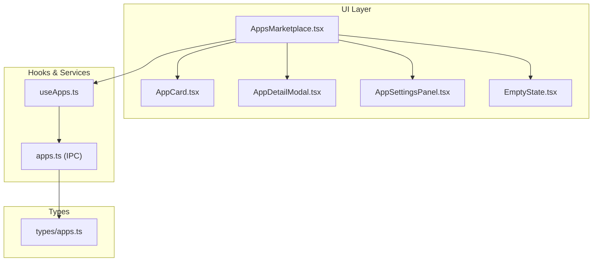
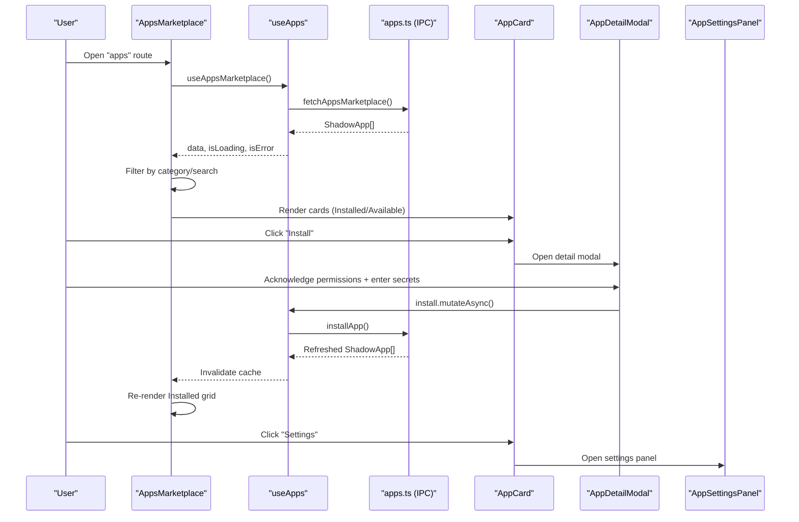
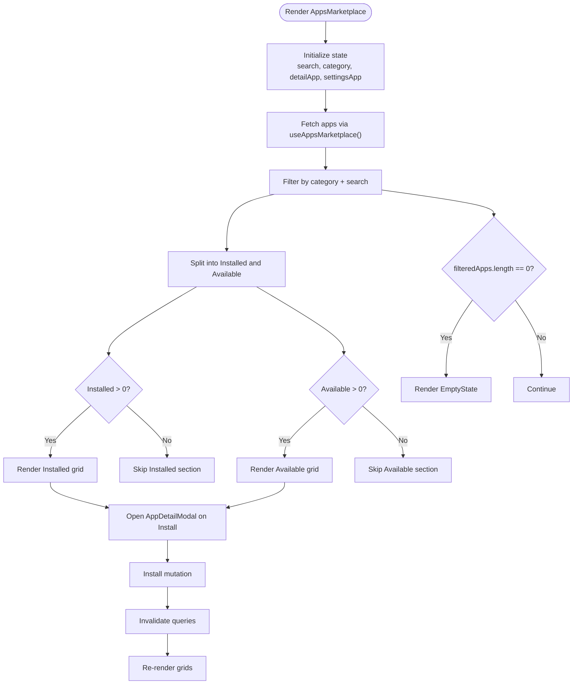
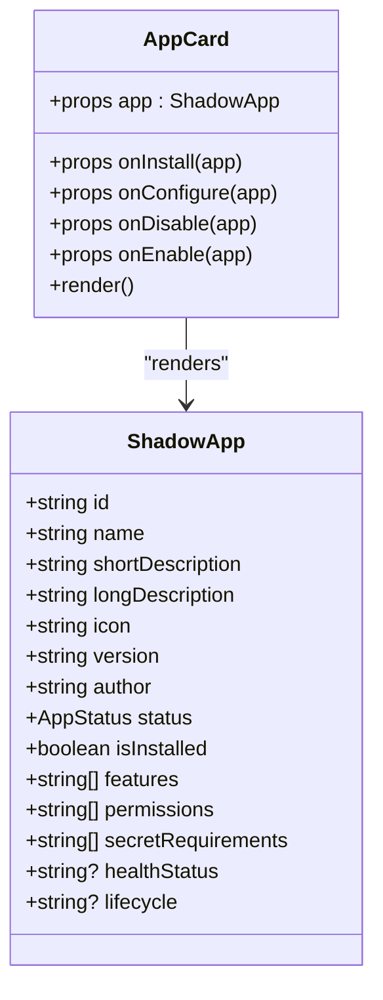
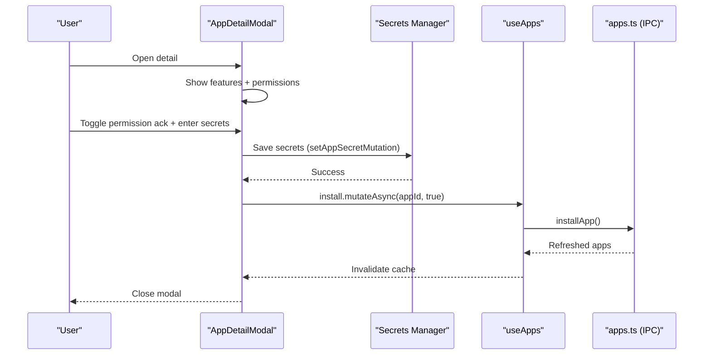
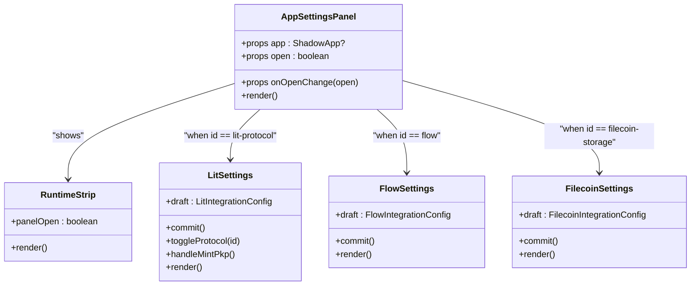
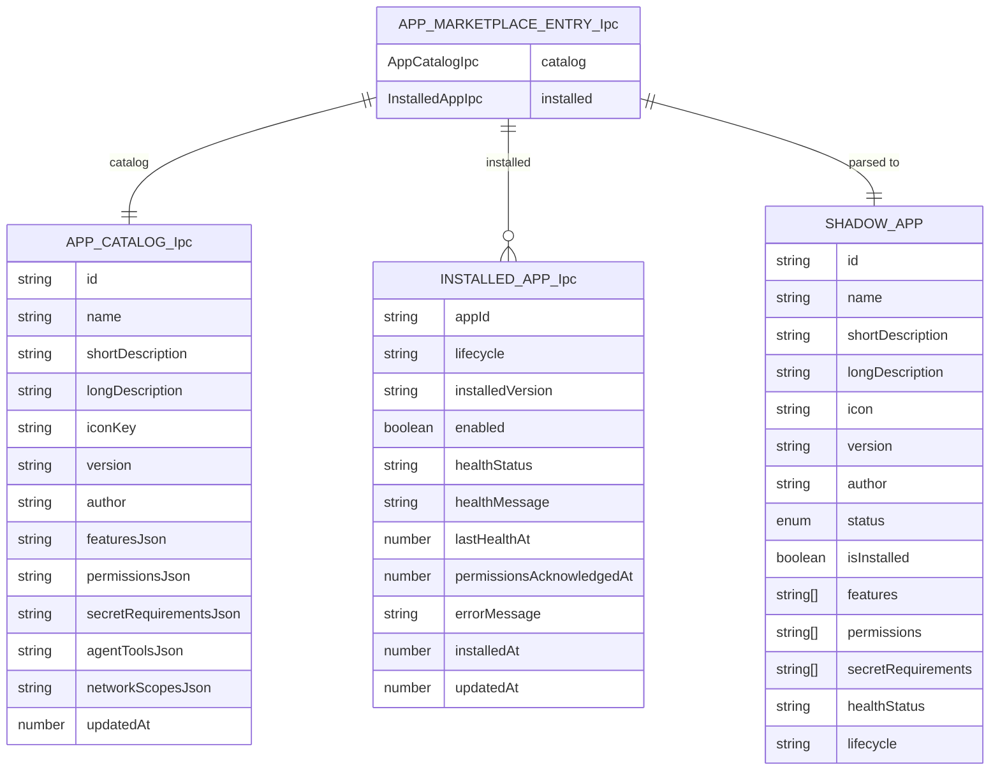
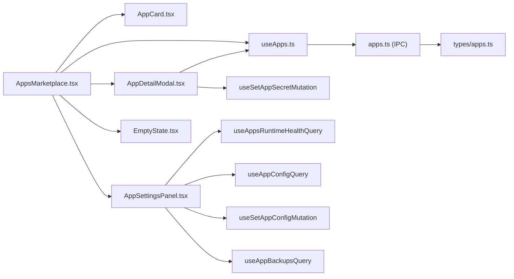

# Apps Marketplace

<cite>
**Referenced Files in This Document**
- [AppsMarketplace.tsx](file://src/components/apps/AppsMarketplace.tsx)
- [AppCard.tsx](file://src/components/apps/AppCard.tsx)
- [AppDetailModal.tsx](file://src/components/apps/AppDetailModal.tsx)
- [AppSettingsPanel.tsx](file://src/components/apps/AppSettingsPanel.tsx)
- [useApps.ts](file://src/hooks/useApps.ts)
- [apps.ts](file://src/lib/apps.ts)
- [apps.ts](file://src/types/apps.ts)
- [EmptyState.tsx](file://src/components/shared/EmptyState.tsx)
- [routes.tsx](file://src/routes.tsx)
- [AppShell.tsx](file://src/components/layout/AppShell.tsx)
- [utils.ts](file://src/lib/utils.ts)
</cite>

## Table of Contents
1. [Introduction](#introduction)
2. [Project Structure](#project-structure)
3. [Core Components](#core-components)
4. [Architecture Overview](#architecture-overview)
5. [Detailed Component Analysis](#detailed-component-analysis)
6. [Dependency Analysis](#dependency-analysis)
7. [Performance Considerations](#performance-considerations)
8. [Troubleshooting Guide](#troubleshooting-guide)
9. [Conclusion](#conclusion)

## Introduction
The Apps Marketplace is a user-facing application discovery and management system that presents verified first-party integrations bundled with the SHADOW protocol. It enables users to browse, search, filter, and manage integrations such as Lit Protocol, Flow, and Filecoin Storage. The interface provides:
- Category-based filtering (All, Installed, Available)
- Search across app names and descriptions
- Responsive grid layouts for different screen sizes
- Detailed app information and installation prompts
- Permission acknowledgment and secret configuration
- Integration health synchronization
- Empty state handling for zero-results scenarios

## Project Structure
The marketplace is organized around four primary UI components and supporting hooks and libraries:
- AppsMarketplace: orchestrates layout, filtering, search, and modals
- AppCard: reusable card component for app tiles
- AppDetailModal: detailed view with permissions and secrets
- AppSettingsPanel: per-integration configuration panels
- useApps: TanStack Query hooks for marketplace data and mutations
- apps library: IPC wrappers for backend operations
- types/apps: shared type definitions for app data
- EmptyState: reusable empty-state component

**Diagram sources**
- [AppsMarketplace.tsx:1-198](file://src/components/apps/AppsMarketplace.tsx#L1-L198)
- [AppCard.tsx:1-165](file://src/components/apps/AppCard.tsx#L1-L165)
- [AppDetailModal.tsx:1-210](file://src/components/apps/AppDetailModal.tsx#L1-L210)
- [AppSettingsPanel.tsx:1-761](file://src/components/apps/AppSettingsPanel.tsx#L1-L761)
- [useApps.ts:1-139](file://src/hooks/useApps.ts#L1-L139)
- [apps.ts:1-307](file://src/lib/apps.ts#L1-L307)
- [apps.ts:1-61](file://src/types/apps.ts#L1-L61)

**Section sources**
- [routes.tsx:12-27](file://src/routes.tsx#L12-L27)
- [AppShell.tsx:31-277](file://src/components/layout/AppShell.tsx#L31-L277)

## Core Components
- AppsMarketplace: central container managing state, filtering, search, and rendering two distinct grids (Installed and Available) plus an empty state. Integrates with useApps for data and mutations.
- AppCard: displays app metadata, status badges, key-value attributes, and action buttons tailored to installed vs available states.
- AppDetailModal: presents long-form descriptions, capabilities, permissions, and optional secret configuration with a permission acknowledgment step.
- AppSettingsPanel: opens per-integration configuration panels (Lit, Flow, Filecoin) with runtime health indicators and backup history.

**Section sources**
- [AppsMarketplace.tsx:20-198](file://src/components/apps/AppsMarketplace.tsx#L20-L198)
- [AppCard.tsx:26-165](file://src/components/apps/AppCard.tsx#L26-L165)
- [AppDetailModal.tsx:34-210](file://src/components/apps/AppDetailModal.tsx#L34-L210)
- [AppSettingsPanel.tsx:39-761](file://src/components/apps/AppSettingsPanel.tsx#L39-L761)

## Architecture Overview
The marketplace follows a unidirectional data flow:
- Data fetching: useAppsMarketplace retrieves the catalog and installed state via IPC.
- Filtering and search: computed in AppsMarketplace using useMemo to derive Installed and Available lists.
- Mutations: useAppsMutations encapsulate install/uninstall/enable/disable and health refresh.
- UI composition: AppsMarketplace renders AppCard instances and conditionally opens AppDetailModal or AppSettingsPanel.

**Diagram sources**
- [AppsMarketplace.tsx:26-198](file://src/components/apps/AppsMarketplace.tsx#L26-L198)
- [useApps.ts:19-75](file://src/hooks/useApps.ts#L19-L75)
- [apps.ts:228-241](file://src/lib/apps.ts#L228-L241)

## Detailed Component Analysis

### AppsMarketplace
Responsibilities:
- Manages search and category filters
- Renders Installed and Available grids with responsive grid layouts
- Handles loading and error states
- Opens AppDetailModal for installation and AppSettingsPanel for configuration
- Synchronizes integration health

Key behaviors:
- Category filters: All, Installed, Available
- Search: matches against app name and short description
- Grids: md:2, xl:3 columns with gap spacing
- Empty state: shown when filtered results are empty
- Health sync: triggers refreshHealth mutation

**Diagram sources**
- [AppsMarketplace.tsx:20-198](file://src/components/apps/AppsMarketplace.tsx#L20-L198)

**Section sources**
- [AppsMarketplace.tsx:14-198](file://src/components/apps/AppsMarketplace.tsx#L14-L198)

### AppCard
Responsibilities:
- Displays app identity, author, and short description
- Shows status badge for installed apps (active/error/paused/updating/inactive)
- Presents version and health for installed apps; trust badge for available apps
- Provides action buttons: Configure (installed), Enable/Disable (installed), Install (available)

Design highlights:
- Dynamic icon selection based on app.icon
- Responsive grid layout in parent container
- Conditional rendering of controls based on isInstalled and status

**Diagram sources**
- [AppCard.tsx:26-165](file://src/components/apps/AppCard.tsx#L26-L165)
- [apps.ts:45-61](file://src/types/apps.ts#L45-L61)

**Section sources**
- [AppCard.tsx:17-165](file://src/components/apps/AppCard.tsx#L17-L165)
- [apps.ts:45-61](file://src/types/apps.ts#L45-L61)

### AppDetailModal
Responsibilities:
- Presents long description, features, and permissions
- Requires permission acknowledgment before installation
- Collects required secrets and saves them prior to installation
- Disables install until acknowledgments and secrets are satisfied

Permission acknowledgment flow:
- Checkbox must be checked
- Secret requirements must be filled (if present)
- Saves secrets via setAppSecretMutation, then calls onInstall with acknowledgePermissions=true

**Diagram sources**
- [AppDetailModal.tsx:49-210](file://src/components/apps/AppDetailModal.tsx#L49-L210)
- [useApps.ts:121-136](file://src/hooks/useApps.ts#L121-L136)
- [apps.ts:233-241](file://src/lib/apps.ts#L233-L241)

**Section sources**
- [AppDetailModal.tsx:34-210](file://src/components/apps/AppDetailModal.tsx#L34-L210)
- [useApps.ts:121-136](file://src/hooks/useApps.ts#L121-L136)

### AppSettingsPanel
Responsibilities:
- Opens per-integration configuration panels
- Displays runtime health strip with manual refresh
- Supports Lit (PKP wallet, guardrails), Flow (network/account), and Filecoin (backup policy, scope, recent backups)
- Provides preview/status fetchers for adapters

Key UX elements:
- Runtime health indicator updates on open and manual refresh
- Range sliders for limits and policies
- Checkboxes for backup scope toggles
- Recent backups list with metadata parsing

**Diagram sources**
- [AppSettingsPanel.tsx:726-761](file://src/components/apps/AppSettingsPanel.tsx#L726-L761)
- [AppSettingsPanel.tsx:45-77](file://src/components/apps/AppSettingsPanel.tsx#L45-L77)
- [AppSettingsPanel.tsx:79-358](file://src/components/apps/AppSettingsPanel.tsx#L79-L358)
- [AppSettingsPanel.tsx:360-475](file://src/components/apps/AppSettingsPanel.tsx#L360-L475)
- [AppSettingsPanel.tsx:486-724](file://src/components/apps/AppSettingsPanel.tsx#L486-L724)

**Section sources**
- [AppSettingsPanel.tsx:39-761](file://src/components/apps/AppSettingsPanel.tsx#L39-L761)

### Data Types and IPC
- ShadowApp: UI-facing app model derived from IPC responses, including status derivation from lifecycle and health.
- IPC functions: fetchAppsMarketplace, installApp, uninstallApp, setAppEnabled, fetchAppsRefreshHealth, getAppConfig, setAppConfig, setAppSecret, listAppBackups.
- Type conversions: marketplaceEntryToShadowApp parses JSON arrays and maps lifecycle to status.

**Diagram sources**
- [apps.ts:3-61](file://src/types/apps.ts#L3-L61)
- [apps.ts:187-226](file://src/lib/apps.ts#L187-L226)

**Section sources**
- [apps.ts:3-61](file://src/types/apps.ts#L3-L61)
- [apps.ts:187-226](file://src/lib/apps.ts#L187-L226)

## Dependency Analysis
- AppsMarketplace depends on:
  - useAppsMarketplace for data
  - useAppsMutations for install/enable/disable/refresh
  - AppCard for rendering tiles
  - AppDetailModal and AppSettingsPanel for modals
  - EmptyState for empty results
- AppDetailModal depends on:
  - useSetAppSecretMutation for saving secrets
  - useAppsMutations.install for installation
- AppSettingsPanel depends on:
  - useAppsRuntimeHealthQuery for runtime health
  - useAppConfigQuery/useSetAppConfigMutation for config
  - useAppBackupsQuery for Filecoin backups
  - Protocol-specific parsers and helpers

**Diagram sources**
- [AppsMarketplace.tsx:11-198](file://src/components/apps/AppsMarketplace.tsx#L11-L198)
- [useApps.ts:19-139](file://src/hooks/useApps.ts#L19-L139)
- [AppDetailModal.tsx:23-210](file://src/components/apps/AppDetailModal.tsx#L23-L210)
- [AppSettingsPanel.tsx:36-761](file://src/components/apps/AppSettingsPanel.tsx#L36-L761)
- [apps.ts:1-307](file://src/lib/apps.ts#L1-L307)
- [apps.ts:1-61](file://src/types/apps.ts#L1-L61)

**Section sources**
- [useApps.ts:19-139](file://src/hooks/useApps.ts#L19-L139)
- [apps.ts:1-307](file://src/lib/apps.ts#L1-L307)

## Performance Considerations
- Memoization: AppsMarketplace uses useMemo to compute filteredApps, reducing re-renders when search/category change.
- Grid responsiveness: Uses Tailwind grid classes with md and xl breakpoints for efficient layout scaling.
- Query invalidation: useAppsMutations invalidates marketplace queries after mutations to keep UI in sync.
- Lazy loading: AppSettingsPanel loads per-integration panels only when opened, minimizing initial render cost.
- Empty state: Prevents unnecessary DOM when no results match filters.

[No sources needed since this section provides general guidance]

## Troubleshooting Guide
Common issues and resolutions:
- No apps loaded: Check useAppsMarketplace error state and ensure IPC endpoint availability.
- Install blocked: Verify permission acknowledgment and secret requirements in AppDetailModal.
- Settings not saving: Confirm useSetAppConfigMutation success and query invalidation.
- Health sync not updating: Trigger refreshHealth and confirm runtime health IPC response.
- Empty results: Adjust search or category filters; verify backend catalog entries.

**Section sources**
- [AppsMarketplace.tsx:112-117](file://src/components/apps/AppsMarketplace.tsx#L112-L117)
- [AppDetailModal.tsx:59-72](file://src/components/apps/AppDetailModal.tsx#L59-L72)
- [useApps.ts:41-74](file://src/hooks/useApps.ts#L41-L74)

## Conclusion
The Apps Marketplace provides a cohesive, user-friendly interface for discovering, installing, configuring, and managing SHADOW integrations. Its modular components, robust filtering and search, and clear permission and configuration flows support both novice and advanced users. The integration health sync and responsive grid layouts ensure a smooth experience across devices.