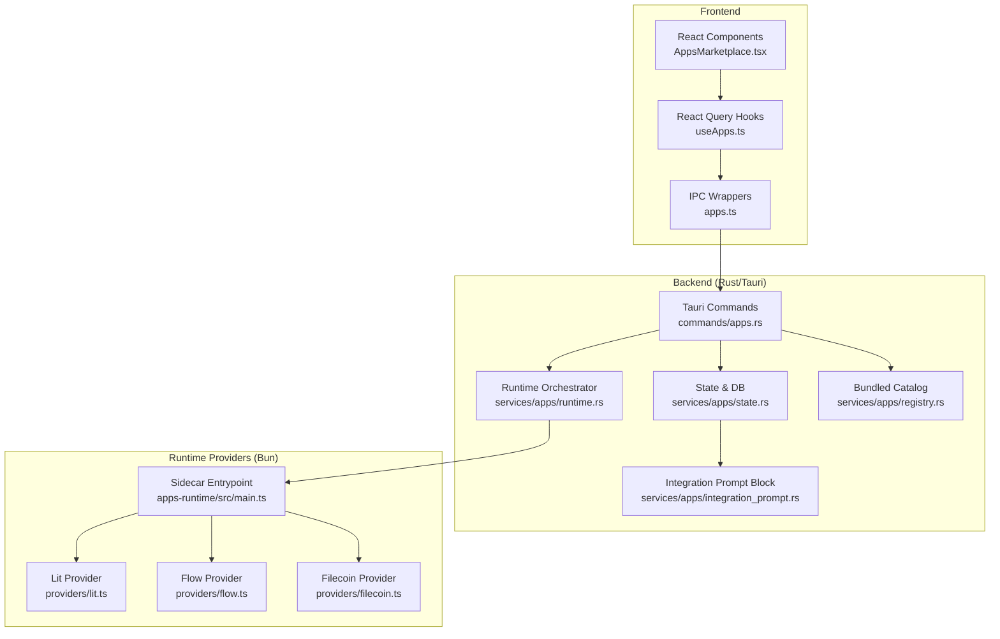
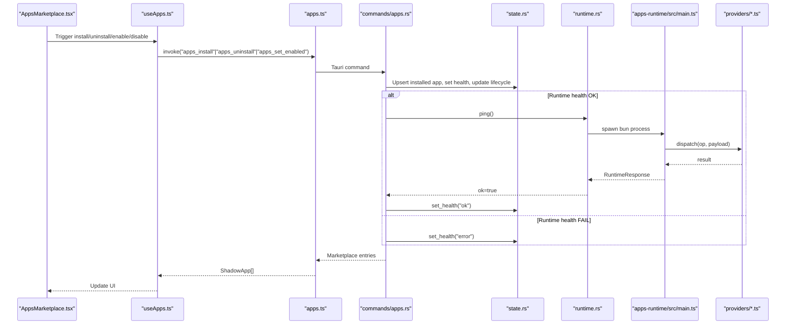
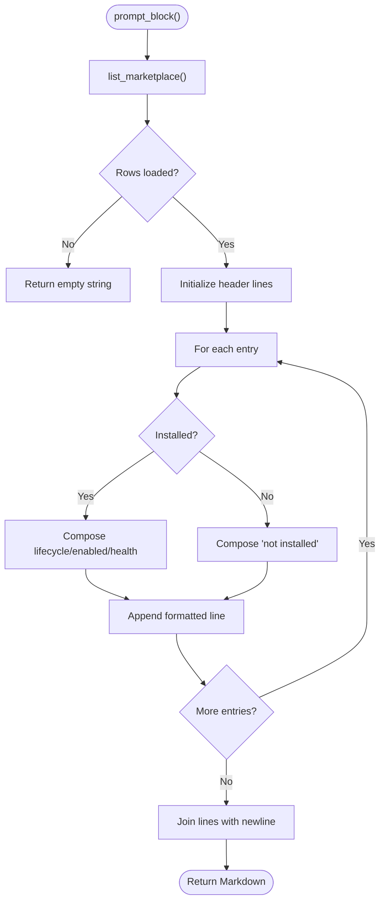
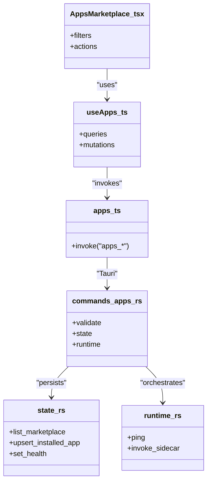
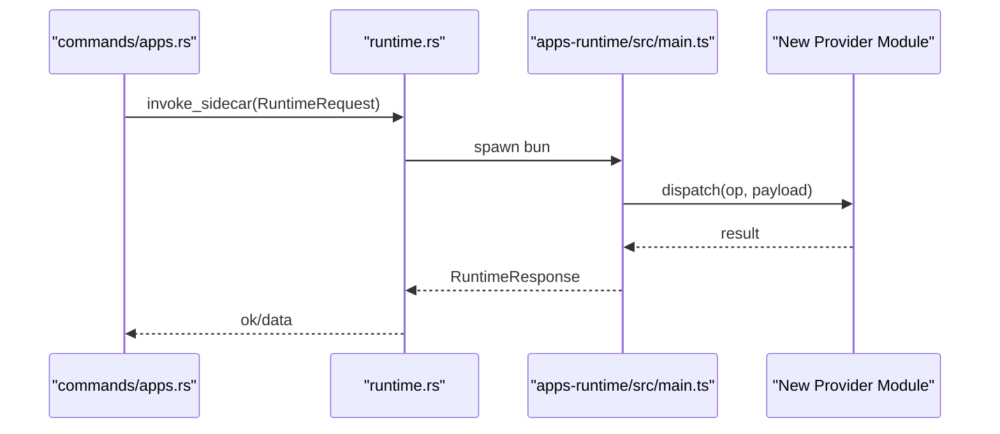
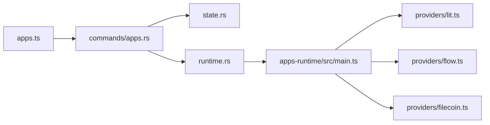

# Developer Integration Guide

<cite>
**Referenced Files in This Document**
- [integration_prompt.rs](file://src-tauri/src/services/apps/integration_prompt.rs)
- [apps.rs](file://src-tauri/src/commands/apps.rs)
- [apps.ts](file://src/lib/apps.ts)
- [apps.ts (types)](file://src/types/apps.ts)
- [state.rs](file://src-tauri/src/services/apps/state.rs)
- [runtime.rs](file://src-tauri/src/services/apps/runtime.rs)
- [registry.rs](file://src-tauri/src/services/apps/registry.rs)
- [InitializationSequence.tsx](file://src/components/onboarding/InitializationSequence.tsx)
- [AppsMarketplace.tsx](file://src/components/apps/AppsMarketplace.tsx)
- [useApps.ts](file://src/hooks/useApps.ts)
- [lit.ts](file://apps-runtime/src/providers/lit.ts)
- [flow.ts](file://apps-runtime/src/providers/flow.ts)
- [filecoin.ts](file://apps-runtime/src/providers/filecoin.ts)
- [main.ts](file://apps-runtime/src/main.ts)
</cite>

## Table of Contents
1. [Introduction](#introduction)
2. [Project Structure](#project-structure)
3. [Core Components](#core-components)
4. [Architecture Overview](#architecture-overview)
5. [Detailed Component Analysis](#detailed-component-analysis)
6. [Dependency Analysis](#dependency-analysis)
7. [Performance Considerations](#performance-considerations)
8. [Troubleshooting Guide](#troubleshooting-guide)
9. [Conclusion](#conclusion)
10. [Appendices](#appendices)

## Introduction
This guide helps developers integrate applications with SHADOW Protocol’s ecosystem. It focuses on the developer onboarding and integration process, the integration prompt system that surfaces verified integrations, the developer APIs and SDK requirements, integration patterns, packaging and manifest specifications, compatibility guidelines, testing and debugging workflows, and best practices for security, performance, and user experience. It also explains the relationship between frontend TypeScript components and backend Rust services, and how to extend the runtime provider system.

## Project Structure
SHADOW’s integration surface spans three layers:
- Frontend (TypeScript/React): UI components, hooks, and typed IPC wrappers for Tauri commands.
- Backend (Rust/Tauri): Commands, services, state persistence, and the apps runtime sidecar orchestration.
- Runtime Provider Layer (TypeScript): Pluggable adapters for protocols (Lit, Flow, Filecoin) executed inside an isolated Bun process.

**Diagram sources**
- [apps.rs:1-380](file://src-tauri/src/commands/apps.rs#L1-L380)
- [state.rs:1-458](file://src-tauri/src/services/apps/state.rs#L1-L458)
- [runtime.rs:1-144](file://src-tauri/src/services/apps/runtime.rs#L1-L144)
- [registry.rs:1-139](file://src-tauri/src/services/apps/registry.rs#L1-L139)
- [integration_prompt.rs:1-25](file://src-tauri/src/services/apps/integration_prompt.rs#L1-L25)
- [apps.ts:1-307](file://src/lib/apps.ts#L1-L307)
- [useApps.ts:1-142](file://src/hooks/useApps.ts#L1-L142)
- [AppsMarketplace.tsx:1-198](file://src/components/apps/AppsMarketplace.tsx#L1-L198)
- [lit.ts:1-382](file://apps-runtime/src/providers/lit.ts#L1-L382)
- [flow.ts:1-191](file://apps-runtime/src/providers/flow.ts#L1-L191)
- [filecoin.ts:1-264](file://apps-runtime/src/providers/filecoin.ts#L1-L264)
- [main.ts:1-309](file://apps-runtime/src/main.ts#L1-L309)

**Section sources**
- [apps.rs:1-380](file://src-tauri/src/commands/apps.rs#L1-L380)
- [apps.ts:1-307](file://src/lib/apps.ts#L1-L307)
- [apps.ts (types):1-61](file://src/types/apps.ts#L1-L61)
- [state.rs:1-458](file://src-tauri/src/services/apps/state.rs#L1-L458)
- [runtime.rs:1-144](file://src-tauri/src/services/apps/runtime.rs#L1-L144)
- [registry.rs:1-139](file://src-tauri/src/services/apps/registry.rs#L1-L139)
- [integration_prompt.rs:1-25](file://src-tauri/src/services/apps/integration_prompt.rs#L1-L25)
- [AppsMarketplace.tsx:1-198](file://src/components/apps/AppsMarketplace.tsx#L1-L198)
- [useApps.ts:1-142](file://src/hooks/useApps.ts#L1-L142)
- [lit.ts:1-382](file://apps-runtime/src/providers/lit.ts#L1-L382)
- [flow.ts:1-191](file://apps-runtime/src/providers/flow.ts#L1-L191)
- [filecoin.ts:1-264](file://apps-runtime/src/providers/filecoin.ts#L1-L264)
- [main.ts:1-309](file://apps-runtime/src/main.ts#L1-L309)

## Core Components
- Integration Prompt Block: Generates a compact Markdown block summarizing verified integrations and their installation/health status for agent prompts.
- Tauri Commands: Provide CRUD and operational APIs for the apps marketplace, lifecycle management, configuration, secrets, and runtime health.
- Frontend IPC Wrappers: Typed wrappers around Tauri commands, parsing responses and exposing convenience functions for React components.
- State Management: SQLite-backed catalog, installed apps, permissions, configs, backups, and scheduler jobs.
- Runtime Orchestrator: Spawns an isolated Bun sidecar process to execute protocol-specific providers.
- Runtime Providers: First-party adapters for Lit, Flow, and Filecoin, implementing standardized operations.
- Bundled Catalog: Seed catalog of first-party integrations with permissions, features, and agent tools.

**Section sources**
- [integration_prompt.rs:1-25](file://src-tauri/src/services/apps/integration_prompt.rs#L1-L25)
- [apps.rs:1-380](file://src-tauri/src/commands/apps.rs#L1-L380)
- [apps.ts:1-307](file://src/lib/apps.ts#L1-L307)
- [apps.ts (types):1-61](file://src/types/apps.ts#L1-L61)
- [state.rs:1-458](file://src-tauri/src/services/apps/state.rs#L1-L458)
- [runtime.rs:1-144](file://src-tauri/src/services/apps/runtime.rs#L1-L144)
- [registry.rs:1-139](file://src-tauri/src/services/apps/registry.rs#L1-L139)
- [lit.ts:1-382](file://apps-runtime/src/providers/lit.ts#L1-L382)
- [flow.ts:1-191](file://apps-runtime/src/providers/flow.ts#L1-L191)
- [filecoin.ts:1-264](file://apps-runtime/src/providers/filecoin.ts#L1-L264)

## Architecture Overview
The integration pipeline connects UI actions to Rust commands, which manage state and orchestrate the runtime sidecar. Providers encapsulate protocol-specific logic and return structured results.

**Diagram sources**
- [AppsMarketplace.tsx:1-198](file://src/components/apps/AppsMarketplace.tsx#L1-L198)
- [useApps.ts:1-142](file://src/hooks/useApps.ts#L1-L142)
- [apps.ts:1-307](file://src/lib/apps.ts#L1-L307)
- [apps.rs:1-380](file://src-tauri/src/commands/apps.rs#L1-L380)
- [state.rs:1-458](file://src-tauri/src/services/apps/state.rs#L1-L458)
- [runtime.rs:1-144](file://src-tauri/src/services/apps/runtime.rs#L1-L144)
- [main.ts:1-309](file://apps-runtime/src/main.ts#L1-L309)

## Detailed Component Analysis

### Integration Prompt System
The integration prompt block compiles a human-readable summary of verified integrations and their installation/health status. It is intended for agent system prompts to inform decisions about available tools.

**Diagram sources**
- [integration_prompt.rs:1-25](file://src-tauri/src/services/apps/integration_prompt.rs#L1-L25)
- [state.rs:88-140](file://src-tauri/src/services/apps/state.rs#L88-L140)

**Section sources**
- [integration_prompt.rs:1-25](file://src-tauri/src/services/apps/integration_prompt.rs#L1-L25)
- [state.rs:88-140](file://src-tauri/src/services/apps/state.rs#L88-L140)

### Developer APIs and SDK Requirements
- Frontend IPC wrappers expose:
  - Runtime health checks and health refresh
  - Marketplace listing and filtering
  - Install/uninstall and enable/disable integrations
  - Config retrieval and updates
  - Secret management (set/remove)
  - Protocol-specific previews (Lit, Flow)
  - Backups listing
- Backend Tauri commands implement:
  - Validation of app identifiers and secret keys
  - Permission acknowledgments and grants
  - Lifecycle transitions (installing/active/paused/disabled/error)
  - Health checks and propagation to marketplace entries
  - Runtime sidecar invocation and error handling

**Section sources**
- [apps.ts:1-307](file://src/lib/apps.ts#L1-L307)
- [apps.rs:1-380](file://src-tauri/src/commands/apps.rs#L1-L380)
- [apps.ts (types):1-61](file://src/types/apps.ts#L1-L61)

### Integration Patterns
- Install flow:
  - Validate app ID and presence in catalog
  - Mark as installing, ping runtime, grant permissions, acknowledge permissions, set enabled and health to OK
- Enable/disable:
  - Toggle enabled flag and derive lifecycle state
- Config updates:
  - Persist JSON config and trigger protocol-specific side effects (e.g., Filecoin snapshot upload)
- Secrets:
  - Enforce length and key constraints; store securely via keyring

**Section sources**
- [apps.rs:52-157](file://src-tauri/src/commands/apps.rs#L52-L157)
- [apps.rs:166-187](file://src-tauri/src/commands/apps.rs#L166-L187)
- [apps.rs:341-351](file://src-tauri/src/commands/apps.rs#L341-L351)

### App Packaging Requirements and Manifest Specifications
- Catalog seed defines:
  - Identifier, name, descriptions, icon key
  - Version, author
  - Features, permissions, secret requirements, agent tools, network scopes
- SQLite schema persists:
  - Catalog entries
  - Installed app state (lifecycle, enabled, health, timestamps)
  - Permissions granted
  - Config JSON
  - Backups and scheduler jobs

**Section sources**
- [registry.rs:21-124](file://src-tauri/src/services/apps/registry.rs#L21-L124)
- [state.rs:8-80](file://src-tauri/src/services/apps/state.rs#L8-L80)

### Compatibility Guidelines
- App IDs: lowercase alphanumeric and hyphens, length limits
- Secret keys: lowercase alphanumeric and underscores, length limits
- Runtime sidecar:
  - One request per process for crash isolation
  - Strict JSON IPC on stdin/stdout
  - Bun required; script path differs between dev and packaged builds
- Provider operations:
  - Standardized ops for each protocol (e.g., Lit, Flow, Filecoin)
  - Payloads validated and sanitized before provider invocation

**Section sources**
- [apps.rs:19-30](file://src-tauri/src/commands/apps.rs#L19-L30)
- [apps.rs:353-364](file://src-tauri/src/commands/apps.rs#L353-L364)
- [runtime.rs:49-67](file://src-tauri/src/services/apps/runtime.rs#L49-L67)
- [main.ts:44-55](file://apps-runtime/src/main.ts#L44-L55)

### Integration Testing and Debugging Workflow
- Runtime health:
  - Use backend command to ping sidecar and refresh health for all installed apps
  - Frontend exposes a “Sync integration health” action
- Logs:
  - Sidecar redirects console output to stderr to preserve stdout IPC boundaries
- Audit:
  - Commands record audit events for install/uninstall, enable/disable, config updates, and runtime health refreshes

**Section sources**
- [apps.rs:202-246](file://src-tauri/src/commands/apps.rs#L202-L246)
- [AppsMarketplace.tsx:88-98](file://src/components/apps/AppsMarketplace.tsx#L88-L98)
- [main.ts:61-66](file://apps-runtime/src/main.ts#L61-L66)

### Security Best Practices
- Secrets:
  - Enforce key and value constraints
  - Store in secure keyring; avoid logging sensitive values
- Gatekeeping:
  - Require permission acknowledgment before enabling integrations
  - Gate protocol operations behind readiness checks (e.g., Lit app readiness)
- Transport:
  - Filecoin uploads occur after local encryption; API keys are handled by providers
- Session locks:
  - Certain operations require an unlocked session

**Section sources**
- [apps.rs:10-17](file://src-tauri/src/commands/apps.rs#L10-L17)
- [apps.rs:341-351](file://src-tauri/src/commands/apps.rs#L341-L351)
- [apps.rs:257-263](file://src-tauri/src/commands/apps.rs#L257-L263)
- [state.rs:170-181](file://src-tauri/src/services/apps/state.rs#L170-L181)

### Performance Optimization
- Sidecar isolation:
  - One process per request prevents memory leaks and state cross-contamination
- Lazy provider loading:
  - Providers are imported on-demand to reduce startup overhead
- Stale-time caching:
  - Runtime health queries cache results briefly to reduce redundant calls

**Section sources**
- [runtime.rs:69-131](file://src-tauri/src/services/apps/runtime.rs#L69-L131)
- [main.ts:13-35](file://apps-runtime/src/main.ts#L13-L35)
- [useApps.ts:93-100](file://src/hooks/useApps.ts#L93-L100)

### User Experience Design
- Onboarding:
  - Streamlined steps guide users through persona, risk profile, vault, and deployment
- Marketplace:
  - Filter by installed/available, search, and sync health
  - Clear status indicators (active, inactive, updating, paused, error)
- Settings:
  - Per-app configuration panels and secret management

**Section sources**
- [InitializationSequence.tsx:1-115](file://src/components/onboarding/InitializationSequence.tsx#L1-L115)
- [AppsMarketplace.tsx:1-198](file://src/components/apps/AppsMarketplace.tsx#L1-L198)
- [apps.ts:228-307](file://src/lib/apps.ts#L228-L307)

### Relationship Between Frontend and Backend
- Frontend components trigger mutations via React Query hooks.
- IPC wrappers translate UI actions into Tauri commands.
- Backend commands coordinate state, runtime, and providers.
- Results are serialized through typed IPC structures.

**Diagram sources**
- [AppsMarketplace.tsx:1-198](file://src/components/apps/AppsMarketplace.tsx#L1-L198)
- [useApps.ts:1-142](file://src/hooks/useApps.ts#L1-L142)
- [apps.ts:1-307](file://src/lib/apps.ts#L1-L307)
- [apps.rs:1-380](file://src-tauri/src/commands/apps.rs#L1-L380)
- [state.rs:88-140](file://src-tauri/src/services/apps/state.rs#L88-L140)
- [runtime.rs:133-143](file://src-tauri/src/services/apps/runtime.rs#L133-L143)

### Extending the Runtime Provider System
To add a new protocol adapter:
- Implement a provider class/module with standardized methods (e.g., connectivity check, read/write operations).
- Add a new operation case in the sidecar dispatcher.
- Update the bundled catalog and permissions as needed.
- Expose a frontend preview or configuration UI as appropriate.

**Diagram sources**
- [runtime.rs:69-131](file://src-tauri/src/services/apps/runtime.rs#L69-L131)
- [main.ts:102-306](file://apps-runtime/src/main.ts#L102-L306)

**Section sources**
- [main.ts:1-309](file://apps-runtime/src/main.ts#L1-L309)
- [registry.rs:1-139](file://src-tauri/src/services/apps/registry.rs#L1-L139)

## Dependency Analysis
The system exhibits clear separation of concerns:
- Frontend depends on typed IPC wrappers and React Query.
- Backend commands depend on state, runtime, and registry.
- Runtime orchestrator depends on sidecar entrypoint and providers.
- Providers depend on external SDKs and are lazily loaded.

**Diagram sources**
- [apps.ts:1-307](file://src/lib/apps.ts#L1-L307)
- [apps.rs:1-380](file://src-tauri/src/commands/apps.rs#L1-L380)
- [state.rs:1-458](file://src-tauri/src/services/apps/state.rs#L1-L458)
- [runtime.rs:1-144](file://src-tauri/src/services/apps/runtime.rs#L1-L144)
- [main.ts:1-309](file://apps-runtime/src/main.ts#L1-L309)
- [lit.ts:1-382](file://apps-runtime/src/providers/lit.ts#L1-L382)
- [flow.ts:1-191](file://apps-runtime/src/providers/flow.ts#L1-L191)
- [filecoin.ts:1-264](file://apps-runtime/src/providers/filecoin.ts#L1-L264)

**Section sources**
- [apps.ts:1-307](file://src/lib/apps.ts#L1-L307)
- [apps.rs:1-380](file://src-tauri/src/commands/apps.rs#L1-L380)
- [state.rs:1-458](file://src-tauri/src/services/apps/state.rs#L1-L458)
- [runtime.rs:1-144](file://src-tauri/src/services/apps/runtime.rs#L1-L144)
- [main.ts:1-309](file://apps-runtime/src/main.ts#L1-L309)

## Performance Considerations
- Use lazy provider loading to minimize cold-start impact.
- Cache runtime health queries briefly to reduce repeated sidecar invocations.
- Keep IPC payloads minimal and structured to reduce serialization overhead.
- Ensure sidecar processes are short-lived and dropped promptly.

## Troubleshooting Guide
Common issues and remedies:
- Runtime unreachable:
  - Verify Bun is installed and sidecar script exists in the expected location (dev vs packaged).
  - Use the “Sync integration health” action to refresh statuses.
- Permission errors:
  - Ensure permission acknowledgment is checked during install.
  - Confirm app is enabled and lifecycle is active.
- Secret validation failures:
  - Keys must meet length and character constraints; values must be within size limits.
- Protocol-specific errors:
  - Review provider logs redirected to stderr.
  - Confirm API keys and network settings are correct.

**Section sources**
- [apps.rs:76-94](file://src-tauri/src/commands/apps.rs#L76-L94)
- [apps.rs:19-30](file://src-tauri/src/commands/apps.rs#L19-L30)
- [apps.rs:353-364](file://src-tauri/src/commands/apps.rs#L353-L364)
- [runtime.rs:49-67](file://src-tauri/src/services/apps/runtime.rs#L49-L67)
- [AppsMarketplace.tsx:88-98](file://src/components/apps/AppsMarketplace.tsx#L88-L98)
- [main.ts:61-66](file://apps-runtime/src/main.ts#L61-L66)

## Conclusion
SHADOW’s integration framework provides a robust, secure, and extensible pathway for developers to onboard applications into the ecosystem. By leveraging typed IPC, a modular runtime provider system, and a curated catalog of first-party integrations, teams can deliver seamless experiences for agents and users while maintaining strong security and performance characteristics.

## Appendices

### Step-by-Step Tutorials

- Install an integration
  - Call the install command with the app identifier and permission acknowledgment.
  - Observe lifecycle transitioning to installing, then active upon successful runtime health.
  - Confirm permissions are granted and health is set to OK.

- Configure an integration
  - Retrieve current config, merge changes, and persist via the config setter.
  - For Filecoin, changes may trigger snapshot upload.

- Manage secrets
  - Set or remove secrets with validated keys and values.
  - Ensure session is unlocked before modifying secrets.

- Preview protocol status
  - Use protocol-specific preview calls (e.g., Lit wallet status, Flow account status).

- Refresh health
  - Trigger a health refresh to update all installed integrations’ statuses.

**Section sources**
- [apps.rs:52-109](file://src-tauri/src/commands/apps.rs#L52-L109)
- [apps.rs:166-187](file://src-tauri/src/commands/apps.rs#L166-L187)
- [apps.rs:341-351](file://src-tauri/src/commands/apps.rs#L341-L351)
- [apps.ts:26-45](file://src/lib/apps.ts#L26-L45)
- [apps.ts:228-269](file://src/lib/apps.ts#L228-L269)