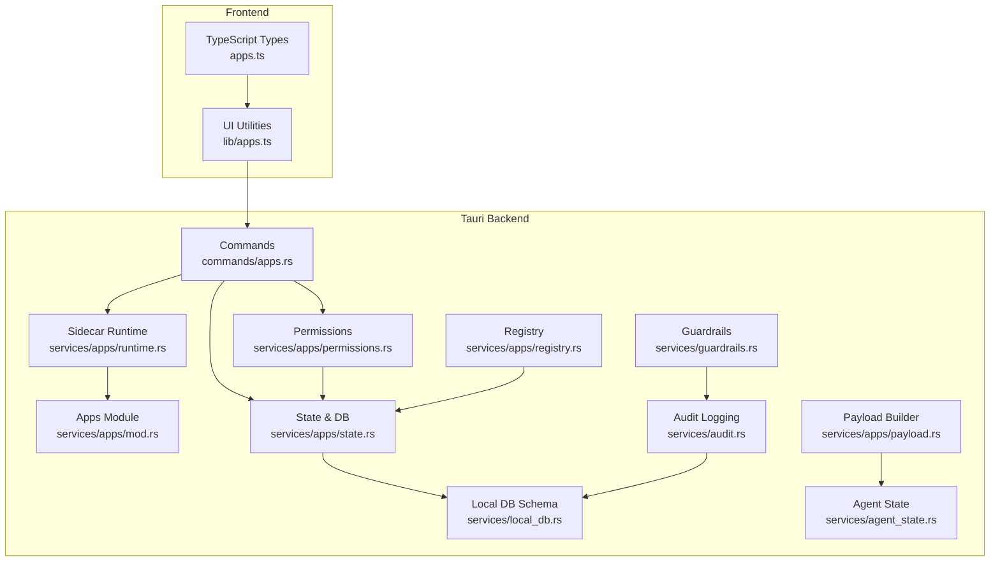
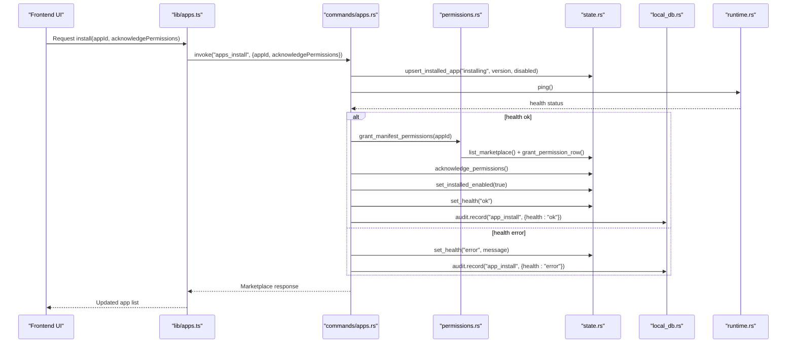
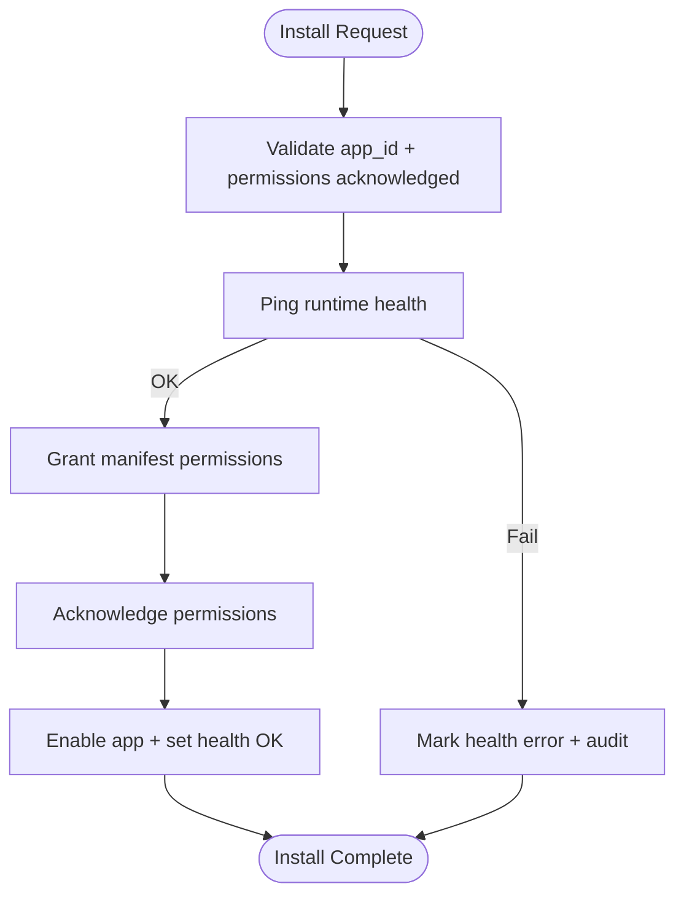
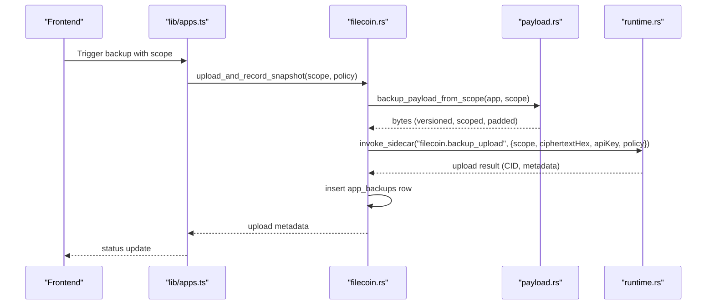
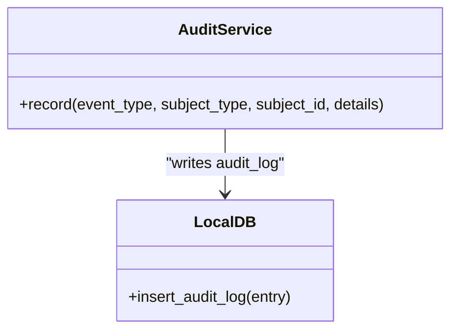
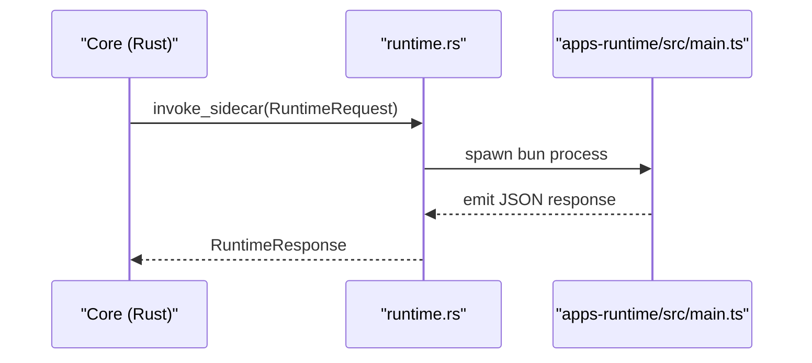
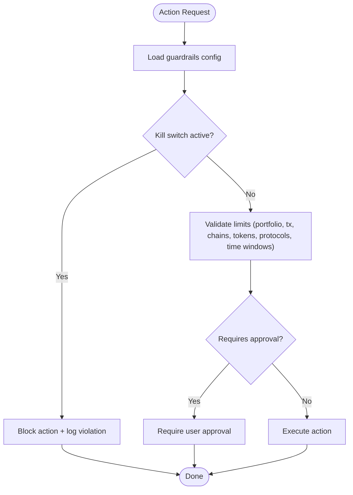
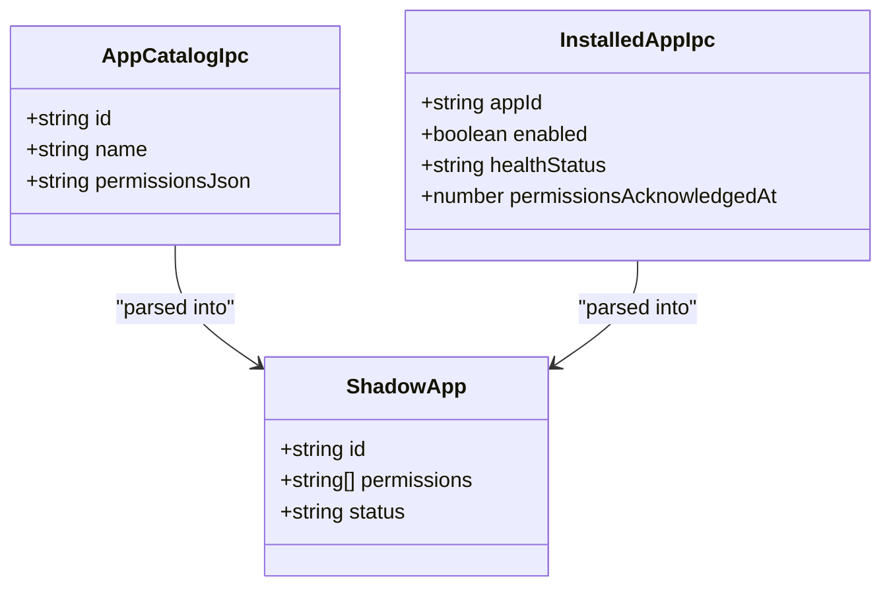
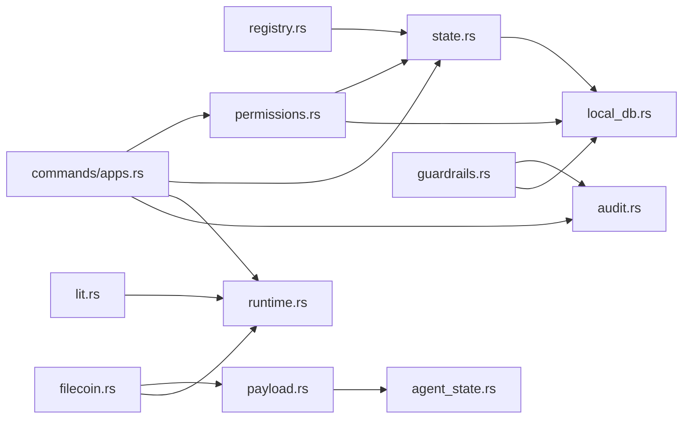

# Permission & Security Management

<cite>
**Referenced Files in This Document**
- [permissions.rs](file://src-tauri/src/services/apps/permissions.rs)
- [payload.rs](file://src-tauri/src/services/apps/payload.rs)
- [state.rs](file://src-tauri/src/services/apps/state.rs)
- [registry.rs](file://src-tauri/src/services/apps/registry.rs)
- [local_db.rs](file://src-tauri/src/services/local_db.rs)
- [audit.rs](file://src-tauri/src/services/audit.rs)
- [apps.ts](file://src/types/apps.ts)
- [apps.ts (lib)](file://src/lib/apps.ts)
- [apps.rs (commands)](file://src-tauri/src/commands/apps.rs)
- [runtime.rs](file://src-tauri/src/services/apps/runtime.rs)
- [lit.rs](file://src-tauri/src/services/apps/lit.rs)
- [filecoin.rs](file://src-tauri/src/services/apps/filecoin.rs)
- [guardrails.rs](file://src-tauri/src/services/guardrails.rs)
- [agent_state.rs](file://src-tauri/src/services/agent_state.rs)
</cite>

## Table of Contents
1. [Introduction](#introduction)
2. [Project Structure](#project-structure)
3. [Core Components](#core-components)
4. [Architecture Overview](#architecture-overview)
5. [Detailed Component Analysis](#detailed-component-analysis)
6. [Dependency Analysis](#dependency-analysis)
7. [Performance Considerations](#performance-considerations)
8. [Troubleshooting Guide](#troubleshooting-guide)
9. [Conclusion](#conclusion)

## Introduction
This document describes the permission and security management system for SHADOW’s application sandboxing and access control. It covers how applications declare permissions at install time, how users review and approve them, and how the system enforces security boundaries at runtime. It also documents the payload system for secure data exchange, the permission model (read/write and blockchain interaction), audit logging, and compliance features. Finally, it explains the TypeScript interfaces for app permissions and how they integrate with SHADOW’s broader security framework.

## Project Structure
The security and permission system spans Rust backend services, Tauri commands, and TypeScript front-end types and utilities. The key areas are:
- Application marketplace and catalog (registry and state)
- Permission management (manifest parsing, grants, runtime checks)
- Secure payload building and exchange
- Audit logging and compliance
- Runtime sandboxing via a sidecar process
- Guardrails for autonomous actions

**Diagram sources**
- [apps.rs (commands):1-380](file://src-tauri/src/commands/apps.rs#L1-L380)
- [permissions.rs:1-53](file://src-tauri/src/services/apps/permissions.rs#L1-L53)
- [state.rs:1-458](file://src-tauri/src/services/apps/state.rs#L1-L458)
- [registry.rs:1-139](file://src-tauri/src/services/apps/registry.rs#L1-L139)
- [payload.rs:1-101](file://src-tauri/src/services/apps/payload.rs#L1-L101)
- [runtime.rs:1-144](file://src-tauri/src/services/apps/runtime.rs#L1-L144)
- [audit.rs:1-25](file://src-tauri/src/services/audit.rs#L1-L25)
- [local_db.rs:1-800](file://src-tauri/src/services/local_db.rs#L1-L800)
- [guardrails.rs:1-620](file://src-tauri/src/services/guardrails.rs#L1-L620)
- [agent_state.rs:1-104](file://src-tauri/src/services/agent_state.rs#L1-L104)
- [apps.ts:1-61](file://src/types/apps.ts#L1-L61)
- [apps.ts (lib):1-307](file://src/lib/apps.ts#L1-L307)

**Section sources**
- [apps.rs (commands):1-380](file://src-tauri/src/commands/apps.rs#L1-L380)
- [permissions.rs:1-53](file://src-tauri/src/services/apps/permissions.rs#L1-L53)
- [state.rs:1-458](file://src-tauri/src/services/apps/state.rs#L1-L458)
- [registry.rs:1-139](file://src-tauri/src/services/apps/registry.rs#L1-L139)
- [payload.rs:1-101](file://src-tauri/src/services/apps/payload.rs#L1-L101)
- [runtime.rs:1-144](file://src-tauri/src/services/apps/runtime.rs#L1-L144)
- [audit.rs:1-25](file://src-tauri/src/services/audit.rs#L1-L25)
- [local_db.rs:1-800](file://src-tauri/src/services/local_db.rs#L1-L800)
- [guardrails.rs:1-620](file://src-tauri/src/services/guardrails.rs#L1-L620)
- [agent_state.rs:1-104](file://src-tauri/src/services/agent_state.rs#L1-L104)
- [apps.ts:1-61](file://src/types/apps.ts#L1-L61)
- [apps.ts (lib):1-307](file://src/lib/apps.ts#L1-L307)

## Core Components
- Permission model and enforcement:
  - Manifest-based permission declaration in the catalog
  - Granting permissions at install time
  - Runtime checks against granted permissions
- Secure payload system:
  - Build encrypted snapshot payloads locally
  - Optional padding and versioning for compatibility
- Audit logging and compliance:
  - Structured audit log entries for all sensitive events
- Runtime sandboxing:
  - Sidecar process isolation for third-party integrations
- Guardrails:
  - User-configurable constraints for autonomous actions
- TypeScript interfaces:
  - Strongly typed app catalogs, installed state, and UI-facing rows

**Section sources**
- [permissions.rs:1-53](file://src-tauri/src/services/apps/permissions.rs#L1-L53)
- [payload.rs:1-101](file://src-tauri/src/services/apps/payload.rs#L1-L101)
- [audit.rs:1-25](file://src-tauri/src/services/audit.rs#L1-L25)
- [runtime.rs:1-144](file://src-tauri/src/services/apps/runtime.rs#L1-L144)
- [guardrails.rs:1-620](file://src-tauri/src/services/guardrails.rs#L1-L620)
- [apps.ts:1-61](file://src/types/apps.ts#L1-L61)
- [apps.ts (lib):1-307](file://src/lib/apps.ts#L1-L307)

## Architecture Overview
The system separates concerns across layers:
- Frontend types and utilities define the shape of app metadata and UI rows.
- Tauri commands orchestrate installation, configuration, and runtime health checks.
- Permissions and state services manage catalog, grants, and runtime readiness.
- Payload builder constructs encrypted snapshots for Filecoin backups.
- Audit logs capture all security-relevant events.
- Guardrails enforce constraints on autonomous actions.
- Runtime sandboxing isolates third-party integrations in a sidecar.

**Diagram sources**
- [apps.rs (commands):52-109](file://src-tauri/src/commands/apps.rs#L52-L109)
- [permissions.rs:27-33](file://src-tauri/src/services/apps/permissions.rs#L27-L33)
- [state.rs:183-250](file://src-tauri/src/services/apps/state.rs#L183-L250)
- [local_db.rs:169-178](file://src-tauri/src/services/local_db.rs#L169-L178)
- [runtime.rs:133-143](file://src-tauri/src/services/apps/runtime.rs#L133-L143)

**Section sources**
- [apps.rs (commands):52-109](file://src-tauri/src/commands/apps.rs#L52-L109)
- [permissions.rs:27-33](file://src-tauri/src/services/apps/permissions.rs#L27-L33)
- [state.rs:183-250](file://src-tauri/src/services/apps/state.rs#L183-L250)
- [local_db.rs:169-178](file://src-tauri/src/services/local_db.rs#L169-L178)
- [runtime.rs:133-143](file://src-tauri/src/services/apps/runtime.rs#L133-L143)

## Detailed Component Analysis

### Permission Model and Enforcement
- Install-time:
  - The catalog declares permissions as a JSON array.
  - On install, the system validates the app ID, ensures permissions were acknowledged, and grants the manifest-defined permissions.
  - The app is marked as active and enabled, and health is set to OK.
- Runtime:
  - Before executing privileged operations, the system asserts that required permissions are granted.
  - Human-friendly labels are available for UI presentation.

**Diagram sources**
- [apps.rs (commands):52-109](file://src-tauri/src/commands/apps.rs#L52-L109)
- [permissions.rs:27-33](file://src-tauri/src/services/apps/permissions.rs#L27-L33)
- [state.rs:240-249](file://src-tauri/src/services/apps/state.rs#L240-L249)

**Section sources**
- [apps.rs (commands):52-109](file://src-tauri/src/commands/apps.rs#L52-L109)
- [permissions.rs:10-43](file://src-tauri/src/services/apps/permissions.rs#L10-L43)
- [state.rs:240-249](file://src-tauri/src/services/apps/state.rs#L240-L249)

### Secure Payload System (Filecoin Backups)
- The payload builder constructs a snapshot with:
  - Version field for compatibility
  - Scope flags controlling included data (agent memory, persona, configs, strategies)
  - Encryption note indicating local sealing
  - Optional padding to meet minimum sizes
- The resulting payload is hex-encoded and uploaded via the Filecoin sidecar adapter, which handles API keys and upload metadata.

**Diagram sources**
- [filecoin.rs:166-196](file://src-tauri/src/services/apps/filecoin.rs#L166-L196)
- [payload.rs:14-90](file://src-tauri/src/services/apps/payload.rs#L14-L90)
- [runtime.rs:69-131](file://src-tauri/src/services/apps/runtime.rs#L69-L131)

**Section sources**
- [payload.rs:1-101](file://src-tauri/src/services/apps/payload.rs#L1-L101)
- [filecoin.rs:99-196](file://src-tauri/src/services/apps/filecoin.rs#L99-L196)

### Audit Logging and Compliance
- The audit service records structured events with timestamps, subjects, and serialized details.
- Events include app lifecycle, configuration updates, guardrail changes, and restore operations.
- The local DB schema includes an audit_log table with indexed fields for efficient querying.

**Diagram sources**
- [audit.rs:5-24](file://src-tauri/src/services/audit.rs#L5-L24)
- [local_db.rs:169-178](file://src-tauri/src/services/local_db.rs#L169-L178)

**Section sources**
- [audit.rs:1-25](file://src-tauri/src/services/audit.rs#L1-L25)
- [local_db.rs:169-178](file://src-tauri/src/services/local_db.rs#L169-L178)

### Runtime Sandboxing and Access Control
- Third-party integrations run inside a sidecar process managed by the runtime service.
- The runtime spawns a new process per request and enforces timeouts and response parsing.
- Integration adapters (e.g., Lit, Filecoin) delegate operations to the sidecar with typed requests and payloads.

**Diagram sources**
- [runtime.rs:69-143](file://src-tauri/src/services/apps/runtime.rs#L69-L143)

**Section sources**
- [runtime.rs:1-144](file://src-tauri/src/services/apps/runtime.rs#L1-L144)
- [lit.rs:17-89](file://src-tauri/src/services/apps/lit.rs#L17-L89)
- [filecoin.rs:99-131](file://src-tauri/src/services/apps/filecoin.rs#L99-L131)

### Guardrails and Sensitive Operation Approvals
- Guardrails provide user-configurable constraints for autonomous actions (e.g., spend limits, allowed chains, time windows).
- Validation occurs before execution; violations are logged and can require user approval.
- Kill switch blocks all autonomous actions when activated.

**Diagram sources**
- [guardrails.rs:278-426](file://src-tauri/src/services/guardrails.rs#L278-L426)
- [audit.rs:5-24](file://src-tauri/src/services/audit.rs#L5-L24)

**Section sources**
- [guardrails.rs:1-620](file://src-tauri/src/services/guardrails.rs#L1-L620)

### TypeScript Interfaces for App Permissions
- Frontend types define:
  - App catalog fields (including permissions JSON)
  - Installed app state
  - UI-facing app row with permissions and status
- Utilities convert backend responses to UI-ready structures and handle configuration parsing.

**Diagram sources**
- [apps.ts:3-60](file://src/types/apps.ts#L3-L60)
- [apps.ts (lib):187-226](file://src/lib/apps.ts#L187-L226)

**Section sources**
- [apps.ts:1-61](file://src/types/apps.ts#L1-L61)
- [apps.ts (lib):187-226](file://src/lib/apps.ts#L187-L226)

## Dependency Analysis
The permission and security system relies on several key dependencies:
- Catalog and state depend on the local DB schema for persisted app metadata, permissions, and backups.
- Runtime adapters depend on the sidecar runtime for sandboxed execution.
- Audit logging depends on the local DB audit_log table.
- Guardrails depend on user configuration and write violations to the DB and audit log.

**Diagram sources**
- [registry.rs:82-124](file://src-tauri/src/services/apps/registry.rs#L82-L124)
- [state.rs:251-288](file://src-tauri/src/services/apps/state.rs#L251-L288)
- [local_db.rs:221-292](file://src-tauri/src/services/local_db.rs#L221-L292)
- [permissions.rs:1-53](file://src-tauri/src/services/apps/permissions.rs#L1-L53)
- [payload.rs:1-101](file://src-tauri/src/services/apps/payload.rs#L1-L101)
- [agent_state.rs:1-104](file://src-tauri/src/services/agent_state.rs#L1-L104)
- [filecoin.rs:1-266](file://src-tauri/src/services/apps/filecoin.rs#L1-L266)
- [lit.rs:1-151](file://src-tauri/src/services/apps/lit.rs#L1-L151)
- [runtime.rs:1-144](file://src-tauri/src/services/apps/runtime.rs#L1-L144)
- [apps.rs (commands):1-380](file://src-tauri/src/commands/apps.rs#L1-L380)
- [audit.rs:1-25](file://src-tauri/src/services/audit.rs#L1-L25)
- [guardrails.rs:1-620](file://src-tauri/src/services/guardrails.rs#L1-L620)

**Section sources**
- [registry.rs:1-139](file://src-tauri/src/services/apps/registry.rs#L1-L139)
- [state.rs:1-458](file://src-tauri/src/services/apps/state.rs#L1-L458)
- [local_db.rs:1-800](file://src-tauri/src/services/local_db.rs#L1-L800)
- [permissions.rs:1-53](file://src-tauri/src/services/apps/permissions.rs#L1-L53)
- [payload.rs:1-101](file://src-tauri/src/services/apps/payload.rs#L1-L101)
- [agent_state.rs:1-104](file://src-tauri/src/services/agent_state.rs#L1-L104)
- [filecoin.rs:1-266](file://src-tauri/src/services/apps/filecoin.rs#L1-L266)
- [lit.rs:1-151](file://src-tauri/src/services/apps/lit.rs#L1-L151)
- [runtime.rs:1-144](file://src-tauri/src/services/apps/runtime.rs#L1-L144)
- [apps.rs (commands):1-380](file://src-tauri/src/commands/apps.rs#L1-L380)
- [audit.rs:1-25](file://src-tauri/src/services/audit.rs#L1-L25)
- [guardrails.rs:1-620](file://src-tauri/src/services/guardrails.rs#L1-L620)

## Performance Considerations
- Permission checks are lightweight database queries against granted permissions and the marketplace catalog.
- Payload building performs minimal JSON parsing and optional padding; keep scope flags concise to reduce overhead.
- Runtime sidecar invocations are bounded by timeouts; avoid long-running operations in adapters.
- Guardrail validation is CPU-light; caching or precomputing derived values can help if extended to spend tracking.

## Troubleshooting Guide
- Install fails due to missing permission acknowledgment:
  - Ensure the frontend passes the required flag during install.
  - Verify the catalog entry exists and contains a valid permissions JSON array.
- Runtime health check fails:
  - Confirm the sidecar script exists and Bun is installed.
  - Review audit logs for “app_install” events with health error details.
- Permission denied at runtime:
  - Check that the app is enabled and active, and that permissions were acknowledged.
  - Verify the required permission IDs are present in the granted list.
- Guardrail violation:
  - Adjust user configuration or request approval depending on thresholds.
  - Inspect guardrail violations and audit logs for reasons and timestamps.
- Filecoin backup upload failures:
  - Ensure the Filecoin API key is set and the app is enabled.
  - Confirm the sidecar responded with a CID and metadata; inspect upload status and notes.

**Section sources**
- [apps.rs (commands):52-109](file://src-tauri/src/commands/apps.rs#L52-L109)
- [runtime.rs:133-143](file://src-tauri/src/services/apps/runtime.rs#L133-L143)
- [permissions.rs:35-43](file://src-tauri/src/services/apps/permissions.rs#L35-L43)
- [state.rs:170-181](file://src-tauri/src/services/apps/state.rs#L170-L181)
- [guardrails.rs:484-519](file://src-tauri/src/services/guardrails.rs#L484-L519)
- [filecoin.rs:166-196](file://src-tauri/src/services/apps/filecoin.rs#L166-L196)

## Conclusion
SHADOW’s permission and security management system establishes strong boundaries between the core system and third-party applications. Permissions are declared in the catalog, granted at install time, and enforced at runtime. Secure payload construction and sidecar-based sandboxing isolate integrations while enabling controlled access to blockchain networks. Audit logging and guardrails provide transparency and safety for autonomous actions. Together, these components form a robust foundation for application sandboxing and access control aligned with SHADOW’s broader security framework.