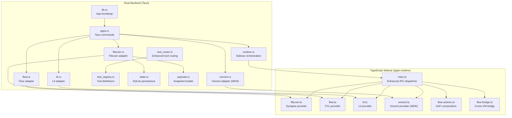
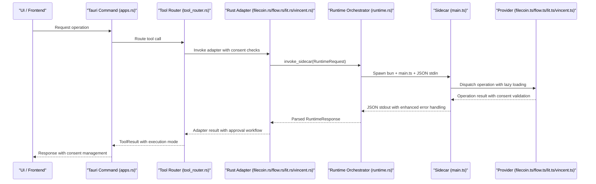
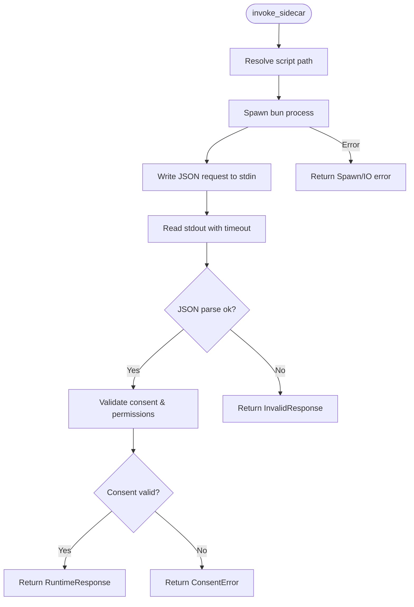
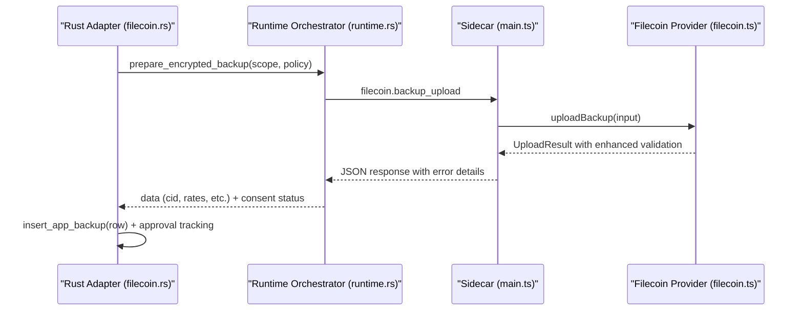
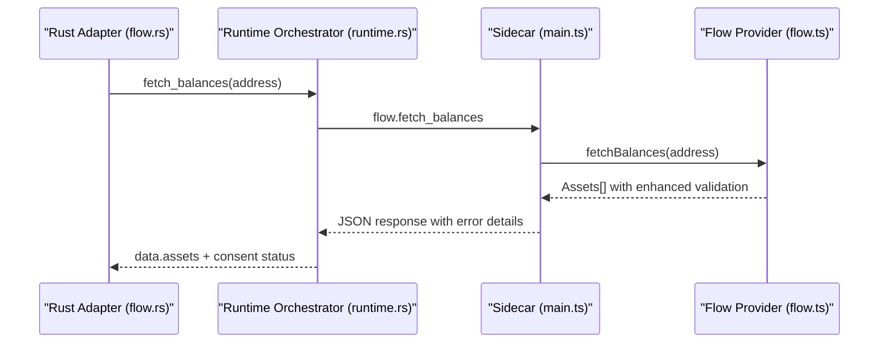
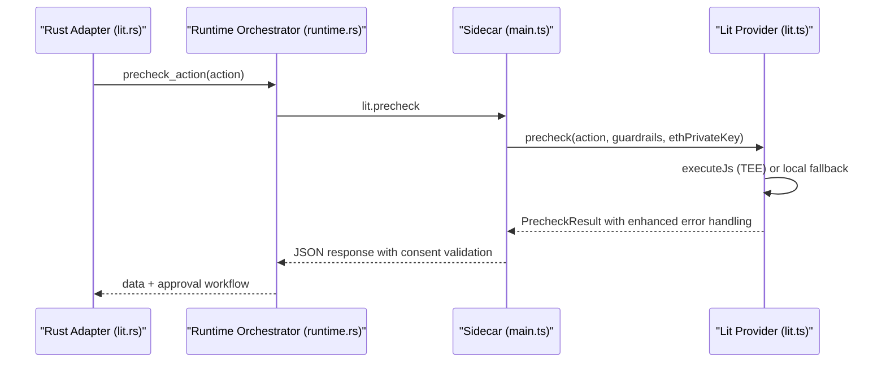
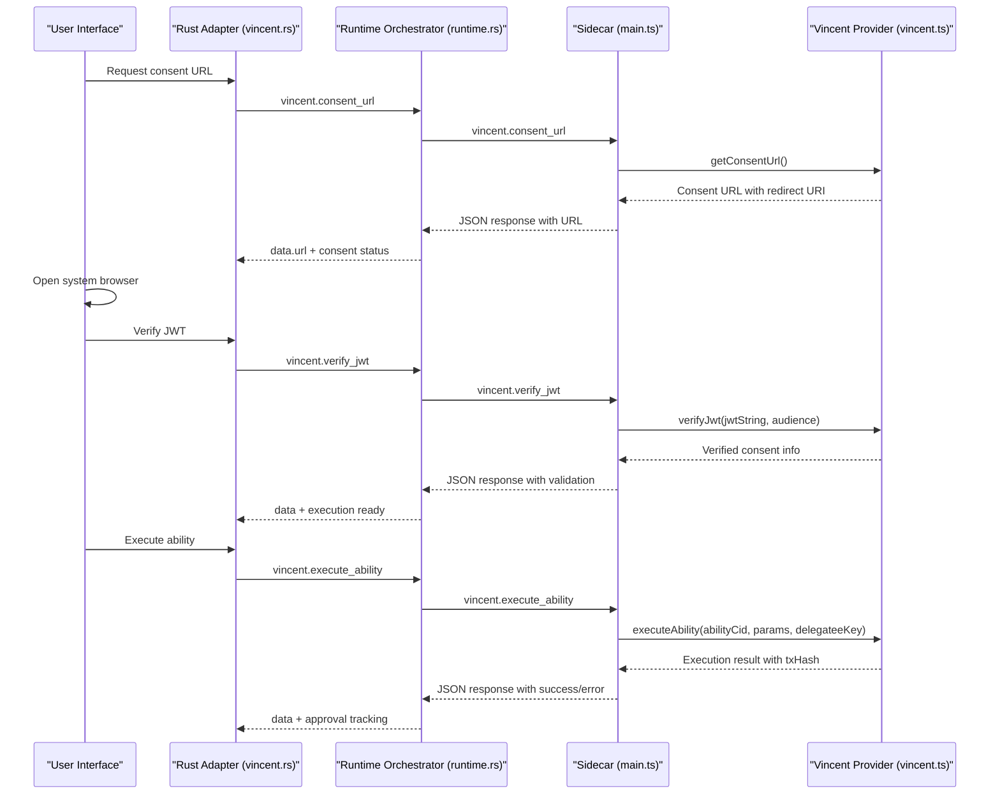
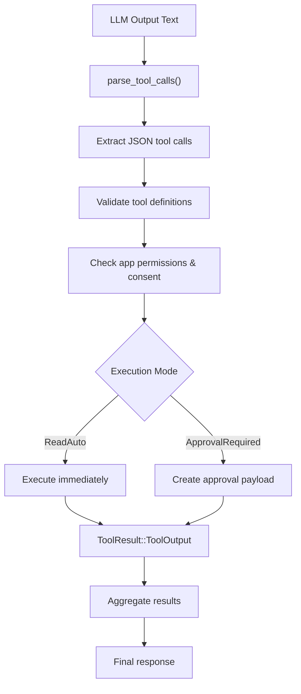
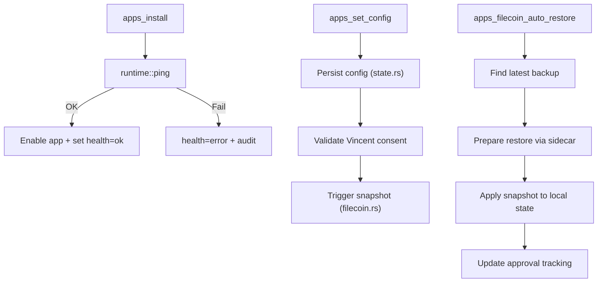
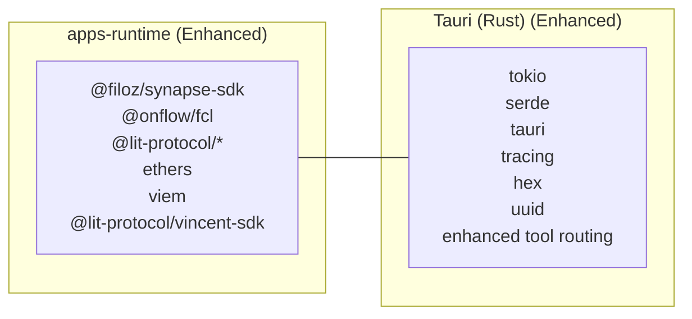

# Runtime Providers

<cite>
**Referenced Files in This Document**
- [runtime.rs](file://src-tauri/src/services/apps/runtime.rs)
- [filecoin.rs](file://src-tauri/src/services/apps/filecoin.rs)
- [flow.rs](file://src-tauri/src/services/apps/flow.rs)
- [lit.rs](file://src-tauri/src/services/apps/lit.rs)
- [main.ts](file://apps-runtime/src/main.ts)
- [filecoin.ts](file://apps-runtime/src/providers/filecoin.ts)
- [flow.ts](file://apps-runtime/src/providers/flow.ts)
- [lit.ts](file://apps-runtime/src/providers/lit.ts)
- [vincent.ts](file://apps-runtime/src/providers/vincent.ts)
- [flow-actions.ts](file://apps-runtime/src/providers/flow-actions.ts)
- [flow-bridge.ts](file://apps-runtime/src/providers/flow-bridge.ts)
- [tool_router.rs](file://src-tauri/src/services/tool_router.rs)
- [tool_registry.rs](file://src-tauri/src/services/tool_registry.rs)
- [lib.rs](file://src-tauri/src/lib.rs)
- [apps.rs](file://src-tauri/src/commands/apps.rs)
- [state.rs](file://src-tauri/src/services/apps/state.rs)
- [payload.rs](file://src-tauri/src/services/apps/payload.rs)
- [package.json](file://apps-runtime/package.json)
- [package.json](file://package.json)
</cite>

## Update Summary
**Changes Made**
- Added comprehensive Vincent DeFi protocol provider with delegated execution and consent management
- Enhanced Flow provider ecosystem with specialized action composition, bridge previews, and network utilities
- Improved tool routing system with better JSON parsing and execution modes
- Expanded provider lifecycle management with consent-based authorization flows
- Added new Flow Actions preview system for DeFi composition planning

## Table of Contents
1. [Introduction](#introduction)
2. [Project Structure](#project-structure)
3. [Core Components](#core-components)
4. [Architecture Overview](#architecture-overview)
5. [Detailed Component Analysis](#detailed-component-analysis)
6. [Dependency Analysis](#dependency-analysis)
7. [Performance Considerations](#performance-considerations)
8. [Troubleshooting Guide](#troubleshooting-guide)
9. [Conclusion](#conclusion)

## Introduction
This document explains SHADOW Protocol's enhanced runtime provider system that integrates multiple blockchains and protocols through a unified orchestration layer. The system now includes comprehensive support for Filecoin storage, Flow blockchain connectivity, Lit Protocol security, and the emerging Vincent DeFi protocol for delegated execution. It focuses on how the Rust backend spawns a TypeScript sidecar to manage providers with enhanced consent management, improved tool routing, and sophisticated DeFi composition capabilities.

## Project Structure
The enhanced runtime provider system spans three primary areas:
- Rust backend services under src-tauri that orchestrate and persist state, invoke the sidecar, and manage tool routing
- TypeScript sidecar under apps-runtime that implements provider-specific logic with enhanced Vincent integration and improved error handling
- Centralized tool registry and routing system for intelligent agent execution

**Diagram sources**
- [runtime.rs:1-144](file://src-tauri/src/services/apps/runtime.rs#L1-L144)
- [filecoin.rs:1-266](file://src-tauri/src/services/apps/filecoin.rs#L1-L266)
- [flow.rs:1-106](file://src-tauri/src/services/apps/flow.rs#L1-L106)
- [lit.rs:1-151](file://src-tauri/src/services/apps/lit.rs#L1-L151)
- [vincent.ts:1-361](file://apps-runtime/src/providers/vincent.ts#L1-L361)
- [tool_router.rs:1-1012](file://src-tauri/src/services/tool_router.rs#L1-L1012)
- [tool_registry.rs:1-34](file://src-tauri/src/services/tool_registry.rs#L1-L34)
- [state.rs:1-458](file://src-tauri/src/services/apps/state.rs#L1-L458)
- [payload.rs:1-101](file://src-tauri/src/services/apps/payload.rs#L1-L101)
- [apps.rs:1-380](file://src-tauri/src/commands/apps.rs#L1-L380)
- [lib.rs:34-89](file://src-tauri/src/lib.rs#L34-L89)
- [main.ts:1-654](file://apps-runtime/src/main.ts#L1-L654)
- [filecoin.ts:1-264](file://apps-runtime/src/providers/filecoin.ts#L1-L264)
- [flow.ts:1-188](file://apps-runtime/src/providers/flow.ts#L1-L188)
- [lit.ts:1-382](file://apps-runtime/src/providers/lit.ts#L1-L382)
- [flow-actions.ts:1-80](file://apps-runtime/src/providers/flow-actions.ts#L1-L80)
- [flow-bridge.ts:1-36](file://apps-runtime/src/providers/flow-bridge.ts#L1-L36)

**Section sources**
- [runtime.rs:1-144](file://src-tauri/src/services/apps/runtime.rs#L1-L144)
- [main.ts:1-654](file://apps-runtime/src/main.ts#L1-L654)

## Core Components
- **Enhanced Rust sidecar orchestrator**: Spawns a fresh Bun process per request, streams JSON over stdin/stdout, enforces timeouts, and parses structured responses with improved error handling
- **Comprehensive TypeScript sidecar**: Implements provider operations with enhanced Vincent integration, lazy-loads providers, and responds with standardized JSON including consent management
- **Expanded provider abstractions**:
  - **Filecoin**: Upload snapshots, fetch previews, cost quoting, dataset lifecycle
  - **Flow**: Account status, balances, sponsored transaction preparation, DeFi action composition, bridge previews
  - **Lit**: Wallet status, connectivity check, PKP minting, precheck, and distributed MPC signing
  - **Vincent**: Delegated DeFi execution with consent JWT management, ability verification, and on-chain policy enforcement
- **Enhanced tool routing**: Intelligent JSON parsing, execution mode detection, and approval workflow management
- **Centralized tool registry**: Structured tool definitions with execution modes and permission requirements
- **Persistence and scheduling**: SQLite-backed app catalog, configs, backups, and scheduler jobs

**Section sources**
- [runtime.rs:69-144](file://src-tauri/src/services/apps/runtime.rs#L69-L144)
- [main.ts:102-654](file://apps-runtime/src/main.ts#L102-L654)
- [vincent.ts:1-361](file://apps-runtime/src/providers/vincent.ts#L1-L361)
- [tool_router.rs:1-1012](file://src-tauri/src/services/tool_router.rs#L1-L1012)
- [tool_registry.rs:1-34](file://src-tauri/src/services/tool_registry.rs#L1-L34)
- [state.rs:1-458](file://src-tauri/src/services/apps/state.rs#L1-L458)

## Architecture Overview
The enhanced system uses a strict IPC boundary with improved error handling and consent management:
- Rust invokes a sidecar process per operation with enhanced JSON request formatting
- Sidecar executes the matching provider operation with lazy loading and returns structured responses
- Enhanced tool routing system manages approval workflows and execution modes
- Consent-based delegation enables Vincent protocol for enhanced DeFi operations

**Diagram sources**
- [runtime.rs:69-131](file://src-tauri/src/services/apps/runtime.rs#L69-L131)
- [tool_router.rs:100-160](file://src-tauri/src/services/tool_router.rs#L100-L160)
- [filecoin.rs:99-131](file://src-tauri/src/services/apps/filecoin.rs#L99-L131)
- [flow.rs:7-72](file://src-tauri/src/services/apps/flow.rs#L7-L72)
- [lit.rs:17-89](file://src-tauri/src/services/apps/lit.rs#L17-L89)
- [vincent.ts:127-361](file://apps-runtime/src/providers/vincent.ts#L127-L361)
- [main.ts:68-100](file://apps-runtime/src/main.ts#L68-L100)
- [filecoin.ts:145-242](file://apps-runtime/src/providers/filecoin.ts#L145-L242)
- [flow.ts:39-49](file://apps-runtime/src/providers/flow.ts#L39-L49)
- [lit.ts:164-178](file://apps-runtime/src/providers/lit.ts#L164-L178)

## Detailed Component Analysis

### Enhanced Rust Runtime Orchestrator
- **Responsibilities**:
  - Resolve sidecar script path (development vs packaged)
  - Spawn Bun process per request with piped stdin/stdout/stderr
  - Enforce a 45-second timeout and parse the first JSON line from stdout
  - Return structured errors mapped to typed variants with enhanced error reporting
- **Safety Enhancements**:
  - Kill-on-drop ensures orphan processes are terminated
  - Strict JSON parsing prevents malformed output from corrupting IPC
  - Enhanced error handling for consent validation failures

**Diagram sources**
- [runtime.rs:49-131](file://src-tauri/src/services/apps/runtime.rs#L49-L131)

**Section sources**
- [runtime.rs:1-144](file://src-tauri/src/services/apps/runtime.rs#L1-L144)

### Enhanced Filecoin Storage Provider
- **Implemented in TypeScript using Synapse SDK**:
  - Upload backup: validates payload size, computes costs, applies optional cost cap, uploads with metadata, and returns structured results
  - Restore preview: downloads ciphertext from Filecoin DSN via Synapse
  - Cost quoting and dataset management: prepares storage, lists datasets, terminates datasets
- **Rust adapter enhancements**:
  - Builds snapshot payload from scope, encrypts locally, invokes sidecar upload, records backup row, and supports automatic snapshots and restores
  - Enhanced error handling for network failures and storage validation

**Diagram sources**
- [filecoin.rs:99-196](file://src-tauri/src/services/apps/filecoin.rs#L99-L196)
- [runtime.rs:69-131](file://src-tauri/src/services/apps/runtime.rs#L69-L131)
- [main.ts:204-237](file://apps-runtime/src/main.ts#L204-L237)
- [filecoin.ts:145-242](file://apps-runtime/src/providers/filecoin.ts#L145-L242)

**Section sources**
- [filecoin.ts:43-264](file://apps-runtime/src/providers/filecoin.ts#L43-L264)
- [filecoin.rs:99-266](file://src-tauri/src/services/apps/filecoin.rs#L99-L266)

### Enhanced Flow Blockchain Provider
- **Expanded TypeScript implementation using @onflow/fcl**:
  - **Account status**: returns connection state and network
  - **Balances**: validates address format, queries Flow REST API, normalizes balances
  - **Sponsored transaction preparation**: returns prepared cadence preview and sponsor note
  - **Enhanced transaction management**: comprehensive fee estimation, scheduling, cancellation, and status monitoring
  - **DeFi composition**: specialized action builders for DCA, rebalancing, and flash loans
  - **Cross-VM bridging**: preview system for Flow EVM token transfers
- **Rust adapter enhancements**:
  - Wraps calls with session key, logs, and structured error propagation
  - Enhanced permission checking for new Flow operations

**Diagram sources**
- [flow.rs:38-72](file://src-tauri/src/services/apps/flow.rs#L38-L72)
- [runtime.rs:69-131](file://src-tauri/src/services/apps/runtime.rs#L69-L131)
- [main.ts:180-197](file://apps-runtime/src/main.ts#L180-L197)
- [flow.ts:65-131](file://apps-runtime/src/providers/flow.ts#L65-L131)

**Section sources**
- [flow.ts:18-188](file://apps-runtime/src/providers/flow.ts#L18-L188)
- [flow.rs:1-106](file://src-tauri/src/services/apps/flow.rs#L1-L106)

### Enhanced Lit Protocol Provider
- **Comprehensive TypeScript implementation using @lit-protocol clients**:
  - **Wallet status**: returns mode, PKP address, guardrails, and enforcement layer
  - **Connectivity check**: quick network readiness probe
  - **Mint PKP**: authenticates via EthWallet and mints a Public Key Policy (PKP)
  - **Precheck**: executes decentralized policy via Lit Actions (TEE) with local fallback
  - **Execute**: distributed MPC signing via PKP
- **Rust adapter enhancements**:
  - Delegates operations to sidecar with minimal payload shaping
  - Enhanced integration with Vincent consent system

**Diagram sources**
- [lit.rs:68-89](file://src-tauri/src/services/apps/lit.rs#L68-L89)
- [runtime.rs:69-131](file://src-tauri/src/services/apps/runtime.rs#L69-L131)
- [main.ts:133-148](file://apps-runtime/src/main.ts#L133-L148)
- [lit.ts:185-246](file://apps-runtime/src/providers/lit.ts#L185-L246)

**Section sources**
- [lit.ts:108-382](file://apps-runtime/src/providers/lit.ts#L108-L382)
- [lit.rs:1-151](file://src-tauri/src/services/apps/lit.rs#L1-L151)

### New Vincent DeFi Protocol Provider
- **Comprehensive TypeScript implementation using @lit-protocol/vincent-sdk**:
  - **Consent management**: JWT verification, expiration checking, and user authorization flows
  - **Delegated execution**: Ability-based DeFi operations with on-chain policy enforcement
  - **Configuration management**: Dynamic app ID, delegatee key, and ability CID management
  - **Wallet status**: PKP wallet monitoring with consent validation
  - **Local policy enforcement**: Pre-execution guardrail checking
- **Architecture**:
  - Desktop Tauri integration with system browser opening for consent
  - JWT decoding with validation against expected audiences
  - Delegatee signer integration for on-chain transaction execution
  - Ability CID resolution for common DeFi operations

**Diagram sources**
- [vincent.ts:127-361](file://apps-runtime/src/providers/vincent.ts#L127-L361)
- [main.ts:516-601](file://apps-runtime/src/main.ts#L516-L601)
- [runtime.rs:69-131](file://src-tauri/src/services/apps/runtime.rs#L69-L131)

**Section sources**
- [vincent.ts:1-361](file://apps-runtime/src/providers/vincent.ts#L1-L361)

### Enhanced Tool Routing System
- **Improved JSON parsing**: Robust extraction of tool calls from LLM output with bracket counting
- **Execution modes**: Clear distinction between immediate execution and approval-required operations
- **Permission gating**: Integration with app-specific permissions and consent validation
- **Approval workflows**: Structured approval payloads with detailed execution context
- **Multi-wallet support**: Enhanced handling of multiple wallet addresses and contexts

**Diagram sources**
- [tool_router.rs:25-62](file://src-tauri/src/services/tool_router.rs#L25-L62)
- [tool_router.rs:100-160](file://src-tauri/src/services/tool_router.rs#L100-L160)
- [tool_registry.rs:18-34](file://src-tauri/src/services/tool_registry.rs#L18-L34)

**Section sources**
- [tool_router.rs:1-1012](file://src-tauri/src/services/tool_router.rs#L1-L1012)
- [tool_registry.rs:1-34](file://src-tauri/src/services/tool_registry.rs#L1-L34)

### Enhanced Provider Lifecycle Management
- **Installation and health**:
  - Tauri command installs apps, performs runtime health check, grants permissions, and updates health status
  - Enhanced consent validation for Vincent integration
- **Configuration and secrets**:
  - App configs are persisted in SQLite; secrets are stored securely and injected into sidecar requests
  - Dynamic configuration updates for Vincent ability CIDs and delegatee keys
- **Scheduling and automation**:
  - Backup snapshots are built from scoped data, uploaded via sidecar, and recorded in SQLite
  - Automatic restore triggers on startup and can be invoked manually
  - Enhanced job scheduling with permission validation

**Diagram sources**
- [apps.rs:52-109](file://src-tauri/src/commands/apps.rs#L52-L109)
- [runtime.rs:133-143](file://src-tauri/src/services/apps/runtime.rs#L133-L143)
- [state.rs:170-181](file://src-tauri/src/services/apps/state.rs#L170-L181)
- [filecoin.rs:222-238](file://src-tauri/src/services/apps/filecoin.rs#L222-L238)
- [filecoin.rs:329-331](file://src-tauri/src/services/apps/filecoin.rs#L329-L331)

**Section sources**
- [apps.rs:1-380](file://src-tauri/src/commands/apps.rs#L1-L380)
- [state.rs:1-458](file://src-tauri/src/services/apps/state.rs#L1-L458)
- [payload.rs:1-101](file://src-tauri/src/services/apps/payload.rs#L1-L101)
- [filecoin.rs:1-266](file://src-tauri/src/services/apps/filecoin.rs#L1-L266)

## Dependency Analysis
- **Enhanced TypeScript dependencies (apps-runtime)**:
  - @filoz/synapse-sdk, viem, @onflow/fcl, @lit-protocol/*, ethers
  - @lit-protocol/vincent-sdk for DeFi delegation
- **Enhanced Rust dependencies (Tauri)**:
  - Tokio for async IO, serde for JSON, tauri for IPC, tracing for logging, hex for encoding, uuid for identifiers
  - Enhanced tool routing and consent management libraries
- **Interop improvements**:
  - Sidecar uses Bun to execute TypeScript modules lazily, minimizing cold-start overhead for rarely-used providers
  - Enhanced JSON parsing reduces false positives in tool call extraction

**Diagram sources**
- [package.json:12-21](file://apps-runtime/package.json#L12-L21)
- [package.json:18-36](file://package.json#L18-L36)

**Section sources**
- [package.json:1-22](file://apps-runtime/package.json#L1-L22)
- [package.json:1-55](file://package.json#L1-L55)

## Performance Considerations
- **Enhanced crash isolation**: One sidecar process per request ensures failures do not impact the host application
- **Improved timeouts**: 45-second read timeout prevents stalled sidecars from blocking the backend
- **Lazy loading enhancements**: Providers are imported only when needed, with enhanced error handling for missing dependencies
- **Payload size optimization**: Snapshots are padded to a minimum size to satisfy protocol requirements; consider compression for large payloads
- **Network resilience**: Providers implement retry/backoff for transient network errors with enhanced logging
- **Consent caching**: Vincent consent validation results are cached to reduce repeated JWT verification overhead
- **Tool routing efficiency**: Optimized JSON parsing reduces false positive tool call detection

## Troubleshooting Guide
**Enhanced Common Issues and Remedies**:
- **Sidecar not found or not executable**:
  - Verify Bun installation and script path resolution in development vs packaged builds
- **Enhanced provider errors**:
  - Inspect sidecar stderr (redirected from console) for detailed messages
  - For Filecoin, confirm cost cap and payload size constraints
  - For Flow, validate address format and network selection
  - For Lit, check connectivity and session key availability
  - For Vincent, verify JWT format, expiration, and consent validation
- **Consent management issues**:
  - Ensure Vincent app ID and delegatee key are properly configured
  - Verify JWT audience matches expected redirect URI
  - Check ability CID registration on Vincent dashboard
- **Tool routing failures**:
  - Verify tool definitions in central registry
  - Check app permissions and consent requirements
  - Validate JSON formatting in LLM outputs

**Enhanced Operational Checks**:
- Runtime health: [apps_runtime_health:202-207](file://src-tauri/src/commands/apps.rs#L202-L207)
- Refresh health: [apps_refresh_health:209-246](file://src-tauri/src/commands/apps.rs#L209-L246)
- Filecoin restore: [apps_filecoin_auto_restore:328-331](file://src-tauri/src/commands/apps.rs#L328-L331)
- **New Vincent operations**:
  - Consent URL generation: [vincent.consent_url:533-543](file://apps-runtime/src/main.ts#L533-L543)
  - JWT verification: [vincent.verify_jwt:545-562](file://apps-runtime/src/main.ts#L545-L562)
  - Ability execution: [vincent.execute_ability:581-601](file://apps-runtime/src/main.ts#L581-L601)

**Section sources**
- [runtime.rs:13-26](file://src-tauri/src/services/apps/runtime.rs#L13-L26)
- [apps.rs:202-246](file://src-tauri/src/commands/apps.rs#L202-L246)
- [filecoin.ts:173-193](file://apps-runtime/src/providers/filecoin.ts#L173-L193)
- [flow.ts:65-131](file://apps-runtime/src/providers/flow.ts#L65-L131)
- [lit.ts:358-378](file://apps-runtime/src/providers/lit.ts#L358-L378)
- [vincent.ts:145-236](file://apps-runtime/src/providers/vincent.ts#L145-L236)

## Conclusion
SHADOW's enhanced runtime provider system provides a comprehensive foundation for multi-chain agent operations with significant improvements in DeFi delegation, consent management, and tool routing. The addition of Vincent protocol support enables sophisticated delegated execution with on-chain policy enforcement, while enhanced Flow provider capabilities offer powerful DeFi composition and bridging tools. The centralized tool registry and improved routing system ensure intelligent agent execution with proper permission gating and approval workflows. The sidecar architecture maintains safety, scalability, and maintainability across all integrated protocols while providing robust health monitoring and configuration management.