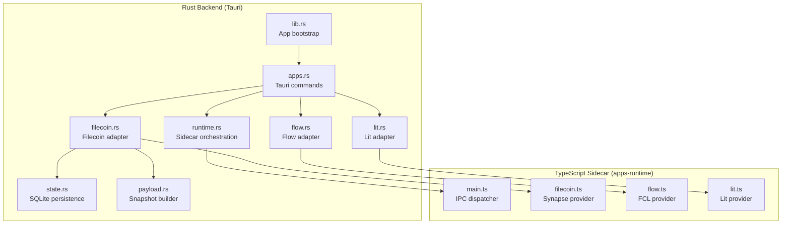
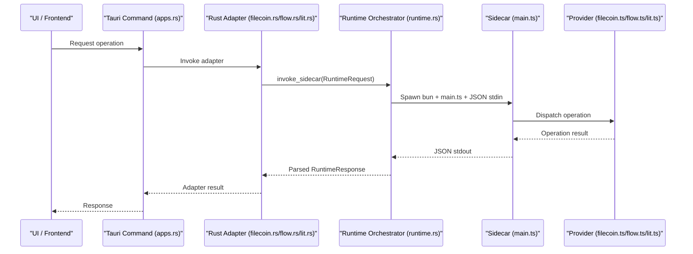
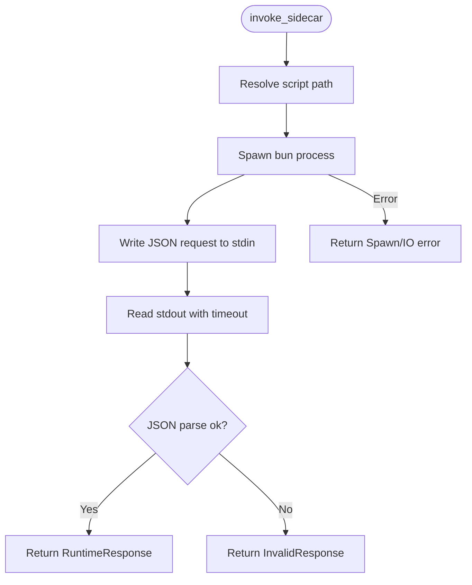
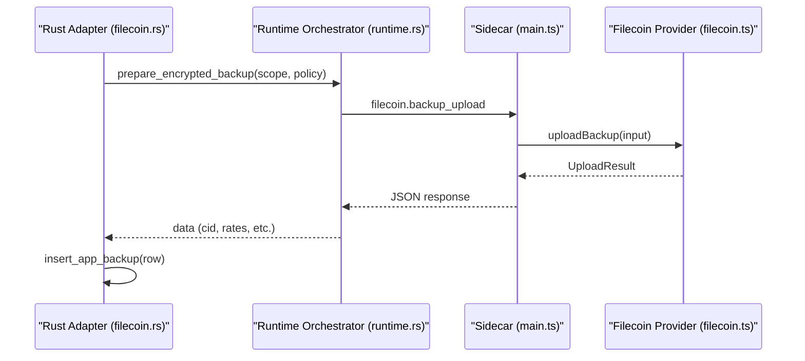
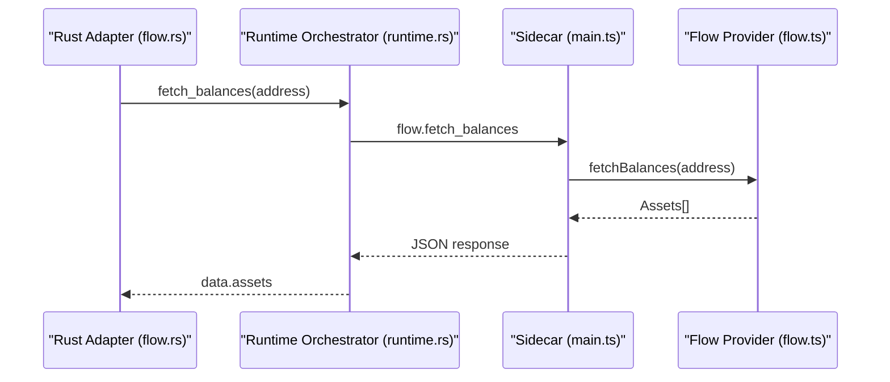
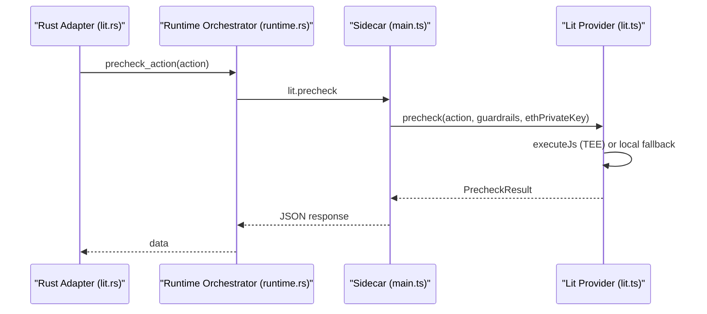
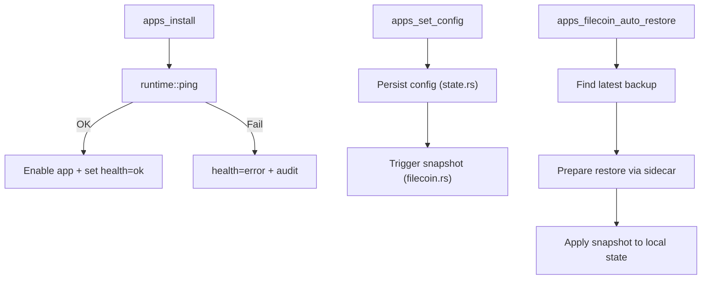
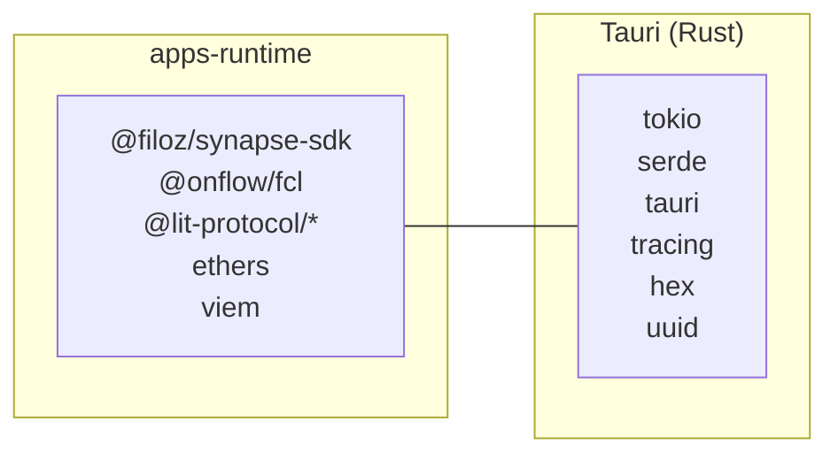

# Runtime Providers

<cite>
**Referenced Files in This Document**
- [runtime.rs](file://src-tauri/src/services/apps/runtime.rs)
- [filecoin.rs](file://src-tauri/src/services/apps/filecoin.rs)
- [flow.rs](file://src-tauri/src/services/apps/flow.rs)
- [lit.rs](file://src-tauri/src/services/apps/lit.rs)
- [main.ts](file://apps-runtime/src/main.ts)
- [filecoin.ts](file://apps-runtime/src/providers/filecoin.ts)
- [flow.ts](file://apps-runtime/src/providers/flow.ts)
- [lit.ts](file://apps-runtime/src/providers/lit.ts)
- [lib.rs](file://src-tauri/src/lib.rs)
- [apps.rs](file://src-tauri/src/commands/apps.rs)
- [state.rs](file://src-tauri/src/services/apps/state.rs)
- [payload.rs](file://src-tauri/src/services/apps/payload.rs)
- [package.json](file://apps-runtime/package.json)
- [package.json](file://package.json)
</cite>

## Table of Contents
1. [Introduction](#introduction)
2. [Project Structure](#project-structure)
3. [Core Components](#core-components)
4. [Architecture Overview](#architecture-overview)
5. [Detailed Component Analysis](#detailed-component-analysis)
6. [Dependency Analysis](#dependency-analysis)
7. [Performance Considerations](#performance-considerations)
8. [Troubleshooting Guide](#troubleshooting-guide)
9. [Conclusion](#conclusion)

## Introduction
This document explains SHADOW Protocol’s runtime provider system that integrates multiple blockchains and protocols through a unified orchestration layer. It focuses on how the Rust backend spawns a TypeScript sidecar to manage providers for Filecoin storage, Flow blockchain connectivity, and Lit Protocol security. The system emphasizes secure, crash-isolated execution, robust error handling, and health monitoring across providers.

## Project Structure
The runtime provider system spans two primary areas:
- Rust backend services under src-tauri that orchestrate and persist state, and invoke the sidecar.
- TypeScript sidecar under apps-runtime that implements provider-specific logic and exposes a JSON-line IPC protocol.

**Diagram sources**
- [runtime.rs:1-144](file://src-tauri/src/services/apps/runtime.rs#L1-L144)
- [filecoin.rs:1-266](file://src-tauri/src/services/apps/filecoin.rs#L1-L266)
- [flow.rs:1-106](file://src-tauri/src/services/apps/flow.rs#L1-L106)
- [lit.rs:1-151](file://src-tauri/src/services/apps/lit.rs#L1-L151)
- [state.rs:1-458](file://src-tauri/src/services/apps/state.rs#L1-L458)
- [payload.rs:1-101](file://src-tauri/src/services/apps/payload.rs#L1-L101)
- [apps.rs:1-380](file://src-tauri/src/commands/apps.rs#L1-L380)
- [lib.rs:34-89](file://src-tauri/src/lib.rs#L34-L89)
- [main.ts:1-304](file://apps-runtime/src/main.ts#L1-L304)
- [filecoin.ts:1-264](file://apps-runtime/src/providers/filecoin.ts#L1-L264)
- [flow.ts:1-188](file://apps-runtime/src/providers/flow.ts#L1-L188)
- [lit.ts:1-382](file://apps-runtime/src/providers/lit.ts#L1-L382)

**Section sources**
- [runtime.rs:1-144](file://src-tauri/src/services/apps/runtime.rs#L1-L144)
- [main.ts:1-304](file://apps-runtime/src/main.ts#L1-L304)

## Core Components
- Rust sidecar orchestrator: Spawns a fresh Bun process per request, streams JSON over stdin/stdout, enforces timeouts, and parses structured responses.
- TypeScript sidecar: Implements provider operations (Filecoin upload/restore, Flow balances, Lit precheck/sign), lazy-loads providers, and responds with standardized JSON.
- Provider abstractions:
  - Filecoin: Upload snapshots, fetch previews, cost quoting, dataset lifecycle.
  - Flow: Account status, balances, sponsored transaction preparation.
  - Lit: Wallet status, connectivity check, PKP minting, precheck, and distributed MPC signing.
- Persistence and scheduling: SQLite-backed app catalog, configs, backups, and scheduler jobs.

**Section sources**
- [runtime.rs:69-144](file://src-tauri/src/services/apps/runtime.rs#L69-L144)
- [main.ts:102-301](file://apps-runtime/src/main.ts#L102-L301)
- [filecoin.ts:43-64](file://apps-runtime/src/providers/filecoin.ts#L43-L64)
- [flow.ts:18-22](file://apps-runtime/src/providers/flow.ts#L18-L22)
- [lit.ts:108-178](file://apps-runtime/src/providers/lit.ts#L108-L178)
- [state.rs:1-458](file://src-tauri/src/services/apps/state.rs#L1-L458)

## Architecture Overview
The system uses a strict IPC boundary:
- Rust invokes a sidecar process per operation with a JSON request.
- Sidecar executes the matching provider operation and writes a single JSON response to stdout.
- Rust reads and parses the response, returning structured results or errors to Tauri commands.

**Diagram sources**
- [runtime.rs:69-131](file://src-tauri/src/services/apps/runtime.rs#L69-L131)
- [filecoin.rs:99-131](file://src-tauri/src/services/apps/filecoin.rs#L99-L131)
- [flow.rs:7-72](file://src-tauri/src/services/apps/flow.rs#L7-L72)
- [lit.rs:17-89](file://src-tauri/src/services/apps/lit.rs#L17-L89)
- [main.ts:68-100](file://apps-runtime/src/main.ts#L68-L100)
- [filecoin.ts:145-242](file://apps-runtime/src/providers/filecoin.ts#L145-L242)
- [flow.ts:39-49](file://apps-runtime/src/providers/flow.ts#L39-L49)
- [lit.ts:164-178](file://apps-runtime/src/providers/lit.ts#L164-L178)

## Detailed Component Analysis

### Rust Runtime Orchestrator
- Responsibilities:
  - Resolve sidecar script path (development vs packaged).
  - Spawn Bun process per request with piped stdin/stdout/stderr.
  - Enforce a 45-second timeout and parse the first JSON line from stdout.
  - Return structured errors mapped to typed variants.
- Safety:
  - Kill-on-drop ensures orphan processes are terminated.
  - Strict JSON parsing prevents malformed output from corrupting IPC.

**Diagram sources**
- [runtime.rs:49-131](file://src-tauri/src/services/apps/runtime.rs#L49-L131)

**Section sources**
- [runtime.rs:1-144](file://src-tauri/src/services/apps/runtime.rs#L1-L144)

### Filecoin Storage Provider
- Implemented in TypeScript using Synapse SDK:
  - Upload backup: validates payload size, computes costs, applies optional cost cap, uploads with metadata, and returns structured results.
  - Restore preview: downloads ciphertext from Filecoin DSN via Synapse.
  - Cost quoting and dataset management: prepares storage, lists datasets, terminates datasets.
- Rust adapter:
  - Builds snapshot payload from scope, encrypts locally, invokes sidecar upload, records backup row, and supports automatic snapshots and restores.

**Diagram sources**
- [filecoin.rs:99-196](file://src-tauri/src/services/apps/filecoin.rs#L99-L196)
- [runtime.rs:69-131](file://src-tauri/src/services/apps/runtime.rs#L69-L131)
- [main.ts:204-237](file://apps-runtime/src/main.ts#L204-L237)
- [filecoin.ts:145-242](file://apps-runtime/src/providers/filecoin.ts#L145-L242)

**Section sources**
- [filecoin.ts:43-264](file://apps-runtime/src/providers/filecoin.ts#L43-L264)
- [filecoin.rs:99-266](file://src-tauri/src/services/apps/filecoin.rs#L99-L266)

### Flow Blockchain Provider
- Implemented in TypeScript using @onflow/fcl:
  - Account status: returns connection state and network.
  - Balances: validates address format, queries Flow REST API, normalizes balances.
  - Sponsored transaction preparation: returns prepared cadence preview and sponsor note.
- Rust adapter:
  - Wraps calls with session key, logs, and structured error propagation.

**Diagram sources**
- [flow.rs:38-72](file://src-tauri/src/services/apps/flow.rs#L38-L72)
- [runtime.rs:69-131](file://src-tauri/src/services/apps/runtime.rs#L69-L131)
- [main.ts:180-197](file://apps-runtime/src/main.ts#L180-L197)
- [flow.ts:65-131](file://apps-runtime/src/providers/flow.ts#L65-L131)

**Section sources**
- [flow.ts:18-188](file://apps-runtime/src/providers/flow.ts#L18-L188)
- [flow.rs:1-106](file://src-tauri/src/services/apps/flow.rs#L1-L106)

### Lit Protocol Provider
- Implemented in TypeScript using @lit-protocol clients:
  - Wallet status: returns mode, PKP address, guardrails, and enforcement layer.
  - Connectivity check: quick network readiness probe.
  - Mint PKP: authenticates via EthWallet and mints a Public Key Policy (PKP).
  - Precheck: executes decentralized policy via Lit Actions (TEE) with local fallback.
  - Execute: distributed MPC signing via PKP.
- Rust adapter:
  - Delegates operations to sidecar with minimal payload shaping.

**Diagram sources**
- [lit.rs:68-89](file://src-tauri/src/services/apps/lit.rs#L68-L89)
- [runtime.rs:69-131](file://src-tauri/src/services/apps/runtime.rs#L69-L131)
- [main.ts:133-148](file://apps-runtime/src/main.ts#L133-L148)
- [lit.ts:185-246](file://apps-runtime/src/providers/lit.ts#L185-L246)

**Section sources**
- [lit.ts:108-382](file://apps-runtime/src/providers/lit.ts#L108-L382)
- [lit.rs:1-151](file://src-tauri/src/services/apps/lit.rs#L1-L151)

### Provider Lifecycle Management
- Installation and health:
  - Tauri command installs apps, performs runtime health check, grants permissions, and updates health status.
- Configuration and secrets:
  - App configs are persisted in SQLite; secrets are stored securely and injected into sidecar requests.
- Scheduling and automation:
  - Backup snapshots are built from scoped data, uploaded via sidecar, and recorded in SQLite.
  - Automatic restore triggers on startup and can be invoked manually.

**Diagram sources**
- [apps.rs:52-109](file://src-tauri/src/commands/apps.rs#L52-L109)
- [runtime.rs:133-143](file://src-tauri/src/services/apps/runtime.rs#L133-L143)
- [state.rs:170-181](file://src-tauri/src/services/apps/state.rs#L170-L181)
- [filecoin.rs:222-238](file://src-tauri/src/services/apps/filecoin.rs#L222-L238)
- [filecoin.rs:329-331](file://src-tauri/src/services/apps/filecoin.rs#L329-L331)

**Section sources**
- [apps.rs:1-380](file://src-tauri/src/commands/apps.rs#L1-L380)
- [state.rs:1-458](file://src-tauri/src/services/apps/state.rs#L1-L458)
- [payload.rs:1-101](file://src-tauri/src/services/apps/payload.rs#L1-L101)
- [filecoin.rs:1-266](file://src-tauri/src/services/apps/filecoin.rs#L1-L266)

## Dependency Analysis
- TypeScript dependencies (apps-runtime):
  - @filoz/synapse-sdk, viem, @onflow/fcl, @lit-protocol/*, ethers.
- Rust dependencies (Tauri):
  - Tokio for async IO, serde for JSON, tauri for IPC, tracing for logging, hex for encoding, uuid for identifiers.
- Interop:
  - Sidecar uses Bun to execute TypeScript modules lazily, minimizing cold-start overhead for rarely-used providers.

**Diagram sources**
- [package.json:12-21](file://apps-runtime/package.json#L12-L21)
- [package.json:18-36](file://package.json#L18-L36)

**Section sources**
- [package.json:1-22](file://apps-runtime/package.json#L1-L22)
- [package.json:1-55](file://package.json#L1-L55)

## Performance Considerations
- Crash isolation: One sidecar process per request ensures failures do not impact the host application.
- Timeouts: 45-second read timeout prevents stalled sidecars from blocking the backend.
- Lazy loading: Providers are imported only when needed, reducing initial memory footprint.
- Payload size: Snapshots are padded to a minimum size to satisfy protocol requirements; consider compression for large payloads.
- Network retries: Providers should implement retry/backoff for transient network errors (outside current scope).

## Troubleshooting Guide
Common issues and remedies:
- Sidecar not found or not executable:
  - Verify Bun installation and script path resolution in development vs packaged builds.
- Invalid or missing API keys/secrets:
  - Ensure app secrets are set via commands and retrieved by adapters before invoking providers.
- Provider errors:
  - Inspect sidecar stderr (redirected from console) for detailed messages.
  - For Filecoin, confirm cost cap and payload size constraints.
  - For Flow, validate address format and network selection.
  - For Lit, check connectivity and session key availability.
- Health monitoring:
  - Use runtime health commands to detect sidecar readiness and update app health statuses.

Operational checks:
- Runtime health: [apps_runtime_health:202-207](file://src-tauri/src/commands/apps.rs#L202-L207)
- Refresh health: [apps_refresh_health:209-246](file://src-tauri/src/commands/apps.rs#L209-L246)
- Filecoin restore: [apps_filecoin_auto_restore:328-331](file://src-tauri/src/commands/apps.rs#L328-L331)

**Section sources**
- [runtime.rs:13-26](file://src-tauri/src/services/apps/runtime.rs#L13-L26)
- [apps.rs:202-246](file://src-tauri/src/commands/apps.rs#L202-L246)
- [filecoin.ts:173-193](file://apps-runtime/src/providers/filecoin.ts#L173-L193)
- [flow.ts:65-131](file://apps-runtime/src/providers/flow.ts#L65-L131)
- [lit.ts:358-378](file://apps-runtime/src/providers/lit.ts#L358-L378)

## Conclusion
SHADOW’s runtime provider system cleanly separates concerns between Rust orchestration and TypeScript provider implementations. The sidecar architecture ensures safety, scalability, and maintainability across Filecoin, Flow, and Lit Protocol integrations. Robust health monitoring, configuration management, and snapshot automation form a cohesive foundation for multi-chain agent operations.