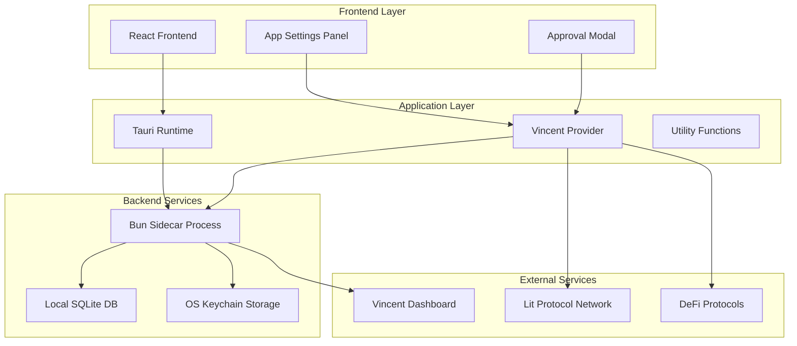
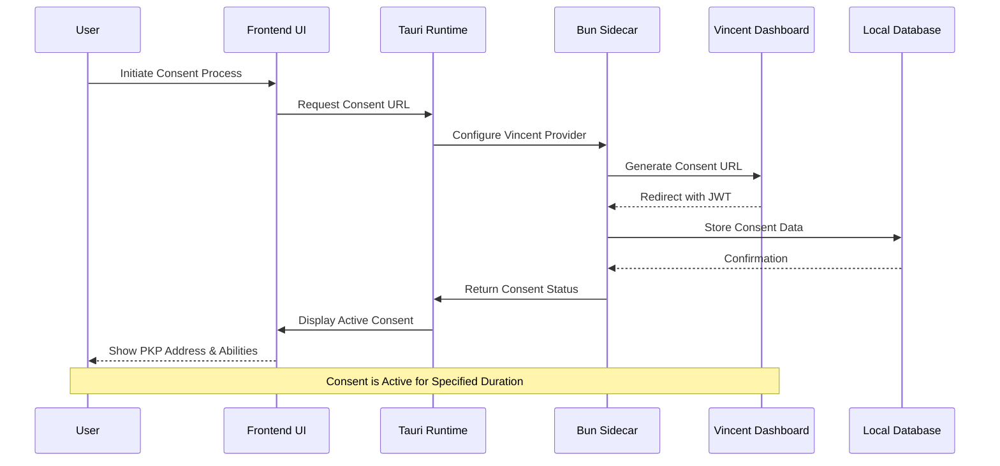
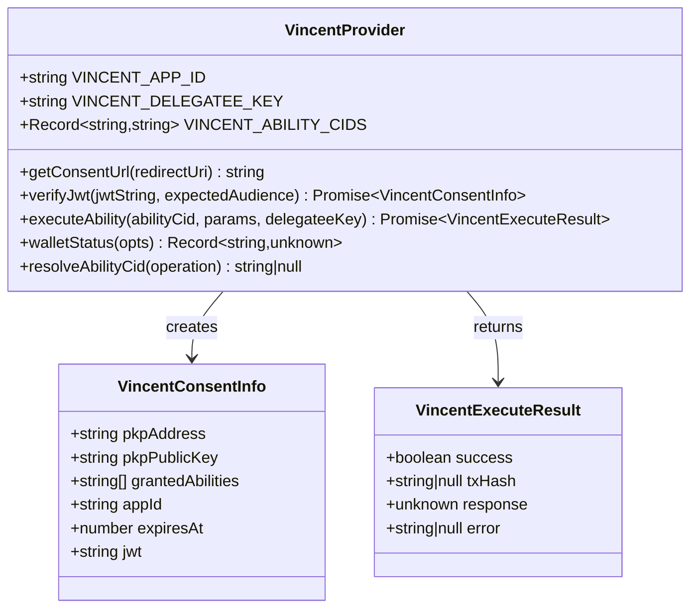
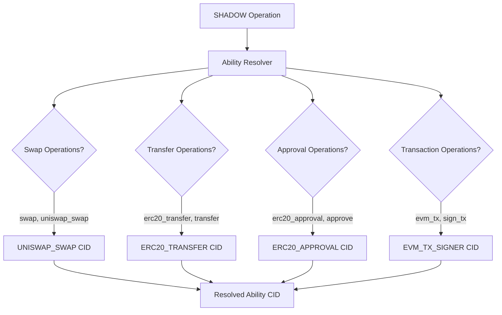
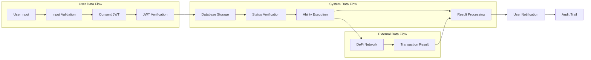
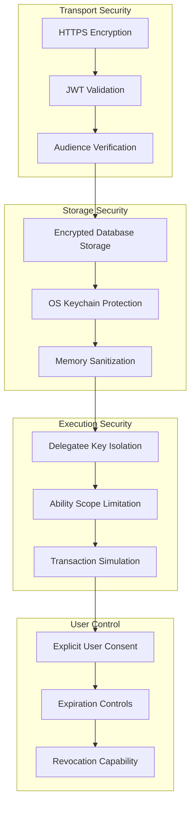
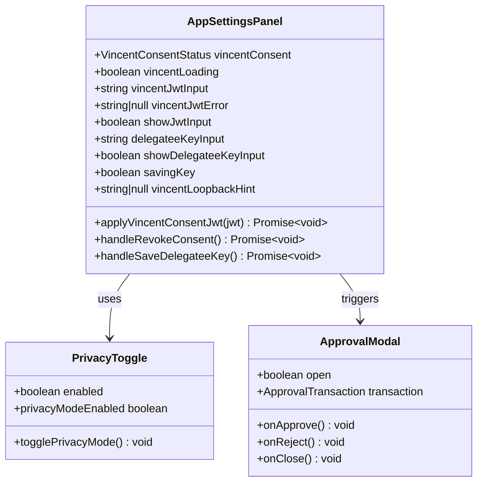
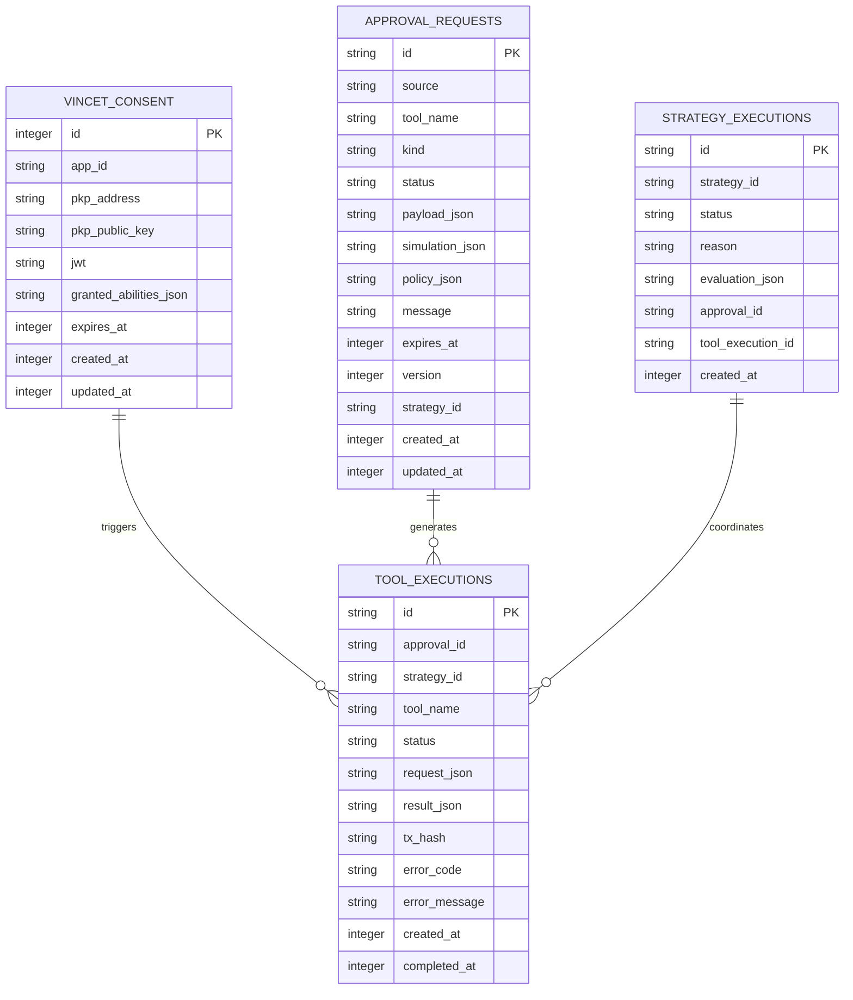
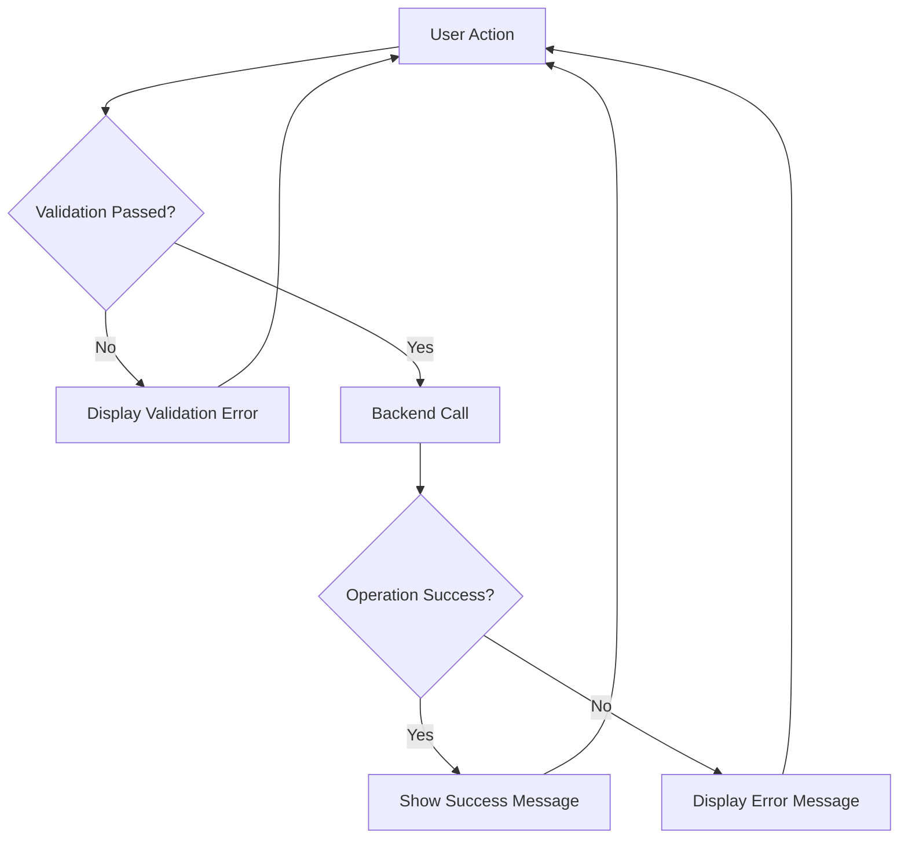

# Vincent DeFi Consent Management

<cite>
**Referenced Files in This Document**
- [vincent.ts](file://apps-runtime/src/providers/vincent.ts)
- [apps.ts](file://src/lib/apps.ts)
- [AppSettingsPanel.tsx](file://src/components/apps/AppSettingsPanel.tsx)
- [runtime.rs](file://src-tauri/src/services/apps/runtime.rs)
- [state.rs](file://src-tauri/src/services/apps/state.rs)
- [local_db.rs](file://src-tauri/src/services/local_db.rs)
- [main.ts](file://apps-runtime/src/main.ts)
- [PrivacyToggle.tsx](file://src/components/shared/PrivacyToggle.tsx)
- [ApprovalModal.tsx](file://src/components/shared/ApprovalModal.tsx)
</cite>

## Table of Contents
1. [Introduction](#introduction)
2. [System Architecture](#system-architecture)
3. [Consent Management Workflow](#consent-management-workflow)
4. [Core Components](#core-components)
5. [Data Flow Analysis](#data-flow-analysis)
6. [Security Implementation](#security-implementation)
7. [User Interface Components](#user-interface-components)
8. [Database Schema](#database-schema)
9. [Error Handling](#error-handling)
10. [Troubleshooting Guide](#troubleshooting-guide)
11. [Conclusion](#conclusion)

## Introduction

Vincent DeFi Consent Management is a sophisticated system that enables decentralized finance (DeFi) operations through delegated wallet execution using Lit Protocol's PKP (Permissive Key Pair) technology. This system allows users to authorize automated DeFi actions while maintaining strict security boundaries and user control over their digital assets.

The platform integrates three key technologies:
- **Vincent SDK**: Provides delegated DeFi ability execution
- **Lit Protocol PKP**: Offers distributed MPC wallet functionality
- **Tauri Desktop Runtime**: Enables secure desktop application deployment

The system operates on a consent-based model where users explicitly authorize specific DeFi operations through a secure JWT (JSON Web Token) mechanism, ensuring transparency and user control over automated financial activities.

## System Architecture

The Vincent DeFi Consent Management system follows a multi-layered architecture designed for security, scalability, and user control:

**Diagram sources**
- [runtime.rs:1-144](file://src-tauri/src/services/apps/runtime.rs#L1-L144)
- [vincent.ts:127-361](file://apps-runtime/src/providers/vincent.ts#L127-L361)

The architecture ensures complete separation of concerns with strict security boundaries between layers, preventing unauthorized access to sensitive user credentials while enabling seamless DeFi operations.

## Consent Management Workflow

The consent management workflow follows a carefully orchestrated sequence that prioritizes user security and transparency:

**Diagram sources**
- [main.ts:512-543](file://apps-runtime/src/main.ts#L512-L543)
- [apps.ts:69-104](file://src/lib/apps.ts#L69-L104)
- [state.rs:478-539](file://src-tauri/src/services/apps/state.rs#L478-L539)

The workflow ensures that users maintain complete control over their DeFi operations while enabling automated execution of approved actions.

## Core Components

### VincentProvider Class

The [`VincentProvider`:127-361](file://apps-runtime/src/providers/vincent.ts#L127-L361) serves as the central orchestrator for all Vincent-related operations, implementing a comprehensive interface for consent management and DeFi execution.

**Diagram sources**
- [vincent.ts:89-103](file://apps-runtime/src/providers/vincent.ts#L89-L103)
- [vincent.ts:127-361](file://apps-runtime/src/providers/vincent.ts#L127-L361)

### Configuration Management

The system supports dynamic configuration through environment variables and runtime settings:

| Configuration Parameter | Description | Environment Variable |
|------------------------|-------------|---------------------|
| `SHADOW_VINCENT_APP_ID` | Vincent application identifier | Required for consent generation |
| `SHADOW_VINCENT_DELEGATEE_KEY` | Private key for delegated signing | Stored in OS keychain |
| `VINCENT_CID_*` | Ability-specific IPFS content identifiers | Maps SHADOW operations to abilities |

**Section sources**
- [vincent.ts:28-44](file://apps-runtime/src/providers/vincent.ts#L28-L44)
- [vincent.ts:109-121](file://apps-runtime/src/providers/vincent.ts#L109-L121)

### Ability Resolution System

The system provides intelligent mapping between SHADOW operation names and corresponding Vincent abilities:

**Diagram sources**
- [vincent.ts:326-341](file://apps-runtime/src/providers/vincent.ts#L326-L341)

**Section sources**
- [vincent.ts:326-341](file://apps-runtime/src/providers/vincent.ts#L326-L341)

## Data Flow Analysis

The data flow in the Vincent DeFi system demonstrates careful handling of sensitive information and secure communication patterns:

**Diagram sources**
- [apps.ts:94-104](file://src/lib/apps.ts#L94-L104)
- [state.rs:478-539](file://src-tauri/src/services/apps/state.rs#L478-L539)

The flow ensures that user data remains protected while enabling seamless DeFi operations through secure delegation mechanisms.

## Security Implementation

### Multi-Layered Security Architecture

The system implements comprehensive security measures across multiple layers:

**Diagram sources**
- [vincent.ts:145-236](file://apps-runtime/src/providers/vincent.ts#L145-L236)
- [state.rs:478-539](file://src-tauri/src/services/apps/state.rs#L478-L539)

### Key Security Features

1. **JWT Validation**: Comprehensive validation of consent tokens including expiration checks and audience verification
2. **Delegatee Key Protection**: Secure storage of delegatee keys in OS keychain with memory sanitization
3. **Ability Scoping**: Strict limitation of permitted DeFi operations based on user consent
4. **Transaction Simulation**: Pre-execution simulation to prevent unauthorized operations
5. **Audit Logging**: Complete tracking of all consent and execution activities

**Section sources**
- [vincent.ts:145-236](file://apps-runtime/src/providers/vincent.ts#L145-L236)
- [vincent.ts:246-296](file://apps-runtime/src/providers/vincent.ts#L246-L296)

## User Interface Components

### Application Settings Panel

The [`AppSettingsPanel`:161-690](file://src/components/apps/AppSettingsPanel.tsx#L161-L690) provides comprehensive user interface for managing Vincent DeFi consent:

**Diagram sources**
- [AppSettingsPanel.tsx:161-690](file://src/components/apps/AppSettingsPanel.tsx#L161-L690)
- [PrivacyToggle.tsx:10-32](file://src/components/shared/PrivacyToggle.tsx#L10-L32)
- [ApprovalModal.tsx:25-142](file://src/components/shared/ApprovalModal.tsx#L25-L142)

### Consent Status Display

The interface provides real-time feedback on consent status with visual indicators:

| Status | Visual Indicator | Description |
|--------|------------------|-------------|
| No Consent | Gray Card | No active Vincent consent |
| Active Consent | Violet Card | Valid consent with abilities |
| Expired Consent | Amber Warning | Consent requires renewal |
| PKP Active | Emerald Card | PKP wallet created and active |

**Section sources**
- [AppSettingsPanel.tsx:486-533](file://src/components/apps/AppSettingsPanel.tsx#L486-L533)
- [AppSettingsPanel.tsx:534-540](file://src/components/apps/AppSettingsPanel.tsx#L534-L540)

## Database Schema

The system utilizes a comprehensive SQLite database schema optimized for storing consent information and execution history:

**Diagram sources**
- [local_db.rs:293-304](file://src-tauri/src/services/local_db.rs#L293-L304)
- [local_db.rs:115-132](file://src-tauri/src/services/local_db.rs#L115-L132)
- [local_db.rs:137-150](file://src-tauri/src/services/local_db.rs#L137-L150)
- [local_db.rs:155-167](file://src-tauri/src/services/local_db.rs#L155-L167)

### Database Operations

The system performs several key operations on the consent database:

1. **Upsert Operations**: Insert new consent records while maintaining only the latest per application
2. **Active Consent Retrieval**: Fetch non-expired consent records for active sessions
3. **Consent Revocation**: Delete all consent records for specific applications
4. **Approval Tracking**: Monitor pending and completed approval requests
5. **Execution History**: Maintain comprehensive logs of all executed abilities

**Section sources**
- [state.rs:478-539](file://src-tauri/src/services/apps/state.rs#L478-L539)
- [local_db.rs:1155-1258](file://src-tauri/src/services/local_db.rs#L1155-L1258)

## Error Handling

The system implements comprehensive error handling strategies across all layers:

### Frontend Error Management

### Backend Error Categories

| Error Type | Description | Recovery Strategy |
|------------|-------------|-------------------|
| Authentication Errors | Invalid JWT or expired consent | Require new consent |
| Authorization Errors | Insufficient permissions | Review granted abilities |
| Network Errors | Connectivity issues | Retry with exponential backoff |
| Validation Errors | Invalid input parameters | Provide specific error details |
| System Errors | Internal failures | Log and escalate to support |

**Section sources**
- [vincent.ts:145-236](file://apps-runtime/src/providers/vincent.ts#L145-L236)
- [runtime.rs:13-26](file://src-tauri/src/services/apps/runtime.rs#L13-L26)

## Troubleshooting Guide

### Common Issues and Solutions

#### Consent Generation Problems

**Issue**: Unable to generate consent URL
- **Cause**: Missing Vincent App ID configuration
- **Solution**: Verify `SHADOW_VINCENT_APP_ID` environment variable is set
- **Prevention**: Check application settings panel for proper configuration

#### JWT Verification Failures

**Issue**: JWT validation errors during submission
- **Cause**: Using incorrect token type or expired consent
- **Solution**: Ensure you're using the consent JWT, not session tokens
- **Prevention**: Follow the consent flow precisely as documented

#### Delegatee Key Issues

**Issue**: Delegatee key not being accepted
- **Cause**: Incorrect key format or OS keychain access problems
- **Solution**: Verify key format matches expected private key structure
- **Prevention**: Test key storage separately before attempting execution

#### Execution Failures

**Issue**: Abilities not executing despite valid consent
- **Cause**: Missing ability CIDs or insufficient permissions
- **Solution**: Verify all required abilities are registered on Vincent dashboard
- **Prevention**: Cross-check ability mappings in configuration

**Section sources**
- [AppSettingsPanel.tsx:568-580](file://src/components/apps/AppSettingsPanel.tsx#L568-L580)
- [vincent.ts:246-296](file://apps-runtime/src/providers/vincent.ts#L246-L296)

## Conclusion

The Vincent DeFi Consent Management system represents a sophisticated approach to decentralized finance automation that prioritizes user security, transparency, and control. Through its multi-layered architecture, comprehensive security implementation, and intuitive user interface, the system enables powerful DeFi operations while maintaining strict security boundaries.

Key strengths of the system include:

- **Security-First Design**: Multi-layered protection with delegatee key isolation and comprehensive validation
- **User Control**: Explicit consent mechanisms with clear visibility into granted abilities
- **Scalable Architecture**: Modular design supporting future expansion and additional DeFi protocols
- **Transparent Operations**: Complete audit trail and real-time status monitoring
- **Robust Error Handling**: Comprehensive error management with user-friendly feedback

The system successfully balances the competing demands of security and usability, providing a foundation for advanced DeFi automation while maintaining user trust and control over their digital assets.

Future enhancements could include expanded DeFi protocol support, enhanced simulation capabilities, and additional privacy controls to further strengthen the user experience while maintaining the system's security-first philosophy.