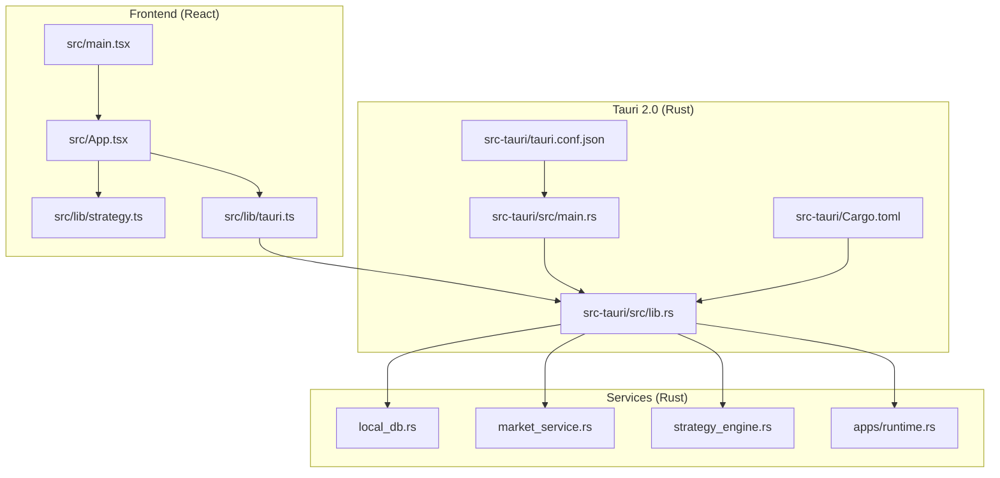
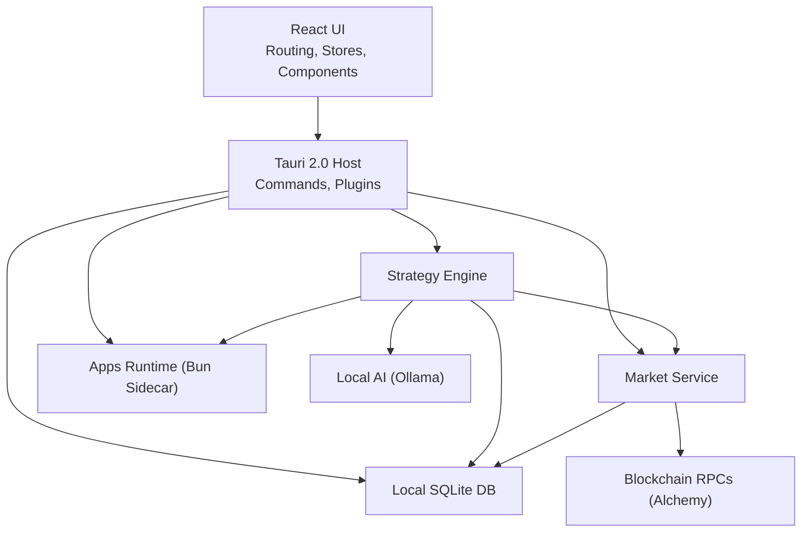
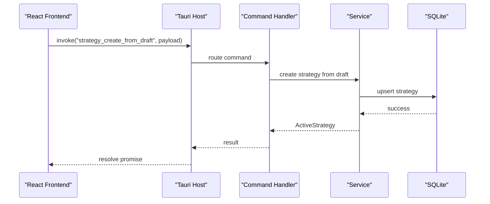
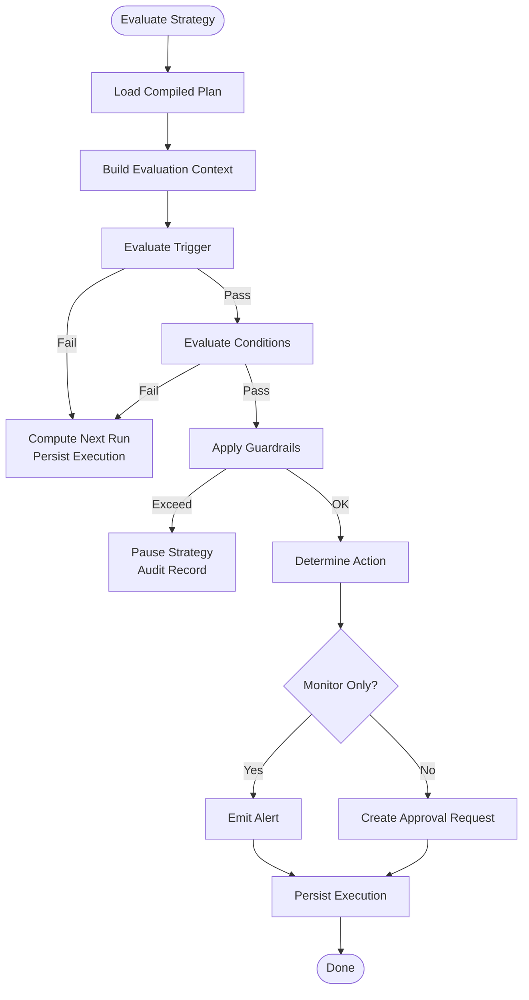
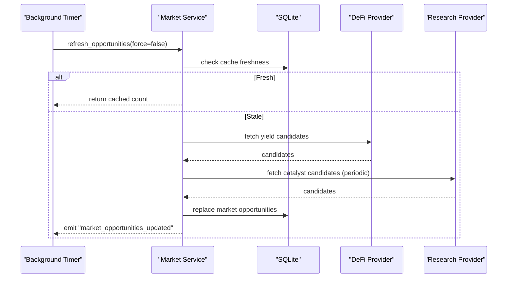
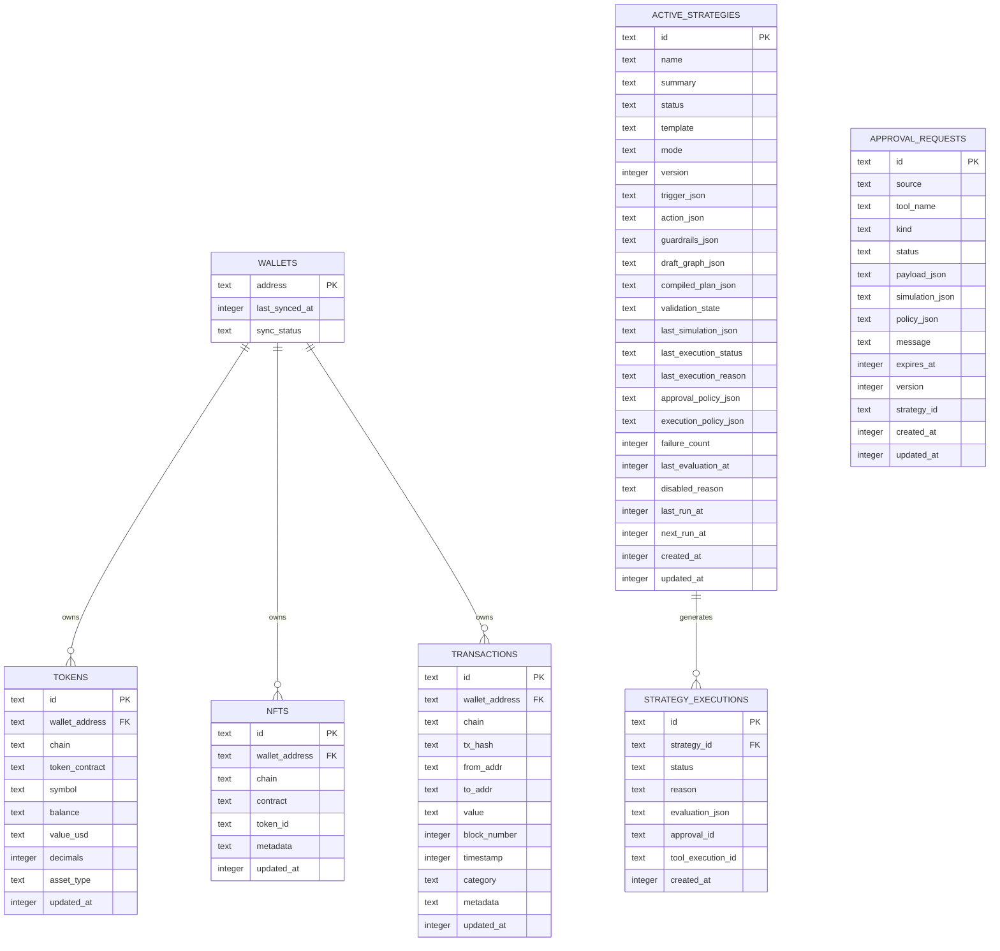
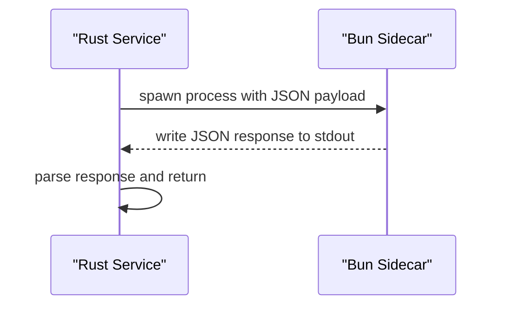
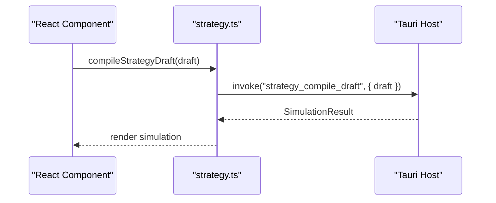
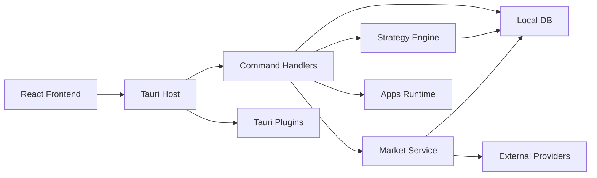
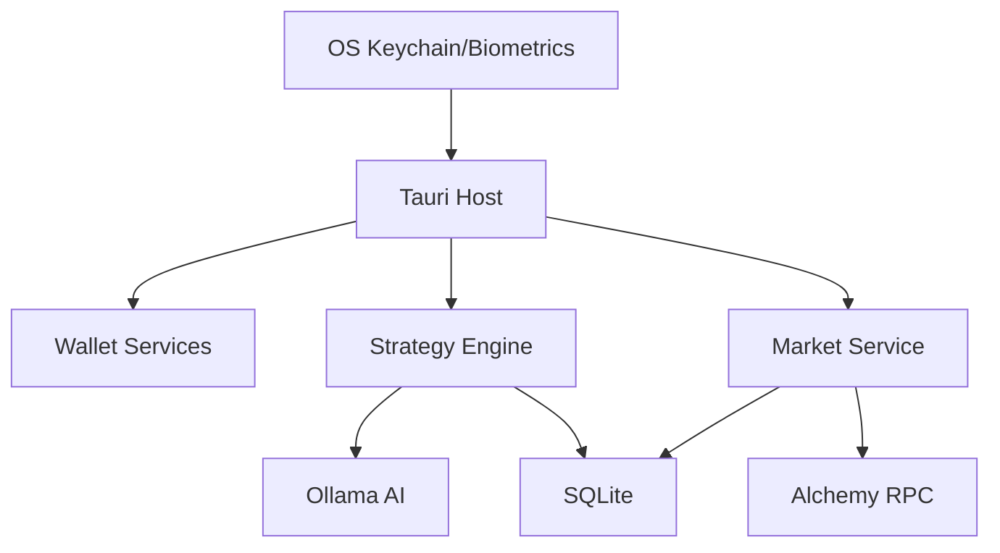

# Architecture & Design

<cite>
**Referenced Files in This Document**
- [src-tauri/src/main.rs](file://src-tauri/src/main.rs)
- [src-tauri/tauri.conf.json](file://src-tauri/tauri.conf.json)
- [package.json](file://package.json)
- [src/main.tsx](file://src/main.tsx)
- [src/App.tsx](file://src/App.tsx)
- [src/lib/tauri.ts](file://src/lib/tauri.ts)
- [src-tauri/src/lib.rs](file://src-tauri/src/lib.rs)
- [src-tauri/Cargo.toml](file://src-tauri/Cargo.toml)
- [src-tauri/src/services/mod.rs](file://src-tauri/src/services/mod.rs)
- [src-tauri/src/commands/mod.rs](file://src-tauri/src/commands/mod.rs)
- [src-tauri/src/services/local_db.rs](file://src-tauri/src/services/local_db.rs)
- [src-tauri/src/services/strategy_engine.rs](file://src-tauri/src/services/strategy_engine.rs)
- [src-tauri/src/services/market_service.rs](file://src-tauri/src/services/market_service.rs)
- [src-tauri/src/services/apps/runtime.rs](file://src-tauri/src/services/apps/runtime.rs)
- [src/lib/strategy.ts](file://src/lib/strategy.ts)
</cite>

## Table of Contents
1. [Introduction](#introduction)
2. [Project Structure](#project-structure)
3. [Core Components](#core-components)
4. [Architecture Overview](#architecture-overview)
5. [Detailed Component Analysis](#detailed-component-analysis)
6. [Dependency Analysis](#dependency-analysis)
7. [Performance Considerations](#performance-considerations)
8. [Troubleshooting Guide](#troubleshooting-guide)
9. [Conclusion](#conclusion)
10. [Appendices](#appendices)

## Introduction
This document describes the architecture and design of SHADOW Protocol’s hybrid edge computing system. The system combines a React-based frontend with a Tauri 2.0-powered Rust backend to deliver a privacy-first, desktop-native DeFi automation platform. It integrates local AI processing via Ollama, multi-chain blockchain interactions, and a glassmorphic UI. The backend exposes a rich command surface to the frontend, orchestrates background tasks, and persists state locally using SQLite. The document explains layered architecture, component interactions, security and privacy measures, and operational considerations.

## Project Structure
The repository is organized into:
- Frontend (React + Vite): Application bootstrap, routing, stores, and UI components.
- Backend (Tauri 2.0 + Rust): Application entrypoint, command handlers, services, and plugins.
- Shared libraries: Cross-platform Tauri detection and strategy helpers.
- Runtime integration: A Bun-based sidecar for app extensions.

**Diagram sources**
- [src/main.tsx:1-17](file://src/main.tsx#L1-L17)
- [src/App.tsx:1-49](file://src/App.tsx#L1-L49)
- [src/lib/strategy.ts:1-218](file://src/lib/strategy.ts#L1-L218)
- [src/lib/tauri.ts:1-4](file://src/lib/tauri.ts#L1-L4)
- [src-tauri/src/main.rs:1-7](file://src-tauri/src/main.rs#L1-L7)
- [src-tauri/src/lib.rs:1-199](file://src-tauri/src/lib.rs#L1-L199)
- [src-tauri/Cargo.toml:1-44](file://src-tauri/Cargo.toml#L1-L44)
- [src-tauri/tauri.conf.json:1-60](file://src-tauri/tauri.conf.json#L1-L60)
- [src-tauri/src/services/local_db.rs:1-800](file://src-tauri/src/services/local_db.rs#L1-L800)
- [src-tauri/src/services/market_service.rs:1-745](file://src-tauri/src/services/market_service.rs#L1-L745)
- [src-tauri/src/services/strategy_engine.rs:1-726](file://src-tauri/src/services/strategy_engine.rs#L1-L726)
- [src-tauri/src/services/apps/runtime.rs:1-144](file://src-tauri/src/services/apps/runtime.rs#L1-L144)

**Section sources**
- [src/main.tsx:1-17](file://src/main.tsx#L1-L17)
- [src/App.tsx:1-49](file://src/App.tsx#L1-L49)
- [src/lib/strategy.ts:1-218](file://src/lib/strategy.ts#L1-L218)
- [src/lib/tauri.ts:1-4](file://src/lib/tauri.ts#L1-L4)
- [src-tauri/src/main.rs:1-7](file://src-tauri/src/main.rs#L1-L7)
- [src-tauri/src/lib.rs:1-199](file://src-tauri/src/lib.rs#L1-L199)
- [src-tauri/Cargo.toml:1-44](file://src-tauri/Cargo.toml#L1-L44)
- [src-tauri/tauri.conf.json:1-60](file://src-tauri/tauri.conf.json#L1-L60)

## Core Components
- Presentation Layer (React):
  - Bootstrapped by Vite and React, with React Router for navigation and React Query for caching.
  - Uses Tauri APIs for native capabilities and developer context menu.
- Business Logic Layer (Rust Services):
  - Strategy Engine evaluates triggers and conditions, emits approvals, and coordinates executions.
  - Market Service aggregates opportunities from external providers, ranks them, and caches results.
  - Local DB encapsulates SQLite schema and migrations for on-chain data, strategies, approvals, and analytics.
  - Apps Runtime spawns a Bun sidecar to isolate and execute third-party app logic safely.
- Data Access Layer (SQLite):
  - Centralized persistence for wallets, tokens, NFTs, transactions, strategies, approvals, audits, and market data.
- External Integrations:
  - Blockchain RPCs (via Alchemy) and AI inference (via Ollama) are integrated through Tauri commands and service orchestration.

**Section sources**
- [src/main.tsx:1-17](file://src/main.tsx#L1-L17)
- [src/App.tsx:1-49](file://src/App.tsx#L1-L49)
- [src/lib/strategy.ts:1-218](file://src/lib/strategy.ts#L1-L218)
- [src-tauri/src/services/local_db.rs:1-800](file://src-tauri/src/services/local_db.rs#L1-L800)
- [src-tauri/src/services/strategy_engine.rs:1-726](file://src-tauri/src/services/strategy_engine.rs#L1-L726)
- [src-tauri/src/services/market_service.rs:1-745](file://src-tauri/src/services/market_service.rs#L1-L745)
- [src-tauri/src/services/apps/runtime.rs:1-144](file://src-tauri/src/services/apps/runtime.rs#L1-L144)

## Architecture Overview
The system follows a layered architecture with explicit boundaries:
- Presentation: React SPA served by Tauri WebView.
- Application: Tauri 2.0 host with command handlers and background services.
- Persistence: SQLite database initialized at runtime.
- Integrations: External RPCs and AI inference invoked via Tauri commands.

**Diagram sources**
- [src-tauri/src/lib.rs:40-199](file://src-tauri/src/lib.rs#L40-L199)
- [src-tauri/src/services/local_db.rs:1-800](file://src-tauri/src/services/local_db.rs#L1-L800)
- [src-tauri/src/services/market_service.rs:1-745](file://src-tauri/src/services/market_service.rs#L1-L745)
- [src-tauri/src/services/strategy_engine.rs:1-726](file://src-tauri/src/services/strategy_engine.rs#L1-L726)
- [src-tauri/src/services/apps/runtime.rs:1-144](file://src-tauri/src/services/apps/runtime.rs#L1-L144)
- [src-tauri/tauri.conf.json:32-34](file://src-tauri/tauri.conf.json#L32-L34)

## Detailed Component Analysis

### Tauri 2.0 Host and Command Surface
- Entry point initializes the Tauri builder, registers plugins, sets up background tasks, and exposes a comprehensive command handler.
- Commands cover wallet operations, portfolio queries, market data, strategy lifecycle, approvals, autonomous agent controls, and Ollama management.
- Security policy restricts connections to localhost Ollama and Alchemy endpoints.

**Diagram sources**
- [src-tauri/src/lib.rs:90-191](file://src-tauri/src/lib.rs#L90-L191)
- [src-tauri/src/services/local_db.rs:685-758](file://src-tauri/src/services/local_db.rs#L685-L758)
- [src/lib/strategy.ts:180-201](file://src/lib/strategy.ts#L180-L201)

**Section sources**
- [src-tauri/src/main.rs:1-7](file://src-tauri/src/main.rs#L1-L7)
- [src-tauri/src/lib.rs:40-199](file://src-tauri/src/lib.rs#L40-L199)
- [src-tauri/tauri.conf.json:32-34](file://src-tauri/tauri.conf.json#L32-L34)

### Strategy Engine
- Evaluates compiled strategies on heartbeat ticks, computes drift thresholds, validates conditions, and creates approval requests when required.
- Emits events for UI updates and maintains execution logs and strategy history in SQLite.

**Diagram sources**
- [src-tauri/src/services/strategy_engine.rs:343-726](file://src-tauri/src/services/strategy_engine.rs#L343-L726)
- [src-tauri/src/services/local_db.rs:155-167](file://src-tauri/src/services/local_db.rs#L155-L167)

**Section sources**
- [src-tauri/src/services/strategy_engine.rs:1-726](file://src-tauri/src/services/strategy_engine.rs#L1-L726)
- [src-tauri/src/services/local_db.rs:1-800](file://src-tauri/src/services/local_db.rs#L1-L800)

### Market Service
- Periodically refreshes opportunities from DeFi providers, optionally augments with research, ranks candidates, and emits updates to the UI.
- Maintains cache freshness and falls back to cached data on failures.

**Diagram sources**
- [src-tauri/src/services/market_service.rs:189-218](file://src-tauri/src/services/market_service.rs#L189-L218)
- [src-tauri/src/services/market_service.rs:263-365](file://src-tauri/src/services/market_service.rs#L263-L365)

**Section sources**
- [src-tauri/src/services/market_service.rs:1-745](file://src-tauri/src/services/market_service.rs#L1-L745)

### Local Database (SQLite)
- Initializes schema and migrations at startup, exposes CRUD helpers for strategies, approvals, market data, and portfolio snapshots.
- Provides indexes for performance and supports truncation for data hygiene.

**Diagram sources**
- [src-tauri/src/services/local_db.rs:10-416](file://src-tauri/src/services/local_db.rs#L10-L416)

**Section sources**
- [src-tauri/src/services/local_db.rs:1-800](file://src-tauri/src/services/local_db.rs#L1-L800)

### Apps Runtime (Bun Sidecar)
- Spawns a separate Bun process per request to execute app logic in isolation, enforcing resource limits and timeouts.
- Supports health checks and structured JSON communication.

**Diagram sources**
- [src-tauri/src/services/apps/runtime.rs:69-131](file://src-tauri/src/services/apps/runtime.rs#L69-L131)

**Section sources**
- [src-tauri/src/services/apps/runtime.rs:1-144](file://src-tauri/src/services/apps/runtime.rs#L1-L144)

### Frontend Integration (React + Tauri)
- React app bootstrapped with React Query and routed via React Router.
- Tauri detection enables developer context menu and native capabilities.
- Strategy helpers invoke Tauri commands to compile and manage strategies.

**Diagram sources**
- [src/lib/strategy.ts:174-178](file://src/lib/strategy.ts#L174-L178)
- [src-tauri/src/lib.rs:147-148](file://src-tauri/src/lib.rs#L147-L148)

**Section sources**
- [src/main.tsx:1-17](file://src/main.tsx#L1-L17)
- [src/App.tsx:1-49](file://src/App.tsx#L1-L49)
- [src/lib/tauri.ts:1-4](file://src/lib/tauri.ts#L1-L4)
- [src/lib/strategy.ts:1-218](file://src/lib/strategy.ts#L1-L218)

## Dependency Analysis
- Internal dependencies:
  - Tauri host depends on service modules for strategy, market, local DB, and runtime.
  - Services depend on SQLite for persistence and on each other for cross-cutting concerns.
- External dependencies:
  - Tauri plugins for opener and biometry.
  - Tokio for async runtime and task scheduling.
  - Rusqlite for embedded database.
  - reqwest for HTTP clients to external providers.
- Frontend dependencies:
  - React, React Router, React Query, and Tauri JS API bindings.

**Diagram sources**
- [src-tauri/src/lib.rs:40-199](file://src-tauri/src/lib.rs#L40-L199)
- [src-tauri/Cargo.toml:20-44](file://src-tauri/Cargo.toml#L20-L44)
- [package.json:18-55](file://package.json#L18-L55)

**Section sources**
- [src-tauri/src/lib.rs:1-199](file://src-tauri/src/lib.rs#L1-L199)
- [src-tauri/Cargo.toml:1-44](file://src-tauri/Cargo.toml#L1-L44)
- [package.json:1-55](file://package.json#L1-L55)

## Performance Considerations
- Background tasks:
  - Market refresh runs on intervals with periodic research inclusion.
  - Strategy engine evaluates at heartbeat intervals; next-run scheduling minimizes unnecessary work.
- Database:
  - Indexes on frequently queried columns improve lookup performance.
  - Batched writes and upserts reduce contention.
- Network:
  - External provider calls are retried with fallback to cached data.
- UI responsiveness:
  - React Query caching reduces redundant network calls.
  - Tauri commands are asynchronous and non-blocking.

[No sources needed since this section provides general guidance]

## Troubleshooting Guide
- Tauri commands not found:
  - Verify command registration in the Tauri builder and ensure the frontend invokes the correct command names.
- SQLite initialization errors:
  - Confirm app data directory creation and schema migration success.
- Market data stale:
  - Check provider run records and cache freshness logic; ensure external endpoints are reachable.
- Apps runtime failures:
  - Validate Bun availability, script path resolution, and process timeouts.

**Section sources**
- [src-tauri/src/lib.rs:90-191](file://src-tauri/src/lib.rs#L90-L191)
- [src-tauri/src/services/local_db.rs:438-448](file://src-tauri/src/services/local_db.rs#L438-L448)
- [src-tauri/src/services/market_service.rs:561-593](file://src-tauri/src/services/market_service.rs#L561-L593)
- [src-tauri/src/services/apps/runtime.rs:49-67](file://src-tauri/src/services/apps/runtime.rs#L49-L67)

## Conclusion
SHADOW Protocol’s architecture blends a modern React frontend with a robust Tauri 2.0 Rust backend to enable secure, privacy-preserving DeFi automation. The layered design—presentation, business logic, data access, and external integrations—enables clear separation of concerns, strong desktop-native security, and scalable background processing. Local AI inference and multi-chain support are integrated through Tauri commands and service orchestration, while SQLite ensures reliable persistence and offline usability.

[No sources needed since this section summarizes without analyzing specific files]

## Appendices

### System Boundaries and Context
- OS keychain integration:
  - Biometric plugin and keyring crate enable secure credential storage.
- Wallet services:
  - Mnemonic import, private key import, and wallet synchronization with pruning of expired sessions.
- Strategy engine:
  - Guardrails, approvals, and execution policies govern automated actions.
- Market data providers:
  - DeFi yield and research providers feed ranked opportunities into the UI.

**Diagram sources**
- [src-tauri/tauri.conf.json:32-34](file://src-tauri/tauri.conf.json#L32-L34)
- [src-tauri/src/lib.rs:42-43](file://src-tauri/src/lib.rs#L42-L43)
- [src-tauri/Cargo.toml:28-31](file://src-tauri/Cargo.toml#L28-L31)