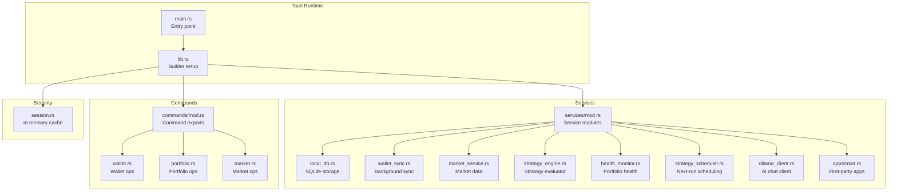
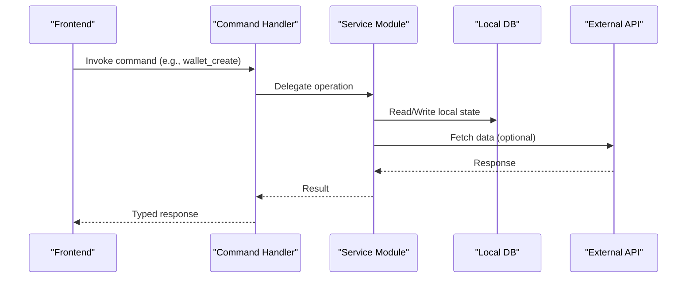
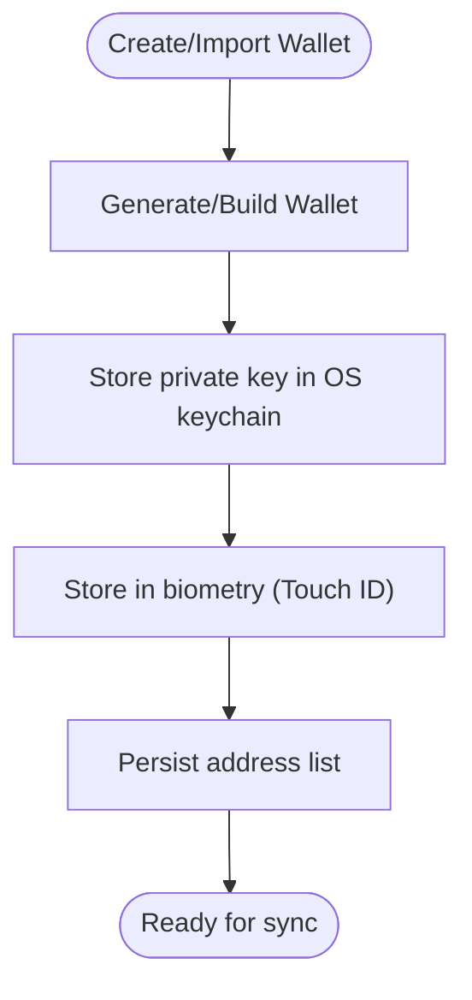
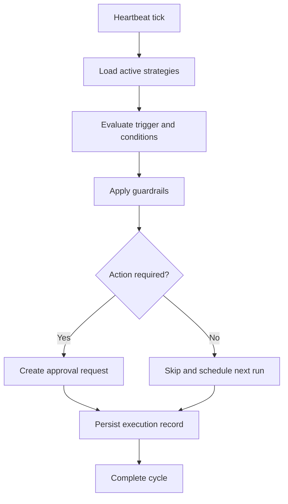
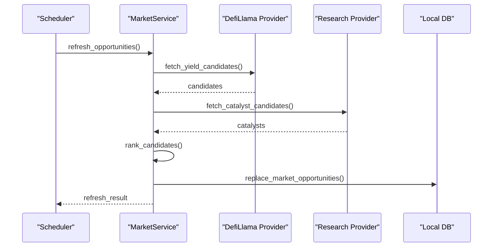
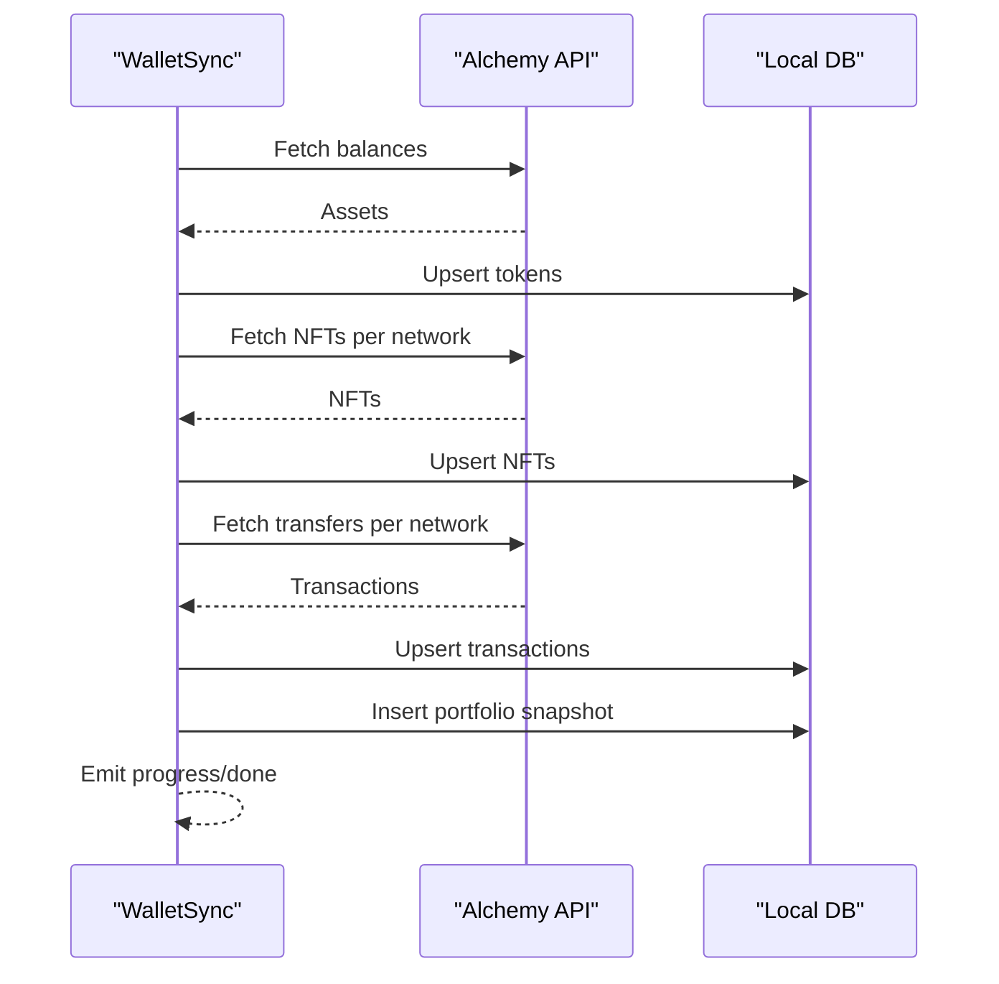
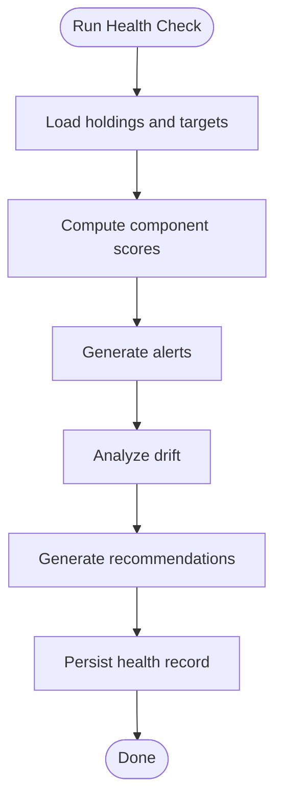
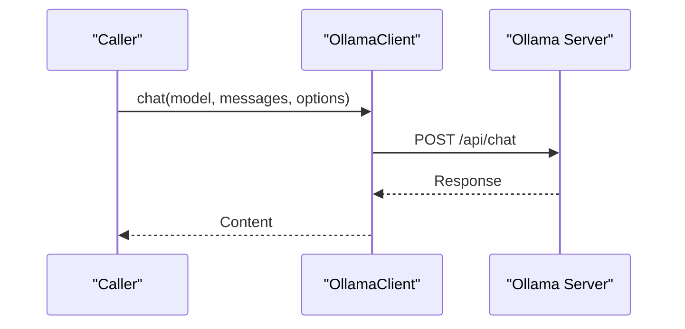
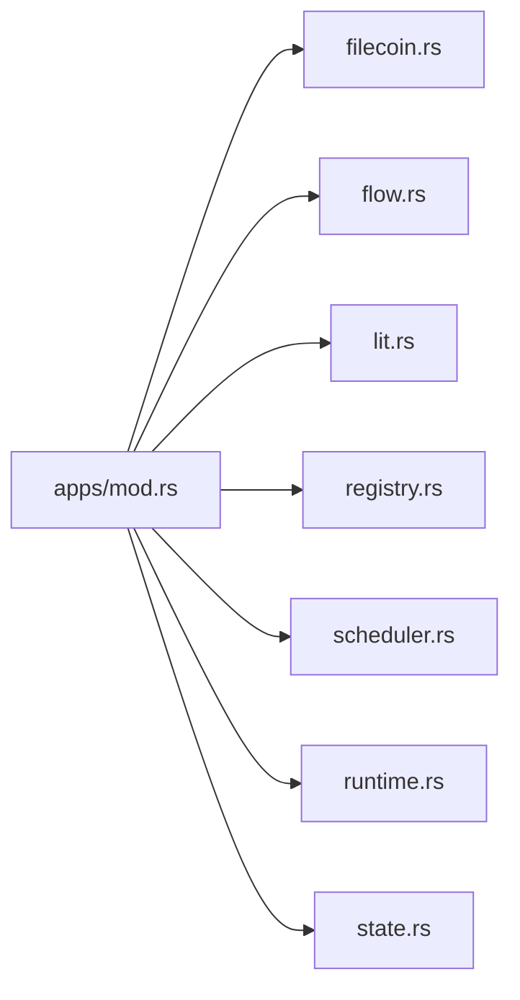
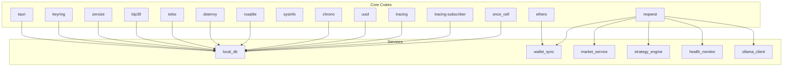

# Backend Services Architecture

<cite>
**Referenced Files in This Document**
- [Cargo.toml](file://src-tauri/Cargo.toml)
- [lib.rs](file://src-tauri/src/lib.rs)
- [main.rs](file://src-tauri/src/main.rs)
- [mod.rs (services)](file://src-tauri/src/services/mod.rs)
- [local_db.rs](file://src-tauri/src/services/local_db.rs)
- [wallet_sync.rs](file://src-tauri/src/services/wallet_sync.rs)
- [market_service.rs](file://src-tauri/src/services/market_service.rs)
- [strategy_engine.rs](file://src-tauri/src/services/strategy_engine.rs)
- [health_monitor.rs](file://src-tauri/src/services/health_monitor.rs)
- [strategy_scheduler.rs](file://src-tauri/src/services/strategy_scheduler.rs)
- [ollama_client.rs](file://src-tauri/src/services/ollama_client.rs)
- [mod.rs (apps)](file://src-tauri/src/services/apps/mod.rs)
- [mod.rs (commands)](file://src-tauri/src/commands/mod.rs)
- [wallet.rs](file://src-tauri/src/commands/wallet.rs)
- [portfolio.rs](file://src-tauri/src/commands/portfolio.rs)
- [market.rs](file://src-tauri/src/commands/market.rs)
- [session.rs](file://src-tauri/src/session.rs)
</cite>

## Table of Contents
1. [Introduction](#introduction)
2. [Project Structure](#project-structure)
3. [Core Components](#core-components)
4. [Architecture Overview](#architecture-overview)
5. [Detailed Component Analysis](#detailed-component-analysis)
6. [Dependency Analysis](#dependency-analysis)
7. [Performance Considerations](#performance-considerations)
8. [Troubleshooting Guide](#troubleshooting-guide)
9. [Conclusion](#conclusion)

## Introduction
This document describes the backend services architecture for SHADOW Protocol’s Rust-based Tauri application. It covers the modular service layer with clear separation of concerns across wallet services, strategy engine, market data provider, and AI integration services. It explains the command pattern implementation bridging the frontend to backend functionality, service lifecycle management, inter-service communication, database architecture using SQLite, background task scheduling, health monitoring, graceful shutdown, error handling, logging, and security services including OS keychain integration and encryption utilities.

## Project Structure
The backend is organized around a Tauri Builder setup with a central library entry point that initializes plugins, services, and command handlers. Services are grouped under a dedicated module with submodules for specialized domains. Commands expose typed APIs to the frontend.

**Diagram sources**
- [lib.rs:34-198](file://src-tauri/src/lib.rs#L34-L198)
- [main.rs:4-6](file://src-tauri/src/main.rs#L4-L6)
- [mod.rs (services):1-36](file://src-tauri/src/services/mod.rs#L1-L36)
- [mod.rs (commands):1-27](file://src-tauri/src/commands/mod.rs#L1-L27)

**Section sources**
- [Cargo.toml:1-44](file://src-tauri/Cargo.toml#L1-L44)
- [lib.rs:34-198](file://src-tauri/src/lib.rs#L34-L198)
- [main.rs:4-6](file://src-tauri/src/main.rs#L4-L6)
- [mod.rs (services):1-36](file://src-tauri/src/services/mod.rs#L1-L36)
- [mod.rs (commands):1-27](file://src-tauri/src/commands/mod.rs#L1-L27)

## Core Components
- Service initialization and lifecycle:
  - Plugins: opener and biometry are registered during setup.
  - Database: SQLite initialized at app data directory with schema creation and migrations.
  - Background services: shadow watcher, alpha service, heartbeat, market service, and periodic cleanup.
  - Startup sync: wallet addresses discovered and background sync launched for stale wallets.
- Command pattern:
  - Centralized handler registration for all commands exported to the frontend.
  - Commands are grouped by domain (wallet, portfolio, market, strategy, apps, autonomous, settings, session).
- Security:
  - OS keychain-backed private key storage with optional biometric protection.
  - In-memory session cache with automatic expiry and secure wiping.
- Database:
  - Local SQLite with comprehensive tables for wallets, tokens, NFTs, transactions, strategies, approvals, executions, market opportunities, app catalogs, and autonomous agent artifacts.
- AI integration:
  - Ollama HTTP client for chat requests with optional bearer token authorization.

**Section sources**
- [lib.rs:40-89](file://src-tauri/src/lib.rs#L40-L89)
- [lib.rs:90-191](file://src-tauri/src/lib.rs#L90-L191)
- [local_db.rs:438-448](file://src-tauri/src/services/local_db.rs#L438-L448)
- [wallet.rs:13-148](file://src-tauri/src/commands/wallet.rs#L13-L148)
- [session.rs:16-93](file://src-tauri/src/session.rs#L16-L93)
- [ollama_client.rs:46-105](file://src-tauri/src/services/ollama_client.rs#L46-L105)

## Architecture Overview
The backend follows a layered architecture:
- Entry point initializes runtime, plugins, and services.
- Services encapsulate domain logic and state.
- Commands act as façades to services, exposing typed operations to the frontend.
- Inter-service communication occurs via shared modules and local database reads/writes.
- Background tasks are scheduled using Tokio intervals and spawn helpers.

**Diagram sources**
- [lib.rs:90-191](file://src-tauri/src/lib.rs#L90-L191)
- [wallet.rs:169-200](file://src-tauri/src/commands/wallet.rs#L169-L200)
- [portfolio.rs:43-91](file://src-tauri/src/commands/portfolio.rs#L43-L91)
- [market.rs:8-35](file://src-tauri/src/commands/market.rs#L8-L35)

## Detailed Component Analysis

### Wallet Services
Wallet services manage EVM wallet creation, import, listing, removal, and secure key storage. Keys are persisted in OS keychain and optionally protected by biometric authentication. An in-memory session cache holds decrypted keys for short periods to enable operations without repeated OS prompts.

**Diagram sources**
- [wallet.rs:169-200](file://src-tauri/src/commands/wallet.rs#L169-L200)
- [wallet.rs:202-258](file://src-tauri/src/commands/wallet.rs#L202-L258)
- [wallet.rs:260-283](file://src-tauri/src/commands/wallet.rs#L260-L283)

Key characteristics:
- Secure storage: OS keychain and optional biometry.
- Address list persistence in a plain JSON file for convenience.
- Session cache with expiry and secure wipe.
- Integration with background sync pipeline.

**Section sources**
- [wallet.rs:13-148](file://src-tauri/src/commands/wallet.rs#L13-L148)
- [session.rs:16-93](file://src-tauri/src/session.rs#L16-L93)

### Strategy Engine
The strategy engine evaluates compiled automation strategies on heartbeat ticks. It computes triggers, applies guardrails and conditions, and creates approval requests when required. It persists execution results and updates strategy metadata.

**Diagram sources**
- [strategy_engine.rs:343-725](file://src-tauri/src/services/strategy_engine.rs#L343-L725)
- [strategy_scheduler.rs:8-36](file://src-tauri/src/services/strategy_scheduler.rs#L8-L36)

Operational details:
- Trigger evaluation supports time-based, drift threshold, and threshold conditions.
- Guardrails enforce max gas, slippage, chain allowlists, and minimum portfolio thresholds.
- Execution policy determines whether to proceed directly or require approvals.
- Strategy scheduling computes next run timestamps.

**Section sources**
- [strategy_engine.rs:79-96](file://src-tauri/src/services/strategy_engine.rs#L79-L96)
- [strategy_engine.rs:120-159](file://src-tauri/src/services/strategy_engine.rs#L120-L159)
- [strategy_engine.rs:169-255](file://src-tauri/src/services/strategy_engine.rs#L169-L255)
- [strategy_engine.rs:289-329](file://src-tauri/src/services/strategy_engine.rs#L289-L329)
- [strategy_scheduler.rs:8-36](file://src-tauri/src/services/strategy_scheduler.rs#L8-L36)

### Market Data Provider
The market service aggregates opportunities from multiple sources, ranks candidates, and caches results. It emits updates to the frontend and maintains provider run records for diagnostics.

**Diagram sources**
- [market_service.rs:189-218](file://src-tauri/src/services/market_service.rs#L189-L218)
- [market_service.rs:263-365](file://src-tauri/src/services/market_service.rs#L263-L365)

Highlights:
- Periodic refresh with caching and fallback to cached results.
- Research provider integration and combined ranking.
- Emitting updates to the frontend and maintaining provider run records.

**Section sources**
- [market_service.rs:220-261](file://src-tauri/src/services/market_service.rs#L220-L261)
- [market_service.rs:312-365](file://src-tauri/src/services/market_service.rs#L312-L365)

### Background Wallet Sync
Wallet sync fetches tokens, NFTs, and transactions from external APIs and stores them locally. It emits progress and completion events and updates portfolio snapshots.

**Diagram sources**
- [wallet_sync.rs:260-452](file://src-tauri/src/services/wallet_sync.rs#L260-L452)

**Section sources**
- [wallet_sync.rs:10-28](file://src-tauri/src/services/wallet_sync.rs#L10-L28)
- [wallet_sync.rs:276-452](file://src-tauri/src/services/wallet_sync.rs#L276-L452)

### Health Monitoring
Health monitoring calculates portfolio health scores, generates alerts, and persists results for auditing and UI consumption.

**Diagram sources**
- [health_monitor.rs:107-221](file://src-tauri/src/services/health_monitor.rs#L107-L221)

**Section sources**
- [health_monitor.rs:223-347](file://src-tauri/src/services/health_monitor.rs#L223-L347)
- [health_monitor.rs:349-507](file://src-tauri/src/services/health_monitor.rs#L349-L507)

### AI Integration Services
The Ollama client provides a simple chat interface for AI-assisted workflows, supporting optional bearer token authorization.

**Diagram sources**
- [ollama_client.rs:46-105](file://src-tauri/src/services/ollama_client.rs#L46-L105)

**Section sources**
- [ollama_client.rs:7-105](file://src-tauri/src/services/ollama_client.rs#L7-L105)

### First-Party Apps and Integrations
The apps module orchestrates bundled integrations, including schedulers, runtime, permissions, and protocol adapters for Filecoin, Flow, and Lit protocols.

**Diagram sources**
- [mod.rs (apps):1-15](file://src-tauri/src/services/apps/mod.rs#L1-L15)

**Section sources**
- [mod.rs (apps):1-15](file://src-tauri/src/services/apps/mod.rs#L1-L15)

## Dependency Analysis
The backend relies on a small set of core crates for runtime, cryptography, networking, concurrency, and persistence. Services depend on shared modules and the local database for state.

**Diagram sources**
- [Cargo.toml:20-44](file://src-tauri/Cargo.toml#L20-L44)
- [local_db.rs:3-6](file://src-tauri/src/services/local_db.rs#L3-L6)
- [wallet_sync.rs:3-8](file://src-tauri/src/services/wallet_sync.rs#L3-L8)
- [market_service.rs:1-11](file://src-tauri/src/services/market_service.rs#L1-L11)
- [strategy_engine.rs:7-19](file://src-tauri/src/services/strategy_engine.rs#L7-L19)
- [health_monitor.rs:6-11](file://src-tauri/src/services/health_monitor.rs#L6-L11)
- [ollama_client.rs:3-5](file://src-tauri/src/services/ollama_client.rs#L3-L5)

**Section sources**
- [Cargo.toml:20-44](file://src-tauri/Cargo.toml#L20-L44)

## Performance Considerations
- Concurrency: Tokio runtime enables asynchronous operations for external API calls and background tasks.
- Caching: Local DB reduces repeated external calls; session cache minimizes OS keychain prompts.
- Scheduling: Strategy and market refresh use interval-based timers with configurable cadence.
- Persistence: SQLite with appropriate indexes optimizes queries for tokens, transactions, and opportunities.
- Memory: In-memory session cache uses secure wipe to prevent key material leakage.

[No sources needed since this section provides general guidance]

## Troubleshooting Guide
Common areas to inspect:
- Database initialization and migrations: verify schema creation and column migrations succeed.
- External API connectivity: confirm API keys and network reachability for Alchemy and Ollama.
- Session cache: ensure keys are cached and pruned on expiry; check for secure wipe on lock.
- Strategy evaluations: review guardrail violations and approval request statuses.
- Market refresh: check provider run records for errors and staleness.

**Section sources**
- [local_db.rs:438-448](file://src-tauri/src/services/local_db.rs#L438-L448)
- [wallet_sync.rs:260-274](file://src-tauri/src/services/wallet_sync.rs#L260-L274)
- [session.rs:86-93](file://src-tauri/src/session.rs#L86-L93)
- [strategy_engine.rs:403-434](file://src-tauri/src/services/strategy_engine.rs#L403-L434)
- [market_service.rs:292-300](file://src-tauri/src/services/market_service.rs#L292-L300)

## Conclusion
SHADOW Protocol’s backend employs a clean, modular architecture with strong separation of concerns. Services encapsulate domain logic, commands provide a typed interface to the frontend, and SQLite offers robust local persistence. Background tasks, health monitoring, and security measures (OS keychain, biometry, in-memory cache) ensure reliability and safety. The design supports extensibility for additional integrations and AI-driven workflows.