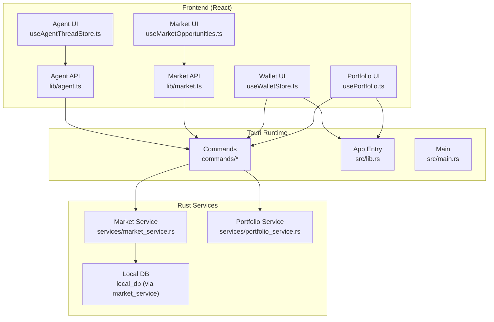
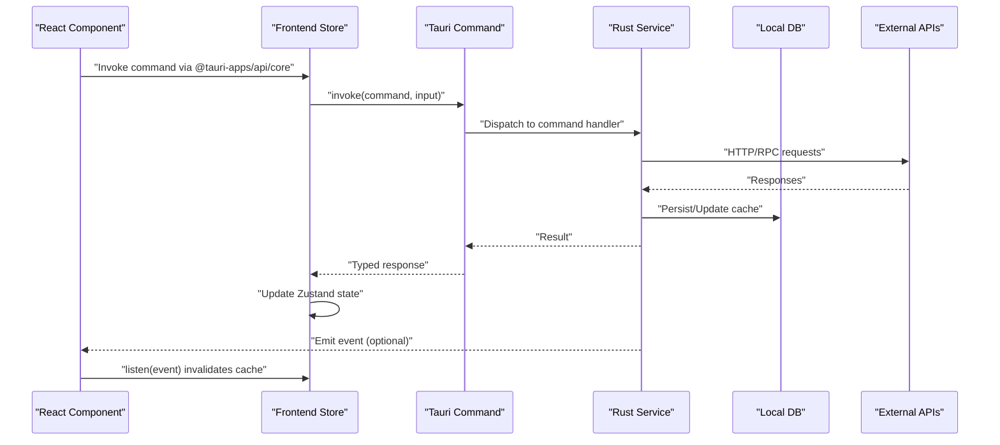
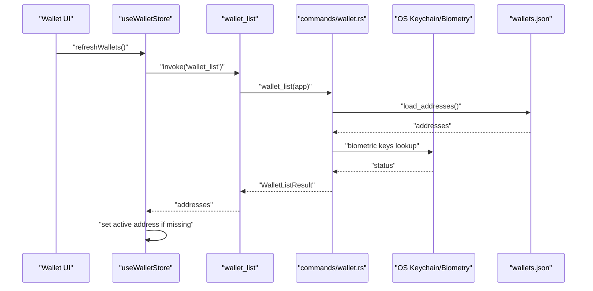
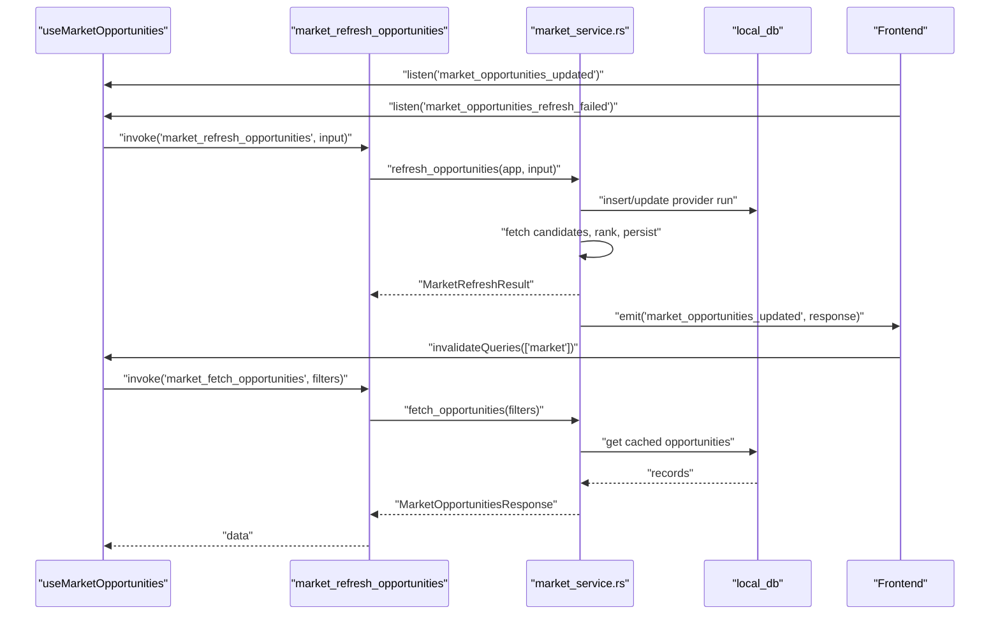
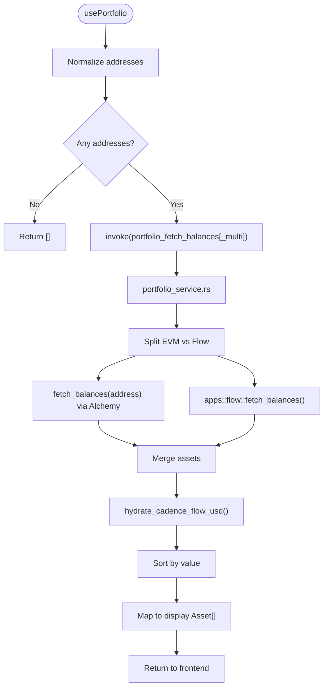
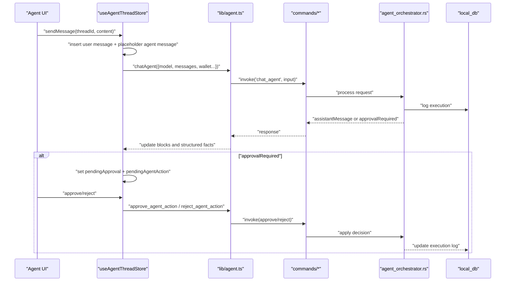
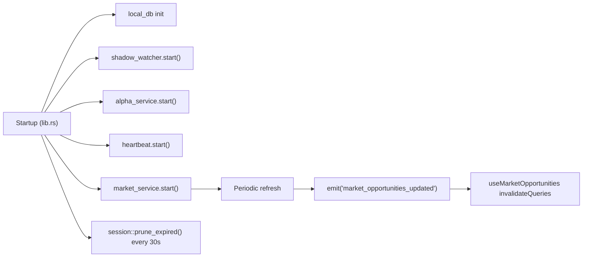
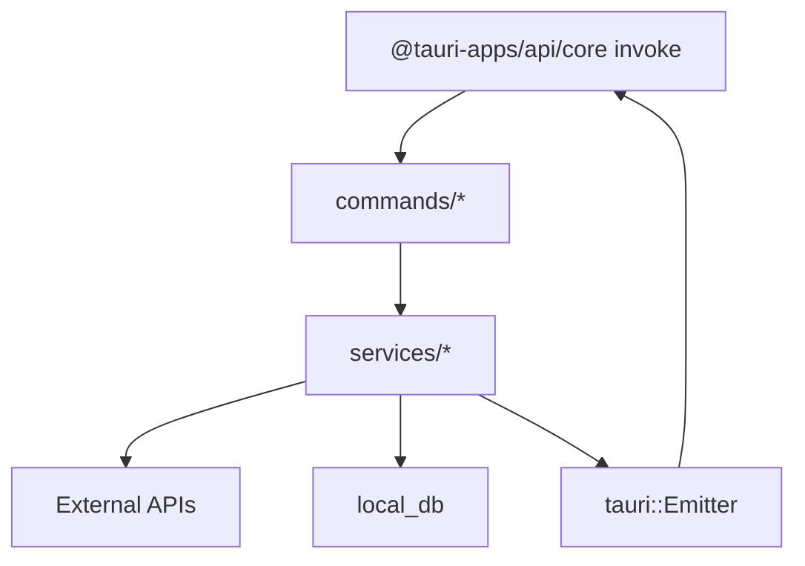

# Data Flow & Communication

<cite>
**Referenced Files in This Document**
- [src-tauri/src/lib.rs](file://src-tauri/src/lib.rs)
- [src-tauri/src/main.rs](file://src-tauri/src/main.rs)
- [src-tauri/src/commands/mod.rs](file://src-tauri/src/commands/mod.rs)
- [src-tauri/src/commands/wallet.rs](file://src-tauri/src/commands/wallet.rs)
- [src-tauri/src/commands/market.rs](file://src-tauri/src/commands/market.rs)
- [src-tauri/src/services/market_service.rs](file://src-tauri/src/services/market_service.rs)
- [src-tauri/src/services/portfolio_service.rs](file://src-tauri/src/services/portfolio_service.rs)
- [src/lib/tauri.ts](file://src/lib/tauri.ts)
- [src/lib/agent.ts](file://src/lib/agent.ts)
- [src/lib/market.ts](file://src/lib/market.ts)
- [src/store/useWalletStore.ts](file://src/store/useWalletStore.ts)
- [src/store/useAgentThreadStore.ts](file://src/store/useAgentThreadStore.ts)
- [src/hooks/useMarketOpportunities.ts](file://src/hooks/useMarketOpportunities.ts)
- [src/hooks/usePortfolio.ts](file://src/hooks/usePortfolio.ts)
</cite>

## Table of Contents
1. [Introduction](#introduction)
2. [Project Structure](#project-structure)
3. [Core Components](#core-components)
4. [Architecture Overview](#architecture-overview)
5. [Detailed Component Analysis](#detailed-component-analysis)
6. [Dependency Analysis](#dependency-analysis)
7. [Performance Considerations](#performance-considerations)
8. [Troubleshooting Guide](#troubleshooting-guide)
9. [Conclusion](#conclusion)
10. [Appendices](#appendices)

## Introduction
This document explains the hybrid architecture of SHADOW Protocol, focusing on the unidirectional data flow from frontend React components through Tauri commands to Rust backend services. It documents the command-response pattern for wallet operations, strategy execution, and market data retrieval, and details real-time streaming for market updates, portfolio changes, and agent communications. It also covers state synchronization between frontend stores and backend services, event-driven background tasks, health monitoring, and system notifications. The data transformation pipeline from blockchain RPC responses to frontend display formats is explained, along with caching strategies, optimistic updates, conflict resolution, and security considerations for data transmission, encryption at rest, and privacy-preserving handling.

## Project Structure
SHADOW Protocol uses a React frontend with Tauri as the native shell. The frontend invokes Tauri commands that route to Rust command handlers. These handlers delegate to service modules responsible for orchestrating external integrations (e.g., Alchemy, DefiLlama, Sonar), local database operations, and event emission. Background services periodically refresh market data and maintain system health.

**Diagram sources**
- [src-tauri/src/lib.rs:34-192](file://src-tauri/src/lib.rs#L34-L192)
- [src-tauri/src/main.rs:4-6](file://src-tauri/src/main.rs#L4-L6)
- [src-tauri/src/commands/mod.rs:1-27](file://src-tauri/src/commands/mod.rs#L1-L27)
- [src-tauri/src/services/market_service.rs:189-218](file://src-tauri/src/services/market_service.rs#L189-L218)
- [src-tauri/src/services/portfolio_service.rs:1-498](file://src-tauri/src/services/portfolio_service.rs#L1-L498)
- [src/lib/agent.ts:1-86](file://src/lib/agent.ts#L1-L86)
- [src/lib/market.ts:1-135](file://src/lib/market.ts#L1-L135)
- [src/store/useWalletStore.ts:1-48](file://src/store/useWalletStore.ts#L1-L48)
- [src/store/useAgentThreadStore.ts:1-642](file://src/store/useAgentThreadStore.ts#L1-L642)
- [src/hooks/useMarketOpportunities.ts:1-131](file://src/hooks/useMarketOpportunities.ts#L1-L131)
- [src/hooks/usePortfolio.ts:1-184](file://src/hooks/usePortfolio.ts#L1-L184)

**Section sources**
- [src-tauri/src/lib.rs:34-192](file://src-tauri/src/lib.rs#L34-L192)
- [src-tauri/src/main.rs:4-6](file://src-tauri/src/main.rs#L4-L6)
- [src-tauri/src/commands/mod.rs:1-27](file://src-tauri/src/commands/mod.rs#L1-L27)
- [src/lib/tauri.ts:1-4](file://src/lib/tauri.ts#L1-L4)

## Core Components
- Frontend stores and hooks:
  - Wallet store synchronizes addresses and active wallet with backend.
  - Agent thread store manages agent conversations, approvals, and streaming-like state transitions.
  - Market and portfolio hooks integrate with Tauri commands and React Query for caching and invalidation.
- Tauri command surface:
  - Wallet commands for creation, import, listing, removal, and sync status.
  - Market commands for fetching opportunities, refreshing, getting details, and preparing actions.
  - Portfolio commands for balances, transactions, NFTs, history, allocations, and performance summaries.
  - Agent commands for chat, approvals, pending approvals, execution logs, and memory/soul management.
- Backend services:
  - Market service orchestrates providers, ranks opportunities, caches results, and emits events.
  - Portfolio service queries Alchemy and Flow sidecar, merges results, and computes derived metrics.
  - Local database persists market provider runs, cached opportunities, and wallet sync timestamps.

**Section sources**
- [src/store/useWalletStore.ts:1-48](file://src/store/useWalletStore.ts#L1-L48)
- [src/store/useAgentThreadStore.ts:1-642](file://src/store/useAgentThreadStore.ts#L1-L642)
- [src/hooks/useMarketOpportunities.ts:1-131](file://src/hooks/useMarketOpportunities.ts#L1-L131)
- [src/hooks/usePortfolio.ts:1-184](file://src/hooks/usePortfolio.ts#L1-L184)
- [src-tauri/src/commands/wallet.rs:1-284](file://src-tauri/src/commands/wallet.rs#L1-L284)
- [src-tauri/src/commands/market.rs:1-36](file://src-tauri/src/commands/market.rs#L1-L36)
- [src-tauri/src/services/market_service.rs:189-365](file://src-tauri/src/services/market_service.rs#L189-L365)
- [src-tauri/src/services/portfolio_service.rs:131-269](file://src-tauri/src/services/portfolio_service.rs#L131-L269)

## Architecture Overview
The system follows a unidirectional data flow:
- Frontend triggers a Tauri command with typed input.
- The Tauri command handler validates input and delegates to a Rust service.
- Services perform external calls (RPC, HTTP), transform data, and persist/cache results.
- Services emit events for real-time updates.
- Frontend subscribes to events and invalidates React Query caches to synchronize state.

**Diagram sources**
- [src/lib/agent.ts:14-27](file://src/lib/agent.ts#L14-L27)
- [src/lib/market.ts:16-28](file://src/lib/market.ts#L16-L28)
- [src-tauri/src/lib.rs:90-192](file://src-tauri/src/lib.rs#L90-L192)
- [src-tauri/src/services/market_service.rs:263-365](file://src-tauri/src/services/market_service.rs#L263-L365)

## Detailed Component Analysis

### Wallet Operations: Command-Response and State Sync
- Frontend store:
  - Uses invoke to call wallet commands and updates local state.
  - Persists wallet names and active address.
- Backend commands:
  - Create/import/list/remove wallets; store private keys in OS keychain and biometric protection.
  - List addresses and manage address file for quick access without keychain prompts.
- State synchronization:
  - Frontend store refreshes addresses and reconciles active address after mutations.
  - Wallet sync is initiated at startup for stale addresses.

**Diagram sources**
- [src/store/useWalletStore.ts:23-37](file://src/store/useWalletStore.ts#L23-L37)
- [src-tauri/src/commands/wallet.rs:261-264](file://src-tauri/src/commands/wallet.rs#L261-L264)
- [src-tauri/src/lib.rs:65-87](file://src-tauri/src/lib.rs#L65-L87)

**Section sources**
- [src/store/useWalletStore.ts:1-48](file://src/store/useWalletStore.ts#L1-L48)
- [src-tauri/src/commands/wallet.rs:1-284](file://src-tauri/src/commands/wallet.rs#L1-L284)
- [src-tauri/src/lib.rs:65-87](file://src-tauri/src/lib.rs#L65-L87)

### Market Opportunities: Real-Time Streaming and Caching
- Frontend:
  - useMarketOpportunities integrates with Tauri events and React Query.
  - Subscribes to market_opportunities_updated and market_opportunities_refresh_failed.
  - Provides manual refresh and normalized wallet filtering.
- Backend:
  - Market service periodically refreshes opportunities, ranks candidates, and writes to local DB.
  - Emits market_opportunities_updated with generated_at and next_refresh_at.
  - Falls back to cached data on errors and marks stale when appropriate.
- Data transformation:
  - Converts provider records to compact MarketOpportunity structs and enriches with sources and rankings.

**Diagram sources**
- [src/hooks/useMarketOpportunities.ts:64-92](file://src/hooks/useMarketOpportunities.ts#L64-L92)
- [src/lib/market.ts:30-40](file://src/lib/market.ts#L30-L40)
- [src-tauri/src/commands/market.rs:15-21](file://src-tauri/src/commands/market.rs#L15-L21)
- [src-tauri/src/services/market_service.rs:263-365](file://src-tauri/src/services/market_service.rs#L263-L365)

**Section sources**
- [src/hooks/useMarketOpportunities.ts:1-131](file://src/hooks/useMarketOpportunities.ts#L1-L131)
- [src/lib/market.ts:1-135](file://src/lib/market.ts#L1-L135)
- [src-tauri/src/commands/market.rs:1-36](file://src-tauri/src/commands/market.rs#L1-L36)
- [src-tauri/src/services/market_service.rs:189-365](file://src-tauri/src/services/market_service.rs#L189-L365)

### Portfolio Data Retrieval: Mixed Chains and Derived Metrics
- Frontend:
  - usePortfolio uses React Query to fetch balances and history.
  - Supports single or multi-address queries and maps raw assets to display format.
- Backend:
  - Portfolio service queries Alchemy for EVM addresses and Flow sidecar for Cadence addresses.
  - Merges results, hydrates Flow prices, sorts by value, and computes chain breakdown and series.
- Data transformation:
  - Converts raw balances and prices to formatted strings and numeric series for charts.

**Diagram sources**
- [src/hooks/usePortfolio.ts:32-60](file://src/hooks/usePortfolio.ts#L32-L60)
- [src-tauri/src/services/portfolio_service.rs:131-269](file://src-tauri/src/services/portfolio_service.rs#L131-L269)

**Section sources**
- [src/hooks/usePortfolio.ts:1-184](file://src/hooks/usePortfolio.ts#L1-L184)
- [src-tauri/src/services/portfolio_service.rs:131-269](file://src-tauri/src/services/portfolio_service.rs#L131-L269)

### Agent Chat and Approval Workflow: Optimistic Updates and Conflict Resolution
- Frontend:
  - useAgentThreadStore manages message composition, streaming placeholders, and approval gating.
  - Integrates with Ollama store and wallet store to pass context.
  - Handles approval-required responses by opening a dedicated thread with approval payload.
- Backend:
  - chat_agent command routes to agent orchestration; approve_agent_action and reject_agent_action manage approvals.
  - get_pending_approvals and get_execution_log support dashboard and audit.
- Optimistic updates:
  - Frontend inserts a placeholder agent message immediately upon send, then replaces it with final blocks.
  - On approval, the thread appends a follow-up message reflecting the outcome.

**Diagram sources**
- [src/store/useAgentThreadStore.ts:198-533](file://src/store/useAgentThreadStore.ts#L198-L533)
- [src/lib/agent.ts:14-85](file://src/lib/agent.ts#L14-L85)
- [src-tauri/src/lib.rs:90-192](file://src-tauri/src/lib.rs#L90-L192)

**Section sources**
- [src/store/useAgentThreadStore.ts:1-642](file://src/store/useAgentThreadStore.ts#L1-L642)
- [src/lib/agent.ts:1-86](file://src/lib/agent.ts#L1-L86)

### Event-Driven Background Tasks, Health Monitoring, and Notifications
- Startup initialization:
  - Initializes local DB, starts shadow_watcher, alpha_service, heartbeat, market_service, and periodic cleanup.
- Periodic tasks:
  - Market service refreshes opportunities on intervals, alternating research inclusion.
  - Session pruning runs every 30 seconds.
- Events:
  - Market service emits market_opportunities_updated and market_opportunities_refresh_failed.
- Frontend subscription:
  - useMarketOpportunities listens to these events and invalidates queries to keep views synchronized.

**Diagram sources**
- [src-tauri/src/lib.rs:43-87](file://src-tauri/src/lib.rs#L43-L87)
- [src-tauri/src/services/market_service.rs:189-218](file://src-tauri/src/services/market_service.rs#L189-L218)
- [src/hooks/useMarketOpportunities.ts:64-92](file://src/hooks/useMarketOpportunities.ts#L64-L92)

**Section sources**
- [src-tauri/src/lib.rs:43-87](file://src-tauri/src/lib.rs#L43-L87)
- [src-tauri/src/services/market_service.rs:189-218](file://src-tauri/src/services/market_service.rs#L189-L218)
- [src/hooks/useMarketOpportunities.ts:64-92](file://src/hooks/useMarketOpportunities.ts#L64-L92)

## Dependency Analysis
- Frontend-to-Tauri:
  - Commands are registered in Tauri Builder and exposed to the webview.
  - Frontend uses @tauri-apps/api/core invoke with strongly-typed inputs and results.
- Tauri-to-Rust:
  - commands/* modules define tauri::command functions.
  - services/* modules encapsulate business logic and external integrations.
- Coupling and Cohesion:
  - High cohesion within services per domain (market, portfolio).
  - Loose coupling via typed command signatures and event emissions.
- External Dependencies:
  - Alchemy for EVM balances and prices.
  - DefiLlama and Sonar for market data and research.
  - OS keychain/biometry for secure key storage.

**Diagram sources**
- [src-tauri/src/lib.rs:90-192](file://src-tauri/src/lib.rs#L90-L192)
- [src-tauri/src/commands/mod.rs:1-27](file://src-tauri/src/commands/mod.rs#L1-L27)
- [src-tauri/src/services/market_service.rs:1-10](file://src-tauri/src/services/market_service.rs#L1-L10)
- [src-tauri/src/services/portfolio_service.rs:1-15](file://src-tauri/src/services/portfolio_service.rs#L1-L15)

**Section sources**
- [src-tauri/src/lib.rs:90-192](file://src-tauri/src/lib.rs#L90-L192)
- [src-tauri/src/commands/mod.rs:1-27](file://src-tauri/src/commands/mod.rs#L1-L27)

## Performance Considerations
- Caching:
  - Market service caches opportunities and provider runs; refresh respects freshness thresholds and alternates research inclusion.
  - Portfolio service sorts assets once per batch and avoids redundant conversions.
- Stale-while-revalidate:
  - Market responses include generated_at and next_refresh_at; UI can render stale data while refetching.
- Batch operations:
  - Multi-address portfolio queries reduce round trips.
- Event-driven invalidation:
  - React Query invalidation on market events prevents stale reads and reduces polling.

[No sources needed since this section provides general guidance]

## Troubleshooting Guide
- Market data not updating:
  - Verify market_service.start() ran and periodic refresh is occurring.
  - Check emitted events and ensure useMarketOpportunities is listening and invalidating queries.
- Portfolio balances missing:
  - Confirm Alchemy API key is configured and addresses are valid EVM addresses.
  - For Flow addresses, ensure the Flow sidecar is ready and returning assets.
- Wallet operations failing:
  - Check OS keychain availability and biometry prompts.
  - Validate address file persistence and migration from legacy keychain storage.
- Agent approvals stuck:
  - Inspect get_pending_approvals and ensure approve_agent_action is invoked with matching approvalId and expectedVersion.

**Section sources**
- [src-tauri/src/services/market_service.rs:263-365](file://src-tauri/src/services/market_service.rs#L263-L365)
- [src-tauri/src/services/portfolio_service.rs:271-314](file://src-tauri/src/services/portfolio_service.rs#L271-L314)
- [src-tauri/src/commands/wallet.rs:128-167](file://src-tauri/src/commands/wallet.rs#L128-L167)
- [src/hooks/useMarketOpportunities.ts:64-92](file://src/hooks/useMarketOpportunities.ts#L64-L92)

## Conclusion
SHADOW Protocol’s hybrid architecture cleanly separates concerns between the frontend and Rust backend. The unidirectional command-response pattern ensures predictable data flow, while event-driven updates enable real-time synchronization. Robust caching, derived metrics, and explicit state reconciliation provide responsive UX. Security is addressed through OS keychain and biometric storage for secrets, and privacy-preserving patterns such as event-driven invalidation minimize unnecessary data exposure.

[No sources needed since this section summarizes without analyzing specific files]

## Appendices

### Data Transformation Pipeline: From RPC to Display
- Market:
  - Provider candidates are fetched, ranked, and persisted to local DB.
  - Frontend receives compact MarketOpportunity structs enriched with sources and rankings.
- Portfolio:
  - EVM balances via Alchemy; Flow balances via sidecar.
  - Raw balances and prices converted to formatted strings and sorted for display.
  - Chain breakdown and series computed for charts.

**Section sources**
- [src-tauri/src/services/market_service.rs:292-365](file://src-tauri/src/services/market_service.rs#L292-L365)
- [src-tauri/src/services/portfolio_service.rs:271-418](file://src-tauri/src/services/portfolio_service.rs#L271-L418)

### Security Considerations
- Data transmission:
  - All Tauri commands operate inside the native shell; sensitive operations are scoped to the backend.
- Encryption at rest:
  - Private keys stored in OS keychain; optional biometric protection.
- Privacy:
  - Local DB caches opportunities and provider runs; wallet addresses are sanitized and filtered.
  - Agent memory and soul are managed via dedicated commands with typed payloads.

**Section sources**
- [src-tauri/src/commands/wallet.rs:128-167](file://src-tauri/src/commands/wallet.rs#L128-L167)
- [src-tauri/src/services/market_service.rs:561-624](file://src-tauri/src/services/market_service.rs#L561-L624)