# Frontend Architecture

<cite>
**Referenced Files in This Document**
- [src/App.tsx](file://src/App.tsx)
- [src/main.tsx](file://src/main.tsx)
- [src/routes.tsx](file://src/routes.tsx)
- [src/components/layout/AppShell.tsx](file://src/components/layout/AppShell.tsx)
- [src/components/layout/MainContent.tsx](file://src/components/layout/MainContent.tsx)
- [src/components/agent/AgentWorkspace.tsx](file://src/components/agent/AgentWorkspace.tsx)
- [src/components/strategy/StrategyBuilder.tsx](file://src/components/strategy/StrategyBuilder.tsx)
- [src/components/portfolio/PortfolioView.tsx](file://src/components/portfolio/PortfolioView.tsx)
- [src/store/useUiStore.ts](file://src/store/useUiStore.ts)
- [src/store/useWalletStore.ts](file://src/store/useWalletStore.ts)
- [src/hooks/useToast.ts](file://src/hooks/useToast.ts)
- [src/lib/tauri.ts](file://src/lib/tauri.ts)
- [src/styles/globals.css](file://src/styles/globals.css)
- [components.json](file://components.json)
- [src/components/ui/button.tsx](file://src/components/ui/button.tsx)
</cite>

## Table of Contents
1. [Introduction](#introduction)
2. [Project Structure](#project-structure)
3. [Core Components](#core-components)
4. [Architecture Overview](#architecture-overview)
5. [Detailed Component Analysis](#detailed-component-analysis)
6. [Dependency Analysis](#dependency-analysis)
7. [Performance Considerations](#performance-considerations)
8. [Troubleshooting Guide](#troubleshooting-guide)
9. [Conclusion](#conclusion)
10. [Appendices](#appendices)

## Introduction
This document describes the frontend architecture of the SHADOW Protocol React 19 application. It covers the component hierarchy starting from the AppShell layout system, specialized views such as AgentWorkspace, StrategyBuilder, and PortfolioView, the routing system using a hash router with dynamic route resolution, state management combining Zustand stores for UI state and TanStack Query for server state synchronization, the design system built on shadcn/ui with custom glassmorphic styling, component composition patterns, context-free state sharing via stores, reactivity patterns, frontend-backend communication through the Tauri command system, and responsive design and accessibility considerations.

## Project Structure
The application bootstraps with a TanStack Query provider at the root, mounts a RouterProvider configured with a hash router, and renders the AppShell as the primary layout container. The AppShell composes top bar, main content area, dock, activity bell, and global modals. Specialized views are nested under AppShell’s children.

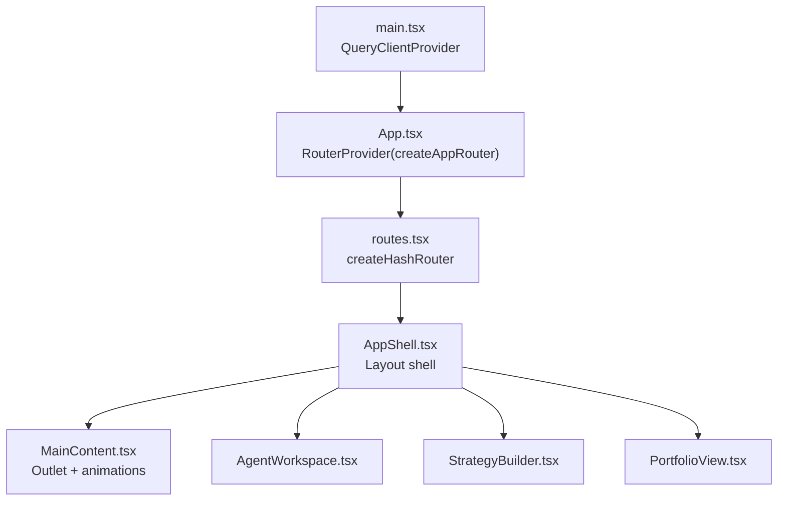

**Diagram sources**
- [src/main.tsx:1-17](file://src/main.tsx#L1-L17)
- [src/App.tsx:1-49](file://src/App.tsx#L1-L49)
- [src/routes.tsx:1-33](file://src/routes.tsx#L1-L33)
- [src/components/layout/AppShell.tsx:1-277](file://src/components/layout/AppShell.tsx#L1-L277)
- [src/components/layout/MainContent.tsx:1-34](file://src/components/layout/MainContent.tsx#L1-L34)
- [src/components/agent/AgentWorkspace.tsx:1-65](file://src/components/agent/AgentWorkspace.tsx#L1-L65)
- [src/components/strategy/StrategyBuilder.tsx:1-287](file://src/components/strategy/StrategyBuilder.tsx#L1-L287)
- [src/components/portfolio/PortfolioView.tsx:1-301](file://src/components/portfolio/PortfolioView.tsx#L1-L301)

**Section sources**
- [src/main.tsx:1-17](file://src/main.tsx#L1-L17)
- [src/App.tsx:1-49](file://src/App.tsx#L1-L49)
- [src/routes.tsx:1-33](file://src/routes.tsx#L1-L33)

## Core Components
- AppShell: Central layout orchestrator that manages theme, session unlock flow, global modals, command palette, and wallet sync listeners. It also wires up Tauri invocations for session status checks and Ollama setup gating.
- MainContent: Animated outlet wrapper around child routes with responsive padding and safe-area adjustments.
- AgentWorkspace: Chat-centric view with thread sidebar and responsive drawer.
- StrategyBuilder: Canvas-based strategy editor with validation, guardrails, and simulation panels.
- PortfolioView: Multi-tab dashboard for assets, NFTs, and transactions with filtering, sorting, and action modals.

**Section sources**
- [src/components/layout/AppShell.tsx:1-277](file://src/components/layout/AppShell.tsx#L1-L277)
- [src/components/layout/MainContent.tsx:1-34](file://src/components/layout/MainContent.tsx#L1-L34)
- [src/components/agent/AgentWorkspace.tsx:1-65](file://src/components/agent/AgentWorkspace.tsx#L1-L65)
- [src/components/strategy/StrategyBuilder.tsx:1-287](file://src/components/strategy/StrategyBuilder.tsx#L1-L287)
- [src/components/portfolio/PortfolioView.tsx:1-301](file://src/components/portfolio/PortfolioView.tsx#L1-L301)

## Architecture Overview
The frontend uses a layered architecture:
- Presentation Layer: React 19 components organized by feature (agent, strategy, portfolio, layout).
- Routing Layer: Hash router with nested routes under AppShell.
- State Management Layer: Zustand stores for UI state and TanStack Query for server state synchronization.
- Design System Layer: shadcn/ui primitives with custom utilities for glassmorphism and noise overlays.
- Backend Integration Layer: Tauri commands invoked via @tauri-apps/api for wallet, session, and service operations.

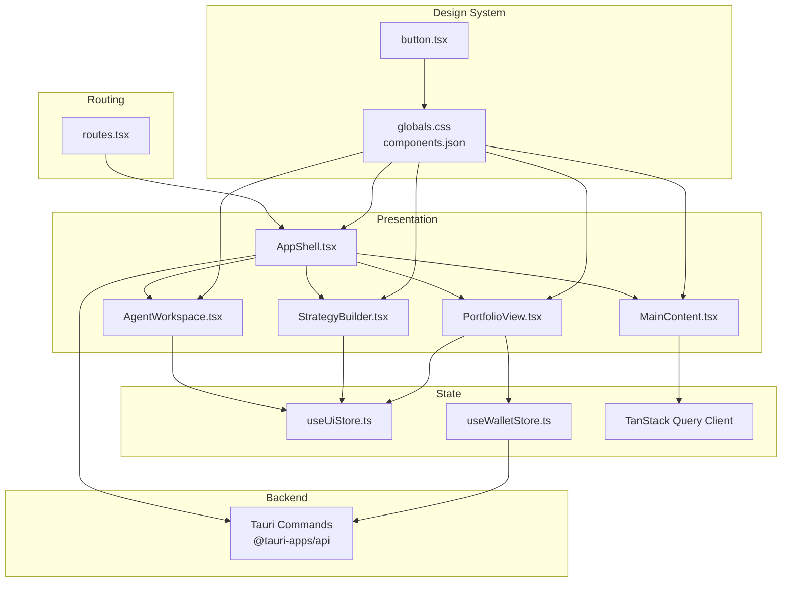

**Diagram sources**
- [src/routes.tsx:1-33](file://src/routes.tsx#L1-L33)
- [src/components/layout/AppShell.tsx:1-277](file://src/components/layout/AppShell.tsx#L1-L277)
- [src/components/layout/MainContent.tsx:1-34](file://src/components/layout/MainContent.tsx#L1-L34)
- [src/components/agent/AgentWorkspace.tsx:1-65](file://src/components/agent/AgentWorkspace.tsx#L1-L65)
- [src/components/strategy/StrategyBuilder.tsx:1-287](file://src/components/strategy/StrategyBuilder.tsx#L1-L287)
- [src/components/portfolio/PortfolioView.tsx:1-301](file://src/components/portfolio/PortfolioView.tsx#L1-L301)
- [src/store/useUiStore.ts:1-162](file://src/store/useUiStore.ts#L1-L162)
- [src/store/useWalletStore.ts:1-48](file://src/store/useWalletStore.ts#L1-L48)
- [src/styles/globals.css:1-144](file://src/styles/globals.css#L1-L144)
- [components.json:1-22](file://components.json#L1-L22)
- [src/components/ui/button.tsx:1-65](file://src/components/ui/button.tsx#L1-L65)

## Detailed Component Analysis

### AppShell Layout and Global Orchestration
AppShell centralizes:
- Theme resolution and persistence via dataset attributes.
- Wallet refresh lifecycle and active address management.
- Session status polling and unlock dialog orchestration.
- Global modals: approval, command palette, brief, panic, Ollama setup, and initialization sequence.
- Toast notifications via a thin hook that writes to the UI store.
- Tauri runtime detection and developer context menu gating.

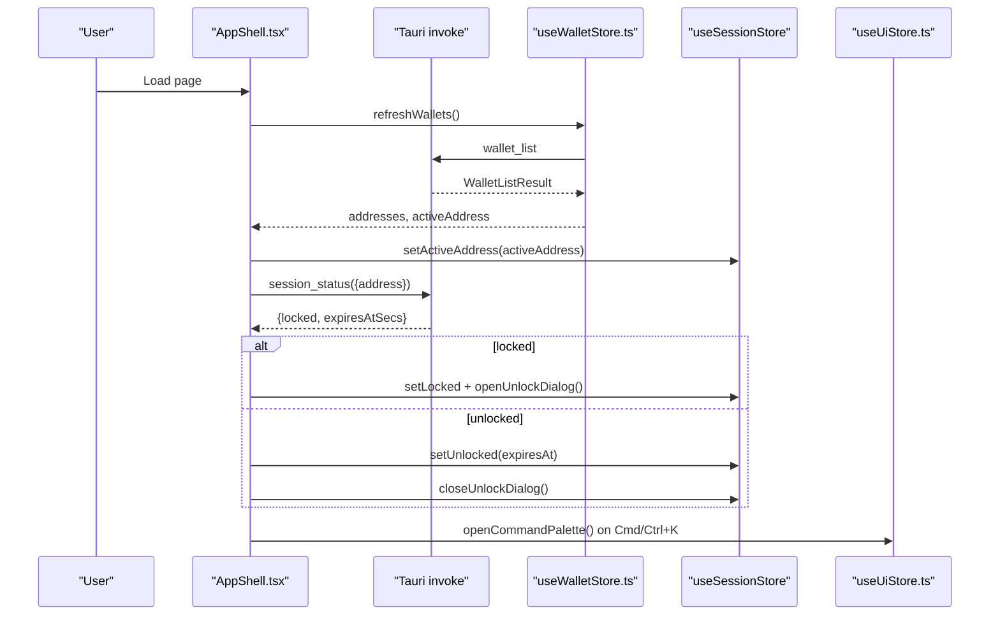

**Diagram sources**
- [src/components/layout/AppShell.tsx:70-146](file://src/components/layout/AppShell.tsx#L70-L146)
- [src/store/useWalletStore.ts:23-37](file://src/store/useWalletStore.ts#L23-L37)
- [src/store/useUiStore.ts:101-102](file://src/store/useUiStore.ts#L101-L102)

**Section sources**
- [src/components/layout/AppShell.tsx:1-277](file://src/components/layout/AppShell.tsx#L1-L277)
- [src/store/useWalletStore.ts:1-48](file://src/store/useWalletStore.ts#L1-L48)
- [src/store/useUiStore.ts:1-162](file://src/store/useUiStore.ts#L1-L162)
- [src/lib/tauri.ts:1-4](file://src/lib/tauri.ts#L1-L4)

### Routing and Dynamic Resolution
The application uses a hash router with nested routes under AppShell. The router definition imports specialized views and sets up the layout tree.

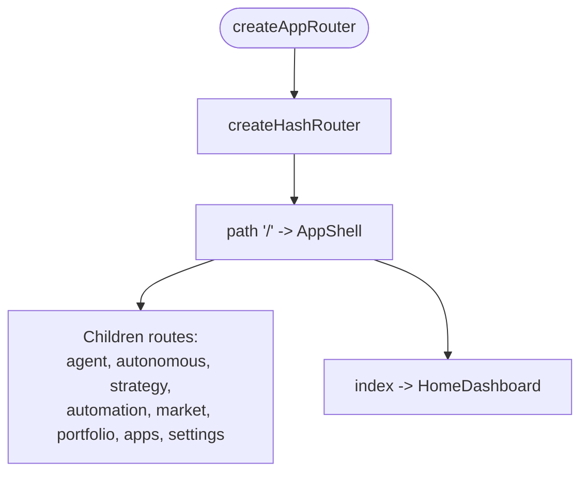

**Diagram sources**
- [src/routes.tsx:14-32](file://src/routes.tsx#L14-L32)

**Section sources**
- [src/routes.tsx:1-33](file://src/routes.tsx#L1-L33)

### AgentWorkspace Composition Patterns
AgentWorkspace demonstrates:
- Responsive sidebar and mobile drawer pattern.
- Conditional rendering of thread list vs. chat based on screen size.
- Motion transitions for drawer overlay and panel.

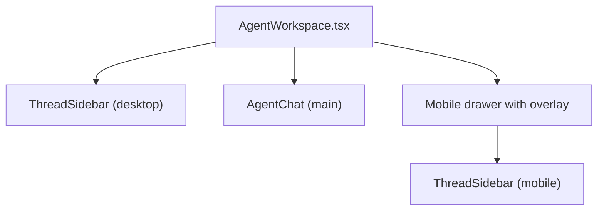

**Diagram sources**
- [src/components/agent/AgentWorkspace.tsx:10-64](file://src/components/agent/AgentWorkspace.tsx#L10-L64)

**Section sources**
- [src/components/agent/AgentWorkspace.tsx:1-65](file://src/components/agent/AgentWorkspace.tsx#L1-L65)

### StrategyBuilder Editor and Validation UX
StrategyBuilder coordinates:
- Draft state, selection, and canvas updates via a dedicated hook.
- Validation errors mapped to inspector issues and navigation helpers.
- Guardrails editing and simulation panels.
- Save and activation flows with toasts.

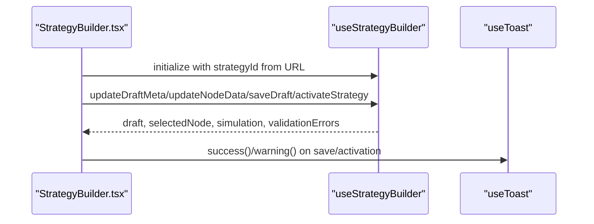

**Diagram sources**
- [src/components/strategy/StrategyBuilder.tsx:25-148](file://src/components/strategy/StrategyBuilder.tsx#L25-L148)

**Section sources**
- [src/components/strategy/StrategyBuilder.tsx:1-287](file://src/components/strategy/StrategyBuilder.tsx#L1-L287)

### PortfolioView Data Flow and Modals
PortfolioView integrates:
- Portfolio, NFTs, and transactions via dedicated hooks.
- Filtering, sorting, and developer-mode toggles.
- Action modals (send, swap, bridge) coordinated via the UI store.

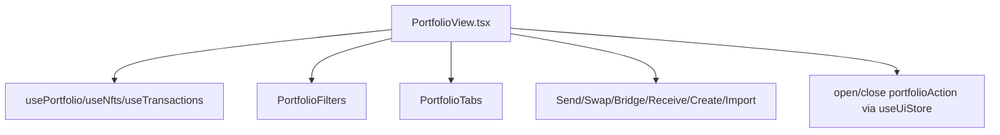

**Diagram sources**
- [src/components/portfolio/PortfolioView.tsx:33-298](file://src/components/portfolio/PortfolioView.tsx#L33-L298)

**Section sources**
- [src/components/portfolio/PortfolioView.tsx:1-301](file://src/components/portfolio/PortfolioView.tsx#L1-L301)

### State Management: Zustand Stores and TanStack Query
- UI Store: Manages theme preference, sidebar state, command palette, notifications, pending approvals, and panic modals. Persisted partially to localStorage.
- Wallet Store: Manages addresses, active address, and wallet names; refreshes via Tauri invoke.
- TanStack Query: Bootstrapped at root; specialized hooks fetch and cache server-side data for portfolio, NFTs, transactions, and apps.

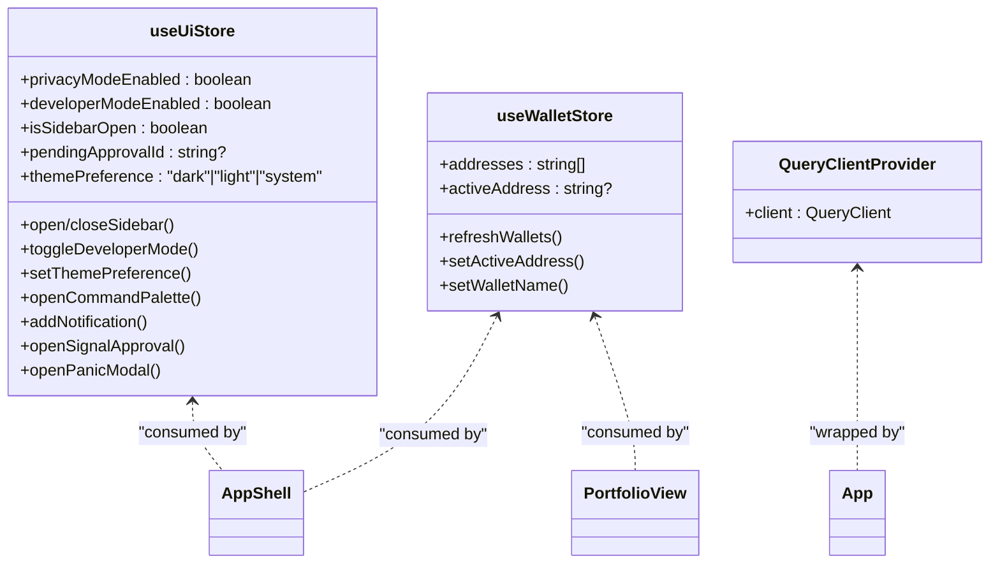

**Diagram sources**
- [src/store/useUiStore.ts:28-159](file://src/store/useUiStore.ts#L28-L159)
- [src/store/useWalletStore.ts:7-47](file://src/store/useWalletStore.ts#L7-L47)
- [src/main.tsx:8-16](file://src/main.tsx#L8-L16)

**Section sources**
- [src/store/useUiStore.ts:1-162](file://src/store/useUiStore.ts#L1-L162)
- [src/store/useWalletStore.ts:1-48](file://src/store/useWalletStore.ts#L1-L48)
- [src/main.tsx:1-17](file://src/main.tsx#L1-L17)

### Design System and Glassmorphic Styling
The design system is based on shadcn/ui with custom Tailwind utilities:
- Tailwind theme tokens mapped to CSS variables for background, surface, foreground, borders, and accents.
- Glassmorphic panels via a custom utility that applies backdrop blur and translucent borders.
- Noise overlay texture and subtle grid patterns for depth.
- Button variants and sizes standardized via a component library.

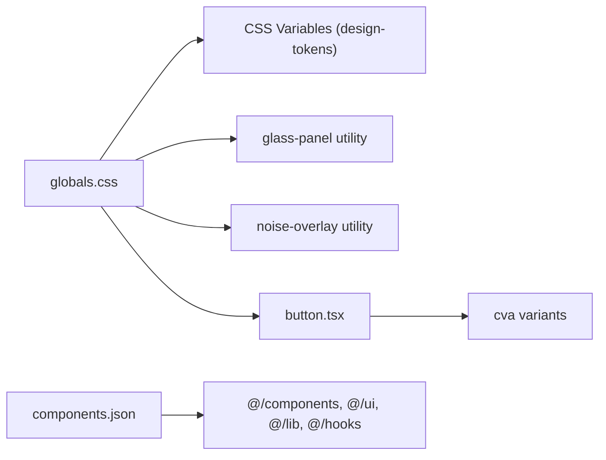

**Diagram sources**
- [src/styles/globals.css:1-144](file://src/styles/globals.css#L1-L144)
- [components.json:1-22](file://components.json#L1-L22)
- [src/components/ui/button.tsx:7-39](file://src/components/ui/button.tsx#L7-L39)

**Section sources**
- [src/styles/globals.css:1-144](file://src/styles/globals.css#L1-L144)
- [components.json:1-22](file://components.json#L1-L22)
- [src/components/ui/button.tsx:1-65](file://src/components/ui/button.tsx#L1-L65)

### Frontend-Backend Communication via Tauri
Asynchronous operations are handled through Tauri commands invoked via @tauri-apps/api:
- Wallet listing and active address management.
- Session status checks to gate unlock dialogs.
- Ollama status checks and model selection fallbacks.
- Wallet sync listeners and alert listeners are wired in AppShell.

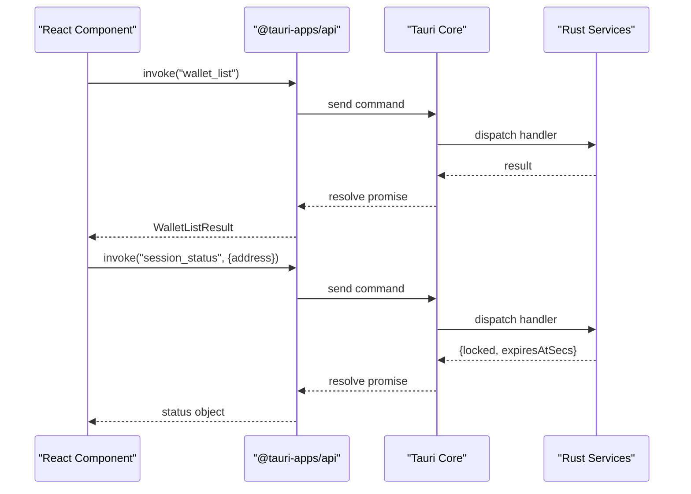

**Diagram sources**
- [src/store/useWalletStore.ts:23-37](file://src/store/useWalletStore.ts#L23-L37)
- [src/components/layout/AppShell.tsx:125-145](file://src/components/layout/AppShell.tsx#L125-L145)

**Section sources**
- [src/store/useWalletStore.ts:1-48](file://src/store/useWalletStore.ts#L1-L48)
- [src/components/layout/AppShell.tsx:1-277](file://src/components/layout/AppShell.tsx#L1-L277)

### Accessibility and Responsive Design
- Responsive breakpoints adjust padding, bottom safe-area insets, and layout spacing for agent and non-agent pages.
- Focus-visible ring and keyboard-accessible command palette shortcut (Cmd/Ctrl+K).
- Semantic markup and aria labels for interactive elements.
- Motion transitions use Framer Motion with easing and spring configurations for smooth UX.
- Theme-aware color-scheme switching and reduced motion considerations via CSS variables.

**Section sources**
- [src/components/layout/MainContent.tsx:6-33](file://src/components/layout/MainContent.tsx#L6-L33)
- [src/components/layout/AppShell.tsx:154-176](file://src/components/layout/AppShell.tsx#L154-L176)
- [src/styles/globals.css:40-52](file://src/styles/globals.css#L40-L52)

## Dependency Analysis
The frontend exhibits low coupling and high cohesion:
- AppShell depends on multiple stores and hooks but delegates feature-specific concerns to specialized views.
- Routes are centralized and declarative, minimizing runtime branching.
- Stores encapsulate side effects (Tauri invokes) and UI state, preventing prop drilling.
- Design system utilities are consumed globally via Tailwind layers.

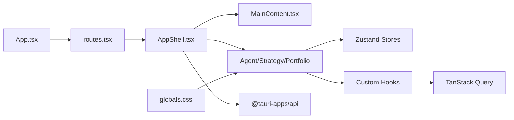

**Diagram sources**
- [src/App.tsx:1-49](file://src/App.tsx#L1-L49)
- [src/routes.tsx:14-32](file://src/routes.tsx#L14-L32)
- [src/components/layout/AppShell.tsx:1-277](file://src/components/layout/AppShell.tsx#L1-L277)
- [src/components/layout/MainContent.tsx:1-34](file://src/components/layout/MainContent.tsx#L1-L34)
- [src/styles/globals.css:1-144](file://src/styles/globals.css#L1-L144)

**Section sources**
- [src/App.tsx:1-49](file://src/App.tsx#L1-L49)
- [src/routes.tsx:1-33](file://src/routes.tsx#L1-L33)
- [src/components/layout/AppShell.tsx:1-277](file://src/components/layout/AppShell.tsx#L1-L277)

## Performance Considerations
- Memoization: AppShell resolves theme via useMemo; PortfolioView computes filtered assets and selected asset via useMemo to avoid unnecessary re-renders.
- Lazy loading: AnimatePresence defers rendering of off-screen routes until needed.
- Efficient lists: PortfolioView uses skeleton loaders and empty states to maintain perceived performance.
- Store granularity: Splitting UI state (useUiStore) from domain state (useWalletStore) reduces re-renders across unrelated features.
- TanStack Query: Automatic caching and background refetching minimize redundant network calls.

**Section sources**
- [src/components/layout/AppShell.tsx:60-68](file://src/components/layout/AppShell.tsx#L60-L68)
- [src/components/portfolio/PortfolioView.tsx:67-96](file://src/components/portfolio/PortfolioView.tsx#L67-L96)
- [src/components/layout/MainContent.tsx:19-30](file://src/components/layout/MainContent.tsx#L19-L30)

## Troubleshooting Guide
- Developer context menu: Only available when Tauri runtime exists and developer mode is enabled; controlled by UI store and runtime detection.
- Session lock: If session_status fails or returns locked, the unlock dialog opens automatically; ensure backend services are reachable.
- Ollama setup: AppShell checks installation, running status, and models; if missing, the setup modal opens and model fallback occurs.
- Toast notifications: useToast writes to the UI store; verify notifications array and unread flags if alerts are not visible.
- Wallet refresh: If addresses are empty, ensure wallet_list command succeeds and active address is restored.

**Section sources**
- [src/App.tsx:13-32](file://src/App.tsx#L13-L32)
- [src/components/layout/AppShell.tsx:81-117](file://src/components/layout/AppShell.tsx#L81-L117)
- [src/components/layout/AppShell.tsx:119-146](file://src/components/layout/AppShell.tsx#L119-L146)
- [src/hooks/useToast.ts:1-33](file://src/hooks/useToast.ts#L1-L33)
- [src/store/useWalletStore.ts:23-37](file://src/store/useWalletStore.ts#L23-L37)

## Conclusion
The SHADOW Protocol frontend leverages a clean separation of concerns: a robust layout shell, feature-specific views, a centralized routing system, and a dual-layer state management strategy. The design system emphasizes glassmorphism and responsiveness, while Tauri enables secure desktop-native integrations. The architecture supports scalability, maintainability, and a polished user experience across devices and workflows.

## Appendices
- Toast abstraction: A small hook that normalizes success/info/warning notifications into the UI store for consistent presentation.
- Button component: A standardized button primitive with variants and sizes, enabling consistent interaction affordances across the app.

**Section sources**
- [src/hooks/useToast.ts:1-33](file://src/hooks/useToast.ts#L1-L33)
- [src/components/ui/button.tsx:1-65](file://src/components/ui/button.tsx#L1-L65)