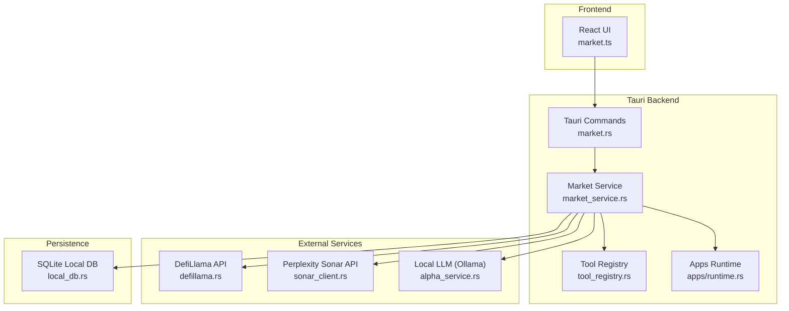
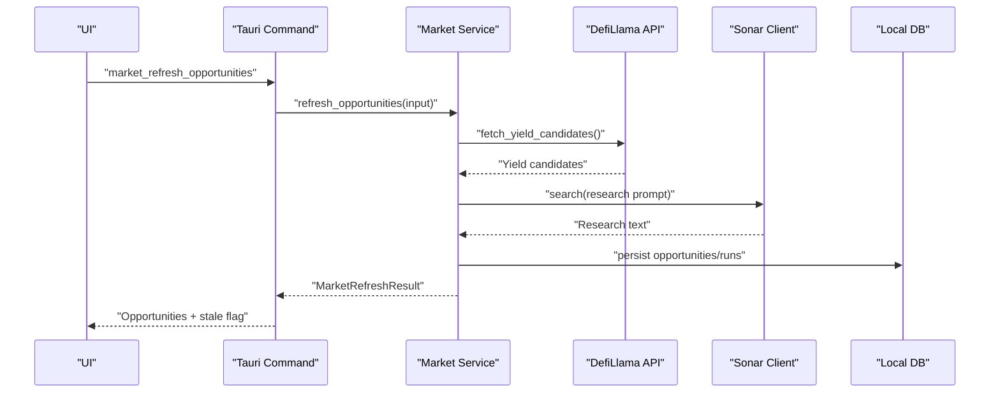
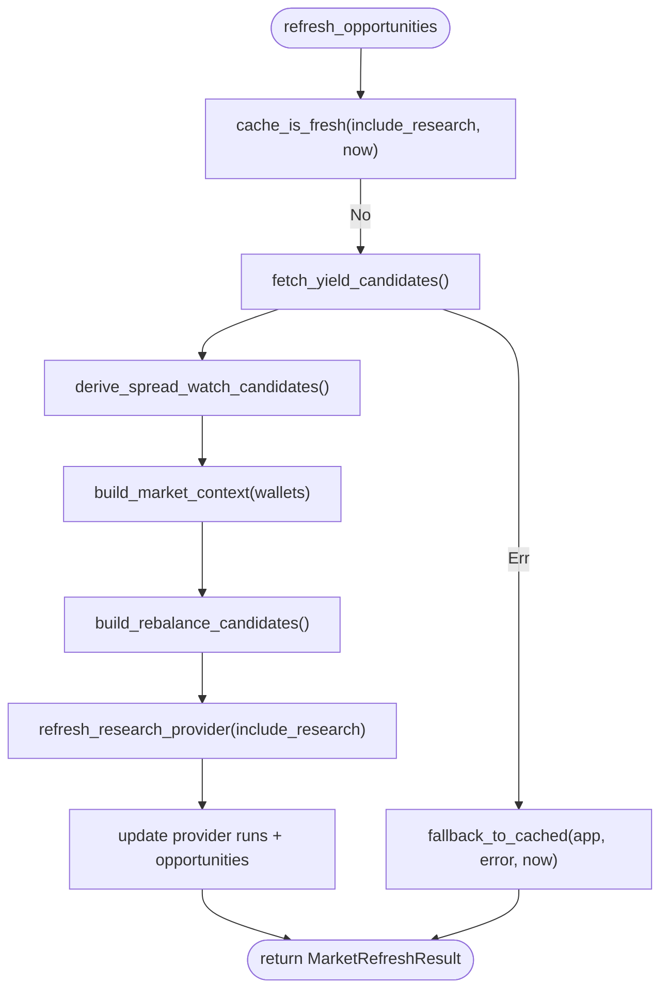
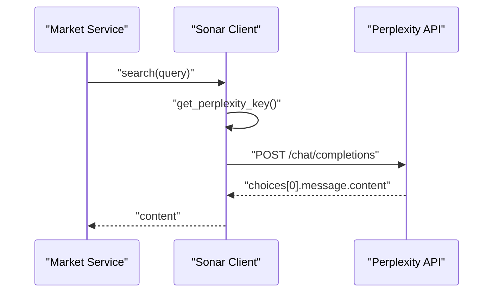
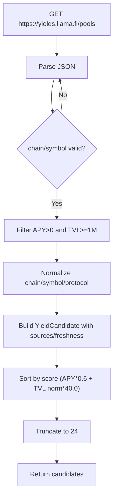
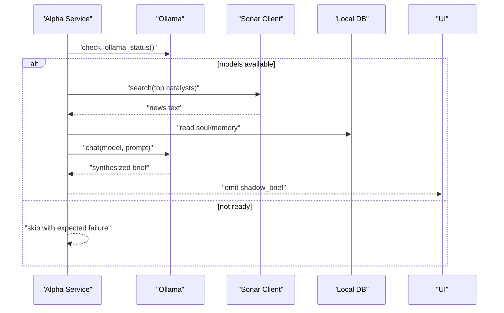
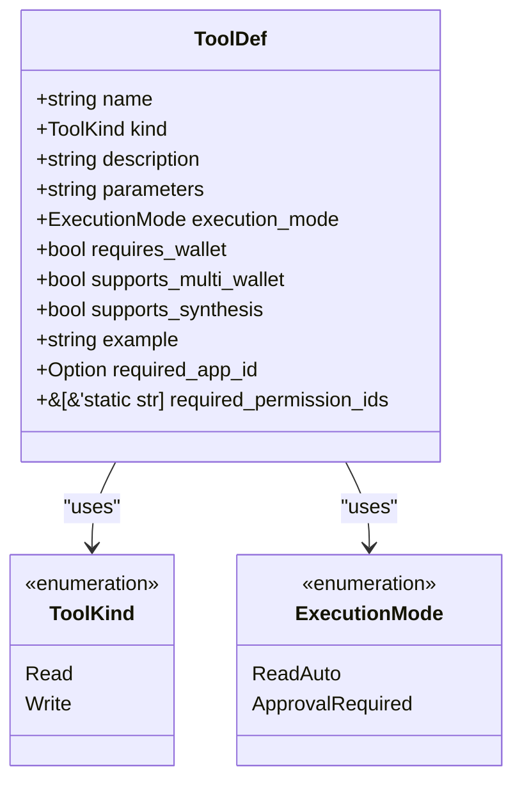
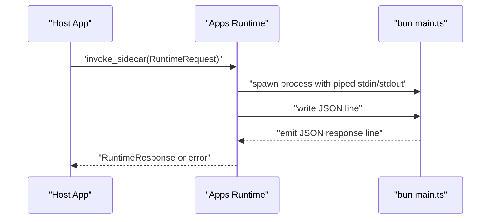
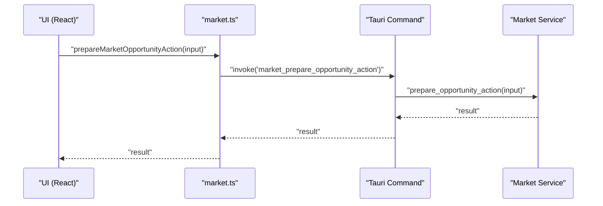
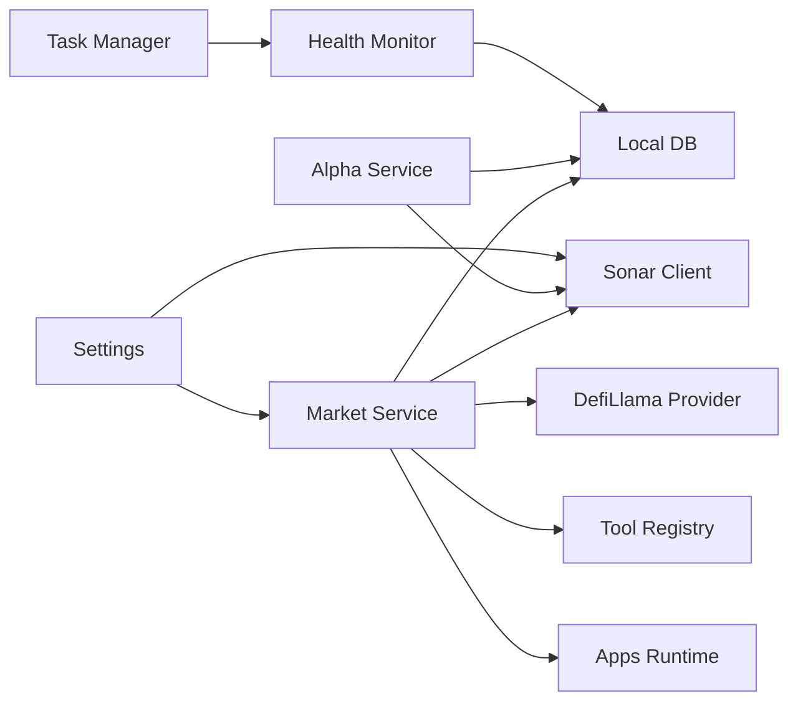

# Integration Patterns

<cite>
**Referenced Files in This Document**
- [market_service.rs](file://src-tauri/src/services/market_service.rs)
- [market_provider/research.rs](file://src-tauri/src/services/market_provider/research.rs)
- [market_provider/defillama.rs](file://src-tauri/src/services/market_provider/defillama.rs)
- [sonar_client.rs](file://src-tauri/src/services/sonar_client.rs)
- [alpha_service.rs](file://src-tauri/src/services/alpha_service.rs)
- [settings.rs](file://src-tauri/src/services/settings.rs)
- [tool_registry.rs](file://src-tauri/src/services/tool_registry.rs)
- [tools/mod.rs](file://src-tauri/src/services/tools/mod.rs)
- [market.rs](file://src-tauri/src/commands/market.rs)
- [market.ts](file://src/lib/market.ts)
- [apps/runtime.rs](file://src-tauri/src/services/apps/runtime.rs)
- [apps/registry.rs](file://src-tauri/src/services/apps/registry.rs)
- [apps.ts](file://src/lib/apps.ts)
- [local_db.rs](file://src-tauri/src/services/local_db.rs)
- [health_monitor.rs](file://src-tauri/src/services/health_monitor.rs)
- [task_manager.rs](file://src-tauri/src/services/task_manager.rs)
- [strategy_scheduler.rs](file://src-tauri/src/services/strategy_scheduler.rs)
</cite>

## Table of Contents
1. [Introduction](#introduction)
2. [Project Structure](#project-structure)
3. [Core Components](#core-components)
4. [Architecture Overview](#architecture-overview)
5. [Detailed Component Analysis](#detailed-component-analysis)
6. [Dependency Analysis](#dependency-analysis)
7. [Performance Considerations](#performance-considerations)
8. [Troubleshooting Guide](#troubleshooting-guide)
9. [Conclusion](#conclusion)
10. [Appendices](#appendices)

## Introduction
This document describes SHADOW Protocol’s integration patterns for connecting to external services. It covers:
- Blockchain RPC provider integration via Alchemy (via settings and environment fallback)
- DeFi protocol APIs (DefiLlama yield data)
- Market intelligence services (Perplexity Sonar)
- Alpha research synthesis using local LLMs
- The tool registry pattern enabling extensible market action execution
- Service client architecture for Sonar, Alpha, and external API integrations
- Plugin architecture for apps runtime providers
- Fallback mechanisms, retries, error handling, rate limiting, caching, and performance optimization
- Security considerations for credentials, API key rotation, and secure communication
- Monitoring and alerting for external service health and availability

## Project Structure
The integration logic spans Rust backend services, Tauri commands, TypeScript frontend bindings, and SQLite persistence. Key areas:
- Services: market data aggregation, Sonar client, Alpha synthesis, settings/keychain, health monitoring, task generation
- Commands: Tauri bridge exposing market operations to the UI
- Tools: centralized tool registry with standardized interfaces
- Apps runtime: isolated Node/Bun sidecar for third-party integrations
- Persistence: local DB for cached opportunities, runs, approvals, and health records

**Diagram sources**
- [market_service.rs:1-316](file://src-tauri/src/services/market_service.rs#L1-L316)
- [market_provider/defillama.rs:1-151](file://src-tauri/src/services/market_provider/defillama.rs#L1-L151)
- [market_provider/research.rs:1-50](file://src-tauri/src/services/market_provider/research.rs#L1-L50)
- [sonar_client.rs:1-78](file://src-tauri/src/services/sonar_client.rs#L1-L78)
- [alpha_service.rs:1-143](file://src-tauri/src/services/alpha_service.rs#L1-L143)
- [tool_registry.rs:1-313](file://src-tauri/src/services/tool_registry.rs#L1-L313)
- [apps/runtime.rs:1-144](file://src-tauri/src/services/apps/runtime.rs#L1-L144)
- [local_db.rs:180-200](file://src-tauri/src/services/local_db.rs#L180-L200)

**Section sources**
- [market_service.rs:1-316](file://src-tauri/src/services/market_service.rs#L1-L316)
- [market_provider/defillama.rs:1-151](file://src-tauri/src/services/market_provider/defillama.rs#L1-L151)
- [market_provider/research.rs:1-50](file://src-tauri/src/services/market_provider/research.rs#L1-L50)
- [sonar_client.rs:1-78](file://src-tauri/src/services/sonar_client.rs#L1-L78)
- [alpha_service.rs:1-143](file://src-tauri/src/services/alpha_service.rs#L1-L143)
- [tool_registry.rs:1-313](file://src-tauri/src/services/tool_registry.rs#L1-L313)
- [apps/runtime.rs:1-144](file://src-tauri/src/services/apps/runtime.rs#L1-L144)
- [local_db.rs:180-200](file://src-tauri/src/services/local_db.rs#L180-L200)

## Core Components
- Market Service orchestrates fetching opportunities from DefiLlama, enriching with Sonar research, ranking, and caching. It emits UI events and falls back to cached data on errors.
- Sonar Client encapsulates Perplexity Sonar API requests with timeouts and bearer token retrieval from settings.
- DefiLlama Provider fetches yield pools, normalizes chains and symbols, filters by thresholds, and sorts candidates.
- Alpha Service periodically synthesizes a “Daily Alpha Brief” using Sonar and a local LLM, emitting results to the UI.
- Tool Registry defines standardized tool schemas, execution modes, and permission gating for read/write actions.
- Apps Runtime spawns a Bun sidecar per request to isolate third-party integrations and enforce timeouts.
- Settings manage API keys via a keychain with in-memory caching and environment variable fallback.
- Health Monitor computes portfolio health, generates alerts, persists records, and integrates with task generation.

**Section sources**
- [market_service.rs:12-316](file://src-tauri/src/services/market_service.rs#L12-L316)
- [sonar_client.rs:33-77](file://src-tauri/src/services/sonar_client.rs#L33-L77)
- [market_provider/defillama.rs:27-116](file://src-tauri/src/services/market_provider/defillama.rs#L27-L116)
- [alpha_service.rs:27-130](file://src-tauri/src/services/alpha_service.rs#L27-L130)
- [tool_registry.rs:3-313](file://src-tauri/src/services/tool_registry.rs#L3-L313)
- [apps/runtime.rs:69-131](file://src-tauri/src/services/apps/runtime.rs#L69-L131)
- [settings.rs:20-102](file://src-tauri/src/services/settings.rs#L20-L102)
- [health_monitor.rs:107-221](file://src-tauri/src/services/health_monitor.rs#L107-L221)

## Architecture Overview
The integration architecture follows a layered design:
- UI invokes Tauri commands
- Commands delegate to Market Service
- Market Service calls external providers (DefiLlama, Sonar) and local LLM (Alpha)
- Results are normalized, ranked, cached, and emitted to the UI
- Tools are dispatched via the Tool Registry with approval gating
- Apps Runtime isolates third-party integrations

**Diagram sources**
- [market.rs:15-21](file://src-tauri/src/commands/market.rs#L15-L21)
- [market_service.rs:286-316](file://src-tauri/src/services/market_service.rs#L286-L316)
- [market_provider/defillama.rs:27-116](file://src-tauri/src/services/market_provider/defillama.rs#L27-L116)
- [market_provider/research.rs:23-50](file://src-tauri/src/services/market_provider/research.rs#L23-L50)
- [local_db.rs:180-200](file://src-tauri/src/services/local_db.rs#L180-L200)

## Detailed Component Analysis

### Market Service Integration
- Fetches yield candidates from DefiLlama, derives spread watch candidates, and optionally includes Sonar research.
- Uses a refresh interval and cache freshness checks to avoid redundant calls.
- Emits UI events on refresh failure and serves cached results when available.

**Diagram sources**
- [market_service.rs:561-624](file://src-tauri/src/services/market_service.rs#L561-L624)
- [market_provider/defillama.rs:27-116](file://src-tauri/src/services/market_provider/defillama.rs#L27-L116)
- [market_provider/research.rs:23-50](file://src-tauri/src/services/market_provider/research.rs#L23-L50)
- [local_db.rs:180-200](file://src-tauri/src/services/local_db.rs#L180-L200)

**Section sources**
- [market_service.rs:12-316](file://src-tauri/src/services/market_service.rs#L12-L316)
- [market_service.rs:561-624](file://src-tauri/src/services/market_service.rs#L561-L624)

### Sonar Client Architecture
- Encapsulates Perplexity Sonar API requests with a system prompt and user query.
- Retrieves API key from settings (keychain) and applies a 60-second timeout.
- Validates HTTP status and parses the first choice message.

**Diagram sources**
- [sonar_client.rs:33-77](file://src-tauri/src/services/sonar_client.rs#L33-L77)
- [settings.rs:84-102](file://src-tauri/src/services/settings.rs#L84-L102)

**Section sources**
- [sonar_client.rs:1-78](file://src-tauri/src/services/sonar_client.rs#L1-L78)
- [settings.rs:74-111](file://src-tauri/src/services/settings.rs#L74-L111)

### DefiLlama Provider Integration
- Fetches pools, normalizes chain and symbol, filters by APY and TVL thresholds, and ranks candidates.
- Produces structured yield candidates enriched with sources and freshness windows.

**Diagram sources**
- [market_provider/defillama.rs:27-116](file://src-tauri/src/services/market_provider/defillama.rs#L27-L116)

**Section sources**
- [market_provider/defillama.rs:1-151](file://src-tauri/src/services/market_provider/defillama.rs#L1-L151)

### Alpha Research Synthesis
- Runs daily, checking Ollama status and model availability.
- Optionally fetches Sonar research, reads user soul/memory, synthesizes a brief via local LLM, and emits results.
- Gracefully handles missing keys or offline services with expected failure classification.

**Diagram sources**
- [alpha_service.rs:27-130](file://src-tauri/src/services/alpha_service.rs#L27-L130)
- [sonar_client.rs:33-77](file://src-tauri/src/services/sonar_client.rs#L33-L77)
- [settings.rs:168-186](file://src-tauri/src/services/settings.rs#L168-L186)

**Section sources**
- [alpha_service.rs:1-143](file://src-tauri/src/services/alpha_service.rs#L1-L143)
- [settings.rs:158-195](file://src-tauri/src/services/settings.rs#L158-L195)

### Tool Registry Pattern
- Defines tool metadata (name, kind, parameters, execution mode, permissions).
- Supports ReadAuto and ApprovalRequired modes, with optional app gating and permission IDs.
- Enables standardized dispatch of market actions and third-party integrations.

**Diagram sources**
- [tool_registry.rs:3-34](file://src-tauri/src/services/tool_registry.rs#L3-L34)

**Section sources**
- [tool_registry.rs:1-313](file://src-tauri/src/services/tool_registry.rs#L1-L313)
- [tools/mod.rs:1-9](file://src-tauri/src/services/tools/mod.rs#L1-L9)

### Apps Runtime Providers
- Spawns a Bun sidecar per request to execute third-party scripts.
- Enforces a 45-second timeout and strict JSON parsing of sidecar output.
- Provides health ping and robust error handling for spawn/io/timeout scenarios.

**Diagram sources**
- [apps/runtime.rs:69-131](file://src-tauri/src/services/apps/runtime.rs#L69-L131)

**Section sources**
- [apps/runtime.rs:1-144](file://src-tauri/src/services/apps/runtime.rs#L1-L144)

### Frontend Integration Bindings
- Tauri commands expose market operations to the UI.
- TypeScript helpers wrap IPC invocations and provide UI labels.

**Diagram sources**
- [market.ts:50-59](file://src/lib/market.ts#L50-L59)
- [market.rs:30-35](file://src-tauri/src/commands/market.rs#L30-L35)
- [market_service.rs:161-178](file://src-tauri/src/services/market_service.rs#L161-L178)

**Section sources**
- [market.ts:50-108](file://src/lib/market.ts#L50-L108)
- [market.rs:1-35](file://src-tauri/src/commands/market.rs#L1-L35)

## Dependency Analysis
- Market Service depends on DefiLlama provider, Sonar client, and local DB.
- Alpha Service depends on Sonar client and local LLM client, emitting to UI.
- Tool Registry is consumed by Market Service for preparing actions and by Apps Runtime for app-gated tools.
- Settings centralizes API key retrieval and caching.
- Health Monitor and Task Manager consume persisted data to generate alerts and tasks.

**Diagram sources**
- [market_service.rs:1-316](file://src-tauri/src/services/market_service.rs#L1-L316)
- [alpha_service.rs:1-143](file://src-tauri/src/services/alpha_service.rs#L1-L143)
- [health_monitor.rs:107-221](file://src-tauri/src/services/health_monitor.rs#L107-L221)
- [task_manager.rs:264-303](file://src-tauri/src/services/task_manager.rs#L264-L303)
- [settings.rs:1-243](file://src-tauri/src/services/settings.rs#L1-L243)

**Section sources**
- [market_service.rs:1-316](file://src-tauri/src/services/market_service.rs#L1-L316)
- [alpha_service.rs:1-143](file://src-tauri/src/services/alpha_service.rs#L1-L143)
- [health_monitor.rs:107-221](file://src-tauri/src/services/health_monitor.rs#L107-L221)
- [task_manager.rs:264-303](file://src-tauri/src/services/task_manager.rs#L264-L303)
- [settings.rs:1-243](file://src-tauri/src/services/settings.rs#L1-L243)

## Performance Considerations
- Timeouts: Sonar client uses a 60-second timeout; Apps Runtime enforces a 45-second process window.
- Caching: Market Service caches provider runs and opportunties; cache freshness determined by intervals and last successful run timestamps.
- Rate limiting: No explicit external rate limiting is implemented in code; consider adding exponential backoff and jitter for Sonar/DefiLlama calls.
- Concurrency: Market Service aggregates multiple providers; ensure provider calls are awaited concurrently where safe.
- Serialization: JSON payloads are parsed carefully; consider streaming or chunked responses for large datasets.
- Persistence: SQLite indexing on relevant columns supports efficient queries for opportunities and health records.

[No sources needed since this section provides general guidance]

## Troubleshooting Guide
- External API failures:
  - Sonar API returns non-success status or empty response; handled with error propagation and UI warnings.
  - DefiLlama returns non-success status; Market Service falls back to cached results and emits refresh-failed events.
- Credential issues:
  - Missing API keys lead to expected failures; Settings cache avoids repeated prompts and supports environment variable fallback.
- Runtime errors:
  - Apps Runtime handles spawn failures, IO errors, timeouts, and invalid responses; returns structured error codes.
- Health monitoring:
  - Health Monitor persists records and logs; Task Manager converts alerts into suggested tasks with confidence scores.

**Section sources**
- [sonar_client.rs:65-77](file://src-tauri/src/services/sonar_client.rs#L65-L77)
- [market_service.rs:292-301](file://src-tauri/src/services/market_service.rs#L292-L301)
- [market_service.rs:601-624](file://src-tauri/src/services/market_service.rs#L601-L624)
- [settings.rs:74-111](file://src-tauri/src/services/settings.rs#L74-L111)
- [apps/runtime.rs:13-26](file://src-tauri/src/services/apps/runtime.rs#L13-L26)
- [health_monitor.rs:186-206](file://src-tauri/src/services/health_monitor.rs#L186-L206)
- [task_manager.rs:264-303](file://src-tauri/src/services/task_manager.rs#L264-L303)

## Conclusion
SHADOW Protocol’s integration patterns combine resilient external service clients, a standardized tool registry, and an isolated apps runtime to enable extensible market action execution. Robust fallbacks, caching, and health monitoring ensure continuity, while settings and keychain support secure credential management. The architecture provides a foundation for adding more providers, tools, and integrations with consistent interfaces and observability.

[No sources needed since this section summarizes without analyzing specific files]

## Appendices

### Security Considerations
- Credential management:
  - API keys are stored in the platform keychain and cached in-memory per session to minimize prompts.
  - Environment variable fallback is supported for Alchemy key retrieval.
- Rotation and cleanup:
  - Functions exist to rotate/remove keys and clear app secrets for apps and wallets.
- Secure communication:
  - Sonar client uses Authorization headers with bearer tokens.
  - Local LLM communication is internal to the host process.

**Section sources**
- [settings.rs:1-243](file://src-tauri/src/services/settings.rs#L1-L243)
- [sonar_client.rs:33-77](file://src-tauri/src/services/sonar_client.rs#L33-L77)
- [alpha_service.rs:197-200](file://src-tauri/src/services/alpha_service.rs#L197-L200)

### Monitoring and Alerting
- Health Monitor computes scores, generates alerts, and persists records.
- Task Manager translates alerts into tasks with confidence and expiration.
- Market Service emits UI events on refresh failures to surface stale data conditions.

**Section sources**
- [health_monitor.rs:107-221](file://src-tauri/src/services/health_monitor.rs#L107-L221)
- [task_manager.rs:264-303](file://src-tauri/src/services/task_manager.rs#L264-L303)
- [market_service.rs:608-615](file://src-tauri/src/services/market_service.rs#L608-L615)

### Strategy Scheduling
- Strategy Scheduler computes next run timestamps based on trigger types and evaluation intervals.

**Section sources**
- [strategy_scheduler.rs:8-36](file://src-tauri/src/services/strategy_scheduler.rs#L8-L36)