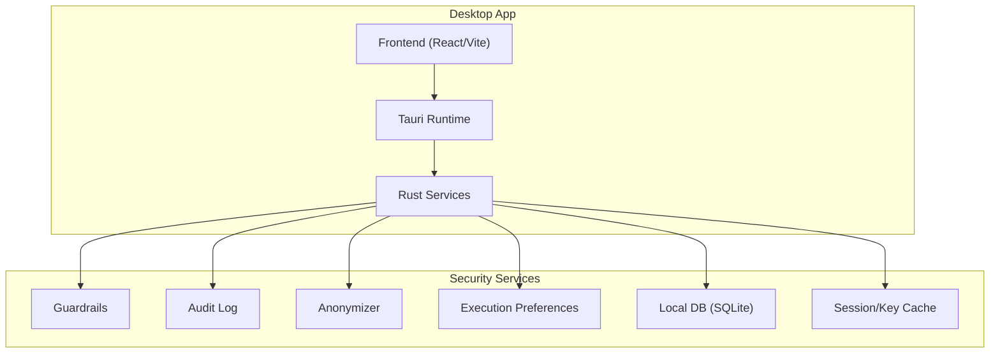
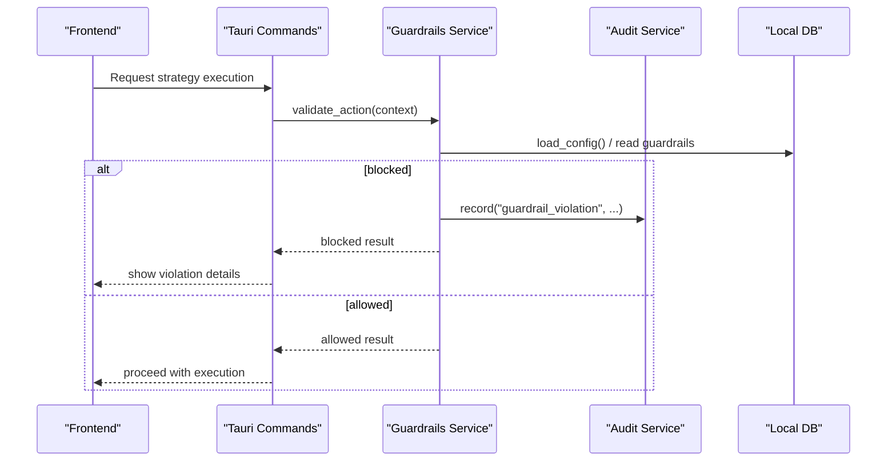
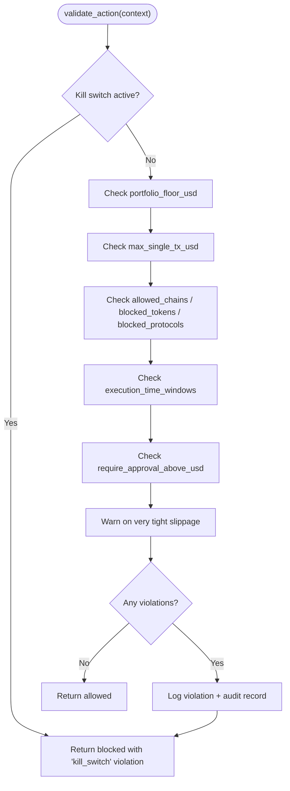
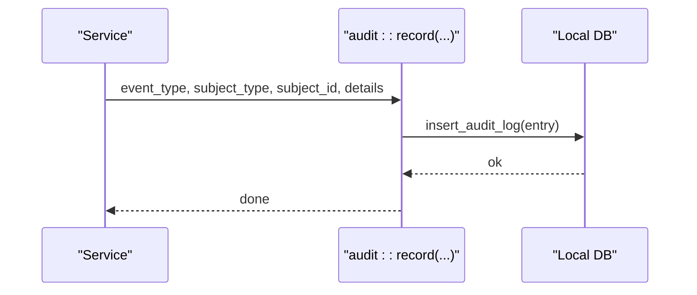
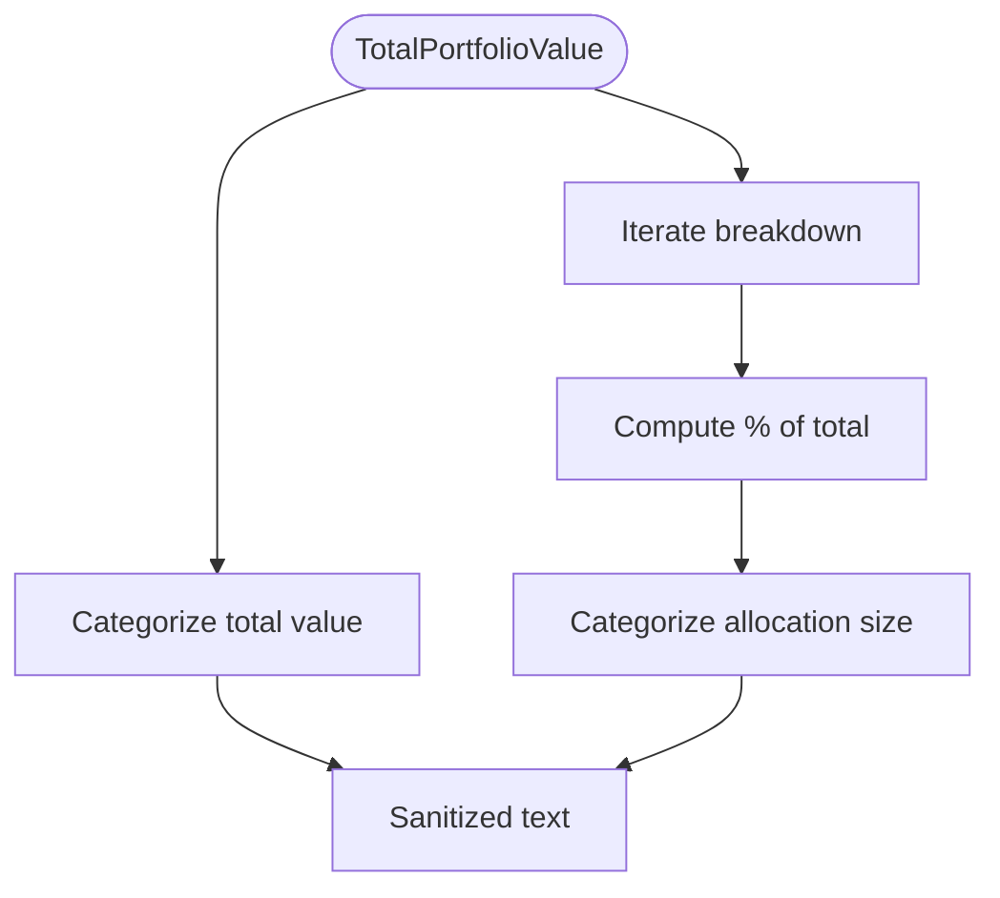
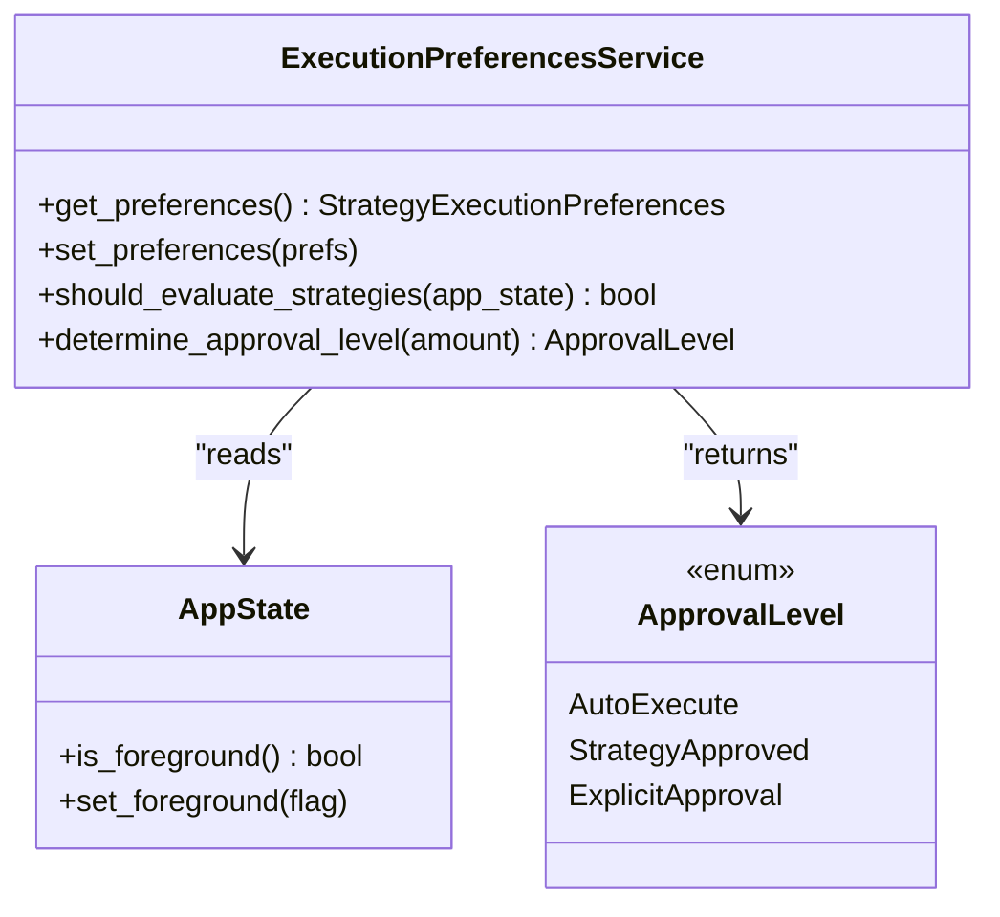
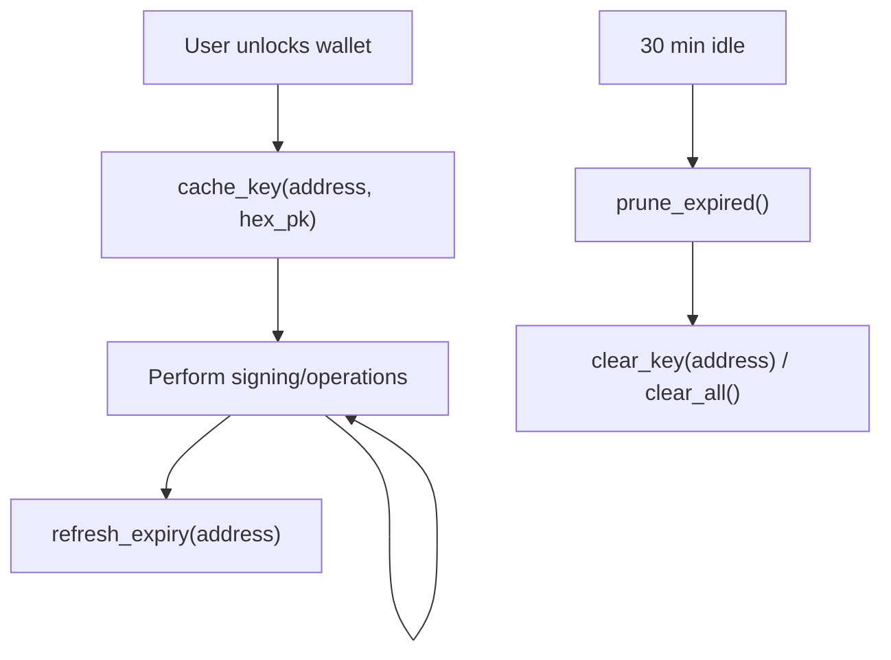
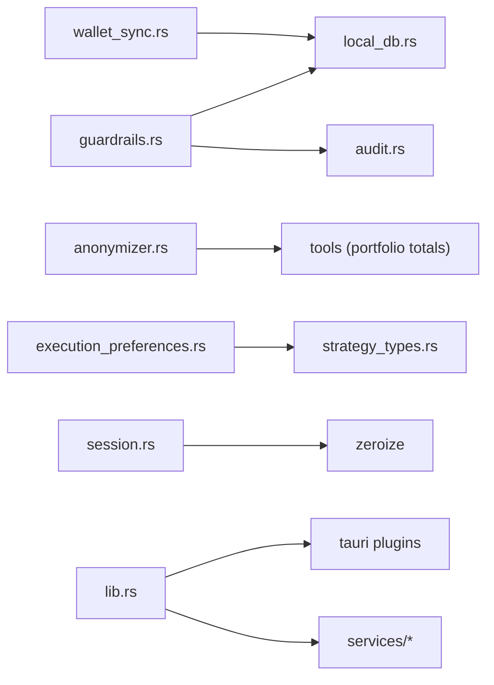

# Security Framework

<cite>
**Referenced Files in This Document**
- [guardrails.rs](file://src-tauri/src/services/guardrails.rs)
- [audit.rs](file://src-tauri/src/services/audit.rs)
- [anonymizer.rs](file://src-tauri/src/services/anonymizer.rs)
- [execution_preferences.rs](file://src-tauri/src/services/execution_preferences.rs)
- [local_db.rs](file://src-tauri/src/services/local_db.rs)
- [strategy_types.rs](file://src-tauri/src/services/strategy_types.rs)
- [wallet_sync.rs](file://src-tauri/src/services/wallet_sync.rs)
- [session.rs](file://src-tauri/src/session.rs)
- [lib.rs](file://src-tauri/src/lib.rs)
- [Cargo.toml](file://src-tauri/Cargo.toml)
- [tauri.conf.json](file://src-tauri/tauri.conf.json)
- [main.rs](file://src-tauri/src/main.rs)
</cite>

## Table of Contents
1. [Introduction](#introduction)
2. [Project Structure](#project-structure)
3. [Core Components](#core-components)
4. [Architecture Overview](#architecture-overview)
5. [Detailed Component Analysis](#detailed-component-analysis)
6. [Dependency Analysis](#dependency-analysis)
7. [Performance Considerations](#performance-considerations)
8. [Troubleshooting Guide](#troubleshooting-guide)
9. [Conclusion](#conclusion)
10. [Appendices](#appendices)

## Introduction
This document describes SHADOW Protocol’s desktop-native security framework. It covers a multi-layered approach integrating OS keychain-backed secrets, local encryption of sensitive data, privacy-preserving analytics, and strict guardrails enforcing user-defined risk tolerances. It documents the execution preferences system controlling strategy automation, the guardrails enforcement mechanism preventing unauthorized or risky operations, the immutable audit trail, anonymization processes for market research, secure key management for seed phrases and signing, and the threat model with attack surface minimization and secure communication protocols. Compliance and privacy-by-design principles are embedded across the architecture.

## Project Structure
Security-critical logic resides primarily in the Tauri backend under src-tauri, with Rust services implementing guardrails, auditing, anonymization, execution preferences, local persistence, and session/key caching. The frontend (React + Vite) communicates with the backend via Tauri commands. The desktop packaging and CSP are configured in tauri.conf.json.

**Diagram sources**
- [lib.rs:34-198](file://src-tauri/src/lib.rs#L34-L198)
- [tauri.conf.json:32-34](file://src-tauri/tauri.conf.json#L32-L34)

**Section sources**
- [lib.rs:34-198](file://src-tauri/src/lib.rs#L34-L198)
- [tauri.conf.json:32-34](file://src-tauri/tauri.conf.json#L32-L34)

## Core Components
- Guardrails service validates autonomous actions against user-configured constraints and enforces an emergency kill switch.
- Audit logging records events immutably in local storage for transparency and compliance.
- Anonymizer sanitizes portfolio data for external AI processing by removing addresses and converting absolute values to categories/percentiles.
- Execution preferences govern when and how strategies execute, including thresholds and approval levels.
- Local DB persists guarded configuration, violations, audit logs, and operational artifacts.
- Session/key cache securely stores decrypted private keys in memory with automatic expiry.
- Wallet sync integrates with external APIs while keeping credentials out of the process and writing only sanitized snapshots to disk.

**Section sources**
- [guardrails.rs:182-230](file://src-tauri/src/services/guardrails.rs#L182-L230)
- [audit.rs:5-24](file://src-tauri/src/services/audit.rs#L5-L24)
- [anonymizer.rs:7-28](file://src-tauri/src/services/anonymizer.rs#L7-L28)
- [execution_preferences.rs:17-71](file://src-tauri/src/services/execution_preferences.rs#L17-L71)
- [local_db.rs:438-448](file://src-tauri/src/services/local_db.rs#L438-L448)
- [session.rs:31-75](file://src-tauri/src/session.rs#L31-L75)
- [wallet_sync.rs:260-452](file://src-tauri/src/services/wallet_sync.rs#L260-L452)

## Architecture Overview
The desktop app runs a Rust backend with Tauri. Security-sensitive operations occur in-process (guardrails, anonymization, execution preferences, audit, DB). Secrets are handled via OS keychain-backed crates and cached in-memory with zeroization. Communication with external services is constrained by CSP and TLS.

**Diagram sources**
- [guardrails.rs:277-426](file://src-tauri/src/services/guardrails.rs#L277-L426)
- [audit.rs:5-24](file://src-tauri/src/services/audit.rs#L5-L24)
- [local_db.rs:438-448](file://src-tauri/src/services/local_db.rs#L438-L448)

## Detailed Component Analysis

### Guardrails Enforcement
Guardrails enforce user-defined constraints before executing autonomous actions. They include:
- Emergency kill switch (global block)
- Portfolio floor post-action
- Single transaction value cap
- Allowed/block lists for chains, tokens, and protocols
- Execution time windows
- Approval thresholds
- Slippage tolerance warnings

Violations are recorded in both a dedicated violations table and the audit log. The service loads configuration from local DB, updates an in-memory kill-switch flag, and validates actions against all rules.

**Diagram sources**
- [guardrails.rs:277-426](file://src-tauri/src/services/guardrails.rs#L277-L426)
- [guardrails.rs:484-519](file://src-tauri/src/services/guardrails.rs#L484-L519)

**Section sources**
- [guardrails.rs:18-85](file://src-tauri/src/services/guardrails.rs#L18-L85)
- [guardrails.rs:182-230](file://src-tauri/src/services/guardrails.rs#L182-L230)
- [guardrails.rs:277-426](file://src-tauri/src/services/guardrails.rs#L277-L426)
- [guardrails.rs:484-519](file://src-tauri/src/services/guardrails.rs#L484-L519)

### Audit Trail System
The audit service writes immutable entries to a local SQLite table with a unique ID, event type, subject, optional subject ID, serialized details, and timestamp. Guardrails and other services call into this to record events consistently.

**Diagram sources**
- [audit.rs:5-24](file://src-tauri/src/services/audit.rs#L5-L24)
- [local_db.rs:169-178](file://src-tauri/src/services/local_db.rs#L169-L178)

**Section sources**
- [audit.rs:5-24](file://src-tauri/src/services/audit.rs#L5-L24)
- [local_db.rs:169-178](file://src-tauri/src/services/local_db.rs#L169-L178)

### Anonymization for Privacy-Preserving AI
Portfolio data sent to remote AI is sanitized to remove addresses and convert absolute balances into categories and percentiles, preserving utility while protecting privacy.

**Diagram sources**
- [anonymizer.rs:7-28](file://src-tauri/src/services/anonymizer.rs#L7-L28)
- [anonymizer.rs:30-55](file://src-tauri/src/services/anonymizer.rs#L30-L55)

**Section sources**
- [anonymizer.rs:7-28](file://src-tauri/src/services/anonymizer.rs#L7-L28)
- [anonymizer.rs:30-55](file://src-tauri/src/services/anonymizer.rs#L30-L55)

### Execution Preferences System
Execution preferences control strategy evaluation cadence and approval levels:
- Execution modes: continuous, app foreground only, or scheduled windows
- Auto-execution thresholds and explicit approval triggers
- Integration with app state to gate evaluations

**Diagram sources**
- [execution_preferences.rs:17-71](file://src-tauri/src/services/execution_preferences.rs#L17-L71)
- [execution_preferences.rs:74-94](file://src-tauri/src/services/execution_preferences.rs#L74-L94)
- [execution_preferences.rs:97-105](file://src-tauri/src/services/execution_preferences.rs#L97-L105)

**Section sources**
- [execution_preferences.rs:17-71](file://src-tauri/src/services/execution_preferences.rs#L17-L71)
- [strategy_types.rs:167-243](file://src-tauri/src/services/strategy_types.rs#L167-L243)

### Secure Key Management and Session Caching
Private keys are never persisted to disk. Instead:
- Decrypted private keys are cached in memory with zeroization.
- Cache has a 30-minute inactivity expiry and supports clearing on lock/exit.
- Only one unlocked key is retained at a time.
- OS keychain crates are used for secure secret retrieval.

**Diagram sources**
- [session.rs:31-75](file://src-tauri/src/session.rs#L31-L75)
- [session.rs:109-115](file://src-tauri/src/session.rs#L109-L115)
- [Cargo.toml:27-33](file://src-tauri/Cargo.toml#L27-L33)

**Section sources**
- [session.rs:31-75](file://src-tauri/src/session.rs#L31-L75)
- [session.rs:109-115](file://src-tauri/src/session.rs#L109-L115)
- [Cargo.toml:27-33](file://src-tauri/Cargo.toml#L27-L33)

### Local Encryption and Data Protection
- Local DB is SQLite with a comprehensive schema for guarded configurations, audit logs, and operational artifacts.
- Sensitive data is stored in-memory and/or encrypted at rest via OS keychain integration (keyring crate).
- Wallet sync writes sanitized portfolio snapshots and avoids storing raw private keys.

**Section sources**
- [local_db.rs:438-448](file://src-tauri/src/services/local_db.rs#L438-L448)
- [wallet_sync.rs:250-258](file://src-tauri/src/services/wallet_sync.rs#L250-L258)
- [Cargo.toml:27-33](file://src-tauri/Cargo.toml#L27-L33)

### Threat Model, Attack Surface Minimization, and Secure Communication
- Desktop threat model: local compromise, malicious insiders, and supply chain risks. Countermeasures include least privilege, OS keychain integration, in-memory secrets, CSP, and minimal network exposure.
- Attack surface minimization:
  - CSP restricts origins for scripts, images, fonts, and connections.
  - External API calls use TLS and are scoped to necessary domains.
  - No secrets are logged or written to disk.
- Secure communication:
  - TLS is enforced for outbound requests.
  - OS keychain is used for secret storage and retrieval.

**Section sources**
- [tauri.conf.json:32-34](file://src-tauri/tauri.conf.json#L32-L34)
- [wallet_sync.rs:77-91](file://src-tauri/src/services/wallet_sync.rs#L77-L91)
- [Cargo.toml](file://src-tauri/Cargo.toml#L34)

### Compliance and Privacy-by-Design
- Privacy-by-design:
  - Anonymization removes identifiers and converts absolute values to categories.
  - Audit logs are immutable and include structured details for traceability.
- Compliance:
  - Immutable audit trail supports governance and auditability.
  - Guardrails align operations with user-defined risk policies.
  - CSP and OS keychain integration support secure-by-default deployment.

**Section sources**
- [anonymizer.rs:7-28](file://src-tauri/src/services/anonymizer.rs#L7-L28)
- [audit.rs:5-24](file://src-tauri/src/services/audit.rs#L5-L24)
- [guardrails.rs:207-230](file://src-tauri/src/services/guardrails.rs#L207-L230)

## Dependency Analysis
Rust services depend on:
- OS keychain integration for secrets
- SQLite for local persistence
- TLS-enabled HTTP clients for external APIs
- Logging/tracing for observability

**Diagram sources**
- [guardrails.rs:11-12](file://src-tauri/src/services/guardrails.rs#L11-L12)
- [local_db.rs:1-10](file://src-tauri/src/services/local_db.rs#L1-L10)
- [anonymizer.rs](file://src-tauri/src/services/anonymizer.rs#L3)
- [execution_preferences.rs](file://src-tauri/src/services/execution_preferences.rs#L10)
- [strategy_types.rs:1-5](file://src-tauri/src/services/strategy_types.rs#L1-L5)
- [wallet_sync.rs:3-8](file://src-tauri/src/services/wallet_sync.rs#L3-L8)
- [session.rs](file://src-tauri/src/session.rs#L6)
- [lib.rs:40-63](file://src-tauri/src/lib.rs#L40-L63)
- [Cargo.toml:20-44](file://src-tauri/Cargo.toml#L20-L44)

**Section sources**
- [Cargo.toml:20-44](file://src-tauri/Cargo.toml#L20-L44)
- [lib.rs:40-63](file://src-tauri/src/lib.rs#L40-L63)

## Performance Considerations
- Guardrail checks are lightweight and operate on in-memory configuration and simple comparisons.
- Audit logging is append-only and indexed by timestamp; consider batching for high-frequency events.
- Wallet sync uses asynchronous network calls per chain; rate-limit external API calls and back off on errors.
- Session cache expiry prevents memory accumulation; ensure periodic pruning runs.

## Troubleshooting Guide
- Guardrail violations:
  - Review the violations list and reasons returned by validation.
  - Check the guardrail violations table and audit logs for timestamps and contexts.
- Audit gaps:
  - Verify local DB initialization and write permissions.
  - Confirm audit entries are inserted on guardrail updates and violations.
- Session/key issues:
  - Ensure cache expiry and pruning are running.
  - Confirm zeroization occurs on clear operations.
- Wallet sync failures:
  - Validate external API keys and network reachability.
  - Inspect emitted progress/done events for step and error details.

**Section sources**
- [guardrails.rs:484-519](file://src-tauri/src/services/guardrails.rs#L484-L519)
- [audit.rs:5-24](file://src-tauri/src/services/audit.rs#L5-L24)
- [session.rs:109-115](file://src-tauri/src/session.rs#L109-L115)
- [wallet_sync.rs:260-452](file://src-tauri/src/services/wallet_sync.rs#L260-L452)

## Conclusion
SHADOW Protocol’s security framework combines OS keychain-backed secrets, in-memory session caching, local encryption, and privacy-preserving anonymization with robust guardrails and immutable audit trails. The execution preferences system aligns automation with user intent, while CSP and TLS minimize attack surfaces. These measures collectively support privacy-by-design and strong compliance posture for a desktop-native DeFi automation platform.

## Appendices

### Appendix A: Desktop Packaging and CSP
- CSP restricts resource loading and outbound connections to trusted origins.
- Application metadata and bundling resources are configured centrally.

**Section sources**
- [tauri.conf.json:32-34](file://src-tauri/tauri.conf.json#L32-L34)
- [tauri.conf.json:36-58](file://src-tauri/tauri.conf.json#L36-L58)

### Appendix B: Entry Point and Runtime
- The Tauri binary initializes tracing, sets up plugins, initializes local DB, starts background services, and registers commands.

**Section sources**
- [main.rs:4-6](file://src-tauri/src/main.rs#L4-L6)
- [lib.rs:34-198](file://src-tauri/src/lib.rs#L34-L198)