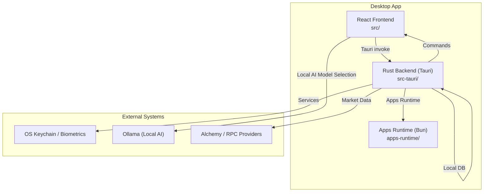
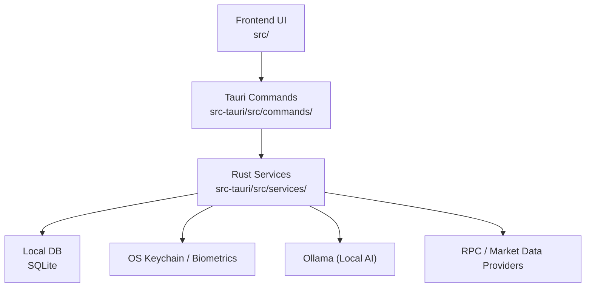
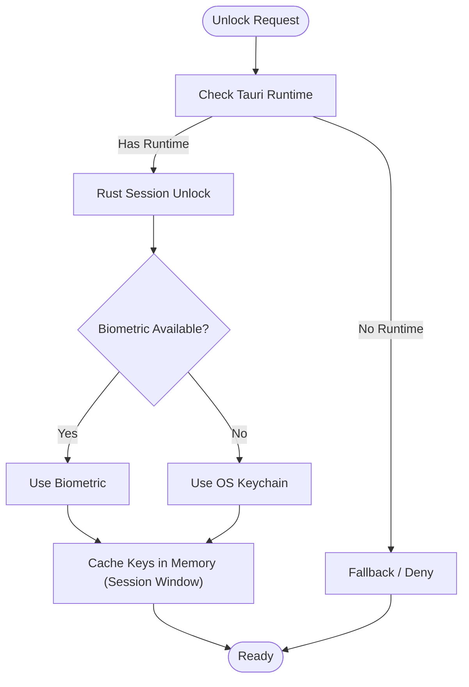
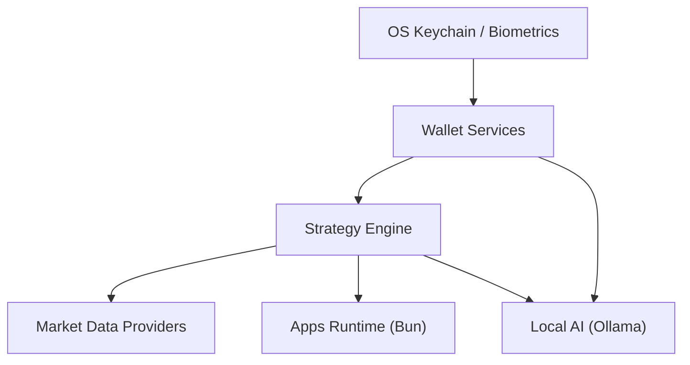
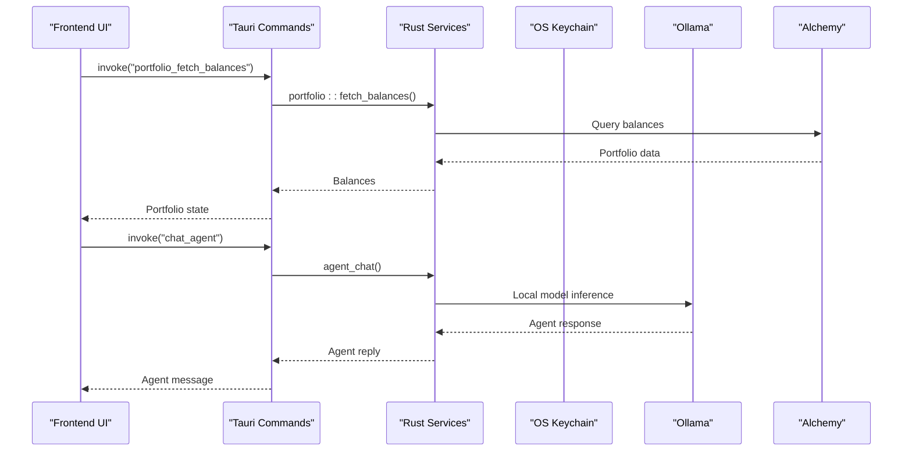
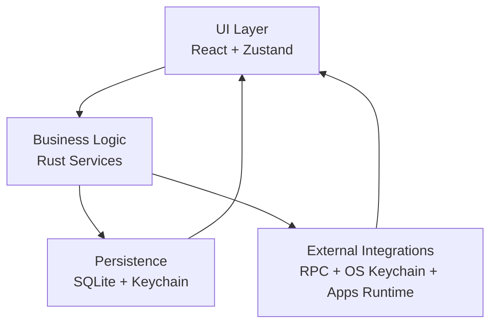
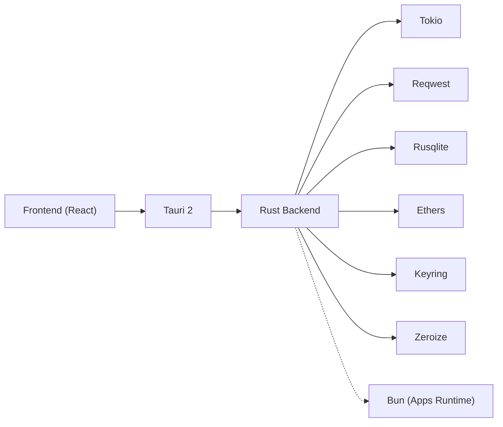
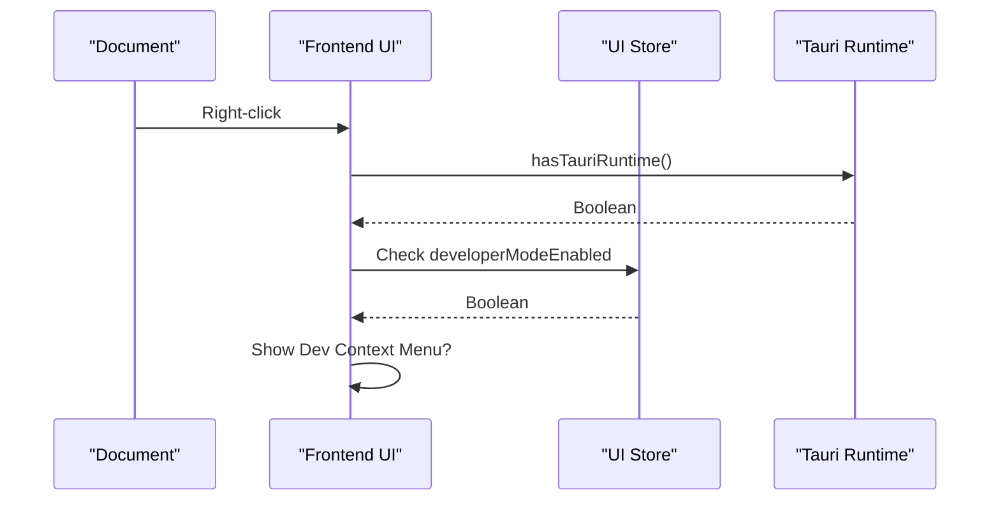

# System Overview

<cite>
**Referenced Files in This Document**
- [README.md](file://README.md)
- [docs/shadow-protocol.md](file://docs/shadow-protocol.md)
- [src-tauri/tauri.conf.json](file://src-tauri/tauri.conf.json)
- [package.json](file://package.json)
- [src-tauri/Cargo.toml](file://src-tauri/Cargo.toml)
- [src/App.tsx](file://src/App.tsx)
- [src/routes.tsx](file://src/routes.tsx)
- [src/lib/tauri.ts](file://src/lib/tauri.ts)
- [src-tauri/src/main.rs](file://src-tauri/src/main.rs)
- [src-tauri/src/lib.rs](file://src-tauri/src/lib.rs)
- [src-tauri/src/services/mod.rs](file://src-tauri/src/services/mod.rs)
- [src-tauri/src/commands/mod.rs](file://src-tauri/src/commands/mod.rs)
- [src-tauri/src/services/local_db.rs](file://src-tauri/src/services/local_db.rs)
</cite>

## Table of Contents
1. [Introduction](#introduction)
2. [Project Structure](#project-structure)
3. [Core Components](#core-components)
4. [Architecture Overview](#architecture-overview)
5. [Detailed Component Analysis](#detailed-component-analysis)
6. [Dependency Analysis](#dependency-analysis)
7. [Performance Considerations](#performance-considerations)
8. [Troubleshooting Guide](#troubleshooting-guide)
9. [Conclusion](#conclusion)

## Introduction
SHADOW Protocol is a privacy-first desktop DeFi workstation that combines a React 19 frontend with a Rust backend powered by Tauri 2.0. Its design philosophy prioritizes local security for sensitive operations, explicit user approvals for automation, and local AI intelligence through Ollama. The system is organized as a hybrid desktop application that keeps secret material and signing logic on the desktop-native side while exposing a modern, compact UI for portfolio management, agent-assisted workflows, strategy building, and autonomous control.

Key goals:
- Keep sensitive state and signing on the local machine
- Provide explicit, reviewable agent behavior and approvals
- Use Rust for wallet/session/security-critical operations
- Deliver a unified desktop experience for portfolio, strategy, automation, and integrations
- Maintain web3 compatibility while preserving desktop-native security boundaries

**Section sources**
- [README.md: 23-56:23-56](file://README.md#L23-L56)
- [docs/shadow-protocol.md: 7-25:7-25](file://docs/shadow-protocol.md#L7-L25)

## Project Structure
The repository is organized into three primary layers:
- Frontend (React + TypeScript): located under src/, with routing, components, stores, and typed invoke helpers
- Backend (Rust + Tauri): located under src-tauri/, implementing thin command handlers and a rich service layer
- Apps Runtime (Bun sidecar): located under apps-runtime/, hosting isolated adapters for external integrations

**Diagram sources**
- [docs/shadow-protocol.md: 109-126:109-126](file://docs/shadow-protocol.md#L109-L126)
- [src-tauri/tauri.conf.json: 32-34:32-34](file://src-tauri/tauri.conf.json#L32-L34)
- [README.md: 135-146:135-146](file://README.md#L135-L146)

**Section sources**
- [docs/shadow-protocol.md: 109-126:109-126](file://docs/shadow-protocol.md#L109-L126)
- [README.md: 251-259:251-259](file://README.md#L251-L259)

## Core Components
- Frontend Shell and Routing
  - Single-page application shell with hash-based routing and feature modules for agent, autonomous, strategy, automation, market, portfolio, apps, and settings
  - Uses Tauri’s invoke mechanism for IPC and typed wrappers for type safety
- Tauri Command Layer
  - Thin IPC surface registering Rust commands for wallet, portfolio, market, strategy, apps, settings, and autonomous subsystems
  - Centralized command registration and handler wiring
- Rust Service Layer
  - Rich service modules covering wallet/session, portfolio, market, agent orchestration, strategy engine, autonomous systems, apps runtime, and local persistence
  - Local SQLite database for caching and audit trails
- Apps Runtime
  - Bun-based sidecar for external SDKs (e.g., Lit, Flow, Filecoin), isolating third-party logic from the main app
- Local AI Integration
  - Ollama integration for local model selection and management, keeping sensitive context off hosted LLM APIs by default

**Section sources**
- [src/routes.tsx: 14-32:14-32](file://src/routes.tsx#L14-L32)
- [src-tauri/src/lib.rs: 90-190:90-190](file://src-tauri/src/lib.rs#L90-L190)
- [src-tauri/src/services/mod.rs: 1-36:1-36](file://src-tauri/src/services/mod.rs#L1-L36)
- [src-tauri/src/commands/mod.rs: 1-27:1-27](file://src-tauri/src/commands/mod.rs#L1-L27)
- [src-tauri/src/services/local_db.rs: 10-416:10-416](file://src-tauri/src/services/local_db.rs#L10-L416)

## Architecture Overview
SHADOW employs a layered desktop architecture:
- Frontend UI (src/) interacts with Rust via Tauri invoke
- Tauri command handlers (src-tauri/src/commands/) act as thin IPC gateways
- Rust services (src-tauri/src/services/) encapsulate business logic, persistence, and integrations
- Optional Apps sidecar (apps-runtime/) executes isolated adapters for external chains/providers
- Local AI inference (Ollama) remains on-device for privacy-first workflows

**Diagram sources**
- [docs/shadow-protocol.md: 109-126:109-126](file://docs/shadow-protocol.md#L109-L126)
- [src-tauri/src/lib.rs: 40-89:40-89](file://src-tauri/src/lib.rs#L40-L89)
- [src-tauri/src/services/local_db.rs: 10-416:10-416](file://src-tauri/src/services/local_db.rs#L10-L416)

**Section sources**
- [docs/shadow-protocol.md: 109-126:109-126](file://docs/shadow-protocol.md#L109-L126)
- [src-tauri/src/lib.rs: 40-89:40-89](file://src-tauri/src/lib.rs#L40-L89)

## Detailed Component Analysis

### Desktop Native Security Boundaries
- Private keys are stored in OS-backed secure storage; unlock is performed in Rust, not the frontend
- Unlocked keys are cached in-memory only for a bounded session window and cleared on lock or exit
- Frontend state is separate from backend-owned sensitive state; approvals are explicit and surfaced in the UI
- The CSP restricts connections to localhost for Ollama and Alchemy endpoints, minimizing exposure

**Diagram sources**
- [src-tauri/tauri.conf.json: 32-34:32-34](file://src-tauri/tauri.conf.json#L32-L34)
- [docs/shadow-protocol.md: 188-217:188-217](file://docs/shadow-protocol.md#L188-L217)

**Section sources**
- [docs/shadow-protocol.md: 188-217:188-217](file://docs/shadow-protocol.md#L188-L217)
- [src-tauri/tauri.conf.json: 32-34:32-34](file://src-tauri/tauri.conf.json#L32-L34)

### System Context: OS Keychain, Wallet Services, Strategy Engine, Market Data, Local AI

**Diagram sources**
- [docs/shadow-protocol.md: 109-126:109-126](file://docs/shadow-protocol.md#L109-L126)
- [src-tauri/src/services/mod.rs: 1-36:1-36](file://src-tauri/src/services/mod.rs#L1-L36)

**Section sources**
- [docs/shadow-protocol.md: 109-126:109-126](file://docs/shadow-protocol.md#L109-L126)

### Hybrid Edge Computing: Desktop-Native Security with Web3 Compatibility
- Desktop-native security: OS keychain, biometric unlock, in-memory session cache, and Rust-owned signing
- Web3 compatibility: Alchemy RPC for portfolio data, EVM transfers, and strategy-related queries; apps runtime for provider-specific integrations
- Local AI inference: Ollama runs locally to avoid sending sensitive context to remote APIs

**Diagram sources**
- [src-tauri/src/lib.rs: 90-190:90-190](file://src-tauri/src/lib.rs#L90-L190)
- [src-tauri/src/services/mod.rs: 1-36:1-36](file://src-tauri/src/services/mod.rs#L1-L36)
- [src-tauri/tauri.conf.json: 32-34:32-34](file://src-tauri/tauri.conf.json#L32-L34)

**Section sources**
- [README.md: 173-182:173-182](file://README.md#L173-L182)
- [src-tauri/tauri.conf.json: 32-34:32-34](file://src-tauri/tauri.conf.json#L32-L34)

### Separation of Concerns
- UI Presentation: React components, routing, and stores (Zustand) manage UI state and user interactions
- Business Logic: Rust services encapsulate wallet, portfolio, market, strategy, agent, autonomous, and apps logic
- Data Persistence: Local SQLite database for cached data, audit trails, and state; OS keychain for secrets
- External Integrations: RPC providers (e.g., Alchemy), OS keychain, and apps runtime adapters

**Diagram sources**
- [docs/shadow-protocol.md: 142-148:142-148](file://docs/shadow-protocol.md#L142-L148)
- [src-tauri/src/services/local_db.rs: 10-416:10-416](file://src-tauri/src/services/local_db.rs#L10-L416)

**Section sources**
- [docs/shadow-protocol.md: 142-148:142-148](file://docs/shadow-protocol.md#L142-L148)
- [src-tauri/src/services/local_db.rs: 10-416:10-416](file://src-tauri/src/services/local_db.rs#L10-L416)

## Dependency Analysis
- Frontend depends on Tauri APIs and typed invoke helpers; it does not use localhost fetch calls for sensitive operations
- Backend depends on Tauri 2, Tokio, Reqwest, Rusqlite, Ethers, Keyring, Zeroize, and optional plugins
- Build and tooling: Vite for frontend, Cargo for Rust, Bun for apps runtime and development

**Diagram sources**
- [package.json: 18-37:18-37](file://package.json#L18-L37)
- [src-tauri/Cargo.toml: 20-44:20-44](file://src-tauri/Cargo.toml#L20-L44)
- [docs/shadow-protocol.md: 361-389:361-389](file://docs/shadow-protocol.md#L361-L389)

**Section sources**
- [package.json: 18-37:18-37](file://package.json#L18-L37)
- [src-tauri/Cargo.toml: 20-44:20-44](file://src-tauri/Cargo.toml#L20-L44)
- [docs/shadow-protocol.md: 361-389:361-389](file://docs/shadow-protocol.md#L361-L389)

## Performance Considerations
- Desktop-native performance: Rust services and local SQLite minimize latency for frequent portfolio syncs and strategy evaluations
- Local AI inference: Running Ollama locally avoids network-bound delays and reduces risk for sensitive prompts
- Asynchronous orchestration: Tokio-based async runtime powers periodic tasks, sync loops, and background health monitoring
- Resource isolation: Apps runtime runs external adapters in isolated processes to prevent long-lived state bloat in the main backend

[No sources needed since this section provides general guidance]

## Troubleshooting Guide
- Developer context menu: In development, right-click triggers a Tauri dev context menu when Tauri runtime is detected and developer mode is enabled
- Tauri runtime detection: Frontend checks for the presence of the Tauri runtime to enable devtools and context menu
- CSP restrictions: Network connectivity is constrained by the Content Security Policy; ensure Ollama and RPC endpoints are reachable as permitted

**Diagram sources**
- [src/App.tsx: 13-32:13-32](file://src/App.tsx#L13-L32)
- [src/lib/tauri.ts: 1-4:1-4](file://src/lib/tauri.ts#L1-L4)
- [src/store/useUiStore.ts: 72-85:72-85](file://src/store/useUiStore.ts#L72-L85)

**Section sources**
- [src/App.tsx: 13-32:13-32](file://src/App.tsx#L13-L32)
- [src/lib/tauri.ts: 1-4:1-4](file://src/lib/tauri.ts#L1-L4)
- [src/store/useUiStore.ts: 72-85:72-85](file://src/store/useUiStore.ts#L72-L85)

## Conclusion
SHADOW Protocol’s hybrid architecture balances privacy-first desktop-native security with web3-compatible operations. The React frontend delivers a compact, operator-focused UI, while Rust and Tauri encapsulate sensitive logic and integrations. Local AI inference and OS keychain integration reinforce privacy, and the service-layered backend cleanly separates UI, business logic, persistence, and external integrations. This design enables transparent, auditable automation and a strong foundation for autonomous DeFi operations.

[No sources needed since this section summarizes without analyzing specific files]