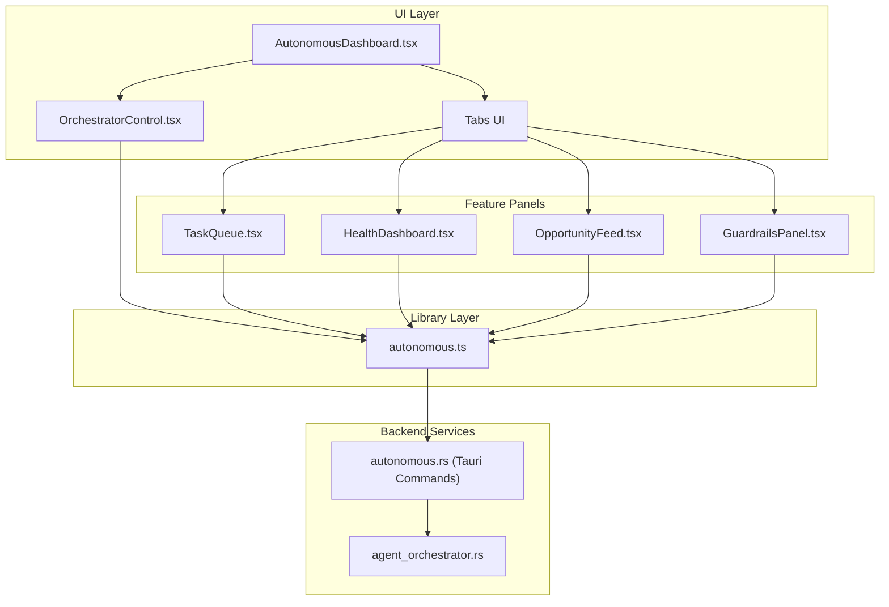
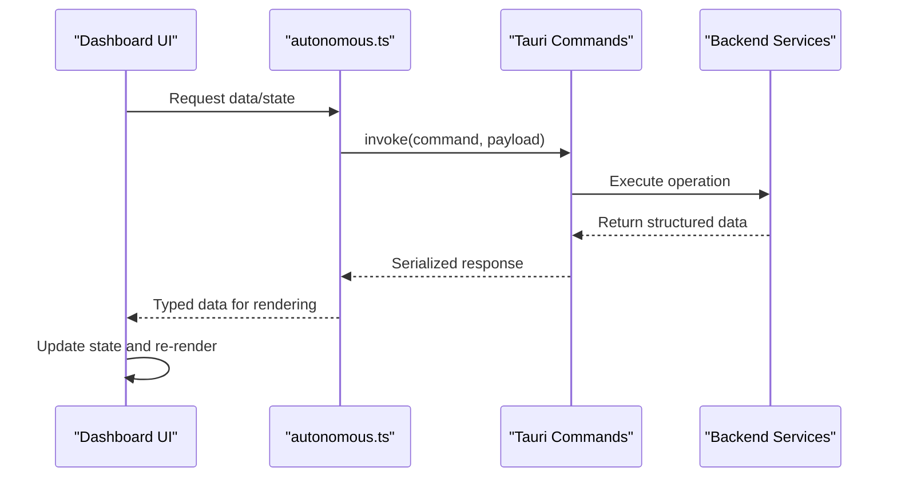
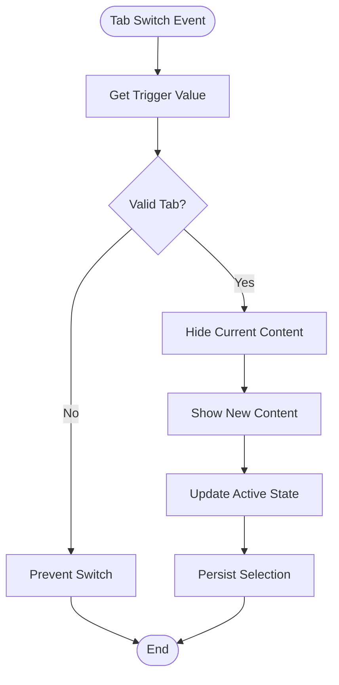
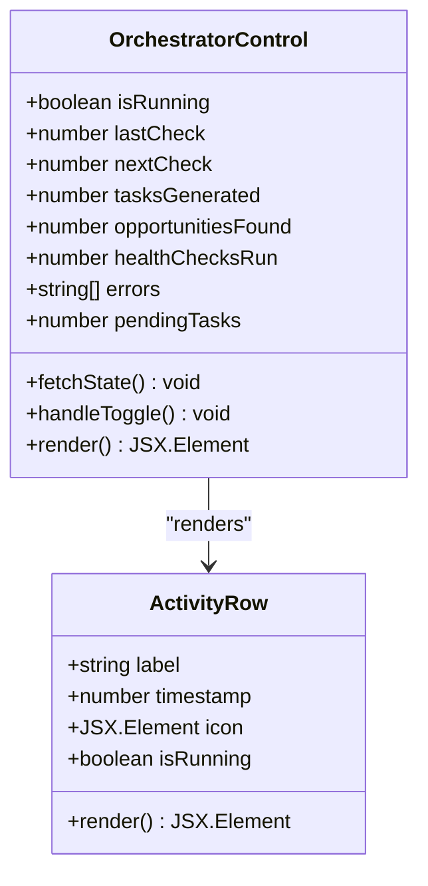
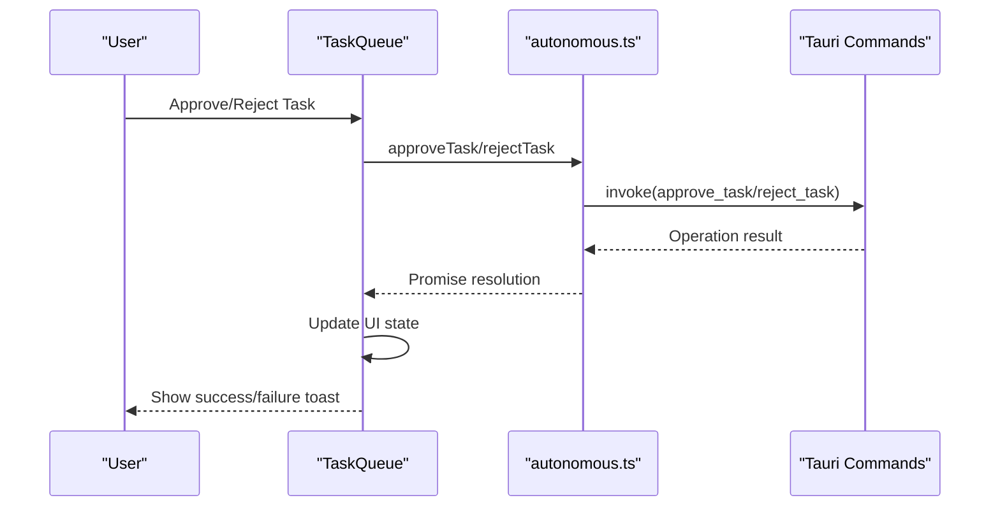
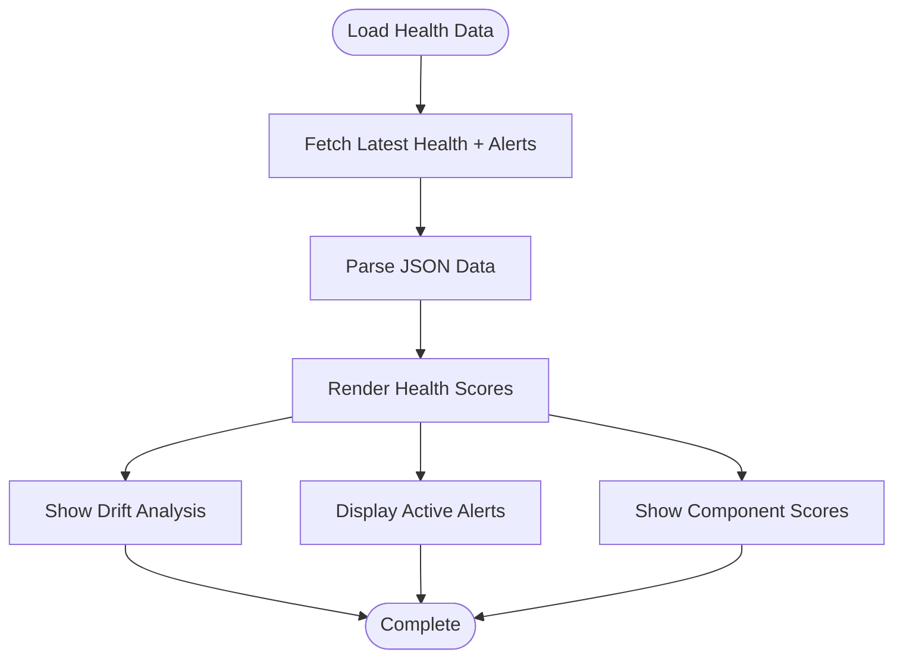
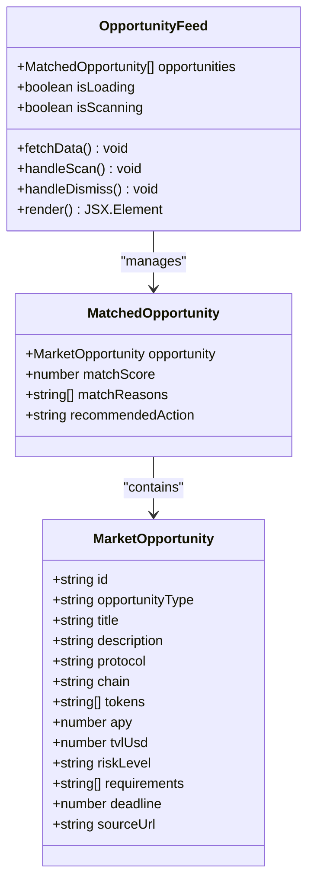
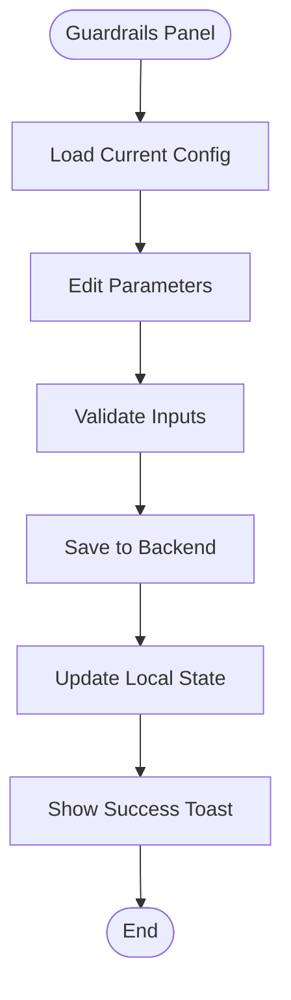
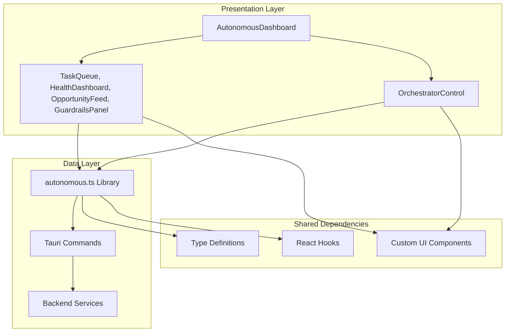

# Autonomous Dashboard Overview

<cite>
**Referenced Files in This Document**
- [AutonomousDashboard.tsx](file://src/components/autonomous/AutonomousDashboard.tsx)
- [OrchestratorControl.tsx](file://src/components/autonomous/OrchestratorControl.tsx)
- [HealthDashboard.tsx](file://src/components/autonomous/HealthDashboard.tsx)
- [TaskQueue.tsx](file://src/components/autonomous/TaskQueue.tsx)
- [GuardrailsPanel.tsx](file://src/components/autonomous/GuardrailsPanel.tsx)
- [OpportunityFeed.tsx](file://src/components/autonomous/OpportunityFeed.tsx)
- [autonomous.ts](file://src/lib/autonomous.ts)
- [routes.tsx](file://src/routes.tsx)
- [AppShell.tsx](file://src/components/layout/AppShell.tsx)
- [agent_orchestrator.rs](file://src-tauri/src/services/agent_orchestrator.rs)
- [autonomous.rs](file://src-tauri/src/commands/autonomous.rs)
- [globals.css](file://src/styles/globals.css)
- [design-tokens.css](file://src/styles/design-tokens.css)
- [tabs.tsx](file://src/components/ui/tabs.tsx)
</cite>

## Table of Contents
1. [Introduction](#introduction)
2. [Project Structure](#project-structure)
3. [Core Components](#core-components)
4. [Architecture Overview](#architecture-overview)
5. [Detailed Component Analysis](#detailed-component-analysis)
6. [Dependency Analysis](#dependency-analysis)
7. [Performance Considerations](#performance-considerations)
8. [Troubleshooting Guide](#troubleshooting-guide)
9. [Conclusion](#conclusion)

## Introduction
The Autonomous Dashboard overview component serves as the central hub for autonomous DeFi operations. It integrates four primary operational aspects—task management, health monitoring, opportunity discovery, and safety guardrails—into a cohesive interface. The dashboard coordinates with backend services via Tauri commands to provide real-time situational awareness and operational control for AI-driven portfolio management.

## Project Structure
The dashboard is organized as a tabbed interface with a sidebar control panel. The main content area uses a responsive grid layout, while the sidebar hosts the OrchestratorControl panel for manual intervention and system management.

**Diagram sources**
- [AutonomousDashboard.tsx:19-80](file://src/components/autonomous/AutonomousDashboard.tsx#L19-L80)
- [OrchestratorControl.tsx:36-212](file://src/components/autonomous/OrchestratorControl.tsx#L36-L212)
- [autonomous.ts:172-477](file://src/lib/autonomous.ts#L172-L477)
- [autonomous.rs:589-681](file://src-tauri/src/commands/autonomous.rs#L589-L681)
- [agent_orchestrator.rs:150-231](file://src-tauri/src/services/agent_orchestrator.rs#L150-L231)

**Section sources**
- [AutonomousDashboard.tsx:9-84](file://src/components/autonomous/AutonomousDashboard.tsx#L9-L84)
- [routes.tsx:14-32](file://src/routes.tsx#L14-L32)
- [AppShell.tsx:31-276](file://src/components/layout/AppShell.tsx#L31-L276)

## Core Components
The dashboard comprises four primary panels and a control sidebar:

- **Task Queue**: Displays pending AI-generated tasks requiring human approval or rejection
- **Health Dashboard**: Shows portfolio health scores, drift analysis, and active alerts
- **Opportunity Feed**: Presents discovered opportunities with risk levels and match scores
- **Guardrails Panel**: Manages spending limits, blocked assets, and emergency kill switches
- **Orchestrator Control**: Provides manual intervention for starting/stopping autonomous operations

Each component follows a consistent design language using glass panels, subtle animations, and a dark/light theme system.

**Section sources**
- [TaskQueue.tsx:28-89](file://src/components/autonomous/TaskQueue.tsx#L28-L89)
- [HealthDashboard.tsx:26-199](file://src/components/autonomous/HealthDashboard.tsx#L26-L199)
- [OpportunityFeed.tsx:39-160](file://src/components/autonomous/OpportunityFeed.tsx#L39-L160)
- [GuardrailsPanel.tsx:19-327](file://src/components/autonomous/GuardrailsPanel.tsx#L19-L327)
- [OrchestratorControl.tsx:36-248](file://src/components/autonomous/OrchestratorControl.tsx#L36-L248)

## Architecture Overview
The dashboard architecture implements a unidirectional data flow from backend services to frontend components:

**Diagram sources**
- [autonomous.ts:18-477](file://src/lib/autonomous.ts#L18-L477)
- [autonomous.rs:260-681](file://src-tauri/src/commands/autonomous.rs#L260-L681)
- [agent_orchestrator.rs:150-231](file://src-tauri/src/services/agent_orchestrator.rs#L150-L231)

The orchestrator operates on a timed loop, periodically running health checks, opportunity scans, and task generation cycles. The frontend polls state and metrics to maintain synchronization.

**Section sources**
- [agent_orchestrator.rs:150-231](file://src-tauri/src/services/agent_orchestrator.rs#L150-L231)
- [OrchestratorControl.tsx:42-69](file://src/components/autonomous/OrchestratorControl.tsx#L42-L69)

## Detailed Component Analysis

### Tabbed Navigation System
The dashboard uses a custom tabs implementation with responsive behavior and visual indicators:

**Diagram sources**
- [AutonomousDashboard.tsx:21-68](file://src/components/autonomous/AutonomousDashboard.tsx#L21-L68)
- [tabs.tsx:7-87](file://src/components/ui/tabs.tsx#L7-L87)

The tab system supports:
- Four primary tabs: Tasks, Health, Opportunities, Guardrails
- Responsive design with stacked layout on smaller screens
- Visual indicators for active states and hover effects
- Consistent spacing and typography scales

**Section sources**
- [AutonomousDashboard.tsx:21-68](file://src/components/autonomous/AutonomousDashboard.tsx#L21-L68)
- [tabs.tsx:26-74](file://src/components/ui/tabs.tsx#L26-L74)

### Orchestrator Control Component
The OrchestratorControl provides centralized manual intervention capabilities:

**Diagram sources**
- [OrchestratorControl.tsx:25-247](file://src/components/autonomous/OrchestratorControl.tsx#L25-L247)

Key features include:
- Real-time status monitoring with pulse indicators
- 10-second polling intervals for state updates
- Toggle controls for starting/stopping autonomous operations
- Metrics display for pending tasks and generated opportunities
- Activity timeline showing health checks, opportunity scans, and task generation
- Error aggregation and display

**Section sources**
- [OrchestratorControl.tsx:36-212](file://src/components/autonomous/OrchestratorControl.tsx#L36-L212)
- [autonomous.ts:424-477](file://src/lib/autonomous.ts#L424-L477)

### Task Management Workflow
The TaskQueue component manages AI-generated actions requiring human oversight:

**Diagram sources**
- [TaskQueue.tsx:38-48](file://src/components/autonomous/TaskQueue.tsx#L38-L48)
- [autonomous.ts:94-170](file://src/lib/autonomous.ts#L94-L170)
- [autonomous.rs:307-344](file://src-tauri/src/commands/autonomous.rs#L307-L344)

The workflow supports:
- Priority-based categorization (low, medium, high, urgent)
- Category-specific icons for quick recognition
- Confidence scoring and expiration tracking
- Batch approval/rejection operations
- Real-time updates through polling

**Section sources**
- [TaskQueue.tsx:28-89](file://src/components/autonomous/TaskQueue.tsx#L28-L89)
- [autonomous.ts:18-182](file://src/lib/autonomous.ts#L18-L182)

### Health Monitoring Dashboard
The HealthDashboard provides comprehensive portfolio analysis:

**Diagram sources**
- [HealthDashboard.tsx:33-47](file://src/components/autonomous/HealthDashboard.tsx#L33-L47)
- [autonomous.ts:291-367](file://src/lib/autonomous.ts#L291-L367)

Features include:
- Overall health score with gradient color coding
- Component-specific scores (drift, concentration, performance, risk)
- Allocation drift analysis with direction indicators
- Active alert display with severity levels
- Manual health check triggering
- Relative time formatting for freshness indicators

**Section sources**
- [HealthDashboard.tsx:26-199](file://src/components/autonomous/HealthDashboard.tsx#L26-L199)
- [autonomous.ts:291-367](file://src/lib/autonomous.ts#L291-L367)

### Opportunity Discovery System
The OpportunityFeed presents AI-discovered DeFi opportunities:

**Diagram sources**
- [OpportunityFeed.tsx:12-160](file://src/components/autonomous/OpportunityFeed.tsx#L12-L160)
- [autonomous.ts:369-422](file://src/lib/autonomous.ts#L369-L422)

Capabilities:
- Risk-level categorization (low, medium, high, critical)
- Protocol and chain filtering
- APY and TVL metrics
- Match score visualization
- Deadline tracking
- Dismissal functionality
- Manual scan triggering

**Section sources**
- [OpportunityFeed.tsx:39-160](file://src/components/autonomous/OpportunityFeed.tsx#L39-L160)
- [autonomous.ts:369-422](file://src/lib/autonomous.ts#L369-L422)

### Guardrails Management
The GuardrailsPanel controls safety parameters for autonomous operations:

**Diagram sources**
- [GuardrailsPanel.tsx:27-71](file://src/components/autonomous/GuardrailsPanel.tsx#L27-L71)
- [autonomous.ts:201-289](file://src/lib/autonomous.ts#L201-L289)

Key controls:
- Emergency kill switch activation/deactivation
- Spending limits (daily, weekly, single transaction)
- Asset blocking lists (tokens, protocols)
- Slippage tolerance settings
- Approval thresholds
- Real-time validation and persistence

**Section sources**
- [GuardrailsPanel.tsx:19-327](file://src/components/autonomous/GuardrailsPanel.tsx#L19-L327)
- [autonomous.ts:201-289](file://src/lib/autonomous.ts#L201-L289)

## Dependency Analysis
The dashboard components share common dependencies and follow a layered architecture:

**Diagram sources**
- [AutonomousDashboard.tsx:1-7](file://src/components/autonomous/AutonomousDashboard.tsx#L1-L7)
- [autonomous.ts:1-11](file://src/lib/autonomous.ts#L1-L11)
- [autonomous.rs:8-11](file://src-tauri/src/commands/autonomous.rs#L8-L11)

The dependency graph reveals:
- Loose coupling between UI components and backend services
- Centralized data access through the autonomous.ts library
- Type-safe communication via Tauri command interfaces
- Shared design tokens and utility classes across components

**Section sources**
- [AutonomousDashboard.tsx:1-7](file://src/components/autonomous/AutonomousDashboard.tsx#L1-L7)
- [autonomous.ts:1-11](file://src/lib/autonomous.ts#L1-L11)

## Performance Considerations
The dashboard implements several performance optimizations:

- **Efficient Polling**: OrchestratorControl uses 10-second intervals to balance responsiveness with resource usage
- **Selective Re-rendering**: Components use React.memo patterns and selective state updates
- **Lazy Loading**: OpportunityFeed and HealthDashboard implement skeleton loading states
- **Memory Management**: Automatic cleanup of intervals and event listeners
- **Network Optimization**: Combined requests for related data (e.g., orchestrator state and task stats)

Recommendations for further optimization:
- Implement WebSocket connections for real-time updates
- Add request deduplication for concurrent identical requests
- Consider pagination for large datasets (opportunities, tasks)
- Optimize image loading for opportunity cards
- Implement component-level code splitting

## Troubleshooting Guide
Common issues and their resolutions:

**Dashboard Not Loading**
- Verify Tauri runtime availability
- Check network connectivity to backend services
- Review browser console for CORS or fetch errors

**Orchestrator Control Issues**
- Confirm backend service availability
- Check kill switch status in guardrails
- Verify user permissions for starting/stopping operations

**Data Display Problems**
- Validate JSON parsing for health and opportunity data
- Check timestamp formatting and timezone handling
- Ensure proper error boundary implementation

**Performance Degradation**
- Monitor polling frequency impact
- Check memory leaks in long-running sessions
- Verify component unmount cleanup

**Section sources**
- [OrchestratorControl.tsx:58-63](file://src/components/autonomous/OrchestratorControl.tsx#L58-L63)
- [HealthDashboard.tsx:38-42](file://src/components/autonomous/HealthDashboard.tsx#L38-L42)
- [TaskQueue.tsx:34-36](file://src/components/autonomous/TaskQueue.tsx#L34-L36)

## Conclusion
The Autonomous Dashboard provides a comprehensive interface for managing AI-driven DeFi operations. Its modular architecture enables clear separation of concerns while maintaining tight integration between operational aspects. The combination of real-time monitoring, manual intervention capabilities, and safety controls creates a robust foundation for autonomous portfolio management. The responsive design and consistent visual language ensure usability across different screen sizes and user preferences.