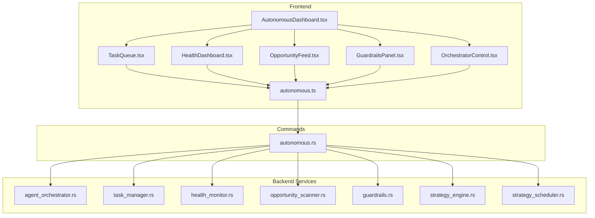
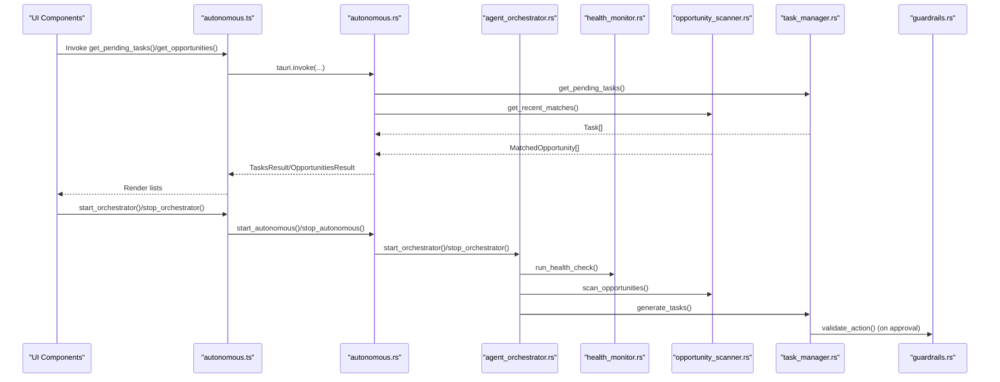
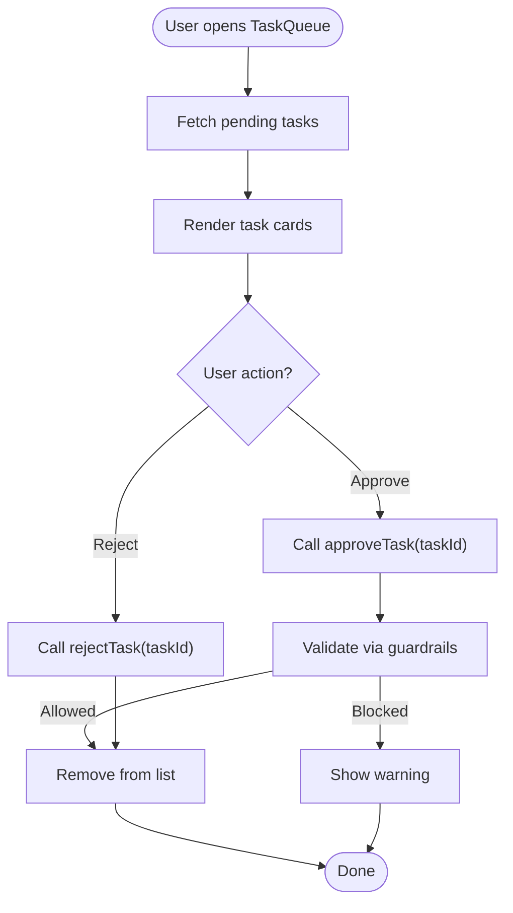
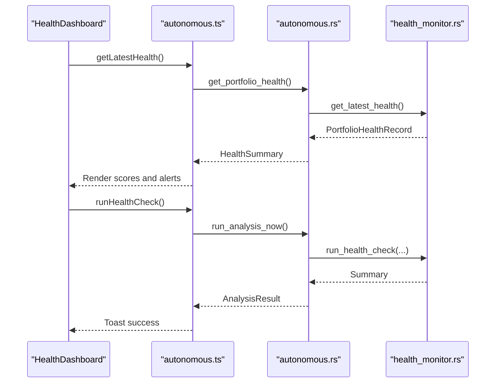
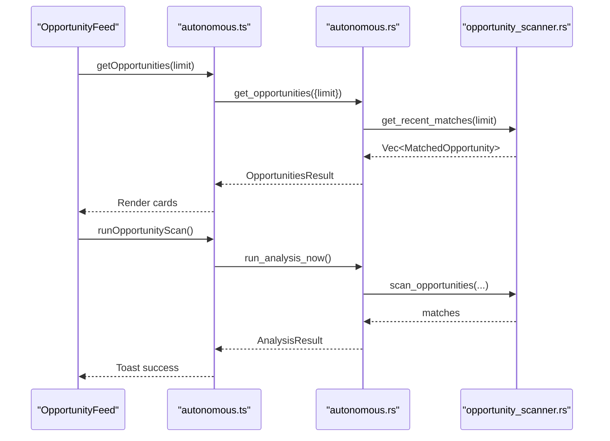
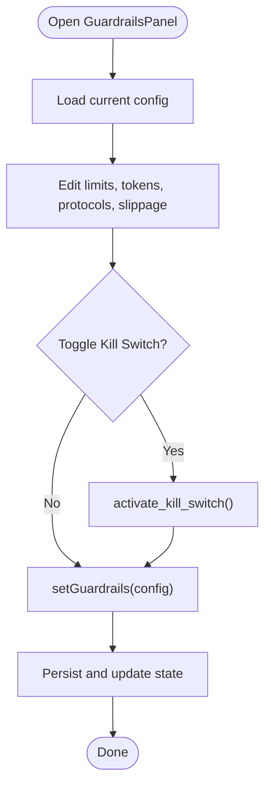
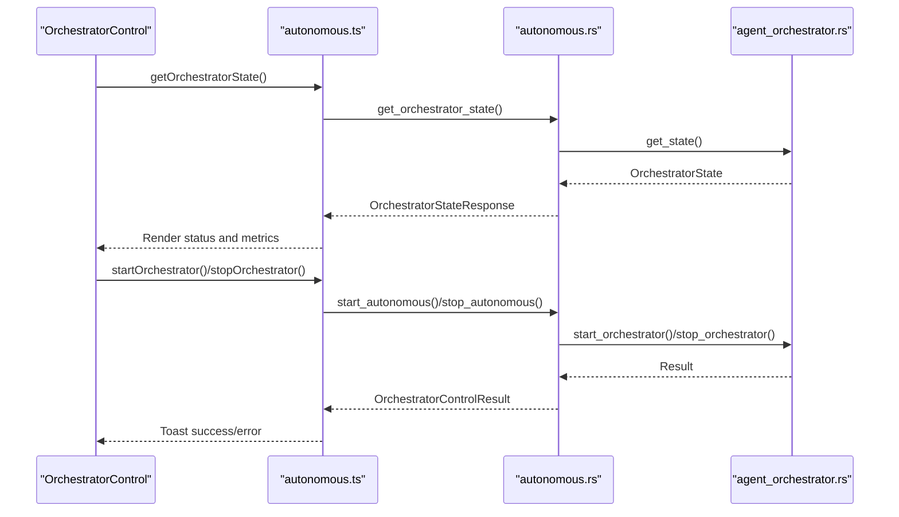
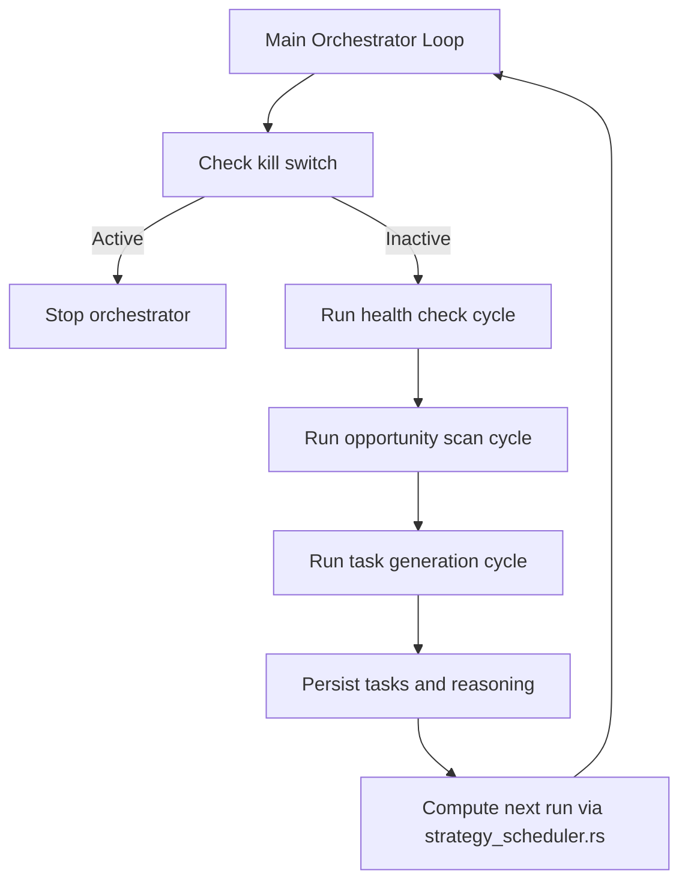
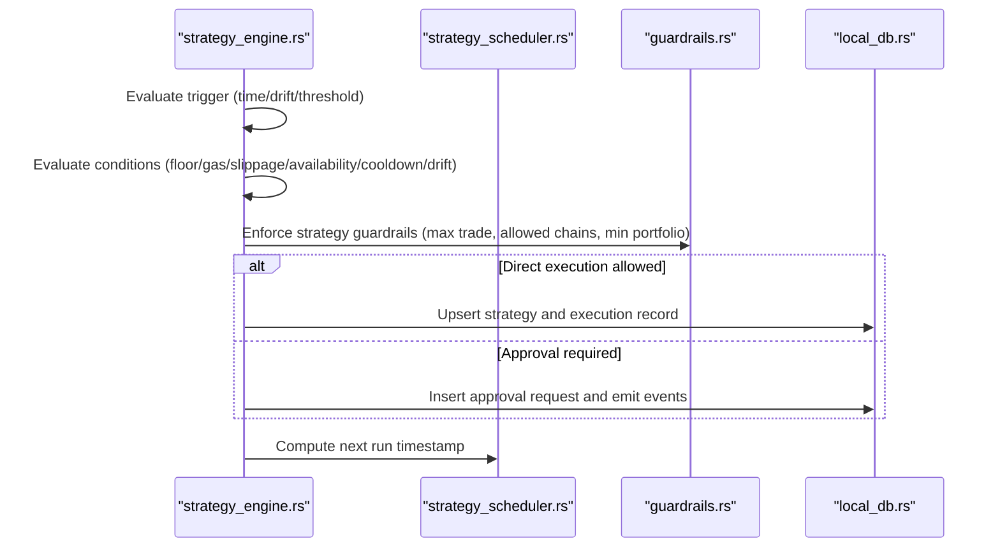
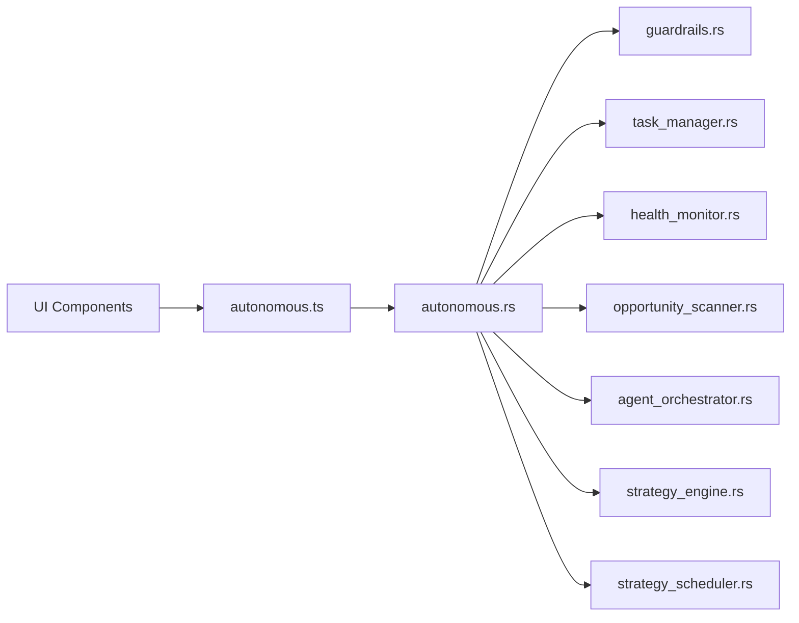

# Autonomous Operations

<cite>
**Referenced Files in This Document**
- [AutonomousDashboard.tsx](file://src/components/autonomous/AutonomousDashboard.tsx)
- [TaskQueue.tsx](file://src/components/autonomous/TaskQueue.tsx)
- [HealthDashboard.tsx](file://src/components/autonomous/HealthDashboard.tsx)
- [OpportunityFeed.tsx](file://src/components/autonomous/OpportunityFeed.tsx)
- [GuardrailsPanel.tsx](file://src/components/autonomous/GuardrailsPanel.tsx)
- [OrchestratorControl.tsx](file://src/components/autonomous/OrchestratorControl.tsx)
- [autonomous.ts](file://src/lib/autonomous.ts)
- [task_manager.rs](file://src-tauri/src/services/task_manager.rs)
- [health_monitor.rs](file://src-tauri/src/services/health_monitor.rs)
- [opportunity_scanner.rs](file://src-tauri/src/services/opportunity_scanner.rs)
- [guardrails.rs](file://src-tauri/src/services/guardrails.rs)
- [agent_orchestrator.rs](file://src-tauri/src/services/agent_orchestrator.rs)
- [strategy_engine.rs](file://src-tauri/src/services/strategy_engine.rs)
- [strategy_scheduler.rs](file://src-tauri/src/services/strategy_scheduler.rs)
- [autonomous.rs](file://src-tauri/src/commands/autonomous.rs)
- [autonomous.ts](file://src/types/autonomous.ts)
</cite>

## Table of Contents
1. [Introduction](#introduction)
2. [Project Structure](#project-structure)
3. [Core Components](#core-components)
4. [Architecture Overview](#architecture-overview)
5. [Detailed Component Analysis](#detailed-component-analysis)
6. [Dependency Analysis](#dependency-analysis)
7. [Performance Considerations](#performance-considerations)
8. [Troubleshooting Guide](#troubleshooting-guide)
9. [Conclusion](#conclusion)
10. [Appendices](#appendices)

## Introduction
This document explains SHADOW Protocol’s autonomous operation system that runs 24/7 to manage portfolios proactively. It covers the Autonomous Dashboard UI, TaskQueue for scheduling strategy execution, HealthDashboard for system monitoring, OpportunityFeed for DeFi discovery, GuardrailsPanel for risk management, and OrchestratorControl for manual intervention. It also documents the background task scheduling, health monitoring, guardrails enforcement, and the relationship between autonomous operations and user-configured strategies and execution preferences.

## Project Structure
The autonomous system spans React UI components and a Rust backend with Tauri command bindings:
- Frontend autonomous UI lives under src/components/autonomous and integrates with src/lib/autonomous.ts for Tauri invocations.
- Backend services live under src-tauri/src/services and expose commands via src-tauri/src/commands/autonomous.rs.
- Types shared between frontend and backend are defined in src/types/autonomous.ts.

**Diagram sources**
- [AutonomousDashboard.tsx:1-84](file://src/components/autonomous/AutonomousDashboard.tsx#L1-L84)
- [TaskQueue.tsx:1-89](file://src/components/autonomous/TaskQueue.tsx#L1-L89)
- [HealthDashboard.tsx:1-199](file://src/components/autonomous/HealthDashboard.tsx#L1-L199)
- [OpportunityFeed.tsx:1-160](file://src/components/autonomous/OpportunityFeed.tsx#L1-L160)
- [GuardrailsPanel.tsx:1-327](file://src/components/autonomous/GuardrailsPanel.tsx#L1-L327)
- [OrchestratorControl.tsx:1-248](file://src/components/autonomous/OrchestratorControl.tsx#L1-L248)
- [autonomous.ts:1-478](file://src/lib/autonomous.ts#L1-L478)
- [agent_orchestrator.rs:1-571](file://src-tauri/src/services/agent_orchestrator.rs#L1-L571)
- [task_manager.rs:1-633](file://src-tauri/src/services/task_manager.rs#L1-L633)
- [health_monitor.rs:1-573](file://src-tauri/src/services/health_monitor.rs#L1-L573)
- [opportunity_scanner.rs:1-599](file://src-tauri/src/services/opportunity_scanner.rs#L1-L599)
- [guardrails.rs:1-620](file://src-tauri/src/services/guardrails.rs#L1-L620)
- [strategy_engine.rs:1-726](file://src-tauri/src/services/strategy_engine.rs#L1-L726)
- [strategy_scheduler.rs:1-64](file://src-tauri/src/services/strategy_scheduler.rs#L1-L64)
- [autonomous.rs:1-786](file://src-tauri/src/commands/autonomous.rs#L1-L786)

**Section sources**
- [AutonomousDashboard.tsx:1-84](file://src/components/autonomous/AutonomousDashboard.tsx#L1-L84)
- [autonomous.ts:1-478](file://src/lib/autonomous.ts#L1-L478)
- [autonomous.rs:1-786](file://src-tauri/src/commands/autonomous.rs#L1-L786)

## Core Components
- AutonomousDashboard: Aggregates TaskQueue, HealthDashboard, OpportunityFeed, GuardrailsPanel, and OrchestratorControl into a unified dashboard.
- TaskQueue: Displays pending tasks, allows approval/rejection, and shows task priority, confidence, and expiry.
- HealthDashboard: Shows portfolio health scores, drift analysis, and active alerts; supports on-demand health checks.
- OpportunityFeed: Discovers DeFi opportunities personalized to user preferences and portfolio context; supports scanning and dismissal.
- GuardrailsPanel: Manages spending limits, blocked tokens/protocols, slippage, and emergency kill switch.
- OrchestratorControl: Starts/stops the autonomous orchestrator, shows activity timeline, and displays pending tasks and errors.

**Section sources**
- [AutonomousDashboard.tsx:1-84](file://src/components/autonomous/AutonomousDashboard.tsx#L1-L84)
- [TaskQueue.tsx:1-89](file://src/components/autonomous/TaskQueue.tsx#L1-L89)
- [HealthDashboard.tsx:1-199](file://src/components/autonomous/HealthDashboard.tsx#L1-L199)
- [OpportunityFeed.tsx:1-160](file://src/components/autonomous/OpportunityFeed.tsx#L1-L160)
- [GuardrailsPanel.tsx:1-327](file://src/components/autonomous/GuardrailsPanel.tsx#L1-L327)
- [OrchestratorControl.tsx:1-248](file://src/components/autonomous/OrchestratorControl.tsx#L1-L248)

## Architecture Overview
The autonomous system is orchestrated by agent_orchestrator.rs, which periodically runs health checks, scans for opportunities, and generates tasks. Guardrails enforce safety constraints before any action is executed. Tauri commands bridge the UI to backend services.

**Diagram sources**
- [autonomous.ts:1-478](file://src/lib/autonomous.ts#L1-L478)
- [autonomous.rs:1-786](file://src-tauri/src/commands/autonomous.rs#L1-L786)
- [agent_orchestrator.rs:1-571](file://src-tauri/src/services/agent_orchestrator.rs#L1-L571)
- [health_monitor.rs:1-573](file://src-tauri/src/services/health_monitor.rs#L1-L573)
- [opportunity_scanner.rs:1-599](file://src-tauri/src/services/opportunity_scanner.rs#L1-L599)
- [task_manager.rs:1-633](file://src-tauri/src/services/task_manager.rs#L1-L633)
- [guardrails.rs:1-620](file://src-tauri/src/services/guardrails.rs#L1-L620)

## Detailed Component Analysis

### AutonomousDashboard
- Hosts a tabbed layout for Tasks, Health, Opportunities, and Guardrails.
- Provides a Control sidebar with OrchestratorControl for runtime toggling and monitoring.

**Section sources**
- [AutonomousDashboard.tsx:1-84](file://src/components/autonomous/AutonomousDashboard.tsx#L1-L84)

### TaskQueue
- Fetches pending tasks via get_pending_tasks().
- Renders task cards with priority, confidence, source, and expiry.
- Supports approving or rejecting tasks; updates UI state and shows toast feedback.
- Uses guardrails validation on approval via backend approve_task().

**Diagram sources**
- [TaskQueue.tsx:1-89](file://src/components/autonomous/TaskQueue.tsx#L1-L89)
- [autonomous.ts:172-182](file://src/lib/autonomous.ts#L172-L182)
- [autonomous.rs:307-344](file://src-tauri/src/commands/autonomous.rs#L307-L344)
- [task_manager.rs:431-502](file://src-tauri/src/services/task_manager.rs#L431-L502)
- [guardrails.rs:277-426](file://src-tauri/src/services/guardrails.rs#L277-L426)

**Section sources**
- [TaskQueue.tsx:1-89](file://src/components/autonomous/TaskQueue.tsx#L1-L89)
- [autonomous.ts:17-182](file://src/lib/autonomous.ts#L17-L182)
- [autonomous.rs:307-344](file://src-tauri/src/commands/autonomous.rs#L307-L344)
- [task_manager.rs:431-502](file://src-tauri/src/services/task_manager.rs#L431-L502)
- [guardrails.rs:277-426](file://src-tauri/src/services/guardrails.rs#L277-L426)

### HealthDashboard
- Loads latest health and alerts via getLatestHealth() and getHealthAlerts().
- Displays overall score, drift/concentration/performance/risk scores, and drift analysis.
- Supports manual health check via runHealthCheck().

**Diagram sources**
- [HealthDashboard.tsx:1-199](file://src/components/autonomous/HealthDashboard.tsx#L1-L199)
- [autonomous.ts:292-367](file://src/lib/autonomous.ts#L292-L367)
- [autonomous.rs:435-481](file://src-tauri/src/commands/autonomous.rs#L435-L481)
- [health_monitor.rs:106-221](file://src-tauri/src/services/health_monitor.rs#L106-L221)

**Section sources**
- [HealthDashboard.tsx:1-199](file://src/components/autonomous/HealthDashboard.tsx#L1-L199)
- [autonomous.ts:292-367](file://src/lib/autonomous.ts#L292-L367)
- [autonomous.rs:435-481](file://src-tauri/src/commands/autonomous.rs#L435-L481)
- [health_monitor.rs:106-221](file://src-tauri/src/services/health_monitor.rs#L106-L221)

### OpportunityFeed
- Retrieves matched opportunities via getOpportunities(limit).
- Displays opportunity cards with risk level, APY, chain, protocol, and reasons.
- Supports scanning opportunities and dismissing them.

**Diagram sources**
- [OpportunityFeed.tsx:1-160](file://src/components/autonomous/OpportunityFeed.tsx#L1-L160)
- [autonomous.ts:370-422](file://src/lib/autonomous.ts#L370-L422)
- [autonomous.rs:537-550](file://src-tauri/src/commands/autonomous.rs#L537-L550)
- [opportunity_scanner.rs:536-558](file://src-tauri/src/services/opportunity_scanner.rs#L536-L558)

**Section sources**
- [OpportunityFeed.tsx:1-160](file://src/components/autonomous/OpportunityFeed.tsx#L1-L160)
- [autonomous.ts:370-422](file://src/lib/autonomous.ts#L370-L422)
- [autonomous.rs:537-550](file://src-tauri/src/commands/autonomous.rs#L537-L550)
- [opportunity_scanner.rs:536-558](file://src-tauri/src/services/opportunity_scanner.rs#L536-L558)

### GuardrailsPanel
- Loads and saves guardrails via getGuardrails() and setGuardrails().
- Manages blocked tokens/protocols, spending limits, slippage, and kill switch activation/deactivation.
- Enforces guardrails on task approvals and strategy actions.

**Diagram sources**
- [GuardrailsPanel.tsx:1-327](file://src/components/autonomous/GuardrailsPanel.tsx#L1-L327)
- [autonomous.ts:202-289](file://src/lib/autonomous.ts#L202-L289)
- [autonomous.rs:74-149](file://src-tauri/src/commands/autonomous.rs#L74-L149)
- [guardrails.rs:182-230](file://src-tauri/src/services/guardrails.rs#L182-L230)

**Section sources**
- [GuardrailsPanel.tsx:1-327](file://src/components/autonomous/GuardrailsPanel.tsx#L1-L327)
- [autonomous.ts:202-289](file://src/lib/autonomous.ts#L202-L289)
- [autonomous.rs:74-149](file://src-tauri/src/commands/autonomous.rs#L74-L149)
- [guardrails.rs:182-230](file://src-tauri/src/services/guardrails.rs#L182-L230)

### OrchestratorControl
- Starts/stops the autonomous orchestrator and refreshes state periodically.
- Displays pending tasks, tasks generated, and activity timeline.
- Shows errors collected during orchestration cycles.

**Diagram sources**
- [OrchestratorControl.tsx:1-248](file://src/components/autonomous/OrchestratorControl.tsx#L1-L248)
- [autonomous.ts:424-477](file://src/lib/autonomous.ts#L424-L477)
- [autonomous.rs:589-636](file://src-tauri/src/commands/autonomous.rs#L589-L636)
- [agent_orchestrator.rs:92-148](file://src-tauri/src/services/agent_orchestrator.rs#L92-L148)

**Section sources**
- [OrchestratorControl.tsx:1-248](file://src/components/autonomous/OrchestratorControl.tsx#L1-L248)
- [autonomous.ts:424-477](file://src/lib/autonomous.ts#L424-L477)
- [autonomous.rs:589-636](file://src-tauri/src/commands/autonomous.rs#L589-L636)
- [agent_orchestrator.rs:92-148](file://src-tauri/src/services/agent_orchestrator.rs#L92-L148)

### Background Task Scheduling and Orchestration
- agent_orchestrator.rs coordinates periodic cycles:
  - Health checks at configured intervals.
  - Opportunity scans at configured intervals.
  - Task generation based on health alerts and drift analysis.
- Guardrails are enforced before task execution and strategy actions.
- Strategy engine evaluates user-defined strategies against triggers and conditions.

**Diagram sources**
- [agent_orchestrator.rs:150-231](file://src-tauri/src/services/agent_orchestrator.rs#L150-L231)
- [strategy_scheduler.rs:8-36](file://src-tauri/src/services/strategy_scheduler.rs#L8-L36)
- [guardrails.rs:232-235](file://src-tauri/src/services/guardrails.rs#L232-L235)

**Section sources**
- [agent_orchestrator.rs:150-231](file://src-tauri/src/services/agent_orchestrator.rs#L150-L231)
- [strategy_scheduler.rs:8-36](file://src-tauri/src/services/strategy_scheduler.rs#L8-L36)
- [guardrails.rs:232-235](file://src-tauri/src/services/guardrails.rs#L232-L235)

### Relationship Between Autonomous Operations and Strategies
- Strategy engine evaluates compiled strategies against triggers (time-based, drift thresholds, thresholds) and conditions (portfolio floor, gas, slippage, availability, cooldown, drift minimum).
- Strategy actions (DCA buy, rebalance to target, alert-only) are emitted as approval requests when required, otherwise executed directly subject to guardrails.
- Strategy scheduler computes next run timestamps based on trigger type and evaluation intervals.

**Diagram sources**
- [strategy_engine.rs:120-725](file://src-tauri/src/services/strategy_engine.rs#L120-L725)
- [strategy_scheduler.rs:8-36](file://src-tauri/src/services/strategy_scheduler.rs#L8-L36)
- [guardrails.rs:277-426](file://src-tauri/src/services/guardrails.rs#L277-L426)

**Section sources**
- [strategy_engine.rs:120-725](file://src-tauri/src/services/strategy_engine.rs#L120-L725)
- [strategy_scheduler.rs:8-36](file://src-tauri/src/services/strategy_scheduler.rs#L8-L36)
- [guardrails.rs:277-426](file://src-tauri/src/services/guardrails.rs#L277-L426)

## Dependency Analysis
- UI components depend on src/lib/autonomous.ts for Tauri invocations.
- Tauri commands delegate to backend services:
  - Guardrails: guardrails.rs
  - Tasks: task_manager.rs
  - Health: health_monitor.rs
  - Opportunities: opportunity_scanner.rs
  - Orchestrator: agent_orchestrator.rs
  - Strategies: strategy_engine.rs and strategy_scheduler.rs
- Types are defined centrally in src/types/autonomous.ts and mirrored in Rust structs for serialization.

**Diagram sources**
- [autonomous.ts:1-478](file://src/lib/autonomous.ts#L1-L478)
- [autonomous.rs:1-786](file://src-tauri/src/commands/autonomous.rs#L1-L786)
- [guardrails.rs:1-620](file://src-tauri/src/services/guardrails.rs#L1-L620)
- [task_manager.rs:1-633](file://src-tauri/src/services/task_manager.rs#L1-L633)
- [health_monitor.rs:1-573](file://src-tauri/src/services/health_monitor.rs#L1-L573)
- [opportunity_scanner.rs:1-599](file://src-tauri/src/services/opportunity_scanner.rs#L1-L599)
- [agent_orchestrator.rs:1-571](file://src-tauri/src/services/agent_orchestrator.rs#L1-L571)
- [strategy_engine.rs:1-726](file://src-tauri/src/services/strategy_engine.rs#L1-L726)
- [strategy_scheduler.rs:1-64](file://src-tauri/src/services/strategy_scheduler.rs#L1-L64)

**Section sources**
- [autonomous.ts:1-478](file://src/lib/autonomous.ts#L1-L478)
- [autonomous.rs:1-786](file://src-tauri/src/commands/autonomous.rs#L1-L786)

## Performance Considerations
- Task generation caps: The orchestrator enforces a maximum number of pending tasks to prevent backlog growth.
- Interval tuning: Health checks, opportunity scans, and general cycles are configurable to balance responsiveness and resource usage.
- Guardrail checks: Validation occurs before execution to avoid wasted work on blocked actions.
- Strategy evaluation: Conditions short-circuit early to minimize unnecessary computation.

[No sources needed since this section provides general guidance]

## Troubleshooting Guide
Common scenarios and resolutions:
- Task approval fails due to guardrails:
  - Verify blocked tokens/protocols, slippage, and kill switch status.
  - Adjust GuardrailsPanel settings and retry.
- Kill switch active:
  - Deactivate via GuardrailsPanel; orchestrator will restart automatically if enabled.
- No tasks appearing:
  - Trigger a manual health check and opportunity scan; ensure orchestrator is running.
- Frequent errors in OrchestratorControl:
  - Review error logs captured in orchestrator state; resolve underlying causes (network, data freshness).
- Strategy not executing:
  - Confirm trigger conditions and strategy guardrails; ensure sufficient portfolio value and allowed chains.

**Section sources**
- [GuardrailsPanel.tsx:56-71](file://src/components/autonomous/GuardrailsPanel.tsx#L56-L71)
- [OrchestratorControl.tsx:197-211](file://src/components/autonomous/OrchestratorControl.tsx#L197-L211)
- [agent_orchestrator.rs:163-175](file://src-tauri/src/services/agent_orchestrator.rs#L163-L175)
- [guardrails.rs:232-275](file://src-tauri/src/services/guardrails.rs#L232-L275)

## Conclusion
SHADOW’s autonomous operations combine a responsive UI with a robust backend orchestrator. The system continuously monitors portfolio health, discovers opportunities, enforces strict guardrails, and schedules tasks for execution. Users retain control via the GuardrailsPanel and OrchestratorControl, ensuring transparency and safety in 24/7 autonomous operation.

[No sources needed since this section summarizes without analyzing specific files]

## Appendices

### Security Measures for Background Operations
- All guardrail validation happens in the backend to prevent client-side bypass.
- Kill switch blocks all autonomous actions until manually deactivated.
- Approval flows are used for high-value or risky actions.

**Section sources**
- [guardrails.rs:277-426](file://src-tauri/src/services/guardrails.rs#L277-L426)
- [task_manager.rs:431-502](file://src-tauri/src/services/task_manager.rs#L431-L502)

### Logging and Auditing
- Backend services log significant events (health checks, violations, orchestrator state).
- Audit records capture guardrail violations and configuration changes.

**Section sources**
- [health_monitor.rs:207-218](file://src-tauri/src/services/health_monitor.rs#L207-L218)
- [guardrails.rs:484-519](file://src-tauri/src/services/guardrails.rs#L484-L519)
- [autonomous.rs:219-228](file://src-tauri/src/commands/autonomous.rs#L219-L228)

### Automatic Recovery Procedures
- Orchestrator stops automatically if kill switch is detected.
- Strategy engine pauses strategies exceeding configured limits and records audit events.

**Section sources**
- [agent_orchestrator.rs:169-175](file://src-tauri/src/services/agent_orchestrator.rs#L169-L175)
- [strategy_engine.rs:403-434](file://src-tauri/src/services/strategy_engine.rs#L403-L434)